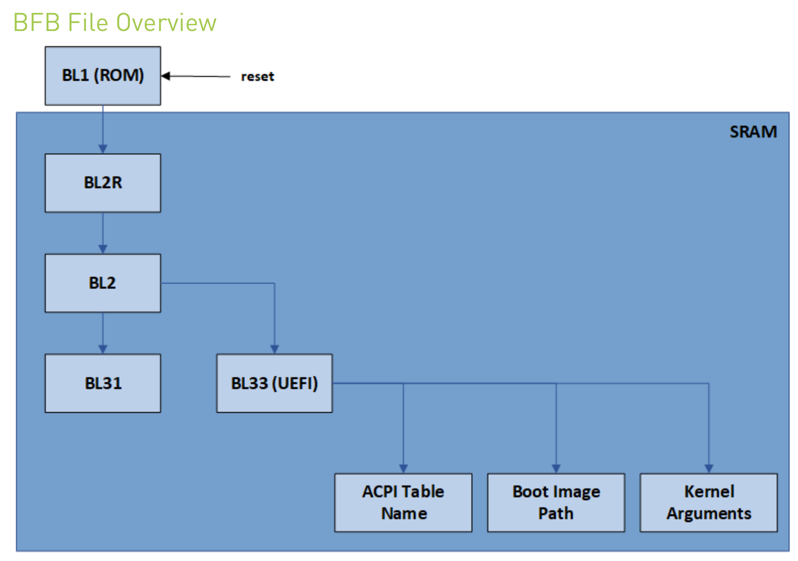
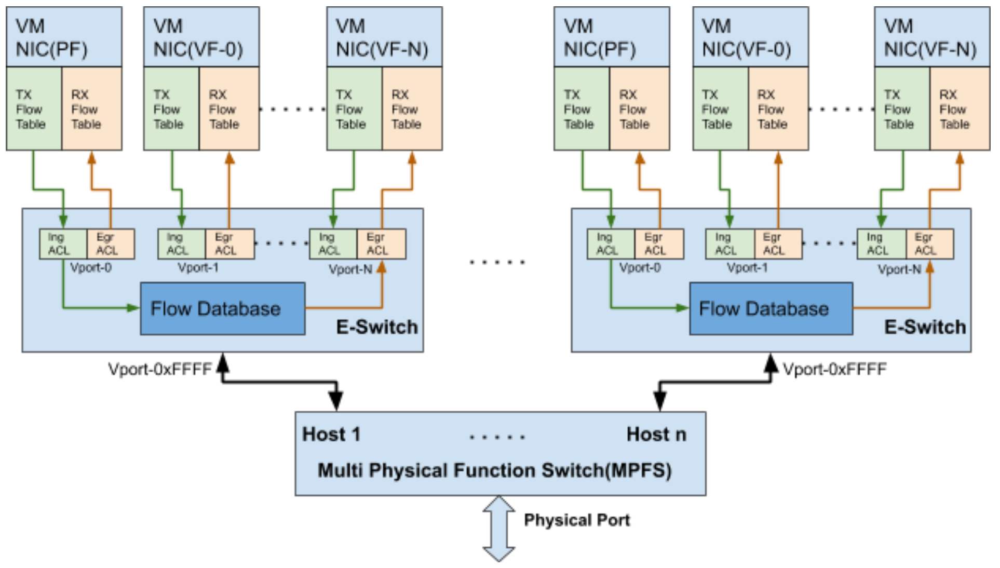
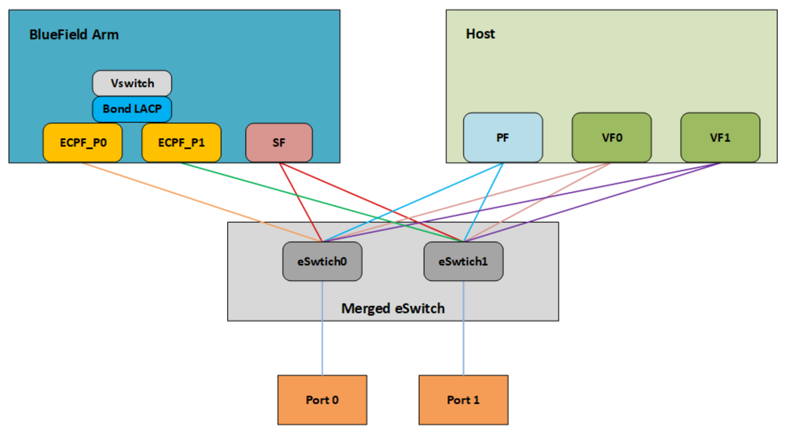
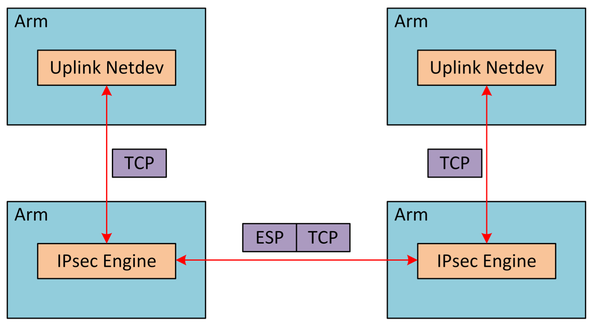
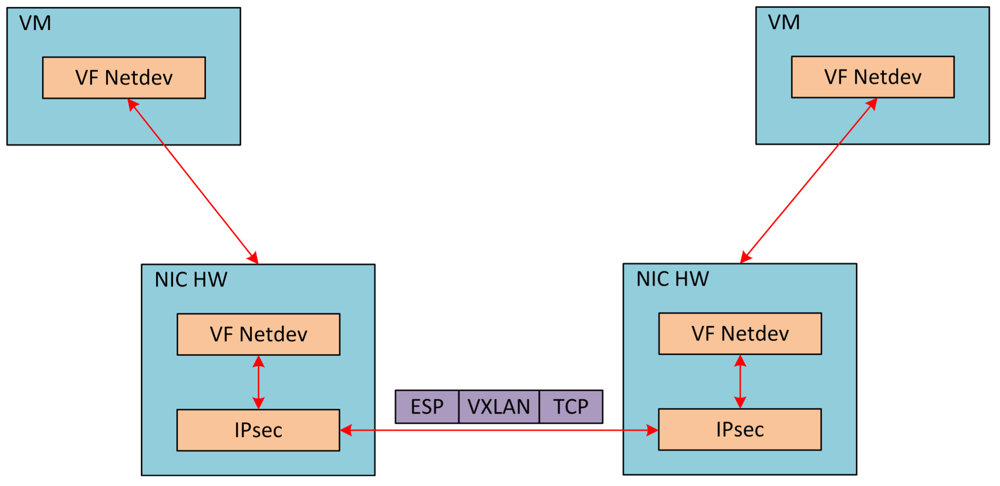

# mallenox bluefield2

https://docs.mellanox.com/

BlueField Architecture

System Connections

BFB File Overview

BlueField Boot Process

Building Arm Trusted Firmware

Functional Diagram

Kernel Representors Model

Multi-host

BlueField Link Aggregation

IPsec Full Offload

IPsec Full Offload and OVS Offload

