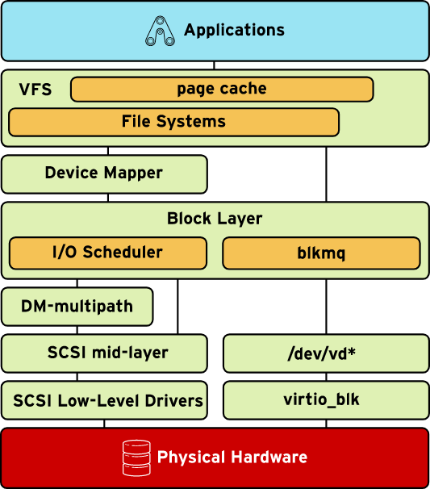
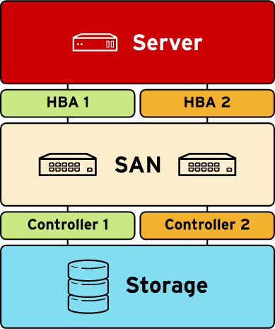

```bash
lastlog -u student

getent passwd student

chsh -s /bin/bash student

# Jump to the end of the journal (-e, and enable follow mode (-f)
journalctl -ef
# This will display all messages generated by, and about, the sshd.service systemd unit.
journalctl -u sshd.service
# Display all messages in the journal with a priority in the range emerg up to and including err.
journalctl -p emerg..err
# Only show messages from the last system boot
journalctl -b -1

journalctl --since "2015-02-02 20:30:00" --until "2015-03-31 12:00:00"

journalctl -o verbose

# Enabling a persistent journal can be done by using the following steps:
mkdir /var/log/journal
chown root:systemd-journal /var/log/journal
chmod 2755 /var/log/journal

# Check the SELinux log for any denials today.
ausearch -i -m avc -ts today
restorecon -Rv /var/www

sos-report
redhat-support-tool
yum -y install redhat-access-insights
redhat-access-insights --register
yum -y install sos
sosreport -k xfs.logprint

# /etc/rsyslog.conf
logger "Test from logclient"

systemctl is-active rsyslog
systemctl is-enabled rsyslog

# Advanced Intrusion Detection Environment (AIDE)
yum install -y aide
# /etc/aide.conf
aide --init
aide --check

# Adds a recursive watch to the /etc/sysconfig directory and all files and directories beneath it. Watches for read, write, and attribute change access. Labels log messages with a custom key of sysconfig-access.
auditctl -w /etc/sysconfig/ -p rwa -k sysconfig-access
# Audits all executions of binaries under /bin.
auditctl -w /bin -p x

yum -y install pcp
systemctl start pmcd
pmstat -s 5
pmatop
pminfo
pminfo -dt proc.nprocs
pmval -s 5 proc.nprocs
systemctl start pmlogger
pmval -a /var/log/pcp/pmlogger/serverX.example.com/20150224.00.10.0 kernel.all.load

```

A Basic Input Output System (BIOS)-powered system goes through a number of steps from being powered down to having a running Red Hat Enterprise Linux system. The following list gives a high-level overview of the steps being taken. This list also applies to virtual machines that emulate a traditional BIOS system. This list assumes that the grub2 boot loader is being used. For different boot loaders, the list will differ.

The BIOS firmware is started and performs a Power On Self Test (POST).

The BIOS scans for (possible) boot devices, and orders them according to a user-set preference.

The boot devices are scanned in order for a boot firmware (such as a PXE ROM on network cards), an Master Boot Record (MBR), or a partition marked as bootable. If found, the BIOS executes it.

The first-stage boot loader stored in the MBR loads the stage 1.5 (drivers) and stage 2 boot loader from disk and executes it.

The boot loader loads a configuration file from disk. In the case of grub2, this will be /boot/grub2/grub.cfg.

The configuration file is parsed, and based on its contents, a boot entry is selected automatically or by the user.

The kernel and initial ramdisk referenced in the boot entry are loaded from disk, and control is handed over to the kernel.

The kernel starts, and initializes hardware using the drivers found in the initial ramdisk. A simple init system is also started from the ramdisk.

The scripts in the initial ramdisk mount the root file system of the target system, then switch root to the newly mounted file system, and hand over control to /sbin/init on the target root file system.

The init system mounts file systems and starts services according to its configuration.

```bash
# /etc/default/grub
# GRUB_TIMEOUT
# GRUB_DEFAULT
# GRUB_CMDLINE_LINUX
grub2-mkconfig -o /boot/grub2/grub.cfg

chroot /mnt/sysimage
grub2-install /dev/vda
```
In order to boot a UEFI system using grub2, an EFI System Partition (ESP) needs to be present on disk. This partition should have the GPT UUID C12A7328-F81F-11D2-BA4B-00A0C93EC93B, or the MBR type 0xEF. This partition needs to be formatted with a FAT file system, and should be large enough to hold all bootable kernels and the boot loader itself. A size of 512 MiB is recommended, but smaller sizes will work. This partition should be mounted at /boot/efi, and will normally be created by the anaconda installer.

In order to work with Secure Boot systems, where signatures on boot loaders, kernels, etc., can be checked by the firmware to authenticate that only unmodified software is run, Red Hat Enterprise Linux 7 utilizes the shim UEFI boot loader.

The shim.efi application is signed with a key trusted by most UEFI firmware. When started, it will attempt to load grubx64.efi using the normal UEFI firmware calls. If the UEFI firmware refuses to load the application due to a bad signature, shim will attempt to verify the application using other keys compiled into shim, or a user-generated key stored in the UEFI NVRAM (Machine Owner Key (MOK)). When attempting to start a signed application for which no keys have been registered, the MokManager.efi application is started automatically so that an end user can register a personal key.

The shim.efi application also registers a new UEFI system call that can be used by grub2 to verify kernel signatures.

If shim.efi is not registered with the UEFI firmware, booting from the disk that contains the ESP will launch the /boot/efi/EFI/BOOT/BOOTX64.efi application. This in turn will launch the fallback.efi application, which automatically registers the shim.efi application and boots the system, based on the settings in /boot/efi/EFI/redhat/BOOT.CSV.
```bash
yum reinstall grub2-efi shim
grub2-mkconfig -o /boot/efi/EFI/redhat/grub.cfg

efibootmgr
# Removing an entry
efibootmgr -b 1E -B
# Selecting a temporary boot target
efibootmgr -n 2c
# Adding an entry
efibootmgr -c -d /dev/sda -p 2 -L "Yippie" -l "\EFI\yippie.efi"

systemctl list-dependencies nfs-server.service
yum -y install graphviz
systemd-analyze dot sshd.service | dot -Tsvg > sshd-dependencies.svg

mount -oremount,rw /sysroot
chroot /sysroot
echo redhat | passwd --stdin root
load_policy -i
touch /.autorelabel
restorecon -Rv /etc

lscpu
dmidecode -t memory
lsscsi -v
hdparm -I /dev/sda
lspci
lsusb

yum install mcelog
systemctl enable mcelog
systemctl start mcelog
journalctl -u mcelog.service
# /var/log/mcelog

yum install rasdaemon
systemctl enable rasdaemon
systemctl start rasdaemon
ras-mc-ctl --status
ras-mc-ctl --errors

yum install memtest86+
memtest-setup
grub2-mkconfig -o /boot/grub2/grub.cfg

# View the options for the megaraid_sas.ko kernel module:
modinfo -p megaraid_sas
# Load the megaraid_sas.ko kernel module manually.
modprobe -v megaraid_sas
# Unload the megaraid_sas.ko module.
modprobe -rv megaraid_sas

virsh capabilities
xmllint somemachine.xml
virt-xml-validate somemachine.xml

```


```bash
# memory usage of those caches is tracked in /proc/slabinfo.
free
cat /proc/meminfo
# caches can be cleared by running:
echo 3 > /proc/sys/vm/drop_caches

dmsetup ls
# myvg1-mylv1    (252:0)
ls -l /dev/mapper/myvg1-mylv1
# lrwxrwxrwx. 1 root root 7 Feb 26 09:40 /dev/mapper/myvg1-mylv1 -> ../dm-0
dmsetup table /dev/mapper/myvg1-mylv1
# 0 1015808 linear 253:17 2048
# 1015808 1015808 linear 253:18 2048
ls -l /dev/vdb*
# brw-rw----. 1 root disk 253, 16 Feb 26 09:31 /dev/vdb
# brw-rw----. 1 root disk 253, 17 Feb 26 09:40 /dev/vdb1
# brw-rw----. 1 root disk 253, 18 Feb 26 09:40 /dev/vdb2

```
In Red Hat Enterprise Linux 7, most devices pass block I/O requests through one of three request-based I/O scheduler algorithms:

deadline is the default for most block devices in RHEL 7 except for SATA devices and paravirtualized virtio_blk storage. It focuses on making sure that requests are sorted to be efficiently sent to the device unless requests have been waiting too long, in which case they are sent immediately, biasing read requests ahead of writes

cfq ("completely fair queuing") is the default for SATA disks, and for most disks in RHEL 6 systems. Each process has a request queue for synchronous writes, there are a smaller number of queues for asynchronous I/O, and the scheduler processes each of them round-robin for a given time-slice.

noop is a simple first-in, first-out scheduler that does basic merging of requests but no sorting before submitting them to the device. It is particularly good for truly random-access capable devices or ones which do their own scheduling (like enterprise storage controllers).

A new block I/O multi-queuing mechanism called blk-mq bypasses the traditional schedulers and allows certain device drivers to map I/O requests to multiple queues. In the long term, this new system is designed to handle storage with latencies of microseconds, millions of IOPS, and large internal parallelism.

The command blktrace /dev/sda will trace I/O on /dev/sda and save the output to a file named something like sda.blktrace.0 in the current directory. Then the blkparse and btt commands can be used to analyze the results of the trace.

In Red Hat Enterprise Linux, the kernel's device mapper mechanism is used to generate separate block devices to represent different paths to the same storage device. This is managed by the multipathd daemon and the multipath command-line tool, from the device-mapper-multipath package. 

There are four main high-level SCSI drivers. For block devices, the two most important are the SCSI disk (sd) driver and the SCSI CDROM (sr) driver. In addition, there is a high-level SCSI driver for character-based SCSI tape devices (st) and one for generic SCSI devices such as scanners (sg).

Anything that acts like a SCSI device and uses the SCSI protocol to communicate between the low-level driver and the high-level driver uses the SCSI mid-layer. 


```bash
blktrace /dev/sda

xfs_repair -n /dev/vdb1
echo $?

# The list of all archived metadata for a volume group can be displayed by examining the files in /etc/lvm/archive and paying special attention to the description lines
vgcfgrestore -l vg_example

vgcfgrestore -f /etc/lvm/archive/vg_example_00001-1528176681.vg vg_example
# In some cases, it might be necessary to deactivate and then reactivate the logical volume to make sure that all changes are committed in memory as well.
lvchange -an /dev/vg_example/lv_example
lvchange -ay /dev/vg_example/lv_example

# The /etc/crypttab file is consulted for a list of devices to be unlocked during boot
# name  /dev/vdaN  /path/to/keyfile

cryptsetup luksDump /dev/vdb1

iscsiadm -m discovery -t sendtargets -p target_server[:port]
# 172.25.X.11:3260,1 iqn.2016-01.com.example.lab:iscsistorage

iscsiadm -m node
# 172.25.250.254:3260,1 iqn.2016-01.com.example.lab:iscsistorage

systemctl restart iscsid

iscsiadm -m node -T iqn.2016-01.com.example.lab:iscsistorage --login 
-d8

yum deplist yum
rpm -q --requires yum
rpm -q --provides yum
yum list --showduplicates PACKAGE_NAME
yum versionlock list
yum versionlock add WILDCARD
yum versionlock delete WILDCARD
yum versionlock clear

# Corrupt RPM database
lsof | grep /var/lib/rpm
rm /var/lib/rpm/__db*
tar cjvf rpmdb-$(date +%Y%m%d-%H%M).tar.bz2 /var/lib/rpm
cd /var/lib/rpm
/usr/lib/rpm/rpmdb_verify Packages
mv Packages Packages.bad
# /usr/lib/rpm/rpmdb_dump Packages.bad | > /usr/lib/rpm/rpmdb_load Packages
/usr/lib/rpm/rpmdb_verify Packages
rpm -v --rebuilddb

rpm -Va
rpm -Va vsftpd
yum verify vsftpd
yum verify-rpm openssh-server

rpm -qf /usr/bin/ls

subscription-manager status
subscription-manager list --consumed

ping -c 1 -W 3 172.25.250.254
ping6 -I eth0 fe80::5054:ff:fe00:fa09

nmap -n 192.168.37.0/24
nmap -n -sn 192.168.37.0/24

iptraf-ng

firewall-cmd --list-all-zones
firewall-cmd --list-all-zones --permanent
firewall-cmd --runtime-to-permanent

objdump -p /usr/lib64/libpthread-2.17.so | grep SONAME
rpm -qlp glibc-2.17-105.el7.i686.rpm  | grep ld-linux
# /lib/ld-linux.so.2
ldconfig -p
strings /lib64/ld-linux-x86-64.so.2  | grep '^/'
# /t6E
# /~5D9
# /var/tmp
# /var/profile
ldd /usr/sbin/httpd

rpm -q --requires httpd | grep pthread
yum whatprovides '*lib/libpthread.so.0'
rpm -q --scripts libnl

valgrind --tool=memcheck program [program arguments]
valgrind --tool=memcheck --leak-check=full program [program arguments]

strace pwd
strace -p 1552
strace -o /tmp/mytrace -e open,stat mycommand

ltrace pwd
ltrace -p 1729

auditctl -a always,exit -F arch=b64 -S open -F success=0
auditctl -d always,exit -F arch=b64 -S open -F success=0

	
# The -m avc option tells ausearch it should only display Access Vector Control (AVC) messages, the type of message associated with SELinux denials.
# The -ts recent option specifies that messages should be shown starting from 10 minutes ago. 
ausearch -m avc1 -ts recent2

# dontaudit rules
# This means that the action will still be blocked, but it will not be logged.
sesearch -D
semanage dontaudit off
semanage dontaudit on

semanage fcontext -a -t httpd_sys_content_t '/mysites/sitea/www(/.*)?'
restorecon -Rv /mysites/sitea/www

# create an (empty) file called /.autorelabel and reboot. This will cause the system to perform a full file system relabel on the next reboot, and then reboot again.

semanage boolean --list
semanage port -a -t http_port_t -p tcp 8001

seinfo -thttpd_sys_content_t
#    httpd_sys_content_t
#    Aliases
#       httpd_fastcgi_content_t
#       httpd_httpd_sys_script_ro_t
#       httpd_fastcgi_script_ro_t
seinfo --portcon=443 --protocol=tcp
        # portcon tcp 443 system_u:object_r:http_port_t:s0
        # portcon tcp 1-511 system_u:object_r:reserved_port_t:s0
sesearch --allow -b httpd_can_connect_ldap
# Found 1 semantic av rules:
#    allow httpd_t ldap_port_t : tcp_socket name_connect ;

```