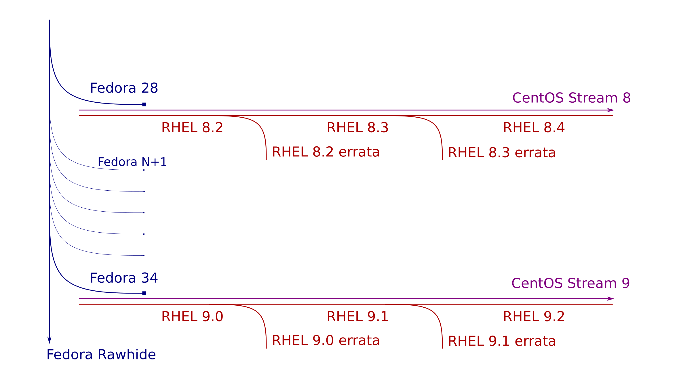

# centos stream


```
Lei Wang, Dec 21, 11:47 PM
Hi @Karen Noel @Amnon Ilan we have onboarded  RHEL on VMware/AWS tests on CKI, only with basic ltp test executed now, Azure is blocked due to account issue, see https://docs.engineering.redhat.com/display/RHELPLAN/Onboarding+a+CI+system.  WALA/cloud-init/open-vm-tools/hyperv-daemons etc cloud daemons are part of gating CI. Other RHEL on Cloud testing are triggered by new kernel brew builds/new composes, the team now covers nightlies as well. @Xiaofeng Wang @Wei Shi please correct me if I am wrong

Amnon Ilan, Dec 22, 12:04 AM
Thank you @Lei Wang , This is great! How about some testing with CentOS Stream as a guest? In RHEL 9 it will become the same as RHEL but in RHEL 8 (e.g. 8.4 now) it is a bit behind. Not sure if we need special testing for that or just need to make sure that critical issues in RHEL get into Stream soon after being fixed


https://docs.engineering.redhat.com/display/RHELPLAN/CentOS+Stream+FAQ
How does this change the RHEL development workflow?
As of this writing (March 2020), tooling and automation are still being developed, so CentOS Stream is in a transitional state.

Following an appropriate milestone -- to be announced widely and repeatedly -- CentOS Stream will be used as the upstream for the next RHEL stable release. That includes:

X.0 public beta to GA, starting with the RHEL 9.0 public beta

Future Y-stream releases of RHEL 8, 9, and beyond

It does not include:

RHEL 7, which will not be developed in CentOS Stream

Z-stream releases of RHEL, which will continue to be developed internally as a subscription benefit for customers

Tooling is being developed, in conjunction with advisors from multiple RHEL kernel and userspace teams, to make this transition as easy as possible for RHEL maintainers. Further details on workflow changes will be available through the RHEL Development Guide and elsewhere.

How is CentOS Stream released?  Are Errata used or is there some other way to release it publicly?


CentOS Stream is released continuously. Builds appear in CentOS Stream publicly after they pass eligible CI/gating. Errata and associated RHEL processes are not used in CentOS Stream, but continue to be used on RHEL builds.

Alexander Bokovoy, Dec 21, 9:48 PM
There might be small difference with GitLab-based dist-git as changes will be seen in CentOS Stream (the same dist-git) but will not really be built in CentOS Stream until the gating process in RHEL passes. This might be the difference that would probably be harder to understand to people not involved in the development.

https://blog.centos.org/2020/12/centos-stream-is-continuous-delivery/
If Linux is the grand challenge of continuous integration and delivery, then I saw RHEL as the unparalleled absolute: take ten thousand uncoordinated projects, thousands of contributors, add additional structure (like kABI) and additional guarantees (like 10 + 3 years of hardware enablement), integrate them constantly, and deliver a stable release every single day.

With dreamy (well, watery) eyes, we called such an effort “Always Ready RHEL”.

The effort started painstakingly onboarding the thousands of packages into continuous integration. It shocked many that we didn’t already have CI for all RHEL components back in 2017. But if it was easy, it would have happened much earlier.

Today, any update that goes into RHEL has to pass continuous integration gating before landing in our nightly compose, which runs automated tests for that component. Then, each change needs to be explicitly verified to a RHEL quality (mostly by Quality Engineering) before it can land in the RHEL nightly builds.

The “Always Ready RHEL” effort now continues with continuous delivery, which you now know as CentOS Stream: the RHEL nightly composes are already delivered in CentOS Stream. The whole point of continuous delivery is to make each release as stable as the one before. We’re delivering daily.

```

```


```