# RH.442

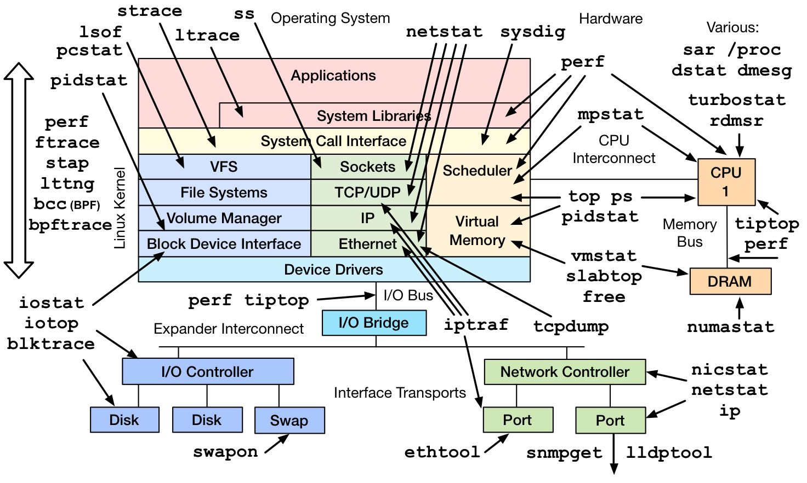
```bash
ps aux
ps -p $(pidof sshd)
ps ax --format pid,%mem,cmd --sort -%mem

free -m
lsblk -fp
findmnt -S /dev/vda1

pidstat -p 23354 1 3

```
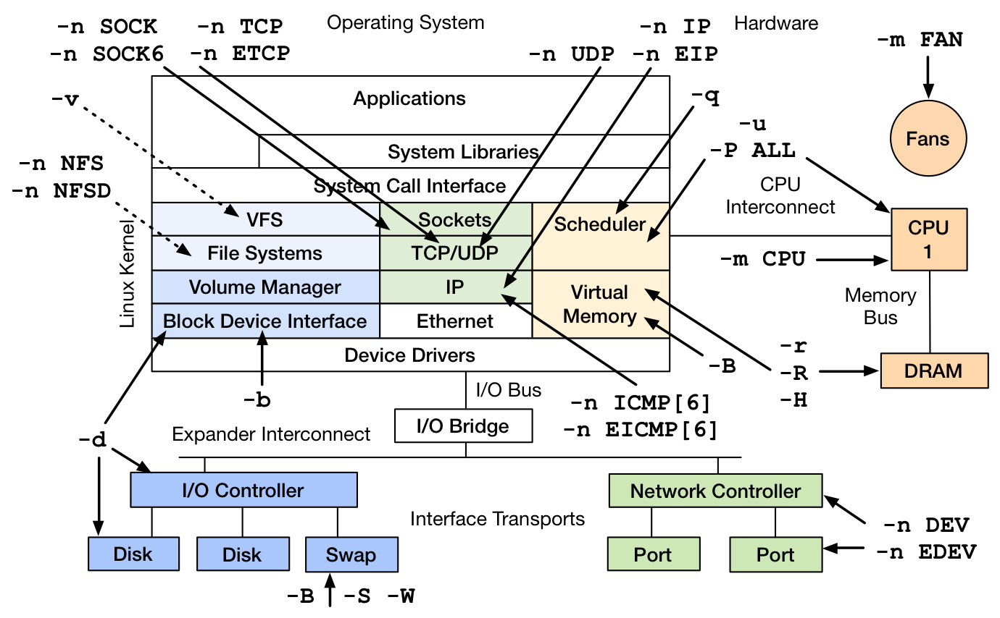
```bash
# sysstat-collect.service
yum install sysstat
cp /usr/lib/systemd/system/sysstat-collect.timer \
/etc/systemd/system/sysstat-collect.timer
systemctl enable --now sysstat-collect.timer

yum install pcp-system-tools
pcp free
pcp dstat

pmchart

pmlogger /var/log/pcp/pmlogger/host.example.com
```
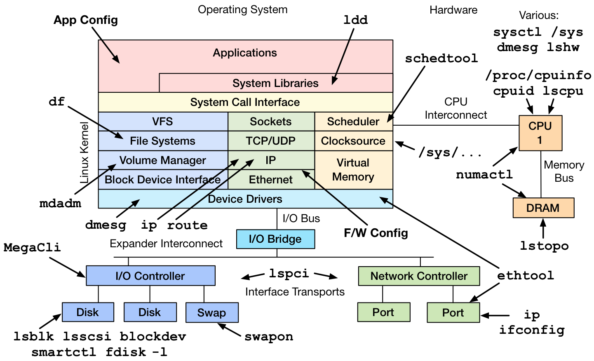
```bash
lscpu -p
# # The following is the parse-able format, which can be fed to other
# # programs. Each different item in every column has an unique ID
# # starting from zero.
# # CPU,Core,Socket,Node,,L1d,L1i,L2
# 0,0,0,0,,0,0,0
# 1,1,0,0,,1,1,1
# 2,2,0,0,,2,2,1
# 3,3,0,0,,3,3,0

getconf -a
# PAGESIZE                           4096
# PAGE_SIZE                          4096
# ...output omitted...
# _AVPHYS_PAGES                      36380772
# _NPROCESSORS_CONF                  24
# _NPROCESSORS_ONLN                  24
# _PHYS_PAGES                        37209409
# ...output omitted...
# LEVEL1_ICACHE_SIZE                 32768
# LEVEL1_ICACHE_ASSOC                4
# LEVEL1_ICACHE_LINESIZE             64
# LEVEL1_DCACHE_SIZE                 32768
# LEVEL1_DCACHE_ASSOC                8
# LEVEL1_DCACHE_LINESIZE             64
# LEVEL2_CACHE_SIZE                  262144
# LEVEL2_CACHE_ASSOC                 8
# LEVEL2_CACHE_LINESIZE              64
# LEVEL3_CACHE_SIZE                  12582912
# LEVEL3_CACHE_ASSOC                 16
# LEVEL3_CACHE_LINESIZE              64
# LEVEL4_CACHE_SIZE                  0
# LEVEL4_CACHE_ASSOC                 0
# LEVEL4_CACHE_LINESIZE              0

# Retrieving SMBIOS/DMI information
dmidecode
ls /sys/class/dmi/id/
head /sys/class/dmi/id/product_*

lspci
lspci -vv

lsusb
lsusb -vv

lstopo-no-graphics

lshw -short
lshw -C system

# Reporting Hardware Errors
yum install rasdaemon
systemctl enable --now rasdaemon
ras-mc-ctl --help
ras-mc-ctl --summary
ras-mc-ctl --errors

virsh dumpxml guest |grep "q35"
# <type arch='x86_64' machine='pc-q35-rhel7.6.0'>hvm</type>

virsh dumpxmlguest |grep "cpu mode"
# <cpu mode='host-passthrough'>

lspci | grep balloon
# 07:00.0 Unclassified device [00ff]: Red Hat, Inc. Virtio memory balloon (rev 01)

grep balloon guest.xml
# <memballoon model='virtio'>
#   <alias name='balloon0'/>
# </memballoon>

kvm_stat
perf kvm stat -- sleep 10

perf kvm --guest --guestmodules=guest-modules \
--guestkallsyms=guest-kallsyms record -a
perf kvm --guest --guestmodules=guest-modules \
--guestkallsyms=guest-kallsyms report --force > guest-analyze

ls -l /proc/sys/kernel/{osrelease,threads-max}
cat /proc/sys/kernel/osrelease
# 4.18.0-80.el8.x86_64
cat /proc/sys/kernel/threads-max
# 14257

```
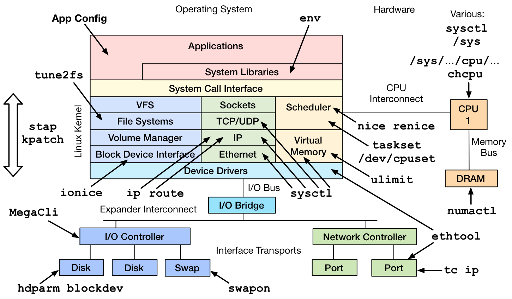
```bash
modinfo loop
modinfo -p loop

tuned-adm active
tuned-adm list
tuned-adm profile throughput-performance
tuned-adm active
tuned-adm recommend

systemd-cgtop
systemd-cgls

systemd-run --slice=example.slice sleep 10d
systemd-cgls /example.slice/run-4321.service
# /example.slice/run-4321.service:
# └─4322 /bin/sleep 10d
systemctl set-property example.service MemoryAccounting=yes
systemctl set-property example.service MemoryLimit=2048M

```
Control systemd slices and cgroups these three ways:

Enable CPU, memory, and/or block I/O accounting for a service or a slice.

Place resource limits on an individual service or slice.

Run services in a custom slice.

```bash
[Unit]
Description=Example Custom Slice
[Slice]
CPUShares=2048
MemoryAccounting=true


```
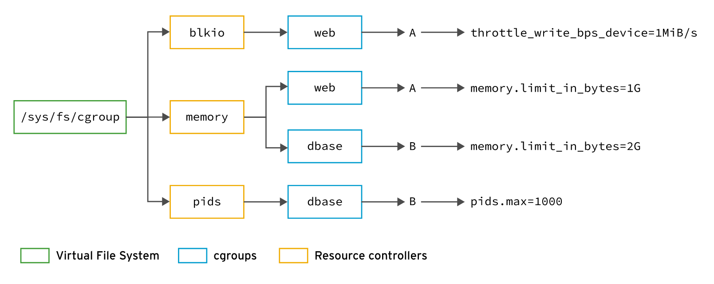

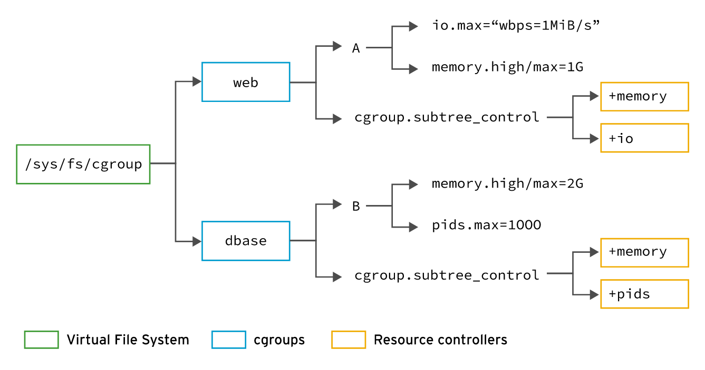

```bash
yum install perf
# Debug symbols are required for performance data 
subscription-manager repos --enable \
rhel-8-for-x86_64-baseos-debug-rpms
uname -r
# 4.18.0-80.el8.x86_64
yum install kernel-debuginfo-4.18.0-80.el8.x86_64 \
kernel-debuginfo-common-x86_64-4.18.0-80.el8.x86_64

perf list

perf stat dd if=/dev/zero of=/dev/null bs=2048 count=10000000

perf stat \
-e cycles,instructions,cache-references,cache-misses,bus-cycles \
-a sleep 10

perf record \
-e cpu-clock,instructions,cache-misses,context-switches \
dd if=/dev/zero of=/dev/null bs=2048 count=10000000

perf report --stdio

perf record -o cs-syswide.data -e context-switches -a sleep 10

perf report -i cs-syswide.data --stdio

strace -c uname
# % time     seconds  usecs/call     calls    errors syscall
# ------ ----------- ----------- --------- --------- ----------------
#  82.28    0.000130          43         3           open
#  17.72    0.000028          14         2           munmap
#   0.00    0.000000           0         1           read

# SystemTap Host System
subscription-manager repos --enable \
rhel-8-for-x86_64-baseos-debug-rpms
yum install systemtap
stap-prep

stap -v /usr/share/systemtap/examples/process/syscalls_by_proc.stp

# create the syscalls_by_proc module in the current directory.
stap -p 4 -v -m syscalls_by_proc \
/usr/share/systemtap/examples/process/syscalls_by_proc.stp
mkdir /lib/modules/$(uname -r)/systemtap
cp /root/syscalls_by_proc.ko /lib/modules/$(uname -r)/systemtap

staprun syscalls_by_proc

yum install systemtap-runtime
firefox /usr/share/systemtap/examples/index.html


```
Extended Berkeley Packet Filter (eBPF) is an in-kernel virtual machine that runs its own bytecode in a secured, restricted environment. 

eBPF works by attaching programs to various kernel points, such as kprobes, tracepoints, and perf events. There are many performance analysis tools that leverage the extended kernel functionality, allowing for more than just filtering packets. These enhancements allow custom analysis programs to be executed on Linux for dynamic tracing, static tracing, and profiling events.

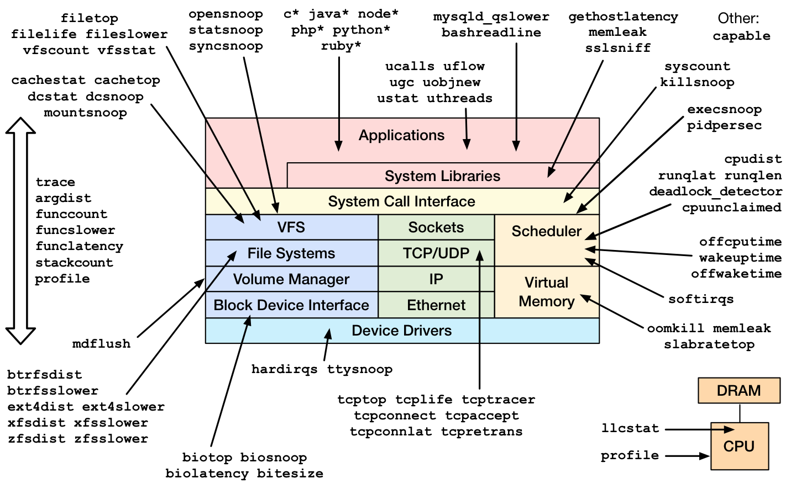

```bash
yum install -y bcc-tools

ls /usr/share/bcc/tools

ls /usr/share/bcc/tools/doc

```

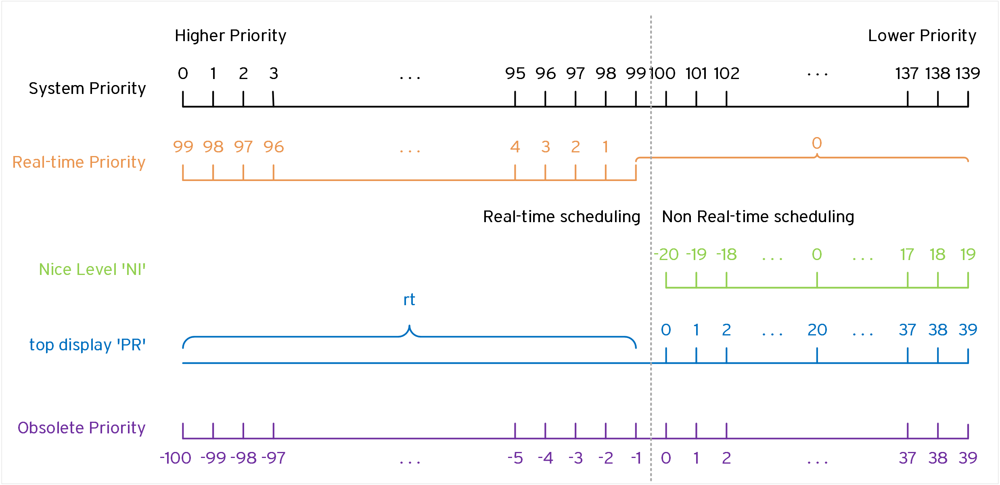

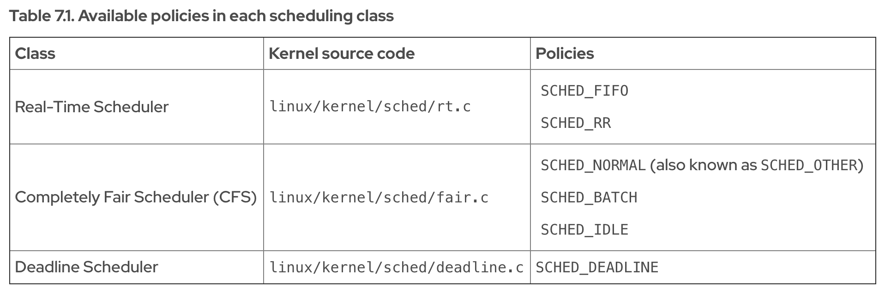

Kernel Tunables for Scheduling Policies

The sysctl command can tune CFS scheduler tunables. These tunables are located in the /proc/sys/kernel/ directory Some are listed here:

sched_latency_ns
Defines the targeted preemption latency. Increasing this variable value increases the timeslice of a CPU bound process. The targeted latency is the period in which all run queue tasks are scheduled at least once. The duration is defined in nanoseconds (ns).

sched_min_granularity_ns
Defines the minimum amount of time any scheduled process must be allowed to run before being preempted by another process. The duration is defined in nanoseconds (ns). This variable value must be smaller than sched_latency_ns. If the number of running tasks in the queue is greater than sched_latency_ns divided by sched_min_granularity_ns, then there are too many tasks on the system, and the sched_latency_ns variable cannot satisfy all the minimum granularity time requirements for a task. To accommodate such cases, the scheduler increases the scheduling period by multiplying the number of running of tasks by the sched_min_granularity_ns value.

sched_migration_cost_ns
Defines the require elapsed time after a process' last execution to be considered for migration to another CPU. The duration is defined in nanoseconds (ns). Increasing this variable value reduces process migration across CPUs.

sched_rt_period_us
Defines the timeslice that provides runtime to CPU bound processes. The duration is defined in microseconds (µs). The default value of is equivalent to 100% CPU bandwidth.

sched_rt_runtime_us
Defines maximum CPU time that can be used by all real-time tasks. The duration is defined in microseconds (µs). The scheduler reserves the difference between the sched_rt_period_us and sched_rt_runtime_us variable value for processes using non-real-time scheduling policies. The default value for sched_rt_period_us is 1000000 µs (1 second) and for sched_rt_runtime_us is 950000 µs (0.95 second). This provides 0.05 second to be consumed by processes using non-real-time policies. These default values prevent a real-time process from locking up the system. This safeguard mechanism is known as the real-time scheduler throttling.

sched_rr_timeslice_us
Defines the timeslice that a SCHED_RR process is allowed to run before the process is preempted and put at the end of the CPU bound process queue. The duration is defined in microseconds (µs).

```bash
chrt -d --sched-runtime 5000000 --sched-deadline 10000000 \
 --sched-period 16666666 0 simple_task

tuna --show_threads

cat /etc/systemd/system/sshd.service.d/10-scheduler.conf
# [Service]
# CPUSchedulingPolicy=rr
# CPUSchedulingPriority=10

# Viewing Process Scheduler Statistics
cat /proc/sched_debug

cat /proc/sched_debug

cat /proc/91/sched

ls /sys/fs/cgroup/cpuset
cat /proc/1088/cpuset
cat /sys/fs/cgroup/cpuset/cpuset.cpus
cat /sys/fs/cgroup/cpuset/cpuset.mems

printf '%032x' $((2**0 + 2**1 + 2**3 + 2**5 + 2**6 + 2**7 + 2**8))

egrep "Cpus*|Mems*" /proc/12520?/status

lstopo --no-legend --no-io 

lscpu

lshw -class memory

```
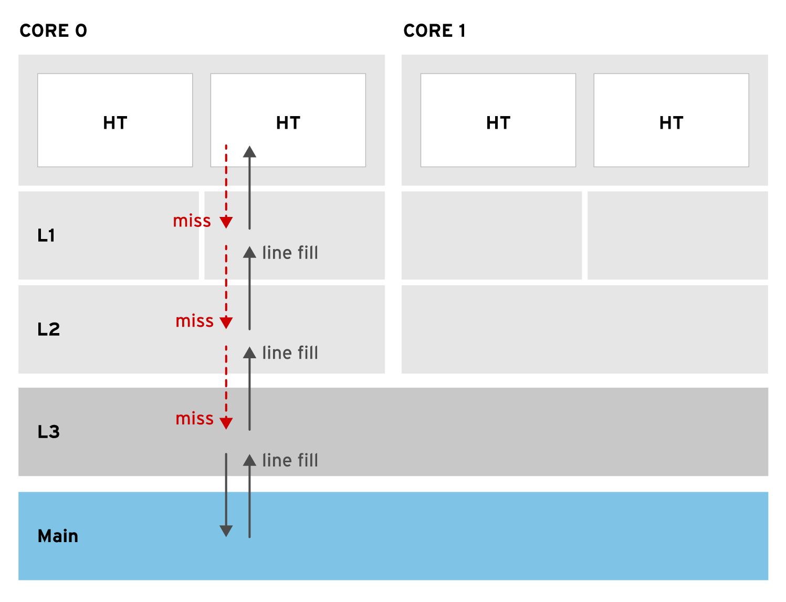

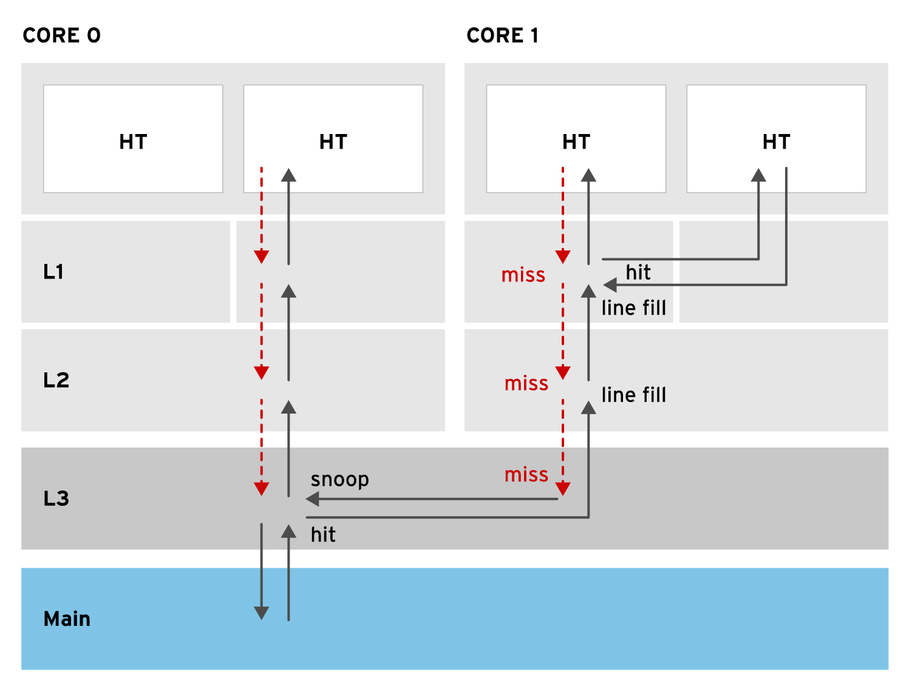

On x86 platforms, each page of memory contains control bits that can be used to disable caching of pages, and to disable write-back caching. The Linux kernel clears both bits on all memory pages, so all memory accesses are cached with write-back caching.

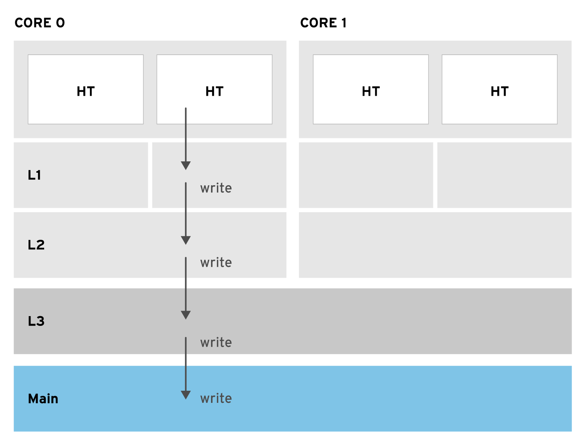

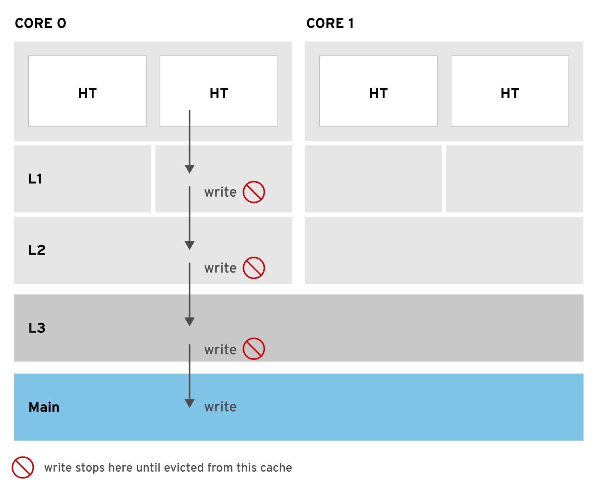

Direct mapped cache
Direct mapped cache is the least expensive type of cache memory. Each line of direct mapped cache can only cache a specific location in main memory. With direct mapped cache, the search time is faster because cache data maps to one specific memory location, but the cache hit rate is low.

Fully associative cache
Fully associative cache memory is the most flexible type of cache memory, and consequently the most expensive because it requires the most circuitry to implement. A fully associative cache memory line can cache any location in main memory. With fully associative cache, the search time is extremely long because the CPU has to look through the entire cache to find out if the data is present before searching main memory, but the cache hit rate is high.

Set associative cache
Set associative cache memory provides a good compromise between direct mapped cache and fully associative cache. This cache memory is usually referred to as n-way set associative, where n is some power of 2. Set associative cache memory allows a memory location to be cached into any one of n lines of cache. Most systems compromise and use set associative cache memory.

The valgrind utility collection provides a set of tools for memory debugging and profiling. One of the tools provided in the valgrind toolset is the cachegrind tool. 

```bash
valgrind --tool=cachegrind cache1

perf list

perf stat -e instructions,cycles, \
L1-dcache-loads,L1-dcache-load-misses,LLC-load-misses,LLC-loads \
tar cvf backup.tar /etc

perf stat -e instructions,cycles,L1-dcache-loads,L1-dcache-load-misses,LLC-load-misses,LLC-loads \
-p 6684
#  Performance counter stats for process id '6684':

#        131,599,432      instructions              #    0.35  insn per cycle           (66.13%)
#        373,469,909      cycles                                                        (83.29%)
#         37,120,984      L1-dcache-loads                                               (75.36%)
#          3,735,254      L1-dcache-load-misses     #   10.06% of all L1-dcache hits    (43.98%)
#            187,591      LLC-load-misses           #    9.89% of all LL-cache hits     (37.94%)
#          1,895,994      LLC-loads                                                     (50.17%)

#        3.607872991 seconds time elapsed

```
Computer systems organize memory into fixed-size chunks called pages. The size of a page depends on the processor architecture; for x86_64, the standard page size is 4 KiB. The physical RAM on a system is divided into page frames; one page frame holds one page of data.

The size of a process's virtual address space does not depend on the installed physical RAM but rather depends on the processor architecture. On a 64-bit x86-64 system, the address space is 264 bytes (16 EiB) in size.

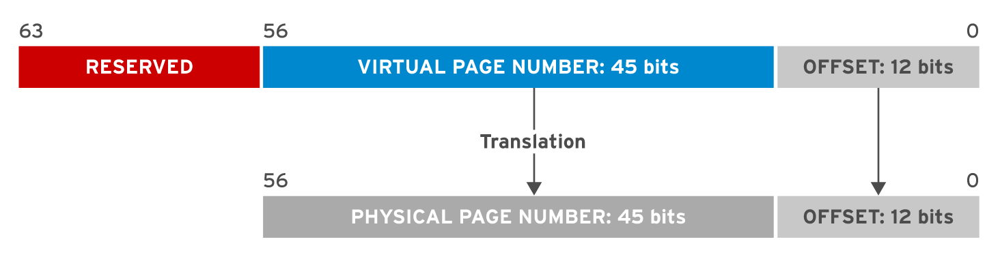

The latest generation of processors reserves the highest 7 bits of the virtual address, which causes a large block of virtual addresses to be unavailable for use by processes. Only 57 bits are left. With 57 bits, the kernel can address 128 PiB (257) of RAM. 

Older processors reserve the highest 16 bits of the virtual address; the system can only use 48 bits for the virtual addresses. The addressable virtual memory is 256 TiB.

```bash
cat /proc/cpuinfo | grep address
# address sizes   : 46 bits physical, 48 bits virtual

systemctl cat sshd.service
# [Service]
# MemoryLimit=1073741824


```
When a process accesses a page that the system has not yet mapped to a physical page frame in the table, the kernel generates a page fault event.

The event occurs when the process accesses a page for the first time after allocation. In that situation, the kernel generates a minor page fault and allocates a new physical page frame from RAM. A minor page fault causes a small amount of overhead.

However, if the physical page frame is missing and the system needs to retrieve that page of memory from disk, the kernel generates a major page fault event.

```bash
# Monitoring Page Faults
ps -o pid,minflt,majflt,comm -C qemu-kvm

perf stat -e minor-faults,major-faults -p 6684
#  Performance counter stats for process id '6684':

#                141      minor-faults
#                  0      major-faults

#        1.434621703 seconds time elapsed
```

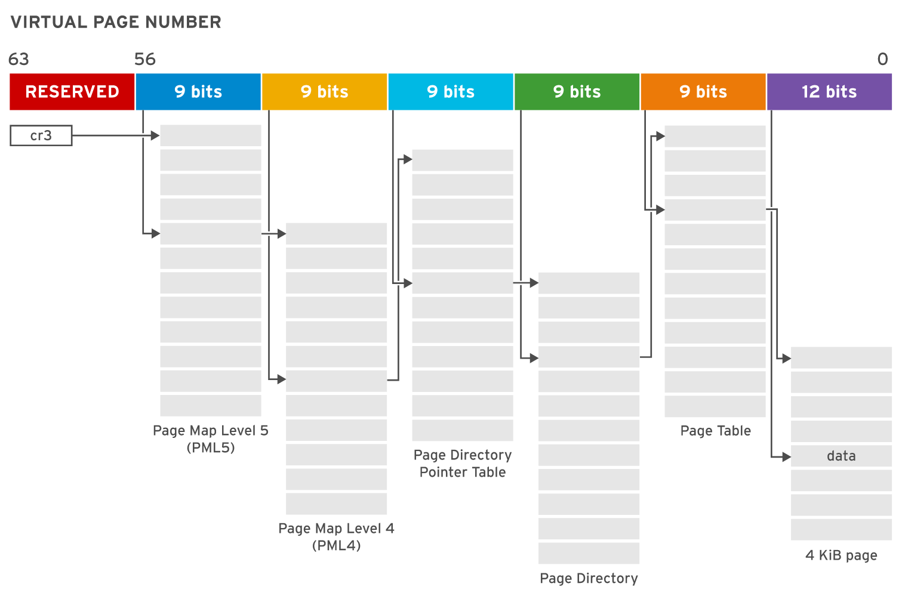

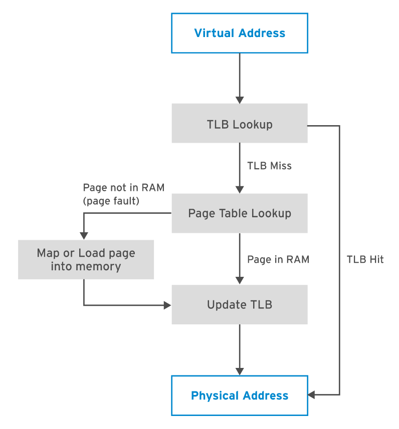

```bash
perf stat -e dTLB-load-misses -p 6684
#  Performance counter stats for process id '6684':

#            284,792      dTLB-load-misses

#        2.065628299 seconds time elapsed
```
The x86_64 architecture supports multiple page sizes, usually 4 KiB, 2 MiB, and 1 GiB. Red Hat Enterprise Linux uses a default huge page size of 2 MiB, but you can change that size with the hugepagesz= kernel parameter.

Whenever the system performs a context switch, the kernel must usually flush TLB entries for the process that is being scheduled out.

```bash
cat /proc/meminfo | grep Hugepagesize
# Hugepagesize:       2048 kB

cat /proc/meminfo | grep HugePages_
# HugePages_Total:       0
# HugePages_Free:        0
# HugePages_Rsvd:        0
# HugePages_Surp:        0

# To allocate huge memory pages, set the total number of required huge pages using the vm.nr_hugepages sysctl parameter:
sysctl -w vm.nr_hugepages=20
# vm.nr_hugepages = 20

# In order to use the huge pages, processes must request them using either the mmap() system call or the shmat() and shmget() system calls. If a process uses the mmap() system call, then you need to mount the hugetlbfs file system.
mkdir /largepage
mount -t hugetlbfs none /largepage

# Hugepages on NUMA Systems
# to allocate 20 pages on the NUMA node 2, use the following command.
echo 20 > \
/sys/devices/system/node/node2/hugepages/hugepages-2048kB/nr_hugepages

numastat -cm

# THP differs from the standard huge pages in that the kernel allocates and manages them automatically. The system can also swap them out of memory, unlike standard huge pages.
cat /sys/kernel/mm/transparent_hugepage/enabled
# [always] madvise never

grep AnonHugePages /proc/meminfo
# AnonHugePages:  116852736 kB

```

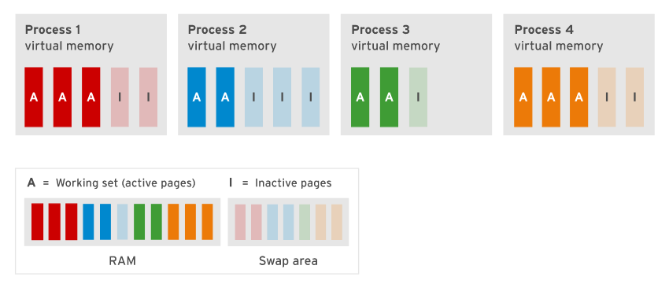


Set the vm.swappiness parameter to 100, and the system almost always prefers to page anonymous pages out to the swap area over reclaiming pages from the page cache. 

A physical page can be in different states:

Free — The page is available for immediate allocation.

Active — The page is in active use and not a candidate for being freed.

Inactive clean — The page is not in active use, and its content matches the content on disk.

Inactive dirty — The page is not in active use, but the page content has been modified since being read from disk and has not yet been written back.

```bash
cat /proc/meminfo | grep Dirty
# Dirty:                20 kB

cat /proc/$$/smaps | awk '
/Shared_Clean/ {SHCL+=$2} 
/Shared_Dirty/ {SHDT+=$2} 
/Private_Clean/ {PRCL+=$2} 
/Private_Dirty/ {PRDT+=$2} 
END { 
  print "Total Clean:", SHCL + PRCL 
  print "Total Dirty:", SHDT + PRDT 
}'
# Total Clean: 3356
# Total Dirty: 2176

```

Every process has a badness score that you can view in the /proc/PID/oom_score file.  The higher the score, the more likely the OOM killer will kill the process. 

You can manually adjust that score with the /proc/PID/oom_score_adj tunable. The tunable takes a value between -1000 and 1000 where 0 is the default. A value of -1000 means immunity. The OOM killer never kills the process. 

```bash
cat /etc/systemd/system/sssd.service.d/10-OOMscore.conf
[Service]
OOMScoreAdjust=-1000

```

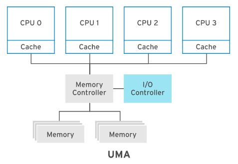

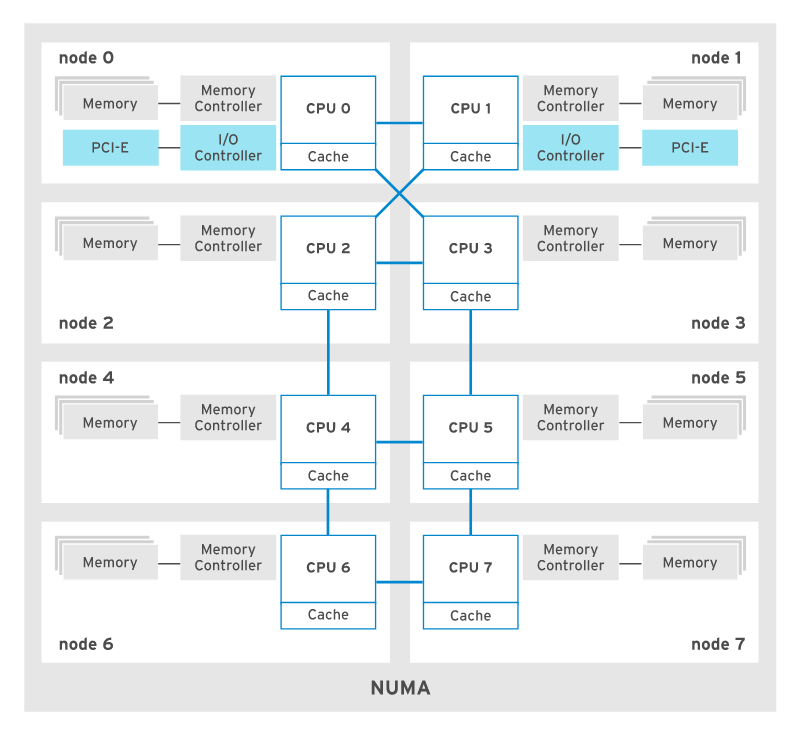

Some workloads work better with automatic NUMA balancing, others with the numad service. you must disable the automatic NUMA balancing algorithm to use it. To do so, set the kernel.numa_balancing sysctl tunable to 0.

```bash
numactl --hardware
# available: 2 nodes (0-1)
# node 0 cpus: 0 2 4 6 8 10 12 14 16 18 20 22
# node 0 size: 79680 MB
# node 0 free: 38795 MB
# node 1 cpus: 1 3 5 7 9 11 13 15 17 19 21 23
# node 1 size: 79728 MB
# node 1 free: 1639 MB
# node distances:
# node   0   1
#   0:  10  20
#   1:  20  10

lstopo --of png > test.png
```
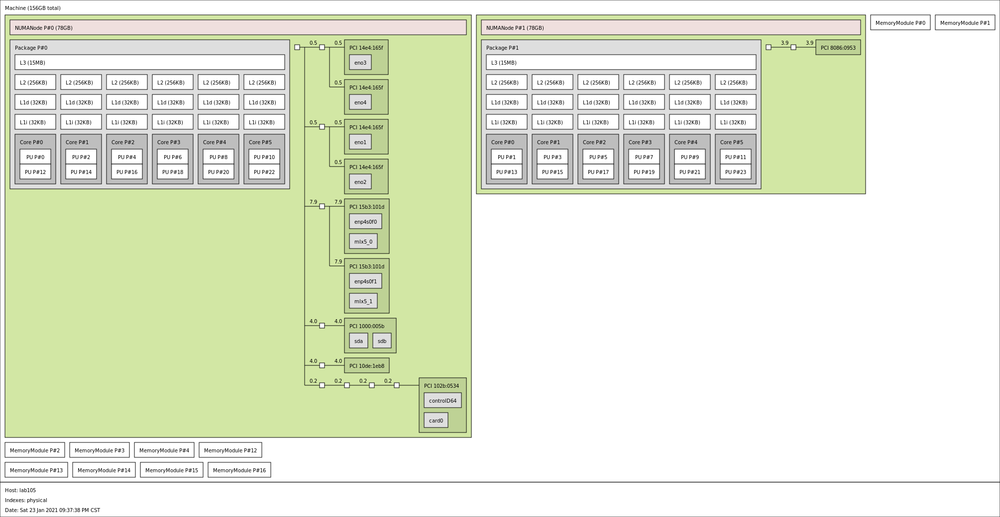

```bash
numastat -c rsyslogd

numastat -p 6684
# Per-node process memory usage (in MBs) for PID 6684 (qemu-kvm)
#                            Node 0          Node 1           Total
#                   --------------- --------------- ---------------
# Huge                         0.00            0.00            0.00
# Heap                         7.91            0.02            7.93
# Stack                        0.03            0.00            0.03
# Private                   1925.50          671.75         2597.25
# ----------------  --------------- --------------- ---------------
# Total                     1933.43          671.78         2605.21

numactl --cpunodebind=2 --preferred=2 -- myprogram
numactl --cpunodebind=2 --membind=2,3 -- myprogram
# interleave all access to memory across all nodes.
numactl --interleave all -- mydatabase

```

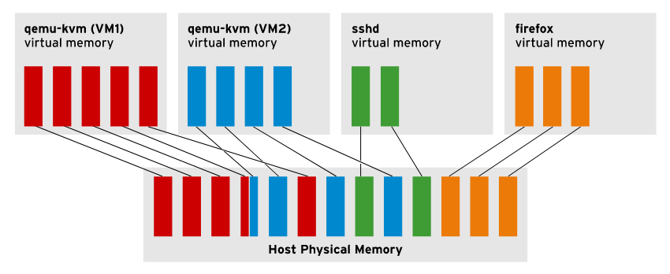

```bash
sysctl  vm.overcommit_memory
# vm.overcommit_memory = 0

# The Committed_AS field in the /proc/meminfo file shows an estimate of how much RAM the system requires to avoid an out-of-memory condition for the current workload.
cat /proc/meminfo | grep Committed_AS
# Committed_AS:   169883400 kB

```
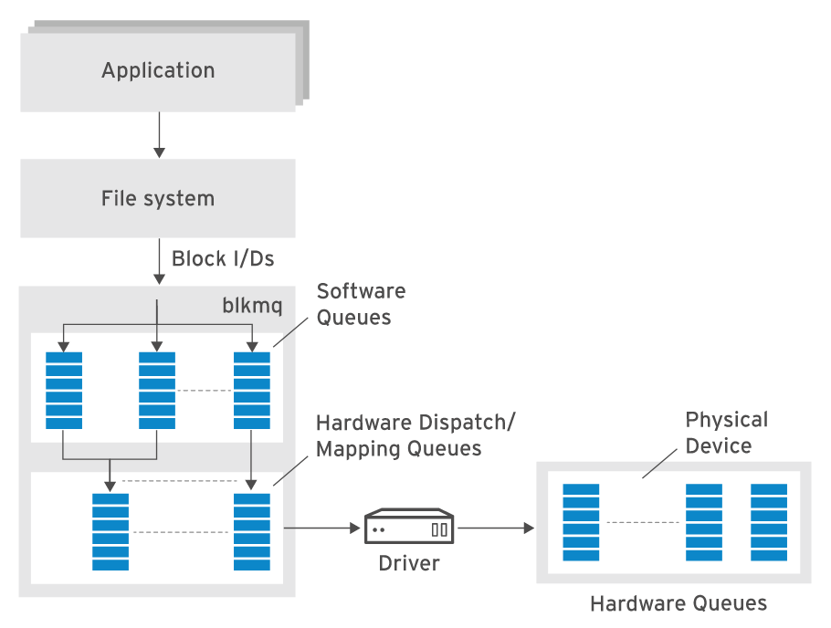

mq-deadline
The mq-deadline scheduler implements a multiple queue version of the legacy deadline I/O scheduler. This scheduler mitigates I/O operation starvation by using two queues (one for write, the other for read) sorted by expiration time, to ensure that an I/O operation (either write or read) is executed before it expires. If no expiration time is imminent, I/O operations are executed from a third queue that sorts requests by sector. The mq-deadline scheduler is the RHEL 8 default, providing ordering guarantees for arriving write operations that the other multiqueue schedulers do not yet handle.

kyber
Kyber supports fast devices with two queues, one for synchronous (read) requests and another one for asynchronous (write) requests. These queues manage the per-request latency by placing strict limits on the number of request operations sent to the queues. This limits the time waiting for requests to be dispatched, and provides quick completion time for requests that are high priority. The kyber scheduler is preferred for throughput-sensitive server loads, especially on SSDs, primarily because it is a simpler scheduler, which should result in faster request processing.

bfq
BFQ is an improvement on the Completely Fair Queuing (CFQ) scheduler, where fair sharing is based on the number of sectors requested and heuristics rather than a time slice. BFQ provides consistent interactive response, especially on slower devices hard disk devices. BFQ has a relatively high per-operation overhead, which may be acceptable when I/O operations are slow and costly. BFQ is not desired where I/O operations are cheap and throughput is a priority, such as with slow CPUs. This I/O scheduler is a replacement for the cfq single-queue based I/O scheduler. When using SSDs for server workloads, a simpler scheduler is preferred, such as Kyber. Users concerned with interactive system response, and possibly using slower devices, will would choose BFQ.

none
This setting supports fast random I/O devices like NVMe disks, by not reordering I/O requests. This I/O scheduler is a replacement for the noop single-queue based I/O scheduler.

```bash
cat /sys/block/sda/queue/scheduler
# [mq-deadline] kyber bfq none

cat /sys/block/nvme0n1/queue/scheduler
# [none] mq-deadline kyber bfq

ls /sys/block/sda/queue/iosched | xargs -I DEMO bash -c "echo DEMO; cat /sys/block/sda/queue/iosched/DEMO"
# fifo_batch
# 16
# front_merges
# 1
# read_expire
# 500
# write_expire
# 5000
# writes_starved
# 2

fio --name=randwrite --ioengine=libaio --iodepth=1 \
--rw=randwrite --bs=4k --direct=1 --size=512M --numjobs=2 \
--group_reporting --filename=/tmp/testfile
```
Useful FIO Parameters

-filename
The utility will write to the filename specified. Be cautious, as using a block device file will overwrite the device during testing.

-name, -size
If existing files are not specified with -filename, fio will create files using the name and sizes specified with these parameters.

-rw = read/write/randread/randwrite/readwrite/randrw
Specifies whether workload should be sequential or random access. Options, as listed, include sequential reading, sequential writing, random reading, random writing, sequential mixed and random mixed. Additional options are available to set an exact percentage of read and write workloads when mixed.

-bs, -bsrange
Specifies an exact block size or a range of sizes to be used for reading and writing

-direct = 1
Sets the use of direct I/O, which bypasses the page cache, and writes directly to disk. When this option is set to 0, fio uses the page cache and memory, and returns statistics that are essentially a measurement of memory speeds, not disk.

-ioengine = libaio, -iodepth
The libaio library enables asynchronous application workloads, which can be used to generate parallel requests. The -iodepth option specifies the number of requests. Using the option mandates the use of the direct I/O option, since the page cache is not asynchronously addressable. The ioengine also has parameters for synchronous I/O in multiple forms, memory mapped file activity, rdma memory activity, and even network activity..

-numjobs, -group_reporting
Specifies the number of processor threads performing the same workload for this testing. Defaults to only 1. If numjobs is specified, then use group_reporting to display consolidated statistics instead of per-job statistics.

```bash
mdadm -C /dev/md0 -l raid0 -n 2 /dev/vd[b-c]1

mdadm --stop /dev/md0

mdadm --remove /dev/md0

mdadm --zero-superblock /dev/vdb

mdadm --zero-superblock /dev/vdc

mkfs -t xfs -d su=64k,sw=4 /dev/san/lun1

mkfs -t ext4 -E stride=16,stripe-width=64 /dev/san/lun1

lvcreate --type raid0 -L 3G --stripes 3 --stripesize 4 \
-n raidlv raidvg

parted /dev/vdb mklabel gpt
parted /dev/vdc mklabel gpt
parted -a optimal /dev/vdb mkpart primary 0% 100%
parted -a optimal /dev/vdc mkpart primary 0% 100%
# Reload the partition table.
partx -uv /dev/vdb
partx -uv /dev/vdc

yum install -y pcp-system-tools
systemctl enable --now pmcd
pcp atop
pmiostat

```
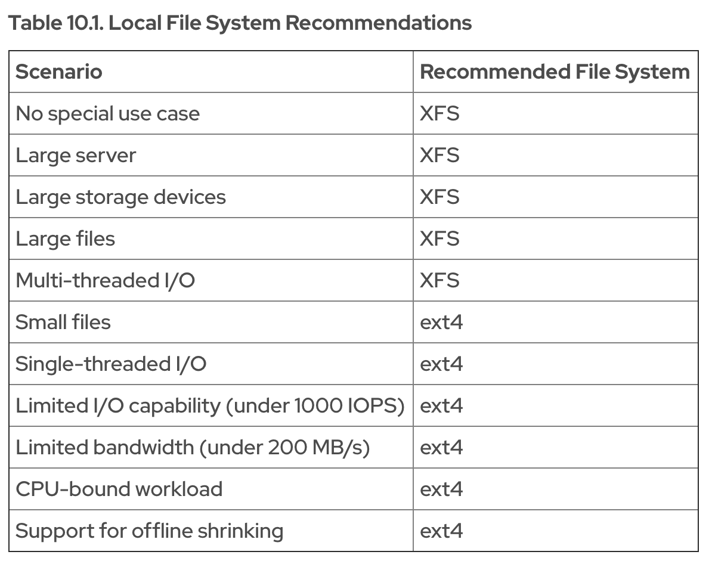

```bash
findmnt --target /xfsraid

```
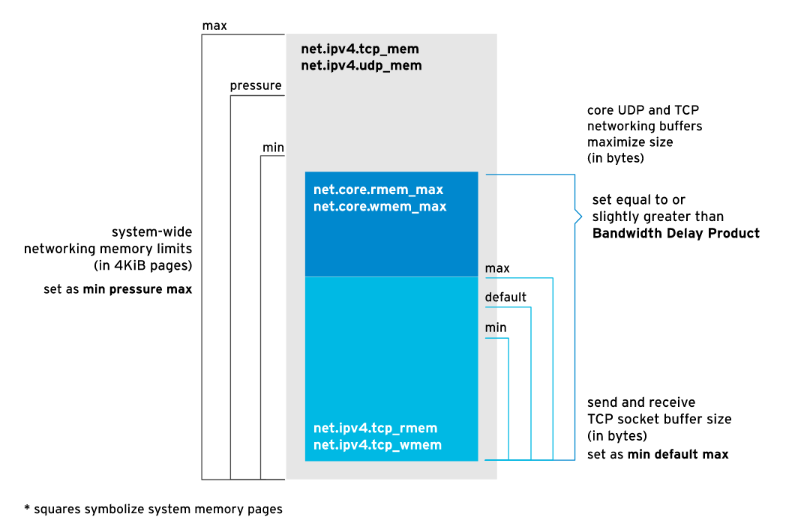

A calculation called the bandwidth delay product (BDP) is used to verify that buffers are correctly sized. The buffer size is calculated by estimating the amount of data that can fit in the network pipe between the source and the destination for a dedicated packet flow. The size of the network pipe is the capacity of the pipe (measured in bytes per second throughput) multiplied by the length of the pipe (measured in seconds as the round trip latency.)

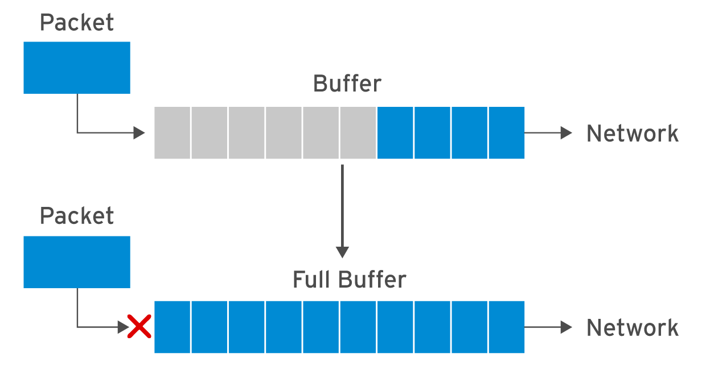

```bash
nmcli connection modify ens3 802-3-ethernet.mtu 9000

# The 0x28 value was obtained from the ethtool(8) man page, combining the values for 100baseT Full (0x008) and 1000baseT Full (0x020).
ethtool -s ens3 advertise 0x28

ethtool -s ens3 autoneg off speed 1000 duplex full

nmcli connection modify "Wired connection 1" \
802-3-ethernet.auto-negotiate off \
802-3-ethernet.speed 1000 \
802-3-ethernet.duplex full

qperf
qperf host2 tcp_bw udp_bw
# tcp_bw:
#     bw  =  118 MB/sec
# udp_bw:
#     send_bw  =  120 MB/sec
#     recv_bw  =  120 MB/sec

# To query and set these offload parameters, use ethtool -k device and ethtool -K device, respectively.


```
Starting the teamed interface does not automatically start the port interfaces.

Starting a port interface always starts the teamed interface.

Stopping the teamed interface also stops the port interfaces.

A teamed interface without ports can start static IP connections.

A team without ports waits for ports when starting DHCP connections.

A team with a DHCP connection waiting for ports completes when a port with a carrier is added.

A team with a DHCP connection waiting for ports continues waiting when a port without a carrier is added.

```bash
nmcli connection add type team con-name team0 ifname team0 team.runner loadbalance

nmcli connection modify team0 team.link-watchers "name=ethtool"
nmcli connection modify team0 ipv4.addresses '1.2.3.4/24'
nmcli connection modify team0 ipv4.method manual
nmcli connection add type ethernet slave-type team \
con-name team0-port1 ifname ens3 master team0
nmcli connection add type ethernet slave-type team \
con-name team0-port2 ifname ens4 master team0

nmcli connection up team0
nmcli dev dis ens3

teamdctl team0 state

teamnl team0 ports
teamnl team0 getoption activeport
teamnl team0 setoption activeport 3

teamdctl team0 state

virsh numatune
# numa_mode      : strict
# numa_nodeset   : 0

virsh vcpupin rhel8-demo
# VCPU: CPU Affinity
# ----------------------------------
#    0: 0-1
#    1: 0-1

virsh vcpuinfo rhel8-demo

virsh emulatorpin rhel8-demo
# emulator: CPU Affinity
# ----------------------------------
#        *: 1

virsh dominfo rhel8-demo

virsh memtune rhel8-demo
# hard_limit     : 2097152
# soft_limit     : 1048576
# swap_hard_limit: unlimited

# Kernel Samepage Merging (KSM),
ls /sys/kernel/mm/ksm/*

qemu-img create -f qcow2 -o preallocation=metadata /var/lib/libvirt/images/disk.qcow2 1G

virsh iothreadinfo rhel8-demo
#  IOThread ID     CPU Affinity
# ---------------------------------------------------
#  1               0-1

virsh blkdeviotune rhel8-demo vdb --total-iops-sec 1000 --total-bytes-sec 20MB

virsh schedinfo rhel8-demo

virsh blkiotune rhel8-demo

virsh domblkstat rhel8-demo vda --human

virsh domiflist rhel8-demo

virsh domifstat rhel8-demo vnet0

virsh dommemstat rhel8-demo

```

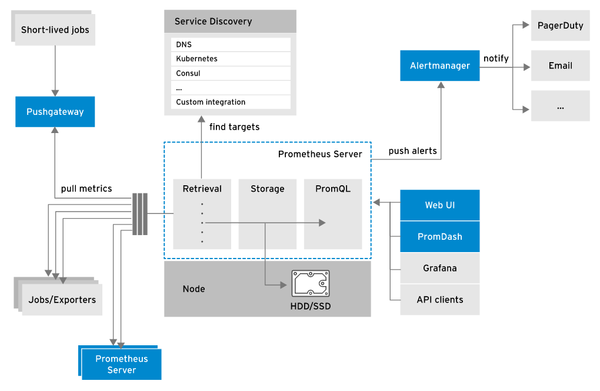


