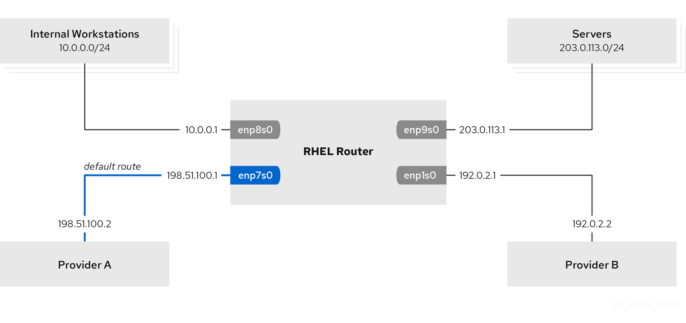

# VIRTUAL ROUTING AND FORWARDING (VRF)

## VIRTUAL ROUTING AND FORWARDING (VRF)

https://access.redhat.com/documentation/en-us/red_hat_enterprise_linux/8/html/configuring_and_managing_networking/configuring-virtual-routing-and-forwarding-vrf_configuring-and-managing-networking

### Permanently reusing the same IP address on different interfaces

```bash
nmcli connection add type vrf ifname vrf0 con-name vrf0 table 1001 ipv4.method disabled ipv6.method disabled

nmcli connection up vrf0

nmcli connection add type ethernet con-name vrf.enp1s0 ifname enp1s0 master vrf0 ipv4.method manual ipv4.address 192.0.2.1/24

nmcli connection up vrf.enp1s0

nmcli connection add type vrf ifname vrf1 con-name vrf1 table 1002 ipv4.method disabled ipv6.method disabled

nmcli connection up vrf1

nmcli connection add type ethernet con-name vrf.enp7s0 ifname enp7s0 master vrf1 ipv4.method manual ipv4.address 192.0.2.1/24

nmcli connection up vrf.enp7s0

```

### Temporarily reusing the same IP address on different interfaces

```bash
ip link add dev blue type vrf table 1001

ip link set dev blue up

ip link set dev enp1s0 master blue

ip link set dev enp1s0 up

ip addr add dev enp1s0 192.0.2.1/24

ip link add dev red type vrf table 1002

ip link set dev red up

ip link set dev enp7s0 master red

ip link set dev enp7s0 up

ip addr add dev enp7s0 192.0.2.1/24

```

## POLICY-BASED ROUTING

https://access.redhat.com/documentation/en-us/red_hat_enterprise_linux/8/html/configuring_and_managing_networking/configuring-policy-based-routing-to-define-alternative-routes_configuring-and-managing-networking



```bash
nmcli connection add type ethernet con-name Provider-A ifname enp7s0 ipv4.method manual ipv4.addresses 198.51.100.1/30 ipv4.gateway 198.51.100.2 ipv4.dns 198.51.100.200 connection.zone external

nmcli connection add type ethernet con-name Provider-B ifname enp1s0 ipv4.method manual ipv4.addresses 192.0.2.1/30 ipv4.routes "0.0.0.0/1 192.0.2.2 table=5000, 128.0.0.0/1 192.0.2.2 table=5000" connection.zone external

nmcli connection add type ethernet con-name Internal-Workstations ifname enp8s0 ipv4.method manual ipv4.addresses 10.0.0.1/24 ipv4.routes "10.0.0.0/24 src=192.0.2.1 table=5000" ipv4.routing-rules "priority 5 from 10.0.0.0/24 table 5000" connection.zone internal

nmcli connection add type ethernet con-name Servers ifname enp9s0 ipv4.method manual ipv4.addresses 203.0.113.1/24 connection.zone internal

ip rule list

ip route list table 5000

```