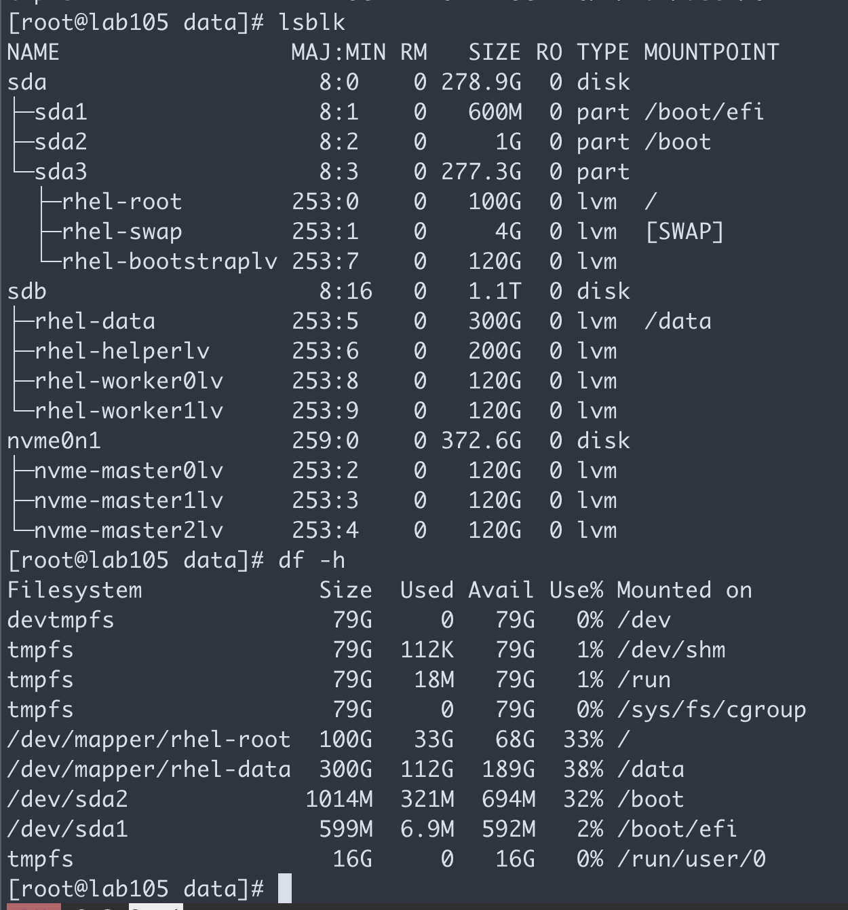
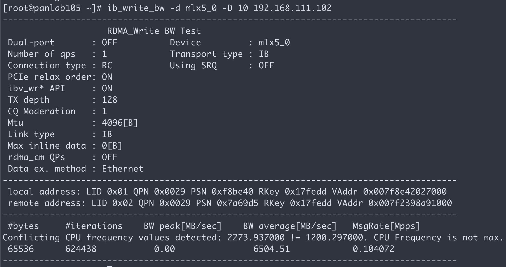

# ubuntu for IB and GPU

## first clean up the env

```bash
# https://unix.stackexchange.com/questions/198003/set-default-kernel-in-grub

# https://docs.digitalocean.com/products/droplets/how-to/kernel/use-non-default/#set-default

/bin/cp -f /etc/default/grub /etc/default/grub.bak

sed -i 's/^GRUB_DEFAULT=0/GRUB_DEFAULT=saved/'  /etc/default/grub
sed -i '/^GRUB_DEFAULT=saved/a GRUB_SAVEDEFAULT=true\nGRUB_DISABLE_SUBMENU=y'  /etc/default/grub

sed -i 's/default_hugepagesz=1G hugepagesz=1G hugepages=16 tsc=reliable clocksource=tsc intel_idle.max_cstate=0 mce=ignore_ce processor.max_cstate=0 intel_pstate=disable audit=0 idle=poll isolcpus=2-9 nohz_full=2-9 rcu_nocbs=2-9 rcu_nocb_poll nosoftlockup iommu=off intel_iommu=off/ /' /etc/default/grub

update-grub

# vi  /etc/default/grub
# GRUB_DEFAULT=saved
# GRUB_SAVEDEFAULT=true
# GRUB_DISABLE_SUBMENU=y

export GRUB_CONFIG=`sudo find /boot -name "grub.cfg"`

sudo grep 'menuentry ' /boot/grub/grub.cfg | cut -f 2 -d "'" | nl -v 0
    #  0  Ubuntu, with Linux 5.4.0-72-lowlatency
    #  1  Ubuntu, with Linux 5.4.0-72-lowlatency (recovery mode)
    #  2  Ubuntu, with Linux 4.15.0-142-generic
    #  3  Ubuntu, with Linux 4.15.0-142-generic (recovery mode)

# sudo grep 'menuentry ' /boot/efi/EFI/ubuntu/grub.cfg | cut -f 2 -d "'" | nl -v 0

sudo grub-set-default 2

# after upgrade
apt upgrade 
dpkg --list | egrep -i --color 'linux-image|linux-headers'

apt purge linux-image-4.15.0-142-generic
apt purge linux-image-5.4.0-73-lowlatency linux-image-5.4.0-72-lowlatency linux-image-lowlatency-hwe-18.04

grub-set-default 0

# uninstall nvidia driver
cd /root/down/MLNX_OFED_LINUX-5.3-1.0.0.1-ubuntu18.04-x86_64
./uninstall.sh

systemctl disable --now nv_peer_mem

systemctl disable --now rc-local

apt remove cuda
apt autoremove


vi /etc/default/grub
GRUB_CMDLINE_LINUX_DEFAULT="nofb splash=quiet console=tty0 ... intel_iommu=on iommu=pt default_hugepagesz=1G hugepagesz=1G hugepages=8i rdblacklist=nouveau"

cat << EOF > /etc/modprobe.d/blacklist-nouveau.conf
blacklist nouveau
options nouveau modeset=0
EOF

update-grub


```

## 102

```bash
nmcli con add type ethernet con-name eno1 ifname eno1  ipv4.method manual ipv4.addresses 172.21.6.102/24 ipv4.gateway 172.21.6.254 ipv4.dns 172.21.1.1
nmcli connection up eno1

nmcli con del em1
nmcli con del em2
nmcli con del em3
nmcli con del em4
nmcli con del ib0
nmcli con del ib1
nmcli con del '有线连接 1'
nmcli con del '有线连接 2'
nmcli con del '有线连接 3'
nmcli con del '有线连接 4'

grubby --bootloader-probe
# grub2

# https://access.redhat.com/solutions/3089
awk -F\' /^menuentry/{print\$2} /etc/grub2-efi.cfg
# BigCloud Enterprise Linux (4.19.25-200.el7.bclinux.x86_64) 7.6 (Core)
# BigCloud Enterprise Linux (3.10.0-957.el7.x86_64) 7.6 (Core)
# BigCloud Enterprise Linux (0-rescue-a83d55f0cf184e2aa5949e0d5b154bbf) 7.6 (Core)

grub2-set-default 0

cat /boot/grub2/grubenv | grep saved
# saved_entry=1

grub2-mkconfig -o /boot/efi/EFI/bclinux/grub.cfg

# crack the license
mv /etc/yum/pluginconf.d/license-manager.conf /etc/yum/pluginconf.d/license-manager.conf.bak

# sed -i 's/enabled=0/enabled=1/g' /etc/yum.repos.d/BCLinux-Kernel.repo

```

## 105
```bash

vi /etc/default/grub
GRUB_CMDLINE_LINUX_DEFAULT="nofb splash=quiet console=tty0 ... intel_iommu=on iommu=pt default_hugepagesz=1G hugepagesz=1G hugepages=8i rdblacklist=nouveau"

cat << EOF > /etc/modprobe.d/blacklist-nouveau.conf
blacklist nouveau
options nouveau modeset=0
EOF

update-grub


# https://docs.nvidia.com/datacenter/cloud-native/container-toolkit/install-guide.html#setting-up-docker-on-centos-7-8
yum -y install yum-utils
yum-config-manager --add-repo=https://download.docker.com/linux/centos/docker-ce.repo

# yum install -y https://download.docker.com/linux/centos/7/x86_64/stable/Packages/containerd.io-1.4.3-3.1.el7.x86_64.rpm
yum -y install containerd.io

yum -y remove docker docker-common

repoquery --show-duplicates docker-ce
yum -y install docker-ce-3:19.03.15-3.el7.x86_64

systemctl --now enable docker

```
old


# Cx6 driver
https://www.mellanox.com/products/infiniband-drivers/linux/mlnx_ofed
```bash
vim /etc/default/grub
# GRUB_CMDLINE_LINUX="resume=/dev/mapper/centos7x-swap rd.lvm.lv=centos7x/root rd.lvm.lv=centos7x/swap intel_iommu=on iommu=pt default_hugepagesz=1G hugepagesz=1G hugepages=8"

ls /sys/firmware/
# acpi  dmi  efi  memmap  qemu_fw_cfg

grub2-mkconfig -o /boot/efi/EFI/bclinux/grub.cfg

reboot

cat /proc/cmdline

cd ~/down

yum install -y createrepo
yum install -y python-devel pciutils kernel-bek-devel gcc elfutils-libelf-devel gcc-gfortran tk
yum -y update

mount -o ro,loop MLNX_OFED_LINUX-5.2-2.2.0.0-bclinux7.6-x86_64.iso /mnt

/mnt/mlnx_add_kernel_support.sh -m /mnt --make-tgz -y

mkdir -p /data/mlx/
# you will get /tmp/MLNX_OFED_LINUX-5.2-2.2.0.0-bclinux7.6-x86_64-ext.tgz
mv MLNX_OFED_LINUX-5.2-2.2.0.0-bclinux7.6-x86_64-ext.tgz /data/mlx/

cd /data/mlx
tar zvxf MLNX_OFED_LINUX-5.2-2.2.0.0-bclinux7.6-x86_64-ext.tgz

cat << EOF > /etc/yum.repos.d/mlx.repo
[mlnx_ofed]
name=MLNX_OFED Repository
baseurl=file:///data/mlx/MLNX_OFED_LINUX-5.2-2.2.0.0-bclinux7.6-x86_64-ext/RPMS
enabled=1
gpgcheck=0
EOF

cd /data/mlx/MLNX_OFED_LINUX-5.2-2.2.0.0-bclinux7.6-x86_64-ext/
./mlnxofedinstall --force

dracut -f
# /etc/init.d/openibd restart

# yum search mlnx-ofed-
# yum -y install mlnx-ofed-all

# # update firmware
# yum -y install mlnx-fw-updater

# chkconfig --add mst
# chkconfig --add openibd

systemctl enable --now mst
systemctl enable --now openibd
systemctl enable --now opensmd

lsmod | grep mlx
modinfo mlx5_core
ibdev2netdev -v

# restore
systemctl disable --now mst
systemctl disable --now openibd

opensm
sminfo
ibstat
ibdev2netdev
mst status

# /dev/infiniband/umad0
# /var/run/opensm.pid
# /sys/class/infiniband_mad/umad0//port
# /sys/class/infiniband_mad/umad0//ibdev
# /var/cache/opensm/guid2lid
# /var/log//opensm-activity.dump
# /sys/class/infiniband/mlx5_3/ports
# /var/cache/opensm/an2an
# /var/log/opensm.log
# /etc/opensm/opensm.conf

udevadm info -a -n /dev/infiniband/umad0

# on 102
ibping -S -C mlx5_0 -P 0

# on 105
# below 2 both ok
ibping -c 1000 -f -C mlx5_0 -P 0 -L 2
ibping -c 1000 -f -C mlx5_0 -P 1 -L 2
# --- panlab105.(none) (Lid 1) ibping statistics ---
# 1000 packets transmitted, 1000 received, 0% packet loss, time 906 ms
# rtt min/avg/max = 0.003/0.906/900.008 ms

# on 105
# below 2 both ok
ibping -c 1000 -f -C mlx5_0 -P 0 -G 0x98039b0300cc7124
ibping -c 1000 -f -C mlx5_0 -P 1 -G 0x98039b0300cc7124

# use nmtui to config ib
# follow https://access.redhat.com/documentation/en-us/red_hat_enterprise_linux/7/html-single/networking_guide/index#sec-Configuring_IPoIB

# on 102
ib_write_bw -d mlx5_0 -a -F

# on 105
ib_write_bw -d mlx5_0 -D 10 192.168.111.102

```


# rancher

## on 105
```bash
yum -y install docker
systemctl enable --now docker
systemctl disable --now firewalld
sed -i 's/enforcing/disabled/g' /etc/selinux/config; setenforce 0

# https://rancher.com/docs/rancher/v2.5/en/quick-start-guide/deployment/quickstart-manual-setup/
docker run -d --restart=unless-stopped -p 80:80 -p 443:443 --privileged rancher/rancher

# https://172.21.6.105

sudo docker run -d --privileged --restart=unless-stopped --net=host -v /etc/kubernetes:/etc/kubernetes -v /var/run:/var/run  rancher/rancher-agent:v2.5.7 --server https://172.21.6.105 --token zzz9fj2g76ksxj2q795wrsjqlrnh88v54s467mwgqb679sflb5qmsx --ca-checksum 11c5fd5b9c71a2f0bb131f21b5c16af474668f56badc13a261f3234ca9734066 --etcd --controlplane --worker

mkdir -p ~/down
cd ~/down

export http_proxy="http://127.0.0.1:18801"
export https_proxy=${http_proxy}

wget https://releases.rancher.com/cli2/v2.4.5/rancher-linux-amd64-v2.4.5.tar.gz
tar -xzf rancher-linux-amd64-v2.4.5.tar.gz --strip-components=2 -C /usr/local/bin/

curl -LO "https://dl.k8s.io/release/$(curl -L -s https://dl.k8s.io/release/stable.txt)/bin/linux/amd64/kubectl"
chmod +x kubectl
mv kubectl /usr/local/bin/

mkdir -p ~/.kube/
vi ~/.kube/config

sed -i 's/#GatewayPorts no/GatewayPorts yes/' /etc/ssh/sshd_config
systemctl restart sshd


```

## on 102

```bash
yum -y install docker
systemctl enable --now docker
systemctl disable --now firewalld

```

# multus

```bash
cd ~/down
wget https://raw.githubusercontent.com/k8snetworkplumbingwg/multus-cni/master/images/multus-daemonset.yml

cat multus-daemonset.yml | kubectl apply -f -

```

# Share device plugin
https://github.com/mellanox/k8s-rdma-shared-dev-plugin
```bash
cd /data/k8s

wget https://raw.githubusercontent.com/Mellanox/k8s-rdma-shared-dev-plugin/master/images/k8s-rdma-shared-dev-plugin-config-map.yaml

wget https://raw.githubusercontent.com/Mellanox/k8s-rdma-shared-dev-plugin/master/images/k8s-rdma-shared-dev-plugin-ds.yaml

kubectl create -f k8s-rdma-shared-dev-plugin-config-map.yaml

kubectl create -f k8s-rdma-shared-dev-plugin-ds.yaml

wget https://raw.githubusercontent.com/Mellanox/k8s-rdma-shared-dev-plugin/master/example/test-hca-pod.yaml

kubectl create -f test-hca-pod.yaml

```

# gpu operator
https://rancher.com/blog/2020/get-up-and-running-with-nvidia-gpus
```bash
# helm repo: https://nvidia.github.io/gpu-operator

# create namespace: gpu-operator-resources

oc image mirror nvcr.io/nvidia/driver:460.32.03-centos7 \
quay.io/wangzheng422/qimgs:nvidia-driver-460.32.03-centos7

oc image mirror nvcr.io/nvidia/driver:450.80.02-centos7 \
quay.io/wangzheng422/qimgs:nvidia-driver-450.80.02-centos7

docker run --rm -it --entrypoint='/bin/bash' nvcr.io/nvidia/driver:460.32.03-centos7

docker run --rm -it --entrypoint='/bin/bash' quay.io/wangzheng422/qimgs:nvidia-gpu-driver-wzh-2021-03-19-1043-bclinux7.6

mkdir -p /data/gpu/
cd /data/gpu/
/bin/cp -f /etc/yum.repos.d/BC*.repo /data/gpu/
/bin/cp -f /etc/pki/rpm-gpg/RPM-GPG-KEY-BCLinux-7 /data/gpu/

cat << EOF > /data/gpu/Dockerfile
FROM nvcr.io/nvidia/driver:460.32.03-centos7

RUN /bin/rm -rf /etc/yum.repos.d/* 
COPY BC*.repo /etc/yum.repos.d/

COPY RPM-GPG-KEY-BCLinux-7 /etc/pki/rpm-gpg/RPM-GPG-KEY-BCLinux-7

COPY nvidia-driver /usr/local/bin/nvidia-driver
RUN chmod +x /usr/local/bin/nvidia-driver

RUN yum -y update && yum -y remove kernel-headers kernel-devel 

RUN yum -y install kernel-bek-4.19.25-200.1.el7.bclinux.x86_64 kernel-bek-headers-4.19.25-200.1.el7.bclinux.x86_64 kernel-bek-devel-4.19.25-200.1.el7.bclinux.x86_64 

RUN yum -y downgrade glibc-devel glibc-headers glibc glibc-common libgomp cpp && yum -y remove gcc automake autoconf libtool make && yum -y install gcc automake autoconf libtool make

EOF

cat << EOF > /data/gpu/Dockerfile
FROM quay.io/wangzheng422/qimgs:nvidia-gpu-driver-wzh-2021-03-19-1055-bclinux7.6

COPY nvidia-driver /usr/local/bin/nvidia-driver
RUN chmod +x /usr/local/bin/nvidia-driver

EOF

var_date=$(date '+%Y-%m-%d-%H%M')
echo $var_date

docker build -t quay.io/wangzheng422/qimgs:nvidia-gpu-driver-wzh-$var_date-bclinux7.6 ./

echo quay.io/wangzheng422/qimgs:nvidia-gpu-driver-wzh-$var_date-bclinux7.6

# quay.io/wangzheng422/qimgs:nvidia-gpu-driver-wzh-2021-03-19-1110-bclinux7.6

docker image push quay.io/wangzheng422/qimgs:nvidia-gpu-driver-wzh-$var_date-bclinux7.6

# https://ngc.nvidia.com/catalog/containers/nvidia:k8s-device-plugin
# https://ngc.nvidia.com/catalog/containers/nvidia:k8s:container-toolkit

```

```yaml

apiVersion: nvidia.com/v1
kind: ClusterPolicy
metadata:
  annotations:
    meta.helm.sh/release-name: gpu-operator
    meta.helm.sh/release-namespace: gpu-operator
  labels:
    app.kubernetes.io/component: gpu-operator
    app.kubernetes.io/managed-by: Helm
    io.cattle.field/appId: gpu-operator
    manager: agent
  name: cluster-policy
spec:
  dcgmExporter:
    args:
    - -f
    - /etc/dcgm-exporter/dcp-metrics-included.csv
    image: dcgm-exporter
    imagePullPolicy: IfNotPresent
    repository: nvcr.io/nvidia/k8s
    version: 2.1.4-2.2.0-ubuntu20.04
  devicePlugin:
    args:
    - --mig-strategy=single
    - --pass-device-specs=true
    - --fail-on-init-error=true
    - --device-list-strategy=envvar
    - --nvidia-driver-root=/run/nvidia/driver
    image: k8s-device-plugin
    imagePullPolicy: IfNotPresent
    nodeSelector:
      nvidia.com/gpu.present: "true"
    repository: nvcr.io/nvidia
    securityContext:
      privileged: true
    version: v0.8.2-ubi8
  driver:
    image: qimgs
    imagePullPolicy: IfNotPresent
    licensingConfig:
      configMapName: ""
    nodeSelector:
      nvidia.com/gpu.present: "true"
    repoConfig:
      configMapName: ""
      destinationDir: ""
    repository: quay.io/wangzheng422
    securityContext:
      privileged: true
      seLinuxOptions:
        level: s0
    tolerations:
    - effect: NoSchedule
      key: nvidia.com/gpu
      operator: Exists
    version: nvidia-gpu-driver-wzh-2021-03-19-1110
  gfd:
    discoveryIntervalSeconds: 60
    image: gpu-feature-discovery
    imagePullPolicy: IfNotPresent
    migStrategy: single
    nodeSelector:
      nvidia.com/gpu.present: "true"
    repository: nvcr.io/nvidia
    version: v0.4.1
  operator:
    defaultRuntime: docker
    validator:
      image: cuda-sample
      imagePullPolicy: IfNotPresent
      repository: nvcr.io/nvidia/k8s
      version: vectoradd-cuda10.2
  toolkit:
    image: container-toolkit
    imagePullPolicy: IfNotPresent
    nodeSelector:
      nvidia.com/gpu.present: "true"
    repository: nvcr.io/nvidia/k8s
    securityContext:
      privileged: true
      seLinuxOptions:
        level: s0
    tolerations:
    - key: CriticalAddonsOnly
      operator: Exists
    - effect: NoSchedule
      key: nvidia.com/gpu
      operator: Exists
    version: 1.4.7-ubi8

```

```bash
kubectl -n gpu-operator-resources get pod

cat << EOF > /data/k8s/gpu.demo.yaml
apiVersion: v1
kind: Pod
metadata:
  name: gpu-operator-test
spec:
  restartPolicy: OnFailure
  nodeSelector:
    kubernetes.io/hostname: 'panlab105'
  containers:
  - name: cuda-vector-add
    image: "nvidia/samples:vectoradd-cuda10.2"
    resources:
      limits:
         nvidia.com/gpu: 1
EOF
kubectl apply -f /data/k8s/gpu.demo.yaml

```

# network operator
https://developer.nvidia.com/blog/deploying-gpudirect-rdma-on-egx-stack-with-the-network-operator/

https://github.com/Mellanox/network-operator/tree/master

https://docs.mellanox.com/display/COKAN10/Network+Operator


```bash
# helm repo: https://mellanox.github.io/network-operator

mkdir -p /etc/systemd/system/docker.service.d
cat <<'EOF' | sudo tee /etc/systemd/system/docker.service.d/http-proxy.conf > /dev/null
[Service]
Environment="HTTP_PROXY=http://172.21.6.105:18801"
Environment="HTTPS_PROXY=http://172.21.6.105:18801"
Environment="NO_PROXY=127.0.0.0/8,10.0.0.0/8,cattle-system.svc,172.16.0.0/12,192.168.0.0/16"
EOF

systemctl daemon-reload

systemctl restart docker

# add value to helm template
deployCR: true
operator:
  repository: quay.io/wangzheng422
  image: qimgs
  tag: mellanox-network-operator-v0.3.0-2021-03-30-2120

```

```yaml

apiVersion: mellanox.com/v1alpha1
kind: NicClusterPolicy
metadata:
  annotations:
    meta.helm.sh/release-name: network-operator
    meta.helm.sh/release-namespace: network-operator
  labels:
    app.kubernetes.io/managed-by: Helm
    io.cattle.field/appId: network-operator
  name: nic-cluster-policy
spec:
  ofedDriver:
    image: mofed-wzh
    repository: quay.io/wangzheng422
    version: 5.2-2.2.0.0-2021-03-30-1331
  nvPeerDriver:
    image: nv-peer-mem-driver-wzh
    repository: quay.io/wangzheng422
    version: 1.1.0-2021-03-28-1924
    gpuDriverSourcePath: /run/nvidia/driver
  devicePlugin:
    image: k8s-rdma-shared-dev-plugin
    repository: mellanox
    version: v1.1.0
    # The config below directly propagates to k8s-rdma-shared-device-plugin configuration.
    # Replace 'devices' with your (RDMA capable) netdevice name.
    config: |
      {
        "configList": [
          {
            "resourceName": "hca_shared_devices_a",
            "rdmaHcaMax": 1000,
            "devices": ["enp5s0f0","enp5s0f1","enp66s0f0","enp66s0f1"]
          }
        ]
      }
  secondaryNetwork:
    cniPlugins:
      image: containernetworking-plugins
      repository: mellanox
      version: v0.8.7
    multus:
      image: multus
      repository: nfvpe
      version: v3.6
      # if config is missing or empty then multus config will be automatically generated from the CNI configuration file of the master plugin (the first file in lexicographical order in cni-conf-dir)
      config: ''
    ipamPlugin:
      image: whereabouts
      repository: dougbtv
      version: v0.3

```

```bash
# mellanox/mofed-5.2-2.2.0.0:bclinux7.6-amd64
# https://github.com/wangzheng422/ofed-docker

# on 105, and copy Docker file to server
# https://github.com/wangzheng422/ofed-docker/blob/wzh-dev/bclinux7/Dockerfile
# https://www.mellanox.com/products/infiniband-drivers/linux/mlnx_ofed

mkdir -p /var/ftp/data
mount /data/bclinux/BCLinux-R7-U6-Server-x86_64-Everything-190529.iso /var/ftp/data

yum install -y vsftpd
systemctl enable --now vsftpd

cat << EOF > /etc/yum.repos.d/BC-cdrom.repo
[BC-cdrom]
name=BC-cdrom
baseurl=ftp://172.21.6.105/data
enabled=1
gpgcheck=0
EOF

cd /data/gpu/

cat << EOF > mlx.repo
[mlx]
name=mlx
baseurl=file:///root/MLNX_OFED_LINUX-5.2-2.2.0.0-bclinux7.6-x86_64/RPMS/
enabled=1
gpgcheck=0
EOF

var_date=$(date '+%Y-%m-%d-%H%M')
echo $var_date

# here is a fix for mofed
# https://github.com/wangzheng422/ofed-docker
# copy https://github.com/wangzheng422/ofed-docker/tree/wzh-dev/bclinux7  /* to /data/gpu
buildah bud --format=docker -t quay.io/wangzheng422/qimgs:mofed-wzh-5.2-2.2.0.0-$var_date-bclinux7.6-amd64-base -f Dockerfile.base ./
# quay.io/wangzheng422/qimgs:mofed-wzh-5.2-2.2.0.0-2021-03-28-1924-bclinux7.6-amd64-base
buildah push quay.io/wangzheng422/qimgs:mofed-wzh-5.2-2.2.0.0-$var_date-bclinux7.6-amd64-base

buildah bud --format=docker -t quay.io/wangzheng422/qimgs:mofed-wzh-5.2-2.2.0.0-$var_date-bclinux7.6-amd64-build -f Dockerfile.build ./
# quay.io/wangzheng422/qimgs:mofed-wzh-5.2-2.2.0.0-2021-03-30-1331-bclinux7.6-amd64-build
buildah push quay.io/wangzheng422/qimgs:mofed-wzh-5.2-2.2.0.0-$var_date-bclinux7.6-amd64-build

buildah bud --format=docker -t quay.io/wangzheng422/mofed-wzh-5.2-2.2.0.0-$var_date:bclinux7.6-amd64 -f Dockerfile.run ./
# quay.io/wangzheng422/mofed-wzh-5.2-2.2.0.0-2021-03-30-1331:bclinux7.6-amd64
buildah push quay.io/wangzheng422/mofed-wzh-5.2-2.2.0.0-$var_date:bclinux7.6-amd64

# there is a fix for nv-peer-mem
# https://github.com/wangzheng422/ofed-docker
# copy https://github.com/wangzheng422/ofed-docker/tree/wzh-dev/gpu-direct/bclinux7  /* to /data/gpu
buildah bud --format=docker -t quay.io/wangzheng422/nv-peer-mem-driver-wzh-1.1.0-$var_date:amd64-bclinux7.6 -f Dockerfile ./
# quay.io/wangzheng422/nv-peer-mem-driver-wzh-1.1.0-2021-03-28-1924:amd64-bclinux7.6
buildah push quay.io/wangzheng422/nv-peer-mem-driver-wzh-1.1.0-$var_date:amd64-bclinux7.6

# there is a fix for network operator
# https://github.com/wangzheng422/network-operator
# copy https://raw.githubusercontent.com/wangzheng422/network-operator/wzh-dev/manifests/stage-ofed-driver/0010_ofed-driver-ds.yaml to /data/gpu
# copy https://raw.githubusercontent.com/wangzheng422/network-operator/wzh-dev/Dockerfile.dev to /data/gpu
buildah bud --format=docker -t quay.io/wangzheng422/qimgs:mellanox-network-operator-v0.3.0-$var_date -f Dockerfile.dev ./
# quay.io/wangzheng422/qimgs:mellanox-network-operator-v0.3.0-2021-03-30-2120
buildah push quay.io/wangzheng422/qimgs:mellanox-network-operator-v0.3.0-$var_date

kubectl -n network-operator logs network-operator-95467794b-dpr66

mkdir -p /data/install
cat << EOF > /data/install/macvlan.yaml
---
apiVersion: mellanox.com/v1alpha1
kind: MacvlanNetwork
metadata:
  name: rdma-net-enp5s0f0
spec:
  networkNamespace: "default"
  master: "enp5s0f0"
  mode: "bridge"
  mtu: 1500
  ipam: |
    {
      "type": "static"
    }
---
apiVersion: mellanox.com/v1alpha1
kind: MacvlanNetwork
metadata:
  name: rdma-net-enp5s0f1
spec:
  networkNamespace: "default"
  master: "enp5s0f1"
  mode: "bridge"
  mtu: 1500
  ipam: |
    {
      "type": "static"
    }
---
apiVersion: mellanox.com/v1alpha1
kind: MacvlanNetwork
metadata:
  name: rdma-net-enp66s0f0
spec:
  networkNamespace: "default"
  master: "enp66s0f0"
  mode: "bridge"
  mtu: 1500
  ipam: |
    {
      "type": "static"
    }
---
apiVersion: mellanox.com/v1alpha1
kind: MacvlanNetwork
metadata:
  name: rdma-net-enp66s0f1
spec:
  networkNamespace: "default"
  master: "enp66s0f1"
  mode: "bridge"
  mtu: 1500
  ipam: |
    {
      "type": "static"
    }
EOF
kubectl create -f /data/install/macvlan.yaml

kubectl delete -f /data/install/macvlan.yaml

cat << EOF > /data/install/test.yaml
---
apiVersion: v1
kind: Pod
metadata:
  name: rdma-test-pod-1
  annotations:
    # k8s.v1.cni.cncf.io/networks: rdma-net-ipam
    # If a network with static IPAM is used replace network annotation with the below.
    k8s.v1.cni.cncf.io/networks: '[
     { "name": "rdma-net-enp5s0f0",
       "ips": ["192.168.111.101/24"],
       "gateway": ["192.168.111.1"]
     }
    ]'
spec:
  nodeSelector:
    # Note: Replace hostname or remove selector altogether
    kubernetes.io/hostname: panlab105
  restartPolicy: OnFailure
  containers:
  - image: mellanox/rping-test 
    name: rdma-test-ctr
    securityContext:
      capabilities:
        add: [ "IPC_LOCK" ]
    resources:
      limits:
        rdma/hca_shared_devices_a: 1
      requests:
        rdma/hca_shared_devices_a: 1
    command:
    - sh
    - -c
    - |
      sleep infinity
---
apiVersion: v1
kind: Pod
metadata:
  name: rdma-test-pod-2
  annotations:
    # k8s.v1.cni.cncf.io/networks: rdma-net-ipam
    # If a network with static IPAM is used replace network annotation with the below.
    k8s.v1.cni.cncf.io/networks: '[
     { "name": "rdma-net-enp66s0f0",
       "ips": ["192.168.111.102/24"],
       "gateway": ["192.168.111.1"]
     }
    ]'
spec:
  nodeSelector:
    # Note: Replace hostname or remove selector altogether
    kubernetes.io/hostname: panlab102
  restartPolicy: OnFailure
  containers:
  - image: mellanox/rping-test 
    name: rdma-test-ctr
    securityContext:
      capabilities:
        add: [ "IPC_LOCK" ]
    resources:
      limits:
        rdma/hca_shared_devices_a: 1
      requests:
        rdma/hca_shared_devices_a: 1
    command:
    - sh
    - -c
    - |
      sleep infinity

EOF
kubectl create -f /data/install/test.yaml

kubectl delete -f /data/install/test.yaml

```

# IB

https://github.com/Mellanox/ipoib-cni

```yaml

apiVersion: mellanox.com/v1alpha1
kind: NicClusterPolicy
metadata:
  annotations:
    meta.helm.sh/release-name: network-operator
    meta.helm.sh/release-namespace: network-operator
  labels:
    app.kubernetes.io/managed-by: Helm
    io.cattle.field/appId: network-operator
  name: nic-cluster-policy
spec:
  ofedDriver:
    image: mofed-wzh
    repository: quay.io/wangzheng422
    version: 5.2-2.2.0.0-2021-03-30-1331
  nvPeerDriver:
    image: nv-peer-mem-driver-wzh
    repository: quay.io/wangzheng422
    version: 1.1.0-2021-03-28-1924
    gpuDriverSourcePath: /run/nvidia/driver
  devicePlugin:
    image: k8s-rdma-shared-dev-plugin
    repository: mellanox
    version: v1.1.0
    # The config below directly propagates to k8s-rdma-shared-device-plugin configuration.
    # Replace 'devices' with your (RDMA capable) netdevice name.
          # {
          #   "resourceName": "hca_shared_devices_b",
          #   "rdmaHcaMax": 1000,
          #   "selectors": {
          #     "ifNames": ["enp5s0f0","enp5s0f1","enp66s0f0","enp66s0f1"]
          #   }
          # }
    config: |
      {
        "periodicUpdateInterval": 300,
        "configList": [
          {
            "resourceName": "hca_shared_devices_a",
            "rdmaHcaMax": 1000,
            "selectors": {
              "ifNames": ["ib0","ib1"]
            }
          }
        ]
      }
  sriovDevicePlugin:
    image: sriov-device-plugin
    repository: docker.io/nfvpe
    version: v3.3
    config: |
      {
        "resourceList": [
            {
                "resourcePrefix": "nvidia.com",
                "resourceName": "hostdev",
                "selectors": {
                    "vendors": ["15b3"],
                    "isRdma": true
                }
            }
        ]
      }
  secondaryNetwork:
    cniPlugins:
      image: containernetworking-plugins
      repository: mellanox
      version: v0.8.7
    multus:
      image: multus
      repository: nfvpe
      version: v3.6
      # if config is missing or empty then multus config will be automatically generated from the CNI configuration file of the master plugin (the first file in lexicographical order in cni-conf-dir)
      config: ''
    ipamPlugin:
      image: whereabouts
      repository: mellanox
      version: v0.3

```

```bash
cd /data/k8s
wget https://raw.githubusercontent.com/Mellanox/ipoib-cni/master/images/ipoib-cni-daemonset.yaml

kubectl create -f /data/k8s/ipoib-cni-daemonset.yaml

cat << EOF > /data/k8s/macvlan.yaml
---
apiVersion: "k8s.cni.cncf.io/v1" 
kind: NetworkAttachmentDefinition 
metadata:
  name: ipoib-network-ib0 
  annotations:
    k8s.v1.cni.cncf.io/resourceName: rdma/hca_shared_devices_a  
spec:
  config: |
    {
      "cniVersion": "0.3.1",
      "type": "ipoib",
      "name": "ipoib-network-ib0",
      "master": "ib0", 
      "ipam": {
        "type": "static"
      }
    }
---
apiVersion: "k8s.cni.cncf.io/v1" 
kind: NetworkAttachmentDefinition 
metadata:
  name: ipoib-network-ib1 
  annotations:
    k8s.v1.cni.cncf.io/resourceName: rdma/hca_shared_devices_a  
spec:
  config: |
    {
      "cniVersion": "0.3.1",
      "type": "ipoib",
      "name": "ipoib-network-ib1",
      "master": "ib1", 
      "ipam": {
        "type": "static"
      }
    }
EOF
kubectl create -f /data/k8s/macvlan.yaml

kubectl delete -f /data/k8s/macvlan.yaml

cat << EOF > /data/install/test.yaml
---
apiVersion: v1
kind: Pod
metadata:
  name: rdma-test-pod-1
  annotations:
    # k8s.v1.cni.cncf.io/networks: rdma-net-ipam
    # If a network with static IPAM is used replace network annotation with the below.
    k8s.v1.cni.cncf.io/networks: '[
     { "name": "ipoib-network-ib0",
       "ips": ["192.168.111.101/24"],
       "gateway": ["192.168.111.1"]
     }
    ]'
spec:
  nodeSelector:
    # Note: Replace hostname or remove selector altogether
    kubernetes.io/hostname: panlab105
  restartPolicy: OnFailure
  containers:
  - image: mellanox/rping-test 
    name: rdma-test-ctr
    securityContext:
      capabilities:
        add: [ "IPC_LOCK" ]
    resources:
      limits:
        rdma/hca_shared_devices_a: 1
      requests:
        rdma/hca_shared_devices_a: 1
    command:
    - sh
    - -c
    - |
      sleep infinity
---
apiVersion: v1
kind: Pod
metadata:
  name: rdma-test-pod-2
  annotations:
    # k8s.v1.cni.cncf.io/networks: rdma-net-ipam
    # If a network with static IPAM is used replace network annotation with the below.
    k8s.v1.cni.cncf.io/networks: '[
     { "name": "ipoib-network-ib0",
       "ips": ["192.168.111.102/24"],
       "gateway": ["192.168.111.1"]
     }
    ]'
spec:
  nodeSelector:
    # Note: Replace hostname or remove selector altogether
    kubernetes.io/hostname: panlab102
  restartPolicy: OnFailure
  containers:
  - image: mellanox/rping-test 
    name: rdma-test-ctr
    securityContext:
      capabilities:
        add: [ "IPC_LOCK" ]
    resources:
      limits:
        rdma/hca_shared_devices_a: 1
      requests:
        rdma/hca_shared_devices_a: 1
    command:
    - sh
    - -c
    - |
      sleep infinity

EOF
kubectl create -f /data/install/test.yaml

kubectl delete -f /data/install/test.yaml

POD=`kubectl get pod -n mlnx-network-operator-resources | grep mofed | awk '{print $1}' | head -n 1`
kubectl exec -it $POD -n mlnx-network-operator-resources -- bash
opensm
ibv_devices 
    # device                 node GUID
    # ------              ----------------
    # mlx5_0              98039b0300cc7118
    # mlx5_1              0c42a10300fa18a2
    # mlx5_2              0c42a10300fa18a3
    # mlx5_3              98039b0300cc711a
ibstat mlx5_0
# CA 'mlx5_0'
#         CA type: MT4123
#         Number of ports: 1
#         Firmware version: 20.29.2002
#         Hardware version: 0
#         Node GUID: 0x98039b0300cc7118
#         System image GUID: 0x98039b0300cc7118
#         Port 1:
#                 State: Active
#                 Physical state: LinkUp
#                 Rate: 200
#                 Base lid: 1
#                 LMC: 0
#                 SM lid: 1
#                 Capability mask: 0x2651e848
#                 Port GUID: 0x98039b0300cc7118
#                 Link layer: InfiniBand
ibv_devinfo -d mlx5_0
# hca_id: mlx5_0
#         transport:                      InfiniBand (0)
#         fw_ver:                         20.29.2002
#         node_guid:                      9803:9b03:00cc:7118
#         sys_image_guid:                 9803:9b03:00cc:7118
#         vendor_id:                      0x02c9
#         vendor_part_id:                 4123
#         hw_ver:                         0x0
#         board_id:                       MT_0000000226
#         phys_port_cnt:                  1
#                 port:   1
#                         state:                  PORT_ACTIVE (4)
#                         max_mtu:                4096 (5)
#                         active_mtu:             4096 (5)
#                         sm_lid:                 1
#                         port_lid:               1
#                         port_lmc:               0x00
#                         link_layer:             InfiniBand
ibping -S -C mlx5_0 -P 1
ibping -c 1000 -f -C mlx5_0 -P 1 -L 1
# --- panlab105.(none) (Lid 1) ibping statistics ---
# 1000 packets transmitted, 1000 received, 0% packet loss, time 906 ms
# rtt min/avg/max = 0.003/0.906/900.008 ms
ibping -c 1000 -f -C mlx5_0 -P 1 -G 0x98039b0300cc7118


kubectl exec -it rdma-test-pod-1 -- bash
ib_write_bw -d mlx5_0
```

```bash
kubectl exec -it rdma-test-pod-2 -- bash
ib_write_bw -d mlx5_0 -D 10 192.168.111.101
```


# reference

- https://www.azurew.com/kubernetes/6252.html