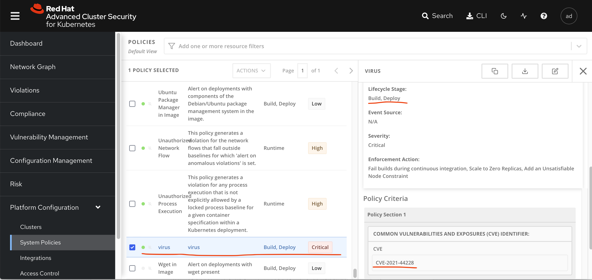
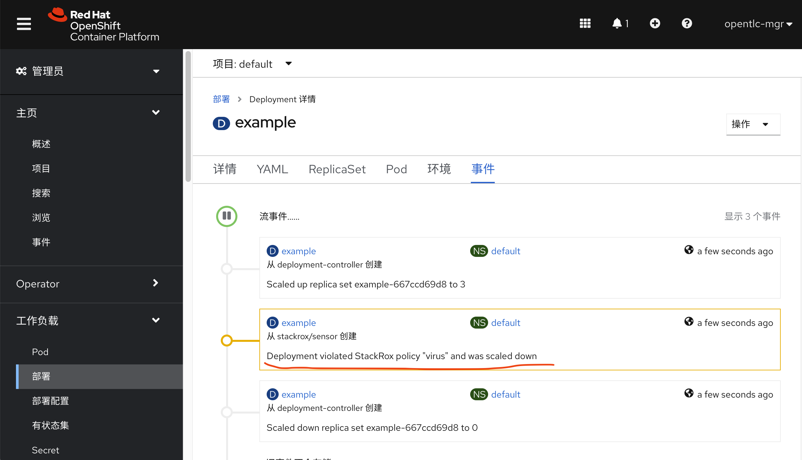

# virus test for docker image security scanning

几乎所有的容器平台，都有容器安全的方案，比如大名鼎鼎的clair，但是他们的扫描原理并不是深度扫描，而是通过容器内部yum, apk等包管理工具，扫描包管理工具的历史数据库，看装在容器里面的软件版本，从而判断是否有漏洞的。

这种扫描方法，当然是为了性能，但是也给日常实践带来了困扰，一般工程师很容易的以为，我们上了一个容器安全平台，就可以高枕无忧了，其实不是这样的。

以下我们就举一个实际的例子，看看效果，然后我们再来想想怎么应对。

# test quay / clair / docker hub

我们用网上的测试病毒，复制到容器里面去，打包，上传到镜像仓库，看看镜像仓库的扫描结果。为了更有代表性，我们把病毒复制成java，然后我们把镜像分别上传quay.io, docker hub

```bash
mkdir -p /data/tmp
cd /data/tmp

cat << EOF > ./virus.Dockerfile
FROM registry.access.redhat.com/ubi8/ubi-minimal
ADD https://www.ikarussecurity.com/wp-content/downloads/eicar_com.zip /wzh
ADD https://github.com/MalwareSamples/Linux-Malware-Samples/blob/main/00ae07c9fe63b080181b8a6d59c6b3b6f9913938858829e5a42ab90fb72edf7a /wzh01
ADD https://github.com/MalwareSamples/Linux-Malware-Samples/blob/main/00ae07c9fe63b080181b8a6d59c6b3b6f9913938858829e5a42ab90fb72edf7a /usr/bin/java

RUN chmod +x /wzh*
RUN chmod +x /usr/bin/java
EOF

buildah bud -t quay.io/wangzheng422/qimgs:virus -f virus.Dockerfile ./

buildah push quay.io/wangzheng422/qimgs:virus

buildah bud -t docker.io/wangzheng422/virus -f virus.Dockerfile ./

buildah push docker.io/wangzheng422/virus

```

我们发现，包含病毒的镜像，在两个容器镜像平台上，都扫描不出来。这也就证明了，普通的扫描工具，只能扫描包管理工具的历史数据库，而不能扫描容器内部的软件版本。

# log4jshell

现在大名顶顶的log4j的漏洞，各地平台扫描能不一样，能扫描的也是检测容器里面的jar文件，然后看这个jar文件里面的MANIFEST.MF文件，在这个文件里面看看对应软件包的版本号，然后报警。

我们可以看看 quay.io/apoczeka/log4shell-vuln 这个容器，在quay.io上面的扫描结果，可以看到他无法发现log4j的漏洞。

## ACS

那么我们看看红帽RHACS容器安全平台能不能扫出来。

```bash
# on vultr
wget https://mirror.openshift.com/pub/rhacs/assets/latest/bin/linux/roxctl
install -m 755 roxctl /usr/local/bin/

# on ACS platform
# Integrations -> API Token -> Create Integration
# role -> continous-integration -> create
# copy the API token out
export ROX_API_TOKEN=<api_token>
export ROX_CENTRAL_ADDRESS=central-stackrox.apps.cluster-ms246.ms246.sandbox1059.opentlc.com:443

roxctl -e "$ROX_CENTRAL_ADDRESS" --insecure-skip-tls-verify image scan -i docker.io/elastic/logstash:7.13.0 | jq '.scan.components[] | .vulns[]? | select(.cve == "CVE-2021-44228") | .cve'
# "CVE-2021-44228"
# "CVE-2021-44228"

roxctl -e "$ROX_CENTRAL_ADDRESS" --insecure-skip-tls-verify image scan -i quay.io/apoczeka/log4shell-vuln | jq '.scan.components[] | .vulns[]? | select(.cve == "CVE-2021-44228") | .cve'
# "CVE-2021-44228"

roxctl -e "$ROX_CENTRAL_ADDRESS" --insecure-skip-tls-verify image check -r 0 -o json -i docker.io/elastic/logstash:7.13.0 

```

我们可以看到ACS成功的检测到了log4j的漏洞。这样我们就可以把ACS继承到我们CI/CD流水线里面去，完成漏洞扫描。

当然，我们可以使用ACS内置的界面工具，快速的定义规则，并且第一时间禁止相关的漏洞。



这里是配置生效以后（要有点下发的时间，如果集群比较繁忙的话），ACS阻止有漏洞的镜像运行的效果。



不过，目前ACS只支持deployment模式的部署，你要是修改deployment, 或者干脆用pod直接部署，都会绕过ACS的检测，这个以后看ACS升级解决吧。

# grype

类似ACS的命令行工具，还有很多其他的选择，这里举个例子。

```bash
# https://github.com/anchore/grype

grype -q quay.io/apoczeka/log4shell-vuln | grep log4j
# log4j-api          2.14.1       2.15.0       GHSA-jfh8-c2jp-5v3q  Critical
# log4j-api          2.14.1       2.16.0       GHSA-7rjr-3q55-vv33  Medium
# log4j-api          2.14.1                    CVE-2021-44228       Critical
# log4j-core         2.14.1       2.15.0       GHSA-jfh8-c2jp-5v3q  Critical
# log4j-core         2.14.1       2.16.0       GHSA-7rjr-3q55-vv33  Medium
# log4j-core         2.14.1                    CVE-2021-44228       Critical
# log4j-jul          2.14.1                    CVE-2021-44228       Critical
# log4j-slf4j-impl   2.14.1                    CVE-2021-44228       Critical


```