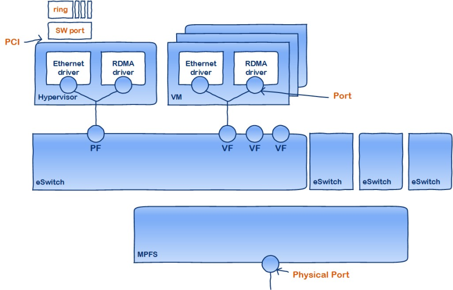
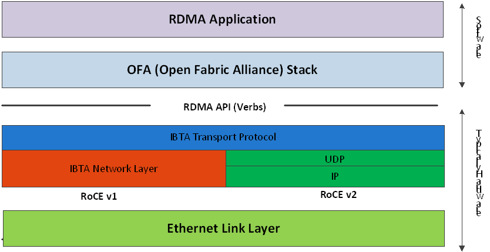
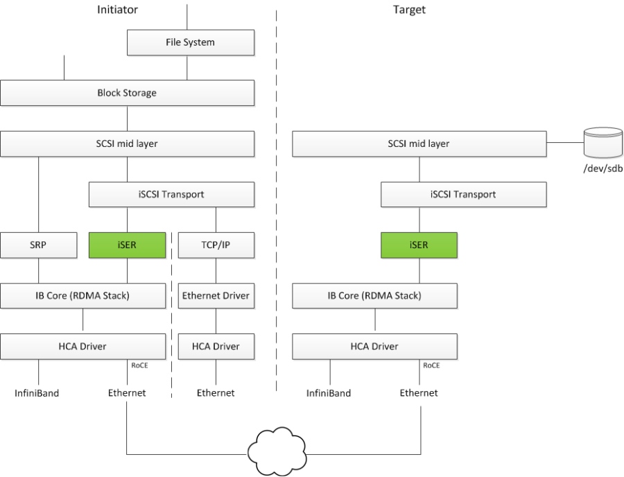
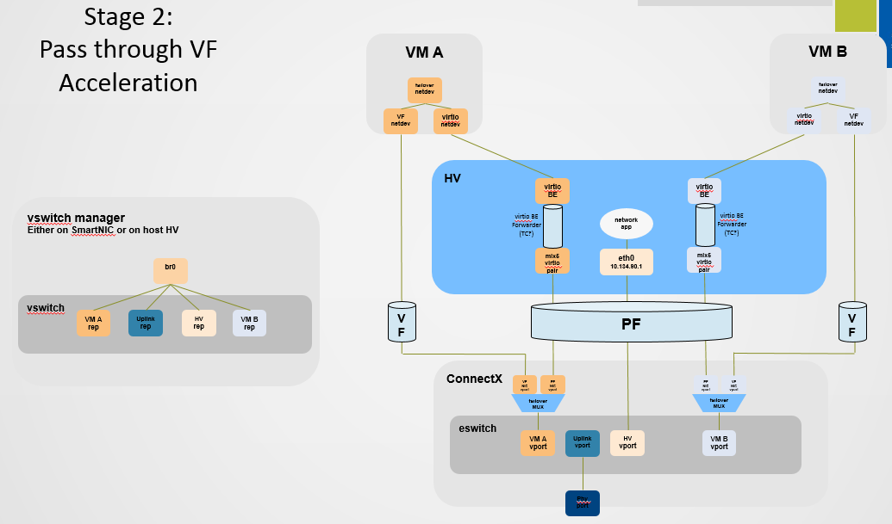

# Mellanox CX6dx vdpa offload

https://docs.mellanox.com/display/MLNXENv541030

https://docs.mellanox.com/display/MLNXOFEDv53100143/Introduction










有一个很麻烦的vf representor的概念，dpdk文档有说，简单里面，是给控制面准备的vf的分身。
- https://doc.dpdk.org/guides-18.11/prog_guide/switch_representation.html
```
   .-------------.                 .-------------. .-------------.
   | hypervisor  |                 |    VM 1     | |    VM 2     |
   | application |                 | application | | application |
   `--+---+---+--'                 `----------+--' `--+----------'
      |   |   |                               |       |
      |   |   `-------------------.           |       |
      |   `---------.             |           |       |
      |             |             |           |       |
.-----+-----. .-----+-----. .-----+-----.     |       |
| port_id 3 | | port_id 4 | | port_id 5 |     |       |
`-----+-----' `-----+-----' `-----+-----'     |       |
      |             |             |           |       |
    .-+--.    .-----+-----. .-----+-----. .---+--. .--+---.
    | PF |    | VF 1 rep. | | VF 2 rep. | | VF 1 | | VF 2 |
    `-+--'    `-----+-----' `-----+-----' `---+--' `--+---'
      |             |             |           |       |
      |             |   .---------'           |       |
      `-----.       |   |   .-----------------'       |
            |       |   |   |   .---------------------'
            |       |   |   |   |
         .--+-------+---+---+---+--.
         | managed interconnection |
         `------------+------------'
                      |
                 .----+-----.
                 | physical |
                 |  port 0  |
                 `----------'
```
# 103
## ovs offload
```bash

# on 103
lspci | grep -i mella
# 04:00.0 Ethernet controller: Mellanox Technologies MT2892 Family [ConnectX-6 Dx]
# 04:00.1 Ethernet controller: Mellanox Technologies MT2892 Family [ConnectX-6 Dx]

ibdev2netdev -v | grep -i connect
# mlx5_0 (mt4125 - MCX623102AN-ADAT) ConnectX-6 Dx EN adapter card, 25GbE, Dual-port SFP28, PCIe 4.0 x16  fw 22.29.1016 port 1 (DOWN  ) ==> enp4s0f0 (Down)
# mlx5_1 (mt4125 - MCX623102AN-ADAT) ConnectX-6 Dx EN adapter card, 25GbE, Dual-port SFP28, PCIe 4.0 x16  fw 22.29.1016 port 1 (DOWN  ) ==> enp4s0f1 (Down)

# 103 rocky 8.4

echo 'fastestmirror=1' >> /etc/dnf/dnf.conf

export VAR_HOST='rl_panlab103'

cp /etc/default/grub /etc/default/grub.bak
sed -i "/GRUB_CMDLINE_LINUX/s/resume=[^[:space:]]*//"  /etc/default/grub
sed -i "/GRUB_CMDLINE_LINUX/s/rd.lvm.lv=${VAR_HOST}\\/swap//"  /etc/default/grub
# https://unix.stackexchange.com/questions/403706/sed-insert-text-after-nth-character-preceding-following-a-given-string
sed -i '/GRUB_CMDLINE_LINUX/s/"/ intel_iommu=on iommu=pt  default_hugepagesz=1G hugepagesz=1G hugepages=8 rdblacklist=nouveau"/2' /etc/default/grub

grub2-mkconfig -o /boot/efi/EFI/rocky/grub.cfg

grub2-mkconfig -o /boot/grub2/grub.cfg

cat << EOF > /etc/modprobe.d/kvm-nested.conf
options kvm_intel nested=1  
options kvm-intel enable_shadow_vmcs=1   
options kvm-intel enable_apicv=1         
options kvm-intel ept=1                  
EOF

umount /home
swapoff  /dev/$VAR_HOST/swap

cp /etc/fstab /etc/fstab.bak
sed -i 's/^[^#]*home/#&/' /etc/fstab
sed -i 's/^[^#]*swap/#&/' /etc/fstab

lvremove -f /dev/$VAR_HOST/home
lvremove -f /dev/$VAR_HOST/swap

lvextend -l +100%FREE /dev/$VAR_HOST/root
xfs_growfs /dev/$VAR_HOST/root

# 103 driver install
# https://www.mellanox.com/products/infiniband-drivers/linux/mlnx_ofed

cd /data/down/MLNX_OFED_LINUX-5.4-1.0.3.0-rhel8.4-x86_64

yum install -y tcl tk kernel-modules-extra python36 make gcc-gfortran tcsh unbound
./mlnxofedinstall --force --distro rhel8.4
# Device (04:00.0):
#         04:00.0 Ethernet controller: Mellanox Technologies MT2892 Family [ConnectX-6 Dx]
#         Link Width: x8 ( WARNING - device supports x16 )
#         PCI Link Speed: 8GT/s

# Device (04:00.1):
#         04:00.1 Ethernet controller: Mellanox Technologies MT2892 Family [ConnectX-6 Dx]
#         Link Width: x8 ( WARNING - device supports x16 )
#         PCI Link Speed: 8GT/s


# Installation finished successfully.


# Verifying...                          ################################# [100%]
# Preparing...                          ################################# [100%]
# Updating / installing...
#    1:mlnx-fw-updater-5.4-1.0.3.0      ################################# [100%]

# Added 'RUN_FW_UPDATER_ONBOOT=no to /etc/infiniband/openib.conf

# Initializing...
# Attempting to perform Firmware update...
# Querying Mellanox devices firmware ...

# Device #1:
# ----------

#   Device Type:      ConnectX6DX
#   Part Number:      MCX623102AN-ADA_Ax
#   Description:      ConnectX-6 Dx EN adapter card; 25GbE; Dual-port SFP28; PCIe 4.0/3.0 x16
#   PSID:             MT_0000000355
#   PCI Device Name:  04:00.0
#   Base GUID:        0c42a10300fa1852
#   Base MAC:         0c42a1fa1852
#   Versions:         Current        Available
#      FW             22.29.1016     22.31.1014
#      PXE            3.6.0204       3.6.0403
#      UEFI           14.22.0014     14.24.0013

#   Status:           Update required

# ---------
# Found 1 device(s) requiring firmware update...

# Device #1: Updating FW ...
# FSMST_INITIALIZE -   OK
# Writing Boot image component -   OK
# Done

# Restart needed for updates to take effect.
# Log File: /tmp/Tp8oUJN4tb
# Real log file: /tmp/MLNX_OFED_LINUX.145665.logs/fw_update.log
# To load the new driver, run:
# /etc/init.d/openibd restart

systemctl enable --now mst
systemctl enable --now openibd

cat << EOF > /etc/yum.repos.d/mlx.repo
[mlnx_ofed]
name=MLNX_OFED Repository
baseurl=file:///data/down/MLNX_OFED_LINUX-5.4-1.0.3.0-rhel8.4-x86_64/RPMS
enabled=1
gpgcheck=0
EOF

mlnx_qos -i enp4s0f0
# DCBX mode: OS controlled
# Priority trust state: pcp
# default priority:
# Receive buffer size (bytes): 0,156096,0,0,0,0,0,0,
# Cable len: 7
# PFC configuration:
#         priority    0   1   2   3   4   5   6   7
#         enabled     0   0   0   0   0   0   0   0
#         buffer      1   1   1   1   1   1   1   1
# tc: 1 ratelimit: unlimited, tsa: vendor
#          priority:  0
# tc: 0 ratelimit: unlimited, tsa: vendor
#          priority:  1
# tc: 2 ratelimit: unlimited, tsa: vendor
#          priority:  2
# tc: 3 ratelimit: unlimited, tsa: vendor
#          priority:  3
# tc: 4 ratelimit: unlimited, tsa: vendor
#          priority:  4
# tc: 5 ratelimit: unlimited, tsa: vendor
#          priority:  5
# tc: 6 ratelimit: unlimited, tsa: vendor
#          priority:  6
# tc: 7 ratelimit: unlimited, tsa: vendor
#          priority:  7

ethtool -l enp4s0f0
# Channel parameters for enp4s0f0:
# Pre-set maximums:
# RX:             n/a
# TX:             n/a
# Other:          512
# Combined:       24
# Current hardware settings:
# RX:             n/a
# TX:             n/a
# Other:          0
# Combined:       24

cat /boot/config-4.18.0-305.19.1.el8_4.x86_64 | grep -i CONFIG_XFRM_OFFLOAD
# CONFIG_XFRM_OFFLOAD=y

cat /boot/config-4.18.0-305.19.1.el8_4.x86_64 | grep -i CONFIG_INET_ESP_OFFLOAD
# CONFIG_INET_ESP_OFFLOAD=m

cat /boot/config-4.18.0-305.19.1.el8_4.x86_64 | grep -i CONFIG_INET6_ESP_OFFLOAD
# CONFIG_INET6_ESP_OFFLOAD=m

# in docs
# Mellanox ASAP2 with OVS Deployment

ethtool -i enp4s0f0 | head -5
# driver: mlx5_core
# version: 5.4-1.0.3
# firmware-version: 22.31.1014 (MT_0000000355)
# expansion-rom-version:
# bus-info: 0000:04:00.0

# in docs
# OVS Hardware Offloads Configuration
dnf install -y git cmake gcc libnl3-devel libudev-devel make pkgconfig valgrind-devel pandoc libibverbs libmlx5 libmnl-devel

mkdir -p /data/soft
cd /data/soft

wget https://github.com/mesonbuild/meson/releases/download/0.59.2/meson-0.59.2.tar.gz
tar zvxf meson-0.59.2.tar.gz
cd /data/soft/meson-0.59.2
python3 setup.py install

dnf config-manager --set-enabled powertools
dnf install -y ninja-build

# dnf group list
dnf groupinstall -y 'Development Tools'
# install dpdk
dnf install -y mlnx-dpdk mlnx-dpdk-devel openvswitch libnl3-devel openssl-devel zlib-devel libpcap-devel elfutils-libelf-devel

cd /data/soft/
wget https://fast.dpdk.org/rel/dpdk-20.11.3.tar.xz
tar vxf dpdk-20.11.3.tar.xz
# https://core.dpdk.org/doc/quick-start/
cd /data/soft/dpdk-stable-20.11.3/
# meson -Dexamples=all build
meson --reconfigure -Dexamples=all build
ninja -C build

export PKG_CONFIG_PATH=/opt/mellanox/dpdk/lib64/pkgconfig/
cd /data/soft/dpdk-stable-20.11.3/examples/vdpa
make -j 

# install kvm with qemu
dnf -y groupinstall "Server with GUI"

dnf -y install qemu-kvm libvirt libguestfs-tools virt-install virt-viewer virt-manager tigervnc-server

systemctl disable --now firewalld
systemctl enable --now libvirtd

# set sriov
# https://docs.mellanox.com/pages/viewpage.action?pageId=52014545#OVSOffloadUsingASAP%C2%B2Direct-SettingUpSR-IOV
# https://docs.mellanox.com/pages/viewpage.action?pageId=52011200#OVSOffloadUsingASAP%C2%B2Direct-SettingUpSR-IOV

# go to system bios, enable sr-iov feature
# check out your server's mother board guide
# for dell, check here 
# https://infohub.delltechnologies.com/l/sr-iov-enablement-for-container-pods-in-openshift-4-3-ready-stack/enable-sr-iov-bits-from-bios

cd /data/down/MLNX_OFED_LINUX-5.4-1.0.3.0-rhel8.4-x86_64
./mlnxofedinstall --ovs-dpdk --upstream-libs --force --distro rhel8.4

lspci -D | grep -i mell
# 0000:04:00.0 Ethernet controller: Mellanox Technologies MT2892 Family [ConnectX-6 Dx]
# 0000:04:00.1 Ethernet controller: Mellanox Technologies MT2892 Family [ConnectX-6 Dx]

lshw -c network -businfo
# Bus info          Device     Class          Description
# =======================================================
# pci@0000:02:00.0  eno3       network        NetXtreme BCM5720 2-port Gigabit Ethernet PCIe
# pci@0000:02:00.1  eno4       network        NetXtreme BCM5720 2-port Gigabit Ethernet PCIe
# pci@0000:01:00.0  eno1       network        NetXtreme BCM5720 2-port Gigabit Ethernet PCIe
# pci@0000:01:00.1  eno2       network        NetXtreme BCM5720 2-port Gigabit Ethernet PCIe
# pci@0000:04:00.0  enp4s0f0   network        MT2892 Family [ConnectX-6 Dx]
# pci@0000:04:00.1  enp4s0f1   network        MT2892 Family [ConnectX-6 Dx]

# so we will use enp4s0f0

ethtool -i enp4s0f0 | head -5
# driver: mlx5_core
# version: 5.4-1.0.3
# firmware-version: 22.31.1014 (MT_0000000355)
# expansion-rom-version:
# bus-info: 0000:04:00.0

cat /sys/class/net/enp4s0f0/device/sriov_totalvfs
# 4

# UCTX_EN is for enable DevX
# DevX allows to access firmware objects
mlxconfig -y -d 0000:04:00.0 set SRIOV_EN=1 UCTX_EN=1 NUM_OF_VFS=8
# Device #1:
# ----------

# Device type:    ConnectX6DX
# Name:           MCX623102AN-ADA_Ax
# Description:    ConnectX-6 Dx EN adapter card; 25GbE; Dual-port SFP28; PCIe 4.0/3.0 x16
# Device:         0000:04:00.0

# Configurations:                              Next Boot       New
#          SRIOV_EN                            True(1)         True(1)
#          UCTX_EN                             True(1)         True(1)
#          NUM_OF_VFS                          4               8

#  Apply new Configuration? (y/n) [n] : y
# Applying... Done!
# -I- Please reboot machine to load new configurations.
reboot

mlxconfig -y -d 0000:04:00.0 query SRIOV_EN
mlxconfig -y -d 0000:04:00.0 query UCTX_EN
mlxconfig -y -d 0000:04:00.0 query NUM_OF_VFS

# total vf change from 4 to 8
cat /sys/class/net/enp4s0f0/device/sriov_totalvfs
# 8

# Turn ON SR-IOV on the PF device. 
cat /sys/class/net/enp4s0f0/device/sriov_numvfs
# 0
echo 2 > /sys/class/net/enp4s0f0/device/sriov_numvfs
cat /sys/class/net/enp4s0f0/device/sriov_numvfs
# 2

ip -d link
# ......
# 6: enp4s0f0: <NO-CARRIER,BROADCAST,MULTICAST,UP> mtu 1500 qdisc mq state DOWN mode DEFAULT group default qlen 1000
#     link/ether 0c:42:a1:fa:18:52 brd ff:ff:ff:ff:ff:ff promiscuity 0 minmtu 68 maxmtu 9978 addrgenmode none numtxqueues 712 numrxqueues 48 gso_max_size 65536 gso_max_segs 65535 portname p0 switchid 5218fa0003a1420c
#     vf 0     link/ether 00:00:00:00:00:00 brd ff:ff:ff:ff:ff:ff, spoof checking off, link-state auto, trust off, query_rss off
#     vf 1     link/ether 00:00:00:00:00:00 brd ff:ff:ff:ff:ff:ff, spoof checking off, link-state auto, trust off, query_rss off
# 7: enp4s0f1: <NO-CARRIER,BROADCAST,MULTICAST,UP> mtu 1500 qdisc mq state DOWN mode DEFAULT group default qlen 1000
#     link/ether 0c:42:a1:fa:18:53 brd ff:ff:ff:ff:ff:ff promiscuity 0 minmtu 68 maxmtu 9978 addrgenmode none numtxqueues 712 numrxqueues 48 gso_max_size 65536 gso_max_segs 65535 portname p1 switchid 5218fa0003a1420c
# ......
# 10: enp4s0f0v0: <NO-CARRIER,BROADCAST,MULTICAST,UP> mtu 1500 qdisc mq state DOWN mode DEFAULT group default qlen 1000
#     link/ether d2:4d:06:0c:44:65 brd ff:ff:ff:ff:ff:ff permaddr 32:07:d6:4c:36:d9 promiscuity 0 minmtu 68 maxmtu 9978 addrgenmode none numtxqueues 600 numrxqueues 22 gso_max_size 65536 gso_max_segs 65535 portname p0
# 11: enp4s0f0v1: <NO-CARRIER,BROADCAST,MULTICAST,UP> mtu 1500 qdisc mq state DOWN mode DEFAULT group default qlen 1000
#     link/ether ae:cd:54:48:21:8b brd ff:ff:ff:ff:ff:ff permaddr ee:9c:31:c2:d6:85 promiscuity 0 minmtu 68 maxmtu 9978 addrgenmode none numtxqueues 600 numrxqueues 22 gso_max_size 65536 gso_max_segs 65535 portname p0

ip link set enp4s0f0 vf 0 mac e4:11:22:33:44:50
ip link set enp4s0f0 vf 1 mac e4:11:22:33:44:51

ip link show enp4s0f0
# 6: enp4s0f0: <NO-CARRIER,BROADCAST,MULTICAST,UP> mtu 1500 qdisc mq state DOWN mode DEFAULT group default qlen 1000
#     link/ether 0c:42:a1:fa:18:52 brd ff:ff:ff:ff:ff:ff
#     vf 0     link/ether e4:11:22:33:44:50 brd ff:ff:ff:ff:ff:ff, spoof checking off, link-state auto, trust off, query_rss off
#     vf 1     link/ether e4:11:22:33:44:51 brd ff:ff:ff:ff:ff:ff, spoof checking off, link-state auto, trust off, query_rss off

# Running Hardware vDPA 
# Hardware vDPA supports SwitchDev mode only.
# Create the ASAP2 environment:
# Create the VFs. 
# Enter switchdev mode.
# Set up OVS. 

lspci -D | grep -i mell
# 0000:04:00.0 Ethernet controller: Mellanox Technologies MT2892 Family [ConnectX-6 Dx]
# 0000:04:00.1 Ethernet controller: Mellanox Technologies MT2892 Family [ConnectX-6 Dx]
# 0000:04:00.2 Ethernet controller: Mellanox Technologies ConnectX Family mlx5Gen Virtual Function
# 0000:04:00.3 Ethernet controller: Mellanox Technologies ConnectX Family mlx5Gen Virtual Function

# SwitchDev Configuration
# OVS-DPDK Hardware Offloads
# Unbind the VFs. 
echo 0000:04:00.2 > /sys/bus/pci/drivers/mlx5_core/unbind
echo 0000:04:00.3 > /sys/bus/pci/drivers/mlx5_core/unbind

# Change the eSwitch mode from Legacy to SwitchDev on the PF device.
# This will also create the VF representor netdevices in the host OS. 
devlink dev eswitch show pci/0000:04:00.0
# pci/0000:04:00.0: mode legacy inline-mode none encap-mode basic

devlink dev eswitch set pci/0000:04:00.0 mode switchdev

devlink dev eswitch show pci/0000:04:00.0
# pci/0000:04:00.0: mode switchdev inline-mode none encap-mode basic

# Bind the VFs. 
echo 0000:04:00.2 > /sys/bus/pci/drivers/mlx5_core/bind
echo 0000:04:00.3 > /sys/bus/pci/drivers/mlx5_core/bind

ip -d link
# ......
# 6: enp4s0f0: <NO-CARRIER,BROADCAST,MULTICAST,UP> mtu 1500 qdisc mq state DOWN mode DEFAULT group default qlen 1000
#     link/ether 0c:42:a1:fa:18:52 brd ff:ff:ff:ff:ff:ff promiscuity 0 minmtu 68 maxmtu 9978 addrgenmode none numtxqueues 712 numrxqueues 48 gso_max_size 65536 gso_max_segs 65535 portname p0 switchid 5218fa0003a1420c
#     vf 0     link/ether e4:11:22:33:44:50 brd ff:ff:ff:ff:ff:ff, spoof checking off, link-state disable, trust off, query_rss off
#     vf 1     link/ether e4:11:22:33:44:51 brd ff:ff:ff:ff:ff:ff, spoof checking off, link-state disable, trust off, query_rss off
# ......
# 12: enp4s0f0_0: <BROADCAST,MULTICAST,UP,LOWER_UP> mtu 1500 qdisc mq state UP mode DEFAULT group default qlen 1000
#     link/ether 32:08:64:fe:4d:83 brd ff:ff:ff:ff:ff:ff promiscuity 0 minmtu 68 maxmtu 9978 addrgenmode none numtxqueues 537 numrxqueues 24 gso_max_size 65536 gso_max_segs 65535 portname pf0vf0 switchid 5218fa0003a1420c
# 13: enp4s0f0_1: <BROADCAST,MULTICAST,UP,LOWER_UP> mtu 1500 qdisc mq state UP mode DEFAULT group default qlen 1000
#     link/ether d6:39:dc:f9:b4:4a brd ff:ff:ff:ff:ff:ff promiscuity 0 minmtu 68 maxmtu 9978 addrgenmode none numtxqueues 537 numrxqueues 24 gso_max_size 65536 gso_max_segs 65535 portname pf0vf1 switchid 5218fa0003a1420c
# 16: enp4s0f0v0: <BROADCAST,MULTICAST,UP,LOWER_UP> mtu 1500 qdisc mq state UP mode DEFAULT group default qlen 1000
#     link/ether e4:11:22:33:44:50 brd ff:ff:ff:ff:ff:ff promiscuity 0 minmtu 68 maxmtu 9978 addrgenmode none numtxqueues 600 numrxqueues 22 gso_max_size 65536 gso_max_segs 65535 portname p0
# 17: enp4s0f0v1: <BROADCAST,MULTICAST,UP,LOWER_UP> mtu 1500 qdisc mq state UP mode DEFAULT group default qlen 1000
#     link/ether e4:11:22:33:44:51 brd ff:ff:ff:ff:ff:ff promiscuity 0 minmtu 68 maxmtu 9978 addrgenmode none numtxqueues 600 numrxqueues 22 gso_max_size 65536 gso_max_segs 65535 portname p0

systemctl enable --now openvswitch
# Create an OVS bridge (here it's named ovs-sriov). 
ovs-vsctl add-br ovs-sriov
systemctl restart openvswitch

ovs-vsctl set Open_vSwitch . other_config:hw-offload=true

# https://gist.github.com/djoreilly/c5ea44663c133b246dd9d42b921f7646
ovs-vsctl list open_vswitch
# _uuid               : 79f565b0-e363-4e8b-b7b0-bb5592e7c2f6
# bridges             : [93aa49b1-c3e6-4428-9c7d-b7471f98d558]
# cur_cfg             : 2
# datapath_types      : [netdev, system]
# datapaths           : {}
# db_version          : "8.2.0"
# dpdk_initialized    : false
# dpdk_version        : "MLNX_DPDK 20.11.2.2.10"
# external_ids        : {hostname=panlab103, rundir="/var/run/openvswitch", system-id="6fde648b-bea1-46f9-8d28-35b8b728128b"}
# iface_types         : [erspan, geneve, gre, gtpu, internal, ip6erspan, ip6gre, lisp, patch, stt, system, tap, vxlan]
# manager_options     : []
# next_cfg            : 2
# other_config        : {hw-offload="true"}
# ovs_version         : "2.14.1"
# ssl                 : []
# statistics          : {}
# system_type         : rocky
# system_version      : "8.4"

# Add the PF and the VF representor netdevices as OVS ports. 
ovs-vsctl add-port ovs-sriov enp4s0f0
ovs-vsctl add-port ovs-sriov enp4s0f0_0
ovs-vsctl add-port ovs-sriov enp4s0f0_1

# Make sure to bring up the PF and representor netdevices. 
ip link set dev enp4s0f0 up
ip link set dev enp4s0f0_0 up
ip link set dev enp4s0f0_1 up

ip link set dev enp4s0f0v0 up
ip link set dev enp4s0f0v1 up

ovs-vsctl show
# 79f565b0-e363-4e8b-b7b0-bb5592e7c2f6
#     Bridge ovs-sriov
#         Port enp4s0f0_0
#             Interface enp4s0f0_0
#                 error: "could not open network device enp4s0f0_0 (No such device)"
#         Port enp4s0f0
#             Interface enp4s0f0
#         Port ovs-sriov
#             Interface ovs-sriov
#                 type: internal
#         Port enp4s0f0_1
#             Interface enp4s0f0_1
#                 error: "could not open network device enp4s0f0_1 (No such device)"
#     ovs_version: "2.14.1"

ovs-dpctl show
# system@ovs-system:
#   lookups: hit:0 missed:0 lost:0
#   flows: 0
#   masks: hit:0 total:0 hit/pkt:0.00
#   port 0: ovs-system (internal)
#   port 1: ovs-sriov (internal)
#   port 2: enp4s0f0
#   port 3: enp4s0f0_0
#   port 4: enp4s0f0_1

ip addr add 192.168.77.21/24 dev enp4s0f0v0
ip addr add 192.168.77.22/24 dev enp4s0f0v1
ping -I enp4s0f0v0 192.168.77.22
# here is wrong, I think it should ping ok
# boot 105, and ping doesn't work either

# ip addr del 192.168.77.21/24 dev enp4s0f0v0
# ip addr del 192.168.77.22/24 dev enp4s0f0v1

ovs-dpctl dump-flows
ovs-appctl dpctl/dump-flows type=offloaded
```
## vdpa
```bash
# vdpa
# OVS-DPDK Hardware Offloads
ovs-vsctl del-port ovs-sriov enp4s0f0
ovs-vsctl del-port ovs-sriov enp4s0f0_0
ovs-vsctl del-port ovs-sriov enp4s0f0_1
ovs-vsctl del-br ovs-sriov

ovs-vsctl --no-wait set Open_vSwitch . other_config:dpdk-init=true
ovs-vsctl set Open_vSwitch . other_config:hw-offload=true
# Configure the DPDK white list. 
ovs-vsctl --no-wait set Open_vSwitch . other_config:dpdk-extra="-w 0000:04:00.0,representor=[0],dv_flow_en=1,dv_esw_en=1,dv_xmeta_en=1 --log-level=mlx5,8"

mkdir -p /hugepages
mount -t hugetlbfs hugetlbfs /hugepages

cat /sys/devices/system/node/node0/hugepages/hugepages-1048576kB/nr_hugepages
# 4
cat /sys/devices/system/node/node1/hugepages/hugepages-1048576kB/nr_hugepages
# 4

echo 4 > /sys/devices/system/node/node0/hugepages/hugepages-1048576kB/nr_hugepages 
echo 4 > /sys/devices/system/node/node1/hugepages/hugepages-1048576kB/nr_hugepages

systemctl restart openvswitch
# failed to start, 
# 2021-10-22T12:56:14.944Z|00019|dpdk|ERR|EAL: Cannot remap memory for rte_config
# 2021-10-22T12:56:14.944Z|00020|dpdk|ERR|EAL: Cannot init config
# 2021-10-22T12:56:14.944Z|00021|dpdk|EMER|Unable to initialize DPDK: Success

ovs-vsctl --no-wait set Open_vSwitch . other_config:dpdk-init=false
ovs-vsctl --no-wait set Open_vSwitch . other_config:dpdk-extra=" "

# debug
cat /var/log/openvswitch/ovs-vswitchd.log

```

# 105
```bash
# on 105
lspci |grep -i mell
# 05:00.0 Infiniband controller: Mellanox Technologies MT28908 Family [ConnectX-6]
# 43:00.0 Ethernet controller: Mellanox Technologies MT2892 Family [ConnectX-6 Dx]
# 43:00.1 Ethernet controller: Mellanox Technologies MT2892 Family [ConnectX-6 Dx]

lshw -c network -businfo
# Bus info          Device        Class          Description
# ==========================================================
# pci@0000:02:00.0  eno3          network        NetXtreme BCM5720 2-port Gigabit Ethernet PCIe
# pci@0000:02:00.1  eno4          network        NetXtreme BCM5720 2-port Gigabit Ethernet PCIe
# pci@0000:01:00.0  eno1          network        NetXtreme BCM5720 2-port Gigabit Ethernet PCIe
# pci@0000:01:00.1  eno2          network        NetXtreme BCM5720 2-port Gigabit Ethernet PCIe
# pci@0000:05:00.0  ib0           network        MT28908 Family [ConnectX-6]
# pci@0000:43:00.0  enp67s0f0     network        MT2892 Family [ConnectX-6 Dx]
# pci@0000:43:00.1  enp67s0f1     network        MT2892 Family [ConnectX-6 Dx]

export VAR_HOST='rl_panlab105'

cat << EOF > /etc/modprobe.d/blacklist-nouveau.conf
blacklist nouveau
options nouveau modeset=0
EOF
dracut --force

export IFNAME=enp67s0f0
export PCINUM=0000:43:00.0

mlxconfig -y -d $PCINUM set SRIOV_EN=1 UCTX_EN=1 NUM_OF_VFS=8
reboot

mlxconfig -y -d $PCINUM query SRIOV_EN
mlxconfig -y -d $PCINUM query UCTX_EN
mlxconfig -y -d $PCINUM query NUM_OF_VFS

cat /sys/class/net/$IFNAME/device/sriov_totalvfs
# 8

# Turn ON SR-IOV on the PF device. 
cat /sys/class/net/$IFNAME/device/sriov_numvfs
# 0
echo 2 > /sys/class/net/$IFNAME/device/sriov_numvfs
cat /sys/class/net/$IFNAME/device/sriov_numvfs
# 2

ip link set $IFNAME vf 0 mac e4:11:22:33:55:60
ip link set $IFNAME vf 1 mac e4:11:22:33:55:61

echo ${PCINUM%%.*}.2 > /sys/bus/pci/drivers/mlx5_core/unbind
echo ${PCINUM%%.*}.3 > /sys/bus/pci/drivers/mlx5_core/unbind

devlink dev eswitch set pci/$PCINUM mode switchdev
devlink dev eswitch show pci/$PCINUM
# pci/0000:43:00.0: mode switchdev inline-mode none encap-mode basic

echo ${PCINUM%%.*}.2 > /sys/bus/pci/drivers/mlx5_core/bind
echo ${PCINUM%%.*}.3 > /sys/bus/pci/drivers/mlx5_core/bind

ip addr add 192.168.77.31/24 dev ${IFNAME}v0

systemctl enable --now openvswitch
# Create an OVS bridge (here it's named ovs-sriov). 
ovs-vsctl add-br ovs-sriov

systemctl restart openvswitch

ovs-vsctl add-port ovs-sriov ${IFNAME}
ovs-vsctl add-port ovs-sriov ${IFNAME}_0
ovs-vsctl add-port ovs-sriov ${IFNAME}_1

ip link set dev ${IFNAME} up
ip link set dev ${IFNAME}_0 up
ip link set dev ${IFNAME}_1 up

ip link set dev ${IFNAME}v0 up
ip link set dev ${IFNAME}v1 up

cat /sys/class/net/${IFNAME}/compat/devlink/mode
# switchdev

ovs-vsctl show
ovs-dpctl show

# ovs-vsctl --no-wait set Open_vSwitch . other_config:dpdk-init=true
ovs-vsctl --no-wait set Open_vSwitch . other_config:dpdk-init=try
ovs-vsctl set Open_vSwitch . other_config:hw-offload=true
# Configure the DPDK white list. 
ovs-vsctl --no-wait set Open_vSwitch . other_config:dpdk-extra="-w ${PCINUM},representor=[0-1],dv_flow_en=1,dv_esw_en=1,dv_xmeta_en=1 --log-level=mlx5,8"
ovs-vsctl --no-wait set Open_vSwitch . other_config:dpdk-hugepage-dir=/hugepages

mkdir -p /hugepages
mount -t hugetlbfs hugetlbfs /hugepages

umount /hugepages
mount -t hugetlbfs none /hugepages

cat /var/log/openvswitch/ovs-vswitchd.log

/opt/mellanox/dpdk/bin/testpmd -w ${PCINUM}

sysctl -w vm.nr_hugepages=2048

cat /proc/meminfo | grep -i huge

ovs-vsctl del-port ovs-sriov ${IFNAME}
ovs-vsctl del-port ovs-sriov ${IFNAME}_0
ovs-vsctl del-port ovs-sriov ${IFNAME}_1
ovs-vsctl del-br ovs-sriov


ovs-vsctl --no-wait set Open_vSwitch . other_config:dpdk-init=false
ovs-vsctl --no-wait set Open_vSwitch . other_config:dpdk-extra=" "

systemctl restart openvswitch

lspci |grep -i mell
# 05:00.0 Infiniband controller: Mellanox Technologies MT28908 Family [ConnectX-6]
# 43:00.0 Ethernet controller: Mellanox Technologies MT2892 Family [ConnectX-6 Dx]
# 43:00.1 Ethernet controller: Mellanox Technologies MT2892 Family [ConnectX-6 Dx]
# 43:00.2 Ethernet controller: Mellanox Technologies ConnectX Family mlx5Gen Virtual Function
# 43:00.3 Ethernet controller: Mellanox Technologies ConnectX Family mlx5Gen Virtual Function

cd /data/soft/dpdk-stable-20.11.3/examples/vdpa/build
./vdpa -w ${PCINUM%%.*}.2,class=vdpa --log-level=pmd,info -- -i
create /tmp/sock-virtio0 0000:43:00.2

# https://doc.dpdk.org/guides/sample_app_ug/vdpa.html
modprobe vfio-pci
/data/soft/dpdk-stable-20.11.3/usertools//dpdk-devbind.py -b vfio-pci 43:00.2
/data/soft/dpdk-stable-20.11.3/examples/vdpa/build/vdpa -a ${PCINUM%%.*}.2,class=vdpa --log-level=pmd,info -- -i

```

## kvm

```bash
export DOMAIN=cx6

virt-install --name="cx6" --vcpus=2 --ram=8192 \
--cpu=host-model \
--disk path=/data/kvm/cx6.qcow2,bus=virtio,size=30 \
--os-variant rhel8.4 \
--network type=direct,source=eno1,source_mode=bridge,model=virtio \
--graphics vnc,port=59000 \
--boot menu=on --location /data/kvm/Rocky-8.4-x86_64-minimal.iso \
--initrd-inject helper-ks-rocky.cfg --extra-args "inst.ks=file:/helper-ks-rocky.cfg" 

# https://unix.stackexchange.com/questions/235414/libvirt-how-to-pass-qemu-command-line-args
# virt-xml $DOMAIN --edit --confirm --qemu-commandline 'env=MY-ENV=1234'
virt-xml $DOMAIN --edit --confirm --qemu-commandline='-chardev socket,id=charnet1,path=/tmp/sock-virtio0'
virt-xml $DOMAIN --edit --confirm --qemu-commandline='-netdev vhost-user,chardev=charnet1,queues=16,id=hostnet1'
virt-xml $DOMAIN --edit --confirm --qemu-commandline='-device virtio-net-pci,mq=on,vectors=6,netdev=hostnet1,id=net1,mac=e4:11:c6:d3:45:f2,bus=pci.0,addr=0x6,
   page-per-vq=on,rx_queue_size=1024,tx_queue_size=1024'

virsh dumpxml cx6
```
```xml
<domain type='qemu' xmlns:qemu='http://libvirt.org/schemas/domain/qemu/1.0'>
  <name>cx6</name>
  <uuid>98eebc24-3b6f-465d-bff0-1a6093b2263c</uuid>
  <metadata>
    <libosinfo:libosinfo xmlns:libosinfo="http://libosinfo.org/xmlns/libvirt/domain/1.0">
      <libosinfo:os id="http://redhat.com/rhel/8.4"/>
    </libosinfo:libosinfo>
  </metadata>
  <memory unit='KiB'>8388608</memory>
  <currentMemory unit='KiB'>8388608</currentMemory>
  <memoryBacking>
    <hugepages>
      <page size='1048576' unit='KiB'/>
    </hugepages>
  </memoryBacking>
  <vcpu placement='static'>2</vcpu>
  <cputune>
    <vcpupin vcpu='0' cpuset='14'/>
    <vcpupin vcpu='1' cpuset='16'/>
  </cputune>
  <os>
    <type arch='x86_64' machine='pc-q35-rhel8.2.0'>hvm</type>
    <boot dev='hd'/>
    <bootmenu enable='yes'/>
  </os>
  <features>
    <acpi/>
    <apic/>
  </features>
  <cpu mode='host-model' check='partial'>
    <numa>
      <cell id='0' cpus='0-1' memory='8388608' unit='KiB' memAccess='shared'/>
    </numa>
  </cpu>
  <clock offset='utc'>
    <timer name='rtc' tickpolicy='catchup'/>
    <timer name='pit' tickpolicy='delay'/>
    <timer name='hpet' present='no'/>
  </clock>
  <on_poweroff>destroy</on_poweroff>
  <on_reboot>restart</on_reboot>
  <on_crash>destroy</on_crash>
  <pm>
    <suspend-to-mem enabled='no'/>
    <suspend-to-disk enabled='no'/>
  </pm>
  <devices>
    <emulator>/usr/libexec/qemu-kvm</emulator>
    <disk type='file' device='disk'>
      <driver name='qemu' type='qcow2'/>
      <source file='/data/kvm/cx6.qcow2'/>
      <target dev='vda' bus='virtio'/>
      <address type='pci' domain='0x0000' bus='0x04' slot='0x00' function='0x0'/>
    </disk>
    <disk type='file' device='cdrom'>
      <driver name='qemu' type='raw'/>
      <target dev='sda' bus='sata'/>
      <readonly/>
      <address type='drive' controller='0' bus='0' target='0' unit='0'/>
    </disk>
    <controller type='usb' index='0' model='qemu-xhci' ports='15'>
      <address type='pci' domain='0x0000' bus='0x02' slot='0x00' function='0x0'/>
    </controller>
    <controller type='sata' index='0'>
      <address type='pci' domain='0x0000' bus='0x00' slot='0x1f' function='0x2'/>
    </controller>
    <controller type='pci' index='0' model='pcie-root'/>
    <controller type='pci' index='1' model='pcie-root-port'>
      <model name='pcie-root-port'/>
      <target chassis='1' port='0x10'/>
      <address type='pci' domain='0x0000' bus='0x00' slot='0x02' function='0x0' multifunction='on'/>
    </controller>
    <controller type='pci' index='2' model='pcie-root-port'>
      <model name='pcie-root-port'/>
      <target chassis='2' port='0x11'/>
      <address type='pci' domain='0x0000' bus='0x00' slot='0x02' function='0x1'/>
    </controller>
    <controller type='pci' index='3' model='pcie-root-port'>
      <model name='pcie-root-port'/>
      <target chassis='3' port='0x12'/>
      <address type='pci' domain='0x0000' bus='0x00' slot='0x02' function='0x2'/>
    </controller>
    <controller type='pci' index='4' model='pcie-root-port'>
      <model name='pcie-root-port'/>
      <target chassis='4' port='0x13'/>
      <address type='pci' domain='0x0000' bus='0x00' slot='0x02' function='0x3'/>
    </controller>
    <controller type='pci' index='5' model='pcie-root-port'>
      <model name='pcie-root-port'/>
      <target chassis='5' port='0x14'/>
      <address type='pci' domain='0x0000' bus='0x00' slot='0x02' function='0x4'/>
    </controller>
    <controller type='pci' index='6' model='pcie-root-port'>
      <model name='pcie-root-port'/>
      <target chassis='6' port='0x15'/>
      <address type='pci' domain='0x0000' bus='0x00' slot='0x02' function='0x5'/>
    </controller>
    <controller type='pci' index='7' model='pcie-root-port'>
      <model name='pcie-root-port'/>
      <target chassis='7' port='0x16'/>
      <address type='pci' domain='0x0000' bus='0x00' slot='0x02' function='0x6'/>
    </controller>
    <controller type='virtio-serial' index='0'>
      <address type='pci' domain='0x0000' bus='0x03' slot='0x00' function='0x0'/>
    </controller>
    <interface type='direct'>
      <mac address='52:54:00:dd:3a:38'/>
      <source dev='eno1' mode='bridge'/>
      <model type='virtio'/>
      <address type='pci' domain='0x0000' bus='0x01' slot='0x00' function='0x0'/>
    </interface>
    <serial type='pty'>
      <target type='isa-serial' port='0'>
        <model name='isa-serial'/>
      </target>
    </serial>
    <console type='pty'>
      <target type='serial' port='0'/>
    </console>
    <channel type='unix'>
      <target type='virtio' name='org.qemu.guest_agent.0'/>
      <address type='virtio-serial' controller='0' bus='0' port='1'/>
    </channel>
    <input type='tablet' bus='usb'>
      <address type='usb' bus='0' port='1'/>
    </input>
    <input type='mouse' bus='ps2'/>
    <input type='keyboard' bus='ps2'/>
    <graphics type='vnc' port='59000' autoport='no'>
      <listen type='address'/>
    </graphics>
    <video>
      <model type='qxl' ram='65536' vram='65536' vgamem='16384' heads='1' primary='yes'/>
      <address type='pci' domain='0x0000' bus='0x00' slot='0x01' function='0x0'/>
    </video>
    <memballoon model='virtio'>
      <address type='pci' domain='0x0000' bus='0x05' slot='0x00' function='0x0'/>
    </memballoon>
    <rng model='virtio'>
      <backend model='random'>/dev/urandom</backend>
      <address type='pci' domain='0x0000' bus='0x06' slot='0x00' function='0x0'/>
    </rng>
  </devices>
  <qemu:commandline>
    <qemu:arg value='-chardev'/>
    <qemu:arg value='socket,id=charnet1,path=/tmp/sock-virtio0'/>
    <qemu:arg value='-netdev'/>
    <qemu:arg value='vhost-user,chardev=charnet1,queues=16,id=hostnet1'/>
    <qemu:arg value='-device'/>
    <qemu:arg value='virtio-net-pci,mq=on,vectors=6,netdev=hostnet1,id=net1,mac=e4:11:c6:d3:45:f2,bus=pci.0,addr=0x6,'/>
    <qemu:arg value='page-per-vq=on,rx_queue_size=1024,tx_queue_size=1024'/>
  </qemu:commandline>
</domain>
```
```bash
# it can't boot
# Error starting domain: internal error: process exited while connecting to monitor: 2021-10-22T15:09:25.595712Z qemu-kvm: -chardev socket,id=charnet1,path=/tmp/sock-virtio0: Failed to connect socket /tmp/sock-virtio0: Permission denied


```