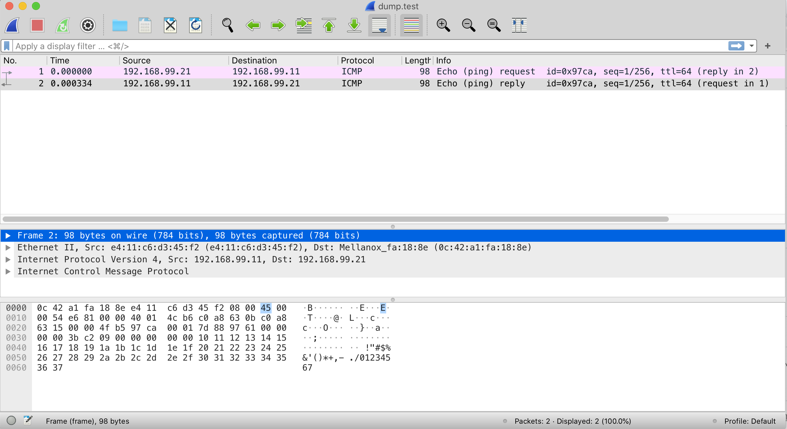

# Mellanox CX6 vdpa 硬件卸载 ovs-kernel 方式

本文来讲解，使用mellanox CX6 dx 网卡，实现vdpa硬件卸载。

视频讲解:

[<kbd></kbd>](https://www.bilibili.com/video/BV1734y1o7L5/)

- [bilibili](https://www.bilibili.com/video/BV1734y1o7L5/)
- [youtube](https://youtu.be/gGlAYXXXWgs)

# vdpa 硬件卸载介绍

既然说到了vdpa卸载，那么我们先简单介绍一下他是什么。

vDPA (virtio data path acceleration) 是一个内核框架，在2020年正式引入内核，NIC厂家会做vDPA网卡，意思是datapath遵循virtio规范，而控制面由厂家驱动提供。

以下是vDPA在虚拟机平台部署时的架构图：

[<kbd></kbd>](https://www.redhat.com/en/blog/introduction-vdpa-kernel-framework#:~:text=a%20VM%20running%20on%20the%20host%3A%C2%A0)

以下是vDPA在k8s平台中部署是的架构图：

[<kbd></kbd>](https://www.redhat.com/en/blog/how-vdpa-can-help-network-service-providers-simplify-cnfvnf-certification#:~:text=decoupled%20from%20the%20vendor%E2%80%99s%20NIC%3A)

上面的架构图，是借用红帽介绍vdpa背景的文章。我们这次的实验，是按照[mellanox的文档](https://docs.mellanox.com/display/MLNXOFEDv53100143/Introduction)来做，从mellanox角度看，vdpa有2种方式来做
1. 配置ovs-dpdk, ovs配置vdpa端口，同时创建socket。vm通过socket挂载vdpa设备。
2. 配置ovs-kernel，启动vdpa-dpdk程序，同时创建socket。vm通过socket挂载vdpa设备。

第一种方法，由于ovs-dpdk，mellanox官方文档说只支持到rhel/centos 7 ， 我们的环境是rhel/rocky 8.4，所以我们用后面一种方法。

在这里，背景介绍的很简单，以下是参考链接，可以更深入的学习：
- [Introduction to vDPA kernel framework](https://www.redhat.com/en/blog/introduction-vdpa-kernel-framework)
  - [vDPA kernel framework part 1: vDPA bus for abstracting hardware](https://www.redhat.com/en/blog/vdpa-kernel-framework-part-1-vdpa-bus-abstracting-hardware)
  - [vDPA kernel framework part 2: vDPA bus drivers for kernel subsystem interactions](https://www.redhat.com/en/blog/vdpa-kernel-framework-part-2-vdpa-bus-drivers-kernel-subsystem-interactions)
  - [vDPA kernel framework part 3: usage for VMs and containers](https://www.redhat.com/en/blog/vdpa-kernel-framework-part-3-usage-vms-and-containers)
- [How vhost-user came into being: Virtio-networking and DPDK](https://www.redhat.com/en/blog/how-vhost-user-came-being-virtio-networking-and-dpdk)
- [A journey to the vhost-users realm](https://www.redhat.com/en/blog/journey-vhost-users-realm)
- [How deep does the vDPA rabbit hole go?](https://www.redhat.com/en/blog/how-deep-does-vdpa-rabbit-hole-go)
- [Achieving network wirespeed in an open standard manner: introducing vDPA](https://www.redhat.com/en/blog/achieving-network-wirespeed-open-standard-manner-introducing-vdpa)
- [vDPA hands on: The proof is in the pudding](https://www.redhat.com/en/blog/vdpa-hands-proof-pudding)
- [vdpa-deployment from redhat-nfvpe](https://github.com/redhat-nfvpe/vdpa-deployment/blob/master/README.md)
- [Virtio-networking series from redhat blog](https://www.redhat.com/en/virtio-networking-series)
- [How vDPA can help network service providers simplify CNF/VNF certification](https://www.redhat.com/en/blog/how-vdpa-can-help-network-service-providers-simplify-cnfvnf-certification)
- vDPA : On the road to production
  - [pdf](https://static.sched.com/hosted_files/dpdkuserspace2020/ab/vDPA%20-%20DPDK%20Userspace%202020.pdf)
  - [youtube](https://www.youtube.com/watch?v=H_z5gaIghos)
  - [dpdk-userspace-2020](https://dpdkuserspace2020.sched.com/event/e47O/vdpa-integration-status-maxime-coquelin-red-hat)
- [vDPA原理和实现](http://bonejim.blog.chinaunix.net/uid-28541347-id-5830937.html)
- [VirtIO and TC](https://hackmd.io/@ebhFqyF8QryV_ZWAFURDhQ/HkQLV90yv)

有一个dpdk特殊概念，vf representor，dpdk文档有说，简单理解，是给控制面准备的vf的分身。
- https://doc.dpdk.org/guides-18.11/prog_guide/switch_representation.html
```
   .-------------.                 .-------------. .-------------.
   | hypervisor  |                 |    VM 1     | |    VM 2     |
   | application |                 | application | | application |
   `--+---+---+--'                 `----------+--' `--+----------'
      |   |   |                               |       |
      |   |   `-------------------.           |       |
      |   `---------.             |           |       |
      |             |             |           |       |
.-----+-----. .-----+-----. .-----+-----.     |       |
| port_id 3 | | port_id 4 | | port_id 5 |     |       |
`-----+-----' `-----+-----' `-----+-----'     |       |
      |             |             |           |       |
    .-+--.    .-----+-----. .-----+-----. .---+--. .--+---.
    | PF |    | VF 1 rep. | | VF 2 rep. | | VF 1 | | VF 2 |
    `-+--'    `-----+-----' `-----+-----' `---+--' `--+---'
      |             |             |           |       |
      |             |   .---------'           |       |
      `-----.       |   |   .-----------------'       |
            |       |   |   |   .---------------------'
            |       |   |   |   |
         .--+-------+---+---+---+--.
         | managed interconnection |
         `------------+------------'
                      |
                 .----+-----.
                 | physical |
                 |  port 0  |
                 `----------'
```

本次实验的架构图如下：


# 系统安装

```bash

export VAR_HOST='rl_panlab105'

# 按照完了操作系统以后，添加kernel参数，主要是intel_iommu=on iommu=pt，然后重启
cp /etc/default/grub /etc/default/grub.bak
sed -i "/GRUB_CMDLINE_LINUX/s/resume=[^[:space:]]*//"  /etc/default/grub
sed -i "/GRUB_CMDLINE_LINUX/s/rd.lvm.lv=${VAR_HOST}\\/swap//"  /etc/default/grub
# https://unix.stackexchange.com/questions/403706/sed-insert-text-after-nth-character-preceding-following-a-given-string
sed -i '/GRUB_CMDLINE_LINUX/s/"/ intel_iommu=on iommu=pt  default_hugepagesz=1G hugepagesz=1G hugepages=16 rdblacklist=nouveau"/2' /etc/default/grub

grub2-mkconfig -o /boot/efi/EFI/rocky/grub.cfg

grub2-mkconfig -o /boot/grub2/grub.cfg

# 添加kvm cpu host mode模式的支持，可以不做
cat << EOF > /etc/modprobe.d/kvm-nested.conf
options kvm_intel nested=1  
options kvm-intel enable_shadow_vmcs=1   
options kvm-intel enable_apicv=1         
options kvm-intel ept=1                  
EOF

# 默认的操作系统安装，有swap, home分区，我们是测试系统，全都删了吧。
umount /home
swapoff  /dev/$VAR_HOST/swap

cp /etc/fstab /etc/fstab.bak
sed -i 's/^[^#]*home/#&/' /etc/fstab
sed -i 's/^[^#]*swap/#&/' /etc/fstab

lvremove -f /dev/$VAR_HOST/home
lvremove -f /dev/$VAR_HOST/swap

lvextend -l +100%FREE /dev/$VAR_HOST/root
xfs_growfs /dev/$VAR_HOST/root

# 至此，开始安装网卡驱动
# 103 driver install
# https://www.mellanox.com/products/infiniband-drivers/linux/mlnx_ofed
mkdir -p /data/down/
cd /data/down/
dnf groupinstall -y 'Development Tools'
dnf groupinstall -y "Server with GUI"

wget https://www.mellanox.com/downloads/ofed/MLNX_OFED-5.4-3.0.3.0/MLNX_OFED_LINUX-5.4-3.0.3.0-rhel8.4-x86_64.tgz
tar zvxf *.tgz
cd /data/down/MLNX_OFED_LINUX-5.4-3.0.3.0-rhel8.4-x86_64
dnf install -y tcl tk kernel-modules-extra python36 make gcc-gfortran tcsh unbound
./mlnxofedinstall --all --force --distro rhel8.4
# ./mlnxofedinstall --dpdk --ovs-dpdk --upstream-libs --add-kernel-support --force --distro rhel8.4

reboot

systemctl enable --now mst
systemctl enable --now openibd

cat << EOF > /etc/yum.repos.d/mlx.repo
[mlnx_ofed]
name=MLNX_OFED Repository
baseurl=file:///data/down/MLNX_OFED_LINUX-5.4-3.0.3.0-rhel8.4-x86_64/RPMS
enabled=1
gpgcheck=0
EOF

dnf makecache 

# 开始安装dpdk相关的软件
mkdir -p /data/soft
cd /data/soft

dnf config-manager --set-enabled powertools
dnf install -y ninja-build meson

# 装mlnx版本的dpdk组件和ovs软件
# dnf group list
# dnf groupinstall -y 'Development Tools'
# install dpdk
dnf install -y mlnx-dpdk mlnx-dpdk-devel numactl-devel openvswitch  openvswitch-selinux-policy libnl3-devel openssl-devel zlib-devel libpcap-devel elfutils-libelf-devel 
# https://doc.dpdk.org/guides/linux_gsg/sys_reqs.html#compilation-of-the-dpdk
pip3 install --user pyelftools

systemctl enable --now openvswitch

export PATH=$PATH:/opt/mellanox/dpdk/bin/
echo 'export PATH=$PATH:/opt/mellanox/dpdk/bin/' >> ~/.bash_profile

# 编译上游的dpdk软件包，因为我们要用里面的vdpa sample程序
cd /data/soft/
wget https://fast.dpdk.org/rel/dpdk-20.11.3.tar.xz
tar vxf dpdk-20.11.3.tar.xz
# https://core.dpdk.org/doc/quick-start/
cd /data/soft/dpdk-stable-20.11.3/
# meson -Dexamples=all build
meson --reconfigure -Dexamples=all build
ninja -C build

export PKG_CONFIG_PATH=/opt/mellanox/dpdk/lib64/pkgconfig/
cd /data/soft/dpdk-stable-20.11.3/examples/vdpa
make -j 

# 按照kvm相关软件包
# install kvm with qemu
# dnf -y groupinstall "Server with GUI"

dnf -y install qemu-kvm libvirt libguestfs-tools virt-install virt-viewer virt-manager tigervnc-server

systemctl disable --now firewalld
systemctl enable --now libvirtd

# 最后，设置mlx网卡参数，激活sriov
# pci地址，使用 lspci -D | grep -i mell 或者 lshw -c network -businfo 得到
lspci -D | grep -i mell
# 0000:04:00.0 Ethernet controller: Mellanox Technologies MT2892 Family [ConnectX-6 Dx]
# 0000:04:00.1 Ethernet controller: Mellanox Technologies MT2892 Family [ConnectX-6 Dx]

lshw -c network -businfo
# Bus info          Device     Class          Description
# =======================================================
# pci@0000:02:00.0  eno3       network        NetXtreme BCM5720 2-port Gigabit Ethernet PCIe
# pci@0000:02:00.1  eno4       network        NetXtreme BCM5720 2-port Gigabit Ethernet PCIe
# pci@0000:01:00.0  eno1       network        NetXtreme BCM5720 2-port Gigabit Ethernet PCIe
# pci@0000:01:00.1  eno2       network        NetXtreme BCM5720 2-port Gigabit Ethernet PCIe
# pci@0000:04:00.0  enp4s0f0   network        MT2892 Family [ConnectX-6 Dx]
# pci@0000:04:00.1  enp4s0f1   network        MT2892 Family [ConnectX-6 Dx]

# UCTX_EN is for enable DevX
# DevX allows to access firmware objects
mlxconfig -y -d 0000:04:00.0 set SRIOV_EN=1 UCTX_EN=1 NUM_OF_VFS=8
```
# ovs-kernel 方案

网卡设置脚本

```bash
# mlx默认的ovs，缺少一些selinux的配置，在此补上
# 项目上，可以根据需要，自行补充缺少的selinux配置
semodule -i wzh-mellanox-ovs-dpdk.pp

# 这里做了一个配置和启动ovs的脚步，逻辑是先清空ovs配置，再配置网卡模式，然后启动ovs
cat << 'EOF' > /data/ovs-offload-env.sh
#!/usr/bin/env bash

set -e
set -x

systemctl restart openvswitch
ovs-vsctl --no-wait set Open_vSwitch . other_config:dpdk-init=try
systemctl restart openvswitch

ip link set dev ${IFNAME} down || true
ip link set dev ${IFNAME}_0 down || true
ip link set dev ${IFNAME}_1 down || true

ip link set dev ${IFNAME}v0 down || true
ip link set dev ${IFNAME}v1 down || true

ovs-vsctl del-port ovs-sriov ${IFNAME} || true
ovs-vsctl del-port ovs-sriov ${IFNAME}_0 || true
ovs-vsctl del-port ovs-sriov ${IFNAME}_1 || true
ovs-vsctl del-br ovs-sriov || true

ovs-vsctl del-port br0-ovs pf0vf0 || true
ovs-vsctl del-port br0-ovs pf0vf1 || true
ovs-vsctl del-port br0-ovs pf0 || true
ovs-vsctl del-br br0-ovs || true

ovs-vsctl --no-wait set Open_vSwitch . other_config:dpdk-init=false
ovs-vsctl --no-wait set Open_vSwitch . other_config:dpdk-extra=" "
ovs-vsctl --no-wait set Open_vSwitch . other_config={}

# Turn off SR-IOV on the PF device. 
echo 0 > /sys/class/net/$IFNAME/device/sriov_numvfs
cat /sys/class/net/$IFNAME/device/sriov_numvfs
# 0

systemctl restart openvswitch

# Turn ON SR-IOV on the PF device. 
echo 2 > /sys/class/net/$IFNAME/device/sriov_numvfs
cat /sys/class/net/$IFNAME/device/sriov_numvfs
# 2

ip link set $IFNAME vf 0 mac ${VF1MAC}
ip link set $IFNAME vf 1 mac ${VF2MAC}

echo ${PCINUM%%.*}.2 > /sys/bus/pci/drivers/mlx5_core/unbind || true
echo ${PCINUM%%.*}.3 > /sys/bus/pci/drivers/mlx5_core/unbind || true

devlink dev eswitch set pci/$PCINUM mode switchdev
devlink dev eswitch show pci/$PCINUM
# # pci/0000:43:00.0: mode switchdev inline-mode none encap-mode basic

echo ${PCINUM%%.*}.2 > /sys/bus/pci/drivers/mlx5_core/bind
echo ${PCINUM%%.*}.3 > /sys/bus/pci/drivers/mlx5_core/bind

# systemctl enable --now openvswitch
# systemctl restart openvswitch

# Create an OVS bridge (here it's named ovs-sriov). 
ovs-vsctl add-br ovs-sriov

ovs-vsctl set Open_vSwitch . other_config:hw-offload=true

systemctl restart openvswitch

ovs-vsctl add-port ovs-sriov ${IFNAME}
ovs-vsctl add-port ovs-sriov ${IFNAME}_0
ovs-vsctl add-port ovs-sriov ${IFNAME}_1

ip link set dev ${IFNAME} up
ip link set dev ${IFNAME}_0 up
ip link set dev ${IFNAME}_1 up

ip link set dev ${IFNAME}v0 up
ip link set dev ${IFNAME}v1 up

# systemctl restart openvswitch

# ip addr add ${VF1IP} dev ${IFNAME}v0
# ip addr add ${VF2IP} dev ${IFNAME}v1

EOF

# for 103
# export IFNAME=enp4s0f0
# export PCINUM=0000:04:00.0
# export VF1MAC=e4:11:22:33:44:50
# export VF2MAC=e4:11:22:33:44:51
# export VF1IP=192.168.55.21/24
# export VF2IP=192.168.55.22/24
# bash /data/ovs-offload-env.sh

# 设置一下环境变量，就可以执行脚本，启动ovs了。
# for 105
export IFNAME=enp67s0f0
export PCINUM=0000:43:00.0
export VF1MAC=e4:11:22:33:55:60
export VF2MAC=e4:11:22:33:55:61
# export VF1IP=192.168.55.31/24
# export VF2IP=192.168.55.32/24
bash /data/ovs-offload-env.sh

# 我们还需要启动一个DPDK的程序，做vdpa的功能，并接到vf上去。
/data/soft/dpdk-stable-20.11.3/examples/vdpa/build/vdpa -w ${PCINUM%%.*}.2,class=vdpa --log-level=pmd,info -- -i
create /tmp/sock-virtio0 0000:43:00.2
# EAL: Detected 24 lcore(s)
# EAL: Detected 2 NUMA nodes
# Option -w, --pci-whitelist is deprecated, use -a, --allow option instead
# EAL: Detected shared linkage of DPDK
# EAL: Multi-process socket /var/run/dpdk/rte/mp_socket
# EAL: Selected IOVA mode 'VA'
# EAL: No available hugepages reported in hugepages-2048kB
# EAL: Probing VFIO support...
# EAL: Probe PCI driver: mlx5_pci (15b3:101e) device: 0000:43:00.2 (socket 1)
# mlx5_vdpa: ROCE is disabled by Netlink successfully.
# EAL: No legacy callbacks, legacy socket not created
# Interactive-mode selected
# vdpa> create /tmp/sock-virtio0 0000:43:00.2
# VHOST_CONFIG: vhost-user server: socket created, fd: 112
# VHOST_CONFIG: bind to /tmp/sock-virtio0
# vdpa>

vdpa> list
# device name     queue num       supported features
# 0000:43:00.2            256             0x114c60180b

vdpa> stats 0000:43:00.2 0
# Device 0000:43:00.2:
#         Virtq 0:
#                 received_descriptors                                             1024
#                 completed_descriptors                                            39
#                 bad descriptor errors                                            0
#                 exceed max chain                                                 0
#                 invalid buffer                                                   0
#                 completion errors                                                0

```

# kvm

接下来，我们就要创建一个kvm，来使用我们的vdpa通道。

由于我们创建了一个socket，需要qemu有权限读取这个socket，所以我们需要把qemu的用户改为root。
```bash
sed -i.bak 's/#user = "root"/user = "root"/' /etc/libvirt/qemu.conf

# 我们还需要创建一个网桥，让kvm能接住宿主机的网口能上网。方便访问和管理。
mkdir -p /data/kvm
cat << 'EOF' > /data/kvm/bridge.sh
#!/usr/bin/env bash

PUB_CONN='eno1'
PUB_IP='172.21.6.103/24'
PUB_GW='172.21.6.254'
PUB_DNS='172.21.1.1'

nmcli con down "$PUB_CONN"
nmcli con delete "$PUB_CONN"
nmcli con down baremetal
nmcli con delete baremetal
# RHEL 8.1 appends the word "System" in front of the connection,delete in case it exists
nmcli con down "System $PUB_CONN"
nmcli con delete "System $PUB_CONN"
nmcli connection add ifname baremetal type bridge con-name baremetal ipv4.method 'manual' \
    ipv4.address "$PUB_IP" \
    ipv4.gateway "$PUB_GW" \
    ipv4.dns "$PUB_DNS"
    
nmcli con add type bridge-slave ifname "$PUB_CONN" master baremetal
nmcli con down "$PUB_CONN";pkill dhclient;dhclient baremetal
nmcli con up baremetal
EOF
bash /data/kvm/bridge.sh

# 我们先用标准的方法，创建，启动和安装一个kvm
cd /data/kvm
export DOMAIN=cx6.1

virt-install --name="${DOMAIN}" --vcpus=2 --ram=8192 \
--cputune vcpupin0.vcpu=14,vcpupin1.vcpu=16 \
--memorybacking hugepages.page0.size=1,hugepages.page0.unit=GiB \
--cpu host-model \
--disk path=/data/kvm/${DOMAIN}.qcow2,bus=virtio,size=30 \
--os-variant rhel8.4 \
--network bridge=baremetal,model=virtio \
--graphics vnc,port=59000 \
--boot menu=on --location /data/kvm/Rocky-8.4-x86_64-minimal.iso \
--initrd-inject helper-ks-rocky.cfg --extra-args "inst.ks=file:/helper-ks-rocky.cfg" 

# 接下来，配置这个kvm，把vdpa的通道加入到kvm里面。
# https://unix.stackexchange.com/questions/235414/libvirt-how-to-pass-qemu-command-line-args
# virt-xml $DOMAIN --edit --confirm --qemu-commandline 'env=MY-ENV=1234'
virt-xml $DOMAIN --edit --qemu-commandline='-chardev socket,id=charnet1,path=/tmp/sock-virtio0'
virt-xml $DOMAIN --edit --qemu-commandline='-netdev vhost-user,chardev=charnet1,queues=16,id=hostnet1'
virt-xml $DOMAIN --edit --qemu-commandline='-device virtio-net-pci,mq=on,vectors=6,netdev=hostnet1,id=net1,mac=e4:11:c6:d3:45:f2,bus=pcie.0,addr=0x6,page-per-vq=on,rx_queue_size=1024,tx_queue_size=1024'
```

接下来，要手动修改如下的配置配置
```bash
virsh edit cx6.1
```
```xml

  <cputune>
    <vcpupin vcpu='0' cpuset='14'/>
    <vcpupin vcpu='1' cpuset='16'/>
  </cputune>

  <cpu mode='host-model' check='partial'>
    <numa>
      <cell id='0' cpus='0-1' memory='8388608' unit='KiB' memAccess='shared'/>
    </numa>
  </cpu>
  
```
最后的配置样例如下，项目中，可以根据以下例子排错。
```bash
virsh dumpxml cx6.1
```
```xml

<domain type='kvm' id='11' xmlns:qemu='http://libvirt.org/schemas/domain/qemu/1.0'>
  <name>cx6.1</name>
  <uuid>5cbb6f7c-7122-4fc4-9706-ff46aed3bf25</uuid>
  <metadata>
    <libosinfo:libosinfo xmlns:libosinfo="http://libosinfo.org/xmlns/libvirt/domain/1.0">
      <libosinfo:os id="http://redhat.com/rhel/8.4"/>
    </libosinfo:libosinfo>
  </metadata>
  <memory unit='KiB'>8388608</memory>
  <currentMemory unit='KiB'>8388608</currentMemory>
  <memoryBacking>
    <hugepages>
      <page size='1048576' unit='KiB'/>
    </hugepages>
  </memoryBacking>
  <vcpu placement='static'>2</vcpu>
  <cputune>
    <vcpupin vcpu='0' cpuset='14'/>
    <vcpupin vcpu='1' cpuset='16'/>
  </cputune>
  <resource>
    <partition>/machine</partition>
  </resource>
  <os>
    <type arch='x86_64' machine='pc-q35-rhel8.2.0'>hvm</type>
    <boot dev='hd'/>
    <bootmenu enable='yes'/>
  </os>
  <features>
    <acpi/>
    <apic/>
  </features>
  <cpu mode='custom' match='exact' check='full'>
    <model fallback='forbid'>IvyBridge-IBRS</model>
    <vendor>Intel</vendor>
    <feature policy='require' name='ss'/>
    <feature policy='require' name='vmx'/>
    <feature policy='require' name='pdcm'/>
    <feature policy='require' name='pcid'/>
    <feature policy='require' name='hypervisor'/>
    <feature policy='require' name='arat'/>
    <feature policy='require' name='tsc_adjust'/>
    <feature policy='require' name='umip'/>
    <feature policy='require' name='md-clear'/>
    <feature policy='require' name='stibp'/>
    <feature policy='require' name='arch-capabilities'/>
    <feature policy='require' name='ssbd'/>
    <feature policy='require' name='xsaveopt'/>
    <feature policy='require' name='pdpe1gb'/>
    <feature policy='require' name='ibpb'/>
    <feature policy='require' name='ibrs'/>
    <feature policy='require' name='amd-stibp'/>
    <feature policy='require' name='amd-ssbd'/>
    <feature policy='require' name='skip-l1dfl-vmentry'/>
    <feature policy='require' name='pschange-mc-no'/>
    <numa>
      <cell id='0' cpus='0-1' memory='8388608' unit='KiB' memAccess='shared'/>
    </numa>
  </cpu>
  <clock offset='utc'>
    <timer name='rtc' tickpolicy='catchup'/>
    <timer name='pit' tickpolicy='delay'/>
    <timer name='hpet' present='no'/>
  </clock>
  <on_poweroff>destroy</on_poweroff>
  <on_reboot>restart</on_reboot>
  <on_crash>destroy</on_crash>
  <pm>
    <suspend-to-mem enabled='no'/>
    <suspend-to-disk enabled='no'/>
  </pm>
  <devices>
    <emulator>/usr/libexec/qemu-kvm</emulator>
    <disk type='file' device='disk'>
      <driver name='qemu' type='qcow2'/>
      <source file='/data/kvm/cx6.1.qcow2' index='2'/>
      <backingStore/>
      <target dev='vda' bus='virtio'/>
      <alias name='virtio-disk0'/>
      <address type='pci' domain='0x0000' bus='0x04' slot='0x00' function='0x0'/>
    </disk>
    <disk type='file' device='cdrom'>
      <driver name='qemu'/>
      <target dev='sda' bus='sata'/>
      <readonly/>
      <alias name='sata0-0-0'/>
      <address type='drive' controller='0' bus='0' target='0' unit='0'/>
    </disk>
    <controller type='usb' index='0' model='qemu-xhci' ports='15'>
      <alias name='usb'/>
      <address type='pci' domain='0x0000' bus='0x02' slot='0x00' function='0x0'/>
    </controller>
    <controller type='sata' index='0'>
      <alias name='ide'/>
      <address type='pci' domain='0x0000' bus='0x00' slot='0x1f' function='0x2'/>
    </controller>
    <controller type='pci' index='0' model='pcie-root'>
      <alias name='pcie.0'/>
    </controller>
    <controller type='pci' index='1' model='pcie-root-port'>
      <model name='pcie-root-port'/>
      <target chassis='1' port='0x10'/>
      <alias name='pci.1'/>
      <address type='pci' domain='0x0000' bus='0x00' slot='0x02' function='0x0' multifunction='on'/>
    </controller>
    <controller type='pci' index='2' model='pcie-root-port'>
      <model name='pcie-root-port'/>
      <target chassis='2' port='0x11'/>
      <alias name='pci.2'/>
      <address type='pci' domain='0x0000' bus='0x00' slot='0x02' function='0x1'/>
    </controller>
    <controller type='pci' index='3' model='pcie-root-port'>
      <model name='pcie-root-port'/>
      <target chassis='3' port='0x12'/>
      <alias name='pci.3'/>
      <address type='pci' domain='0x0000' bus='0x00' slot='0x02' function='0x2'/>
    </controller>
    <controller type='pci' index='4' model='pcie-root-port'>
      <model name='pcie-root-port'/>
      <target chassis='4' port='0x13'/>
      <alias name='pci.4'/>
      <address type='pci' domain='0x0000' bus='0x00' slot='0x02' function='0x3'/>
    </controller>
    <controller type='pci' index='5' model='pcie-root-port'>
      <model name='pcie-root-port'/>
      <target chassis='5' port='0x14'/>
      <alias name='pci.5'/>
      <address type='pci' domain='0x0000' bus='0x00' slot='0x02' function='0x4'/>
    </controller>
    <controller type='pci' index='6' model='pcie-root-port'>
      <model name='pcie-root-port'/>
      <target chassis='6' port='0x15'/>
      <alias name='pci.6'/>
      <address type='pci' domain='0x0000' bus='0x00' slot='0x02' function='0x5'/>
    </controller>
    <controller type='pci' index='7' model='pcie-root-port'>
      <model name='pcie-root-port'/>
      <target chassis='7' port='0x16'/>
      <alias name='pci.7'/>
      <address type='pci' domain='0x0000' bus='0x00' slot='0x02' function='0x6'/>
    </controller>
    <controller type='virtio-serial' index='0'>
      <alias name='virtio-serial0'/>
      <address type='pci' domain='0x0000' bus='0x03' slot='0x00' function='0x0'/>
    </controller>
    <interface type='bridge'>
      <mac address='52:54:00:8d:b6:8e'/>
      <source bridge='baremetal'/>
      <target dev='vnet2'/>
      <model type='virtio'/>
      <alias name='net0'/>
      <address type='pci' domain='0x0000' bus='0x01' slot='0x00' function='0x0'/>
    </interface>
    <serial type='pty'>
      <source path='/dev/pts/6'/>
      <target type='isa-serial' port='0'>
        <model name='isa-serial'/>
      </target>
      <alias name='serial0'/>
    </serial>
    <console type='pty' tty='/dev/pts/6'>
      <source path='/dev/pts/6'/>
      <target type='serial' port='0'/>
      <alias name='serial0'/>
    </console>
    <channel type='unix'>
      <source mode='bind' path='/var/lib/libvirt/qemu/channel/target/domain-11-cx6.1/org.qemu.guest_agent.0'/>
      <target type='virtio' name='org.qemu.guest_agent.0' state='disconnected'/>
      <alias name='channel0'/>
      <address type='virtio-serial' controller='0' bus='0' port='1'/>
    </channel>
    <input type='tablet' bus='usb'>
      <alias name='input0'/>
      <address type='usb' bus='0' port='1'/>
    </input>
    <input type='mouse' bus='ps2'>
      <alias name='input1'/>
    </input>
    <input type='keyboard' bus='ps2'>
      <alias name='input2'/>
    </input>
    <graphics type='vnc' port='59000' autoport='no' listen='127.0.0.1'>
      <listen type='address' address='127.0.0.1'/>
    </graphics>
    <video>
      <model type='qxl' ram='65536' vram='65536' vgamem='16384' heads='1' primary='yes'/>
      <alias name='video0'/>
      <address type='pci' domain='0x0000' bus='0x00' slot='0x01' function='0x0'/>
    </video>
    <memballoon model='virtio'>
      <stats period='5'/>
      <alias name='balloon0'/>
      <address type='pci' domain='0x0000' bus='0x05' slot='0x00' function='0x0'/>
    </memballoon>
    <rng model='virtio'>
      <backend model='random'>/dev/urandom</backend>
      <alias name='rng0'/>
      <address type='pci' domain='0x0000' bus='0x06' slot='0x00' function='0x0'/>
    </rng>
  </devices>
  <seclabel type='dynamic' model='selinux' relabel='yes'>
    <label>system_u:system_r:svirt_t:s0:c46,c926</label>
    <imagelabel>system_u:object_r:svirt_image_t:s0:c46,c926</imagelabel>
  </seclabel>
  <seclabel type='dynamic' model='dac' relabel='yes'>
    <label>+0:+0</label>
    <imagelabel>+0:+0</imagelabel>
  </seclabel>
  <qemu:commandline>
    <qemu:arg value='-chardev'/>
    <qemu:arg value='socket,id=charnet1,path=/tmp/sock-virtio0'/>
    <qemu:arg value='-netdev'/>
    <qemu:arg value='vhost-user,chardev=charnet1,queues=16,id=hostnet1'/>
    <qemu:arg value='-device'/>
    <qemu:arg value='virtio-net-pci,mq=on,vectors=6,netdev=hostnet1,id=net1,mac=e4:11:c6:d3:45:f2,bus=pcie.0,addr=0x6,page-per-vq=on,rx_queue_size=1024,tx_queue_size=1024'/>
  </qemu:commandline>
</domain>

```

# 赶紧试试吧

接下来就进入测试和体验环节。
```bash
# in cx6.1 kvm
# nmcli dev connect enp0s6
nmcli con modify enp0s6 ipv4.method manual ipv4.addresses 192.168.99.11/24
# nmcli con modify enp0s6 ipv4.method manual ipv4.addresses 192.168.55.91/24
nmcli con up enp0s6

# on peer machine (102)
nmcli con modify enp66s0f0 ipv4.method manual ipv4.addresses 192.168.99.21/24
# nmcli con modify enp66s0f0 ipv4.method manual ipv4.addresses 192.168.55.92/24
# nmcli dev connect enp66s0f0
nmcli con up enp66s0f0

# run after the tcpdump is running
ping 192.168.99.21
# PING 192.168.99.21 (192.168.99.21) 56(84) bytes of data.
# 64 bytes from 192.168.99.21: icmp_seq=1 ttl=64 time=0.089 ms
# 64 bytes from 192.168.99.21: icmp_seq=2 ttl=64 time=0.044 ms
# 64 bytes from 192.168.99.21: icmp_seq=3 ttl=64 time=0.046 ms
# ....

# on 105
tcpdump -i enp67s0f0_0 -w dump.test
# dropped privs to tcpdump
# tcpdump: listening on enp67s0f0_0, link-type EN10MB (Ethernet), capture size 262144 bytes
# ^C2 packets captured
# 2 packets received by filter
# 0 packets dropped by kernel

tcpdump -i enp67s0f0 -w dump.test
# dropped privs to tcpdump
# tcpdump: listening on enp67s0f0, link-type EN10MB (Ethernet), capture size 262144 bytes
# ^C4 packets captured
# 4 packets received by filter
# 0 packets dropped by kernel

```
用 wireshark 打开，可以看到是标准的icmp包，说明我们构建的是数据通路，而不是协议封装。另外，我们会发现，ping了很多包，但是我们只是抓到了1个，这是因为，网卡offload了，我们只能抓到第一个进入内核查流表的包，后面的都网卡offload了，就抓不到了。



以下是在pf上抓的包，抓到了4个。都是流的第一个包，后面的就都offload啦。


```bash
# ovs-dpctl dump-flows

# on 105
# 看看ovs的流表，可以看到有2个arp(0x0806)的流表(0x0806)，正向和方向
# 还有2个ip(0x0800)的流表，正向和反向
ovs-appctl dpctl/dump-flows type=offloaded
# recirc_id(0),in_port(2),eth(src=0c:42:a1:fa:18:8e,dst=e4:11:c6:d3:45:f2),eth_type(0x0800),ipv4(frag=no), packets:149, bytes:15198, used:0.510s, actions:3
# recirc_id(0),in_port(2),eth(src=0c:42:a1:fa:18:8e,dst=e4:11:c6:d3:45:f2),eth_type(0x0806), packets:0, bytes:0, used:8.700s, actions:3
# recirc_id(0),in_port(3),eth(src=e4:11:c6:d3:45:f2,dst=0c:42:a1:fa:18:8e),eth_type(0x0800),ipv4(frag=no), packets:149, bytes:14602, used:0.510s, actions:2
# recirc_id(0),in_port(3),eth(src=e4:11:c6:d3:45:f2,dst=0c:42:a1:fa:18:8e),eth_type(0x0806), packets:0, bytes:0, used:8.701s, actions:2

# 我们再看看tc的配置，可以看到ovs把配置下发给了tc
# 这里是vf的入流量，可以看到它把流量镜像给了父端口，并且规则由硬件实现
tc -s filter show dev enp67s0f0_0 ingress
# filter protocol ip pref 2 flower chain 0
# filter protocol ip pref 2 flower chain 0 handle 0x1
#   dst_mac 0c:42:a1:fa:18:8e
#   src_mac e4:11:c6:d3:45:f2
#   eth_type ipv4
#   ip_flags nofrag
#   in_hw in_hw_count 1
#         action order 1: mirred (Egress Redirect to device enp67s0f0) stolen
#         index 4 ref 1 bind 1 installed 318 sec used 0 sec
#         Action statistics:
#         Sent 30380 bytes 310 pkt (dropped 0, overlimits 0 requeues 0)
#         Sent software 0 bytes 0 pkt
#         Sent hardware 30380 bytes 310 pkt
#         backlog 0b 0p requeues 0
#         cookie 8be6df4d7d4c33fce08f01a46fa10a4a
#         no_percpu
#         used_hw_stats delayed

# 我们再看看vf的出流量
# 有2个规则，一个是arp，一个是ip
# 都会把流量镜像给了父端口，并且规则由硬件实现
tc -s filter show dev enp67s0f0_0 egress
# filter ingress protocol ip pref 2 flower chain 0
# filter ingress protocol ip pref 2 flower chain 0 handle 0x1
#   dst_mac 0c:42:a1:fa:18:8e
#   src_mac e4:11:c6:d3:45:f2
#   eth_type ipv4
#   ip_flags nofrag
#   in_hw in_hw_count 1
#         action order 1: mirred (Egress Redirect to device enp67s0f0) stolen
#         index 4 ref 1 bind 1 installed 379 sec used 0 sec
#         Action statistics:
#         Sent 36260 bytes 370 pkt (dropped 0, overlimits 0 requeues 0)
#         Sent software 0 bytes 0 pkt
#         Sent hardware 36260 bytes 370 pkt
#         backlog 0b 0p requeues 0
#         cookie 8be6df4d7d4c33fce08f01a46fa10a4a
#         no_percpu
#         used_hw_stats delayed

# filter ingress protocol arp pref 4 flower chain 0
# filter ingress protocol arp pref 4 flower chain 0 handle 0x1
#   dst_mac 0c:42:a1:fa:18:8e
#   src_mac e4:11:c6:d3:45:f2
#   eth_type arp
#   in_hw in_hw_count 1
#         action order 1: mirred (Egress Redirect to device enp67s0f0) stolen
#         index 3 ref 1 bind 1 installed 13 sec used 6 sec
#         Action statistics:
#         Sent 60 bytes 1 pkt (dropped 0, overlimits 0 requeues 0)
#         Sent software 0 bytes 0 pkt
#         Sent hardware 60 bytes 1 pkt
#         backlog 0b 0p requeues 0
#         cookie 1fbfd56eae42f9dbe71bf99bd800cd6d
#         no_percpu
#         used_hw_stats delayed

tc qdisc show dev enp67s0f0_0
# qdisc mq 0: root
# qdisc fq_codel 0: parent :1 limit 10240p flows 1024 quantum 1514 target 5ms interval 100ms memory_limit 32Mb ecn drop_batch 64
# qdisc ingress ffff: parent ffff:fff1 ----------------

# 最后，我们把系统环境记录一下，方便回忆和项目上对比。
# on 105
ip link
# 1: lo: <LOOPBACK,UP,LOWER_UP> mtu 65536 qdisc noqueue state UNKNOWN mode DEFAULT group default qlen 1000
#     link/loopback 00:00:00:00:00:00 brd 00:00:00:00:00:00
# 2: eno1: <BROADCAST,MULTICAST,UP,LOWER_UP> mtu 1500 qdisc mq master baremetal state UP mode DEFAULT group default qlen 1000
#     link/ether 90:b1:1c:40:59:27 brd ff:ff:ff:ff:ff:ff
# 3: eno2: <NO-CARRIER,BROADCAST,MULTICAST,UP> mtu 1500 qdisc mq state DOWN mode DEFAULT group default qlen 1000
#     link/ether 90:b1:1c:40:59:28 brd ff:ff:ff:ff:ff:ff
# 4: eno3: <NO-CARRIER,BROADCAST,MULTICAST,UP> mtu 1500 qdisc mq state DOWN mode DEFAULT group default qlen 1000
#     link/ether 90:b1:1c:40:59:29 brd ff:ff:ff:ff:ff:ff
# 5: eno4: <NO-CARRIER,BROADCAST,MULTICAST,UP> mtu 1500 qdisc mq state DOWN mode DEFAULT group default qlen 1000
#     link/ether 90:b1:1c:40:59:2a brd ff:ff:ff:ff:ff:ff
# 6: enp67s0f0: <BROADCAST,MULTICAST,UP,LOWER_UP> mtu 1500 qdisc mq master ovs-system state UP mode DEFAULT group default qlen 1000
#     link/ether 0c:42:a1:fa:18:a2 brd ff:ff:ff:ff:ff:ff
#     vf 0     link/ether e4:11:22:33:55:60 brd ff:ff:ff:ff:ff:ff, spoof checking off, link-state disable, trust off, query_rss off
#     vf 1     link/ether e4:11:22:33:55:61 brd ff:ff:ff:ff:ff:ff, spoof checking off, link-state disable, trust off, query_rss off
# 7: enp67s0f1: <BROADCAST,MULTICAST,UP,LOWER_UP> mtu 1500 qdisc mq state UP mode DEFAULT group default qlen 1000
#     link/ether 0c:42:a1:fa:18:a3 brd ff:ff:ff:ff:ff:ff
# 8: ib0: <NO-CARRIER,BROADCAST,MULTICAST,UP> mtu 4092 qdisc mq state DOWN mode DEFAULT group default qlen 256
#     link/infiniband 00:00:10:28:fe:80:00:00:00:00:00:00:98:03:9b:03:00:cc:71:2c brd 00:ff:ff:ff:ff:12:40:1b:ff:ff:00:00:00:00:00:00:ff:ff:ff:ff
# 9: baremetal: <BROADCAST,MULTICAST,UP,LOWER_UP> mtu 1500 qdisc noqueue state UP mode DEFAULT group default qlen 1000
#     link/ether 90:b1:1c:40:59:27 brd ff:ff:ff:ff:ff:ff
# 10: virbr0: <NO-CARRIER,BROADCAST,MULTICAST,UP> mtu 1500 qdisc noqueue state DOWN mode DEFAULT group default qlen 1000
#     link/ether 52:54:00:8f:4a:bc brd ff:ff:ff:ff:ff:ff
# 11: virbr0-nic: <BROADCAST,MULTICAST> mtu 1500 qdisc fq_codel master virbr0 state DOWN mode DEFAULT group default qlen 1000
#     link/ether 52:54:00:8f:4a:bc brd ff:ff:ff:ff:ff:ff
# 16: enp67s0f0_0: <BROADCAST,MULTICAST,UP,LOWER_UP> mtu 1500 qdisc mq master ovs-system state UP mode DEFAULT group default qlen 1000
#     link/ether fa:cf:0f:6a:ec:45 brd ff:ff:ff:ff:ff:ff
# 17: enp67s0f0_1: <BROADCAST,MULTICAST,UP,LOWER_UP> mtu 1500 qdisc mq master ovs-system state UP mode DEFAULT group default qlen 1000
#     link/ether 76:65:93:70:96:ac brd ff:ff:ff:ff:ff:ff
# 18: enp67s0f0v0: <BROADCAST,MULTICAST,UP,LOWER_UP> mtu 1500 qdisc mq state UP mode DEFAULT group default qlen 1000
#     link/ether e4:11:22:33:55:60 brd ff:ff:ff:ff:ff:ff
# 19: enp67s0f0v1: <BROADCAST,MULTICAST,UP,LOWER_UP> mtu 1500 qdisc mq state UP mode DEFAULT group default qlen 1000
#     link/ether e4:11:22:33:55:61 brd ff:ff:ff:ff:ff:ff
# 20: ovs-system: <BROADCAST,MULTICAST> mtu 1500 qdisc noop state DOWN mode DEFAULT group default qlen 1000
#     link/ether f6:e9:fd:16:8a:ea brd ff:ff:ff:ff:ff:ff
# 21: ovs-sriov: <BROADCAST,MULTICAST> mtu 1500 qdisc noop state DOWN mode DEFAULT group default qlen 1000
#     link/ether 0c:42:a1:fa:18:a2 brd ff:ff:ff:ff:ff:ff
# 22: vnet0: <BROADCAST,MULTICAST,UP,LOWER_UP> mtu 1500 qdisc fq_codel master baremetal state UNKNOWN mode DEFAULT group default qlen 1000
#     link/ether fe:54:00:8d:b6:8e brd ff:ff:ff:ff:ff:ff

ip a
# 1: lo: <LOOPBACK,UP,LOWER_UP> mtu 65536 qdisc noqueue state UNKNOWN group default qlen 1000
#     link/loopback 00:00:00:00:00:00 brd 00:00:00:00:00:00
#     inet 127.0.0.1/8 scope host lo
#        valid_lft forever preferred_lft forever
#     inet6 ::1/128 scope host
#        valid_lft forever preferred_lft forever
# 2: eno1: <BROADCAST,MULTICAST,UP,LOWER_UP> mtu 1500 qdisc mq master baremetal state UP group default qlen 1000
#     link/ether 90:b1:1c:40:59:27 brd ff:ff:ff:ff:ff:ff
# 3: eno2: <NO-CARRIER,BROADCAST,MULTICAST,UP> mtu 1500 qdisc mq state DOWN group default qlen 1000
#     link/ether 90:b1:1c:40:59:28 brd ff:ff:ff:ff:ff:ff
# 4: eno3: <NO-CARRIER,BROADCAST,MULTICAST,UP> mtu 1500 qdisc mq state DOWN group default qlen 1000
#     link/ether 90:b1:1c:40:59:29 brd ff:ff:ff:ff:ff:ff
# 5: eno4: <NO-CARRIER,BROADCAST,MULTICAST,UP> mtu 1500 qdisc mq state DOWN group default qlen 1000
#     link/ether 90:b1:1c:40:59:2a brd ff:ff:ff:ff:ff:ff
# 6: enp67s0f0: <BROADCAST,MULTICAST,UP,LOWER_UP> mtu 1500 qdisc mq master ovs-system state UP group default qlen 1000
#     link/ether 0c:42:a1:fa:18:a2 brd ff:ff:ff:ff:ff:ff
# 7: enp67s0f1: <BROADCAST,MULTICAST,UP,LOWER_UP> mtu 1500 qdisc mq state UP group default qlen 1000
#     link/ether 0c:42:a1:fa:18:a3 brd ff:ff:ff:ff:ff:ff
# 8: ib0: <NO-CARRIER,BROADCAST,MULTICAST,UP> mtu 4092 qdisc mq state DOWN group default qlen 256
#     link/infiniband 00:00:10:28:fe:80:00:00:00:00:00:00:98:03:9b:03:00:cc:71:2c brd 00:ff:ff:ff:ff:12:40:1b:ff:ff:00:00:00:00:00:00:ff:ff:ff:ff
# 9: baremetal: <BROADCAST,MULTICAST,UP,LOWER_UP> mtu 1500 qdisc noqueue state UP group default qlen 1000
#     link/ether 90:b1:1c:40:59:27 brd ff:ff:ff:ff:ff:ff
#     inet 172.21.6.105/24 brd 172.21.6.255 scope global noprefixroute baremetal
#        valid_lft forever preferred_lft forever
#     inet6 fe80::12a7:202d:c70b:be14/64 scope link noprefixroute
#        valid_lft forever preferred_lft forever
# 10: virbr0: <NO-CARRIER,BROADCAST,MULTICAST,UP> mtu 1500 qdisc noqueue state DOWN group default qlen 1000
#     link/ether 52:54:00:8f:4a:bc brd ff:ff:ff:ff:ff:ff
#     inet 192.168.122.1/24 brd 192.168.122.255 scope global virbr0
#        valid_lft forever preferred_lft forever
# 11: virbr0-nic: <BROADCAST,MULTICAST> mtu 1500 qdisc fq_codel master virbr0 state DOWN group default qlen 1000
#     link/ether 52:54:00:8f:4a:bc brd ff:ff:ff:ff:ff:ff
# 16: enp67s0f0_0: <BROADCAST,MULTICAST,UP,LOWER_UP> mtu 1500 qdisc mq master ovs-system state UP group default qlen 1000
#     link/ether fa:cf:0f:6a:ec:45 brd ff:ff:ff:ff:ff:ff
# 17: enp67s0f0_1: <BROADCAST,MULTICAST,UP,LOWER_UP> mtu 1500 qdisc mq master ovs-system state UP group default qlen 1000
#     link/ether 76:65:93:70:96:ac brd ff:ff:ff:ff:ff:ff
# 18: enp67s0f0v0: <BROADCAST,MULTICAST,UP,LOWER_UP> mtu 1500 qdisc mq state UP group default qlen 1000
#     link/ether e4:11:22:33:55:60 brd ff:ff:ff:ff:ff:ff
#     inet 192.168.55.31/24 scope global enp67s0f0v0
#        valid_lft forever preferred_lft forever
# 19: enp67s0f0v1: <BROADCAST,MULTICAST,UP,LOWER_UP> mtu 1500 qdisc mq state UP group default qlen 1000
#     link/ether e4:11:22:33:55:61 brd ff:ff:ff:ff:ff:ff
#     inet 192.168.55.32/24 scope global enp67s0f0v1
#        valid_lft forever preferred_lft forever
# 20: ovs-system: <BROADCAST,MULTICAST> mtu 1500 qdisc noop state DOWN group default qlen 1000
#     link/ether f6:e9:fd:16:8a:ea brd ff:ff:ff:ff:ff:ff
# 21: ovs-sriov: <BROADCAST,MULTICAST> mtu 1500 qdisc noop state DOWN group default qlen 1000
#     link/ether 0c:42:a1:fa:18:a2 brd ff:ff:ff:ff:ff:ff
# 22: vnet0: <BROADCAST,MULTICAST,UP,LOWER_UP> mtu 1500 qdisc fq_codel master baremetal state UNKNOWN group default qlen 1000
#     link/ether fe:54:00:8d:b6:8e brd ff:ff:ff:ff:ff:ff
#     inet6 fe80::fc54:ff:fe8d:b68e/64 scope link
#        valid_lft forever preferred_lft forever

ovs-vsctl show
# 8f3eddeb-c42c-4af4-9dc8-a46169d91a7c
#     Bridge ovs-sriov
#         Port enp67s0f0_1
#             Interface enp67s0f0_1
#         Port ovs-sriov
#             Interface ovs-sriov
#                 type: internal
#         Port enp67s0f0
#             Interface enp67s0f0
#         Port enp67s0f0_0
#             Interface enp67s0f0_0
#     ovs_version: "2.14.1"

# on kvm
ip link
# 1: lo: <LOOPBACK,UP,LOWER_UP> mtu 65536 qdisc noqueue state UNKNOWN mode DEFAULT group default qlen 1000
#     link/loopback 00:00:00:00:00:00 brd 00:00:00:00:00:00
# 2: enp0s6: <BROADCAST,MULTICAST,UP,LOWER_UP> mtu 1500 qdisc mq state UP mode DEFAULT group default qlen 1000
#     link/ether e4:11:c6:d3:45:f2 brd ff:ff:ff:ff:ff:ff
# 3: enp1s0: <BROADCAST,MULTICAST,UP,LOWER_UP> mtu 1500 qdisc fq_codel state UP mode DEFAULT group default qlen 1000
#     link/ether 52:54:00:8d:b6:8e brd ff:ff:ff:ff:ff:ff

ip a
# 1: lo: <LOOPBACK,UP,LOWER_UP> mtu 65536 qdisc noqueue state UNKNOWN group default qlen 1000
#     link/loopback 00:00:00:00:00:00 brd 00:00:00:00:00:00
#     inet 127.0.0.1/8 scope host lo
#        valid_lft forever preferred_lft forever
#     inet6 ::1/128 scope host
#        valid_lft forever preferred_lft forever
# 2: enp0s6: <BROADCAST,MULTICAST,UP,LOWER_UP> mtu 1500 qdisc mq state UP group default qlen 1000
#     link/ether e4:11:c6:d3:45:f2 brd ff:ff:ff:ff:ff:ff
#     inet 192.168.99.11/24 brd 192.168.99.255 scope global noprefixroute enp0s6
#        valid_lft forever preferred_lft forever
#     inet6 fe80::f3c:b686:1739:a748/64 scope link noprefixroute
#        valid_lft forever preferred_lft forever
# 3: enp1s0: <BROADCAST,MULTICAST,UP,LOWER_UP> mtu 1500 qdisc fq_codel state UP group default qlen 1000
#     link/ether 52:54:00:8d:b6:8e brd ff:ff:ff:ff:ff:ff
#     inet 172.21.6.11/24 brd 172.21.6.255 scope global noprefixroute enp1s0
#        valid_lft forever preferred_lft forever
#     inet6 fe80::5054:ff:fe8d:b68e/64 scope link noprefixroute
#        valid_lft forever preferred_lft forever

```
# 性能测试

```bash
# on 102
dnf install -y iperf3
systemctl disable --now firewalld

iperf3 -s -p 6666

# on 11
dnf install -y iperf3

iperf3 -t 20 -p 6666 -c 192.168.99.21
Connecting to host 192.168.99.21, port 6666
[  5] local 192.168.99.11 port 50960 connected to 192.168.99.21 port 6666
[ ID] Interval           Transfer     Bitrate         Retr  Cwnd
[  5]   0.00-1.00   sec  1.40 GBytes  12.0 Gbits/sec    0    594 KBytes
[  5]   1.00-2.00   sec  1.39 GBytes  12.0 Gbits/sec    0    594 KBytes
[  5]   2.00-3.00   sec  1.39 GBytes  12.0 Gbits/sec    0    594 KBytes
[  5]   3.00-4.00   sec  1.40 GBytes  12.0 Gbits/sec    0    624 KBytes
[  5]   4.00-5.00   sec  1.40 GBytes  12.0 Gbits/sec    0    659 KBytes
[  5]   5.00-6.00   sec  1.40 GBytes  12.0 Gbits/sec    0    659 KBytes
[  5]   6.00-7.00   sec  1.40 GBytes  12.0 Gbits/sec    0    659 KBytes
[  5]   7.00-8.00   sec  1.40 GBytes  12.0 Gbits/sec    0   1.03 MBytes
[  5]   8.00-9.00   sec  1.40 GBytes  12.0 Gbits/sec    0   1.03 MBytes
[  5]   9.00-10.00  sec  1.40 GBytes  12.0 Gbits/sec    0   1.03 MBytes
[  5]  10.00-11.00  sec  1.39 GBytes  12.0 Gbits/sec    0   1.03 MBytes
[  5]  11.00-12.00  sec  1.39 GBytes  12.0 Gbits/sec    0   1.03 MBytes
[  5]  12.00-13.00  sec  1.39 GBytes  11.9 Gbits/sec    0   1.03 MBytes
[  5]  13.00-14.00  sec  1.39 GBytes  11.9 Gbits/sec    0   1.03 MBytes
[  5]  14.00-15.00  sec  1.39 GBytes  11.9 Gbits/sec    0   1.03 MBytes
[  5]  15.00-16.00  sec  1.39 GBytes  11.9 Gbits/sec    0   1.03 MBytes
[  5]  16.00-17.00  sec  1.39 GBytes  12.0 Gbits/sec    0   1.03 MBytes
[  5]  17.00-18.00  sec  1.39 GBytes  11.9 Gbits/sec    0   1.03 MBytes
[  5]  18.00-19.00  sec  1.39 GBytes  11.9 Gbits/sec    0   1.03 MBytes
[  5]  19.00-20.00  sec  1.39 GBytes  11.9 Gbits/sec    0   1.03 MBytes
- - - - - - - - - - - - - - - - - - - - - - - - -
[ ID] Interval           Transfer     Bitrate         Retr
[  5]   0.00-20.00  sec  27.9 GBytes  12.0 Gbits/sec    0             sender
[  5]   0.00-20.04  sec  27.9 GBytes  11.9 Gbits/sec                  receiver

iperf Done.
```
