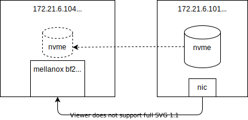

# mellanox bf2 网卡激活snap功能， 配置nvme over fabrics 支持 

本文讲述，如果使用mellanox bf2网卡，配置snap，挂载远端的nvme设备给宿主机使用，达到nvme over fabric的目的。

我们的实验环境，是2台物理机，宿主机都装的rocky linux 8.5，其中一个物理机上有nvme设备，另外一个物理机上有bf2网卡。

以下是实验架构：


# 安装实验环境

首先，我们需要给bf2刷上mellanox官方的doca bfb image，可以简单的理解是刷网卡固件，[参考这里的文档做](https://github.com/wangzheng422/docker_env/blob/dev/redhat/notes/2021/2021.12.ocp.bf2.dpi.md#flash-bf2-with-offical-image)。

接下来，我们给nvme设备主机，配置nvme over fabric的能力。
```bash

# on 101
# config nvme storage server side
# https://access.redhat.com/documentation/zh-cn/red_hat_enterprise_linux/8/html/managing_storage_devices/overview-of-nvme-over-fabric-devicesmanaging-storage-devices
nmcli con modify enp5s0f1 ipv4.method manual ipv4.addresses 192.168.99.21/24
nmcli con up enp5s0f1

yum install -y nvmetcli

cd /data/down/
# wget http://git.infradead.org/users/hch/nvmetcli.git/blob_plain/0a6b088db2dc2e5de11e6f23f1e890e4b54fee64:/rdma.json
cat << EOF > /data/down/rdma.json
{
  "hosts": [
    {
      "nqn": "hostnqn"
    }
  ],
  "ports": [
    {
      "addr": {
        "adrfam": "ipv4",
        "traddr": "192.168.99.21",
        "treq": "not specified",
        "trsvcid": "4420",
        "trtype": "rdma"
      },
      "portid": 2,
      "referrals": [],
      "subsystems": [
        "testnqn"
      ]
    }
  ],
  "subsystems": [
    {
      "allowed_hosts": [],
      "attr": {
        "allow_any_host": "1"
      },
      "namespaces": [
        {
          "device": {
            "nguid": "ef90689c-6c46-d44c-89c1-4067801309a8",
            "path": "/dev/nvme0n1"
          },
          "enable": 1,
          "nsid": 1
        }
      ],
      "nqn": "testnqn"
    }
  ]
}
EOF
modprobe nvmet-rdma
nvmetcli restore /data/down/rdma.json

dmesg
# ........
# [32664.912901] nvmet: adding nsid 1 to subsystem testnqn
# [32664.914013] nvmet_rdma: enabling port 2 (192.168.99.21:4420)

nvmetcli clear

nvme list
# Node                  SN                   Model                                    Namespace Usage                      Format           FW Rev
# --------------------- -------------------- ---------------------------------------- --------- -------------------------- ---------------- --------
# /dev/nvme0n1          CVCQ726600A0400AGN   INTEL SSDPEDMW400G4                      1         400.09  GB / 400.09  GB    512   B +  0 B   8EV10171

# 测试一下
yum install nvme-cli
modprobe nvme-rdma
nvme discover -t rdma -a 192.168.99.21 -s 4420
# Discovery Log Number of Records 1, Generation counter 2
# =====Discovery Log Entry 0======
# trtype:  rdma
# adrfam:  ipv4
# subtype: nvme subsystem
# treq:    not specified, sq flow control disable supported
# portid:  2
# trsvcid: 4420
# subnqn:  testnqn
# traddr:  192.168.99.21
# rdma_prtype: not specified
# rdma_qptype: connected
# rdma_cms:    rdma-cm
# rdma_pkey: 0x0000
```
接下来，我们在bf2上，做一些配置
```bash
# on 104 bf2
# 查看一下基本信息
ovs-vsctl show
# 04d25b73-2f63-4e47-b7d9-2362cc4d7fda
#     Bridge ovsbr2
#         Port p1
#             Interface p1
#         Port en3f1pf1sf0
#             Interface en3f1pf1sf0
#         Port ovsbr2
#             Interface ovsbr2
#                 type: internal
#         Port pf1hpf
#             Interface pf1hpf
#     Bridge ovsbr1
#         Port en3f0pf0sf0
#             Interface en3f0pf0sf0
#         Port pf0hpf
#             Interface pf0hpf
#         Port p0
#             Interface p0
#         Port ovsbr1
#             Interface ovsbr1
#                 type: internal
#     ovs_version: "2.15.1"

# nmcli con modify enp3s0f0s0 ipv4.method manual ipv4.addresses 192.168.99.11/24
# nmcli con up enp3s0f0s0

# ip addr add 192.168.99.11/24 dev enp3s0f0s0 
# ip addr del 192.168.99.11/24 dev enp3s0f0s0 

# 给一个sf端口，配置ip地址，这样bf2就能连接到远端nvme服务
cat << EOF > /etc/netplan/70-wzh-mlnx.yaml
network:
    ethernets:
        enp3s0f0s0:
            addresses:
            - 192.168.99.11/24
            dhcp4: false
    renderer: NetworkManager
    version: 2

EOF

# 配置bf2参数
mlxconfig -y -d /dev/mst/mt41686_pciconf0 s \
                PF_BAR2_ENABLE=0 \
                PER_PF_NUM_SF=1
mlxconfig -y -d /dev/mst/mt41686_pciconf0 s \
                PCI_SWITCH_EMULATION_ENABLE=1 \
                PCI_SWITCH_EMULATION_NUM_PORT=16 \
                VIRTIO_NET_EMULATION_ENABLE=1 \
                VIRTIO_NET_EMULATION_NUM_VF=0 \
                VIRTIO_NET_EMULATION_NUM_PF=0 \
                VIRTIO_NET_EMULATION_NUM_MSIX=16 \
                ECPF_ESWITCH_MANAGER=1 \
                ECPF_PAGE_SUPPLIER=1 \
                SRIOV_EN=0 \
                PF_SF_BAR_SIZE=8 \
                PF_TOTAL_SF=64
mlxconfig -y -d /dev/mst/mt41686_pciconf0.1 s \
                PF_SF_BAR_SIZE=10 \
                PF_TOTAL_SF=64
mlxconfig -y -d /dev/mst/mt41686_pciconf0 s \
                VIRTIO_BLK_EMULATION_ENABLE=1 \
                VIRTIO_BLK_EMULATION_NUM_PF=0 \
                VIRTIO_BLK_EMULATION_NUM_VF=0 \
                VIRTIO_BLK_EMULATION_NUM_MSIX=16 \
                EXP_ROM_VIRTIO_BLK_UEFI_x86_ENABLE=0

# 清空原来的snap配置
# 系统默认会创建一个demo的nvme设备，我们为了更清晰的做实验，就晴空默认的配置
/bin/cp -f /etc/mlnx_snap/snap_rpc_init_bf2.conf /etc/mlnx_snap/snap_rpc_init_bf2.conf.wzh
/bin/cp -f /etc/mlnx_snap/spdk_rpc_init.conf /etc/mlnx_snap/spdk_rpc_init.conf.wzh

echo "" > /etc/mlnx_snap/snap_rpc_init_bf2.conf
echo "" > /etc/mlnx_snap/spdk_rpc_init.conf

# remember to COLD reboot
poweroff

# on bf2
# 重启以后，我们手动设置snap服务，深入的理解一下spdk, snap
# set the snap step by step
snap_rpc.py subsystem_nvme_create Mellanox_NVMe_SNAP "Mellanox NVMe SNAP Controller"
# {
#   "nqn": "nqn.2021-06.mlnx.snap:8b82f658f138ceaf83e3bfc261a7fb14:0",
#   "subsys_id": 0
# }

snap_rpc.py controller_nvme_create mlx5_0 --subsys_id 0 --pf_id 0
# {
#   "name": "NvmeEmu0pf0",
#   "cntlid": 0,
#   "version": "1.3.0",
#   "offload": false,
#   "mempool": false,
#   "max_nsid": 1024,
#   "max_namespaces": 1024
# }

spdk_rpc.py bdev_nvme_attach_controller -b Nvme0 -t rdma -a 192.168.99.21 -f ipv4 -s 4420 -n testnqn
# Nvme0n1

snap_rpc.py controller_nvme_namespace_attach -c NvmeEmu0pf0 spdk Nvme0n1 1

snap_rpc.py emulation_device_attach --num_msix 8 mlx5_0 virtio_blk 
# {
#   "emulation_manager": "mlx5_0",
#   "emulation_type": "virtio_blk",
#   "pci_type": "physical function",
#   "pci_index": 0
# }

snap_rpc.py controller_virtio_blk_create mlx5_0 --bdev_type spdk --bdev Nvme0n1 --pf_id 0 --num_queues 7
# VblkEmu0pf0

# 配置好了，我们检查一下状态
# check status 
snap_rpc.py controller_nvme_namespace_list -n nqn.2021-06.mlnx.snap:8b82f658f138ceaf83e3bfc261a7fb14:0 -i 0
# {
#   "name": "NvmeEmu0pf0",
#   "cntlid": 0,
#   "Namespaces": [
#     {
#       "nsid": 1,
#       "bdev": "Nvme0n1",
#       "bdev_type": "spdk",
#       "qn": "",
#       "protocol": "",
#       "snap-direct": true
#     }
#   ]
# }

snap_rpc.py emulation_managers_list
# [
#   {
#     "emulation_manager": "mlx5_0",
#     "hotplug_support": true,
#     "supported_types": [
#       "nvme",
#       "virtio_blk",
#       "virtio_net"
#     ]
#   }
# ]

spdk_rpc.py bdev_nvme_get_controllers
# [
#   {
#     "name": "Nvme0",
#     "trid": {
#       "trtype": "RDMA",
#       "adrfam": "IPv4",
#       "traddr": "192.168.99.21",
#       "trsvcid": "4420",
#       "subnqn": "testnqn"
#     }
#   }
# ]

snap_rpc.py controller_list
# [
#   {
#     "mempool": false,
#     "name": "VblkEmu0pf0",
#     "emulation_manager": "mlx5_0",
#     "type": "virtio_blk",
#     "pci_index": 0,
#     "pci_bdf": "07:00.0"
#   },
#   {
#     "subnqn": "nqn.2021-06.mlnx.snap:8b82f658f138ceaf83e3bfc261a7fb14:0",
#     "cntlid": 0,
#     "version": "1.3.0",
#     "offload": false,
#     "mempool": false,
#     "max_nsid": 1024,
#     "max_namespaces": 1024,
#     "name": "NvmeEmu0pf0",
#     "emulation_manager": "mlx5_0",
#     "type": "nvme",
#     "pci_index": 0,
#     "pci_bdf": "06:00.2"
#   }
# ]
```

# 测试

```bash
# on 101, rocky linux
lsblk
# NAME               MAJ:MIN RM   SIZE RO TYPE MOUNTPOINT
# sda                  8:0    0 278.9G  0 disk
# ├─sda1               8:1    0     1G  0 part /boot
# └─sda2               8:2    0 277.9G  0 part
#   └─rl_lab101-root 253:0    0 277.9G  0 lvm  /
# sr0                 11:0    1  1024M  0 rom
# nvme0n1            259:0    0 372.6G  0 disk
# └─nvme-data        253:1    0 372.6G  0 lvm

# on 104 host, rocky linux
# before snap setting
lsblk
# NAME                  MAJ:MIN RM   SIZE RO TYPE MOUNTPOINT
# sda                     8:0    0 278.9G  0 disk
# ├─sda1                  8:1    0   600M  0 part /boot/efi
# ├─sda2                  8:2    0     1G  0 part /boot
# └─sda3                  8:3    0 277.3G  0 part
#   └─rl_panlab104-root 253:0    0 277.3G  0 lvm  /

# after snap setting
lsblk
# NAME                  MAJ:MIN RM   SIZE RO TYPE MOUNTPOINT
# sda                     8:0    0 278.9G  0 disk
# ├─sda1                  8:1    0   600M  0 part /boot/efi
# ├─sda2                  8:2    0     1G  0 part /boot
# └─sda3                  8:3    0 277.3G  0 part
#   └─rl_panlab104-root 253:0    0 277.3G  0 lvm  /
# vda                   252:0    0 372.6G  0 disk
# └─nvme-data           253:1    0 372.6G  0 lvm

mount /dev/mapper/nvme-data /mnt
ls /mnt
# bgp-router.qcow2  ocp4-master-0.qcow2  ocp4-windows.qcow2

```

# 持久化配置

我们刚才的配置，是实验性质的，一步一步手工做的，把这些配置固定下来，这么做。
```bash
# on 104, bf2
cat << EOF > snap_rpc_init_bf2.conf
subsystem_nvme_create Mellanox_NVMe_SNAP "Mellanox NVMe SNAP Controller"
controller_nvme_create mlx5_0 --subsys_id 0 --pf_id 0
controller_nvme_namespace_attach -c NvmeEmu0pf0 spdk Nvme0n1 1
emulation_device_attach --num_msix 8 mlx5_0 virtio_blk 
controller_virtio_blk_create mlx5_0 --bdev_type spdk --bdev Nvme0n1 --pf_id 0 --num_queues 7

EOF

cat << EOF > spdk_rpc_init.conf
bdev_nvme_attach_controller -b Nvme0 -t rdma -a 192.168.99.21 -f ipv4 -s 4420 -n testnqn
EOF

# cold reboot
poweroff

```
