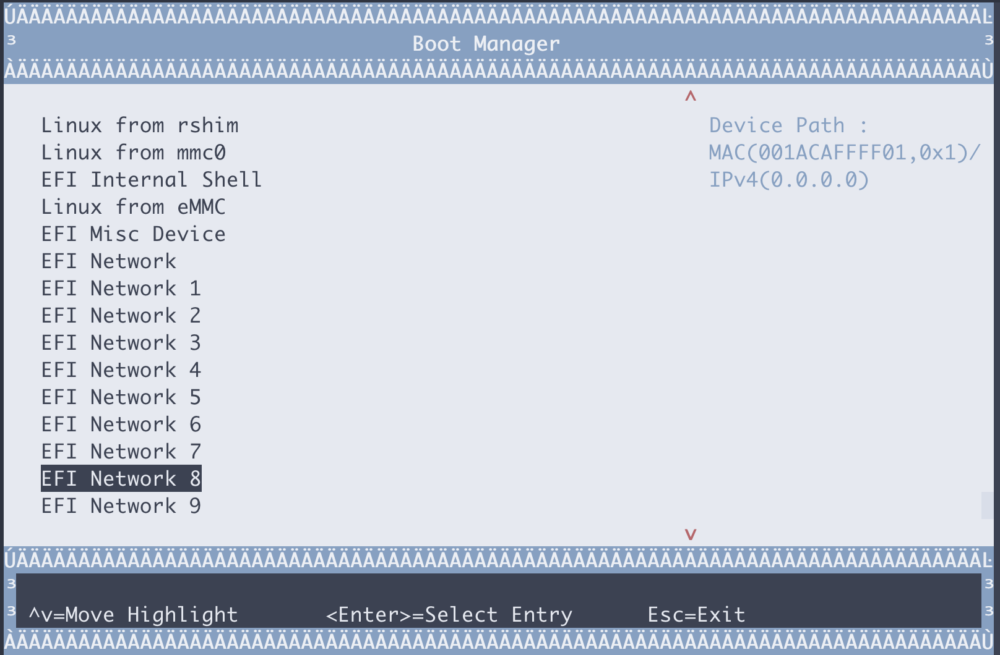

# openshift with bf2, DPI senario

https://developers.redhat.com/articles/2021/10/18/sensitive-information-detection-using-nvidia-morpheus-ai-framework#installing_and_running_nvidia_morpheus_ai_on_red_hat_openshift

```bash
# install rocky 8.5

export VAR_HOST='rl_panlab104'

# 按照完了操作系统以后，添加kernel参数，主要是intel_iommu=on iommu=pt，然后重启
cp /etc/default/grub /etc/default/grub.bak
sed -i "/GRUB_CMDLINE_LINUX/s/resume=[^[:space:]]*//"  /etc/default/grub
sed -i "/GRUB_CMDLINE_LINUX/s/rd.lvm.lv=${VAR_HOST}\\/swap//"  /etc/default/grub
# https://unix.stackexchange.com/questions/403706/sed-insert-text-after-nth-character-preceding-following-a-given-string
sed -i '/GRUB_CMDLINE_LINUX/s/"/ intel_iommu=on iommu=pt pci=realloc  default_hugepagesz=1G hugepagesz=1G hugepages=16 rdblacklist=nouveau"/2' /etc/default/grub

grub2-mkconfig -o /boot/efi/EFI/rocky/grub.cfg

grub2-mkconfig -o /boot/grub2/grub.cfg

# 添加kvm cpu host mode模式的支持，可以不做
cat << EOF > /etc/modprobe.d/kvm-nested.conf
options kvm_intel nested=1  
options kvm-intel enable_shadow_vmcs=1   
options kvm-intel enable_apicv=1         
options kvm-intel ept=1                  
EOF

# 默认的操作系统安装，有swap, home分区，我们是测试系统，全都删了吧。
umount /home
swapoff  /dev/$VAR_HOST/swap

cp /etc/fstab /etc/fstab.bak
sed -i 's/^[^#]*home/#&/' /etc/fstab
sed -i 's/^[^#]*swap/#&/' /etc/fstab

lvremove -f /dev/$VAR_HOST/home
lvremove -f /dev/$VAR_HOST/swap

lvextend -l +100%FREE /dev/$VAR_HOST/root
xfs_growfs /dev/$VAR_HOST/root

# 至此，开始安装网卡驱动
# 103 driver install
# https://www.mellanox.com/products/infiniband-drivers/linux/mlnx_ofed

dnf install -y epel-release
dnf install -y byobu htop
dnf groupinstall -y 'Development Tools'
dnf groupinstall -y "Server with GUI"
dnf config-manager --set-enabled powertools

# https://bugzilla.redhat.com/show_bug.cgi?id=1814682
dnf install -y kernel-modules-extra psmisc

mkdir -p /data/down/
cd /data/down/

# https://docs.nvidia.com/doca/sdk/installation-guide/index.html
# wget https://developer.nvidia.com/networking/secure/doca-sdk/doca_1.2.0/doca_120_b215/rshim-2.0.6-3.ge329c69.el7.centos.x86_64.rpm
yum install -y rshim*.rpm

dnf install -y rshim expect wget minicom rpm-build lshw
systemctl enable --now rshim
systemctl status rshim --no-pager -l
dnf install -y openssl-devel

export http_proxy="http://192.168.195.54:5085"
export https_proxy=${http_proxy}

git clone https://github.com/Mellanox/mstflint
cd mstflint
./autogen.sh
./configure --disable-inband
make && make install

# nat router on host
# https://access.redhat.com/discussions/4642721
cat << EOF >> /etc/sysctl.d/99-wzh-sysctl.conf

net.ipv4.ip_forward = 1

EOF
sysctl --system

systemctl disable --now firewalld

# shell come frome https://github.com/wangzheng422/rhel-on-bf2
wget https://mirrors.sjtug.sjtu.edu.cn/rocky/8.5/isos/aarch64/Rocky-8.5-aarch64-minimal.iso
export RHEL_ISO=Rocky-8.5-aarch64-minimal.iso
bash bluefield_provision.sh -s
# === STATUS === Checking usability of SRIOV for PCI 0000:06:00.0
# SRIOV needs to be enabled in BIOS
# EMBEDDED_CPU mode enabled
# === STATUS === Checking usability of SRIOV for PCI 0000:06:00.1
# SRIOV needs to be enabled in BIOS
# EMBEDDED_CPU mode enabled
setenforce 0
bash bluefield_provision.sh -p
```




take at least 10 20 mins here, and it will continue to finish.
```
Running post-installation scripts
```

```bash
# on host
cat << EOF >> /etc/rc.d/rc.local

iptables -t nat -A POSTROUTING -o eno2 -j MASQUERADE

EOF
chmod +x /etc/rc.d/rc.local
systemctl enable --now rc-local

# if you want to connect to bf2 through serial console
minicom --color on --baudrate 115200 --device /dev/rshim0/console

# enter 'enter', then login from the console
CON_NAME=`nmcli -g GENERAL.CONNECTION dev show eth0`
nmcli con modi "$CON_NAME" ipv4.method manual ipv4.addresses 172.31.100.2/24 ipv4.gateway 172.31.100.1 ipv4.dns 172.21.1.1 ipv6.method ignore
nmcli con up "$CON_NAME"

# on bf2
ssh root@172.31.100.2

mkdir -p /data/down/
cd /data/down/

dnf install -y wget
wget https://www.mellanox.com/downloads/ofed/MLNX_OFED-5.5-1.0.3.2/MLNX_OFED_LINUX-5.5-1.0.3.2-rhel8.5-aarch64.tgz
tar zvxf *.tgz
cd /data/down/MLNX_OFED_LINUX-5.5-1.0.3.2-rhel8.5-aarch64
dnf groupinstall -y 'Development Tools'
dnf install -y tcl tk kernel-modules-extra python36 make gcc-gfortran tcsh unbound
./mlnxofedinstall --all --force --distro rhel8.5
# Device (00:00.0):
#         00:00.0 PCI bridge: Mellanox Technologies MT42822 BlueField-2 SoC Crypto disabled
#         Link Width: x16
#         PCI Link Speed: 16GT/s

# Device (01:00.0):
#         01:00.0 PCI bridge: Mellanox Technologies MT42822 Family [BlueField-2 SoC PCIe Bridge]
#         Link Width: x16
#         PCI Link Speed: 16GT/s

# Device (02:00.0):
#         02:00.0 PCI bridge: Mellanox Technologies MT42822 Family [BlueField-2 SoC PCIe Bridge]
#         Link Width: x16
#         PCI Link Speed: 16GT/s

# Device (03:00.0):
#         03:00.0 Ethernet controller: Mellanox Technologies MT42822 BlueField-2 integrated ConnectX-6 Dx network controller
#         Link Width: x16
#         PCI Link Speed: 16GT/s

# Device (03:00.1):
#         03:00.1 Ethernet controller: Mellanox Technologies MT42822 BlueField-2 integrated ConnectX-6 Dx network controller
#         Link Width: x16
#         PCI Link Speed: 16GT/s


# Installation finished successfully.


# Verifying...                          ################################# [100%]
# Preparing...                          ################################# [100%]
# Updating / installing...
#    1:mlnx-fw-updater-5.5-1.0.3.2      ################################# [100%]

# Added 'RUN_FW_UPDATER_ONBOOT=no to /etc/infiniband/openib.conf

# Initializing...
# Attempting to perform Firmware update...
# Querying Mellanox devices firmware ...

# Device #1:
# ----------

#   Device Type:      BlueField2
#   Part Number:      MBF2M332A-AENO_Ax_Bx
#   Description:      BlueField-2 E-Series DPU 25GbE Dual-Port SFP56; PCIe Gen4 x8; Crypto Disabled; 16GB on-board DDR; 1GbE OOB management; HHHL
#   PSID:             MT_0000000494
#   PCI Device Name:  03:00.0
#   Base GUID:        043f720300e18bba
#   Base MAC:         043f72e18bba
#   Versions:         Current        Available
#      FW             24.32.1010     24.32.1010
#      NVMe           N/A            20.3.0001
#      PXE            3.6.0502       3.6.0502
#      UEFI           14.25.0017     14.25.0017
#      UEFI Virtio blk   22.2.0010      22.2.0010
#      UEFI Virtio net   21.2.0010      21.2.0010

#   Status:           Up to date


# Log File: /tmp/liCDr9jvCH
# Real log file: /tmp/MLNX_OFED_LINUX.55295.logs/fw_update.log
# To load the new driver, run:
# /etc/init.d/openibd restart

reboot

systemctl enable --now mst
systemctl enable --now openibd

cat << EOF > /etc/yum.repos.d/mlx.repo
[mlnx_ofed]
name=MLNX_OFED Repository
baseurl=file:///data/down/MLNX_OFED_LINUX-5.5-1.0.3.2-rhel8.5-aarch64/RPMS
enabled=1
gpgcheck=0
EOF

dnf makecache 

dnf install -y numactl-devel openvswitch  openvswitch-selinux-policy libnl3-devel openssl-devel zlib-devel elfutils-libelf-devel 

systemctl enable --now openvswitch

lshw -c network -businfo
# Bus info          Device          Class      Description
# ========================================================
# pci@0000:03:00.0                  network    MT42822 BlueField-2 integrated ConnectX-6 Dx network controller
# pci@0000:03:00.1                  network    MT42822 BlueField-2 integrated ConnectX-6 Dx network controller
# virtio@1          eth0            network    Ethernet interface
#                   enamlnxbf17i0   network    Ethernet interface

mlxconfig -d /dev/mst/mt41686_pciconf0 -y reset
reboot


# on vultr
ngc config set

ngc registry resource list > list

cat list | jq '.[].description | match(".*Morpheus.*")'

cat list | jq '.[] | select(.description | match(".*Morpheus.*"))'

```

# others

```bash

# firewall-cmd --permanent --direct --add-rule ipv4 nat POSTROUTING 0 -o eth_ext -j MASQUERADE
# firewall-cmd --permanent --direct --add-rule ipv4 filter FORWARD 0 -i eth_int -o eth_ext -j ACCEPT
# firewall-cmd --permanent --direct --add-rule ipv4 filter FORWARD 0 -i eth_ext -o eth_int -m state --state RELATED,ESTABLISHED -j ACCEPT
# firewall-cmd --permanent --add-port=80/tcp
# firewall-cmd --permanent --add-port=443/tcp
# firewall-cmd --permanent --add-port=53/tcp
# firewall-cmd --permanent --add-port=53/udp
# firewall-cmd --permanent --add-masquerade
# firewall-cmd --reload

# firewall-cmd --permanent --direct --remove-rule ipv4 nat POSTROUTING 0 -o eth_ext -j MASQUERADE
# firewall-cmd --permanent --direct --remove-rule ipv4 filter FORWARD 0 -i eth_int -o eth_ext -j ACCEPT
# firewall-cmd --permanent --direct --remove-rule ipv4 filter FORWARD 0 -i eth_ext -o eth_int -m state --state RELATED,ESTABLISHED -j ACCEPT
# firewall-cmd --permanent --remove-port=80/tcp
# firewall-cmd --permanent --remove-port=443/tcp
# firewall-cmd --permanent --remove-port=53/tcp
# firewall-cmd --permanent --remove-port=53/udp
# firewall-cmd --permanent --remove-masquerade
# firewall-cmd --reload

```