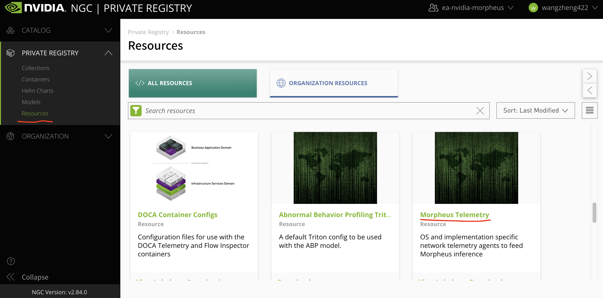

# openshift with bf2, DPI senario

本文参考[红帽的blog](https://developers.redhat.com/articles/2021/10/18/sensitive-information-detection-using-nvidia-morpheus-ai-framework#installing_and_running_nvidia_morpheus_ai_on_red_hat_openshift)，试图配置一套DPI方案，从bf2上抓去网络包，送到openshift上去，然后进行分析。

大体的过程是，用rocky linux刷bf2卡，装ofed包，把bf2卡配置好。然后去配置openshift。本文目前的状态是，openshift部分还没开始做。

本文后面有一段，是如何在宿主机是rocky linux的情况下，[给bf2卡刷官方的镜像](#flash-bf2-with-offical-image)

# install host and bf2 with rocky 8.5
```bash
# install rocky 8.5

export VAR_HOST='rl_panlab104'

# 按照完了操作系统以后，添加kernel参数，主要是intel_iommu=on iommu=pt，然后重启
cp /etc/default/grub /etc/default/grub.bak
sed -i "/GRUB_CMDLINE_LINUX/s/resume=[^[:space:]]*//"  /etc/default/grub
sed -i "/GRUB_CMDLINE_LINUX/s/rd.lvm.lv=${VAR_HOST}\\/swap//"  /etc/default/grub
# https://unix.stackexchange.com/questions/403706/sed-insert-text-after-nth-character-preceding-following-a-given-string
sed -i '/GRUB_CMDLINE_LINUX/s/"/ intel_iommu=on iommu=pt pci=realloc  default_hugepagesz=1G hugepagesz=1G hugepages=16 rdblacklist=nouveau"/2' /etc/default/grub

grub2-mkconfig -o /boot/efi/EFI/rocky/grub.cfg

grub2-mkconfig -o /boot/grub2/grub.cfg

# 添加kvm cpu host mode模式的支持，可以不做
cat << EOF > /etc/modprobe.d/kvm-nested.conf
options kvm_intel nested=1  
options kvm-intel enable_shadow_vmcs=1   
options kvm-intel enable_apicv=1         
options kvm-intel ept=1                  
EOF

# 默认的操作系统安装，有swap, home分区，我们是测试系统，全都删了吧。
umount /home
swapoff  /dev/$VAR_HOST/swap

cp /etc/fstab /etc/fstab.bak
sed -i 's/^[^#]*home/#&/' /etc/fstab
sed -i 's/^[^#]*swap/#&/' /etc/fstab

lvremove -f /dev/$VAR_HOST/home
lvremove -f /dev/$VAR_HOST/swap

lvextend -l +100%FREE /dev/$VAR_HOST/root
xfs_growfs /dev/$VAR_HOST/root

# on 104, begin install bf2
# first, is console
# https://www.mellanox.com/products/infiniband-drivers/linux/mlnx_ofed

dnf install -y epel-release
dnf install -y byobu htop
dnf groupinstall -y 'Development Tools'
dnf groupinstall -y "Server with GUI"
dnf config-manager --set-enabled powertools

# https://bugzilla.redhat.com/show_bug.cgi?id=1814682
dnf install -y kernel-modules-extra psmisc

mkdir -p /data/down/
cd /data/down/

# https://docs.nvidia.com/doca/sdk/installation-guide/index.html
# wget https://developer.nvidia.com/networking/secure/doca-sdk/doca_1.2.0/doca_120_b215/rshim-2.0.6-3.ge329c69.el7.centos.x86_64.rpm
yum install -y rshim*.rpm

dnf install -y rshim expect wget minicom rpm-build lshw
systemctl enable --now rshim
systemctl status rshim --no-pager -l
dnf install -y openssl-devel

export http_proxy="http://192.168.195.54:5085"
export https_proxy=${http_proxy}

git clone https://github.com/Mellanox/mstflint
cd mstflint
./autogen.sh
./configure --disable-inband
make && make install

# nat router on host
# https://access.redhat.com/discussions/4642721
cat << EOF >> /etc/sysctl.d/99-wzh-sysctl.conf

net.ipv4.ip_forward = 1

EOF
sysctl --system

systemctl disable --now firewalld

# shell come frome https://github.com/wangzheng422/rhel-on-bf2
wget https://mirrors.sjtug.sjtu.edu.cn/rocky/8.5/isos/aarch64/Rocky-8.5-aarch64-minimal.iso
export RHEL_ISO=Rocky-8.5-aarch64-minimal.iso
bash bluefield_provision.sh -s
# === STATUS === Checking usability of SRIOV for PCI 0000:06:00.0
# SRIOV needs to be enabled in BIOS
# EMBEDDED_CPU mode enabled
# === STATUS === Checking usability of SRIOV for PCI 0000:06:00.1
# SRIOV needs to be enabled in BIOS
# EMBEDDED_CPU mode enabled
setenforce 0
bash bluefield_provision.sh -p

```


take at least 10-20 mins here, and it will continue to finish.
```
Running post-installation scripts
```

```bash
# on host
cat << EOF >> /etc/rc.d/rc.local

iptables -t nat -A POSTROUTING -o eno2 -j MASQUERADE

EOF
chmod +x /etc/rc.d/rc.local
systemctl enable --now rc-local

# if you want to connect to bf2 through serial console
minicom --color on --baudrate 115200 --device /dev/rshim0/console

# enter, then login from the console
CON_NAME=`nmcli -g GENERAL.CONNECTION dev show eth0`
nmcli con modi "$CON_NAME" ipv4.method manual ipv4.addresses 172.31.100.2/24 ipv4.gateway 172.31.100.1 ipv4.dns 172.21.1.1 ipv6.method ignore
nmcli con up "$CON_NAME"

# on bf2
ssh root@172.31.100.2

cp /etc/default/grub /etc/default/grub.bak
# https://unix.stackexchange.com/questions/403706/sed-insert-text-after-nth-character-preceding-following-a-given-string
sed -i '/GRUB_CMDLINE_LINUX/s/"/ fixrtc "/2' /etc/default/grub

grub2-mkconfig -o /boot/efi/EFI/rocky/grub.cfg

grub2-mkconfig -o /boot/grub2/grub.cfg

dnf update -y

reboot

mkdir -p /data/down/
cd /data/down/

dnf install -y wget
wget https://www.mellanox.com/downloads/ofed/MLNX_OFED-5.5-1.0.3.2/MLNX_OFED_LINUX-5.5-1.0.3.2-rhel8.5-aarch64.tgz
tar zvxf *.tgz
cd /data/down/MLNX_OFED_LINUX-5.5-1.0.3.2-rhel8.5-aarch64
dnf groupinstall -y 'Development Tools'
dnf install -y tcl tk kernel-modules-extra python36 make gcc-gfortran tcsh unbound
./mlnxofedinstall --all --force --distro rhel8.5
# Device (00:00.0):
#         00:00.0 PCI bridge: Mellanox Technologies MT42822 BlueField-2 SoC Crypto disabled
#         Link Width: x16
#         PCI Link Speed: 16GT/s

# Device (01:00.0):
#         01:00.0 PCI bridge: Mellanox Technologies MT42822 Family [BlueField-2 SoC PCIe Bridge]
#         Link Width: x16
#         PCI Link Speed: 16GT/s

# Device (02:00.0):
#         02:00.0 PCI bridge: Mellanox Technologies MT42822 Family [BlueField-2 SoC PCIe Bridge]
#         Link Width: x16
#         PCI Link Speed: 16GT/s

# Device (03:00.0):
#         03:00.0 Ethernet controller: Mellanox Technologies MT42822 BlueField-2 integrated ConnectX-6 Dx network controller
#         Link Width: x16
#         PCI Link Speed: 16GT/s

# Device (03:00.1):
#         03:00.1 Ethernet controller: Mellanox Technologies MT42822 BlueField-2 integrated ConnectX-6 Dx network controller
#         Link Width: x16
#         PCI Link Speed: 16GT/s


# Installation finished successfully.


# Verifying...                          ################################# [100%]
# Preparing...                          ################################# [100%]
# Updating / installing...
#    1:mlnx-fw-updater-5.5-1.0.3.2      ################################# [100%]

# Added 'RUN_FW_UPDATER_ONBOOT=no to /etc/infiniband/openib.conf

# Initializing...
# Attempting to perform Firmware update...
# Querying Mellanox devices firmware ...

# Device #1:
# ----------

#   Device Type:      BlueField2
#   Part Number:      MBF2M332A-AENO_Ax_Bx
#   Description:      BlueField-2 E-Series DPU 25GbE Dual-Port SFP56; PCIe Gen4 x8; Crypto Disabled; 16GB on-board DDR; 1GbE OOB management; HHHL
#   PSID:             MT_0000000494
#   PCI Device Name:  03:00.0
#   Base GUID:        043f720300e18bba
#   Base MAC:         043f72e18bba
#   Versions:         Current        Available
#      FW             24.32.1010     24.32.1010
#      NVMe           N/A            20.3.0001
#      PXE            3.6.0502       3.6.0502
#      UEFI           14.25.0017     14.25.0017
#      UEFI Virtio blk   22.2.0010      22.2.0010
#      UEFI Virtio net   21.2.0010      21.2.0010

#   Status:           Up to date

# Log File: /tmp/liCDr9jvCH
# Real log file: /tmp/MLNX_OFED_LINUX.55295.logs/fw_update.log
# To load the new driver, run:
# /etc/init.d/openibd restart

systemctl enable --now mst
systemctl enable --now openibd

cat << EOF > /etc/yum.repos.d/mlx.repo
[mlnx_ofed]
name=MLNX_OFED Repository
baseurl=file:///data/down/MLNX_OFED_LINUX-5.5-1.0.3.2-rhel8.5-aarch64/RPMS
enabled=1
gpgcheck=0
EOF

dnf makecache 

dnf install -y numactl-devel openvswitch  openvswitch-selinux-policy libnl3-devel openssl-devel zlib-devel elfutils-libelf-devel 

systemctl enable --now openvswitch

cat << EOF > /etc/mellanox/mlnx-sf.conf
/sbin/mlnx-sf --action create --device 0000:03:00.0 --sfnum 0 --hwaddr 02:61:f6:21:32:8c
/sbin/mlnx-sf --action create --device 0000:03:00.1 --sfnum 0 --hwaddr 02:30:13:6a:2d:2c
EOF

cat << EOF > /etc/mellanox/mlnx-ovs.conf
CREATE_OVS_BRIDGES="yes"
OVS_BRIDGE1="ovsbr1"
OVS_BRIDGE1_PORTS="p0 c1pf0hpf en3f0pf0sf0"
OVS_BRIDGE2="ovsbr2"
OVS_BRIDGE2_PORTS="p1 c1pf1hpf en3f1pf1sf0"
OVS_HW_OFFLOAD="yes"
OVS_START_TIMEOUT=30
EOF

reboot

mlnx-sf -a show
# SF Index: pci/0000:03:00.0/294912
#   Parent PCI dev: 0000:03:00.0
#   Representor netdev: en3f0pf0sf0
#   Function HWADDR: 02:61:f6:21:32:8c
#   Auxiliary device: mlx5_core.sf.2
#     netdev: enp3s0f0s0
#     RDMA dev: mlx5_2

# SF Index: pci/0000:03:00.1/360448
#   Parent PCI dev: 0000:03:00.1
#   Representor netdev: en3f1pf1sf0
#   Function HWADDR: 02:30:13:6a:2d:2c
#   Auxiliary device: mlx5_core.sf.3
#     netdev: enp3s0f1s0
#     RDMA dev: mlx5_3

lshw -c network -businfo
# Bus info          Device          Class      Description
# ========================================================
# pci@0000:03:00.0  p0              network    MT42822 BlueField-2 integrated ConnectX-6 Dx network controller
# pci@0000:03:00.1  p1              network    MT42822 BlueField-2 integrated ConnectX-6 Dx network controller
# virtio@1          eth0            network    Ethernet interface
#                   enamlnxbf17i0   network    Ethernet interface
# pci@0000:03:00.0  c1pf0hpf        network    Ethernet interface
# pci@0000:03:00.1  c1pf1hpf        network    Ethernet interface
# pci@0000:03:00.0  en3f0pf0sf0     network    Ethernet interface
# pci@0000:03:00.1  en3f1pf1sf0     network    Ethernet interface
# pci@0000:03:00.0  enp3s0f0s0      network    Ethernet interface
# pci@0000:03:00.1  enp3s0f1s0      network    Ethernet interface

# mlxconfig -d /dev/mst/mt41686_pciconf0 -y reset
# reboot

mst status -v
# MST modules:
# ------------
#     MST PCI module is not loaded
#     MST PCI configuration module loaded
# PCI devices:
# ------------
# DEVICE_TYPE             MST                           PCI       RDMA            NET                       NUMA
# BlueField2(rev:0)       /dev/mst/mt41686_pciconf0.1   03:00.1   mlx5_1          net-c1pf1hpf,net-p1,net-en3f1pf1sf0-1

# BlueField2(rev:0)       /dev/mst/mt41686_pciconf0     03:00.0   mlx5_0          net-en3f0pf0sf0,net-c1pf0hpf,net-p0-1

# rmmod rpcrdma ib_srpt ib_isert
# systemctl restart openibd

mlxconfig -d /dev/mst/mt41686_pciconf0 q INTERNAL_CPU_MODEL
# Device #1:
# ----------

# Device type:    BlueField2
# Name:           MBF2M332A-AENO_Ax_Bx
# Description:    BlueField-2 E-Series DPU 25GbE Dual-Port SFP56; PCIe Gen4 x8; Crypto Disabled; 16GB on-board DDR; 1GbE OOB management; HHHL
# Device:         /dev/mst/mt41686_pciconf0

# Configurations:                              Next Boot
#          INTERNAL_CPU_MODEL                  EMBEDDED_CPU(1)

ovs-vsctl show
# 709b5994-8160-4e8a-8a06-4750ec433590
#     Bridge ovsbr2
#         Port ovsbr2
#             Interface ovsbr2
#                 type: internal
#         Port en3f1pf1sf0
#             Interface en3f1pf1sf0
#         Port c1pf1hpf
#             Interface c1pf1hpf
#         Port p1
#             Interface p1
#     Bridge ovsbr1
#         Port c1pf0hpf
#             Interface c1pf0hpf
#         Port ovsbr1
#             Interface ovsbr1
#                 type: internal
#         Port p0
#             Interface p0
#         Port en3f0pf0sf0
#             Interface en3f0pf0sf0
#     ovs_version: "2.15.1"
```

# link test

```bash
# on 104 with bf2
# nmcli con modify enp6s0f1 ipv4.method manual ipv4.addresses 192.168.99.11/24
nmcli con down enp6s0f1
nmcli con modify enp6s0f0 ipv4.method manual ipv4.addresses 192.168.99.11/24
nmcli con up enp6s0f0

# on 101 with dx6
nmcli con modify enp5s0f1 ipv4.method manual ipv4.addresses 192.168.99.21/24
nmcli con up enp5s0f1

ping 192.168.99.11
# PING 192.168.99.11 (192.168.99.11) 56(84) bytes of data.
# 64 bytes from 192.168.99.11: icmp_seq=1 ttl=64 time=38.3 ms
# 64 bytes from 192.168.99.11: icmp_seq=2 ttl=64 time=0.350 ms
# 64 bytes from 192.168.99.11: icmp_seq=3 ttl=64 time=0.269 ms

```

# dpi netq-agent test

```bash
# install Morpheus Telemetry from: https://ngc.nvidia.com/resources/ea-nvidia-morpheus:morpheus_telemetry
# follow redhat blog, you should use this command to download rpm
ngc registry resource download-version "ea-nvidia-morpheus/morpheus_telemetry:netq4-rhel8"
```
but it is too wired, lets download it from webpage: https://ngc.nvidia.com/resources




```bash
# on bf2
# copy netq-agent.rpm to /data/down
cd /data/down/
yum install ./netq-agent-4.0.0-rh8u34_1626785319.908c36d5.aarch64.rpm

cat << EOF > /etc/netq/pcap.yml
netq-pcap-config:

  interface: p0

  filter: "tcp port 80"
EOF

/bin/cp -f /etc/netq/netq.yml /etc/netq/netq.yml.bak
cat << EOF > /etc/netq/netq.yml
netq-agent:

  port: 31980

  server: 172.31.100.1

  vrf: default

  is-pcap-enabled: True

  suppress-sub-agents: all
EOF

systemctl restart netq-agent

systemctl status -l netq-agent
# ● netq-agent.service - NetQ Telemetry Daemon
#    Loaded: loaded (/usr/lib/systemd/system/netq-agent.service; disabled; vendor preset: disabled)
#    Active: active (running) since Wed 2021-12-15 15:56:04 CST; 3s ago
#  Main PID: 4121 (netq-agent)
#     Tasks: 9 (limit: 25196)
#    Memory: 62.3M
#    CGroup: /system.slice/netq-agent.service
#            ├─4121 /usr/share/venvs/netq-agent/bin/python /usr/sbin/netq-agent
#            └─4150 /usr/sbin/netq-go-agent

# Dec 15 15:56:06 bluefield-soc.mlx netq-agent[4121]: INFO: Binding to monitor port /run/netq_monitor_thread
# Dec 15 15:56:06 bluefield-soc.mlx netq-agent[4121]: {{172.31.100.1 31980 info /var/log/netq-go-agent.log}}
# Dec 15 15:56:06 bluefield-soc.mlx netq-agent[4121]: 2021/12/15 15:56:06.445197 bluefield-soc.mlx netq-go-agent[4150]: INFO: configuration: {NetqAgent:{N>
# Dec 15 15:56:06 bluefield-soc.mlx netq-go-agent[4150]: INFO: configuration: {NetqAgent:{NetqStreamAddress:172.31.100.1 NetqStreamPort:31980 LogLevel:inf>
# Dec 15 15:56:06 bluefield-soc.mlx netq-go-agent[4150]: INFO: {{en3f1pf1sf0 tcp port 80}}
# Dec 15 15:56:06 bluefield-soc.mlx netq-agent[4121]: 2021/12/15 15:56:06.445781 bluefield-soc.mlx netq-go-agent[4150]: INFO: {{en3f1pf1sf0 tcp port 80}}
# Dec 15 15:56:06 bluefield-soc.mlx netq-agent[4121]: 2021/12/15 15:56:06.446653 bluefield-soc.mlx netq-go-agent[4150]: INFO: Initializing Client Connecti>
# Dec 15 15:56:06 bluefield-soc.mlx netq-go-agent[4150]: INFO: Initializing Client Connection to 172.31.100.1:31980
# Dec 15 15:56:06 bluefield-soc.mlx netq-agent[4121]: 2021/12/15 15:56:06.676208 bluefield-soc.mlx netq-go-agent[4150]: INFO: Reading Live Capture Started
# Dec 15 15:56:06 bluefield-soc.mlx netq-go-agent[4150]: INFO: Reading Live Capture Started

# on 104 with bf2 host,
# python3 -m  http.server 80

mkdir -p /data/soft/h2
cd /data/soft/h2

openssl req -x509 -newkey rsa:4096 -keyout key.pem -out cert.pem -days 365 -nodes
cat << EOF > firebase.json
{
  "rewrites": [
    {
      "source": "**",
      "destination": "/index.html"
    }
  ]
}
EOF
podman run -p 31980:5000 -v $PWD:/data:Z docker.io/surma/simplehttp2server [-config firebase.json]


# on 101
curl http://192.168.99.11

```

# dpi url-filter test

https://docs.nvidia.com/doca/sdk/url-filter/index.html

```bash
# on bf2
cd /opt/mellanox/doca/examples/url_filter/bin

echo 2048 > /sys/kernel/mm/hugepages/hugepages-2048kB/nr_hugepages
systemctl restart mlx-regex
systemctl status mlx-regex
# ● mlx-regex.service - Regex daemon for BlueField 2
#      Loaded: loaded (/etc/systemd/system/mlx-regex.service; enabled; vendor preset: enabled)
#      Active: active (running) since Thu 2021-12-16 11:47:01 UTC; 7s ago
#    Main PID: 55816 (mlx-regex)
#       Tasks: 1 (limit: 19083)
#      Memory: 564.0K
#      CGroup: /system.slice/mlx-regex.service
#              └─55816 /usr/bin/mlx-regex

# Dec 16 11:47:01 localhost systemd[1]: Started Regex daemon for BlueField 2.

/opt/mellanox/iproute2/sbin/mlxdevm port show
# pci/0000:03:00.0/294912: type eth netdev en3f0pf0sf0 flavour pcisf controller 0 pfnum 0 sfnum 0
#   function:
#     hw_addr 02:56:ae:76:cd:e9 state active opstate attached roce true max_uc_macs 128 trust off
# pci/0000:03:00.1/360448: type eth netdev en3f1pf1sf0 flavour pcisf controller 0 pfnum 1 sfnum 0
#   function:
#     hw_addr 02:26:61:34:13:9e state active opstate attached roce true max_uc_macs 128 trust off

/opt/mellanox/iproute2/sbin/mlxdevm port add pci/0000:03:00.0 flavour pcisf pfnum 0 sfnum 4
/opt/mellanox/iproute2/sbin/mlxdevm port add pci/0000:03:00.0 flavour pcisf pfnum 0 sfnum 5 

/opt/mellanox/iproute2/sbin/mlxdevm port show
# pci/0000:03:00.0/294912: type eth netdev en3f0pf0sf0 flavour pcisf controller 0 pfnum 0 sfnum 0
#   function:
#     hw_addr 02:56:ae:76:cd:e9 state active opstate attached roce true max_uc_macs 128 trust off
# pci/0000:03:00.0/294913: type eth netdev en3f0pf0sf4 flavour pcisf controller 0 pfnum 0 sfnum 4
#   function:
#     hw_addr 00:00:00:00:00:00 state inactive opstate detached roce true max_uc_macs 128 trust off
# pci/0000:03:00.0/294914: type eth netdev en3f0pf0sf5 flavour pcisf controller 0 pfnum 0 sfnum 5
#   function:
#     hw_addr 00:00:00:00:00:00 state inactive opstate detached roce true max_uc_macs 128 trust off
# pci/0000:03:00.1/360448: type eth netdev en3f1pf1sf0 flavour pcisf controller 0 pfnum 1 sfnum 0
#   function:
#     hw_addr 02:26:61:34:13:9e state active opstate attached roce true max_uc_macs 128 trust off

/opt/mellanox/iproute2/sbin/mlxdevm port function set pci/0000:03:00.0/294913 hw_addr 02:25:f2:8d:a2:4c trust on state active
/opt/mellanox/iproute2/sbin/mlxdevm port function set pci/0000:03:00.0/294914 hw_addr 02:25:f2:8d:a2:5c trust on state active

ovs-vsctl del-br ovsbr1 

ovs-vsctl add-br sf_bridge1
ovs-vsctl add-br sf_bridge2
ovs-vsctl add-port sf_bridge1 p0
ovs-vsctl add-port sf_bridge1 en3f0pf0sf4
ovs-vsctl add-port sf_bridge2 pf0hpf
ovs-vsctl add-port sf_bridge2 en3f0pf0sf5 

ovs-vsctl show
# 04d25b73-2f63-4e47-b7d9-2362cc4d7fda
#     Bridge ovsbr2
#         Port p1
#             Interface p1
#         Port en3f1pf1sf0
#             Interface en3f1pf1sf0
#         Port ovsbr2
#             Interface ovsbr2
#                 type: internal
#         Port pf1hpf
#             Interface pf1hpf
#     Bridge sf_bridge2
#         Port sf_bridge2
#             Interface sf_bridge2
#                 type: internal
#         Port en3f0pf0sf5
#             Interface en3f0pf0sf5
#         Port pf0hpf
#             Interface pf0hpf
#     Bridge sf_bridge1
#         Port sf_bridge1
#             Interface sf_bridge1
#                 type: internal
#         Port en3f0pf0sf4
#             Interface en3f0pf0sf4
#         Port p0
#             Interface p0
#     ovs_version: "2.15.1"

ifconfig en3f0pf0sf4 up
ifconfig en3f0pf0sf5 up

echo mlx5_core.sf.4  > /sys/bus/auxiliary/drivers/mlx5_core.sf_cfg/unbind
echo mlx5_core.sf.4  > /sys/bus/auxiliary/drivers/mlx5_core.sf/bind
echo mlx5_core.sf.5  > /sys/bus/auxiliary/drivers/mlx5_core.sf_cfg/unbind
echo mlx5_core.sf.5  > /sys/bus/auxiliary/drivers/mlx5_core.sf/bind

ls /sys/bus/auxiliary/devices/mlx5_core.sf.*
# /sys/bus/auxiliary/devices/mlx5_core.sf.2:
# driver  infiniband  infiniband_mad  infiniband_verbs  mlx5_core.eth.2  mlx5_core.rdma.2  net  power  sfnum  subsystem  uevent

# /sys/bus/auxiliary/devices/mlx5_core.sf.3:
# driver  infiniband  infiniband_mad  infiniband_verbs  mlx5_core.eth.3  mlx5_core.rdma.3  net  power  sfnum  subsystem  uevent

# /sys/bus/auxiliary/devices/mlx5_core.sf.4:
# driver  infiniband  infiniband_mad  infiniband_verbs  mlx5_core.eth.4  mlx5_core.rdma.4  net  power  sfnum  subsystem  uevent

# /sys/bus/auxiliary/devices/mlx5_core.sf.5:
# driver  infiniband  infiniband_mad  infiniband_verbs  mlx5_core.eth.5  mlx5_core.rdma.5  net  power  sfnum  subsystem  uevent

cat /sys/bus/auxiliary/devices/mlx5_core.sf.4/sfnum
# 4

# on 104 host with bf2
# nmcli con modify enp6s0f1 ipv4.method manual ipv4.addresses 192.168.99.11/24
nmcli con down enp6s0f1
nmcli con modify enp6s0f0 ipv4.method manual ipv4.addresses 192.168.99.11/24
nmcli con up enp6s0f0

# on 104 bf2
/opt/mellanox/doca/examples/url_filter/bin/doca_url_filter -a 0000:03:00.0,class=regex -a auxiliary:mlx5_core.sf.4,sft_en=1 -a auxiliary:mlx5_core.sf.5,sft_en=1 -- -p
URL FILTER>> create database
URL FILTER>> filter http wzh_hits_msg wzhtest
URL FILTER>> commit database /tmp/signature.txt
# /tmp/104052/signatures.rules
# rules file is /tmp/104052/signatures.rules
# Info: Setting target hardware version to v5.7...done
# Info: Setting virtual prefix mode to 0...done
# Info: Setting prefix capacity to 32K...done
# Info: Setting compiler objective value to 5...done
# Info: Setting number of threads for compilation to 1...done
# Info: Reading ruleset...done
# Info: Detected 2 rules
# Info: Enabling global single-line mode...done
# Info: Setting maximum TPE data width to 4...done
# Info: Scanning rules...[==============================]...done
# Info: Analising possible prefix usage...[==============================]...done
# Info: Mapping prefixes, phase 1...[==============================]...done
# Info: Mapping prefixes, phase 2...[==============================]...done
# Info: Running rules analysis...[==============================]...done
# Info: Optimizing memory map...[==============================]...done
# Info: Analyzing memory map...[==============================]...done
# Info: Calculating thread instructions...[==============================]...done
# Info: Beginning to write memory map for ROF2...done
# Info: PPE total 1-byte prefix usage: 0/256 (0%)
# Info: PPE total 2-byte prefix usage: 0/2048 (0%)
# Info: PPE total 3-byte prefix usage: 0/2048 (0%)
# Info: PPE total 4-byte prefix usage: 1/32768 (0.00305176%)
# Info: TPE instruction RAM TCM partition usage: 2048/2048 (100%)
# Info: TPE instruction RAM external memory partition usage: 6207/13M (0.0455343%)
# Info: TPE class RAM usage: 1/256 (0.390625%)
# Info: Estimated threads/byte: 5.183e-10
# Info: Finalizing memory map for ROF2...done
# Info: Storing ROF2 data...done
# Info: Number of rules compiled = 2/2
# Info: Writing ROF2 file to /tmp/104052/rof/signatures_compiled.rof2
# Info: Writing binary ROF2 file to /tmp/104052/rof/signatures_compiled.rof2.binary...done
URL FILTER>> [12:36:50:606702][DOCA][I][UFLTR::Core]: SIG ID: 1, URL MSG: wzh_hits_msg, SFT_FID: 1

# on 101
curl http://192.168.99.11
# ....
#       <footer class="col-sm-12">
#       <a href="https://apache.org">Apache&trade;</a> is a registered trademark of <a href="https://apache.org">the Apache Software Foundation</a> in the United States and/or other countries.<br />
#       <a href="https://nginx.org">NGINX&trade;</a> is a registered trademark of <a href="https://">F5 Networks, Inc.</a>.
#       </footer>

#   </body>
# </html>

curl http://192.168.99.11/test
# <!DOCTYPE HTML PUBLIC "-//IETF//DTD HTML 2.0//EN">
# <html><head>
# <title>404 Not Found</title>
# </head><body>
# <h1>Not Found</h1>
# <p>The requested URL was not found on this server.</p>
# </body></html>

curl http://192.168.99.11/wzhtest
# curl: (56) Recv failure: Connection timed out


```

## performance test

```bash
# on 104 host
dnf install -y iperf3
iperf3 -s -p 6666

# on 101 host
iperf3 -c 192.168.99.11 -p 6666
# Connecting to host 192.168.99.11, port 6666
# [  5] local 192.168.99.21 port 37060 connected to 192.168.99.11 port 6666
# [ ID] Interval           Transfer     Bitrate         Retr  Cwnd
# [  5]   0.00-1.00   sec  1.40 GBytes  12.1 Gbits/sec   17    905 KBytes
# [  5]   1.00-2.00   sec  1.46 GBytes  12.6 Gbits/sec   26    795 KBytes
# [  5]   2.00-3.00   sec  1.41 GBytes  12.1 Gbits/sec   71    922 KBytes
# [  5]   3.00-4.00   sec  1.49 GBytes  12.8 Gbits/sec    0    998 KBytes
# [  5]   4.00-5.00   sec  1.44 GBytes  12.4 Gbits/sec   44   1010 KBytes
# [  5]   5.00-6.00   sec  1.34 GBytes  11.5 Gbits/sec  101    796 KBytes
# [  5]   6.00-7.00   sec  1.45 GBytes  12.5 Gbits/sec    9    925 KBytes
# [  5]   7.00-8.00   sec  1.39 GBytes  11.9 Gbits/sec    0   1014 KBytes
# [  5]   8.00-9.00   sec  1.45 GBytes  12.4 Gbits/sec   62    930 KBytes
# [  5]   9.00-10.00  sec  1.44 GBytes  12.3 Gbits/sec  157   1.07 MBytes
# - - - - - - - - - - - - - - - - - - - - - - - - -
# [ ID] Interval           Transfer     Bitrate         Retr
# [  5]   0.00-10.00  sec  14.3 GBytes  12.3 Gbits/sec  487             sender
# [  5]   0.00-10.04  sec  14.3 GBytes  12.2 Gbits/sec                  receiver

# iperf Done.

ethtool enp5s0f1
# Settings for enp5s0f1:
#         Supported ports: [ Backplane ]
#         Supported link modes:   1000baseKX/Full
#                                 10000baseKR/Full
#                                 25000baseCR/Full
#                                 25000baseKR/Full
#                                 25000baseSR/Full
#         Supported pause frame use: Symmetric
#         Supports auto-negotiation: Yes
#         Supported FEC modes: None        RS      BASER
#         Advertised link modes:  1000baseKX/Full
#                                 10000baseKR/Full
#                                 25000baseCR/Full
#                                 25000baseKR/Full
#                                 25000baseSR/Full
#         Advertised pause frame use: Symmetric
#         Advertised auto-negotiation: Yes
#         Advertised FEC modes: None       RS      BASER
#         Link partner advertised link modes:  Not reported
#         Link partner advertised pause frame use: No
#         Link partner advertised auto-negotiation: Yes
#         Link partner advertised FEC modes: Not reported
#         Speed: 25000Mb/s
#         Duplex: Full
#         Auto-negotiation: on
#         Port: Direct Attach Copper
#         PHYAD: 0
#         Transceiver: internal
#         Supports Wake-on: d
#         Wake-on: d
#         Current message level: 0x00000004 (4)
#                                link
#         Link detected: yes

```

# flash bf2 with offical image

if you want to flash the bf2 to offical doca ubuntu image, follow steps here.

```bash
# on host
mkdir -p /data/soft
cd /data/soft

cat << EOF > pwd
panpan
EOF

cat << EOF > bf.cfg
ubuntu_PASSWORD='`openssl passwd -1 -in pwd`'
EOF

dnf install -y pv

# https://docs.nvidia.com/doca/sdk/installation-guide/index.html
bfb-install --bfb /data/down/DOCA_v1.2.0_BlueField_OS_Ubuntu_20.04-5.4.0-1022-bluefield-5.5-1.0.3.2-3.8.0.11969-1.signed-aarch64.bfb --config bf.cfg --rshim rshim0

# console=hvc0 console=ttyAMA0 earlycon=pl011,0x01000000 fixrtc quiet

# on host
# set ip address to connect to bf2
# nmcli conn add type tun mode tap con-name tmfifo_net0 ifname tmfifo_net0 autoconnect yes ip4 192.168.100.1
nmcli conn modify tmfifo_net0 ipv4.address 192.168.100.1/30
nmcli conn up tmfifo_net0
# if you want to connect to bf2 through serial console
minicom --color on --baudrate 115200 --device /dev/rshim0/console

# on bf2
# login using ubuntu / panpan

sudo -i
passwd

sed -i 's/#PermitRootLogin prohibit-password/PermitRootLogin yes/' /etc/ssh/sshd_config
systemctl restart sshd

# set ip address to connect from host
cat << EOF > /etc/cloud/cloud.cfg.d/99-disable-network-config.cfg
network: {config: disabled}
EOF
cat << EOF > /etc/netplan/50-netcfg-wzh.yaml
network:
    ethernets:
        oob_net0:
            dhcp4: true
        tmfifo_net0:
            addresses:
            - 192.168.100.2/30
            dhcp4: false
            nameservers:
                addresses:
                - 172.21.1.1
            routes:
            -   metric: 1025
                to: 0.0.0.0/0
                via: 192.168.100.1
    renderer: NetworkManager
    version: 2
EOF
netplan apply
/etc/init.d/networking restart

ssh root@192.168.100.2

```

# others

```bash

# firewall-cmd --permanent --direct --add-rule ipv4 nat POSTROUTING 0 -o eth_ext -j MASQUERADE
# firewall-cmd --permanent --direct --add-rule ipv4 filter FORWARD 0 -i eth_int -o eth_ext -j ACCEPT
# firewall-cmd --permanent --direct --add-rule ipv4 filter FORWARD 0 -i eth_ext -o eth_int -m state --state RELATED,ESTABLISHED -j ACCEPT
# firewall-cmd --permanent --add-port=80/tcp
# firewall-cmd --permanent --add-port=443/tcp
# firewall-cmd --permanent --add-port=53/tcp
# firewall-cmd --permanent --add-port=53/udp
# firewall-cmd --permanent --add-masquerade
# firewall-cmd --reload

# firewall-cmd --permanent --direct --remove-rule ipv4 nat POSTROUTING 0 -o eth_ext -j MASQUERADE
# firewall-cmd --permanent --direct --remove-rule ipv4 filter FORWARD 0 -i eth_int -o eth_ext -j ACCEPT
# firewall-cmd --permanent --direct --remove-rule ipv4 filter FORWARD 0 -i eth_ext -o eth_int -m state --state RELATED,ESTABLISHED -j ACCEPT
# firewall-cmd --permanent --remove-port=80/tcp
# firewall-cmd --permanent --remove-port=443/tcp
# firewall-cmd --permanent --remove-port=53/tcp
# firewall-cmd --permanent --remove-port=53/udp
# firewall-cmd --permanent --remove-masquerade
# firewall-cmd --reload

```