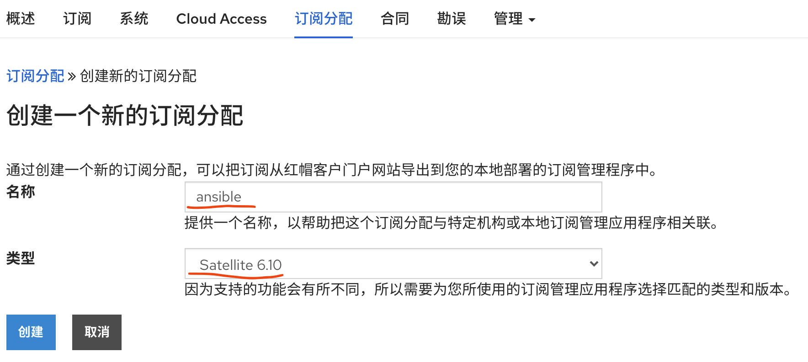
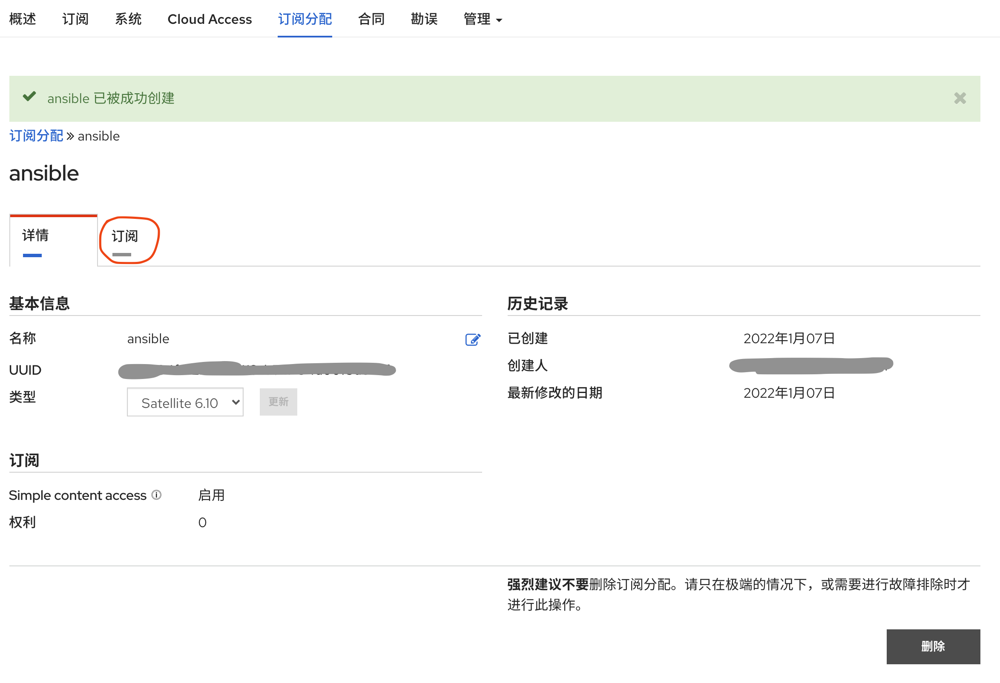
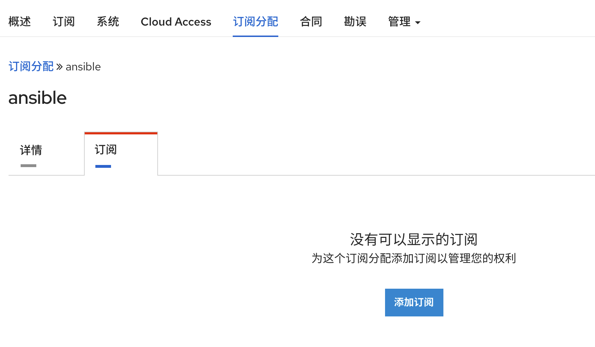
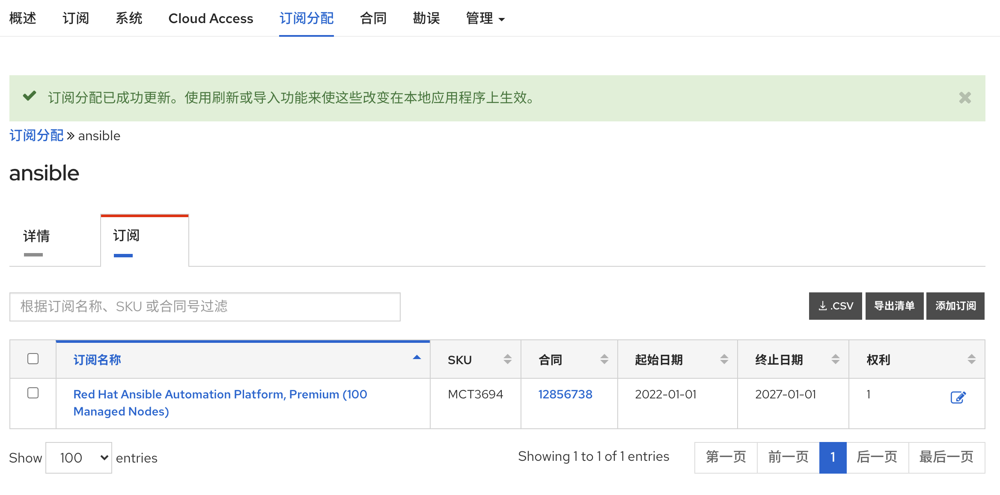
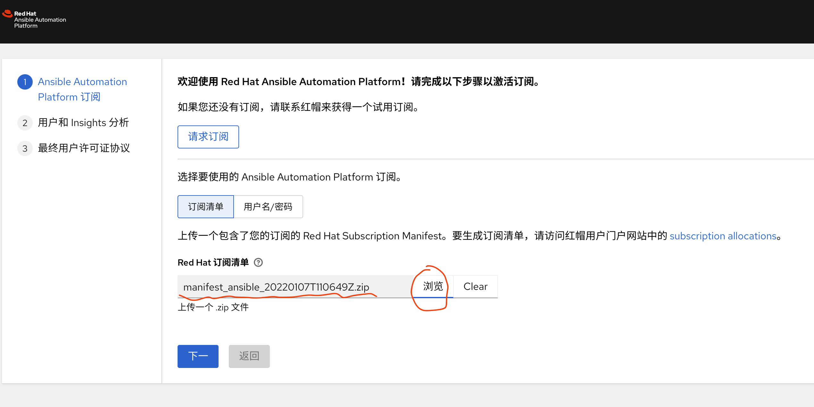
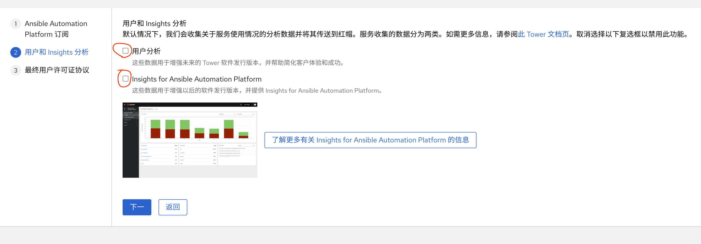

# ansible platform 2.1 install

客户希望安装一套ansible platform，而且是全离线环境，那么我们就按照最简单的单节点模式，来安装一下。整个安装过程，就是用rhel8.5的dvd安装基本操作系统，然后把dvd作为系统的dnf源。接着，导入3个docker镜像，并且本地启动一个docker registry服务。

## 安装操作系统，配置基础服务
```bash
# install rhel 8.5 using dvd iso

# reboot, and set dvd iso as dnf source
blkid | grep sr0
# /dev/sr0: BLOCK_SIZE="2048" UUID="2021-10-13-03-57-25-00" LABEL="RHEL-8-5-0-BaseOS-x86_64" TYPE="iso9660" PTUUID="4d694e6c" PTTYPE="dos"
blkid /dev/sr0 -o value | sed -n 2p
# 2021-10-13-03-57-25-00
mkdir -p /media/cdrom

mount /dev/sr0 /media/cdrom

cat << EOF >> /etc/fstab
UUID=`blkid /dev/sr0 -o value | sed -n 2p`            /media/cdrom                iso9660 ro,user,auto  0 0
EOF

cat << EOF > /etc/yum.repos.d/dvd.repo
[dvd-base]
name=dvd-base
baseurl=file:///media/cdrom/BaseOS
enabled=1
gpgcheck=0

[dvd-app]
name=dvd-app
baseurl=file:///media/cdrom/AppStream
enabled=1
gpgcheck=0
EOF

# we need to setup a docker registry
# and we need copy docker registry image into the disconnected host
podman pull docker.io/library/registry:2
podman save docker.io/library/registry:2 | pigz -c > registry.tgz

podman load -i registry.tgz
# Loaded image(s): docker.io/library/registry:2

# this is testing/demo purpose,
# do not turn off firewalld on production system
systemctl disable --now firewalld

cat << EOF >>  /etc/hosts
127.0.0.1 registry.redhat.ren
EOF

# 配置registry
mkdir -p /etc/crts/ && cd /etc/crts

openssl genrsa -out /etc/crts/redhat.ren.ca.key 4096
openssl req -x509 \
  -new -nodes \
  -key /etc/crts/redhat.ren.ca.key \
  -sha256 \
  -days 36500 \
  -out /etc/crts/redhat.ren.ca.crt \
  -subj /CN="Local Red Hat Ren Signer" \
  -reqexts SAN \
  -extensions SAN \
  -config <(cat /etc/pki/tls/openssl.cnf \
      <(printf '[SAN]\nbasicConstraints=critical, CA:TRUE\nkeyUsage=keyCertSign, cRLSign, digitalSignature'))

openssl genrsa -out /etc/crts/redhat.ren.key 2048

openssl req -new -sha256 \
    -key /etc/crts/redhat.ren.key \
    -subj "/O=Local Red Hat Ren /CN=*.ocp4.redhat.ren" \
    -reqexts SAN \
    -config <(cat /etc/pki/tls/openssl.cnf \
        <(printf "\n[SAN]\nsubjectAltName=DNS:*.ocp4.redhat.ren,DNS:*.apps.ocp4.redhat.ren,DNS:*.redhat.ren\nbasicConstraints=critical, CA:FALSE\nkeyUsage=digitalSignature, keyEncipherment, keyAgreement, dataEncipherment\nextendedKeyUsage=serverAuth")) \
    -out /etc/crts/redhat.ren.csr

openssl x509 \
    -req \
    -sha256 \
    -extfile <(printf "subjectAltName=DNS:*.ocp4.redhat.ren,DNS:*.apps.ocp4.redhat.ren,DNS:*.redhat.ren\nbasicConstraints=critical, CA:FALSE\nkeyUsage=digitalSignature, keyEncipherment, keyAgreement, dataEncipherment\nextendedKeyUsage=serverAuth") \
    -days 36500 \
    -in /etc/crts/redhat.ren.csr \
    -CA /etc/crts/redhat.ren.ca.crt \
    -CAkey /etc/crts/redhat.ren.ca.key \
    -CAcreateserial -out /etc/crts/redhat.ren.crt

openssl x509 -in /etc/crts/redhat.ren.crt -text

/bin/cp -f /etc/crts/redhat.ren.ca.crt /etc/pki/ca-trust/source/anchors/
update-ca-trust extract

cd /data/ocp4
# systemctl stop docker-distribution

/bin/rm -rf /data/registry
mkdir -p /data/registry

podman run --restart always --name local-registry -p 5443:5443 \
  -d --restart=always \
  -v /data/registry/:/var/lib/registry:z \
  -v /etc/crts:/certs:z \
  -e REGISTRY_HTTP_ADDR=0.0.0.0:5443 \
  -e REGISTRY_HTTP_TLS_CERTIFICATE=/certs/redhat.ren.crt \
  -e REGISTRY_HTTP_TLS_KEY=/certs/redhat.ren.key \
  docker.io/library/registry:2
```

## 安装ansible platform

[官方文档](https://access.redhat.com/documentation/en-us/red_hat_ansible_automation_platform/2.1/html/red_hat_ansible_automation_platform_installation_guide/index)写的非常清晰，我们安装官方文档做就好。只不过官方文档里面，对全离线的时候，docker image怎么处理，似乎没讲的很详细，我们补充一下。

```bash
# document is here
# https://access.redhat.com/documentation/en-us/red_hat_ansible_automation_platform/2.1/pdf/red_hat_ansible_automation_platform_installation_guide/red_hat_ansible_automation_platform-2.1-red_hat_ansible_automation_platform_installation_guide-en-us.pdf

# goto https://access.redhat.com/downloads/content/480
# to download Ansible Automation Platform 2.1.0 Setup Bundle
mkdir -p /data
cd /data

tar zvxf ansible-automation-platform-setup-bundle-2.1.0-1.tar.gz
cd /data/ansible-automation-platform-setup-bundle-2.1.0-1

podman load -i images/ee-29-rhel8.tgz
# Loaded image(s): registry.redhat.io/ansible-automation-platform-21/ee-29-rhel8:latest
podman load -i images/ee-minimal-rhel8.tgz
# Loaded image(s): registry.redhat.io/ansible-automation-platform-21/ee-minimal-rhel8:latest
podman load -i images/ee-supported-rhel8.tgz
# Loaded image(s): registry.redhat.io/ansible-automation-platform-21/ee-supported-rhel8:latest

podman tag registry.redhat.io/ansible-automation-platform-21/ee-29-rhel8:latest registry.redhat.ren:5443/ansible-automation-platform-21/ee-29-rhel8:latest
podman push registry.redhat.ren:5443/ansible-automation-platform-21/ee-29-rhel8:latest

podman tag registry.redhat.io/ansible-automation-platform-21/ee-minimal-rhel8:latest registry.redhat.ren:5443/ansible-automation-platform-21/ee-minimal-rhel8:latest
podman push registry.redhat.ren:5443/ansible-automation-platform-21/ee-minimal-rhel8:latest

podman tag registry.redhat.io/ansible-automation-platform-21/ee-supported-rhel8:latest registry.redhat.ren:5443/ansible-automation-platform-21/ee-supported-rhel8:latest
podman push registry.redhat.ren:5443/ansible-automation-platform-21/ee-supported-rhel8:latest

/bin/cp -f inventory inventory.bak

cat << EOF > inventory
[automationcontroller]
127.0.0.1 ansible_connection=local

[database]

[all:vars]
admin_password='password'
pg_host=''
pg_port=''
pg_database='awx'
pg_username='awx'
pg_password='password'
registry_url='registry.redhat.ren:5443'

EOF

./setup.sh -e gpgcheck=0

# login using admin / password
# open browser to https://172.16.218.2/
```
安装到此结束，打开浏览器，访问 https://<server ip address or dns name>

并使用用户名 admin 密码 password 登录就可以了。

## 激活订阅

初始安装，第一次登录，会要求用订阅激活。而我们是离线安装模式，所以这里有一个在红帽官网导出离线证书的过程。

首先我们登录到ansible platform里面后，看到激活界面，点击链接，访问红帽官网。


访问到红帽官网以后，点击新的订阅分配


给新的订阅取个容易记忆的名字。订阅分配其实是一个订阅证书分发的机制，我们创建了这个订阅分配以后，就可以往里面添加购买的产品，比如买了ansible, rhel等，然后就会统一的下一个zip文件，都给你打包好，很方便。


创建好订阅分配后，点击订阅。


然后点击添加订阅


用关键字搜索产品，如果我们购买的产品少，那么就不用搜索，直接在列表中选择就可以，在要购买的产品后面，调整权利，比如我们要激活一个系统，就设置权利为1就可以了。


点击提交以后，我们就看到订阅添加成功了


我们点击导出清单，就可以到处订阅证书了


你会得到一个类似这样文件名的文件： manifest_ansible_20220107T110649Z.zip 。把这个文件，导入到ansible platform中。



在用户数据反馈中，取消点击，因为我们是离线的，访问不到红帽的公网系统。


提交后，我们就进入ansible platform的首页界面啦。
