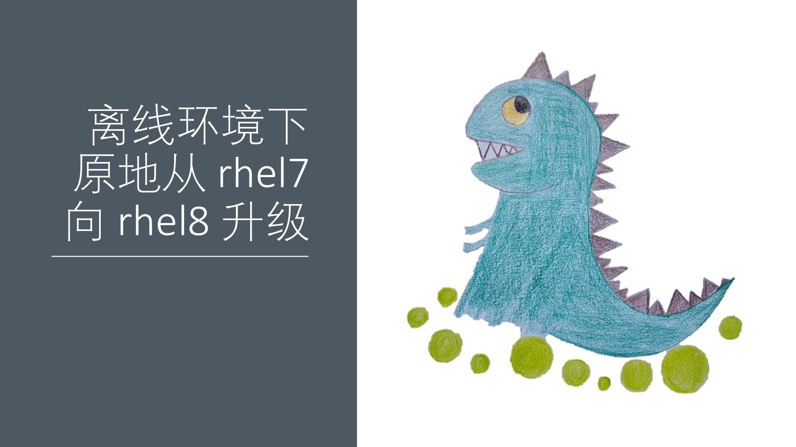
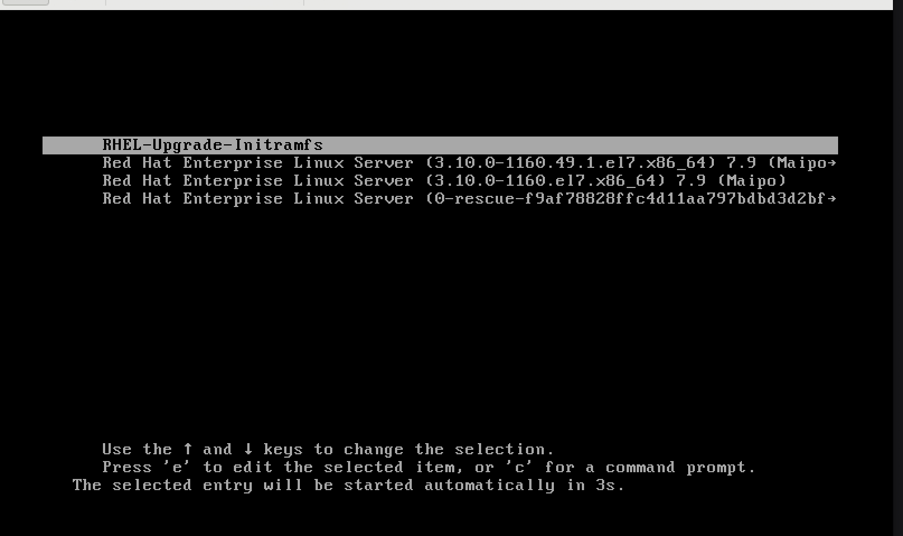
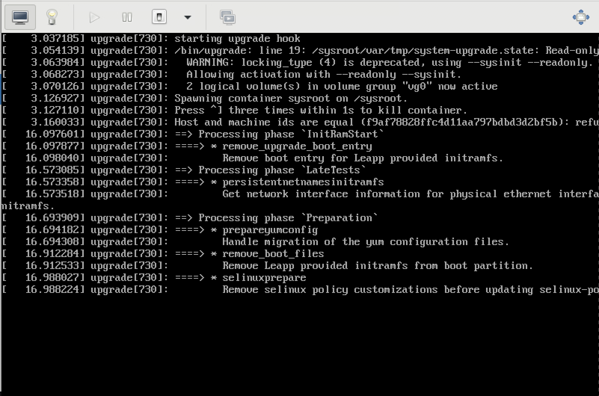
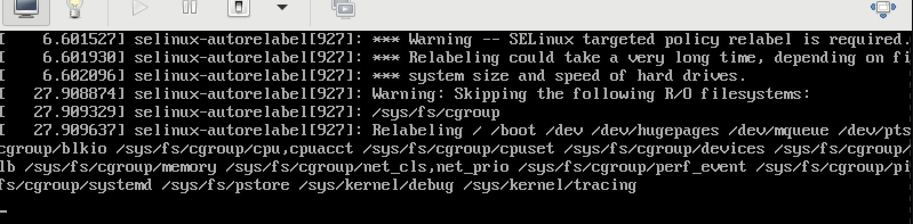
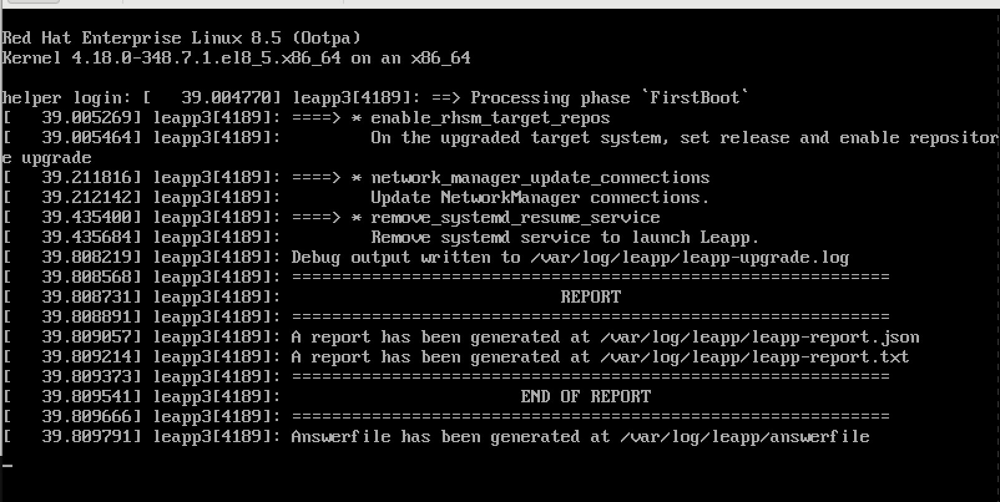
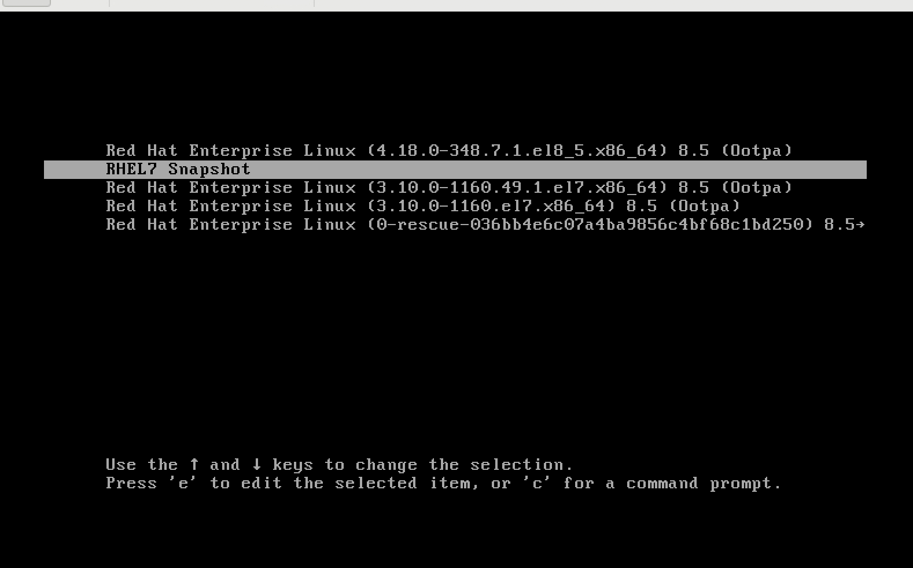
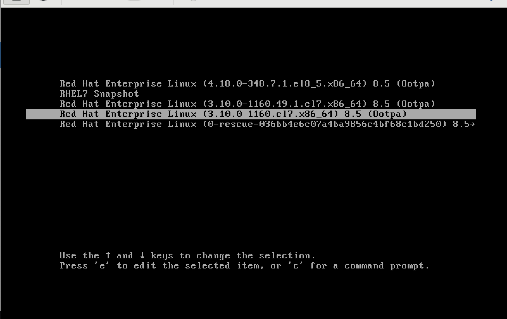
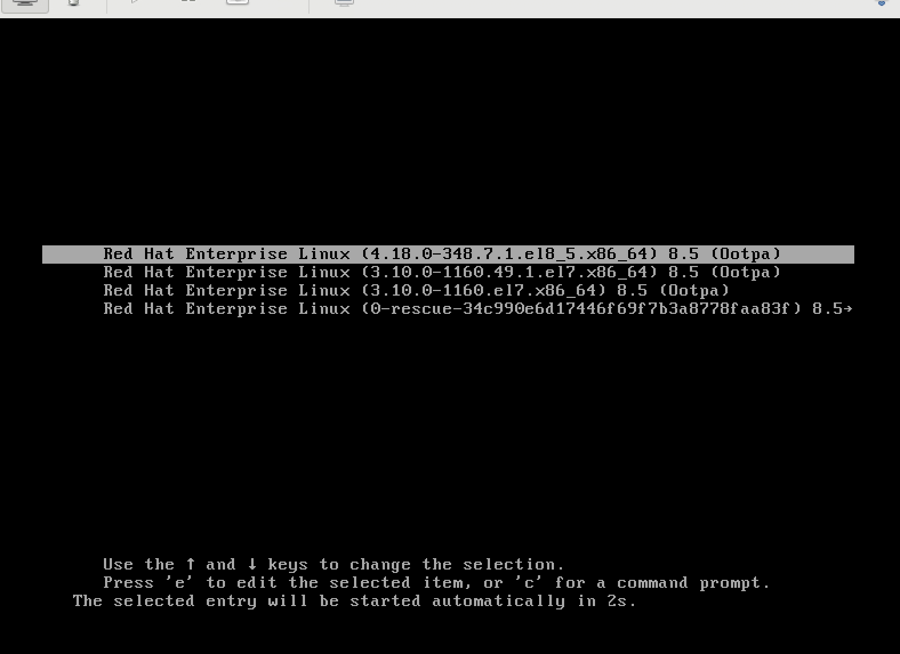

# 离线环境下 原地从 rhel7 向 rhel8 升级

随着rhel7的生命周期结束，越来越近，同时rhel8的很多新特性很有功能和性能上的优势，很多客户都在考虑从rhel7向rhel8升级。一般来说，系统升级是高风险操作，非常推荐客户找备份主机，新装rhel8，然后把应用迁移过去，然后把rhel7这台主机操作系统删除重装rhel8，之后再把应用迁移回来。

但是很多客户的生产主机是非常高配的，并没有足够的备份主机，做上述操作。这样就要考虑在原地从rhel7向rhel8升级。由于原地升级风险很大，强烈建议客户联系专业团队，如红帽GPS，做全面的原地升级计划。

一般来说，原地升级要考虑如下问题：
1. 系统存储情况，分区配置
2. 是否有第三方内核驱动
3. 操作系统做了什么定制化
4. 启动了什么应用

红帽官方提供了leapp，以及boom来支持原地升级。但是这个并不能完全消除原地升级的风险。本文就在一台宿主机上，按照一个rhel7 vm，然后模拟离线环境，来升级到rhel8。目的是让准备实施原地升级的客户，能进行原地升级演练，更好的模拟目标系统的状态，并尽早的发现原地升级过程中的问题和风险。

视频讲解:

[<kbd></kbd>](https://www.bilibili.com/video/BV1FS4y1f7hh/)

- [bilibili](https://www.bilibili.com/video/BV1FS4y1f7hh/)
- [youtube](https://youtu.be/Aum92syxjbk)


参考材料：
- [红帽官方文档 UPGRADING FROM RHEL 7 TO RHEL 8](https://access.redhat.com/documentation/en-us/red_hat_enterprise_linux/8/html/upgrading_from_rhel_7_to_rhel_8/index)
- [红帽官方博客 Upgrading from RHEL 7 to RHEL 8 with Leapp and BOOM](https://www.redhat.com/en/blog/upgrading-rhel-7-rhel-8-leapp-and-boom)
- [Leapp utility metadata in-place upgrades of RHEL for disconnected upgrades](https://access.redhat.com/articles/3664871)
- [Customizing your Red Hat Enterprise Linux in-place upgrade](https://access.redhat.com/articles/4977891#repos-config)
- [How to do an offline upgrade to RHEL 8 with Leapp?](https://access.redhat.com/solutions/5492401)
- [Boom! Booting RHEL from LVM snapshots](https://www.redhat.com/en/blog/boom-booting-rhel-lvm-snapshots)
- [Why do I get I/O errors when my LVM snapshot reaches 100% usage?](https://access.redhat.com/solutions/56141)

# leapp

leapp是红帽官方的升级工具，在rhel8官方文档中，有详细的描述。本文聚焦在全离线环境下，如何使用leapp的方式来进行升级。注意，如果只使用leapp升级系统，那升级过程是单向的，也就是说，一旦开始升级，就不能再恢复到原来的状态，也不能降级。如何恢复或者降级，在后面boom的章节中描述。

## 订阅离线证书

为了在离线环境进行升级，我们需要先准备 rhel7 & rhel8 repo，那么这就需要订阅离线证书。这里我们就看看怎么下载，并解压缩出来。

我们访问[红帽在线订阅系统](https://access.redhat.com/management/systems)，选择一个系统，给这系统添加正确的订阅，然后点击下载，我们就能得到一个zip文件。


然后我们上次这个zip文件到服务器上，之后解压缩之。

```bash
# on host, we use rocky 8.5
# prepare redhat subscription cert
mkdir -p /data/rhel8/entitle
cd /data/rhel8/entitle

# goto https://access.redhat.com/management/subscriptions
# search employee sku, find a system, go into, and download from subscription
# or goto: https://access.redhat.com/management/systems/4d1e4cc0-2c99-4431-99ce-2f589a24ea11/subscriptions
dnf install -y unzip 
unzip *
unzip consumer_export.zip
find . -name *.pem -exec cp {} ./ \;

mkdir -p /data/dockerfile/
cd /data/dockerfile/

ls /data/rhel8/entitle/*.pem | sed -n '2p' | xargs -I DEMO /bin/cp -f DEMO ./ 
```

## 用容器的方式构建离线repo

我们采用容器的方式构建离线repo，这样就可以在离线环境中进行升级了。至于为什么用容器的方式，那是因为我们需要同时为rhel7, rhel8两个系统构建离线repo，一般的方法，这就需要2个系统，而我们只需要一个系统，那么我们就用容器的方式，来模拟两个操作系统环境，进行构建。

这里面的一个问题是，在容器环境中，红帽的订阅机制是不生效的，我们需要一些技巧来解决这个问题。

```bash
# prepare rhel8 repo
mkdir -p /data/rhel/dnf

podman run -it --rm -v /data/rhel/dnf:/data/dnf:z \
    --mount type=bind,source=$(ls /data/rhel8/entitle/*.pem | sed -n '2p'),target=/etc/pki/entitlement/entitlement.pem,relabel=shared  \
    --mount type=bind,source=$(ls /data/rhel8/entitle/*.pem | sed -n '2p'),target=/etc/pki/entitlement/entitlement-key.pem,relabel=shared \
    registry.access.redhat.com/ubi8 bash

# in podman shell
dnf -y update || true && \
    sed -i 's|enabled=1|enabled=0|g' /etc/yum/pluginconf.d/subscription-manager.conf && \
    sed -i 's|%(ca_cert_dir)sredhat-uep.pem|/etc/rhsm/ca/redhat-uep.pem|g' /etc/yum.repos.d/redhat.repo && \
    sed -i '/ansible-2.9-for-rhel-8-x86_64-rpms/,/enabled = 0/s/enabled = 0/enabled = 1/' /etc/yum.repos.d/redhat.repo && \
    sed -i 's|cdn.redhat.com|china.cdn.redhat.com|g' /etc/yum.repos.d/redhat.repo && \
    dnf -y update && \
    cd /data/dnf && \
    dnf reposync -m --download-metadata --delete -n

# prepare rhel7 repo
mkdir -p /data/rhel/yum

podman run -it --rm -v /data/rhel/yum:/data/yum:z \
    --mount type=bind,source=$(ls /data/rhel8/entitle/*.pem | sed -n '2p'),target=/etc/pki/entitlement/entitlement.pem,relabel=shared  \
    --mount type=bind,source=$(ls /data/rhel8/entitle/*.pem | sed -n '2p'),target=/etc/pki/entitlement/entitlement-key.pem,relabel=shared \
    registry.access.redhat.com/ubi7 bash

# in podman shell
# https://unix.stackexchange.com/questions/677719/search-and-replace-lines-after-a-regex-match-using-sed
# https://stackoverflow.com/questions/148451/how-to-use-sed-to-replace-only-the-first-occurrence-in-a-file
sed -i 's|%(ca_cert_dir)sredhat-uep.pem|/etc/rhsm/ca/redhat-uep.pem|g' /etc/rhsm/rhsm.conf && \
  yum -y update || true && \
  sed -i 's|enabled=1|enabled=0|g' /etc/yum/pluginconf.d/subscription-manager.conf && \
  sed -i 's|%(ca_cert_dir)sredhat-uep.pem|/etc/rhsm/ca/redhat-uep.pem|g' /etc/yum.repos.d/redhat.repo && \
  sed -i 's|cdn.redhat.com|china.cdn.redhat.com|g' /etc/yum.repos.d/redhat.repo && \
  sed -i '/rhel-7-server-extras-rpms/,/enabled = 0/s/enabled = 0/enabled = 1/' /etc/yum.repos.d/redhat.repo && \
  yum -y update && \
  cd /data/yum && \
  yum install -y yum-utils createrepo && \
  reposync -n -d -l -m && \
  createrepo ./
```
## 使用ftp来提供repo服务

我们已经准备好了离线repo，那么我们启动一个ftp服务，来提供离线repo的服务。这里面会有一些权限, selinux的问题和解决技巧。

```bash
# setup ftp service for repo
dnf -y install vsftpd
sed -i 's/anonymous_enable=NO/anonymous_enable=YES/g' /etc/vsftpd/vsftpd.conf
systemctl enable --now vsftpd

systemctl disable --now firewalld

cd /data/
chcon -R -t public_content_t  rhel
chown -R ftp:ftp rhel

cd /var/ftp 
mkdir -p /var/ftp/rhel
# https://stackoverflow.com/questions/34736743/ftp-550-failed-to-change-directory
mount --bind /data/rhel /var/ftp/rhel
cat << EOF >> /etc/fstab
/data/rhel /var/ftp/rhel none bind 0 0
EOF

dnf install -y lftp
# try the ftp server
lftp 127.0.0.1
# ls rhel/yum/rhel-7-server-rpms/Packages/a/
``` 

## 安装 rhel7 vm

至此，我们的准备工作都完成了，开始安装rhel7的虚拟机。

```bash
# setup bridge for vm
mkdir -p /data/kvm
cat << 'EOF' > /data/kvm/bridge.sh
#!/usr/bin/env bash

PUB_CONN='eno2'
PUB_IP='192.168.7.11/24'
PUB_GW='192.168.7.11'
PUB_DNS='192.168.7.11'

nmcli con down "$PUB_CONN"
nmcli con delete "$PUB_CONN"
nmcli con down baremetal
nmcli con delete baremetal
# RHEL 8.1 appends the word "System" in front of the connection,delete in case it exists
nmcli con down "System $PUB_CONN"
nmcli con delete "System $PUB_CONN"
nmcli connection add ifname baremetal type bridge con-name baremetal ipv4.method 'manual' \
    ipv4.address "$PUB_IP" \
    ipv4.gateway "$PUB_GW" \
    ipv4.dns "$PUB_DNS"
    
nmcli con add type bridge-slave ifname "$PUB_CONN" master baremetal
nmcli con down "$PUB_CONN";pkill dhclient;dhclient baremetal
nmcli con up baremetal
EOF
bash /data/kvm/bridge.sh

# install rhel7 vm
cd /data/kvm

osinfo-query os | grep rhel7
#  rhel7-unknown        | Red Hat Enterprise Linux 7 Unknown                 | 7-unknown | http://redhat.com/rhel/7-unknown
#  rhel7.0              | Red Hat Enterprise Linux 7.0                       | 7.0      | http://redhat.com/rhel/7.0
#  rhel7.1              | Red Hat Enterprise Linux 7.1                       | 7.1      | http://redhat.com/rhel/7.1
#  rhel7.2              | Red Hat Enterprise Linux 7.2                       | 7.2      | http://redhat.com/rhel/7.2
#  rhel7.3              | Red Hat Enterprise Linux 7.3                       | 7.3      | http://redhat.com/rhel/7.3
#  rhel7.4              | Red Hat Enterprise Linux 7.4                       | 7.4      | http://redhat.com/rhel/7.4
#  rhel7.5              | Red Hat Enterprise Linux 7.5                       | 7.5      | http://redhat.com/rhel/7.5
#  rhel7.6              | Red Hat Enterprise Linux 7.6                       | 7.6      | http://redhat.com/rhel/7.6
#  rhel7.7              | Red Hat Enterprise Linux 7.7                       | 7.7      | http://redhat.com/rhel/7.7
#  rhel7.8              | Red Hat Enterprise Linux 7.8                       | 7.8      | http://redhat.com/rhel/7.8
#  rhel7.9              | Red Hat Enterprise Linux 7.9                       | 7.9      | http://redhat.com/rhel/7.9

# download rhel7 iso
wget -O rhel7.iso 'https://access.cdn.redhat.com/content/origin/files/sha256/19/19d653ce2f04f202e79773a0cbeda82070e7527557e814ebbce658773fbe8191/rhel-server-7.9-x86_64-dvd.iso?user=a768b217cf6ae8041b67586bb4dd5c77&_auth_=1641893589_4f48191c0168e22e5cedac1a1ef79ef8'

pvcreate /dev/sdb
vgcreate vgdata /dev/sdb

create_lv() {
    var_vg=$1
    var_lv=$2
    lvremove -f $var_vg/$var_lv
    lvcreate -y -L 120G -n $var_lv $var_vg
    wipefs --all --force /dev/$var_vg/$var_lv
}

create_lv vgdata lvrhel7

export http_proxy="http://192.168.195.54:5085"
export https_proxy=${http_proxy}

wget https://raw.githubusercontent.com/wangzheng422/docker_env/dev/redhat/notes/2022/files/helper-ks.cfg

unset http_proxy
unset https_proxy

# https://octowhale.gitbooks.io/kickstart/content/chapter2-kickstart-options-logvol.html
# https://octowhale.gitbooks.io/kickstart/content/chapter2-kickstart-options-network.html
# https://access.redhat.com/documentation/en-us/red_hat_enterprise_linux/8/html/performing_an_advanced_rhel_installation/kickstart-commands-and-options-reference_installing-rhel-as-an-experienced-user#network_kickstart-commands-for-network-configuration
sed -i '0,/^network.*/s/^network.*/network  --bootproto=static --device=eth0 --gateway=192.168.7.1 --ip=192.168.7.12  --netmask=255.255.255.0 --nameserver=192.168.7.1  --noipv6 --activate/' helper-ks.cfg
sed -i 's/logvol \/  --fstype="xfs" .*/logvol \/  --fstype="xfs" --name=root --vgname=vg0 --percent=50/' helper-ks.cfg

# 配置kvm环境
dnf -y groupinstall "Server with GUI"

dnf -y install qemu-kvm libvirt libguestfs-tools virt-install virt-viewer virt-manager tigervnc-server

systemctl disable --now firewalld
systemctl enable --now libvirtd

# 准备vnc环境
vncpasswd

cat << EOF > ~/.vnc/config
session=gnome
securitytypes=vncauth,tlsvnc
# desktop=sandbox
geometry=1280x800
alwaysshared
EOF

cat << EOF >> /etc/tigervnc/vncserver.users
:1=root
EOF

# systemctl disable vncserver@:1
systemctl start vncserver@:1
# 如果你想停掉vnc server，这么做
systemctl stop vncserver@:1

# start to install the rhel7 vm
virt-install --name="rhel7" --vcpus=8 --ram=8192 \
--cpu=host-model \
--disk path=/dev/vgdata/lvrhel7,device=disk,bus=virtio,format=raw \
--os-variant rhel7.9 --network bridge=baremetal,model=virtio \
--graphics vnc,port=59000 \
--boot menu=on --location /data/kvm/rhel7.iso \
--initrd-inject helper-ks.cfg --extra-args "inst.ks=file:/helper-ks.cfg" 

cat << EOF > /root/.ssh/config
StrictHostKeyChecking no
UserKnownHostsFile=/dev/null
EOF
```
## 配置 rhel 7 vm

rhel7虚拟机装好以后，我们要对他做一些简单的配置，把他的更新源指向我们的离线repo

```bash
# setup rhel7 vm
ssh root@192.168.7.12

# disable dns lookup in sshd when ssh login
sed -i 's/#UseDNS yes/UseDNS no/g' /etc/ssh/sshd_config
systemctl restart sshd

# link to local repo
cat << 'EOF' > /etc/yum.repos.d/remote.repo
[remote-rhel7]
name=remote-rhel7
baseurl=ftp://192.168.7.11/rhel/yum
enabled=1
gpgcheck=0
EOF

yum update -y
reboot
```
## 开始升级

我们使用leapp来升级，leapp会检查系统配置，并给出系统上有什么问题，导致不能原地升级。我们要根据leapp的提升，进行系统配置，配置完成后，我们可以再试试，如果检查通过，就可以原地升级了。

本文的系统环境非常简单，还遇到了2个问题，可以想象到，如果是生产环境，会遇到更多的问题。

```bash
# perform upgrade
# 先安装升级需要的软件
yum install -y leapp leapp-repository leapp-repository-deps lvm2-python-boom

# 配置升级过程中的安装源
cat << 'EOF' > /etc/leapp/files/leapp_upgrade_repositories.repo 
[BaseOS]
name=BaseOS
baseurl=ftp://192.168.7.11/rhel/dnf/rhel-8-for-x86_64-baseos-rpms
enabled=1
gpgcheck=0

[AppStream]
name=AppStream
baseurl=ftp://192.168.7.11/rhel/dnf/rhel-8-for-x86_64-appstream-rpms
enabled=1
gpgcheck=0

EOF

# 因为我们是离线环境，需要有一些升级用的参数文件，需要手动的下载和导入
# https://access.redhat.com/articles/3664871
# download the leapp-data15.tar.gz to server
tar -xzf leapp-data15.tar.gz -C /etc/leapp/files 

# 做第一次的升级前检测
# 从结果看，发现了2个问题，导致不能升级
leapp preupgrade --no-rhsm --enablerepo BaseOS --enablerepo AppStream
# .........
# ====> * verify_check_results
#         Check all generated results messages and notify user about them.

# ============================================================
#                      UPGRADE INHIBITED
# ============================================================

# Upgrade has been inhibited due to the following problems:
#     1. Inhibitor: Possible problems with remote login using root account
#     2. Inhibitor: Missing required answers in the answer file
# Consult the pre-upgrade report for details and possible remediation.

# ============================================================
#                      UPGRADE INHIBITED
# ============================================================


# Debug output written to /var/log/leapp/leapp-preupgrade.log

# ============================================================
#                            REPORT
# ============================================================

# A report has been generated at /var/log/leapp/leapp-report.json
# A report has been generated at /var/log/leapp/leapp-report.txt

# ============================================================
#                        END OF REPORT
# ============================================================

# Answerfile has been generated at /var/log/leapp/answerfile

# 我们看看这两个问题是什么
# 还好，红帽工具给出了解决问题的方法和命令
cat /var/log/leapp/leapp-report.txt
# Risk Factor: high (inhibitor)
# Title: Possible problems with remote login using root account
# Summary: OpenSSH configuration file does not explicitly state the option PermitRootLogin in sshd_config file, which will default in RHEL8 to "prohibit-password".
# Remediation: [hint] If you depend on remote root logins using passwords, consider setting up a different user for remote administration or adding "PermitRootLogin yes" to sshd_config.
# Key: 3d21e8cc9e1c09dc60429de7716165787e99515f
# ----------------------------------------
# Risk Factor: high (inhibitor)
# Title: Missing required answers in the answer file
# Summary: One or more sections in answerfile are missing user choices: remove_pam_pkcs11_module_check.confirm
# For more information consult https://leapp.readthedocs.io/en/latest/dialogs.html
# Remediation: [hint] Please register user choices with leapp answer cli command or by manually editing the answerfile.
# [command] leapp answer --section remove_pam_pkcs11_module_check.confirm=True
# Key: d35f6c6b1b1fa6924ef442e3670d90fa92f0d54b
# ----------------------------------------
# ............

# 我们应用红帽的解决方案
sed -i 's/#PermitRootLogin yes/PermitRootLogin yes/g' /etc/ssh/sshd_config

leapp answer --section remove_pam_pkcs11_module_check.confirm=True

# 开始升级
leapp upgrade --no-rhsm --enablerepo BaseOS --enablerepo AppStream
# ..............
# Transaction Summary
# =========================================================================================================================
# Install    213 Packages
# Upgrade    285 Packages
# Remove      66 Packages
# Downgrade    7 Packages

# Total size: 589 M
# DNF will only download packages, install gpg keys, and check the transaction.
# Downloading Packages:
# Running transaction check
# Transaction check succeeded.
# Running transaction test
# Transaction test succeeded.
# Complete!
# ====> * add_upgrade_boot_entry
#         Add new boot entry for Leapp provided initramfs.
# A reboot is required to continue. Please reboot your system.


# Debug output written to /var/log/leapp/leapp-upgrade.log

# ============================================================
#                            REPORT
# ============================================================

# A report has been generated at /var/log/leapp/leapp-report.json
# A report has been generated at /var/log/leapp/leapp-report.txt

# ============================================================
#                        END OF REPORT
# ============================================================

# Answerfile has been generated at /var/log/leapp/answerfile

reboot

```
第一次重启，我们能看到多了一个特殊的启动项，不用有任何操作，让他自动继续。



我们能看到启动过程是不一样的，在继续做系统升级的操作。



然后，系统会自动重启，我们能看到，重启以后，重新进行selinux relabel



之后，会再次自动重启，就完成升级了，可以看到简单的完成状态信息



## 升级之后的配置

至此，我们就完成了rhel7->rhel8的升级，我们要做一点配置，也就是把 rhel8 的更新源给配置进去。

```bash
# ssh into the new upgraded rhel8
cat << 'EOF' > /etc/yum.repos.d/remote.repo
[BaseOS]
name=BaseOS
baseurl=ftp://192.168.7.11/rhel/dnf/rhel-8-for-x86_64-baseos-rpms
enabled=1
gpgcheck=0

[AppStream]
name=AppStream
baseurl=ftp://192.168.7.11/rhel/dnf/rhel-8-for-x86_64-appstream-rpms
enabled=1
gpgcheck=0

EOF

dnf makecache

dnf upgrade -y
# ......
# Dependencies resolved.
# Nothing to do.
# Complete!

```

# BOOM

之前说的leapp方法，有一个问题，就是如果系统升级失败，会让系统进入不可用状态。遗憾的是，对于定制化很多的生产系统，升级失败并不是小概率事件。为了避免系统升级失败，导致系统完全不可用的情况发生，红帽提供了boom工具，来帮助在升级之前，做一个系统快照，如果升级失败，那么就可以从这个系统快照中恢复系统。

boom工具并不是为了系统原地升级新打造的，boom是一个老工具，一个常用的使用场景是，先给系统做一个快照，然后对系统进行配置，如果发现系统配置正确，那么删除这个快照。如果发现系统配置不正确，那么就回复这个快照。

可以看出来，系统原地升级，只不过是boom的一个使用场景。

参考材料：
1. [Upgrading from RHEL 7 to RHEL 8 with Leapp and BOOM](https://www.redhat.com/en/blog/upgrading-rhel-7-rhel-8-leapp-and-boom)
1. [Boom! Booting RHEL from LVM snapshots](https://www.redhat.com/en/blog/boom-booting-rhel-lvm-snapshots)

## 创建系统快照

我们坚持系统当前的状态，并创建系统快照

```bash
# after rhel7 vm created
vgs
#   VG  #PV #LV #SN Attr   VSize    VFree
#   vg0   1   2   0 wz--n- <119.00g 59.25g

lvs
#   LV   VG  Attr       LSize   Pool Origin Data%  Meta%  Move Log Cpy%Sync Convert
#   root vg0 -wi-ao---- <59.25g
#   swap vg0 -wi-ao---- 512.00m

lvcreate -s -L 10G -n rollback vg0/root
#   Logical volume "rollback" created.

lvs
#   LV       VG  Attr       LSize   Pool Origin Data%  Meta%  Move Log Cpy%Sync Convert
#   rollback vg0 swi-a-s---  10.00g      root   0.01
#   root     vg0 owi-aos--- <59.25g
#   swap     vg0 -wi-ao---- 512.00m

yum install -y leapp leapp-repository leapp-repository-deps lvm2-python-boom

boom create --title "RHEL7 Snapshot" --rootlv vg0/rollback
# WARNING - Boom configuration not found in grub.cfg
# WARNING - Run 'grub2-mkconfig > /boot/grub2/grub.cfg' to enable
# Created entry with boot_id 982beff:
#   title RHEL7 Snapshot
#   machine-id 036bb4e6c07a4ba9856c4bf68c1bd250
#   version 3.10.0-1160.49.1.el7.x86_64
#   linux /vmlinuz-3.10.0-1160.49.1.el7.x86_64
#   initrd /initramfs-3.10.0-1160.49.1.el7.x86_64.img
#   options root=/dev/vg0/rollback ro rd.lvm.lv=vg0/rollback
#   grub_users $grub_users
#   grub_arg --unrestricted
#   grub_class kernel

grub2-mkconfig > /boot/grub2/grub.cfg
# Generating grub configuration file ...
# Found linux image: /boot/vmlinuz-3.10.0-1160.49.1.el7.x86_64
# Found initrd image: /boot/initramfs-3.10.0-1160.49.1.el7.x86_64.img
# Found linux image: /boot/vmlinuz-3.10.0-1160.el7.x86_64
# Found initrd image: /boot/initramfs-3.10.0-1160.el7.x86_64.img
# Found linux image: /boot/vmlinuz-0-rescue-036bb4e6c07a4ba9856c4bf68c1bd250
# Found initrd image: /boot/initramfs-0-rescue-036bb4e6c07a4ba9856c4bf68c1bd250.img
# done

boom list
# BootID  Version                     Name                            RootDevice
# 982beff 3.10.0-1160.49.1.el7.x86_64 Red Hat Enterprise Linux Server /dev/vg0/rollback

lvs
#   LV       VG  Attr       LSize   Pool Origin Data%  Meta%  Move Log Cpy%Sync Convert
#   rollback vg0 swi-a-s---  10.00g      root   0.40
#   root     vg0 owi-aos--- <59.25g
#   swap     vg0 -wi-ao---- 512.00m

reboot
```

## 升级系统

我们接下来，安装之前leapp的步骤，进行原地升级操作，重启以后，我们看看系统状态，可以看到快照卷已经有接近50%的使用量。这就提醒我们，需要给快照卷足够大的空间，否则快照卷就会失效，丧失了系统恢复的功能。

启动过程中，我们选择默认的kernel


```bash
# perform upgrade to rhel8

# after upgrade
lvs
#   LV       VG  Attr       LSize   Pool Origin Data%  Meta%  Move Log Cpy%Sync Convert
#   rollback vg0 swi-a-s---  10.00g      root   44.57
#   root     vg0 owi-aos--- <59.25g
#   swap     vg0 -wi-ao---- 512.00m
```

## rollback to rhel7

接下来我们尝试恢复到rhel7。我们重启系统，选择snapshot启动系统。



然后做卷的恢复操作。

```bash
# boot using the snapshot
lvconvert --merge /dev/vg0/rollback
#   Delaying merge since snapshot is open.
#   Merging of snapshot vg0/rollback will occur on next activation of vg0/root.

reboot
```
重启后，选择老的rhel7的kernel启动系统。



重装kernel，让rhel7最新的kernel作为默认的kernel。

```bash
lvs
#   LV   VG  Attr       LSize   Pool Origin Data%  Meta%  Move Log Cpy%Sync Convert
#   root vg0 Owi-aos--- <59.25g             11.06
#   swap vg0 -wi-ao---- 512.00m

yum list kernel*
# Installed Packages
# kernel.x86_64                                                3.10.0-1160.el7                                       @anaconda/7.9
# kernel.x86_64                                                3.10.0-1160.49.1.el7                                  @remote-rhel7
# kernel-tools.x86_64                                          3.10.0-1160.49.1.el7                                  @remote-rhel7
# kernel-tools-libs.x86_64                                     3.10.0-1160.49.1.el7                                  @remote-rhel7
# Available Packages
# kernel-abi-whitelists.noarch                                 3.10.0-1160.49.1.el7                                  remote-rhel7
# kernel-debug.x86_64                                          3.10.0-1160.49.1.el7                                  remote-rhel7
# kernel-debug-devel.x86_64                                    3.10.0-1160.49.1.el7                                  remote-rhel7
# kernel-devel.x86_64                                          3.10.0-1160.49.1.el7                                  remote-rhel7
# kernel-doc.noarch                                            3.10.0-1160.49.1.el7                                  remote-rhel7
# kernel-headers.x86_64                                        3.10.0-1160.49.1.el7                                  remote-rhel7

# https://access.redhat.com/solutions/4094081
yum remove -y kernel-3.10.0-1160.49.1.el7.x86_64 ; yum install -y kernel-3.10.0-1160.49.1.el7.x86_64
# grubby fatal error: unable to find a suitable template
# grubby: doing this would leave no kernel entries. Not writing out new config.
#   Verifying  : kernel-3.10.0-1160.49.1.el7.x86_64                                                                           1/1

# Installed:
#   kernel.x86_64 0:3.10.0-1160.49.1.el7

grub2-mkconfig -o /boot/grub2/grub.cfg

yum remove -y kernel-3.10.0-1160.49.1.el7.x86_64 ; yum install -y kernel-3.10.0-1160.49.1.el7.x86_64

reboot
```
重启以后，我们能看到rhel7最新的kernel已经作为系统默认启动的kernel选项。


## accept the upgraded rhel8

最后，我们看看如果原地升级成功，我们如何接受这个升级。过程也简单，就是boom中删除snapshot的启动项，并且把snapshot卷删掉。

```bash
# boot into the rhel8
uname -a
# Linux helper 4.18.0-348.7.1.el8_5.x86_64 #1 SMP Wed Dec 8 21:51:17 EST 2021 x86_64 x86_64 x86_64 GNU/Linux

lvs
#   LV       VG  Attr       LSize   Pool Origin Data%  Meta%  Move Log Cpy%Sync Convert
#   rollback vg0 swi-a-s---  10.00g      root   43.99
#   root     vg0 owi-aos--- <59.25g
#   swap     vg0 -wi-ao---- 512.00m

boom list
# WARNING - Options for BootEntry(boot_id=d291021) do not match OsProfile: marking read-only
# BootID  Version                     Name                            RootDevice
# 6d82dac 3.10.0-1160.49.1.el7.x86_64 Red Hat Enterprise Linux Server /dev/vg0/rollback
# e1f4484 3.10.0-1160.49.1.el7.x86_64 Red Hat Enterprise Linux Server /dev/mapper/vg0-root
# f7da13a 3.10.0-1160.el7.x86_64      Red Hat Enterprise Linux Server /dev/mapper/vg0-root
# d291021 4.18.0-348.7.1.el8_5.x86_64 Red Hat Enterprise Linux        /dev/mapper/vg0-root

boom entry delete 6d82dac
# WARNING - Options for BootEntry(boot_id=d291021) do not match OsProfile: marking read-only
# Deleted 1 entry

boom list
# WARNING - Options for BootEntry(boot_id=d291021) do not match OsProfile: marking read-only
# BootID  Version                     Name                            RootDevice
# e1f4484 3.10.0-1160.49.1.el7.x86_64 Red Hat Enterprise Linux Server /dev/mapper/vg0-root
# f7da13a 3.10.0-1160.el7.x86_64      Red Hat Enterprise Linux Server /dev/mapper/vg0-root
# d291021 4.18.0-348.7.1.el8_5.x86_64 Red Hat Enterprise Linux        /dev/mapper/vg0-root

lvs
#   LV       VG  Attr       LSize   Pool Origin Data%  Meta%  Move Log Cpy%Sync Convert
#   rollback vg0 swi-a-s---  10.00g      root   44.41
#   root     vg0 owi-aos--- <59.25g
#   swap     vg0 -wi-ao---- 512.00m

lvremove -f /dev/vg0/rollback
#   Logical volume "rollback" successfully removed.

lvs
#   LV   VG  Attr       LSize   Pool Origin Data%  Meta%  Move Log Cpy%Sync Convert
#   root vg0 -wi-ao---- <59.25g
#   swap vg0 -wi-ao---- 512.00m

reboot

```
重启以后，我们能看到，snapshot启动项没有了。



# lvm snapshot full issue

这里提供一个背景知识，如果snapshot卷满了，那么snapshot卷就失效了，我们也就不能恢复了。

[Why do I get I/O errors when my LVM snapshot reaches 100% usage?](https://access.redhat.com/solutions/56141)

# end