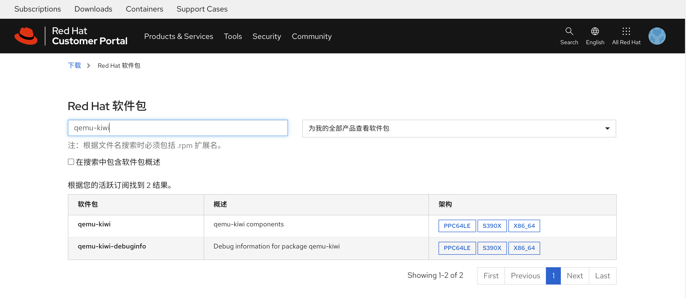

# 在红帽官网查询rpm包属于哪个repo

红帽rhel8系统，可以配置多个repo，默认是baseos, appstream，但是我们在项目中，经常会被问到，某个rpm是从哪个repo中获取的，如果这个rpm不在baseos, appstream这两个默认的repo中，那么我们在系统上用命令是查不出来的（至少我现在还不知道有什么办法），必须先把repo加到系统上，才能用dnf命令给查出来，这样就变成一个鸡生蛋，蛋生鸡的游戏，我们还是不知道应该加哪个repo。

好在，红帽官网[提供了一个工具](https://access.redhat.com/downloads/content/package-browser)，可以查询rpm包属于哪个repo，只要把rpm包信息输入到系统上，然后用这个工具查询，就可以知道属于哪个repo了。

我们访问这个网页，查询一个包 qemu-kiwi，我们注意到，他是根据我当前的订阅权限查询的，好在作者当前的订阅包含的内容还算多。

点击x84_64，我们就能看到rpm包的具体信息，包含了repo的名字，版本，描述，等等。

于是，我们就得到了最终的答案，qemu-kiwi这个rpm包，是属于 advanced-virt-for-rhel-8-x86_64-rpms 这个repo的
