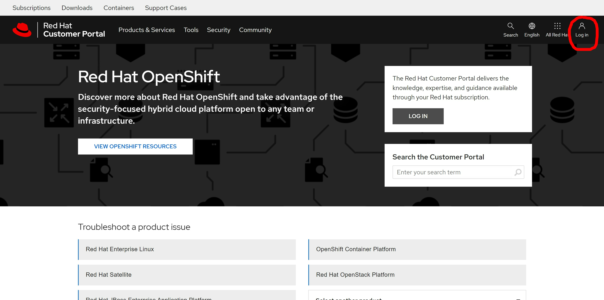
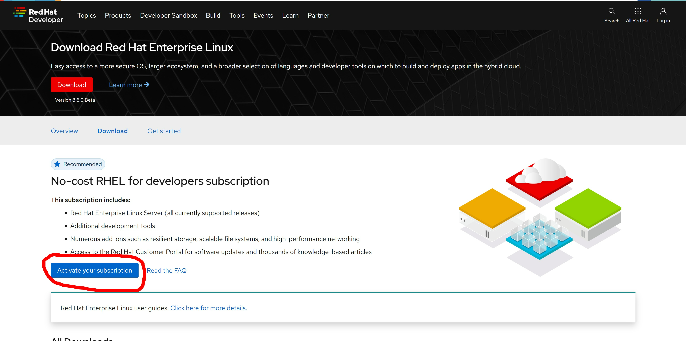
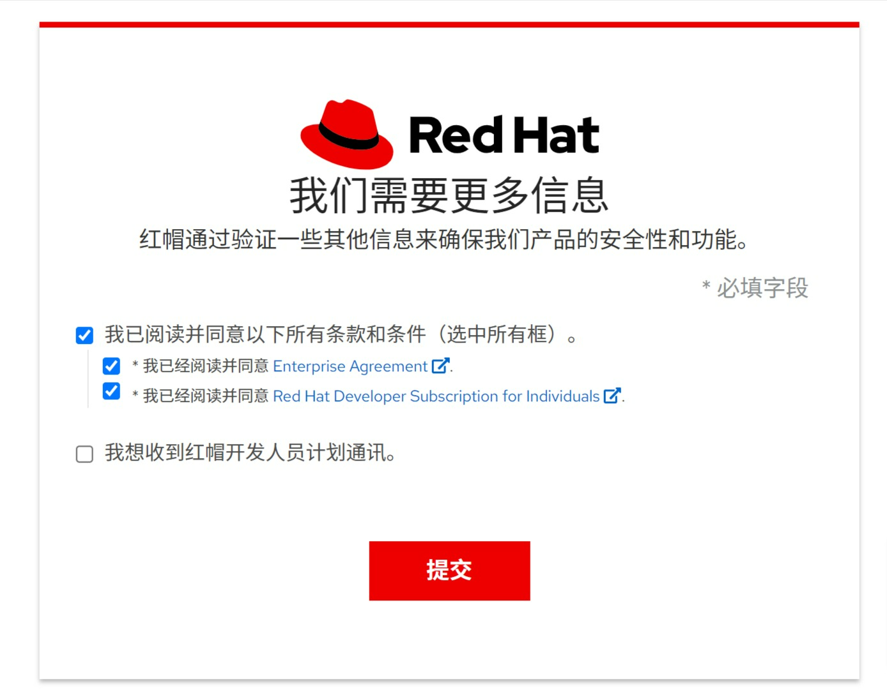
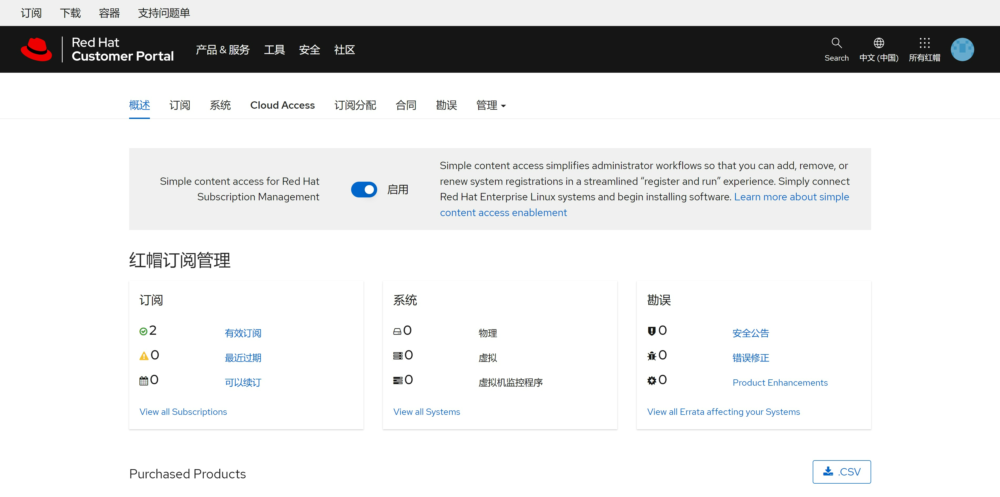
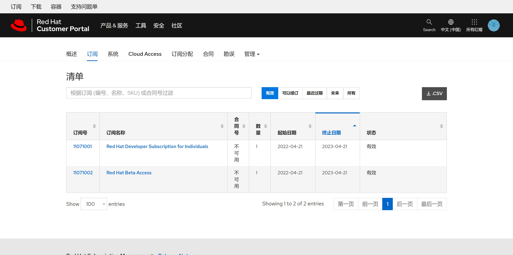

# no-cost rhel subscription / 红帽免费开发者订阅

自从centos宣布停止支持后，红帽为了照顾广大的开发者群体，推出了免费的开发者订阅，可以激活16个系统，还能免费看红帽的知识库，超值，现在就把注册和激活开发者账号的流程走一遍。

# 注册账户和激活订阅
首先，登录 https://access.redhat.com/ 去创建一个账号

  


然后访问： https://developers.redhat.com/products/rhel/download

  


  


接下来，我们确认一下我们的账号是否有 developer subscription, 访问  https://access.redhat.com/management

  

我们能够看到，我们刚刚激活了2个subscription，其中一个就是我们要的developer subscription

  

# 激活一个系统

接下来，我们用我们的用户名，密码，来激活一个rhel系统

```bash

subscription-manager register --auto-attach --username ******** --password ********

dnf repolist
# Updating Subscription Management repositories.
# repo id                                               repo name
# rhel-8-for-x86_64-appstream-rpms                      Red Hat Enterprise Linux 8 for x86_64 - AppStream (RPMs)
# rhel-8-for-x86_64-baseos-rpms                         Red Hat Enterprise Linux 8 for x86_64 - BaseOS (RPMs)

```

访问 https://access.redhat.com/management/systems ， 可以看到系统已经激活

  

# 能看知识库了

访问这个知识库文章，确认自己能访问知识库啦： https://access.redhat.com/solutions/6178422

  

# 调整分区

默认rhel安装，会给一个很大的/home，但是我们做实验，最好把空间都给 / , 不然很容易出现 / 空间不足的情况，那么怎么把 /home 删掉，并且扩大 /  分区呢？

```bash
lsblk
# NAME            MAJ:MIN RM  SIZE RO TYPE MOUNTPOINT
# sr0              11:0    1 1024M  0 rom
# vda             252:0    0   60G  0 disk
# ├─vda1          252:1    0    1G  0 part /boot
# └─vda2          252:2    0   59G  0 part
#   ├─rhel_v-root 253:0    0 38.3G  0 lvm  /
#   ├─rhel_v-swap 253:1    0  2.1G  0 lvm  [SWAP]
#   └─rhel_v-home 253:2    0 18.7G  0 lvm  /home

umount /home
lvremove -f /dev/rhel_v/home
#   Logical volume "home" successfully removed.

# comment out the following line to skip the /home partition
sed -i -E 's/^(.*\/home)/# \1/g' /etc/fstab

lvextend -l +100%FREE /dev/rhel_v/root
#   Size of logical volume rhel_v/root changed from <38.26 GiB (9794 extents) to <56.94 GiB (14576 extents).
#   Logical volume rhel_v/root successfully resized.

xfs_growfs /dev/rhel_v/root
# meta-data=/dev/mapper/rhel_v-root isize=512    agcount=4, agsize=2507264 blks
#          =                       sectsz=512   attr=2, projid32bit=1
#          =                       crc=1        finobt=1, sparse=1, rmapbt=0
#          =                       reflink=1
# data     =                       bsize=4096   blocks=10029056, imaxpct=25
#          =                       sunit=0      swidth=0 blks
# naming   =version 2              bsize=4096   ascii-ci=0, ftype=1
# log      =internal log           bsize=4096   blocks=4897, version=2
#          =                       sectsz=512   sunit=0 blks, lazy-count=1
# realtime =none                   extsz=4096   blocks=0, rtextents=0
# data blocks changed from 10029056 to 14925824

lsblk
# NAME            MAJ:MIN RM  SIZE RO TYPE MOUNTPOINT
# sr0              11:0    1 1024M  0 rom
# vda             252:0    0   60G  0 disk
# ├─vda1          252:1    0    1G  0 part /boot
# └─vda2          252:2    0   59G  0 part
#   ├─rhel_v-root 253:0    0   57G  0 lvm  /
#   └─rhel_v-swap 253:1    0  2.1G  0 lvm  [SWAP]


```

# reference
- https://developers.redhat.com/blog/2021/02/10/how-to-activate-your-no-cost-red-hat-enterprise-linux-subscription#
- https://developers.redhat.com/products/rhel/download


