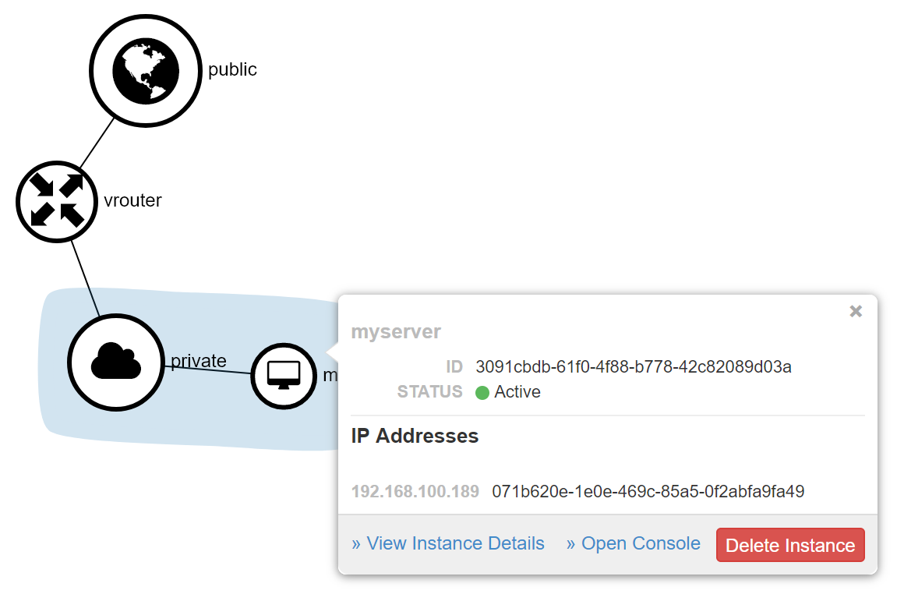

# openstack 17.0 all in one

https://access.redhat.com/documentation/en-us/red_hat_openstack_platform/17.0/html-single/standalone_deployment_guide/index

# install a rhel 9.0 vm

```bash

osinfo-query os | grep rhel9
#  rhel9.0              | Red Hat Enterprise Linux 9.0                       | 9.0      | http://redhat.com/rhel/9.0

create_lv() {
    var_vg=$1
    var_pool=$2
    var_lv=$3
    var_size=$4
    var_action=$5
    lvremove -f $var_vg/$var_lv
    # lvcreate -y -L $var_size -n $var_lv $var_vg
    if [ "$var_action" == "recreate" ]; then
      lvcreate --type thin -n $var_lv -V $var_size --thinpool $var_vg/$var_pool
      wipefs --all --force /dev/$var_vg/$var_lv
    fi
}

virsh destroy osp-17-0-all-in-one
virsh undefine osp-17-0-all-in-one

create_lv vgdata poolA lv-osp-17-0-all-in-one 200G recreate

SNO_MEM=64

virt-install --name=osp-17-0-all-in-one --vcpus=16 --ram=$(($SNO_MEM*1024)) \
  --cpu=host-model \
  --disk path=/dev/vgdata/lv-osp-17-0-all-in-one,device=disk,bus=virtio,format=raw \
  --os-variant rhel9.0 \
  --network bridge=baremetal,model=virtio \
  --network bridge=baremetal,model=virtio \
  --graphics vnc,port=59101 \
  --initrd-inject /data/kvm/osp-ks.cfg --extra-args "inst.ks=file:/osp-ks.cfg" \
  --boot menu=on --location /data/kvm/rhel.9.0.iso

```

## power on

```bash

virsh start osp-17-0-all-in-one

```

# basic setup for osp17

```bash
sshpass -p redhat ssh-copy-id root@172.21.6.21

ssh -tt -D 8802 -R 18801:10.147.17.89:5085 root@172.21.6.21

export PROXY="http://127.0.0.1:18801"

subscription-manager register --proxy=$PROXY --auto-attach --username ********* --password ********

useradd stack

echo redhat | passwd --stdin stack

echo "stack ALL=(root) NOPASSWD:ALL" | tee -a /etc/sudoers.d/stack
chmod 0440 /etc/sudoers.d/stack

subscription-manager release --set=9.0

dnf install -y dnf-utils tmux

# subscription-manager repos --proxy=$PROXY --disable=*

subscription-manager repos --proxy=$PROXY \
  --enable=rhel-9-for-x86_64-baseos-eus-rpms \
  --enable=rhel-9-for-x86_64-appstream-eus-rpms \
  --enable=rhel-9-for-x86_64-highavailability-eus-rpms \
  --enable=openstack-17-for-rhel-9-x86_64-rpms \
  --enable=fast-datapath-for-rhel-9-x86_64-rpms

dnf update -y

reboot

dnf install -y python3-tripleoclient

```

# install all in one osp

```bash
su - stack

openstack tripleo container image prepare default --output-env-file $HOME/containers-prepare-parameters.yaml
# parameter_defaults:
#   ContainerImagePrepare:
#   - set:
#       ceph_alertmanager_image: ose-prometheus-alertmanager
#       ceph_alertmanager_namespace: registry.redhat.io/openshift4
#       ceph_alertmanager_tag: 4.6
#       ceph_grafana_image: rhceph-5-dashboard-rhel8
#       ceph_grafana_namespace: registry.redhat.io/rhceph
#       ceph_grafana_tag: latest
#       ceph_image: rhceph-5-rhel8
#       ceph_namespace: registry.redhat.io/rhceph
#       ceph_node_exporter_image: ose-prometheus-node-exporter
#       ceph_node_exporter_namespace: registry.redhat.io/openshift4
#       ceph_node_exporter_tag: v4.6
#       ceph_prometheus_image: ose-prometheus
#       ceph_prometheus_namespace: registry.redhat.io/openshift4
#       ceph_prometheus_tag: 4.6
#       ceph_tag: latest
#       name_prefix: openstack-
#       name_suffix: ''
#       namespace: registry.redhat.io/rhosp-rhel9
#       neutron_driver: ovn
#       rhel_containers: false
#       tag: '17.0'
#     tag_from_label: '{version}-{release}'

export REGISTRY_USER_NAME=''
export REGISTRY_TOKEN=''

cat >> $HOME/containers-prepare-parameters.yaml << EOF
  ContainerImageRegistryCredentials:
    registry.redhat.io:
      $REGISTRY_USER_NAME: "$REGISTRY_TOKEN"
  ContainerImageRegistryLogin: true
EOF

ssh-keygen

export IP=192.168.25.2
export VIP=192.168.25.3
export NETMASK=24
export INTERFACE=enp2s0
export DNS1=172.21.1.1
export DNS2=114.114.114.114
export GATEWAY=172.21.6.254

cat << EOF > $HOME/standalone_parameters.yaml
parameter_defaults:
  CloudName: $IP
  CloudDomain: localdomain
  ControlPlaneStaticRoutes: []
  Debug: true
  DeploymentUser: $USER
  KernelIpNonLocalBind: 1
  DockerInsecureRegistryAddress:
    - $IP:8787
  NeutronPublicInterface: $INTERFACE
  NeutronDnsDomain: localdomain
  NeutronBridgeMappings: datacentre:br-ctlplane
  NeutronPhysicalBridge: br-ctlplane
  StandaloneEnableRoutedNetworks: false
  StandaloneHomeDir: $HOME
  StandaloneLocalMtu: 1500
  NovaComputeLibvirtType: qemu
  OctaviaAmphoraSshKeyFile: "/home/stack/.ssh/id_rsa.pub"
EOF

  # ControlPlaneStaticRoutes:
  #   - ip_netmask: 0.0.0.0/0
  #     next_hop: $GATEWAY
  #     default: true

# parameter_defaults:
#   NtpServer:
#     - clock.example.com

sudo podman login registry.redhat.io

sudo hostnamectl set-hostname all-in-one.example.net
sudo hostnamectl set-hostname all-in-one.example.net --transient

sudo openstack tripleo deploy \
  --templates \
  --local-ip=$IP/$NETMASK \
  --control-virtual-ip=$VIP \
  -e /usr/share/openstack-tripleo-heat-templates/environments/standalone/standalone-tripleo.yaml \
  -r /usr/share/openstack-tripleo-heat-templates/roles/Standalone.yaml \
  -e $HOME/containers-prepare-parameters.yaml \
  -e $HOME/standalone_parameters.yaml \
  --output-dir $HOME \
  --standalone
# ....
# 2022-10-11 03:26:46.579766 | ~~~~~~~~~~~~~~~~~~~~~~~~~~~~~~~~ End Summary Information ~~~~~~~~~~~~~~~~~~~~~~~~~~~~~~~~
# Not cleaning working directory /home/stack/tripleo-heat-installer-templates
# Not cleaning ansible directory /home/stack/standalone-ansible-gf8ahu1u
# Install artifact is located at /home/stack/standalone-install-20221011032647.tar.bzip2

# ########################################################

# Deployment successful!

# ########################################################

# ##########################################################

# Useful files:

# The clouds.yaml file is at ~/.config/openstack/clouds.yaml

# Use "export OS_CLOUD=standalone" before running the
# openstack command.

# ##########################################################

# Writing the stack virtual update mark file /var/lib/tripleo-heat-installer/update_mark_standalone

cat << EOF >> ~/.bashrc

export OS_CLOUD=standalone

EOF

export OS_CLOUD=standalone
openstack endpoint list

cat tripleo-standalone-passwords.yaml | grep -i adminpassword
  # AdminPassword: jTsjt87glkfUQsakRpcRojjFy

# http://192.168.25.2/

```

# create vm

## one nic on project, provider network

```bash
export OS_CLOUD=standalone
export GATEWAY=192.168.25.1
export STANDALONE_HOST=192.168.25.2
export PUBLIC_NETWORK_CIDR=192.168.25.0/24
export PRIVATE_NETWORK_CIDR=192.168.100.0/24
export PUBLIC_NET_START=192.168.25.4
export PUBLIC_NET_END=192.168.25.15
export DNS_SERVER=1.1.1.1

openstack flavor create --ram 512 --disk 1 --vcpu 1 --public tiny
# +----------------------------+--------------------------------------+
# | Field                      | Value                                |
# +----------------------------+--------------------------------------+
# | OS-FLV-DISABLED:disabled   | False                                |
# | OS-FLV-EXT-DATA:ephemeral  | 0                                    |
# | description                | None                                 |
# | disk                       | 1                                    |
# | id                         | a8061971-f7a2-4fdb-a1d7-45da87fdc388 |
# | name                       | tiny                                 |
# | os-flavor-access:is_public | True                                 |
# | properties                 |                                      |
# | ram                        | 512                                  |
# | rxtx_factor                | 1.0                                  |
# | swap                       |                                      |
# | vcpus                      | 1                                    |
# +----------------------------+--------------------------------------+


wget https://download.cirros-cloud.net/0.4.0/cirros-0.4.0-x86_64-disk.img

openstack image create cirros --container-format bare --disk-format qcow2 --public --file cirros-0.4.0-x86_64-disk.img
# +------------------+--------------------------------------------------------------------------------------------------------------------------------------------+
# | Field            | Value                                                                                                                                      |
# +------------------+--------------------------------------------------------------------------------------------------------------------------------------------+
# | container_format | bare                                                                                                                                       |
# | created_at       | 2022-10-11T11:10:40Z                                                                                                                       |
# | disk_format      | qcow2                                                                                                                                      |
# | file             | /v2/images/59b63199-f421-4185-81fa-2dfba512361f/file                                                                                       |
# | id               | 59b63199-f421-4185-81fa-2dfba512361f                                                                                                       |
# | min_disk         | 0                                                                                                                                          |
# | min_ram          | 0                                                                                                                                          |
# | name             | cirros                                                                                                                                     |
# | owner            | c7a4dc3311da439b829a35d2802dfb1a                                                                                                           |
# | properties       | os_hidden='False', owner_specified.openstack.md5='', owner_specified.openstack.object='images/cirros', owner_specified.openstack.sha256='' |
# | protected        | False                                                                                                                                      |
# | schema           | /v2/schemas/image                                                                                                                          |
# | status           | queued                                                                                                                                     |
# | tags             |                                                                                                                                            |
# | updated_at       | 2022-10-11T11:10:40Z                                                                                                                       |
# | visibility       | public                                                                                                                                     |
# +------------------+--------------------------------------------------------------------------------------------------------------------------------------------+

ssh-keygen -m PEM -t rsa -b 2048 -f ~/.ssh/id_rsa_pem

openstack keypair create --public-key ~/.ssh/id_rsa_pem.pub default
# +-------------+-------------------------------------------------+
# | Field       | Value                                           |
# +-------------+-------------------------------------------------+
# | created_at  | None                                            |
# | fingerprint | c2:88:fd:b1:3a:8a:e3:a4:80:46:d6:1c:85:62:1f:a9 |
# | id          | default                                         |
# | is_deleted  | None                                            |
# | name        | default                                         |
# | type        | ssh                                             |
# | user_id     | e5b339a8225a4c53889996968109e5cb                |
# +-------------+-------------------------------------------------+

openstack security group create basic
# +-----------------+-----------------------------------------------------------------------------------------------------------------------------------------------------------------------------+
# | Field           | Value                                                                                                                                                                       |
# +-----------------+-----------------------------------------------------------------------------------------------------------------------------------------------------------------------------+
# | created_at      | 2022-10-11T11:17:41Z                                                                                                                                                        |
# | description     | basic                                                                                                                                                                       |
# | id              | 4e50fb6e-5468-41bd-9cf1-6a1548dc31d7                                                                                                                                        |
# | name            | basic                                                                                                                                                                       |
# | project_id      | c7a4dc3311da439b829a35d2802dfb1a                                                                                                                                            |
# | revision_number | 1                                                                                                                                                                           |
# | rules           | created_at='2022-10-11T11:17:41Z', direction='egress', ethertype='IPv4', id='20605630-2208-4510-8a75-416bb563329e', standard_attr_id='7', updated_at='2022-10-11T11:17:41Z' |
# |                 | created_at='2022-10-11T11:17:41Z', direction='egress', ethertype='IPv6', id='431ecf08-d1bd-4f9c-b1ed-9d6cada1a404', standard_attr_id='8', updated_at='2022-10-11T11:17:41Z' |
# | stateful        | True                                                                                                                                                                        |
# | tags            | []                                                                                                                                                                          |
# | updated_at      | 2022-10-11T11:17:41Z                                                                                                                                                        |
# +-----------------+-----------------------------------------------------------------------------------------------------------------------------------------------------------------------------+

openstack security group rule create basic --protocol tcp --dst-port 22:22 --remote-ip 0.0.0.0/0
# +-------------------------+--------------------------------------+
# | Field                   | Value                                |
# +-------------------------+--------------------------------------+
# | created_at              | 2022-10-11T11:18:47Z                 |
# | description             |                                      |
# | direction               | ingress                              |
# | ether_type              | IPv4                                 |
# | id                      | 22e53709-0287-4ecd-9442-1dc9bde89b8a |
# | name                    | None                                 |
# | port_range_max          | 22                                   |
# | port_range_min          | 22                                   |
# | project_id              | c7a4dc3311da439b829a35d2802dfb1a     |
# | protocol                | tcp                                  |
# | remote_address_group_id | None                                 |
# | remote_group_id         | None                                 |
# | remote_ip_prefix        | 0.0.0.0/0                            |
# | revision_number         | 0                                    |
# | security_group_id       | 4e50fb6e-5468-41bd-9cf1-6a1548dc31d7 |
# | tags                    | []                                   |
# | updated_at              | 2022-10-11T11:18:47Z                 |
# +-------------------------+--------------------------------------+

openstack security group rule create --protocol icmp basic
# +-------------------------+--------------------------------------+
# | Field                   | Value                                |
# +-------------------------+--------------------------------------+
# | created_at              | 2022-10-11T11:20:19Z                 |
# | description             |                                      |
# | direction               | ingress                              |
# | ether_type              | IPv4                                 |
# | id                      | 3ca1e755-5bfc-4de5-95bb-41d8cba65676 |
# | name                    | None                                 |
# | port_range_max          | None                                 |
# | port_range_min          | None                                 |
# | project_id              | c7a4dc3311da439b829a35d2802dfb1a     |
# | protocol                | icmp                                 |
# | remote_address_group_id | None                                 |
# | remote_group_id         | None                                 |
# | remote_ip_prefix        | 0.0.0.0/0                            |
# | revision_number         | 0                                    |
# | security_group_id       | 4e50fb6e-5468-41bd-9cf1-6a1548dc31d7 |
# | tags                    | []                                   |
# | updated_at              | 2022-10-11T11:20:19Z                 |
# +-------------------------+--------------------------------------+

openstack security group rule create --protocol udp --dst-port 53:53 basic
# +-------------------------+--------------------------------------+
# | Field                   | Value                                |
# +-------------------------+--------------------------------------+
# | created_at              | 2022-10-11T11:22:20Z                 |
# | description             |                                      |
# | direction               | ingress                              |
# | ether_type              | IPv4                                 |
# | id                      | 6894c5f1-e67c-4681-849e-ae518f2a70cd |
# | name                    | None                                 |
# | port_range_max          | 53                                   |
# | port_range_min          | 53                                   |
# | project_id              | c7a4dc3311da439b829a35d2802dfb1a     |
# | protocol                | udp                                  |
# | remote_address_group_id | None                                 |
# | remote_group_id         | None                                 |
# | remote_ip_prefix        | 0.0.0.0/0                            |
# | revision_number         | 0                                    |
# | security_group_id       | 4e50fb6e-5468-41bd-9cf1-6a1548dc31d7 |
# | tags                    | []                                   |
# | updated_at              | 2022-10-11T11:22:20Z                 |
# +-------------------------+--------------------------------------+

openstack network create --external --provider-physical-network datacentre --provider-network-type flat public
# +---------------------------+--------------------------------------+
# | Field                     | Value                                |
# +---------------------------+--------------------------------------+
# | admin_state_up            | UP                                   |
# | availability_zone_hints   |                                      |
# | availability_zones        |                                      |
# | created_at                | 2022-10-11T11:23:43Z                 |
# | description               |                                      |
# | dns_domain                |                                      |
# | id                        | e017afac-6b33-4dd4-b730-5ed90d199bc1 |
# | ipv4_address_scope        | None                                 |
# | ipv6_address_scope        | None                                 |
# | is_default                | False                                |
# | is_vlan_transparent       | None                                 |
# | mtu                       | 1500                                 |
# | name                      | public                               |
# | port_security_enabled     | True                                 |
# | project_id                | c7a4dc3311da439b829a35d2802dfb1a     |
# | provider:network_type     | flat                                 |
# | provider:physical_network | datacentre                           |
# | provider:segmentation_id  | None                                 |
# | qos_policy_id             | None                                 |
# | revision_number           | 1                                    |
# | router:external           | External                             |
# | segments                  | None                                 |
# | shared                    | False                                |
# | status                    | ACTIVE                               |
# | subnets                   |                                      |
# | tags                      |                                      |
# | updated_at                | 2022-10-11T11:23:43Z                 |
# +---------------------------+--------------------------------------+

openstack network create --internal private
# +---------------------------+--------------------------------------+
# | Field                     | Value                                |
# +---------------------------+--------------------------------------+
# | admin_state_up            | UP                                   |
# | availability_zone_hints   |                                      |
# | availability_zones        |                                      |
# | created_at                | 2022-10-11T11:26:08Z                 |
# | description               |                                      |
# | dns_domain                |                                      |
# | id                        | c215fb7a-9b31-4452-817e-da00022c0711 |
# | ipv4_address_scope        | None                                 |
# | ipv6_address_scope        | None                                 |
# | is_default                | False                                |
# | is_vlan_transparent       | None                                 |
# | mtu                       | 1442                                 |
# | name                      | private                              |
# | port_security_enabled     | True                                 |
# | project_id                | c7a4dc3311da439b829a35d2802dfb1a     |
# | provider:network_type     | geneve                               |
# | provider:physical_network | None                                 |
# | provider:segmentation_id  | 26717                                |
# | qos_policy_id             | None                                 |
# | revision_number           | 1                                    |
# | router:external           | Internal                             |
# | segments                  | None                                 |
# | shared                    | False                                |
# | status                    | ACTIVE                               |
# | subnets                   |                                      |
# | tags                      |                                      |
# | updated_at                | 2022-10-11T11:26:08Z                 |
# +---------------------------+--------------------------------------+

openstack subnet create public-net \
    --subnet-range $PUBLIC_NETWORK_CIDR \
    --no-dhcp \
    --gateway $GATEWAY \
    --allocation-pool start=$PUBLIC_NET_START,end=$PUBLIC_NET_END \
    --network public
# +----------------------+--------------------------------------+
# | Field                | Value                                |
# +----------------------+--------------------------------------+
# | allocation_pools     | 192.168.25.4-192.168.25.15           |
# | cidr                 | 192.168.25.0/24                      |
# | created_at           | 2022-10-11T11:27:03Z                 |
# | description          |                                      |
# | dns_nameservers      |                                      |
# | dns_publish_fixed_ip | None                                 |
# | enable_dhcp          | False                                |
# | gateway_ip           | 192.168.25.1                         |
# | host_routes          |                                      |
# | id                   | 09d4c9bf-8eed-4621-9774-ae429bc66a69 |
# | ip_version           | 4                                    |
# | ipv6_address_mode    | None                                 |
# | ipv6_ra_mode         | None                                 |
# | name                 | public-net                           |
# | network_id           | e017afac-6b33-4dd4-b730-5ed90d199bc1 |
# | prefix_length        | None                                 |
# | project_id           | c7a4dc3311da439b829a35d2802dfb1a     |
# | revision_number      | 0                                    |
# | segment_id           | None                                 |
# | service_types        | None                                 |
# | subnetpool_id        | None                                 |
# | tags                 |                                      |
# | updated_at           | 2022-10-11T11:27:03Z                 |
# +----------------------+--------------------------------------+

openstack subnet create private-net \
    --subnet-range $PRIVATE_NETWORK_CIDR \
    --network private
# +----------------------+--------------------------------------+
# | Field                | Value                                |
# +----------------------+--------------------------------------+
# | allocation_pools     | 192.168.100.2-192.168.100.254        |
# | cidr                 | 192.168.100.0/24                     |
# | created_at           | 2022-10-11T11:28:33Z                 |
# | description          |                                      |
# | dns_nameservers      |                                      |
# | dns_publish_fixed_ip | None                                 |
# | enable_dhcp          | True                                 |
# | gateway_ip           | 192.168.100.1                        |
# | host_routes          |                                      |
# | id                   | 071b620e-1e0e-469c-85a5-0f2abfa9fa49 |
# | ip_version           | 4                                    |
# | ipv6_address_mode    | None                                 |
# | ipv6_ra_mode         | None                                 |
# | name                 | private-net                          |
# | network_id           | c215fb7a-9b31-4452-817e-da00022c0711 |
# | prefix_length        | None                                 |
# | project_id           | c7a4dc3311da439b829a35d2802dfb1a     |
# | revision_number      | 0                                    |
# | segment_id           | None                                 |
# | service_types        | None                                 |
# | subnetpool_id        | None                                 |
# | tags                 |                                      |
# | updated_at           | 2022-10-11T11:28:33Z                 |
# +----------------------+--------------------------------------+

# NOTE: In this case an IP will be automatically assigned
# from the allocation pool for the subnet.
openstack router create vrouter
# +-------------------------+--------------------------------------+
# | Field                   | Value                                |
# +-------------------------+--------------------------------------+
# | admin_state_up          | UP                                   |
# | availability_zone_hints |                                      |
# | availability_zones      |                                      |
# | created_at              | 2022-10-11T12:26:19Z                 |
# | description             |                                      |
# | external_gateway_info   | null                                 |
# | flavor_id               | None                                 |
# | id                      | 05775173-447a-4d66-b31c-11c66b279a92 |
# | name                    | vrouter                              |
# | project_id              | c7a4dc3311da439b829a35d2802dfb1a     |
# | revision_number         | 1                                    |
# | routes                  |                                      |
# | status                  | ACTIVE                               |
# | tags                    |                                      |
# | updated_at              | 2022-10-11T12:26:19Z                 |
# +-------------------------+--------------------------------------+

openstack router set vrouter --external-gateway public

openstack router add subnet vrouter private-net

```


```bash
openstack floating ip create public
# +---------------------+--------------------------------------+
# | Field               | Value                                |
# +---------------------+--------------------------------------+
# | created_at          | 2022-10-11T12:35:49Z                 |
# | description         |                                      |
# | dns_domain          |                                      |
# | dns_name            |                                      |
# | fixed_ip_address    | None                                 |
# | floating_ip_address | 192.168.25.14                        |
# | floating_network_id | e017afac-6b33-4dd4-b730-5ed90d199bc1 |
# | id                  | fd3e8ee5-be61-4f94-a910-6ced7b4c4ddd |
# | name                | 192.168.25.14                        |
# | port_details        | None                                 |
# | port_id             | None                                 |
# | project_id          | c7a4dc3311da439b829a35d2802dfb1a     |
# | qos_policy_id       | None                                 |
# | revision_number     | 0                                    |
# | router_id           | None                                 |
# | status              | DOWN                                 |
# | subnet_id           | None                                 |
# | tags                | []                                   |
# | updated_at          | 2022-10-11T12:35:49Z                 |
# +---------------------+--------------------------------------+

openstack server create --flavor tiny --image cirros --key-name default --network private --security-group basic myserver
# +-------------------------------------+-----------------------------------------------+
# | Field                               | Value                                         |
# +-------------------------------------+-----------------------------------------------+
# | OS-DCF:diskConfig                   | MANUAL                                        |
# | OS-EXT-AZ:availability_zone         |                                               |
# | OS-EXT-SRV-ATTR:host                | None                                          |
# | OS-EXT-SRV-ATTR:hypervisor_hostname | None                                          |
# | OS-EXT-SRV-ATTR:instance_name       |                                               |
# | OS-EXT-STS:power_state              | NOSTATE                                       |
# | OS-EXT-STS:task_state               | scheduling                                    |
# | OS-EXT-STS:vm_state                 | building                                      |
# | OS-SRV-USG:launched_at              | None                                          |
# | OS-SRV-USG:terminated_at            | None                                          |
# | accessIPv4                          |                                               |
# | accessIPv6                          |                                               |
# | addresses                           |                                               |
# | adminPass                           | NvGbVP5T5nsT                                  |
# | config_drive                        |                                               |
# | created                             | 2022-10-11T12:36:47Z                          |
# | flavor                              | tiny (a8061971-f7a2-4fdb-a1d7-45da87fdc388)   |
# | hostId                              |                                               |
# | id                                  | 3091cbdb-61f0-4f88-b778-42c82089d03a          |
# | image                               | cirros (59b63199-f421-4185-81fa-2dfba512361f) |
# | key_name                            | default                                       |
# | name                                | myserver                                      |
# | progress                            | 0                                             |
# | project_id                          | c7a4dc3311da439b829a35d2802dfb1a              |
# | properties                          |                                               |
# | security_groups                     | name='4e50fb6e-5468-41bd-9cf1-6a1548dc31d7'   |
# | status                              | BUILD                                         |
# | updated                             | 2022-10-11T12:36:47Z                          |
# | user_id                             | e5b339a8225a4c53889996968109e5cb              |
# | volumes_attached                    |                                               |
# +-------------------------------------+-----------------------------------------------+

openstack server add floating ip myserver 192.168.25.14

ssh cirros@192.168.25.14

ip a
# 1: lo: <LOOPBACK,UP,LOWER_UP> mtu 65536 qdisc noqueue qlen 1
#     link/loopback 00:00:00:00:00:00 brd 00:00:00:00:00:00
#     inet 127.0.0.1/8 scope host lo
#        valid_lft forever preferred_lft forever
#     inet6 ::1/128 scope host
#        valid_lft forever preferred_lft forever
# 2: eth0: <BROADCAST,MULTICAST,UP,LOWER_UP> mtu 1442 qdisc pfifo_fast qlen 1000
#     link/ether fa:16:3e:b6:0c:60 brd ff:ff:ff:ff:ff:ff
#     inet 192.168.100.189/24 brd 192.168.100.255 scope global eth0
#        valid_lft forever preferred_lft forever
#     inet6 fe80::f816:3eff:feb6:c60/64 scope link
#        valid_lft forever preferred_lft forever


```




## one nic on provider network

```bash


```

## two nic on project, provider network

```bash


```

# note

```bash
/usr/libexec/qemu-kvm -name guest=instance-00000001,debug-threads=on -S -object {"qom-type":"secret","id":"masterKey0","format":"raw","file":"/var/lib/libvirt/qemu/domain-1-instance-00000001/master-key.aes"} -machine pc-q35-rhel9.0.0,usb=off,dump-guest-core=off,memory-backend=pc.ram -accel tcg -cpu EPYC,acpi=on,ss=on,monitor=on,hypervisor=on,erms=on,mpx=on,pcommit=on,clwb=on,pku=on,la57=on,3dnowext=on,3dnow=on,npt=on,svme-addr-chk=on,vme=off,fma=off,avx=off,f16c=off,avx2=off,rdseed=off,sha-ni=off,xsavec=off,fxsr-opt=off,misalignsse=off,3dnowprefetch=off,osvw=off,topoext=off,nrip-save=off -m 512 -object {"qom-type":"memory-backend-ram","id":"pc.ram","size":536870912} -overcommit mem-lock=off -smp 1,sockets=1,dies=1,cores=1,threads=1 -uuid 3091cbdb-61f0-4f88-b778-42c82089d03a -smbios type=1,manufacturer=Red Hat,product=OpenStack Compute,version=23.2.2-0.20220720130412.7074ac0.el9ost,serial=3091cbdb-61f0-4f88-b778-42c82089d03a,uuid=3091cbdb-61f0-4f88-b778-42c82089d03a,family=Virtual Machine -no-user-config -nodefaults -chardev socket,id=charmonitor,fd=24,server=on,wait=off -mon chardev=charmonitor,id=monitor,mode=control -rtc base=utc -no-shutdown -boot strict=on -device pcie-root-port,port=16,chassis=1,id=pci.1,bus=pcie.0,multifunction=on,addr=0x2 -device pcie-root-port,port=17,chassis=2,id=pci.2,bus=pcie.0,addr=0x2.0x1 -device pcie-root-port,port=18,chassis=3,id=pci.3,bus=pcie.0,addr=0x2.0x2 -device pcie-root-port,port=19,chassis=4,id=pci.4,bus=pcie.0,addr=0x2.0x3 -device pcie-root-port,port=20,chassis=5,id=pci.5,bus=pcie.0,addr=0x2.0x4 -device pcie-root-port,port=21,chassis=6,id=pci.6,bus=pcie.0,addr=0x2.0x5 -device pcie-root-port,port=22,chassis=7,id=pci.7,bus=pcie.0,addr=0x2.0x6 -device pcie-root-port,port=23,chassis=8,id=pci.8,bus=pcie.0,addr=0x2.0x7 -device pcie-root-port,port=24,chassis=9,id=pci.9,bus=pcie.0,multifunction=on,addr=0x3 -device pcie-root-port,port=25,chassis=10,id=pci.10,bus=pcie.0,addr=0x3.0x1 -device pcie-root-port,port=26,chassis=11,id=pci.11,bus=pcie.0,addr=0x3.0x2 -device pcie-root-port,port=27,chassis=12,id=pci.12,bus=pcie.0,addr=0x3.0x3 -device pcie-root-port,port=28,chassis=13,id=pci.13,bus=pcie.0,addr=0x3.0x4 -device pcie-root-port,port=29,chassis=14,id=pci.14,bus=pcie.0,addr=0x3.0x5 -device pcie-root-port,port=30,chassis=15,id=pci.15,bus=pcie.0,addr=0x3.0x6 -device pcie-root-port,port=31,chassis=16,id=pci.16,bus=pcie.0,addr=0x3.0x7 -device pcie-root-port,port=32,chassis=17,id=pci.17,bus=pcie.0,addr=0x4 -device pcie-pci-bridge,id=pci.18,bus=pci.1,addr=0x0 -device piix3-usb-uhci,id=usb,bus=pci.18,addr=0x1 -blockdev {"driver":"file","filename":"/var/lib/nova/instances/_base/3ff302b00e3854ab29654d6f0ff8475a9135f8a7","node-name":"libvirt-2-storage","cache":{"direct":true,"no-flush":false},"auto-read-only":true,"discard":"unmap"} -blockdev {"node-name":"libvirt-2-format","read-only":true,"cache":{"direct":true,"no-flush":false},"driver":"raw","file":"libvirt-2-storage"} -blockdev {"driver":"file","filename":"/var/lib/nova/instances/3091cbdb-61f0-4f88-b778-42c82089d03a/disk","node-name":"libvirt-1-storage","cache":{"direct":true,"no-flush":false},"auto-read-only":true,"discard":"unmap"} -blockdev {"node-name":"libvirt-1-format","read-only":false,"cache":{"direct":true,"no-flush":false},"driver":"qcow2","file":"libvirt-1-storage","backing":"libvirt-2-format"} -device virtio-blk-pci,bus=pci.3,addr=0x0,drive=libvirt-1-format,id=virtio-disk0,bootindex=1,write-cache=on -netdev tap,fd=26,id=hostnet0 -device virtio-net-pci,rx_queue_size=512,host_mtu=1442,netdev=hostnet0,id=net0,mac=fa:16:3e:b6:0c:60,bus=pci.2,addr=0x0 -add-fd set=2,fd=25 -chardev pty,id=charserial0,logfile=/dev/fdset/2,logappend=on -device isa-serial,chardev=charserial0,id=serial0 -device usb-tablet,id=input0,bus=usb.0,port=1 -audiodev {"id":"audio1","driver":"none"} -vnc 192.168.25.2:0,audiodev=audio1 -device virtio-vga,id=video0,max_outputs=1,bus=pcie.0,addr=0x1 -device virtio-balloon-pci,id=balloon0,bus=pci.4,addr=0x0 -object {"qom-type":"rng-random","id":"objrng0","filename":"/dev/urandom"} -device virtio-rng-pci,rng=objrng0,id=rng0,bus=pci.5,addr=0x0 -sandbox on,obsolete=deny,elevateprivileges=deny,spawn=deny,resourcecontrol=deny -msg timestamp=on


-netdev tap,fd=26,id=hostnet0 -device virtio-net-pci,rx_queue_size=512,host_mtu=1442,netdev=hostnet0,id=net0,mac=fa:16:3e:b6:0c:60,bus=pci.2,addr=0x0 

ip tuntap
# tap7db648f1-cd: tap vnet_hdr
# tap2e066945-6b: tap vnet_hdr

ip -details tuntap
# tap7db648f1-cd: tap vnet_hdr
# readlink: No such file or directory
# readlink: No such file or directory
# readlink: No such file or directory
# readlink: No such file or directory
# readlink: No such file or directory
#         Attached to processes:qemu-kvm(795345)
# tap2e066945-6b: tap vnet_hdr
# readlink: No such file or directory
#         Attached to processes:qemu-kvm(799896)

ip -d a
# 1: lo: <LOOPBACK,UP,LOWER_UP> mtu 65536 qdisc noqueue state UNKNOWN group default qlen 1000
#     link/loopback 00:00:00:00:00:00 brd 00:00:00:00:00:00 promiscuity 0 minmtu 0 maxmtu 0 numtxqueues 1 numrxqueues 1 gso_max_size 65536 gso_max_segs 65535
#     inet 127.0.0.1/8 scope host lo
#        valid_lft forever preferred_lft forever
#     inet6 ::1/128 scope host
#        valid_lft forever preferred_lft forever
# 2: enp1s0: <BROADCAST,MULTICAST,UP,LOWER_UP> mtu 1500 qdisc fq_codel state UP group default qlen 1000
#     link/ether 52:54:00:61:36:2b brd ff:ff:ff:ff:ff:ff promiscuity 0 minmtu 68 maxmtu 65535 numtxqueues 1 numrxqueues 1 gso_max_size 65536 gso_max_segs 65535 parentbus virtio parentdev virtio0
#     inet 172.21.6.21/24 brd 172.21.6.255 scope global noprefixroute enp1s0
#        valid_lft forever preferred_lft forever
#     inet6 fe80::5054:ff:fe61:362b/64 scope link noprefixroute
#        valid_lft forever preferred_lft forever
# 3: enp2s0: <BROADCAST,MULTICAST,UP,LOWER_UP> mtu 1500 qdisc fq_codel master ovs-system state UP group default qlen 1000
#     link/ether 52:54:00:de:12:77 brd ff:ff:ff:ff:ff:ff promiscuity 1 minmtu 68 maxmtu 65535
#     openvswitch_slave numtxqueues 1 numrxqueues 1 gso_max_size 65536 gso_max_segs 65535 parentbus virtio parentdev virtio1
#     inet6 fe80::5054:ff:fede:1277/64 scope link
#        valid_lft forever preferred_lft forever
# 4: ovs-system: <BROADCAST,MULTICAST> mtu 1500 qdisc noop state DOWN group default qlen 1000
#     link/ether 52:51:4d:4d:60:de brd ff:ff:ff:ff:ff:ff promiscuity 1 minmtu 68 maxmtu 65535
#     openvswitch numtxqueues 1 numrxqueues 1 gso_max_size 65536 gso_max_segs 65535
# 5: br-int: <BROADCAST,MULTICAST> mtu 1442 qdisc noop state DOWN group default qlen 1000
#     link/ether fa:02:da:7d:5b:bb brd ff:ff:ff:ff:ff:ff promiscuity 1 minmtu 68 maxmtu 65535
#     openvswitch numtxqueues 1 numrxqueues 1 gso_max_size 65536 gso_max_segs 65535
# 6: br-ctlplane: <BROADCAST,MULTICAST,UP,LOWER_UP> mtu 1500 qdisc noqueue state UNKNOWN group default qlen 1000
#     link/ether 52:54:00:de:12:77 brd ff:ff:ff:ff:ff:ff promiscuity 1 minmtu 68 maxmtu 65535
#     openvswitch numtxqueues 1 numrxqueues 1 gso_max_size 65536 gso_max_segs 65535
#     inet 192.168.25.2/24 brd 192.168.25.255 scope global br-ctlplane
#        valid_lft forever preferred_lft forever
#     inet 192.168.25.3/32 brd 192.168.25.3 scope global br-ctlplane
#        valid_lft forever preferred_lft forever
#     inet 192.168.25.2/32 brd 192.168.25.2 scope global br-ctlplane
#        valid_lft forever preferred_lft forever
#     inet6 fe80::5054:ff:fede:1277/64 scope link
#        valid_lft forever preferred_lft forever
# 7: tap7db648f1-cd: <BROADCAST,MULTICAST,UP,LOWER_UP> mtu 1442 qdisc fq_codel master ovs-system state UNKNOWN group default qlen 1000
#     link/ether fe:16:3e:b6:0c:60 brd ff:ff:ff:ff:ff:ff promiscuity 1 minmtu 68 maxmtu 65521
#     tun type tap pi off vnet_hdr on persist off
#     openvswitch_slave numtxqueues 1 numrxqueues 1 gso_max_size 65536 gso_max_segs 65535
#     inet6 fe80::fc16:3eff:feb6:c60/64 scope link
#        valid_lft forever preferred_lft forever
# 8: tapc215fb7a-90@if2: <BROADCAST,MULTICAST,UP,LOWER_UP> mtu 1500 qdisc noqueue master ovs-system state UP group default qlen 1000
#     link/ether 5a:01:92:40:50:c3 brd ff:ff:ff:ff:ff:ff link-netns ovnmeta-c215fb7a-9b31-4452-817e-da00022c0711 promiscuity 1 minmtu 68 maxmtu 65535
#     veth
#     openvswitch_slave numtxqueues 16 numrxqueues 16 gso_max_size 65536 gso_max_segs 65535
#     inet6 fe80::5801:92ff:fe40:50c3/64 scope link
#        valid_lft forever preferred_lft forever
# 9: tap2e066945-6b: <BROADCAST,MULTICAST,UP,LOWER_UP> mtu 1442 qdisc fq_codel master ovs-system state UNKNOWN group default qlen 1000
#     link/ether fe:16:3e:b6:e2:c3 brd ff:ff:ff:ff:ff:ff promiscuity 1 minmtu 68 maxmtu 65521
#     tun type tap pi off vnet_hdr on persist off
#     openvswitch_slave numtxqueues 1 numrxqueues 1 gso_max_size 65536 gso_max_segs 65535
#     inet6 fe80::fc16:3eff:feb6:e2c3/64 scope link
#        valid_lft forever preferred_lft forever


```
# end
