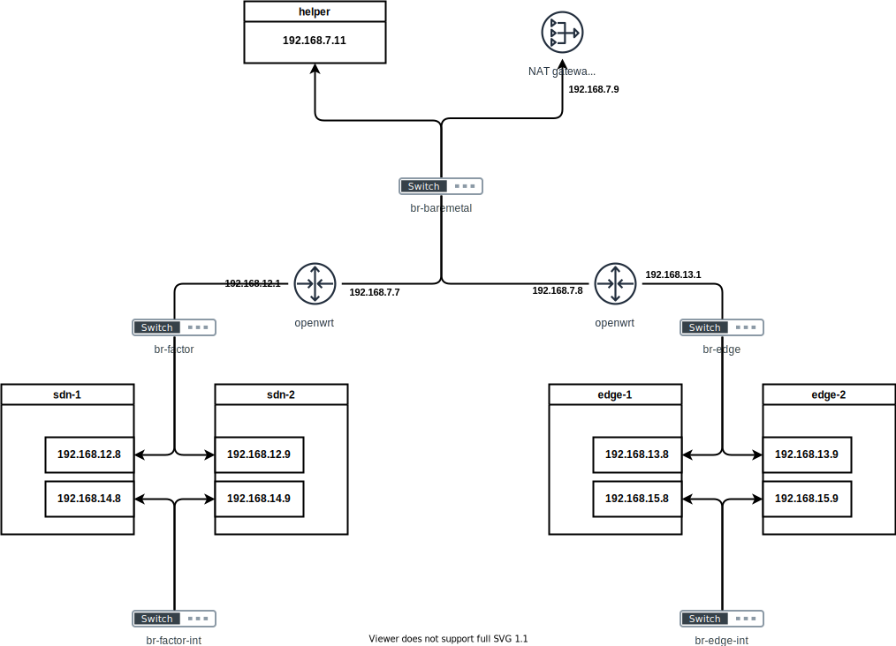
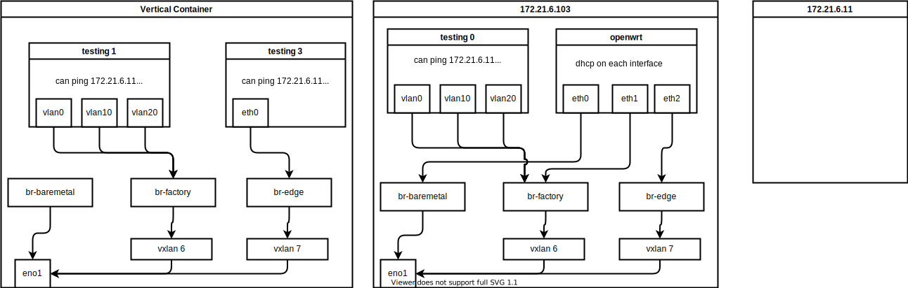

# create ovs based sdn

- [How to install openvswitch for Red Hat Enterprise Linux 8](https://access.redhat.com/solutions/4388431)
- [Open vSwitch2.3.0版本安装部署及基本操作](https://www.sdnlab.com/3166.html)






```bash
export PROXY="127.0.0.1:18801"

subscription-manager repos  --proxy=$PROXY \
  --enable=openstack-16-for-rhel-8-x86_64-rpms \
  --enable=fast-datapath-for-rhel-8-x86_64-rpms

dnf install -y openvswitch
# Updating Subscription Management repositories.                                                                                                                             Red Hat OpenStack Platform 16 for RHEL 8 x86_64 (RPMs)                                                                                     364 kB/s | 1.9 MB     00:05     Fast Datapath for RHEL 8 x86_64 (RPMs)                                                                                                     186 kB/s | 534 kB     00:02     Dependencies resolved.                                                                                                                                                     =========================================================================================================================================================================== Package                                   Architecture                         Version                                      Repository                               Size ===========================================================================================================================================================================Installing:                                                                                                                                                                 openvswitch                               x86_64                               2.15.1-1.56209                               mlnx_ofed                                15 M                                                                                                                                                                            Transaction Summary                                                                                                                                                        ===========================================================================================================================================================================Install  1 Package

# Total size: 15 M
# Installed size: 46 M
# Downloading Packages:
# Running transaction check
# Transaction check succeeded.
# Running transaction test
# Transaction test succeeded.
# Running transaction
#   Preparing        :                                                                                                                                                   1/1
#   Running scriptlet: openvswitch-2.15.1-1.56209.x86_64                                                                                                                 1/1
#   Installing       : openvswitch-2.15.1-1.56209.x86_64                                                                                                                 1/1
#   Running scriptlet: openvswitch-2.15.1-1.56209.x86_64                                                                                                                 1/1
#   Verifying        : openvswitch-2.15.1-1.56209.x86_64                                                                                                                 1/1
# Installed products updated.

# Installed:
#   openvswitch-2.15.1-1.56209.x86_64

# Complete!

# 最后居然是从 mellanox ofed 的源装的ovs
systemctl enable --now  ovs-vswitchd

```

笔记里面有2种方法
- [安装 centos openstack, openvswitch sig 源，然后安装](https://computingforgeeks.com/install-open-vswitch-on-rocky-almalinux/)
- [从rhel的srpm重新编译来装](https://andreaskaris.github.io/blog/networking/install-openvswitch-on-rocky/)。

# install sdn controller

we don't need sdn controller, but I don't understand what is sdn controller

- https://ryu-sdn.org/
- https://ryu.readthedocs.io/en/latest/getting_started.html#quick-start
- https://github.com/openstack/os-ken
- https://github.com/faucetsdn/ryu

<!-- - https://github.com/ARCCN/runos/ -->

```bash
# on a ubuntu 
sshpass -p panpan ssh-copy-id wzh@172.21.6.67

sed -i 's/#PermitRootLogin prohibit-password/PermitRootLogin yes/' /etc/ssh/sshd_config
systemctl restart sshd

sshpass -p panpan ssh-copy-id root@172.21.6.67

ssh -tt root@172.21.6.67 'bash -l -c byobu'

apt-get upgrade -y

apt install -y gcc python3-dev libffi-dev libssl-dev libxml2-dev libxslt1-dev zlib1g-dev python3-pip

pip3 install ryu


```

# define ovs

## on 103

- [Open vSwitch2.3.0版本安装部署及基本操作](https://www.sdnlab.com/3166.html)

```bash
nmcli con mod baremetal -ipv4.add 192.168.17.103/24
nmcli con mod baremetal -ipv4.add 192.168.17.113/24
nmcli con mod baremetal -ipv4.add 192.168.17.123/24
nmcli con up baremetal

# first try to delete existed vxlan interface
nmcli con del br-prov-vxlan5

systemctl enable --now openvswitch

ovs-vsctl add-br br-factory
ovs-vsctl add-br br-edge
ovs-vsctl add-br br-factory-int
ovs-vsctl add-br br-edge-int

ovs-vsctl 

ovs-vsctl show
# 49cef177-c2cb-4fba-9143-34d1cc57c6f1
#     Bridge br-edge
#         Port br-edge
#             Interface br-edge
#                 type: internal
#     Bridge br-factory
#         Port br-factory
#             Interface br-factory
#                 type: internal
#     ovs_version: "2.15.1-d246dab"

ovs-vsctl add-port br-factory vx-factory -- set interface vx-factory type=vxlan options:remote_ip=192.168.7.102 options:key=1

ovs-vsctl add-port br-edge vx-edge -- set interface vx-edge type=vxlan options:remote_ip=192.168.7.102 options:key=2

ovs-vsctl add-port br-factory-int vx-factory-int -- set interface vx-factory-int type=vxlan options:remote_ip=192.168.7.102 options:key=3

ovs-vsctl add-port br-edge-int vx-edge-int -- set interface vx-edge-int type=vxlan options:remote_ip=192.168.7.102 options:key=4

ovs-vsctl show
# 49cef177-c2cb-4fba-9143-34d1cc57c6f1
#     Bridge br-edge
#         Port br-edge
#             Interface br-edge
#                 type: internal
#         Port vx-edge
#             Interface vx-edge
#                 type: vxlan
#                 options: {key=edge, remote_ip="192.168.17.102"}
#     Bridge br-factory
#         Port br-factory
#             Interface br-factory
#                 type: internal
#         Port vx-factory
#             Interface vx-factory
#                 type: vxlan
#                 options: {key=factory, remote_ip="192.168.7.102"}
#     ovs_version: "2.15.1-d246dab"

# want to check the option of vxlan?
# modinfo vxlan

# restore
ovs-vsctl del-port br-factory vx-factory
ovs-vsctl del-port br-edge vx-edge
ovs-vsctl del-port br-factory-int vx-factory-int
ovs-vsctl del-port br-edge-int vx-edge-int

dnf install -y bridge-utils

```

## on 102

```bash
nmcli con mod baremetal -ipv4.add 192.168.17.102/24
nmcli con mod baremetal -ipv4.add 192.168.17.112/24
nmcli con mod baremetal -ipv4.add 192.168.17.122/24
nmcli con up baremetal

# first try to delete existed vxlan interface
nmcli con del br-prov-vxlan5

ovs-vsctl add-br br-factory
ovs-vsctl add-br br-edge
ovs-vsctl add-br br-factory-int
ovs-vsctl add-br br-edge-int

ovs-vsctl show
# fdcbd0ab-cf16-4fa5-a23f-2f745b7cda73
#     Bridge br-edge
#         Port br-edge
#             Interface br-edge
#                 type: internal
#     Bridge br-factory
#         Port br-factory
#             Interface br-factory
#                 type: internal
#     ovs_version: "2.15.1-d246dab"

ovs-vsctl add-port br-factory vx-factory -- set interface vx-factory type=vxlan options:remote_ip=192.168.7.103 options:key=1

ovs-vsctl add-port br-edge vx-edge -- set interface vx-edge type=vxlan options:remote_ip=192.168.7.103 options:key=2

ovs-vsctl add-port br-factory-int vx-factory-int -- set interface vx-factory-int type=vxlan options:remote_ip=192.168.7.103 options:key=3

ovs-vsctl add-port br-edge-int vx-edge-int -- set interface vx-edge-int type=vxlan options:remote_ip=192.168.7.103 options:key=4

ovs-vsctl show
# fdcbd0ab-cf16-4fa5-a23f-2f745b7cda73
#     Bridge br-edge
#         Port br-edge
#             Interface br-edge
#                 type: internal
#         Port vx-edge
#             Interface vx-edge
#                 type: vxlan
#                 options: {key=edge, remote_ip="192.168.17.103"}
#     Bridge br-factory
#         Port vx-factory
#             Interface vx-factory
#                 type: vxlan
#                 options: {key=factory, remote_ip="192.168.7.103"}
#         Port br-factory
#             Interface br-factory
#                 type: internal
#     ovs_version: "2.15.1-d246dab"

```
# router

## on 103

```bash
# on 103

cd /data/kvm

wget -O openwrt.img.gz 'https://downloads.openwrt.org/releases/22.03.2/targets/x86/64/openwrt-22.03.2-x86-64-generic-ext4-combined.img.gz'

gunzip openwrt.img.gz

qemu-img info openwrt.img
# image: openwrt.img
# file format: raw
# virtual size: 120 MiB (126353408 bytes)
# disk size: 120 MiB

/bin/cp -f openwrt.img sdn-openwrt.img

virt-install \
  --name "openwrt" \
  --memory 2048 \
  --vcpus 2 \
  --import \
  --os-variant generic \
  --disk path="sdn-openwrt.img" \
  --network bridge:br-factory,model=virtio,virtualport.type=openvswitch  \
  --network bridge:br-edge,model=virtio,virtualport.type=openvswitch  \
  --network bridge=baremetal,model=virtio \
  --graphics vnc,port=59011 \
  --virt-type kvm \
  --autoconsole text

# enter to login
cp /etc/config/network /etc/config/network.bak

cat << EOF > /etc/config/network
config interface 'loopback'
        option device 'lo'
        option proto 'static'
        option ipaddr '127.0.0.1'
        option netmask '255.0.0.0'

config globals 'globals'
        option ula_prefix 'fde9:8afe:899a::/48'

config interface 'lanfact'
        option device 'eth0'
        option proto 'static'
        option ipaddr '192.168.12.1'
        option netmask '255.255.255.0'
        option ip6assign '60'
        list dns '192.168.7.11'

config interface 'lanedge'
        option device 'eth1'
        option proto 'static'
        option ipaddr '192.168.13.1'
        option netmask '255.255.255.0'
        option ip6assign '60'
        list dns '192.168.7.11'

# config interface 'lan'
#         option device 'eth2'
#         option proto 'static'
#         option ipaddr '192.168.7.7'
#         option netmask '255.255.255.0'
#         option ip6assign '60'
#         list dns '192.168.7.11'

config interface 'wan'
        option device 'eth2'
        option proto 'static'
        option ipaddr '192.168.7.7'
        option netmask '255.255.255.0'
        option ip6assign '60'
        option gateway '192.168.7.9'

# config interface 'wan6'
#         option device 'eth2'
#         option proto 'dhcpv6'
EOF

# /etc/init.d/network restart


cp /etc/config/firewall /etc/config/firewall.bak

cat << 'EOF' >> /etc/config/firewall

config rule
    option enabled '1'
	  option target 'ACCEPT'
	  option src 'wan'
	  option proto 'tcp'
	  option dest_port '80'
	  option name 'AllowWANWeb'

EOF

sed -i "s/option forward.*REJECT/option forward ACCEPT/g" /etc/config/firewall

sed -i "s/list.*network.*'lan'/list network 'lanfact'\n        list network 'lanedge'\n        list network 'lan'/" /etc/config/firewall

cp /etc/config/dhcp /etc/config/dhcp.bak
cat << 'EOF' >> /etc/config/dhcp

config dhcp 'lanedge'
        option interface 'lanedge'
        option start '20'
        option limit '50'
        option leasetime '12h'
        list dhcp_option '6,192.168.7.11'

config dhcp 'lanfact'
        option interface 'lanfact'
        option start '20'
        option limit '50'
        option leasetime '12h'
        list dhcp_option '6,192.168.7.11'

config dhcp 'lan'
        option interface 'lan'
        option ignore '1'

config host
        option name 'sdn-factory-1'
        option dns '1'
        option mac '52:54:00:12:A2:01'
        option ip '192.168.12.18'

config host
        option name 'sdn-factory-2'
        option dns '1'
        option mac '52:54:00:12:A2:02'
        option ip '192.168.12.19'

config host
        option name 'sdn-edge-1'
        option dns '1'
        option mac '52:54:00:12:A2:11'
        option ip '192.168.13.18'

config host
        option name 'sdn-edge-2'
        option dns '1'
        option mac '52:54:00:12:A2:12'
        option ip '192.168.13.19'

config host
        option name 'bootstrap.factory.wzhlab.top'
        option dns '1'
        option mac '52:54:00:20:A1:04'
        option ip '192.168.12.22'

config host
        option name 'master-01.factory.wzhlab.top'
        option dns '1'
        option mac '52:54:00:20:A1:01'
        option ip '192.168.12.23'

config host
        option name 'master-02.factory.wzhlab.top'
        option dns '1'
        option mac '52:54:00:20:A1:02'
        option ip '192.168.12.24'

config host
        option name 'master-03.factory.wzhlab.top'
        option dns '1'
        option mac '52:54:00:20:A1:03'
        option ip '192.168.12.25'

config host
        option name 'sno-master.edge.wzhlab.top'
        option dns '1'
        option mac '52:54:00:20:A2:01'
        option ip '192.168.12.33'
EOF


# /etc/init.d/network restart
reboot

```

## on helper 192.168.7.11

```bash
nmcli connection modify baremetal +ipv4.routes "192.168.12.0/24 192.168.7.7"
nmcli connection modify baremetal +ipv4.routes "192.168.13.0/24 192.168.7.7"

nmcli con up baremetal

```

# vm

## on 103

```bash
cd /data/kvm/

wget -O alma.qcow2 'https://mirror.sjtu.edu.cn/almalinux/8/cloud/x86_64/images/AlmaLinux-8-GenericCloud-latest.x86_64.qcow2'

osinfo-query os | grep alma
#  almalinux8           | AlmaLinux 8                                        | 8        | http://almalinux.org/almalinux/8
#  almalinux9           | AlmaLinux 9                                        | 9        | http://almalinux.org/almalinux/9

qemu-img create -f qcow2 -b alma.qcow2 -F qcow2 sdn-alma.qcow2 20G

# cat << EOF > meta-data
# network-interfaces: |
#   iface eth0 inet static
#   address 192.168.122.8
#   network 192.168.122.0
#   netmask 255.255.255.0
#   broadcast 192.168.1.255
#   gateway 192.168.122.1 

# EOF

cat << EOF > user-data
#cloud-config

ssh_pwauth: yes #  sshd will be configured to accept password authentication
password: 'redhat' # Set a password for almalinux Cloud User
chpasswd:
    expire: false

# bootcmd:
#     - ifdown eth0
#     - ifup eth0  
EOF

virt-install \
  --name "sdn-1" \
  --memory 2048 \
  --vcpus 2 \
  --import \
  --cloud-init user-data="user-data" \
  --os-variant almalinux8 \
  --disk "sdn-alma.qcow2" \
  --network bridge:br-factory,model=virtio,virtualport.type=openvswitch,mac.address=52:54:00:12:A2:01  \
  --network bridge:br-factory-int,model=virtio,virtualport.type=openvswitch,mac.address=52:54:00:12:A2:51  \
  --graphics vnc,port=59010 \
  --virt-type kvm \
  --autoconsole text

  # --cloud-init meta-data="meta-data",user-data="user-data" \

# login as almalinux / redhat
# no need to do, if already setup dhcp
sudo -i

nmcli con del 'Wired connection 1'
nmcli con add type ethernet \
    con-name eth1 \
    ifname eth1 \
    ipv4.method 'manual' \
    ipv4.address '192.168.14.8/24'
nmcli con up eth1

```

## on 103 edge

```bash

qemu-img create -f qcow2 -b alma.qcow2 -F qcow2 sdn-edge-alma.qcow2 20G

# cat << EOF > meta-data
# network-interfaces: |
#   iface eth0 inet static
#   address 192.168.122.8
#   network 192.168.122.0
#   netmask 255.255.255.0
#   broadcast 192.168.1.255
#   gateway 192.168.122.1 

# EOF

cat << EOF > user-data
#cloud-config

ssh_pwauth: yes #  sshd will be configured to accept password authentication
password: 'redhat' # Set a password for almalinux Cloud User
chpasswd:
    expire: false

# bootcmd:
#     - ifdown eth0
#     - ifup eth0  
EOF

virt-install \
  --name "sdn-edge-1" \
  --memory 2048 \
  --vcpus 2 \
  --import \
  --cloud-init user-data="user-data" \
  --os-variant almalinux8 \
  --disk "sdn-edge-alma.qcow2" \
  --network bridge:br-edge,model=virtio,virtualport.type=openvswitch,mac.address=52:54:00:12:A2:11  \
  --network bridge:br-edge-int,model=virtio,virtualport.type=openvswitch,mac.address=52:54:00:12:A2:61  \
  --graphics vnc,port=59012 \
  --virt-type kvm \
  --autoconsole text

# login as almalinux / redhat
# no need to do, if already setup dhcp
sudo -i

nmcli con del 'Wired connection 1'
nmcli con add type ethernet \
    con-name eth1 \
    ifname eth1 \
    ipv4.method 'manual' \
    ipv4.address '192.168.15.8/24'
nmcli con up eth1

```

## on 102

```bash
cd /data/kvm/

wget -O alma.qcow2 'https://mirror.sjtu.edu.cn/almalinux/8/cloud/x86_64/images/AlmaLinux-8-GenericCloud-latest.x86_64.qcow2'

osinfo-query os | grep alma
#  almalinux8           | AlmaLinux 8                                        | 8        | http://almalinux.org/almalinux/8
#  almalinux9           | AlmaLinux 9                                        | 9        | http://almalinux.org/almalinux/9

qemu-img create -f qcow2 -b alma.qcow2 -F qcow2 sdn-alma.qcow2 20G

# cat << EOF > meta-data
# network-interfaces: |
#   iface eth0 inet static
#   address 192.168.122.8
#   network 192.168.122.0
#   netmask 255.255.255.0
#   broadcast 192.168.1.255
#   gateway 192.168.122.1 

# EOF

cat << EOF > user-data
#cloud-config

ssh_pwauth: yes #  sshd will be configured to accept password authentication
password: 'redhat' # Set a password for almalinux Cloud User
chpasswd:
    expire: false

# bootcmd:
#     - ifdown eth0
#     - ifup eth0  
EOF

virt-install \
  --name "sdn-2" \
  --memory 2048 \
  --vcpus 2 \
  --import \
  --cloud-init user-data="user-data" \
  --os-variant almalinux8 \
  --disk "sdn-alma.qcow2" \
  --network bridge:br-factory,model=virtio,virtualport.type=openvswitch,mac.address=52:54:00:12:A2:02  \
  --network bridge:br-factory-int,model=virtio,virtualport.type=openvswitch,mac.address=52:54:00:12:A2:62  \
  --graphics vnc,port=59010 \
  --virt-type kvm \
  --autoconsole text

# virt-install --network=?

# login as almalinux / redhat
sudo -i

nmcli con del 'Wired connection 1'
nmcli con add type ethernet \
    con-name eth1 \
    ifname eth1 \
    ipv4.method 'manual' \
    ipv4.address '192.168.14.9/24'
nmcli con up eth1

```

## on 102 edge

```bash

qemu-img create -f qcow2 -b alma.qcow2 -F qcow2 sdn-edge-alma.qcow2 20G

# cat << EOF > meta-data
# network-interfaces: |
#   iface eth0 inet static
#   address 192.168.122.8
#   network 192.168.122.0
#   netmask 255.255.255.0
#   broadcast 192.168.1.255
#   gateway 192.168.122.1 

# EOF

cat << EOF > user-data
#cloud-config

ssh_pwauth: yes #  sshd will be configured to accept password authentication
password: 'redhat' # Set a password for almalinux Cloud User
chpasswd:
    expire: false

# bootcmd:
#     - ifdown eth0
#     - ifup eth0  
EOF

virt-install \
  --name "sdn-edge-2" \
  --memory 2048 \
  --vcpus 2 \
  --import \
  --cloud-init user-data="user-data" \
  --os-variant almalinux8 \
  --disk "sdn-edge-alma.qcow2" \
  --network bridge:br-edge,model=virtio,virtualport.type=openvswitch,mac.address=52:54:00:12:A2:12  \
  --network bridge:br-edge-int,model=virtio,virtualport.type=openvswitch,mac.address=52:54:00:12:A2:72  \
  --graphics vnc,port=59012 \
  --virt-type kvm \
  --autoconsole text

# login as almalinux / redhat
sudo -i

nmcli con del 'Wired connection 1'
nmcli con add type ethernet \
    con-name eth1 \
    ifname eth1 \
    ipv4.method 'manual' \
    ipv4.address '192.168.15.9/24'
nmcli con up eth1

```

# notes

```bash
virsh list
#  Id   Name      State
# -------------------------
#  6    openwrt   running
#  7    sdn-1     running

virsh console openwrt


```

# end