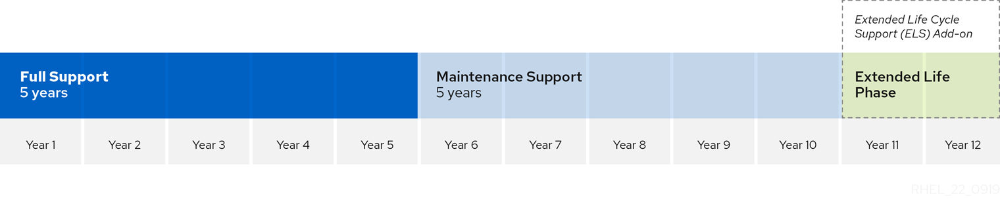
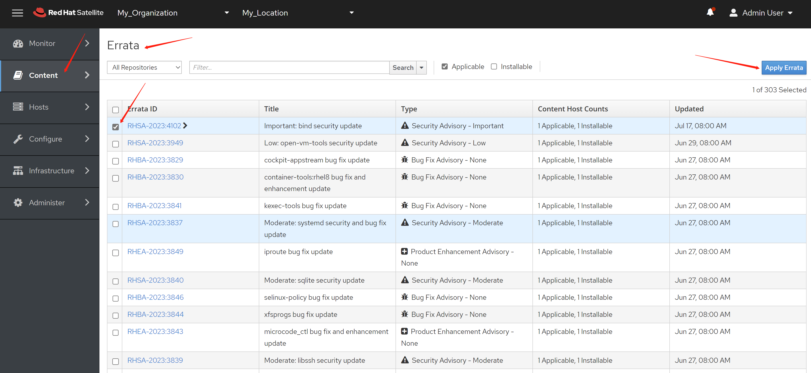

# 红帽操作系统更新策略解读和实践

[红帽官方有操作系统的路线图](https://access.redhat.com/support/policy/updates/errata)，简单说，rhel8有10年的生命周期，其中前5年时full support，会有新的特性和安全补丁，后面5年就只有安全补丁了。

官方的图在这里：



客户关心的是话多少钱的问题，那么我们可以看到，深蓝色，和浅蓝色的部分，客户只要标准订阅的钱就可以了，但是如果在浅绿色的部分，客户想要新的补丁，那么就要满一个叫EUS的订阅，他比标准的订阅贵。如果不买EUS，那么在浅绿色的时间段里面，客户就拿不到新补丁了，或者说，客户使用新的补丁，就是违反红帽订阅协议的。

说完了RHEL8，9这样大版本的补丁问题，那么小版本呢？

我们客户常见的使用场景是，应用开发的时候，使用和适配了某一个小版本，比如rhel 8.5，由于各种原因，比如成本考虑，后面并不想改变这个rhel 8.5的基础镜像，那么能一直这么使用吗？什么时候需要升级rhel 8.5这个基础镜像，什么时候可以修修补补打打补丁就完事了，怎么操作呢？

这个问题，就要看红帽关于小版本的一个发布路线图了，官方的图在这里：


这个图有很多细节，需要特别的关注
1. 如果我们关注 rhel 8.5，会发现，他只有小半年的生命周期
2. 当 rhel 8.6 发布以后，新的补丁，会进入 rhel 8.6 的发布通道，rhel 8.5 的发布通道就没有新的补丁了
3. 客户如何绑定到 rhel 8.6，后面不想升级了，那么过了半年，会进入浅蓝色的时间段，在这个阶段，客户需要购买 EUS 订阅服务，这个服务前面说过，会贵一点，有了EUS订阅服务，客户就可以在浅蓝色的时间段里面，获得大概多1年半的 rhel 8.6 的补丁更新。
4. 浅绿色的时间段里面，是红帽给SAP的特定的补丁支持时间，会有更多的2年的补丁更新，但是需要一个for sap的订阅服务，这个会更贵一些，一般不推荐普通客户购买。

所以，总结下来，如果客户的现状是使用rhel 8.5来做基础镜像，而目前rhel的发版，已经到了 rhel 8.8，那么客户有如下的解决方案:
1. 客户继续使用 rhel 8.5，然后从 rhel 8的大版本更新通道中，客户自己选择需要打的补丁，自己打到 rhel 8.5 的基础镜像中。
2. 客户购买标准订阅服务，基础镜像升级到最新的偶数版本，如rhel 8.8，半年以后，购买EUS订阅服务，获得半年左右的rhel 8.8的扩展周期补丁支持，等到 rhel 8.10 发布，升级基础镜像到 rhel 8.10，升级以后，购买标准订阅服务就可以了。
3. 客户购买标准订阅服务，跟随红帽的rhel8的小版本发布周期，大概每半年做一次基础镜像升级，一直到rhel 8.10，之后就稳定在rhel 8.10 大概5年。

这3种方案优缺点对比如下:

| 方案                         | 订阅                    | 优点                                     | 缺点                               |
| ---------------------------- | ----------------------- | ---------------------------------------- | ---------------------------------- |
| 保持在rhel 8.5               | 标准订阅                | 基础镜像稳定，开发适配投入小，订阅成本低 | 补丁方案自定义，运维责任大         |
| 按照偶数版本升级8.8->8.10    | 标准订阅->EUS->标准订阅 | 基础镜像相对稳定，红帽推荐升级方案       | 开发适配投入高一些，订阅成本高一些 |
| 按照小版本升级8.8->8.9->8.10 | 标准订阅                | 订阅成本低                               | 开发适配投入高                     |

最后，如果客户的基础镜像维护策略，就是按需打补丁，那么就使用方案1，因为不管客户使用的是哪个rhel8的小版本，只要有红帽的标准订阅，最新的rhel8补丁，都是可以用的，只不过需要运维组来做自己的补丁方案和实施。

以下是当前rhel8的内容分发通道，可以看到，如果把内容分发通道设置到8，就能获得最新的rpm和补丁，也就是8这个通道，对应的是最新的小版本。

```bash
subscription-manager release --list
# +-------------------------------------------+
#           Available Releases
# +-------------------------------------------+
# 8
# 8.0
# 8.1
# 8.2
# 8.3
# 8.4
# 8.5
# 8.6
# 8.7
# 8.8
```

# satellite

如何客户部署了satellite来加速注册和内容分发，那么获得最新补丁和分发，就有更快更方便的做法了。

首先，我们要在satellite里面，激活 rhel 8 的分发渠道


然后，我们就可以在satellite里面看到errata，这个是红帽漏洞和补丁的信息发布通道。



如果我们satellite是最基础的安装，那么apply errata是没有作用的。我们记录下来这个errata的名字：

然后在一台被管理主机上运行：

```bash
# unset release, it is equal to set to '8'
subscription-manager release --unset

dnf update --advisory=

```


