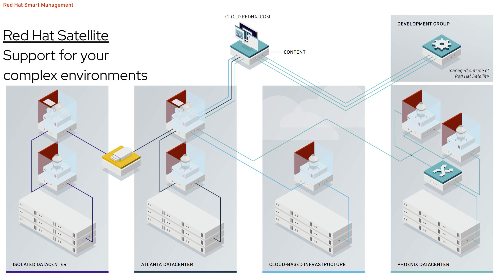

# RHEL 订阅在线注册相关问题

## 在线注册过程
国内客户，购买了rhel订阅以后，就可以把自己的系统，在线注册了。一般用如下的命令：
```bash
subscription-manager register --auto-attach --username ********* --password ********
```
上述命令在国内的网络情况下，经常出现速度慢，超时等错误。这是因为，register过程，要访问国外的服务器(subscription.rhsm.redhat.com)。那我们可以搞一个proxy，然后让注册过程走proxy，就能加速。
```bash
export PROXY="127.0.0.1:18801"

subscription-manager register --proxy=$PROXY --auto-attach --username ********* --password ********
```
官方知识库： https://access.redhat.com/solutions/253273
### debug
如果不太清楚慢的原因，那么就需要打开rhsm的log，看看日志，确定问题原因了。
```bash
sed -i 's/default_log_level = .*/default_log_level = DEBUG/' /etc/rhsm/rhsm.conf

subscription-manager status

cat /var/log/rhsm/rhsm.log
```
### 后台持续访问红帽服务器
rhsm带了一些服务，其中有一个服务 rhsmcertd.service 默认是激活的。
```bash
systemctl list-unit-files | grep rhsm
# rhsm-facts.service                         disabled
# rhsm.service                               disabled
# rhsmcertd.service                          enabled

systemctl cat rhsmcertd.service
# # /usr/lib/systemd/system/rhsmcertd.service
# [Unit]
# Description=Enable periodic update of entitlement certificates.
# After=network.target

# [Service]
# Type=forking
# ExecStart=/usr/bin/rhsmcertd

# [Install]
# WantedBy=multi-user.target
```
我们可以看到，它启动了一个系统管理的服务，我们可以```man rhsmcertd```看看这个服务是做什么的。原来，它是定期去红帽服务器检查和更新证书的。我们是在线系统，留着它就好。
### Simple Content Access
红帽提供了一种新的消费订阅的模式，Simple Content Access，原来管理员需要一台主机一台主机的register, 然后在主机上添加订阅。这么操作有点麻烦。在新的 SCA 模式下，管理员只需要 register 这个主机就可以了，主机可以使用任何当前 org 下的订阅。

那问题来了，怎么保证订阅用来不超额呢？答案是，没办法。红帽的 SCA 政策，就是变相的鼓励大家超用订阅，然后第二年红帽销售就有理由管客户多要一笔钱了。这也是为什么，笔者不建议对订阅数量敏感的客户，激活SCA模式的原因。

官方文档：
- [Simple Content Access](https://access.redhat.com/articles/simple-content-access)
- [Simple Content Access - FAQ](https://access.redhat.com/articles/4903191)
### 取消订阅过程
如果vm要销毁了，那么怎么取消订阅的使用呢，很简单。但是一定要记得，在vm销毁之前运行哦。。。
```bash
subscription-manager unregister
```
## 离线注册过程
如果客户网络情况太特殊，那么我们还可以走离线注册过程。背后的原理是，之前的在线注册，经过用户名密码验证后，系统会下载一个证书，保存在系统里面，后续再和红帽系统建立连接，就使用这个证书了。

离线注册流程，就是去手动下载这个证书，导入到系统中去，然后走后续流程。

具体步骤，见这个在线知识库： https://access.redhat.com/solutions/3121571

## CCSP订阅的注册过程
CCSP订阅是为云主机厂商提供的一种订阅方式。有了CCSP订阅，云主机厂商需要去维护一套RHUI（Red Hat Update Infrastructure），然后云上的rhel都去访问RHUI来获得更新。

## rpm CDN 加速
上面说的都是注册过程，注册完了，就是下载rpm了。红帽的rpm有全球的CDN加速，由于众所周知的原因，如果客户感觉下载慢，可以切换国内的CDN
```bash
subscription-manager config --rhsm.baseurl=https://china.cdn.redhat.com
subscription-manager refresh
yum clean all
yum makecache
```
官方知识库： https://access.redhat.com/solutions/5090421

## satellite
企业用户的私有云，都是离线的环境。红帽提供了一个产品叫satellite，相当于一个注册服务器的代理和rpm源的私有CDN。



## local repo mirror
如果客户认为使用satellite太复杂，部署太麻烦，那么还有一种笨拙，但是简单的方法，就是先注册一台主机，把红帽官方的repo给镜像到本地，在这个主机上开启web服务，把这个主机给变成一个本地repo源。其他主机指向这个本地源就可以了。

官方知识库： https://access.redhat.com/solutions/23016

## 第二年续订

通常，rhel订阅都是一年的，第二年续订就好。。。但是，续订以后，大部分情况，订阅号会改变，这种情况下，rhel上要做什么操作呢？需要刷新，并重新绑定。

```bash
# 刷新订阅信息
subscription-manager refresh

# 自动选择匹配的订阅附加
subscription-manager auto-attach
```

如果不清楚，或者忘记了有什么订阅了？那么用以下命令查看

```bash
# 此命令是查看当前账号下所有可用的有效订阅，其中也可以看到每个订阅的有效期
subscription-manager list --available

# 此命令是查看当前这台机器所消耗的订阅类型，其中也包括有效时间
subscription-manager list --consumed

```