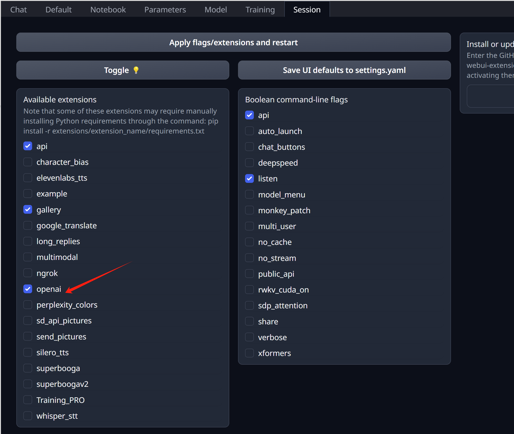

# 在 jetson 上运行 codellama 服务

我们想测试一下，在低功耗设备上，运行大语言模型的体验。我们一般的主机GPU是300瓦的，我们搞到一个低功耗设备，jetson，大概60瓦，算力是主机的1/10。就让我们来试试，这种设备运行大语言模型，是个什么情况。

我们先要根据nvidia官方的步骤，用sdk manager来初始化jetson，然后我们就用docker，来加载官方容器，运行runtime加载codellama模型。由于低功耗设备的限制，我们选择量化以后的模型测试

```bash
# 安装一些驱动
apt install nvidia-jetpack

# 启动官方容器镜像
mkdir -p /data.root/huggingface/

docker run --runtime nvidia -it --rm --network=host \
  -v /data.root/huggingface/:/data/huggingface/:Z \
  docker.io/dustynv/text-generation-webui:1.7-r35.4.1 bash

# 在容器的console里面，运行如下命令，启动服务
cd /opt/text-generation-webui && python3 server.py \
  --model-dir=/data/huggingface/ \
  --chat \
  --listen \
  --api

# using codellama-7b-instruct.Q4_K_M.gguf
# llama_print_timings:        load time =    1334.00 ms
# llama_print_timings:      sample time =      43.19 ms /    99 runs   (    0.44 ms per token,  2292.30 tokens per second)
# llama_print_timings: prompt eval time =       0.00 ms /     1 tokens (    0.00 ms per token,      inf tokens per second)
# llama_print_timings:        eval time =   17115.21 ms /    99 runs   (  172.88 ms per token,     5.78 tokens per second)
# llama_print_timings:       total time =   17603.12 ms
# Output generated in 18.52 seconds (5.29 tokens/s, 98 tokens, context 144, seed 1410294763)


# codellama-13b-instruct.Q5_K_M.gguf
# llama_print_timings:        load time =    2252.35 ms
# llama_print_timings:      sample time =      71.13 ms /   215 runs   (    0.33 ms per token,  3022.51 tokens per second)
# llama_print_timings: prompt eval time =    2251.86 ms /   144 tokens (   15.64 ms per token,    63.95 tokens per second)
# llama_print_timings:        eval time =   71034.23 ms /   214 runs   (  331.94 ms per token,     3.01 tokens per second)
# llama_print_timings:       total time =   74247.41 ms
# Output generated in 75.16 seconds (2.85 tokens/s, 214 tokens, context 144, seed 967651592)


```

启动服务以后，我们在界面上操作就可以啦。
1. active openai in setting



2. 在 webui 中下载模型, TheBloke/CodeLlama-13B-Instruct-GGUF -> codellama-13b-instruct.Q5_K_M.gguf


3. 选择模型，配置参数，运行就好了


# 运行效果

是真的慢啊，2 token/s，而且量化以后的结果，质量有肉眼可见的下降。如果用7B的量化模型，会到 5 token/s

# 对比

我们在服务器上，用服务器的GPU，相同的量化模型文件，跑一下，看看性能如何，有个大概的对比，有个基本概念。

```bash

podman run --rm -it --device nvidia.com/gpu=0 --network=host \
  -v ./huggingface/:/data/huggingface/:Z \
  docker.io/atinoda/text-generation-webui:default-nvidia bash

python3 server.py \
  --model-dir=/data/huggingface/ \
  --chat \
  --listen \
  --api

# using codellama-7b-instruct.Q4_K_M.gguf
# llama_print_timings:        load time =      71.61 ms
# llama_print_timings:      sample time =     314.14 ms /   168 runs   (    1.87 ms per token,   534.80 tokens per second)
# llama_print_timings: prompt eval time =       0.00 ms /     1 tokens (    0.00 ms per token,      inf tokens per second)
# llama_print_timings:        eval time =    1708.02 ms /   168 runs   (   10.17 ms per token,    98.36 tokens per second)
# llama_print_timings:       total time =    2370.25 ms /   169 tokens
# Output generated in 2.84 seconds (58.85 tokens/s, 167 tokens, context 144, seed 688943953)

# using codellama-13b-instruct.Q5_K_M.gguf
# ......
# llama_print_timings:        load time =     109.66 ms
# llama_print_timings:      sample time =     420.28 ms /   221 runs   (    1.90 ms per token,   525.84 tokens per second)
# llama_print_timings: prompt eval time =     109.43 ms /   144 tokens (    0.76 ms per token,  1315.93 tokens per second)
# llama_print_timings:        eval time =    3500.29 ms /   220 runs   (   15.91 ms per token,    62.85 tokens per second)
# llama_print_timings:       total time =    4508.98 ms /   364 tokens
# Output generated in 4.96 seconds (44.37 tokens/s, 220 tokens, context 144, seed 1156313772)


```