# 使用 code llama 配合 vscode 来做代码自动补全

github copilot 是非常优秀的vscode插件，可以让程序员访问到gpt-4的能力，做代码补全和问答，一切都在vscode里面，但是如果我们是企业应用场景，数据是不能离开企业局域网的，那么我们就需要自己搭建一个类似的内网服务，来做代码补全。

我们使用code llama来提供代码补全的服务，使用vscode来访问这个服务。

整体部署架构如下：

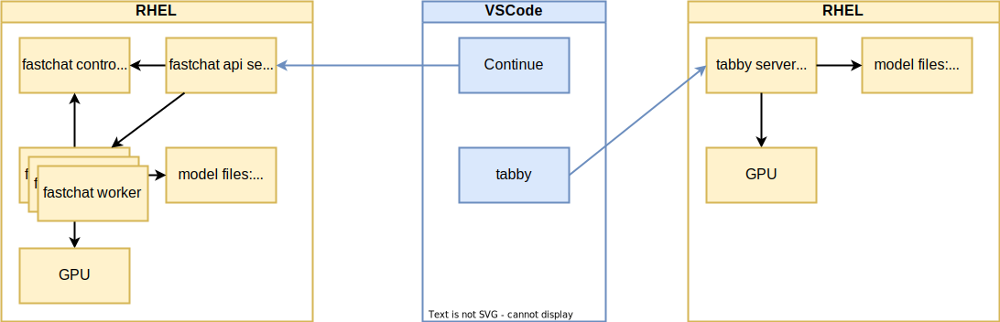

<!-- 本文写作逻辑结构如下：

 -->

# 使用 continue 来支持 chat

## 部署 code llama

我们选择 CodeLlama-34b-Instruct-hf ， CodeLlama-13b-Instruct-hf 这两个模型，对比一下。

- https://huggingface.co/codellama/CodeLlama-34b-Instruct-hf
- https://huggingface.co/codellama/CodeLlama-13b-Instruct-hf

```bash
# we use fastchat to host code llama service

conda activate /data/env/jupyter
# conda deactivate

cd /data/workspace/jupyter/yanshu

# on a new tab, create control service
python -m fastchat.serve.controller

# on a new tab, create api service
python -m fastchat.serve.openai_api_server --host 0.0.0.0 --port 8000

# on a new tab, run the code llama service
export CUDA_VISIBLE_DEVICES=0
python -m fastchat.serve.model_worker --model-path /data/huggingface/CodeLlama-34b-Instruct-hf --debug DEBUG

# if running on multiple gpu
export CUDA_VISIBLE_DEVICES=2,3,4,5
python -m fastchat.serve.model_worker --model-path /data/huggingface/CodeLlama-34b-Instruct-hf --num-gpus 4 --max-gpu-memory 20Gib --debug DEBUG

# does not work, do not know why
# unset CUDA_VISIBLE_DEVICES
# python -m fastchat.serve.model_worker --model-path /data/huggingface/CodeLlama-34b-Instruct-hf --gpus 2,3 --debug DEBUG

# if using 13B model
export CUDA_VISIBLE_DEVICES=0
python -m fastchat.serve.model_worker --model-path /data/huggingface/CodeLlama-13b-Instruct-hf --debug DEBUG

```

CodeLlama-34b-Instruct-hf

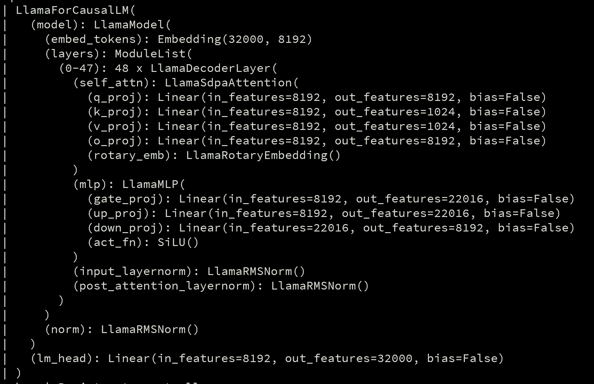

CodeLlama-13b-Instruct-hf

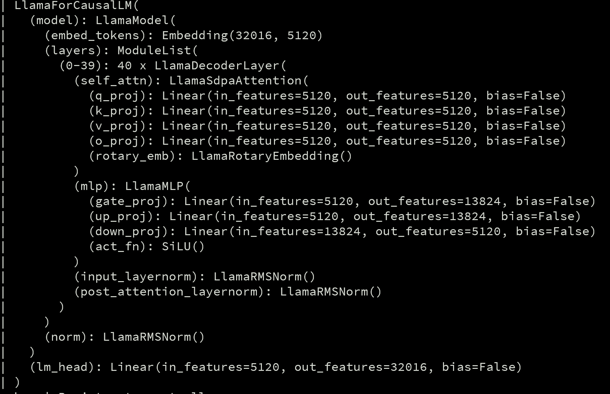


## 部署 vscode 插件 continue

我们使用vscode的插件 Continue， 来访问code llama服务。

- https://continue.dev/docs/intro

安装好 continue 插件以后，按照官方文档，我们做一下配置，后端服务指向 code llama

- https://continue.dev/docs/reference/Model%20Providers/openai
- https://continue.dev/docs/walkthroughs/codellama

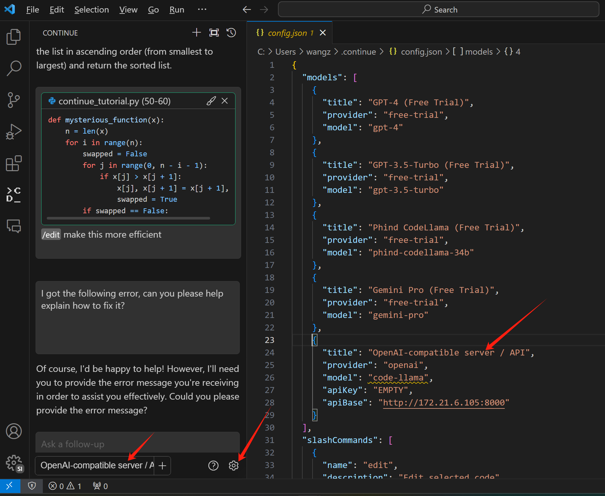

修改 ~/.continue/config.json , 把下面的配置，添加进去

```json
{
  "models": [
    {
      "title": "OpenAI-compatible server / API",
      "provider": "openai",
      "model": "CodeLlama-34b-Instruct-hf",
      "apiKey": "EMPTY",
      "apiBase": "http://172.21.6.105:8000/v1"
    }
  ]
}

```

如果是13B的模型，改成这样

```json
{
  "models": [
    {
      "title": "OpenAI-compatible server / API",
      "provider": "openai",
      "model": "CodeLlama-13b-Instruct-hf",
      "apiKey": "EMPTY",
      "apiBase": "http://172.21.6.105:8000/v1"
    }
  ]
}

```

## 使用体验

然后我们就赶快来试试吧。真的还不错呢。

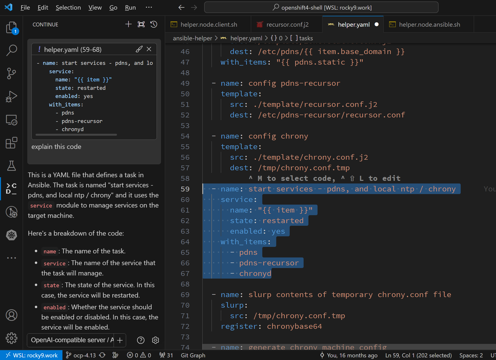

当然，我们也能看到，continue的使用逻辑，和copilot是不一样的，更像copilot chat，也就是他并不是随着用户编辑代码，给出实时的建议，而是通过对话框的方式，给出答案。不过，作为开源的方案，也不错啦。未来continue会支持自动补全，这个要看后续版本了。

codellama对中文支持有点限制，能看明白中文的提问，但是如果没有特别指示，回答就是英文的。这里就需要明确要求他用中文问答，这个后续可以尝试在提示词环节调整，来改善。

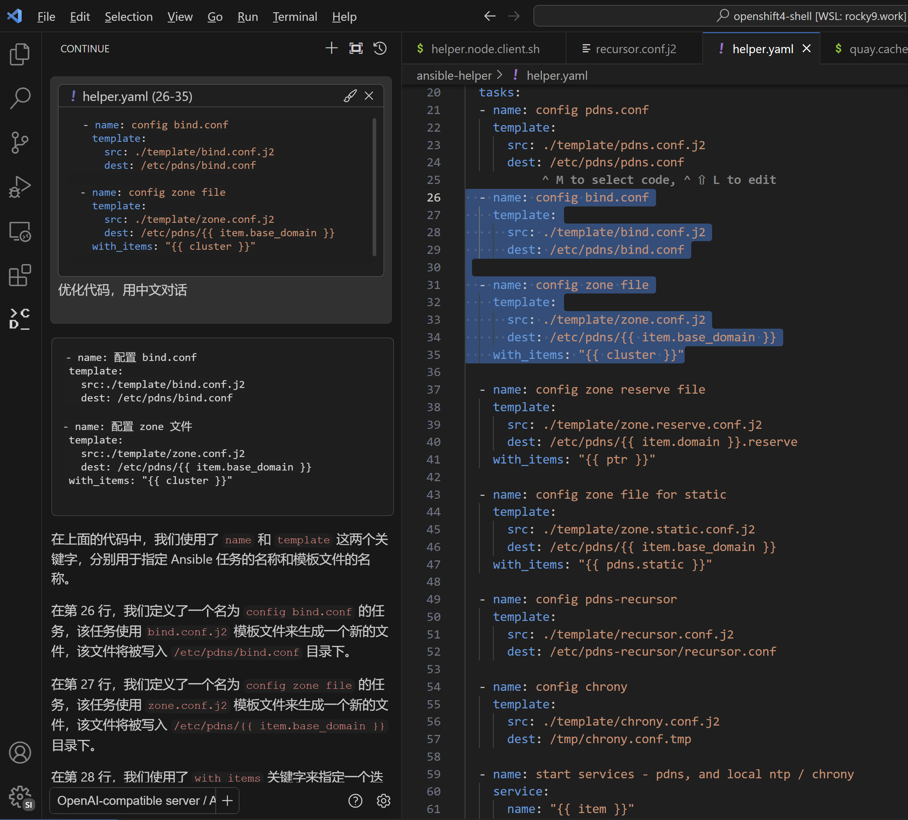

13B和34B模型的对比，体验下来，13B的效果还不错，而且计算速度快很多，所以我们选择13B的模型。

## GPU 消耗

当我们通过vscode插件continue去访问code llama，来给代码提供各种分析的时候，GPU消耗还是很夸张的，gpu 基本100%了。资源不够的话，只能选择小一些的模型了。后面ocp部署实验，我们就选择13B的小一些的模型了。

# 使用 tabby 来支持自动补全

目前continue项目只支持类似copilot chat的服务，也就是需要在vscode里面单独开一个sidecar，然后通过对话框的方式，来和模型交互。未来continue会支持copilot的自动补全功能，但是目前还没有，为了支持自动补全，我们可以使用tabby。

- https://tabby.tabbyml.com/docs/getting-started/

## 部署 tabby 服务端

我们按照文档，来部署tabby服务端

```bash

# create a workspace, and sync LLM into it
mkdir -p /data/workspace/tabby/models

# copy the models into workspace
VAR_HOST=144.202.112.104

while true; do
  rsync -aHAXxv --numeric-ids --delete -P -e "ssh -T -c aes256-gcm@openssh.com -x -o Compression=no -o ProxyCommand='connect-proxy -S 172.21.1.211:18805 %h %p'" root@${VAR_HOST}:/root/.tabby/models/  /data/workspace/tabby/models/
  if [ $? -eq 0 ]; then
        break
  fi
  sleep 1  # Optional: waits for 1 second before trying again
done

# start the tabby service

# https://docs.nvidia.com/datacenter/cloud-native/container-toolkit/latest/install-guide.html#configuring-podman
# https://docs.nvidia.com/datacenter/cloud-native/container-toolkit/latest/cdi-support.html

dnf install -y nvidia-container-toolkit

# nvidia-ctk runtime configure --runtime=crio
# INFO[0000] Loading config: /etc/crio/crio.conf
# INFO[0000] Config file does not exist; using empty config
# INFO[0000] Successfully loaded config
# INFO[0000] Wrote updated config to /etc/crio/crio.conf
# INFO[0000] It is recommended that crio daemon be restarted.

# systemctl restart crio

nvidia-ctk cdi generate --output=/etc/cdi/nvidia.yaml
# ...
# INFO[0078] Generated CDI spec with version 0.5.0

nvidia-ctk cdi list
# INFO[0000] Found 2 CDI devices
# nvidia.com/gpu=0
# nvidia.com/gpu=1
# nvidia.com/gpu=all

# 如果你希望使用所有的gpu，可以使用 nvidia.com/gpu=all
# podman  run -it --device nvidia.com/gpu=all  -p 18180:8080 \
#     -v /data/workspace/tabby:/data:Z \
#     docker.io/tabbyml/tabby serve --model TabbyML/CodeLlama-13B --device cuda

# 我们指定一个gpu
podman run --rm -it --device nvidia.com/gpu=1  \
    -p 18180:8080 \
    -v /data/workspace/tabby:/data:Z \
    docker.io/tabbyml/tabby serve --model TabbyML/CodeLlama-13B --device cuda


```

## 安装 vscode 插件 tabby

在vscode里面，下载安装tabby，并配置api地址

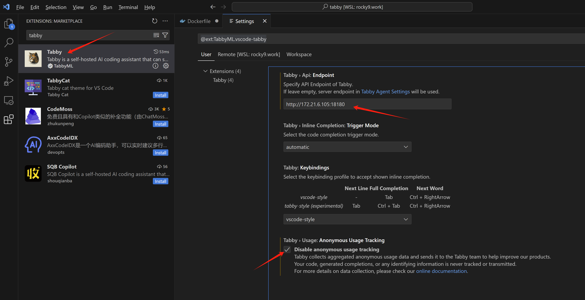

## 使用体验

我们赶快来试试吧。真的还不错呢。

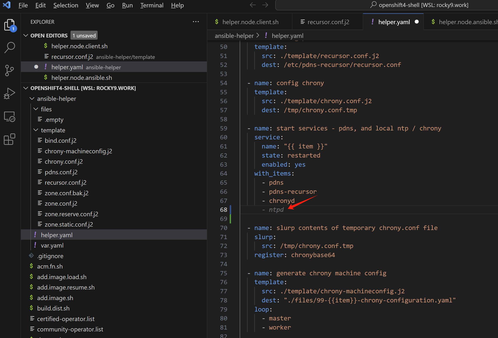

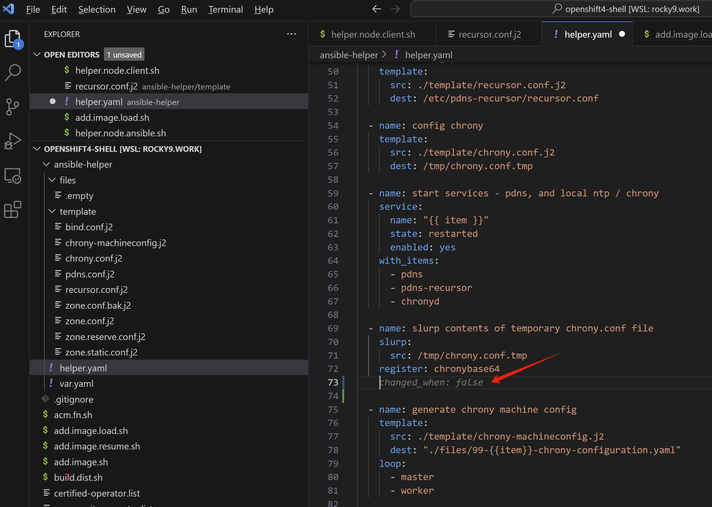

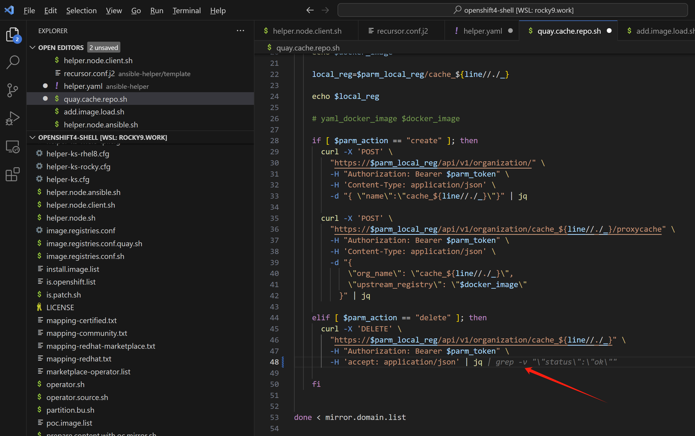

