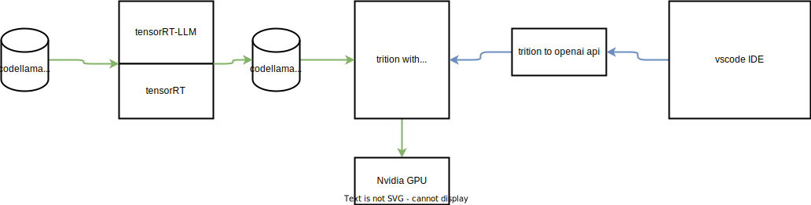
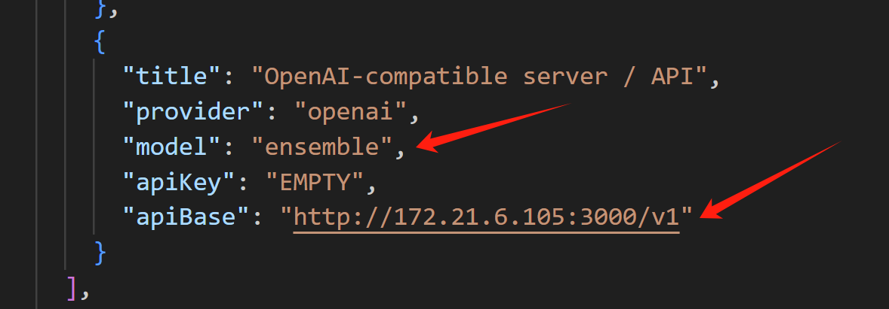
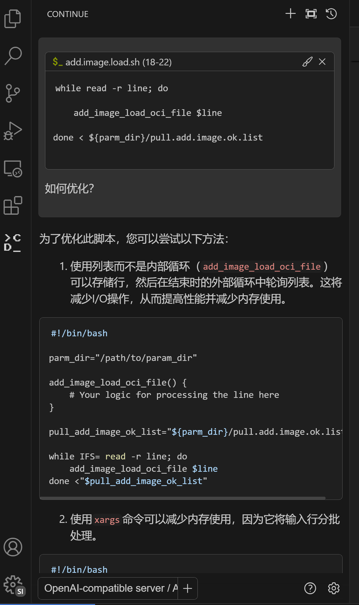

# TensorRT-LLM triton backend with openAI api

作者知道tensorRT是NV家的加速库，但是之前一直没机会和动力去试用，到了LLM时代，NV推出了tensorRT-LLM，用于LLM的推理加速，这个我们就有动力去试试了，因为我们迫切需要LLM的推理加速，但是想使用tensorRT-LLM，一般是匹配NV家的trition服务端，但是这个服务端好像是没有openai api接口的，这就导致我们有大量的开源客户端，没办法用，今天，我们就补足这个短板，端到端的跑一遍。

我们尝试使用 TensorRT-LLM 来做推理服务，并且对外提供openai api作为接口。

本次实验的开始，是这样一个项目，他是给trtllm做openai前端的，但是随着研究的深入，我们进行了一系列的折腾，包括安装trition服务，匹配tensorRT版本，ngc官网下载容器运行，自己编译容器镜像等等。最终形成了本文档的操作过程。
- https://github.com/npuichigo/openai_trtllm

目前，作者理解的tensorRT-LLM，已经相关部署架构逻辑图，如下：



TensorRT-LLM是一个加速库，是在 TensorRT 基础上，专门为LLM场景做的加速库。要使用 TensorRT-LLM，我们肯定首选NV家的推理服务trition，但是trition并不支持openAI api，所以，我们还需要弄个第三方的封装。

据说，未来TensorRT会直接加上对openAI api的支持，我们就会有更简洁的使用 TensorRT 的方法。
- [Provide an interface similar to OpenAI API #334](https://github.com/NVIDIA/TensorRT-LLM/issues/334)

issues with llama2
- [No white space included in tokens sent back by Llama2 in streaming mode #332](https://github.com/triton-inference-server/tensorrtllm_backend/issues/332)

# TensorRT backend

官方的trition inference server有关于如何使用trensorRT-llm的文档。

- https://github.com/triton-inference-server/tensorrtllm_backend#using-the-tensorrt-llm-backend

# build trition with verison 0.7.2

经过了无穷无尽的折腾，终于摸索出来了，就是使用trition backend这个项目的，参考文档，直接编译，这样他会使用trition官方的镜像，然后编译trensorRT-llm backend 并且和trition打包在一起，这样就不会有兼容性等各种莫名其妙的问题。

## 下载模型

```bash

mkdir -p /data/workspace/openai_trtllm

cd /data/workspace/openai_trtllm

git clone --recursive https://github.com/npuichigo/openai_trtllm.git

cd openai_trtllm

git lfs install
git clone https://huggingface.co/baichuan-inc/Baichuan2-13B-Chat models/download/Baichuan2-13B-Chat


```

## build trition backend

我们就编译trition trnsorrtllm backend，实践证明，用ngc官网下载的，很不好匹配版本，还是自己编译比较靠谱。

```bash


cd /data/workspace/openai_trtllm/

rm -rf tensorrtllm_backend

git clone --branch v0.7.2 --recursive   https://github.com/triton-inference-server/tensorrtllm_backend

cd tensorrtllm_backend

# Use the Dockerfile to build the backend in a container
# For x86_64
# 我们自定义一下
# 主要是添加了proxy，让python库下载快一点
export PROXY="http://172.21.6.8:18801"
DOCKER_BUILDKIT=1 docker build --env http_proxy=${PROXY} \
    --env https_proxy=${PROXY} \
    --env "no_proxy=localhost,127.0.0.1,172.21.0.0/16,192.168.0.0/16,10.0.0.0/8,.aliyuncs.com,.wzhlab.top,.nvidia.com,.nvidia.cn" \
    -t quay.io/wangzheng422/qimgs:triton_trt_llm-0.7.2 -f dockerfile/Dockerfile.trt_llm_backend .

podman push quay.io/wangzheng422/qimgs:triton_trt_llm-0.7.2

podman image ls
# REPOSITORY                   TAG                                            IMAGE ID      CREATED            SIZE
# quay.io/wangzheng422/qimgs   triton_trt_llm-0.7.2                           63319b9f941a  14 minutes ago     43.9 GB


```

## build engine on gpu

on 1 A800

- https://github.com/triton-inference-server/tensorrtllm_backend/blob/v0.7.2/docs/baichuan.md

```bash

cd /data/workspace/openai_trtllm/

# 我们运行服务
podman run --name wzh-triton --rm -it --net host \
    --device nvidia.com/gpu=0   \
    -v /data/workspace/openai_trtllm/openai_trtllm/models/:/models:z \
    -v /data/workspace/openai_trtllm/tensorrtllm_backend:/wzh_src/tensorrtllm_backend:z \
    quay.io/wangzheng422/qimgs:triton_trt_llm-0.7.2 bash

# run in the container console.
# pip3 install sentencepiece

# in the container console
# cd /app/tensorrt_llm/examples/baichuan

# pip3 install -r requirements.txt

# pip install Xformers

export HF_BAICHUAN_MODEL=/models/download/Baichuan2-13B-Chat/
export ENGINE_DIR=/models/baichuan_v2_13b/trt_engines/fp16/1-gpu/
python3 /app/tensorrt_llm/examples/baichuan/build.py \
    --model_dir ${HF_BAICHUAN_MODEL} \
    --model_version v2_13b \
    --dtype float16 \
    --max_input_len 4096 \
    --max_output_len 1024 \
    --remove_input_padding \
    --use_gpt_attention_plugin float16 \
    --enable_context_fmha \
    --use_gemm_plugin float16 \
    --output_dir $ENGINE_DIR \
    --paged_kv_cache \
    --max_batch_size 64 \
    --use_inflight_batching


```

## run in normal mode

普通模式，是一次性返回的运行模式，大部分LLM的运行模式，都是流模式。

```bash

export HF_BAICHUAN_MODEL=/models/download/Baichuan2-13B-Chat/
export ENGINE_DIR=/models/baichuan_v2_13b/trt_engines/fp16/1-gpu/
export VAR_DIR=/models/baichuan/

cd /wzh_src/tensorrtllm_backend/
cp all_models/inflight_batcher_llm/* ${VAR_DIR} -rf

python3 tools/fill_template.py -i ${VAR_DIR}/preprocessing/config.pbtxt tokenizer_dir:${HF_BAICHUAN_MODEL},tokenizer_type:auto,triton_max_batch_size:64,preprocessing_instance_count:1
python3 tools/fill_template.py -i ${VAR_DIR}/postprocessing/config.pbtxt tokenizer_dir:${HF_BAICHUAN_MODEL},tokenizer_type:auto,triton_max_batch_size:64,postprocessing_instance_count:1
python3 tools/fill_template.py -i ${VAR_DIR}/tensorrt_llm_bls/config.pbtxt triton_max_batch_size:64,decoupled_mode:False,bls_instance_count:1,accumulate_tokens:False
python3 tools/fill_template.py -i ${VAR_DIR}/ensemble/config.pbtxt triton_max_batch_size:64
python3 tools/fill_template.py -i ${VAR_DIR}/tensorrt_llm/config.pbtxt triton_max_batch_size:64,decoupled_mode:False,max_beam_width:1,engine_dir:$ENGINE_DIR,max_tokens_in_paged_kv_cache:2560,max_attention_window_size:2560,kv_cache_free_gpu_mem_fraction:0.5,exclude_input_in_output:True,enable_kv_cache_reuse:False,batching_strategy:inflight_batching,max_queue_delay_microseconds:600


python3 /app/scripts/launch_triton_server.py --world_size 1 --model_repo /models/${VAR_DIR}


# testing
curl -X POST localhost:8000/v2/models/ensemble/generate -d '{"text_input": "What is machine learning?", "max_tokens": 20, "bad_words": "", "stop_words": "", "pad_id": 2, "end_id": 2}' | jq .
# {
#   "cum_log_probs": 0.0,
#   "model_name": "ensemble",
#   "model_version": "1",
#   "output_log_probs": [
#     0.0,
#     0.0,
#     0.0,
#     0.0,
#     0.0,
#     0.0,
#     0.0,
#     0.0,
#     0.0,
#     0.0,
#     0.0,
#     0.0,
#     0.0,
#     0.0,
#     0.0,
#     0.0,
#     0.0,
#     0.0,
#     0.0,
#     0.0
#   ],
#   "sequence_end": false,
#   "sequence_id": 0,
#   "sequence_start": false,
#   "text_output": "\nMachine learning is a subset of artificial intelligence (AI) that focuses on the development of algorithms and"
# }


curl -X POST localhost:8000/v2/models/ensemble/generate -d '{"text_input": "What is machine learning?", "max_tokens": 20, "bad_words": ["intelligence","model"], "stop_words": ["focuses","learn"], "pad_id": 2, "end_id": 2}' | jq .
# {
#   "cum_log_probs": 0.0,
#   "model_name": "ensemble",
#   "model_version": "1",
#   "output_log_probs": [
#     0.0,
#     0.0,
#     0.0,
#     0.0,
#     0.0,
#     0.0,
#     0.0,
#     0.0,
#     0.0,
#     0.0,
#     0.0,
#     0.0,
#     0.0,
#     0.0,
#     0.0,
#     0.0,
#     0.0,
#     0.0,
#     0.0,
#     0.0
#   ],
#   "sequence_end": false,
#   "sequence_id": 0,
#   "sequence_start": false,
#   "text_output": "\nMachine learning is a subset of artificial intelligence (AI) that focuses on the development of algorithms and"
# }

curl -X POST localhost:8000/v2/models/tensorrt_llm_bls/generate -d '{"text_input": "What is machine learning?", "max_tokens": 20, "bad_words": "", "stop_words": "", "pad_id": 2, "end_id": 2}' | jq .
# {
#   "cum_log_probs": 0.0,
#   "model_name": "tensorrt_llm_bls",
#   "model_version": "1",
#   "output_log_probs": [
#     0.0,
#     0.0,
#     0.0,
#     0.0,
#     0.0,
#     0.0,
#     0.0,
#     0.0,
#     0.0,
#     0.0,
#     0.0,
#     0.0,
#     0.0,
#     0.0,
#     0.0,
#     0.0,
#     0.0,
#     0.0,
#     0.0,
#     0.0
#   ],
#   "text_output": "\nMachine learning is a subset of artificial intelligence (AI) that focuses on the development of algorithms and"
# }


# on host console
podman exec -it wzh-triton bash

# in container console
export HF_BAICHUAN_MODEL=/models/download/Baichuan2-13B-Chat/
python3 inflight_batcher_llm/client/inflight_batcher_llm_client.py --request-output-len 200 --tokenizer-dir ${HF_BAICHUAN_MODEL}

# =========
# Input sequence:  [27569, 1374, 8482, 63, 32087, 7212, 92323, 1394, 66763, 13597, 1449, 1346]
# Got completed request
# Input: Born in north-east France, Soyer trained as a
# Output beam 0:  top restaurants. He was a protégé of the celebrated chef Marie-Antoine Carême, who is considered the father of French haute cuisine.

# In 1847, Soyer moved to London and became chef at the Reform Club, where he introduced a new style of cooking, now known as "Soyerism". This involved using economical cuts of meat, creating new dishes using vegetables and grains, and simplifying cooking techniques.

# Soyer is best known for his cookbooks, which include "The Modern Housewife" (1849), "The Gastronomic Regenerator" (1854) and "The Shilling Cookery Book" (1855). These books contained recipes for simple, affordable dishes using everyday ingredients, and were aimed at the growing middle class.

# Soyer was also a social reformer and campaigned for better
# Output sequence:  [27194, 1374, 8628, 1377, 4734, 1374, 1773, 1376, 1352, 3215, 92404, 92319, 2608, 12051, 72, 1793, 1495, 1346, 2663, 49789, 93237, 1376, 1352, 16767, 27194, 23831, 63, 17212, 66827, 2972, 95489, 2588, 92323, 1642, 1414, 6270, 1352, 5812, 1376, 6558, 1502, 2364, 32771, 72, 5, 5, 1838, 92311, 92336, 92370, 92369, 92383, 92323, 1394, 66763, 6845, 1375, 4442, 1377, 4676, 27194, 1474, 1352, 24444, 6800, 92323, 2003, 1441, 9335, 1346, 1662, 5263, 1376, 16778, 92323, 2053, 3552, 1449, 1664, 92340, 66763, 2443, 92401, 72, 1956, 5305, 2774, 58849, 15661, 1376, 14681, 92323, 6622, 1662, 23091, 2774, 23917, 1377, 54239, 92323, 1377, 13020, 7322, 16778, 11436, 72, 5, 5, 92340, 66763, 1414, 2272, 3552, 1412, 1611, 5326, 18236, 92323, 1660, 3415, 1664, 1524, 13430, 4004, 41680, 92401, 1458, 92336, 92370, 92369, 92362, 1716, 1664, 1524, 100347, 2687, 18128, 4248, 2008, 2662, 92401, 1458, 92336, 92370, 92358, 92369, 92351, 1377, 1664, 1524, 2096, 5701, 11919, 2545, 5233, 92401, 1458, 92336, 92370, 92358, 92358, 92351, 72, 4181, 5348, 16481, 24509, 1412, 5384, 92323, 12195, 23091, 2774, 15345, 15276, 92323, 1377, 1738, 15750, 1474, 1352, 6021, 7480, 2280, 72, 5, 5, 92340, 66763, 1495, 1696, 1346, 3163, 10480, 1351, 1377, 4704, 1370, 1412, 2928]

```

## run in streaming mode

官方文档，还有一个流模式，可以来试试，结果差不多，就是输出的token是一个一个的输出的。大部分LLM客户端，都使用流模式，所以这个模式还挺重要的。

```bash
# 我们运行服务
podman run --name wzh-triton --rm -it --net host \
    --device nvidia.com/gpu=0   \
    -v /data/workspace/openai_trtllm/openai_trtllm/models/:/models:z \
    -v /data/workspace/openai_trtllm/tensorrtllm_backend:/wzh_src/tensorrtllm_backend:z \
    quay.io/wangzheng422/qimgs:triton_trt_llm-0.7.2 bash

# on container console
export HF_BAICHUAN_MODEL=/models/download/Baichuan2-13B-Chat/
export ENGINE_DIR=/models/baichuan_v2_13b/trt_engines/fp16/1-gpu/
export VAR_DIR=/models/baichuan/
cd /wzh_src/tensorrtllm_backend/
cp all_models/inflight_batcher_llm/* ${VAR_DIR} -rf

python3 tools/fill_template.py -i ${VAR_DIR}/preprocessing/config.pbtxt tokenizer_dir:${HF_BAICHUAN_MODEL},tokenizer_type:auto,triton_max_batch_size:64,preprocessing_instance_count:1
python3 tools/fill_template.py -i ${VAR_DIR}/postprocessing/config.pbtxt tokenizer_dir:${HF_BAICHUAN_MODEL},tokenizer_type:auto,triton_max_batch_size:64,postprocessing_instance_count:1
python3 tools/fill_template.py -i ${VAR_DIR}/tensorrt_llm_bls/config.pbtxt triton_max_batch_size:64,decoupled_mode:True,bls_instance_count:1,accumulate_tokens:True
python3 tools/fill_template.py -i ${VAR_DIR}/ensemble/config.pbtxt triton_max_batch_size:64
python3 tools/fill_template.py -i ${VAR_DIR}/tensorrt_llm/config.pbtxt triton_max_batch_size:64,decoupled_mode:True,max_beam_width:1,engine_dir:$ENGINE_DIR,max_tokens_in_paged_kv_cache:2560,max_attention_window_size:2560,kv_cache_free_gpu_mem_fraction:0.5,exclude_input_in_output:True,enable_kv_cache_reuse:False,batching_strategy:inflight_batching,max_queue_delay_microseconds:600


python3 /app/scripts/launch_triton_server.py --world_size 1 --model_repo /models/baichuan


# on another host console
# go into container console
podman exec -it wzh-triton bash

export HF_BAICHUAN_MODEL=/models/download/Baichuan2-13B-Chat/
python3 inflight_batcher_llm/client/inflight_batcher_llm_client.py --request-output-len 200 --tokenizer-dir ${HF_BAICHUAN_MODEL} --streaming

# ....
# [5]
# [5]
# [92340]
# [66763]
# [1495]
# [1696]
# [1346]
# [3163]
# [10480]
# [1351]
# [1377]
# [4704]
# [1370]
# [1412]
# [2928]
# Input: Born in north-east France, Soyer trained as a
# Output beam 0:  chef in Paris and worked in some of the city's top restaurants. He was a protégé of the celebrated chef Marie-Antoine Carême, who is considered the father of French haute cuisine.

# In 1847, Soyer moved to London and became chef at the Reform Club, where he introduced a new style of cooking, now known as "Soyerism". This involved using economical cuts of meat, creating new dishes using vegetables and grains, and simplifying cooking techniques.

# Soyer is best known for his cookbooks, which include "The Modern Housewife" (1849), "The Gastronomic Regenerator" (1854) and "The Shilling Cookery Book" (1855). These books contained recipes for simple, affordable dishes using everyday ingredients, and were aimed at the growing middle class.

# Soyer was also a social reformer and campaigned for better
# Output sequence:  [27569, 1374, 8482, 63, 32087, 7212, 92323, 1394, 66763, 13597, 1449, 1346, 27194, 1374, 8628, 1377, 4734, 1374, 1773, 1376, 1352, 3215, 92404, 92319, 2608, 12051, 72, 1793, 1495, 1346, 2663, 49789, 93237, 1376, 1352, 16767, 27194, 23831, 63, 17212, 66827, 2972, 95489, 2588, 92323, 1642, 1414, 6270, 1352, 5812, 1376, 6558, 1502, 2364, 32771, 72, 5, 5, 1838, 92311, 92336, 92370, 92369, 92383, 92323, 1394, 66763, 6845, 1375, 4442, 1377, 4676, 27194, 1474, 1352, 24444, 6800, 92323, 2003, 1441, 9335, 1346, 1662, 5263, 1376, 16778, 92323, 2053, 3552, 1449, 1664, 92340, 66763, 2443, 92401, 72, 1956, 5305, 2774, 58849, 15661, 1376, 14681, 92323, 6622, 1662, 23091, 2774, 23917, 1377, 54239, 92323, 1377, 13020, 7322, 16778, 11436, 72, 5, 5, 92340, 66763, 1414, 2272, 3552, 1412, 1611, 5326, 18236, 92323, 1660, 3415, 1664, 1524, 13430, 4004, 41680, 92401, 1458, 92336, 92370, 92369, 92362, 1716, 1664, 1524, 100347, 2687, 18128, 4248, 2008, 2662, 92401, 1458, 92336, 92370, 92358, 92369, 92351, 1377, 1664, 1524, 2096, 5701, 11919, 2545, 5233, 92401, 1458, 92336, 92370, 92358, 92358, 92351, 72, 4181, 5348, 16481, 24509, 1412, 5384, 92323, 12195, 23091, 2774, 15345, 15276, 92323, 1377, 1738, 15750, 1474, 1352, 6021, 7480, 2280, 72, 5, 5, 92340, 66763, 1495, 1696, 1346, 3163, 10480, 1351, 1377, 4704, 1370, 1412, 2928]

```

## build engine for 2 gpu

on 2 A800

- https://github.com/NVIDIA/TensorRT-LLM/tree/80bc07510ac4ddf13c0d76ad295cdb2b75614618/examples/baichuan

```bash

podman run --name wzh-triton --rm -it --net host \
    --device nvidia.com/gpu=0   \
    --device nvidia.com/gpu=1   \
    -v /data/workspace/openai_trtllm/openai_trtllm/models/:/models:z \
    -v /data/workspace/openai_trtllm/tensorrtllm_backend:/wzh_src/tensorrtllm_backend:z \
    quay.io/wangzheng422/qimgs:triton_trt_llm-0.7.2 bash

# in the container console
# cd /app/tensorrt_llm/examples/baichuan

# pip3 install -r requirements.txt


export HF_BAICHUAN_MODEL=/models/download/Baichuan2-13B-Chat/
export ENGINE_DIR=/models/baichuan_v2_13b/trt_engines/fp16/2-gpu/
python3 /app/tensorrt_llm/examples/baichuan/build.py --model_dir ${HF_BAICHUAN_MODEL} \
                --dtype float16 \
                --remove_input_padding \
                --use_gpt_attention_plugin float16 \
                --enable_context_fmha \
                --use_gemm_plugin float16 \
                --output_dir $ENGINE_DIR \
                 --paged_kv_cache \
                --max_batch_size 64 \
                --world_size 2

export VAR_DIR=/models/baichuan/
cd /wzh_src/tensorrtllm_backend/
cp all_models/inflight_batcher_llm/* ${VAR_DIR} -rf

python3 tools/fill_template.py -i ${VAR_DIR}/preprocessing/config.pbtxt tokenizer_dir:${HF_BAICHUAN_MODEL},tokenizer_type:auto,triton_max_batch_size:64,preprocessing_instance_count:1
python3 tools/fill_template.py -i ${VAR_DIR}/postprocessing/config.pbtxt tokenizer_dir:${HF_BAICHUAN_MODEL},tokenizer_type:auto,triton_max_batch_size:64,postprocessing_instance_count:1
python3 tools/fill_template.py -i ${VAR_DIR}/tensorrt_llm_bls/config.pbtxt triton_max_batch_size:64,decoupled_mode:False,bls_instance_count:1,accumulate_tokens:False
python3 tools/fill_template.py -i ${VAR_DIR}/ensemble/config.pbtxt triton_max_batch_size:64
python3 tools/fill_template.py -i ${VAR_DIR}/tensorrt_llm/config.pbtxt triton_max_batch_size:64,decoupled_mode:False,max_beam_width:1,engine_dir:$ENGINE_DIR,max_tokens_in_paged_kv_cache:2560,max_attention_window_size:2560,kv_cache_free_gpu_mem_fraction:0.5,exclude_input_in_output:True,enable_kv_cache_reuse:False,batching_strategy:inflight_batching,max_queue_delay_microseconds:600


python3 /app/scripts/launch_triton_server.py --world_size 2 --model_repo /models/baichuan


# testing
curl -X POST localhost:8000/v2/models/ensemble/generate -d '{"text_input": "What is machine learning?", "max_tokens": 20, "bad_words": "", "stop_words": "", "pad_id": 2, "end_id": 2}' | jq .

curl -X POST localhost:8000/v2/models/tensorrt_llm_bls/generate -d '{"text_input": "What is machine learning?", "max_tokens": 20, "bad_words": "", "stop_words": "", "pad_id": 2, "end_id": 2}' | jq .

```

## wrap with openai

```bash
cd /data/workspace/openai_trtllm

cd openai_trtllm

# build the container
export PROXY="http://172.21.6.8:18801"
podman build --env http_proxy=${PROXY} \
    --env https_proxy=${PROXY} \
    --env "no_proxy=localhost,127.0.0.1,172.21.0.0/16,192.168.0.0/16,10.0.0.0/8,.aliyuncs.com,.wzhlab.top,.nvidia.com,.nvidia.cn" \
    -t quay.io/wangzheng422/qimgs:openai_trtllm -f Dockerfile .

# start openai_trtllm
podman run --name wzh-openai-trtllm --rm -it --net host \
    quay.io/wangzheng422/qimgs:openai_trtllm --host "0.0.0.0" --port 3000 --triton-endpoint http://localhost:8001


```

## testing






# build trition with verison 0.8.0

目前看，0.8.0 版本还是有bug的，全当尝试吧。

## build trition backend

我们就编译trition trnsorrtllm backend，实践证明，用ngc官网下载的，很不好匹配版本，还是自己编译比较靠谱。

```bash


cd /data/workspace/openai_trtllm/

rm -rf tensorrtllm_backend

git clone --branch v0.8.0 --recursive   https://github.com/triton-inference-server/tensorrtllm_backend

cd tensorrtllm_backend

# Use the Dockerfile to build the backend in a container
# For x86_64
# 我们自定义一下
# 主要是添加了proxy，让python库下载快一点
export PROXY="http://172.21.6.8:18801"
DOCKER_BUILDKIT=1 docker build --env http_proxy=${PROXY} \
    --env https_proxy=${PROXY} \
    --env "no_proxy=localhost,127.0.0.1,172.21.0.0/16,192.168.0.0/16,10.0.0.0/8,.aliyuncs.com,.wzhlab.top,.nvidia.com,.nvidia.cn" \
    -t quay.io/wangzheng422/qimgs:triton_trt_llm-0.8.0 -f dockerfile/Dockerfile.trt_llm_backend .

podman push quay.io/wangzheng422/qimgs:triton_trt_llm-0.8.0

podman image ls
# REPOSITORY                   TAG                                            IMAGE ID      CREATED         SIZE
# quay.io/wangzheng422/qimgs   triton_trt_llm-0.8.0                           fd23a1d86849  32 minutes ago  46.8 GB


```


## build engine on gpu

on 1 A800

- https://github.com/triton-inference-server/tensorrtllm_backend/blob/v0.7.2/docs/baichuan.md

```bash

cd /data/workspace/openai_trtllm/

# /data/huggingface/CodeLlama-13b-Instruct-hf

# 我们运行服务
podman run --name wzh-triton --rm -it --net host \
    --device nvidia.com/gpu=0   \
    -v /data/huggingface/:/model_src:z \
    -v /data/workspace/openai_trtllm/openai_trtllm/models/:/models:z \
    -v /data/workspace/openai_trtllm/tensorrtllm_backend:/wzh_src/tensorrtllm_backend:z \
    quay.io/wangzheng422/qimgs:triton_trt_llm-0.8.0 bash

# run in the container console.
# pip3 install sentencepiece

# in the container console
# cd /app/tensorrt_llm/examples/baichuan

# pip3 install -r requirements.txt

# pip install Xformers

export HF_BAICHUAN_MODEL=/model_src/CodeLlama-13b-Instruct-hf/
export ENGINE_DIR=/models/codellama_13b/trt_engines/fp16/1-gpu/
export CHECKPOINT_DIR=/models/codellama_13b/checkpoint/fp16/1-gpu/
# python3 /app/tensorrt_llm/examples/baichuan/build.py \
#     --model_dir ${HF_BAICHUAN_MODEL} \
#     --model_version codellama_13b \
#     --dtype float16 \
#     --max_input_len 4096 \
#     --max_output_len 1024 \
#     --remove_input_padding \
#     --use_gpt_attention_plugin float16 \
#     --enable_context_fmha \
#     --use_gemm_plugin float16 \
#     --output_dir $ENGINE_DIR \
#     --paged_kv_cache \
#     --max_batch_size 64 \
#     --use_inflight_batching

cd /app/tensorrt_llm/examples/llama
# Build the LLaMA 7B model using a single GPU and FP16.
python3 convert_checkpoint.py --model_dir $HF_BAICHUAN_MODEL \
                              --output_dir $CHECKPOINT_DIR \
                              --dtype float16

trtllm-build --checkpoint_dir $CHECKPOINT_DIR \
            --output_dir $ENGINE_DIR \
            --gemm_plugin float16 \
            --max_input_len 4096 \
            --max_output_len 1024 \
            --gpt_attention_plugin float16 \
            --remove_input_padding enable \
            --paged_kv_cache enable \
            --context_fmha enable \
            --max_batch_size 64 


```


## run in normal mode

官方文档，还有一个流模式，可以来试试，结果差不多，就是输出的token是一个一个的输出的。大部分LLM客户端，都使用流模式，所以这个模式还挺重要的。

```bash
# 我们运行服务
podman run --name wzh-triton --rm -it --net host \
    --device nvidia.com/gpu=0   \
    -v /data/workspace/openai_trtllm/openai_trtllm/models/:/models:z \
    -v /data/workspace/openai_trtllm/tensorrtllm_backend:/wzh_src/tensorrtllm_backend:z \
    quay.io/wangzheng422/qimgs:triton_trt_llm-0.8.0 bash

# on container console
export HF_BAICHUAN_MODEL=/model_src/CodeLlama-13b-Instruct-hf/
export ENGINE_DIR=/models/codellama_13b/trt_engines/fp16/1-gpu/
export CHECKPOINT_DIR=/models/codellama_13b/checkpoint/fp16/1-gpu/
export VAR_DIR=/models/codellama/

mkdir -p ${VAR_DIR}

cd /wzh_src/tensorrtllm_backend/
cp all_models/inflight_batcher_llm/* ${VAR_DIR} -rf

python3 tools/fill_template.py -i ${VAR_DIR}/preprocessing/config.pbtxt tokenizer_dir:${HF_BAICHUAN_MODEL},tokenizer_type:llama,triton_max_batch_size:64,preprocessing_instance_count:1
python3 tools/fill_template.py -i ${VAR_DIR}/postprocessing/config.pbtxt tokenizer_dir:${HF_BAICHUAN_MODEL},tokenizer_type:llama,triton_max_batch_size:64,postprocessing_instance_count:1
python3 tools/fill_template.py -i ${VAR_DIR}/tensorrt_llm_bls/config.pbtxt triton_max_batch_size:64,decoupled_mode:False,bls_instance_count:1,accumulate_tokens:False
python3 tools/fill_template.py -i ${VAR_DIR}/ensemble/config.pbtxt triton_max_batch_size:64
python3 tools/fill_template.py -i ${VAR_DIR}/tensorrt_llm/config.pbtxt triton_max_batch_size:64,decoupled_mode:False,max_beam_width:1,engine_dir:$ENGINE_DIR,max_tokens_in_paged_kv_cache:2560,max_attention_window_size:2560,kv_cache_free_gpu_mem_fraction:0.5,exclude_input_in_output:True,enable_kv_cache_reuse:False,batching_strategy:inflight_batching,max_queue_delay_microseconds:600


python3 /app/scripts/launch_triton_server.py --world_size 1 --model_repo ${VAR_DIR}


# testing
curl -X POST localhost:8000/v2/models/ensemble/generate -d '{"text_input": "What is machine learning?", "max_tokens": 20, "bad_words": "", "stop_words": "", "pad_id": 2, "end_id": 2}' | jq .
# {
#   "context_logits": 0.0,
#   "cum_log_probs": 0.0,
#   "generation_logits": 0.0,
#   "model_name": "ensemble",
#   "model_version": "1",
#   "output_log_probs": [
#     0.0,
#     0.0,
#     0.0,
#     0.0,
#     0.0,
#     0.0,
#     0.0,
#     0.0,
#     0.0,
#     0.0,
#     0.0,
#     0.0,
#     0.0,
#     0.0,
#     0.0,
#     0.0,
#     0.0,
#     0.0,
#     0.0,
#     0.0
#   ],
#   "sequence_end": false,
#   "sequence_id": 0,
#   "sequence_start": false,
#   "text_output": "\n\nMachine learning is a subfield of artificial intelligence (AI) that involves the use of algorithms"
# }


curl -X POST localhost:8000/v2/models/ensemble/generate -d '{"text_input": "What is machine learning?", "max_tokens": 20, "bad_words": ["intelligence","model"], "stop_words": ["focuses","learn"], "pad_id": 2, "end_id": 2}' | jq .
# {
#   "context_logits": 0.0,
#   "cum_log_probs": 0.0,
#   "generation_logits": 0.0,
#   "model_name": "ensemble",
#   "model_version": "1",
#   "output_log_probs": [
#     0.0,
#     0.0,
#     0.0,
#     0.0,
#     0.0,
#     0.0,
#     0.0,
#     0.0,
#     0.0,
#     0.0,
#     0.0,
#     0.0,
#     0.0,
#     0.0,
#     0.0,
#     0.0,
#     0.0,
#     0.0,
#     0.0,
#     0.0
#   ],
#   "sequence_end": false,
#   "sequence_id": 0,
#   "sequence_start": false,
#   "text_output": "\n\nMachine learning is a subfield of artificial\n  intelligencethat involves the"
# }

curl -X POST localhost:8000/v2/models/tensorrt_llm_bls/generate -d '{"text_input": "What is machine learning?", "max_tokens": 20, "bad_words": "", "stop_words": "", "pad_id": 2, "end_id": 2}' | jq .
# {
#   "context_logits": 0.0,
#   "cum_log_probs": 0.0,
#   "generation_logits": 0.0,
#   "model_name": "tensorrt_llm_bls",
#   "model_version": "1",
#   "output_log_probs": [
#     0.0,
#     0.0,
#     0.0,
#     0.0,
#     0.0,
#     0.0,
#     0.0,
#     0.0,
#     0.0,
#     0.0,
#     0.0,
#     0.0,
#     0.0,
#     0.0,
#     0.0,
#     0.0,
#     0.0,
#     0.0,
#     0.0,
#     0.0
#   ],
#   "text_output": "\n\nMachine learning is a subfield of artificial intelligence (AI) that involves the use of algorithms"
# }


# on another host console
# go into container console
podman exec -it wzh-triton bash

export HF_BAICHUAN_MODEL=/model_src/CodeLlama-13b-Instruct-hf/
python3 inflight_batcher_llm/client/inflight_batcher_llm_client.py --request-output-len 200 --tokenizer-dir ${HF_BAICHUAN_MODEL}

# =========
# Input sequence:  [1, 19298, 297, 6641, 29899, 23027, 3444, 29892, 1105, 7598, 16370, 408, 263]
# Got completed request
# Input: Born in north-east France, Soyer trained as a
# Output beam 0: of the modern restaurant and his cookery books, including the classic ‘A Gastronomic Journey’, are still widely read and admired today.
# Born in north-east France, Soyer trained as a chef in Paris and later in London. He was a pioneer of the modern restaurant and his cookery books, including the classic ‘A Gastronomic Journey’, are still widely read and admired today.
# Born in north-east France, Soyer trained as a chef in Paris and later in London. He was a pioneer of the modern restaurant and his cookery books, including the classic ‘A Gastronomic Journey’, are still widely read and admired today.
# Born in north-east France, Soyer trained as a chef in Paris and later in London. He was a pioneer of the modern restaurant and his cook
# Output sequence:  [14547, 297, 3681, 322, 2678, 297, 4517, 29889, 940, 471, 263, 29323, 261, 310, 278, 5400, 27144, 322, 670, 7984, 708, 8277, 29892, 3704, 278, 22037, 5129, 29909, 402, 7614, 4917, 293, 435, 473, 3801, 30010, 29892, 526, 1603, 17644, 1303, 322, 7336, 2859, 9826, 29889, 13, 29933, 1398, 297, 6641, 29899, 23027, 3444, 29892, 1105, 7598, 16370, 408, 263, 14547, 297, 3681, 322, 2678, 297, 4517, 29889, 940, 471, 263, 29323, 261, 310, 278, 5400, 27144, 322, 670, 7984, 708, 8277, 29892, 3704, 278, 22037, 5129, 29909, 402, 7614, 4917, 293, 435, 473, 3801, 30010, 29892, 526, 1603, 17644, 1303, 322, 7336, 2859, 9826, 29889, 13, 29933, 1398, 297, 6641, 29899, 23027, 3444, 29892, 1105, 7598, 16370, 408, 263, 14547, 297, 3681, 322, 2678, 297, 4517, 29889, 940, 471, 263, 29323, 261, 310, 278, 5400, 27144, 322, 670, 7984, 708, 8277, 29892, 3704, 278, 22037, 5129, 29909, 402, 7614, 4917, 293, 435, 473, 3801, 30010, 29892, 526, 1603, 17644, 1303, 322, 7336, 2859, 9826, 29889, 13, 29933, 1398, 297, 6641, 29899, 23027, 3444, 29892, 1105, 7598, 16370, 408, 263, 14547, 297, 3681, 322, 2678, 297, 4517, 29889, 940, 471, 263, 29323, 261, 310, 278, 5400, 27144, 322, 670, 7984]
# Exception ignored in: <function InferenceServerClient.__del__ at 0x7f1f2deaf370>
# Traceback (most recent call last):
#   File "/usr/local/lib/python3.10/dist-packages/tritonclient/grpc/_client.py", line 257, in __del__
#   File "/usr/local/lib/python3.10/dist-packages/tritonclient/grpc/_client.py", line 265, in close
#   File "/usr/local/lib/python3.10/dist-packages/grpc/_channel.py", line 2181, in close
#   File "/usr/local/lib/python3.10/dist-packages/grpc/_channel.py", line 2162, in _close
# AttributeError: 'NoneType' object has no attribute 'StatusCode'

```


# end