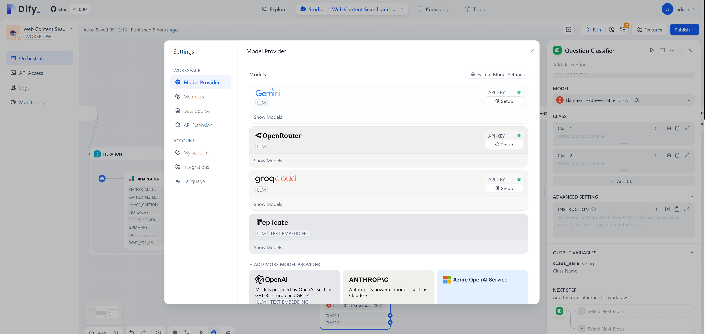
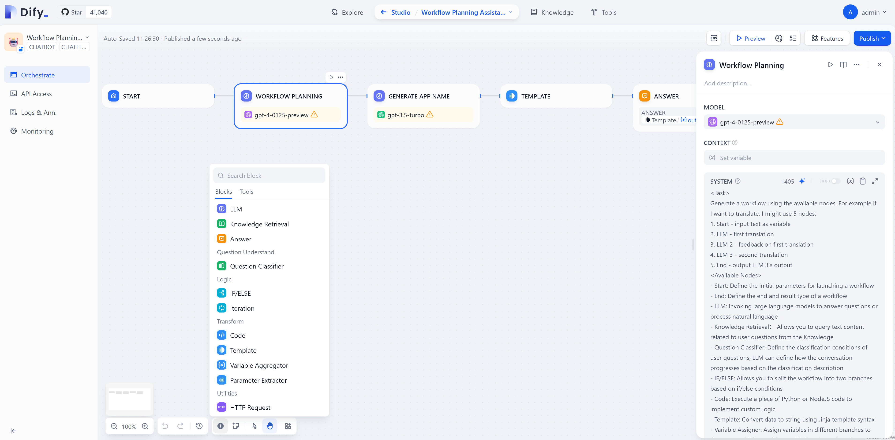
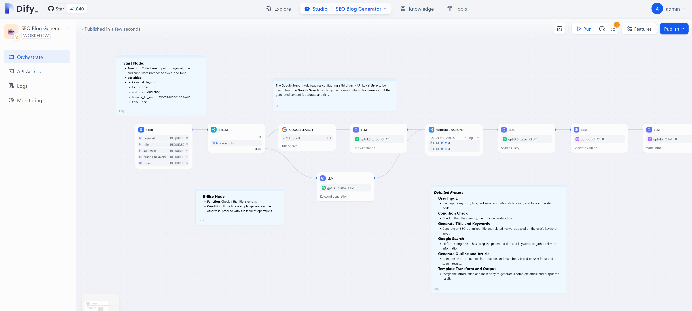
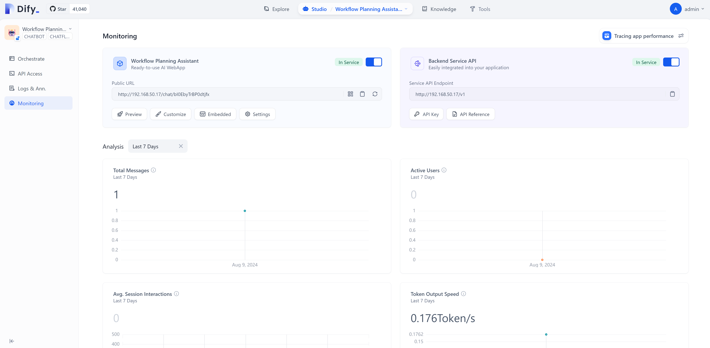
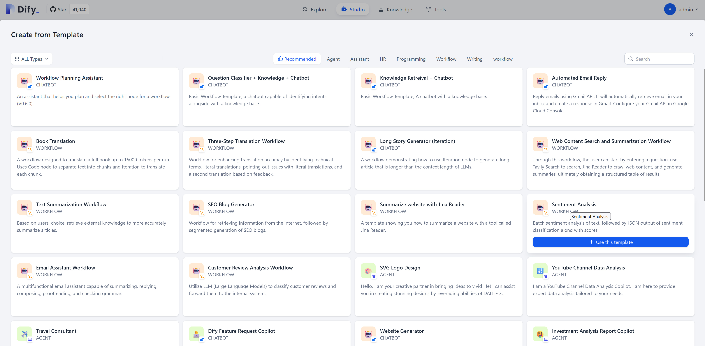

# try with dify

- https://github.com/langgenius/dify




<!-- dify这个东西 ，它内置了很多大圆模型。然后你只要配置大圆模型的api t然后你就可以去访问 而且它会有一些自动的呃更新会自动的把大圆模型里面就是各个服务商的支持的模型刷出个列表所以呢从呃从。 本质上来说，它是一个很多当前市面上各个大理岩模型推理服务和大理岩模型的这么一个最佳实践的整合。  -->

Dify is a tool that integrates various large models. Users only need to configure the corresponding large model APIs to easily access these models. Additionally, the tool features an automatic update function that periodically generates a list of models supported by major service providers. Therefore, essentially, Dify represents a best practice integration solution for various large inference services and model applications currently available in the market.



<!-- 然后dify还把大圆模型里面你要开发应用的话呢？其实要分一些步骤，你不能直接把一个提示词扔给达摩行你需要前面的话，先做一些呃呃相关的数据的整理然后呢进行一个提示词的一个工程，其实提示题提示词可以写的很复杂，然后呢，把这提词给达模型以后，然后达模型的输出 然后你还需要做一些处理最后的话呢，然后再。 条用户这个里面的话，如果用户把所有的步骤都自己做的话，会非常麻烦，而我们这个dify ，它就可以给你已经内置好了很多个步骤的模板同时的话，它也给你把每个模板里面写好了，提示词并且可以自动的生成这个提示词这样的话，就等于是把它在大约模型应用开发里面的一些知识就内置到工具里面了  -->

When develop llm applications, a series of steps must be followed. First, you cannot simply input a prompt into the llm model; instead, you need to organize relevant data and then design appropriate prompts. It is important to note that these prompts can be quite complex. Once you submit the designed prompts to the llm model, further processing of its output will be required before presenting it to the user. If users were to complete all these steps independently, it would become very cumbersome. However, our Dify tool has preset multiple step templates and prepared corresponding prompts for each template while also having an automatic generation feature. This means that some knowledge and processes required for developing applications with the large round model have been effectively integrated into this tool, thereby simplifying the entire process.



<!-- 达源模型应用的流程，可以非常复杂，我们可以从上面这个例子可以看到它可以输入一个文章的标题然后它会自动搜索网络然后做一些爆款文章这是一个最简单的一个例子从这个例子来看的话，我们就分了很多部需要大约模型做不同的步骤，然后来把结果一步一步的梳理出来。  -->

The application process of the llm model is relatively complex. Based on the previously mentioned example, this model can accept a title of an article and automatically search for relevant information on the internet to generate some popular articles. This is just a basic demonstration. In practice, we need to divide the entire process into multiple steps so that the model can perform different functions, gradually organizing the final results.



<!-- 它还可以把定好的应用流程对外发布成api并且还有比较好的监控与日志的整合所以呢，我们开发者只要去关心业务流程去关心我们的提示词，然后去关心我们的数据然后剩下的话呢，就可以将这个平台了。  -->

The platform not only allows the predefined application processes to be published as APIs but also offers excellent monitoring and log integration features. Therefore, for us developers, we only need to focus on business processes, prompts, and relevant data, while other tasks can be handled automatically by the platform.



<!-- dify还内置了很多的模板，可以快速的构建流程，里面有大量的提示词，也体现了他把最佳实践集成进产品的做法。 -->

Dify also comes with a variety of templates to help users quickly build workflows. These templates provide a wealth of prompts, fully demonstrating its philosophy of integrating best practices into product design.


# deploy dify

```bash

yum install -y yum-utils
yum-config-manager --add-repo https://download.docker.com/linux/rhel/docker-ce.repo

yum install -y docker-ce docker-ce-cli containerd.io docker-buildx-plugin docker-compose-plugin

systemctl enable --now docker

mkdir -p /data

cd /data

git clone https://github.com/langgenius/dify
# git clone https://github.com/wangzheng422/dify.git
cd dify
# git checkout wzh

cd docker
# /bin/cp -f .env.wzh .env
/bin/cp -f .env.example .env
# podman compose -f podman-compose.yaml \
#     up -d 

docker compose up -d
# docker compose down

docker ps -a
# CONTAINER ID   IMAGE                              COMMAND                  CREATED          STATUS                    PORTS                                                                      NAMESca71da5a0ffe   nginx:latest                       "sh -c 'cp /docker-e…"   26 minutes ago   Up 26 minutes             0.0.0.0:80->80/tcp, :::80->80/tcp, 0.0.0.0:443->443/tcp, :::443->443/tcp   docker-nginx-1
# 354aa16bddab   langgenius/dify-api:0.6.16         "/bin/bash /entrypoi…"   26 minutes ago   Up 26 minutes             5001/tcp                                                                   docker-worker-1
# a8ff67526ddb   langgenius/dify-api:0.6.16         "/bin/bash /entrypoi…"   26 minutes ago   Up 26 minutes             5001/tcp                                                                   docker-api-1
# 4b1e9fa22b67   langgenius/dify-web:0.6.16         "/bin/sh ./entrypoin…"   26 minutes ago   Up 26 minutes             3000/tcp                                                                   docker-web-1
# 0953e45f1db8   ubuntu/squid:latest                "sh -c 'cp /docker-e…"   26 minutes ago   Up 26 minutes             3128/tcp                                                                   docker-ssrf_proxy-1
# 53bb37b548b6   redis:6-alpine                     "docker-entrypoint.s…"   26 minutes ago   Up 26 minutes (healthy)   6379/tcp                                                                   docker-redis-1
# 10e4be45b409   postgres:15-alpine                 "docker-entrypoint.s…"   26 minutes ago   Up 26 minutes (healthy)   5432/tcp                                                                   docker-db-1
# 8f6359cda8cb   langgenius/dify-sandbox:0.2.1      "/main"                  26 minutes ago   Up 26 minutes                                                                                        docker-sandbox-1
# 8ff81855ec04   semitechnologies/weaviate:1.19.0   "/bin/weaviate --hos…"   26 minutes ago   Up 26 minutes                                                                                        docker-weaviate-1

# go to http://server_ip/
# admin@wzhlab.top  /   redhat123

##########################
# failed, no gpu, performance is bad
# install ollama
# https://ollama.com/download/linux
curl -fsSL https://ollama.com/install.sh | sh

mkdir -p /etc/systemd/system/ollama.service.d

cat << EOF > /etc/systemd/system/ollama.service.d/override.conf
[Service]
Environment="OLLAMA_HOST=0.0.0.0"
EOF

systemctl daemon-reload

systemctl restart ollama

# ollama run llama3.1:latest
ollama run gemma2:2b

```

# end
