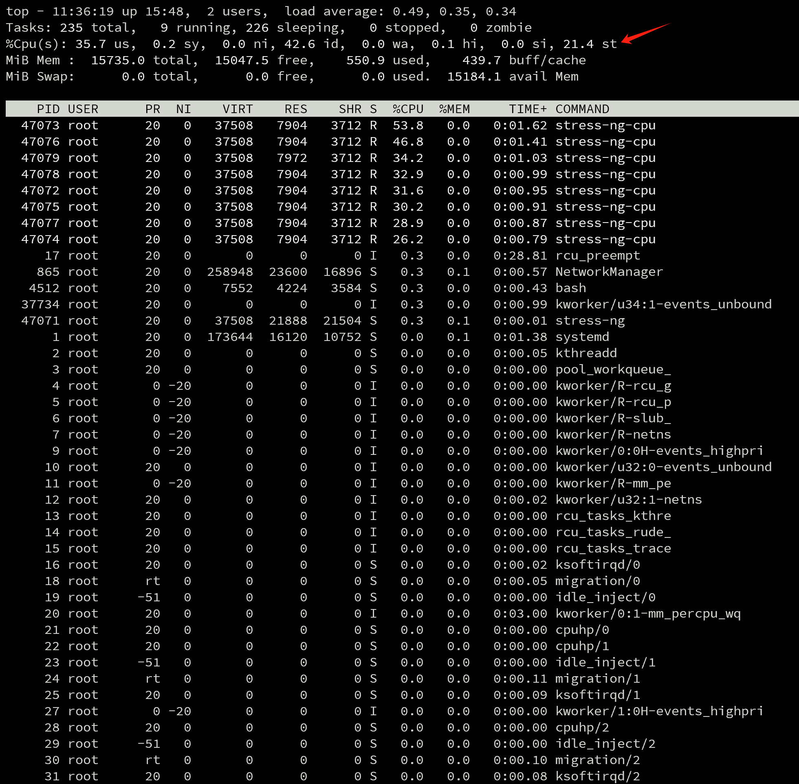

# kvm compare disk and volume

There is performance difference for kvm's disk which is based on type block vs type file. And type block should outperform type file for x2 at least.

Now we try it out. We will create a vm, with 3 disks
1. 50GB, lv, for rhel os
2. 40GB, lv, which will mount as block disk, raw.
3. 30GB, lv, which will create xfs on it, and create a qcow2 file, and mount the file as file disk.

> [!WARNING]
> The test result is shocking, qcow2 based file disk outperform raw block disk.
>
> So test it in your own environment before you make any decision.

# deploy the base env

```bash

dnf -y install byobu htop jq ipmitool nmstate /usr/bin/htpasswd

dnf groupinstall -y development server 'server with gui'

dnf -y install qemu-kvm libvirt libguestfs-tools virt-install virt-viewer virt-manager tigervnc-server

systemctl enable --now libvirtd


mkdir -p /data/kvm
cd /data/kvm

# create network bridge

cat << EOF >  /data/kvm/virt-net.xml
<network>
  <name>br-ocp</name>
  <forward mode='nat'>
    <nat>
      <port start='1024' end='65535'/>
    </nat>
  </forward>
  <bridge name='br-ocp' stp='on' delay='0'/>
  <domain name='br-ocp'/>
  <ip address='192.168.99.1' netmask='255.255.255.0'>
  </ip>
  <ip address='192.168.77.1' netmask='255.255.255.0'>
  </ip>
  <ip address='192.168.88.1' netmask='255.255.255.0'>
  </ip>
</network>
EOF

virsh net-define --file /data/kvm/virt-net.xml
virsh net-autostart br-ocp
virsh net-start br-ocp


virsh net-list --all
#  Name      State    Autostart   Persistent
# --------------------------------------------
#  br-ocp    active   yes         yes
#  default   active   yes         yes


pvcreate -y /dev/sdb
vgcreate vgdata /dev/sdb


lvremove -f /dev/vgdata/lv01
lvremove -f /dev/vgdata/lv02
lvremove -f /dev/vgdata/lv03

# Create  50GB LV
lvcreate -L 50G -n lv01 vgdata
lvcreate -L 40G -n lv02 vgdata
lvcreate -L 30G -n lv03 vgdata

mkfs.xfs /dev/vgdata/lv03

mkdir -p /data/lv
mount /dev/vgdata/lv03 /data/lv


cd /data/kvm

wget https://mirror.web-ster.com/rocky/9/isos/x86_64/Rocky-x86_64-minimal.iso


virsh destroy demo-01
virsh undefine demo-01

SNO_MEM=16

# for demo 01 vm, we will add 2 disk later
# one is lvm based block raw disk
# one is qcow2 based file disk
virt-install --name=demo-01 \
--vcpus=8 \
--ram=$(($SNO_MEM*1024)) \
--cpu=host-model \
--disk path=/data/kvm/demo-01.qcow2,bus=virtio,size=50 \
--os-variant rhel9.3 \
--network bridge=br-ocp,model=virtio \
--graphics vnc,listen=127.0.0.1,port=59005 --noautoconsole \
--boot hd,cdrom,menu=on --wait -1 \
--cdrom /data/kvm/Rocky-x86_64-minimal.iso


# for demo 02, it will over-commit the cpu
# host only have 16 cores, but we will assign 32 cores to the vm
# it will add a lv01 disk, to give it io pressure
virt-install --name=demo-02 \
--vcpus=32 \
--ram=$(($SNO_MEM*1024)) \
--cpu=host-model \
--disk path=/data/kvm/demo-02.qcow2,bus=virtio,size=50 \
--os-variant rhel9.3 \
--network bridge=br-ocp,model=virtio \
--graphics vnc,listen=127.0.0.1,port=59006 --noautoconsole \
--boot hd,cdrom,menu=on --wait -1 \
--cdrom /data/kvm/Rocky-x86_64-minimal.iso

# in demo-02

wipefs -a /dev/vdb
mkfs.xfs /dev/vdb
mkdir -p /data/io
mount /dev/vdb /data/io


dnf install -y stress-ng

cat << EOF > fio_job.fio
[global]
ioengine=libaio
iodepth=16
runtime=0  # 0 means run indefinitely
time_based  # Run in time-based mode
direct=1  # Use direct I/O

[randwrite]
rw=randwrite  # Random write
bs=4k  # Block size of 4KB
size=9999999999999999G  # Each job will write 1GB
numjobs=4  # Number of threads
EOF

cat << EOF > test.sh
stress-ng --cpu 32 &
fio fio_job.fio --filename=/dev/vdb
EOF

bash test.sh
```

for demo-01, we will add vdb with lvm block raw disk, and vdc with qcow2 file disk.

dump the vm config

```bash
virsh dumpxml demo-01
```

the config related with disk are.

```xml
    <disk type='block' device='disk'>
      <driver name='qemu' type='raw' cache='none' io='native' discard='unmap'/>
      <source dev='/dev/vgdata/lv02' index='3'/>
      <backingStore/>
      <target dev='vdb' bus='virtio'/>
      <alias name='virtio-disk1'/>
      <address type='pci' domain='0x0000' bus='0x05' slot='0x00' function='0x0'/>
    </disk>
    <disk type='file' device='disk'>
      <driver name='qemu' type='qcow2'/>
      <source file='/data/lv/fio.qcow2' index='2'/>
      <backingStore/>
      <target dev='vdc' bus='virtio'/>
      <alias name='virtio-disk2'/>
      <address type='pci' domain='0x0000' bus='0x09' slot='0x00' function='0x0'/>
    </disk>
```

go into the vm

```bash

lsblk
# NAME        MAJ:MIN RM  SIZE RO TYPE MOUNTPOINTS
# sr0          11:0    1 1024M  0 rom
# vda         252:0    0   50G  0 disk
# ├─vda1      252:1    0    1G  0 part /boot
# └─vda2      252:2    0   49G  0 part
#   └─rl-root 253:0    0   49G  0 lvm  /
# vdb         252:16   0   40G  0 disk
# vdc         252:32   0   20G  0 disk

mkfs.xfs -f /dev/vdb
mkfs.xfs -f /dev/vdc

mkdir -p /data/vdb
mkdir -p /data/vdc

mount /dev/vdb /data/vdb
mount /dev/vdc /data/vdc

```

test with fio on vdb, which is raw block disk based on lvm

```bash
fio --rw=write --ioengine=sync --fdatasync=1 --directory=/data/vdb --filename=fio.bin --size=100m --bs=8000 --name=etcd_perf --output-format=json --runtime=60 --time_based=1  | jq '.jobs[0].sync.lat_ns'

```

the output

```yaml
{
  "min": 22070,
  "max": 2389203,
  "mean": 148089.911509,
  "stddev": 75670.837530,
  "N": 176324,
  "percentile": {
    "1.000000": 113152,
    "5.000000": 118272,
    "10.000000": 120320,
    "20.000000": 122368,
    "30.000000": 123392,
    "40.000000": 124416,
    "50.000000": 124416,
    "60.000000": 125440,
    "70.000000": 127488,
    "80.000000": 134144,
    "90.000000": 199680,
    "95.000000": 284672,
    "99.000000": 528384,
    "99.500000": 593920,
    "99.900000": 700416,
    "99.950000": 733184,
    "99.990000": 839680
  }
}

```

test with fio on vdc, which is file disk based on qcow2

```bash
fio --rw=write --ioengine=sync --fdatasync=1 --directory=/data/vdc --filename=fio.bin --size=100m --bs=8000 --name=etcd_perf --output-format=json --runtime=60 --time_based=1  | jq '.jobs[0].sync.lat_ns'

```

```json
{
  "min": 25231,
  "max": 3918521,
  "mean": 139351.049294,
  "stddev": 60808.155382,
  "N": 361988,
  "percentile": {
    "1.000000": 115200,
    "5.000000": 119296,
    "10.000000": 122368,
    "20.000000": 124416,
    "30.000000": 125440,
    "40.000000": 126464,
    "50.000000": 127488,
    "60.000000": 128512,
    "70.000000": 129536,
    "80.000000": 132096,
    "90.000000": 140288,
    "95.000000": 160768,
    "99.000000": 419840,
    "99.500000": 497664,
    "99.900000": 544768,
    "99.950000": 774144,
    "99.990000": 1187840
  }
}
```

compare with host os.

```bash
fio --rw=write --ioengine=sync --fdatasync=1 --directory=/data/lv --filename=fio.bin --size=100m --bs=8000 --name=etcd_perf --output-format=json --runtime=60 --time_based=1  | jq '.jobs[0].sync.lat_ns'

```

```json
{
  "min": 39106,
  "max": 452076,
  "mean": 81993.318831,
  "stddev": 24471.233707,
  "N": 275434,
  "percentile": {
    "1.000000": 67072,
    "5.000000": 69120,
    "10.000000": 73216,
    "20.000000": 73216,
    "30.000000": 75264,
    "40.000000": 76288,
    "50.000000": 76288,
    "60.000000": 77312,
    "70.000000": 78336,
    "80.000000": 78336,
    "90.000000": 81408,
    "95.000000": 148480,
    "99.000000": 191488,
    "99.500000": 197632,
    "99.900000": 248832,
    "99.950000": 284672,
    "99.990000": 301056
  }
}

```

test on host os

```bash

fio --rw=write --ioengine=sync --fdatasync=1 --directory=/data/lv/ --filename=fio.bin --size=100m --bs=8000 --name=etcd_perf --output-format=json --runtime=60 --time_based=1  | jq '.jobs[0].sync.lat_ns'

```

```json
{
  "min": 40551,
  "max": 410327,
  "mean": 79574.532630,
  "stddev": 16358.487058,
  "N": 229223,
  "percentile": {
    "1.000000": 67072,
    "5.000000": 70144,
    "10.000000": 73216,
    "20.000000": 75264,
    "30.000000": 76288,
    "40.000000": 76288,
    "50.000000": 77312,
    "60.000000": 78336,
    "70.000000": 78336,
    "80.000000": 78336,
    "90.000000": 80384,
    "95.000000": 96768,
    "99.000000": 146432,
    "99.500000": 181248,
    "99.900000": 288768,
    "99.950000": 296960,
    "99.990000": 317440
  }
```

create a `test.sh`, with below content

```bash
#!/bin/bash

echo "99th Percentile Latency Comparison (nanoseconds)"
echo "=============================================="
echo "Percentile |    VDB    |    VDC"
echo "-----------+-----------+-----------"

run_test() {
    local device=$1
    local dir="/data/${device}"
    
    fio --rw=write --ioengine=sync --fdatasync=1 \
        --directory=$dir --filename=fio.bin \
        --size=100m --bs=8000 --name=etcd_perf \
        --output-format=json --runtime=60 --time_based=1 | \
    jq '.jobs[0].sync.lat_ns.percentile | {
        "99.000": ."99.000000",
        "99.500": ."99.500000",
        "99.900": ."99.900000",
        "99.950": ."99.950000",
        "99.990": ."99.990000"
    }'
}

# Run tests
vdb_results=$(run_test "vdb")
vdc_results=$(run_test "vdc")

# Print results
for p in "99.000" "99.500" "99.900" "99.950" "99.990"; do
    vdb_val=$(echo "$vdb_results" | jq ".[\"$p\"]")
    vdc_val=$(echo "$vdc_results" | jq ".[\"$p\"]")
    printf "%9s%% | %9d | %9d\n" "$p" "$vdb_val" "$vdc_val"
done

# Cleanup
rm -f /data/vdb/fio.bin /data/vdc/fio.bin
```

```bash

while true; do bash test.sh; done
# 99th Percentile Latency Comparison (nanoseconds)
# ==============================================                                                                                             Percentile |    VDB    |    VDC
# -----------+-----------+-----------
#    99.000% | 1,253,376 | 4,947,968
#    99.500% | 4,145,152 | 7,307,264
#    99.900% | 4,947,968 | 11,993,088
#    99.950% | 7,897,088 | 13,172,736
#    99.990% | 11,993,088 | 17,956,864
# 99th Percentile Latency Comparison (nanoseconds)
# ==============================================
# Percentile |    VDB    |    VDC
# -----------+-----------+-----------
#    99.000% | 1,089,536 | 4,620,288
#    99.500% | 4,112,384 | 7,176,192
#    99.900% | 7,176,192 | 11,862,016
#    99.950% | 8,028,160 | 12,910,592
#    99.990% | 16,187,392 | 16,908,288
# 99th Percentile Latency Comparison (nanoseconds)
# ==============================================
# Percentile |    VDB    |    VDC
# -----------+-----------+-----------
#    99.000% | 1,056,768 | 4,685,824
#    99.500% | 4,145,152 | 7,176,192
#    99.900% | 7,962,624 | 11,993,088
#    99.950% | 8,093,696 | 13,041,664
#    99.990% | 15,269,888 | 17,170,432
# 99th Percentile Latency Comparison (nanoseconds)
# ==============================================
# Percentile |    VDB    |    VDC
# -----------+-----------+-----------
#    99.000% | 1,122,304 | 4,816,896
#    99.500% | 4,112,384 | 7,372,800
#    99.900% | 5,079,040 | 11,993,088
#    99.950% | 7,962,624 | 13,565,952
#    99.990% | 11,993,088 | 16,580,608


```

using top to see cpu overcommit



# end

```bash
# Remove existing partition table and create new GPT
sudo parted -s /dev/sdb mklabel gpt

# Create both partitions in one command
sudo parted -s /dev/sdb \
unit GB \
mkpart primary 0% 50 \
mkpart primary 50 100

# Verify the partitions
sudo parted -s /dev/sdb print
# Number  Start   End     Size    File system  Name     Flags
#  1      1049kB  50.0GB  50.0GB               primary
#  2      50.0GB  100GB   50.0GB               primary

lsblk
# NAME   MAJ:MIN RM   SIZE RO TYPE MOUNTPOINTS
# sda      8:0    0 447.1G  0 disk
# ├─sda1   8:1    0   512M  0 part /boot/efi
# ├─sda2   8:2    0   1.9G  0 part [SWAP]
# └─sda3   8:3    0 444.7G  0 part /
# sdb      8:16   0 447.1G  0 disk
# ├─sdb1   8:17   0  46.6G  0 part
# └─sdb2   8:18   0  46.6G  0 part


virsh dumpxml demo-01
<domain type='kvm' id='8'>
  <name>demo-01</name>
  <uuid>d17ed943-e8b4-450f-8f03-5827b37e8a14</uuid>
  <metadata>
    <libosinfo:libosinfo xmlns:libosinfo="http://libosinfo.org/xmlns/libvirt/domain/1.0">
      <libosinfo:os id="http://redhat.com/rhel/9.3"/>
    </libosinfo:libosinfo>
  </metadata>
  <memory unit='KiB'>16777216</memory>
  <currentMemory unit='KiB'>16777216</currentMemory>
  <vcpu placement='static'>8</vcpu>
  <resource>
    <partition>/machine</partition>
  </resource>
  <os>
    <type arch='x86_64' machine='pc-q35-rhel9.4.0'>hvm</type>
    <boot dev='hd'/>
    <boot dev='cdrom'/>
    <bootmenu enable='yes'/>
  </os>
  <features>
    <acpi/>
    <apic/>
  </features>
  <cpu mode='custom' match='exact' check='full'>
    <model fallback='forbid'>Cooperlake</model>
    <vendor>Intel</vendor>
    <feature policy='require' name='vmx'/>
    <feature policy='require' name='pdcm'/>
    <feature policy='require' name='hypervisor'/>
    <feature policy='require' name='ss'/>
    <feature policy='require' name='tsc_adjust'/>
    <feature policy='require' name='mpx'/>
    <feature policy='require' name='avx512ifma'/>
    <feature policy='require' name='sha-ni'/>
    <feature policy='require' name='avx512vbmi'/>
    <feature policy='require' name='umip'/>
    <feature policy='require' name='avx512vbmi2'/>
    <feature policy='require' name='gfni'/>
    <feature policy='require' name='vaes'/>
    <feature policy='require' name='vpclmulqdq'/>
    <feature policy='require' name='avx512bitalg'/>
    <feature policy='require' name='avx512-vpopcntdq'/>
    <feature policy='require' name='rdpid'/>
    <feature policy='require' name='fsrm'/>
    <feature policy='require' name='md-clear'/>
    <feature policy='require' name='flush-l1d'/>
    <feature policy='require' name='xsaves'/>
    <feature policy='require' name='ibpb'/>
    <feature policy='require' name='ibrs'/>
    <feature policy='require' name='amd-stibp'/>
    <feature policy='require' name='amd-ssbd'/>
    <feature policy='require' name='sbdr-ssdp-no'/>
    <feature policy='require' name='fb-clear'/>
    <feature policy='require' name='gds-no'/>
    <feature policy='require' name='vmx-ins-outs'/>
    <feature policy='require' name='vmx-true-ctls'/>
    <feature policy='require' name='vmx-store-lma'/>
    <feature policy='require' name='vmx-activity-hlt'/>
    <feature policy='require' name='vmx-activity-wait-sipi'/>
    <feature policy='require' name='vmx-vmwrite-vmexit-fields'/>
    <feature policy='require' name='vmx-apicv-xapic'/>
    <feature policy='require' name='vmx-ept'/>
    <feature policy='require' name='vmx-desc-exit'/>
    <feature policy='require' name='vmx-rdtscp-exit'/>
    <feature policy='require' name='vmx-apicv-x2apic'/>
    <feature policy='require' name='vmx-vpid'/>
    <feature policy='require' name='vmx-wbinvd-exit'/>
    <feature policy='require' name='vmx-unrestricted-guest'/>
    <feature policy='require' name='vmx-apicv-register'/>
    <feature policy='require' name='vmx-apicv-vid'/>
    <feature policy='require' name='vmx-rdrand-exit'/>
    <feature policy='require' name='vmx-invpcid-exit'/>
    <feature policy='require' name='vmx-vmfunc'/>
    <feature policy='require' name='vmx-shadow-vmcs'/>
    <feature policy='require' name='vmx-rdseed-exit'/>
    <feature policy='require' name='vmx-pml'/>
    <feature policy='require' name='vmx-xsaves'/>
    <feature policy='require' name='vmx-tsc-scaling'/>
    <feature policy='require' name='vmx-ept-execonly'/>
    <feature policy='require' name='vmx-page-walk-4'/>
    <feature policy='require' name='vmx-ept-2mb'/>
    <feature policy='require' name='vmx-ept-1gb'/>
    <feature policy='require' name='vmx-invept'/>
    <feature policy='require' name='vmx-eptad'/>
    <feature policy='require' name='vmx-invept-single-context'/>
    <feature policy='require' name='vmx-invept-all-context'/>
    <feature policy='require' name='vmx-invvpid'/>
    <feature policy='require' name='vmx-invvpid-single-addr'/>
    <feature policy='require' name='vmx-invvpid-all-context'/>
    <feature policy='require' name='vmx-intr-exit'/>
    <feature policy='require' name='vmx-nmi-exit'/>
    <feature policy='require' name='vmx-vnmi'/>
    <feature policy='require' name='vmx-preemption-timer'/>
    <feature policy='require' name='vmx-posted-intr'/>
    <feature policy='require' name='vmx-vintr-pending'/>
    <feature policy='require' name='vmx-tsc-offset'/>
    <feature policy='require' name='vmx-hlt-exit'/>
    <feature policy='require' name='vmx-invlpg-exit'/>
    <feature policy='require' name='vmx-mwait-exit'/>
    <feature policy='require' name='vmx-rdpmc-exit'/>
    <feature policy='require' name='vmx-rdtsc-exit'/>
    <feature policy='require' name='vmx-cr3-load-noexit'/>
    <feature policy='require' name='vmx-cr3-store-noexit'/>
    <feature policy='require' name='vmx-cr8-load-exit'/>
    <feature policy='require' name='vmx-cr8-store-exit'/>
    <feature policy='require' name='vmx-flexpriority'/>
    <feature policy='require' name='vmx-vnmi-pending'/>
    <feature policy='require' name='vmx-movdr-exit'/>
    <feature policy='require' name='vmx-io-exit'/>
    <feature policy='require' name='vmx-io-bitmap'/>
    <feature policy='require' name='vmx-mtf'/>
    <feature policy='require' name='vmx-msr-bitmap'/>
    <feature policy='require' name='vmx-monitor-exit'/>
    <feature policy='require' name='vmx-pause-exit'/>
    <feature policy='require' name='vmx-secondary-ctls'/>
    <feature policy='require' name='vmx-exit-nosave-debugctl'/>
    <feature policy='require' name='vmx-exit-load-perf-global-ctrl'/>
    <feature policy='require' name='vmx-exit-ack-intr'/>
    <feature policy='require' name='vmx-exit-save-pat'/>
    <feature policy='require' name='vmx-exit-load-pat'/>
    <feature policy='require' name='vmx-exit-save-efer'/>
    <feature policy='require' name='vmx-exit-load-efer'/>
    <feature policy='require' name='vmx-exit-save-preemption-timer'/>
    <feature policy='require' name='vmx-exit-clear-bndcfgs'/>
    <feature policy='require' name='vmx-entry-noload-debugctl'/>
    <feature policy='require' name='vmx-entry-ia32e-mode'/>
    <feature policy='require' name='vmx-entry-load-perf-global-ctrl'/>
    <feature policy='require' name='vmx-entry-load-pat'/>
    <feature policy='require' name='vmx-entry-load-efer'/>
    <feature policy='require' name='vmx-entry-load-bndcfgs'/>
    <feature policy='require' name='vmx-eptp-switching'/>
    <feature policy='disable' name='hle'/>
    <feature policy='disable' name='rtm'/>
    <feature policy='disable' name='clwb'/>
    <feature policy='disable' name='avx512-bf16'/>
    <feature policy='disable' name='taa-no'/>
  </cpu>
  <clock offset='utc'>
    <timer name='rtc' tickpolicy='catchup'/>
    <timer name='pit' tickpolicy='delay'/>
    <timer name='hpet' present='no'/>
  </clock>
  <on_poweroff>destroy</on_poweroff>
  <on_reboot>restart</on_reboot>
  <on_crash>destroy</on_crash>
  <pm>
    <suspend-to-mem enabled='no'/>
    <suspend-to-disk enabled='no'/>
  </pm>
  <devices>
    <emulator>/usr/libexec/qemu-kvm</emulator>
    <disk type='block' device='disk'>
      <driver name='qemu' type='raw' cache='none' io='native' discard='unmap'/>
      <source dev='/dev/vgdata/lv01' index='4'/>
      <backingStore/>
      <target dev='vda' bus='virtio'/>
      <alias name='virtio-disk0'/>
      <address type='pci' domain='0x0000' bus='0x04' slot='0x00' function='0x0'/>
    </disk>
    <disk type='block' device='disk'>
      <driver name='qemu' type='raw' cache='none' io='native' discard='unmap'/>
      <source dev='/dev/vgdata/lv02' index='3'/>
      <backingStore/>
      <target dev='vdb' bus='virtio'/>
      <alias name='virtio-disk1'/>
      <address type='pci' domain='0x0000' bus='0x05' slot='0x00' function='0x0'/>
    </disk>
    <disk type='file' device='disk'>
      <driver name='qemu' type='qcow2'/>
      <source file='/data/lv/fio.qcow2' index='2'/>
      <backingStore/>
      <target dev='vdc' bus='virtio'/>
      <alias name='virtio-disk2'/>
      <address type='pci' domain='0x0000' bus='0x09' slot='0x00' function='0x0'/>
    </disk>
    <disk type='file' device='cdrom'>
      <driver name='qemu'/>
      <target dev='sda' bus='sata'/>
      <readonly/>
      <alias name='sata0-0-0'/>
      <address type='drive' controller='0' bus='0' target='0' unit='0'/>
    </disk>
    <controller type='usb' index='0' model='qemu-xhci' ports='15'>
      <alias name='usb'/>
      <address type='pci' domain='0x0000' bus='0x02' slot='0x00' function='0x0'/>
    </controller>
    <controller type='pci' index='0' model='pcie-root'>
      <alias name='pcie.0'/>
    </controller>
    <controller type='pci' index='1' model='pcie-root-port'>
      <model name='pcie-root-port'/>
      <target chassis='1' port='0x10'/>
      <alias name='pci.1'/>
      <address type='pci' domain='0x0000' bus='0x00' slot='0x02' function='0x0' multifunction='on'/>
    </controller>
    <controller type='pci' index='2' model='pcie-root-port'>
      <model name='pcie-root-port'/>
      <target chassis='2' port='0x11'/>
      <alias name='pci.2'/>
      <address type='pci' domain='0x0000' bus='0x00' slot='0x02' function='0x1'/>
    </controller>
    <controller type='pci' index='3' model='pcie-root-port'>
      <model name='pcie-root-port'/>
      <target chassis='3' port='0x12'/>
      <alias name='pci.3'/>
      <address type='pci' domain='0x0000' bus='0x00' slot='0x02' function='0x2'/>
    </controller>
    <controller type='pci' index='4' model='pcie-root-port'>
      <model name='pcie-root-port'/>
      <target chassis='4' port='0x13'/>
      <alias name='pci.4'/>
      <address type='pci' domain='0x0000' bus='0x00' slot='0x02' function='0x3'/>
    </controller>
    <controller type='pci' index='5' model='pcie-root-port'>
      <model name='pcie-root-port'/>
      <target chassis='5' port='0x14'/>
      <alias name='pci.5'/>
      <address type='pci' domain='0x0000' bus='0x00' slot='0x02' function='0x4'/>
    </controller>
    <controller type='pci' index='6' model='pcie-root-port'>
      <model name='pcie-root-port'/>
      <target chassis='6' port='0x15'/>
      <alias name='pci.6'/>
      <address type='pci' domain='0x0000' bus='0x00' slot='0x02' function='0x5'/>
    </controller>
    <controller type='pci' index='7' model='pcie-root-port'>
      <model name='pcie-root-port'/>
      <target chassis='7' port='0x16'/>
      <alias name='pci.7'/>
      <address type='pci' domain='0x0000' bus='0x00' slot='0x02' function='0x6'/>
    </controller>
    <controller type='pci' index='8' model='pcie-root-port'>
      <model name='pcie-root-port'/>
      <target chassis='8' port='0x17'/>
      <alias name='pci.8'/>
      <address type='pci' domain='0x0000' bus='0x00' slot='0x02' function='0x7'/>
    </controller>
    <controller type='pci' index='9' model='pcie-root-port'>
      <model name='pcie-root-port'/>
      <target chassis='9' port='0x18'/>
      <alias name='pci.9'/>
      <address type='pci' domain='0x0000' bus='0x00' slot='0x03' function='0x0' multifunction='on'/>
    </controller>
    <controller type='pci' index='10' model='pcie-root-port'>
      <model name='pcie-root-port'/>
      <target chassis='10' port='0x19'/>
      <alias name='pci.10'/>
      <address type='pci' domain='0x0000' bus='0x00' slot='0x03' function='0x1'/>
    </controller>
    <controller type='pci' index='11' model='pcie-root-port'>
      <model name='pcie-root-port'/>
      <target chassis='11' port='0x1a'/>
      <alias name='pci.11'/>
      <address type='pci' domain='0x0000' bus='0x00' slot='0x03' function='0x2'/>
    </controller>
    <controller type='pci' index='12' model='pcie-root-port'>
      <model name='pcie-root-port'/>
      <target chassis='12' port='0x1b'/>
      <alias name='pci.12'/>
      <address type='pci' domain='0x0000' bus='0x00' slot='0x03' function='0x3'/>
    </controller>
    <controller type='pci' index='13' model='pcie-root-port'>
      <model name='pcie-root-port'/>
      <target chassis='13' port='0x1c'/>
      <alias name='pci.13'/>
      <address type='pci' domain='0x0000' bus='0x00' slot='0x03' function='0x4'/>
    </controller>
    <controller type='pci' index='14' model='pcie-root-port'>
      <model name='pcie-root-port'/>
      <target chassis='14' port='0x1d'/>
      <alias name='pci.14'/>
      <address type='pci' domain='0x0000' bus='0x00' slot='0x03' function='0x5'/>
    </controller>
    <controller type='sata' index='0'>
      <alias name='ide'/>
      <address type='pci' domain='0x0000' bus='0x00' slot='0x1f' function='0x2'/>
    </controller>
    <controller type='virtio-serial' index='0'>
      <alias name='virtio-serial0'/>
      <address type='pci' domain='0x0000' bus='0x03' slot='0x00' function='0x0'/>
    </controller>
    <controller type='scsi' index='0' model='virtio-scsi'>
      <alias name='scsi0'/>
      <address type='pci' domain='0x0000' bus='0x06' slot='0x00' function='0x0'/>
    </controller>
    <interface type='bridge'>
      <mac address='52:54:00:51:8e:f9'/>
      <source bridge='br-ocp'/>
      <target dev='vnet6'/>
      <model type='virtio'/>
      <alias name='net0'/>
      <address type='pci' domain='0x0000' bus='0x01' slot='0x00' function='0x0'/>
    </interface>
    <serial type='pty'>
      <source path='/dev/pts/0'/>
      <target type='isa-serial' port='0'>
        <model name='isa-serial'/>
      </target>
      <alias name='serial0'/>
    </serial>
    <console type='pty' tty='/dev/pts/0'>
      <source path='/dev/pts/0'/>
      <target type='serial' port='0'/>
      <alias name='serial0'/>
    </console>
    <channel type='unix'>
      <source mode='bind' path='/run/libvirt/qemu/channel/8-demo-01/org.qemu.guest_agent.0'/>
      <target type='virtio' name='org.qemu.guest_agent.0' state='disconnected'/>
      <alias name='channel0'/>
      <address type='virtio-serial' controller='0' bus='0' port='1'/>
    </channel>
    <input type='tablet' bus='usb'>
      <alias name='input0'/>
      <address type='usb' bus='0' port='1'/>
    </input>
    <input type='mouse' bus='ps2'>
      <alias name='input1'/>
    </input>
    <input type='keyboard' bus='ps2'>
      <alias name='input2'/>
    </input>
    <graphics type='vnc' port='59005' autoport='no' listen='127.0.0.1'>
      <listen type='address' address='127.0.0.1'/>
    </graphics>
    <audio id='1' type='none'/>
    <video>
      <model type='virtio' heads='1' primary='yes'/>
      <alias name='video0'/>
      <address type='pci' domain='0x0000' bus='0x00' slot='0x01' function='0x0'/>
    </video>
    <watchdog model='itco' action='reset'>
      <alias name='watchdog0'/>
    </watchdog>
    <memballoon model='virtio'>
      <stats period='5'/>
      <alias name='balloon0'/>
      <address type='pci' domain='0x0000' bus='0x07' slot='0x00' function='0x0'/>
    </memballoon>
    <rng model='virtio'>
      <backend model='random'>/dev/urandom</backend>
      <alias name='rng0'/>
      <address type='pci' domain='0x0000' bus='0x08' slot='0x00' function='0x0'/>
    </rng>
  </devices>
  <seclabel type='dynamic' model='selinux' relabel='yes'>
    <label>system_u:system_r:svirt_t:s0:c531,c536</label>
    <imagelabel>system_u:object_r:svirt_image_t:s0:c531,c536</imagelabel>
  </seclabel>
  <seclabel type='dynamic' model='dac' relabel='yes'>
    <label>+107:+107</label>
    <imagelabel>+107:+107</imagelabel>
  </seclabel>
</domain>


```

# end