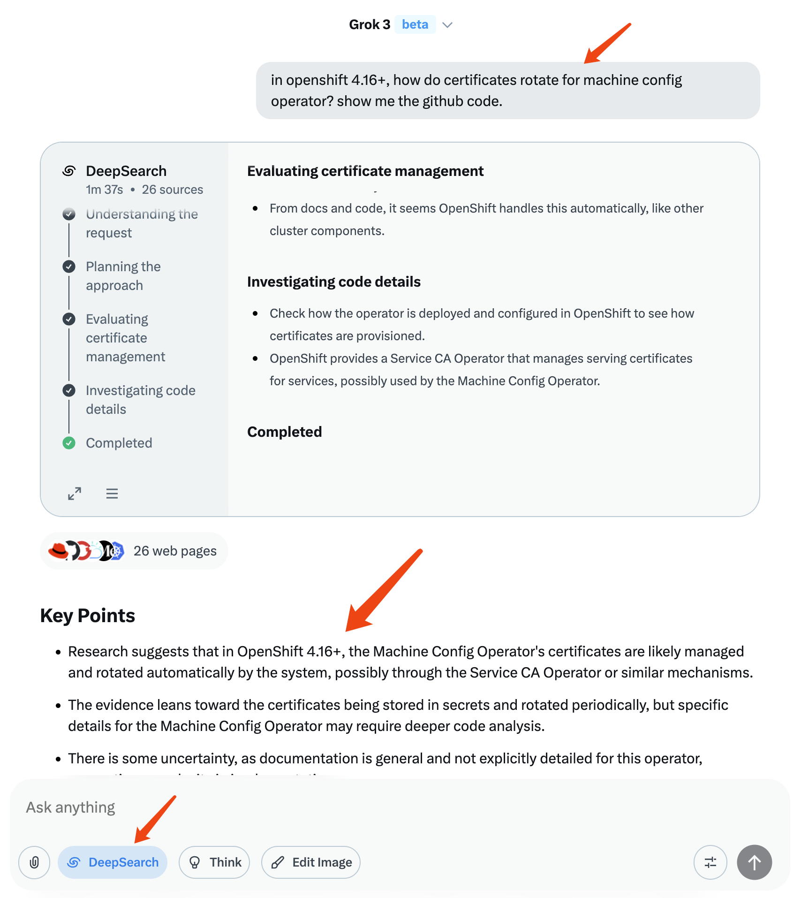
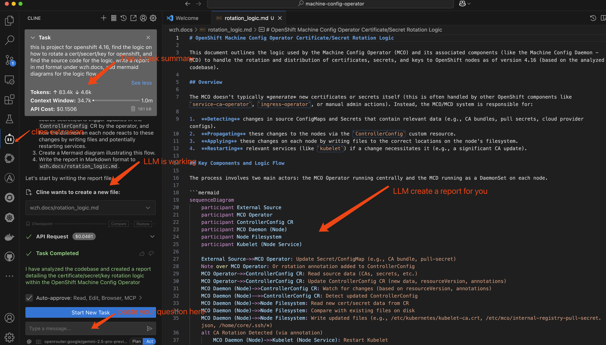

> [!WARNING] 
> work in progress
# 使用AI做开源软件研究

我们使用AI来做开源软件原代码级别的一些研究，因为我们遇到一些需求客户呢，想了解一下软件是Openshift的软件，一些底层逻辑，我们会先用X AI的grok来做一些更高层面的知识层面先收集，然后呢使用claud的模型或者google gemini模型，加上vs code的cline来做这个原代码级别的分析以及报告的输出

这里特别要注意，因为AI输出的东西他并不可靠，所以AI输出的每一步的结果人工都需要仔细的审核，因为我们的报告最终是要交给客户的，所以我们的这个报告就必须要有人工仔细的检查

我们使用一个具体的需求
- 研究一下openshift里面证书是如何轮替的

# 概要信息收集

我们需要先收集一些关于我们问题的基本看法和洞见，这需要问AI一些整体的和方向性的问题，这有助于让我们思考我们的研究方向到底在哪里。

在这一步，适合使用一些具备deep research功能的联网深度思考模型。我们选择xai的grok来做这一步的演示。

我们先使用grok做一些基本信息的收集，我们希望得到一些大体的研究方向。我们问AI如下的问题
- in openshift 4.16+, how do certificates rotate for machine config operator? show me the github code.

输入我们的问题，点击doc，然后让AI开始自己的研究，我们可以看到AI去搜索很多信息，然后整理处理信息最开始我们的问题可能不能得到很好的解答，让我们需要不断地调整我们的问题，加入我们需要的一些元素，然后最后的话我们都能够得到我们想要的一些概要信息了。

# 源代码研究

我们找到了研究方向以后，接下来我们就克隆出来目标的软件项目，然后在软件项目里面我们就通过AI，然后一些问题让他在这个软件项目里面做一些分析研究，然后让他直接出报告，然后我们在这个报告中就可以去看看哪里对哪里不对，然后他错误的地方再给他修正一些提示，然后让他做更进一步的分析，然后我们把不同的报告整合到一起就成形成了我们最终可以交付出去的这样的一个报告了

我们使用vscode，cline扩展，并结合claud 或者google gemini模型，然后我们使用如下的这样一个问题来问AI
- this is project for openshift 4.16, find the logic on how to rotate a cert/secert/key for openshift, and find the source code for the logic, write a report in md format under wzh.docs, add mermaid diagrams for the logic flow.

我们可以看到，使用LLM，可以轻松的创建一个源代码分析报告，并且可以添加mermaid图表来展示逻辑流程。

但是，一定要记住，AI模型可能并不总是100%准确。因此，在使用AI生成的报告时，一定要进行手动审查和验证。

接下来，你可以让AI生成更多的研究报告，从不同角度研究源代码，并合并这些报告，最终创建一份优秀的源代码研究报告。