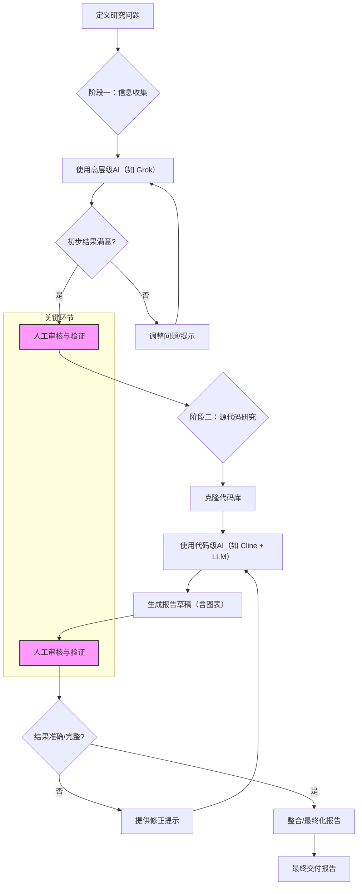

# 利用人工智能进行开源软件研究的方法论报告

> [!CAUTION]
> 请勿使用公共AI工具处理敏感数据，因为这可能导致信息泄露或其他安全风险。

## 1. 引言

本报告旨在阐述一种利用人工智能（AI）工具对开源软件进行源代码级别研究的方法论。此方法论主要源于理解复杂软件系统（如 Red Hat OpenShift）底层逻辑的需求。该过程涉及运用多种 AI 模型与工具，首先进行高层次的知识收集，随后进行详细的源代码分析。

此方法论的一个关键核心在于强调人工监督的重要性。鉴于 AI 生成内容存在固有的不准确性风险，对每个步骤产出的结果进行严格的人工审核是强制性的。这确保了最终交付的报告能够满足准确性和可靠性的标准要求。

视频讲解:

[<kbd></kbd>](https://www.bilibili.com/video/BV1kWR2YLEVu)

- [youtube](https://youtu.be/ESNrMN0EfwE)
- [bilibili](https://www.bilibili.com/video/BV1kWR2YLEVu)

## 2. 方法论概述

研究过程主要分为两个阶段：

1.  **概要信息收集：** 利用具备强大研究和总结能力的 AI 模型（例如 xAI 的 Grok）来收集与特定软件组件或逻辑相关的基础知识，并识别潜在的研究方向。
2.  **源代码详细分析：** 借助与集成开发环境（IDE）相结合的 AI 模型（例如通过 VS Code 插件 Cline 使用 Claude 或 Google Gemini），对目标项目的源代码进行深度分析，生成代码解释，并产出初步的报告草稿。

在整个过程中，迭代优化和人工验证至关重要。

### 方法论流程图

## 3. 案例研究：OpenShift 证书轮替机制

为具体说明此方法论，我们以一个实际需求为例：

*   **研究问题：** 在 OpenShift 4.16 及以上版本中，Machine Config Operator (MCO) 的证书是如何进行轮替的？

### 3.1. 阶段一：概要信息收集

**目标：** 收集关于 MCO 证书轮替的初步见解，并定位 OpenShift 代码库中的相关区域。

**工具选型：** xAI Grok（因其深度研究能力而被选用）。

**流程：**
1.  构建明确、具有导向性的问题，以引导 AI 的研究方向。示例问题如下：
    `
    in openshift 4.16+, how do certificates rotate for machine config operator? show me the github code.
    `
2.  启动 AI 进行信息搜索、处理与整合。此过程通常需要根据 AI 的反馈，不断迭代调整问题，补充上下文或约束条件，直至获得满意的高层级信息和潜在的代码定位线索。

### 3.2. 阶段二：源代码研究

**目标：** 在确定研究方向后，深入分析相关源代码，理解具体实现逻辑，并生成结构化的分析报告。

**工具选型：** VS Code + Cline 扩展 + Claude 或 Google Gemini 模型。

**流程：**
1.  克隆目标 OpenShift 项目的源代码库。
2.  在 VS Code 环境中，利用 Cline 插件向 AI 提出具体的分析请求。示例问题如下：
    `
    this is project for openshift 4.16, find the logic on how to rotate a cert/secert/key for openshift, and find the source code for the logic, write a report in md format under wzh.docs, add mermaid diagrams for the logic flow.
    `
3.  AI 将分析代码库，寻找与证书轮替相关的逻辑，并生成包含 Mermaid 图表（用于可视化逻辑流程）的 Markdown 格式报告。

1.  **人工审核与验证：** 对 AI 生成的报告进行仔细审查。验证代码定位的准确性、逻辑解释的合理性以及 Mermaid 图表的正确性。
2.  **迭代优化：** 若发现错误或遗漏，向 AI 提供修正提示，引导其进行更深入或更精确的分析。
3.  **报告整合：** 可能需要从不同角度提出问题，生成多份分析报告，然后将这些报告中的有效信息整合起来，形成最终的交付成果。

## 4. 结论与注意事项

利用 AI 进行开源软件研究可以显著提高效率，尤其是在初步探索和代码定位阶段。然而，必须强调：

*   **AI 输出的不可靠性：** AI 模型可能产生不准确或不完整的信息。
*   **人工审核的必要性：** 每一份由 AI 辅助生成的报告都必须经过严格的人工审查和验证，以确保其质量和准确性，满足最终交付标准。

通过结合 AI 的快速分析能力和人类的专业判断与验证，可以高效地产出高质量的源代码研究报告。
