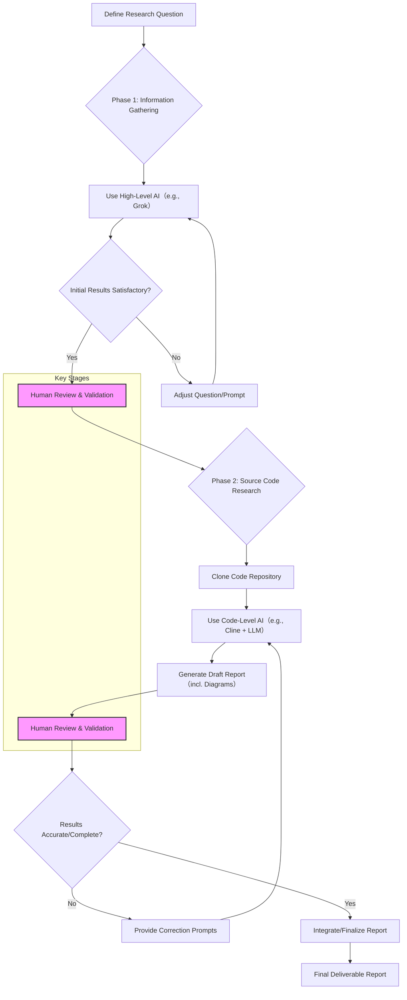

# Methodology Report on Using Artificial Intelligence for Open Source Software Research

## 1. Introduction

This report aims to elaborate on a methodology for conducting source-code level research on open-source software using Artificial Intelligence (AI) tools. This methodology primarily stems from the need to understand the underlying logic of complex software systems, such as Red Hat OpenShift. The process involves utilizing various AI models and tools, starting with high-level knowledge gathering, followed by detailed source code analysis.

A key aspect of this methodology is the emphasis on the importance of human oversight. Given the inherent risk of inaccuracies in AI-generated content, rigorous human review of the results produced at each step is mandatory. This ensures that the final delivered report meets the required standards of accuracy and reliability.

## 2. Methodology Overview

The research process is mainly divided into two phases:

1.  **High-Level Information Gathering:** Utilize AI models with strong research and summarization capabilities (e.g., xAI's Grok) to collect foundational knowledge related to specific software components or logic and identify potential research directions.
2.  **Detailed Source Code Analysis:** Leverage AI models integrated with Integrated Development Environments (IDEs) (e.g., using Claude or Google Gemini via the VS Code extension Cline) to perform in-depth analysis of the target project's source code, generate code explanations, and produce preliminary report drafts.

Throughout the process, iterative refinement and human validation are crucial.

### Methodology Flowchart

## 3. Case Study: OpenShift Certificate Rotation Mechanism

To illustrate this methodology concretely, let's take a practical requirement as an example:

*   **Research Question:** How are certificates rotated for the Machine Config Operator (MCO) in OpenShift versions 4.16 and above?

### 3.1. Phase 1: High-Level Information Gathering

**Objective:** Gather preliminary insights into MCO certificate rotation and locate relevant areas within the OpenShift codebase.

**Tool Selection:** xAI Grok (chosen for its deep research capabilities).

**Process:**
1.  Formulate clear, directive questions to guide the AI's research. Example question:
    `
    in openshift 4.16+, how do certificates rotate for machine config operator? show me the github code.
    `
2.  Initiate the AI for information search, processing, and integration. This often requires iteratively adjusting the question based on AI feedback, adding context or constraints, until satisfactory high-level information and potential code location clues are obtained.

### 3.2. Phase 2: Source Code Research

**Objective:** After defining the research direction, deeply analyze the relevant source code, understand the specific implementation logic, and generate a structured analysis report.

**Tool Selection:** VS Code + Cline Extension + Claude or Google Gemini models.

**Process:**
1.  Clone the source code repository of the target OpenShift project.
2.  Within the VS Code environment, use the Cline plugin to pose specific analysis requests to the AI. Example question:
    `
    this is project for openshift 4.16, find the logic on how to rotate a cert/secert/key for openshift, and find the source code for the logic, write a report in md format under wzh.docs, add mermaid diagrams for the logic flow.
    `
3.  The AI will analyze the codebase, search for logic related to certificate rotation, and generate a Markdown report including Mermaid diagrams (to visualize the logic flow).

4.  **Human Review & Validation:** Carefully review the AI-generated report. Verify the accuracy of code locations, the reasonableness of logical explanations, and the correctness of Mermaid diagrams.
5.  **Iterative Refinement:** If errors or omissions are found, provide correction prompts to the AI, guiding it towards more in-depth or precise analysis.
6.  **Report Integration:** It might be necessary to ask questions from different perspectives, generate multiple analysis reports, and then integrate the valid information from these reports to form the final deliverable.

## 4. Conclusion and Considerations

Using AI for open-source software research can significantly improve efficiency, especially during the initial exploration and code localization phases. However, it must be emphasized that:

*   **Unreliability of AI Output:** AI models may produce inaccurate or incomplete information.
*   **Necessity of Human Review:** Every report generated with AI assistance must undergo rigorous human review and validation to ensure its quality and accuracy meet the final delivery standards.

By combining the rapid analysis capabilities of AI with human expertise and validation, high-quality source code research reports can be produced efficiently.
