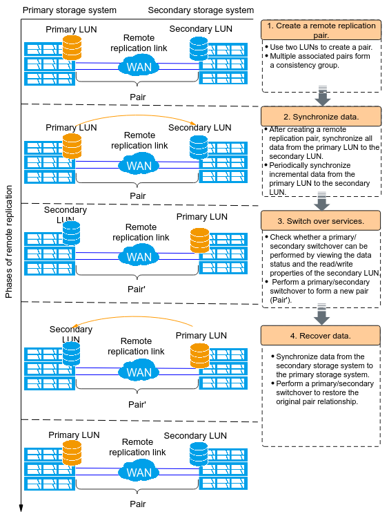
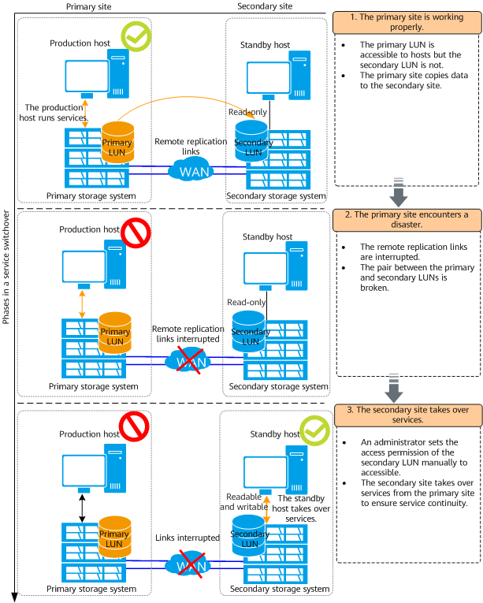
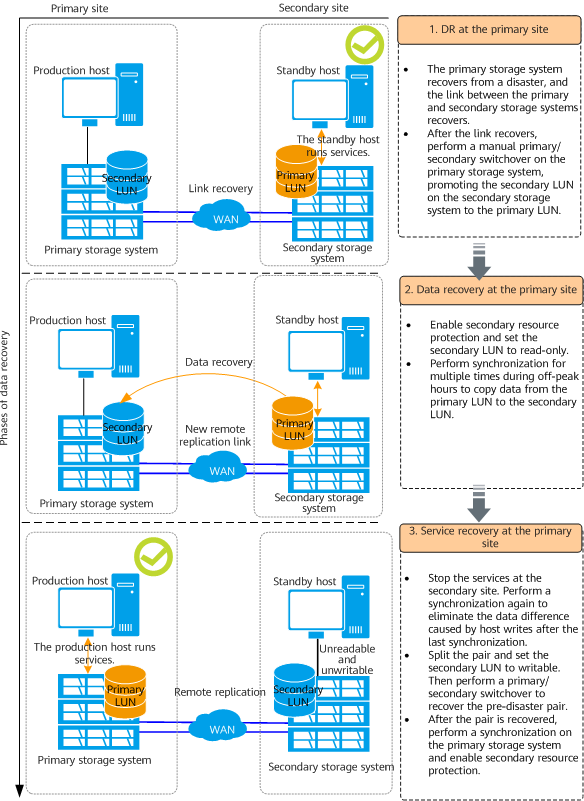
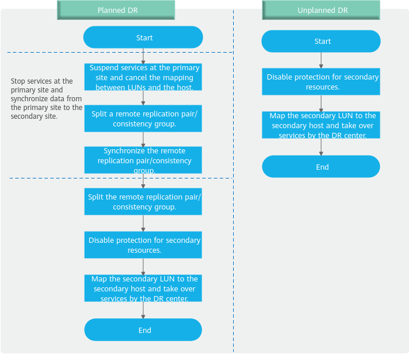
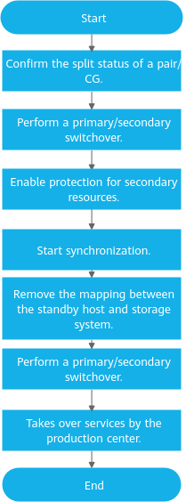

# OceanStor Dorado System automation research

official document link (there may be many, this is one of them)
- https://support.huawei.com/enterprise/en/all-flash-storage/dorado-8000-18000-v6-pid-262794301

# basic replication solution

- https://support.huawei.com/hedex/hdx.do?docid=EDOC1100214756&id=hyperreplicatin_san_0006

## general solution.

## DR process

## switch back process

# DR operation and api

- https://support.huawei.com/hedex/hdx.do?docid=EDOC1100214756&id=hyperreplicatin_san_0150

# switch back operation and api

- https://support.huawei.com/hedex/hdx.do?docid=EDOC1100214756&id=hyperreplicatin_san_0154