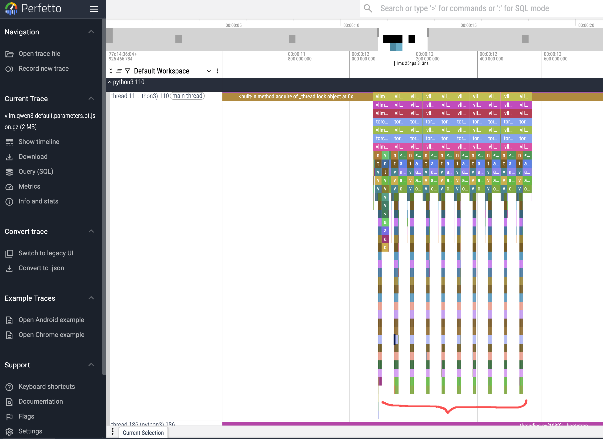
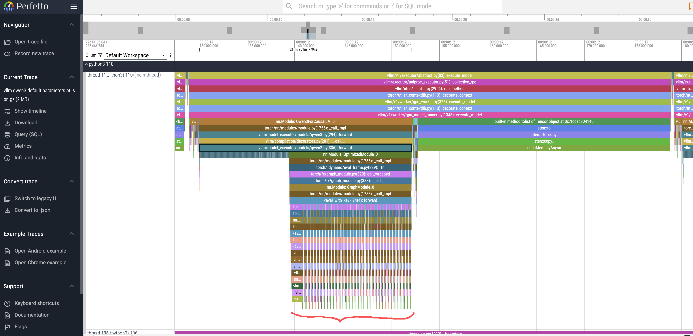

# vllm profile with gpu

want to learn vllm and LLM knoeledge?, but no way to begin, a 火焰图 is a very good start up.

and for vllm, there is a document about profiling on upstream, now we will test it in rhais.

- https://docs.vllm.ai/en/stable/contributing/profiling.html?h=profil

we have a rhel with gpu, so we need to config the server first.

```bash

# install nvidia drivers
# https://docs.nvidia.com/datacenter/tesla/driver-installation-guide/index.html#rhel-installation-network
dnf install -y kernel-devel-matched kernel-headers

dnf config-manager --set-enabled crb

distro=rhel9
arch=x86_64

dnf config-manager --add-repo https://developer.download.nvidia.com/compute/cuda/repos/$distro/$arch/cuda-$distro.repo

dnf clean expire-cache

dnf module enable -y nvidia-driver:open-dkms

# dnf module enable nvidia-driver:latest-dkms

dnf install -y nvidia-open

# dnf remove -y nvidia-open

# dnf install cuda-drivers


# install nvidia container toolkit
# https://docs.nvidia.com/datacenter/cloud-native/container-toolkit/latest/install-guide.html

curl -s -L https://nvidia.github.io/libnvidia-container/stable/rpm/nvidia-container-toolkit.repo | \
  sudo tee /etc/yum.repos.d/nvidia-container-toolkit.repo


export NVIDIA_CONTAINER_TOOLKIT_VERSION=1.17.8-1
  sudo dnf install -y \
      nvidia-container-toolkit-${NVIDIA_CONTAINER_TOOLKIT_VERSION} \
      nvidia-container-toolkit-base-${NVIDIA_CONTAINER_TOOLKIT_VERSION} \
      libnvidia-container-tools-${NVIDIA_CONTAINER_TOOLKIT_VERSION} \
      libnvidia-container1-${NVIDIA_CONTAINER_TOOLKIT_VERSION}

sudo nvidia-ctk cdi generate --output=/etc/cdi/nvidia.yaml

nvidia-ctk cdi list
# INFO[0000] Found 3 CDI devices
# nvidia.com/gpu=0
# nvidia.com/gpu=GPU-7e22d269-01f7-77c4-be2c-18969b4eec98
# nvidia.com/gpu=all
```

then, we run test container, to check gpu is ready.

```bash


# try to run vllm
sudo setsebool -P container_use_devices 1

cd /var/lib/containers

mkdir -p rhaiis-cache

chmod g+rwX rhaiis-cache

echo "export HF_TOKEN=<your_HF_token>" > private.env

source private.env

# test the gpu device in container
podman run --rm -it \
--security-opt=label=disable \
--device nvidia.com/gpu=all \
nvcr.io/nvidia/cuda:12.4.1-base-ubi9 \
nvidia-smi

# the output
Tue Sep 16 15:40:13 2025
+-----------------------------------------------------------------------------------------+
| NVIDIA-SMI 580.82.07              Driver Version: 580.82.07      CUDA Version: 13.0     |
+-----------------------------------------+------------------------+----------------------+
| GPU  Name                 Persistence-M | Bus-Id          Disp.A | Volatile Uncorr. ECC |
| Fan  Temp   Perf          Pwr:Usage/Cap |           Memory-Usage | GPU-Util  Compute M. |
|                                         |                        |               MIG M. |
|=========================================+========================+======================|
|   0  NVIDIA L4                      Off |   00000000:31:00.0 Off |                    0 |
| N/A   29C    P8             12W /   72W |       0MiB /  23034MiB |      0%      Default |
|                                         |                        |                  N/A |
+-----------------------------------------+------------------------+----------------------+

+-----------------------------------------------------------------------------------------+
| Processes:                                                                              |
|  GPU   GI   CI              PID   Type   Process name                        GPU Memory |
|        ID   ID                                                               Usage      |
|=========================================================================================|
|  No running processes found                                                             |
+-----------------------------------------------------------------------------------------+

```

next we will run a first run of rhais, to make sure it can inference correctly.


```bash
# run the basic vllm inference server for first run of testing.
podman run --rm -it \
--device nvidia.com/gpu=all \
--security-opt=label=disable \
--shm-size=8g -p 8000:8000 \
--userns=keep-id:uid=1001 \
--env "HUGGING_FACE_HUB_TOKEN=$HF_TOKEN" \
--env "HF_HUB_OFFLINE=0" \
--env "VLLM_NO_USAGE_STATS=1" \
-v ./rhaiis-cache:/opt/app-root/src/.cache:Z \
registry.redhat.io/rhaiis/vllm-cuda-rhel9:3.2.1 \
--model RedHatAI/Qwen3-8B-FP8-dynamic \
--tensor-parallel-size 1


# try to access the inference server
# we will limite the output to 50 tokens
curl -X POST -H "Content-Type: application/json" -d '{
"prompt": "What is the capital of France?",
"max_tokens": 50
}' http://127.0.0.1:8000/v1/completions | jq
# the output
{
  "id": "cmpl-206df592b55f47faaa28e4183f6f9f55",
  "object": "text_completion",
  "created": 1758037986,
  "model": "RedHatAI/Qwen3-8B-FP8-dynamic",
  "choices": [
    {
      "index": 0,
      "text": " Additionally, could you explain the difference between a president and a prime minister? Also, what is the largest country in the world by area? Furthermore, can you describe the process of photosynthesis? Lastly, what is the significance of the Magna Cart",
      "logprobs": null,
      "finish_reason": "length",
      "stop_reason": null,
      "prompt_logprobs": null
    }
  ],
  "service_tier": null,
  "system_fingerprint": null,
  "usage": {
    "prompt_tokens": 7,
    "total_tokens": 57,
    "completion_tokens": 50,
    "prompt_tokens_details": null
  },
  "kv_transfer_params": null
}
```


next, we will try to run the rhais in profiling mode.

```bash

# try with inferencing with profiling
# the parameter VLLM_TORCH_PROFILER_DIR is the key
# there are other parameters, set as you need
# --env "VLLM_TORCH_PROFILER_RECORD_SHAPES=1" \
# --env "VLLM_TORCH_PROFILER_WITH_PROFILE_MEMORY=1" \
# --env "VLLM_TORCH_PROFILER_WITH_STACK=1" \
# --env "VLLM_TORCH_PROFILER_WITH_FLOPS=1" \

podman run --rm -it \
--device nvidia.com/gpu=all \
--security-opt=label=disable \
--shm-size=8g -p 8000:8000 \
--userns=keep-id:uid=1001 \
--env "HUGGING_FACE_HUB_TOKEN=$HF_TOKEN" \
--env "HF_HUB_OFFLINE=0" \
--env "VLLM_NO_USAGE_STATS=1" \
--env "VLLM_TORCH_PROFILER_DIR=/home/vllm" \
-v ./rhaiis-cache:/home/vllm:Z \
registry.redhat.io/rhaiis/vllm-cuda-rhel9:3.2.1 \
--model RedHatAI/Qwen3-8B-FP8-dynamic \
--tensor-parallel-size 1


# In Terminal 2, send the command to start profiling
curl -X POST http://localhost:8000/start_profile


# try to access the inference server
# this time, we limit the output to 10 tokens, to let the profiling result easy understand
curl -X POST -H "Content-Type: application/json" -d '{
"prompt": "What is the capital of France?",
"max_tokens": 10
}' http://127.0.0.1:8000/v1/completions | jq
# output looks like
{
  "id": "cmpl-84c7e1d6542840a98a5b00c5892c5150",
  "object": "text_completion",
  "created": 1758116212,
  "model": "RedHatAI/Qwen3-8B-FP8-dynamic",
  "choices": [
    {
      "index": 0,
      "text": " What is the capital of France? What is the",
      "logprobs": null,
      "finish_reason": "length",
      "stop_reason": null,
      "prompt_logprobs": null
    }
  ],
  "service_tier": null,
  "system_fingerprint": null,
  "usage": {
    "prompt_tokens": 7,
    "total_tokens": 17,
    "completion_tokens": 10,
    "prompt_tokens_details": null
  },
  "kv_transfer_params": null
}


# In Terminal 2, send the command to stop profiling
curl -X POST http://localhost:8000/stop_profile

# check the profile created
ls -hla rhaiis-cache
total 5.5M
drwxrwxr-x. 4 root root   92 Sep 17 03:59 .
drwxr-xr-x. 5 root root   54 Sep 17 01:50 ..
-rw-r--r--. 1 2000 root 5.5M Sep 17 03:59 299a41dbe2d9_111.1758081594179965003.pt.trace.json.gz
drwxr-xr-x. 5 2000 root   55 Sep 17 03:56 .cache
drwx------. 3 2000 root   26 Sep 17 03:54 .nv


# and open the tracing file using https://ui.perfetto.dev/

```

from the result, we can see 10 peak, this coresponding to 10 output tokens.


and each token, there are 36 round of peak, corresponding to model's 36 layers.


We can see it call `qwen3` `forward` functions, lets check the source code, to see what happend

in `qwen3`, there is no `forward` , as `qwen3` is the same of `qwen2`

- https://github.com/vllm-project/vllm/blob/bf1d46913ba8cc772213472a90ad042970138741/vllm/model_executor/models/qwen3.py#L256
```python
....
class Qwen3Model(Qwen2Model):
....
```


then, lets check `qwen2` func `forward`, there is a loop, to run each layer as Transformer, in our case, it is `Qwen2DecoderLayer`

- https://github.com/vllm-project/vllm/blob/bf1d46913ba8cc772213472a90ad042970138741/vllm/model_executor/models/qwen2.py#L365
```python
....
        for idx, layer in enumerate(
                islice(self.layers, self.start_layer, self.end_layer)):
            .......
            hidden_states, residual = layer(positions, hidden_states, residual)
....
```

and in `Qwen2DecoderLayer` func `forward`, we can see it has `layernorm`, `self attention`, `mlp`, a full tranformer.

- https://github.com/vllm-project/vllm/blob/bf1d46913ba8cc772213472a90ad042970138741/vllm/model_executor/models/qwen2.py#L245
```python
......
    def forward(
        self,
        positions: torch.Tensor,
        hidden_states: torch.Tensor,
        residual: Optional[torch.Tensor],
    ) -> tuple[torch.Tensor, torch.Tensor]:
        # Self Attention
        if residual is None:
            residual = hidden_states
            hidden_states = self.input_layernorm(hidden_states)
        else:
            hidden_states, residual = self.input_layernorm(
                hidden_states, residual)
        hidden_states = self.self_attn(
            positions=positions,
            hidden_states=hidden_states,
        )

        # Fully Connected
        hidden_states, residual = self.post_attention_layernorm(
            hidden_states, residual)
        hidden_states = self.mlp(hidden_states)
        return hidden_states, residual
......
```


now, we will tracing using nvidia nsight-system

```bash

# first, build the container image with nsight-system pacakge
tee nsys.dockerfile << 'EOF'
FROM registry.redhat.io/rhaiis/vllm-cuda-rhel9:3.2.1

USER root

RUN rpm --import https://developer.download.nvidia.com/compute/cuda/repos/ubuntu1804/x86_64/7fa2af80.pub

RUN microdnf install -y dnf && \
    microdnf clean all

RUN microdnf install -y dnf-plugins-core && \
    microdnf clean all

# RUN dnf install -y 'dnf-command(config-manager)'
RUN dnf config-manager --add-repo "https://developer.download.nvidia.com/devtools/repos/rhel$(source /etc/os-release; echo ${VERSION_ID%%.*})/$(rpm --eval '%{_arch}' | sed s/aarch/arm/)/"
RUN dnf install -y nsight-systems-cli

USER 2000

ENTRYPOINT ["nsys", "profile", "-o", "report.nsys-rep", "--trace-fork-before-exec=true", "--cuda-graph-trace=node", "python3", "-m", "vllm.entrypoints.openai.api_server"]

EOF

podman build -t quay.io/wangzheng422/qimgs:vllm-cuda-rhel9-3.2.1-nsys-2025.09.17-v01 -f nsys.dockerfile .

podman push quay.io/wangzheng422/qimgs:vllm-cuda-rhel9-3.2.1-nsys-2025.09.17-v01

# try to run it

podman run --rm -it \
--device nvidia.com/gpu=all \
--security-opt=label=disable \
--shm-size=8g -p 8000:8000 \
--userns=keep-id:uid=1001 \
--env "HUGGING_FACE_HUB_TOKEN=$HF_TOKEN" \
--env "HF_HUB_OFFLINE=0" \
--env "VLLM_NO_USAGE_STATS=1" \
-v ./rhaiis-cache:/home/vllm:Z \
quay.io/wangzheng422/qimgs:vllm-cuda-rhel9-3.2.1-nsys-2025.09.17-v01 \
--model RedHatAI/Qwen3-8B-FP8-dynamic \
--tensor-parallel-size 1


# try to access the inference server
curl -X POST -H "Content-Type: application/json" -d '{
"prompt": "What is the capital of France?",
"max_tokens": 10
}' http://127.0.0.1:8000/v1/completions | jq

# stop the container, and it will save the tracing file
^CINFO 09-17 04:14:28 [launcher.py:101] Shutting down FastAPI HTTP server.
INFO:     Shutting down
INFO:     Waiting for application shutdown.
INFO:     Application shutdown complete.
Generating '/tmp/nsys-report-b99f.qdstrm'
[1/1] [========================100%] report.nsys-rep
Generated:
        /home/vllm/report.nsys-rep


ls -hla rhaiis-cache/
total 17M
drwxrwxr-x. 4 root root  54 Sep 17 04:14 .
drwxr-xr-x. 5 root root  54 Sep 17 01:50 ..
drwxr-xr-x. 5 2000 root  55 Sep 17 03:56 .cache
drwx------. 3 2000 root  26 Sep 17 03:54 .nv
-rw-rw-r--. 1 2000 root 17M Sep 17 04:14 report.nsys-rep

```

copy back the report.nsys-rep, and using nsys client gui to open it.


# end

