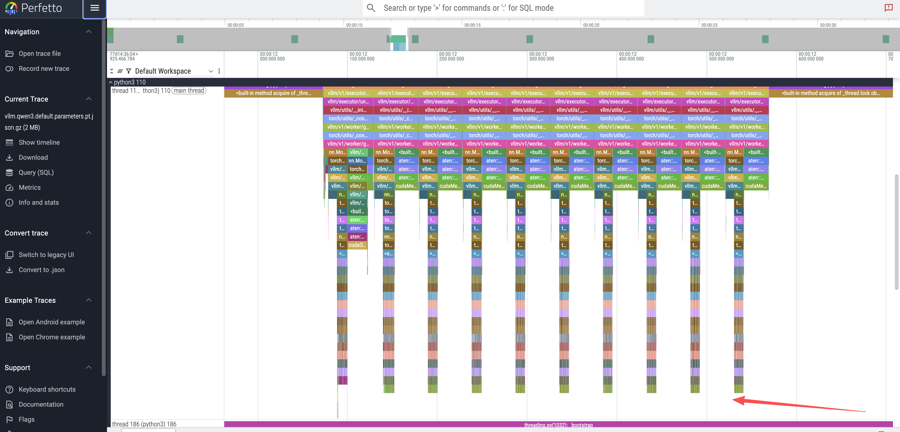
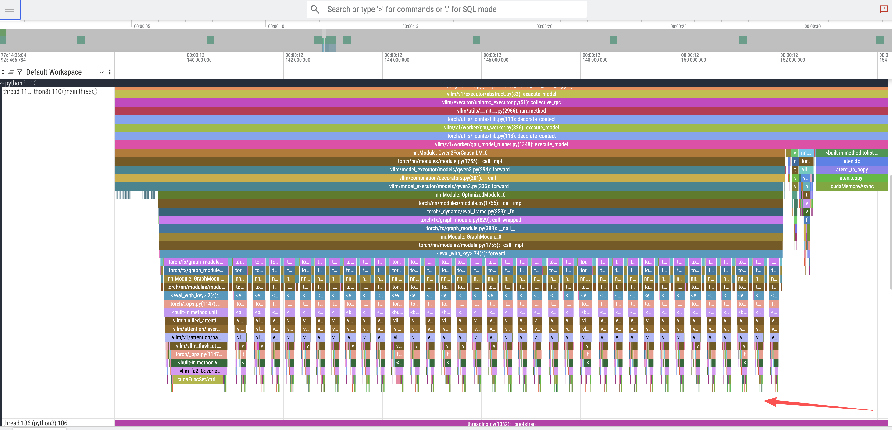
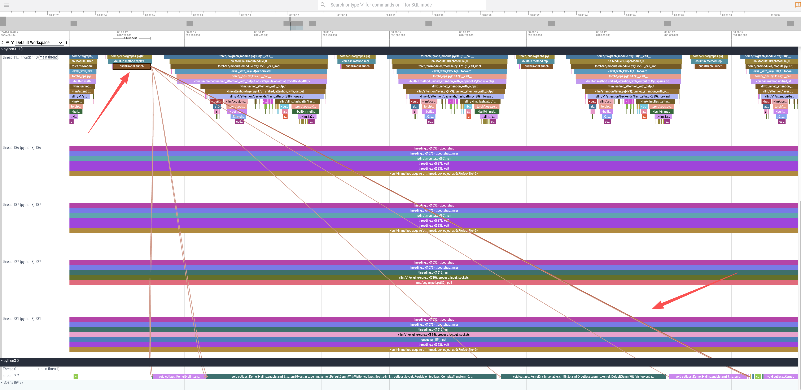
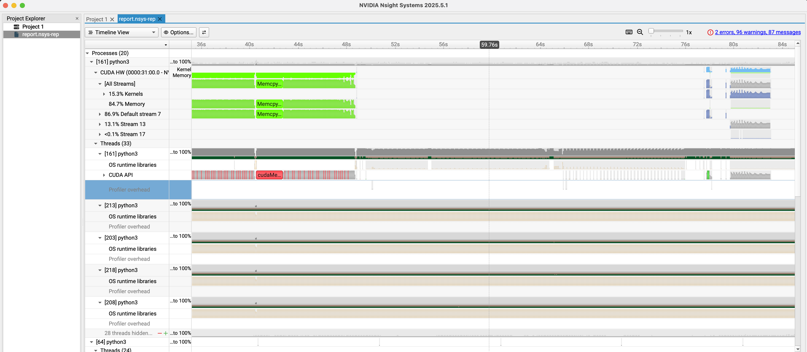

# Profiling vLLM with GPU Acceleration on RHEL

## Introduction

Understanding the performance characteristics of Large Language Models (LLMs) is crucial for optimization. For those new to vLLM and LLM infrastructure, performance profiling can seem daunting. However, tools like flame graphs provide an intuitive and powerful starting point for visualizing execution flow and identifying bottlenecks.

This document serves as a comprehensive guide to profiling a vLLM inference server on a Red Hat Enterprise Linux (RHEL) system equipped with NVIDIA GPUs. We will follow the official vLLM profiling documentation as a reference, adapting the steps for our specific environment.

The process involves three main stages:
1.  **Environment Setup**: Configuring the RHEL server with the necessary NVIDIA drivers and container toolkit.
2.  **Basic Profiling with PyTorch Profiler**: Running the vLLM server with its built-in PyTorch profiler to capture a trace of an inference request.
3.  **Advanced Profiling with NVIDIA Nsight Systems**: Building a custom container image with NVIDIA's advanced profiling tools for deeper GPU insights.

- **Upstream Reference**: [vLLM Profiling Documentation](https://docs.vllm.ai/en/stable/contributing/profiling.html?h=profil)

---

## Part 1: Environment Configuration

Before we can profile vLLM, we must prepare our RHEL server to support GPU-accelerated containers.

### Step 1.1: Install NVIDIA Drivers

First, install the NVIDIA drivers, which are essential for the OS to communicate with the GPU hardware.

```bash
# Install matching kernel development packages, which are required for building the driver modules
# https://docs.nvidia.com/datacenter/tesla/driver-installation-guide/index.html#rhel-installation-network
dnf install -y kernel-devel-matched kernel-headers

# Enable the CodeReady Builder (CRB) repository to access additional development packages
dnf config-manager --set-enabled crb

# Define variables for the distribution and architecture
distro=rhel9
arch=x86_64

# Add the NVIDIA CUDA repository to the system's package manager
dnf config-manager --add-repo https://developer.download.nvidia.com/compute/cuda/repos/$distro/$arch/cuda-$distro.repo

# Clear the package manager cache
dnf clean expire-cache

# Enable the open-source, DKMS-based NVIDIA driver module
dnf module enable -y nvidia-driver:open-dkms
# As an alternative, you could use: dnf module enable nvidia-driver:latest-dkms

# Install the NVIDIA open-source driver package
dnf install -y nvidia-open
# To uninstall, you would run: dnf remove -y nvidia-open
# For proprietary drivers, you might install: dnf install cuda-drivers
```

### Step 1.2: Install NVIDIA Container Toolkit

The NVIDIA Container Toolkit allows containers to access the host's GPU. We will install it to enable GPU support in Podman.

```bash
# Add the NVIDIA Container Toolkit repository
# https://docs.nvidia.com/datacenter/cloud-native/container-toolkit/latest/install-guide.html
curl -s -L https://nvidia.github.io/libnvidia-container/stable/rpm/nvidia-container-toolkit.repo | \
  sudo tee /etc/yum.repos.d/nvidia-container-toolkit.repo

# Install a specific version of the toolkit components for stability
export NVIDIA_CONTAINER_TOOLKIT_VERSION=1.17.8-1
sudo dnf install -y \
      nvidia-container-toolkit-${NVIDIA_CONTAINER_TOOLKIT_VERSION} \
      nvidia-container-toolkit-base-${NVIDIA_CONTAINER_TOOLKIT_VERSION} \
      libnvidia-container-tools-${NVIDIA_CONTAINER_TOOLKIT_VERSION} \
      libnvidia-container1-${NVIDIA_CONTAINER_TOOLKIT_VERSION}

# Generate the CDI specification file, which allows container runtimes to discover the GPU devices
sudo nvidia-ctk cdi generate --output=/etc/cdi/nvidia.yaml

# List the available CDI devices to confirm the setup
nvidia-ctk cdi list
# Expected output:
# INFO[0000] Found 3 CDI devices
# nvidia.com/gpu=0
# nvidia.com/gpu=GPU-7e22d269-01f7-77c4-be2c-18969b4eec98
# nvidia.com/gpu=all
```

### Step 1.3: Verify GPU Access in a Container

Now, let's run a test container to ensure it can successfully access the GPU.

```bash
# Allow containers to use devices by setting the appropriate SELinux boolean
sudo setsebool -P container_use_devices 1

# Run a CUDA-based container and execute nvidia-smi to verify GPU access
podman run --rm -it \
--security-opt=label=disable \
--device nvidia.com/gpu=all \
nvcr.io/nvidia/cuda:12.4.1-base-ubi9 \
nvidia-smi

# The output should display the GPU status, confirming the setup is correct.
# Tue Sep 16 15:40:13 2025
# +-----------------------------------------------------------------------------------------+
# | NVIDIA-SMI 580.82.07              Driver Version: 580.82.07      CUDA Version: 13.0     |
# +-----------------------------------------+------------------------+----------------------+
# | GPU  Name                 Persistence-M | Bus-Id          Disp.A | Volatile Uncorr. ECC |
# | Fan  Temp   Perf          Pwr:Usage/Cap |           Memory-Usage | GPU-Util  Compute M. |
# |                                         |                        |               MIG M. |
# |=========================================+========================+======================|
# |   0  NVIDIA L4                      Off |   00000000:31:00.0 Off |                    0 |
# | N/A   29C    P8             12W /   72W |       0MiB /  23034MiB |      0%      Default |
# |                                         |                        |                  N/A |
# +-----------------------------------------+------------------------+----------------------+
# ...
```

---

## Part 2: Basic Profiling with PyTorch Profiler

With the environment ready, we can now run the vLLM server and perform a basic profiling session.

### Step 2.1: Initial Inference Test

Before diving into profiling, it's essential to confirm that the vLLM inference server is functioning correctly in our environment. This step ensures that any issues encountered later are related to profiling, not the basic setup.

We will launch the vLLM container and send a simple inference request to verify its operation. For detailed instructions on deploying the Red Hat AI Inference Server, refer to the [official documentation](https://docs.redhat.com/en/documentation/red_hat_ai_inference_server/3.2/html-single/getting_started/index#inference-rhaiis-with-podman-nvidia-cuda_getting-started).

```bash
# Navigate to a directory for storing container data
mkdir -p rhaiis-cache
chmod g+rwX rhaiis-cache

# Create an environment file for your Hugging Face token
echo "export HF_TOKEN=<your_HF_token>" > private.env
source private.env

# Run the vLLM container with the necessary GPU and volume mappings.
# --shm-size=8g: Allocates 8GB of shared memory, crucial for inter-process communication in high-performance computing.
# --userns=keep-id:uid=1001: Ensures the container user maps to a host user, simplifying file permissions for mounted volumes.
podman run --rm -it \
--device nvidia.com/gpu=all \
--security-opt=label=disable \
--shm-size=8g -p 8000:8000 \
--userns=keep-id:uid=1001 \
--env "HUGGING_FACE_HUB_TOKEN=$HF_TOKEN" \
--env "HF_HUB_OFFLINE=0" \
--env "VLLM_NO_USAGE_STATS=1" \
-v ./rhaiis-cache:/home/vllm:Z \
registry.redhat.io/rhaiis/vllm-cuda-rhel9:3.2.1 \
--model RedHatAI/Qwen3-8B-FP8-dynamic \
--tensor-parallel-size 1
```

With the server running, open a new terminal to send a test inference request. We'll limit the output to 50 tokens for this initial check.

```bash
# In a new terminal, send a test request to the server.
# We limit the output to 50 tokens for this initial test.
curl -X POST -H "Content-Type: application/json" -d '{
"prompt": "What is the capital of France?",
"max_tokens": 50
}' http://127.0.0.1:8000/v1/completions | jq

# A successful response confirms the server is working.
# {
#   "id": "cmpl-206df592b55f47faaa28e4183f6f9f55",
#   ...
#   "usage": {
#     "prompt_tokens": 7,
#     "total_tokens": 57,
#     "completion_tokens": 50
#   }
# }
```

### Step 2.2: Running in Profiling Mode

Now that we've confirmed the server works, we can restart it with the PyTorch profiler enabled. vLLM provides a convenient way to activate the profiler by setting an environment variable.

```bash
# Run the container again, this time setting the VLLM_TORCH_PROFILER_DIR environment variable.
# This instructs vLLM to save the resulting trace files to the specified directory inside the container.
# For more granular analysis, vLLM supports additional profiler variables to capture shapes, memory usage, stack traces, and FLOPs.
# --env "VLLM_TORCH_PROFILER_RECORD_SHAPES=1"
# --env "VLLM_TORCH_PROFILER_WITH_PROFILE_MEMORY=1"
# --env "VLLM_TORCH_PROFILER_WITH_STACK=1"
# --env "VLLM_TORCH_PROFILER_WITH_FLOPS=1"
podman run --rm -it \
--device nvidia.com/gpu=all \
--security-opt=label=disable \
--shm-size=8g -p 8000:8000 \
--userns=keep-id:uid=1001 \
--env "HUGGING_FACE_HUB_TOKEN=$HF_TOKEN" \
--env "HF_HUB_OFFLINE=0" \
--env "VLLM_NO_USAGE_STATS=1" \
--env "VLLM_TORCH_PROFILER_DIR=/home/vllm" \
-v ./rhaiis-cache:/home/vllm:Z \
registry.redhat.io/rhaiis/vllm-cuda-rhel9:3.2.1 \
--model RedHatAI/Qwen3-8B-FP8-dynamic \
--tensor-parallel-size 1
```

In a second terminal, we will first send a command to start the profiling.
```bash
# In Terminal 2, send the command to start profiling.
curl -X POST http://localhost:8000/start_profile
```

Then, we send an inference request, keeping the token count low (10) to ensure the resulting trace is easy to analyze.
```bash
# Send an inference request. We use a small number of tokens (10)
# to make the resulting trace easier to analyze.
curl -X POST -H "Content-Type: application/json" -d '{
"prompt": "What is the capital of France?",
"max_tokens": 10
}' http://127.0.0.1:8000/v1/completions | jq
```

After the request completes, we send another command to stop the profiler.
```bash
# send the command to stop profiling.
curl -X POST http://localhost:8000/stop_profile
```

At this point, the trace file is generated and can be found in the cache directory.
```bash
# Check the cache directory for the generated trace file.
ls -hla rhaiis-cache
# total 5.5M
# drwxrwxr-x. 4 root root   92 Sep 17 03:59 .
# ...
# -rw-r--r--. 1 2000 root 5.5M Sep 17 03:59 299a41dbe2d9_111.1758081594179965003.pt.trace.json.gz
```

### Step 2.3: Analyzing the Profile Trace

The generated `.pt.trace.json.gz` file can be analyzed using a trace viewer like [Perfetto UI](https://ui.perfetto.dev/).

Upon opening the trace, we can observe distinct patterns:
1.  **Token Generation Peaks**: The top-level view shows 10 distinct peaks, directly corresponding to the `max_tokens: 10` we requested.
    

2.  **Model Layer Execution**: Zooming into a single token peak reveals 36 smaller, sequential peaks. These correspond to the 36 decoder layers in the Qwen3-8B model.
    

3.  **CUDA Kernel Execution**: By zooming further into the trace and selecting a `cudaGraphLaunch`, we can inspect the underlying GPU operations. This reveals the invocation of several CUDA kernels responsible for the actual computation, including the highly optimized `cutlass::gemm` kernels for general matrix multiplication (GEMM), which is a fundamental operation in transformer models.
    

To understand the code path, we can examine the vLLM source. The trace shows calls to a `qwen3` `forward` function. Looking at the source code, `Qwen3Model` inherits directly from `Qwen2Model`.

- **Source**: [`vllm/model_executor/models/qwen3.py`](https://github.com/vllm-project/vllm/blob/bf1d46913ba8cc772213472a90ad042970138741/vllm/model_executor/models/qwen3.py#L256)
```python
class Qwen3Model(Qwen2Model):
    ...
```

The `forward` method in `Qwen2Model` iterates through the model's layers, which are instances of `Qwen3DecoderLayer`.

- **Source**: [`vllm/model_executor/models/qwen2.py`](https://github.com/vllm-project/vllm/blob/bf1d46913ba8cc772213472a90ad042970138741/vllm/model_executor/models/qwen2.py#L365)
```python
# ...
    def forward(
        self,
        input_ids: torch.Tensor,
        positions: torch.Tensor,
        intermediate_tensors: Optional[IntermediateTensors] = None,
        inputs_embeds: Optional[torch.Tensor] = None,
    ) -> Union[torch.Tensor, IntermediateTensors]:
        # ...
        for idx, layer in enumerate(
                islice(self.layers, self.start_layer, self.end_layer)):
            # ...
            hidden_states, residual = layer(positions, hidden_states, residual)
# ...
```

Finally, the `forward` method of `Qwen3DecoderLayer` reveals the standard components of a transformer block: layer normalization, self-attention, and a multi-layer perceptron (MLP).

- **Source**: [`vllm/model_executor/models/qwen3.py`](https://github.com/vllm-project/vllm/blob/bf1d46913ba8cc772213472a90ad042970138741/vllm/model_executor/models/qwen3.py#L217)
```python
# ...
    def forward(
        self,
        positions: torch.Tensor,
        hidden_states: torch.Tensor,
        residual: Optional[torch.Tensor],
    ) -> tuple[torch.Tensor, torch.Tensor]:
        # Self Attention
        if residual is None:
            residual = hidden_states
            hidden_states = self.input_layernorm(hidden_states)
        else:
            hidden_states, residual = self.input_layernorm(
                hidden_states, residual)
        hidden_states = self.self_attn(
            positions=positions,
            hidden_states=hidden_states,
        )

        # Fully Connected
        hidden_states, residual = self.post_attention_layernorm(
            hidden_states, residual)
        hidden_states = self.mlp(hidden_states)
        return hidden_states, residual
# ...
```

This analysis confirms that the flame graph accurately represents the model's architecture and execution flow.

---

## Part 3: Advanced Profiling with NVIDIA Nsight Systems

For a more detailed, hardware-level view, we can use NVIDIA Nsight Systems. This requires building a custom container image with the Nsight CLI tools.

### Step 3.1: Build the Nsight-enabled Container

Create a `Dockerfile` to build the new image.

```dockerfile
# nsys.dockerfile
FROM registry.redhat.io/rhaiis/vllm-cuda-rhel9:3.2.1

USER root

# Add NVIDIA developer repository for Nsight Systems
RUN rpm --import https://developer.download.nvidia.com/compute/cuda/repos/ubuntu1804/x86_64/7fa2af80.pub
RUN microdnf install -y dnf && microdnf clean all
RUN microdnf install -y dnf-plugins-core && microdnf clean all
RUN dnf config-manager --add-repo "https://developer.download.nvidia.com/devtools/repos/rhel$(source /etc/os-release; echo ${VERSION_ID%%.*})/$(rpm --eval '%{_arch}' | sed s/aarch/arm/)/"

# Install the Nsight Systems CLI
RUN dnf install -y nsight-systems-cli

USER 2000

# Set the entrypoint to automatically wrap the vLLM server with nsys profile
ENTRYPOINT ["nsys", "profile", "-o", "/home/vllm/report.nsys-rep", "--trace-fork-before-exec=true", "--cuda-graph-trace=node", "python3", "-m", "vllm.entrypoints.openai.api_server"]
```

Build and push the image:

```bash
podman build -t quay.io/wangzheng422/qimgs:vllm-cuda-rhel9-3.2.1-nsys-2025.09.17-v01 -f nsys.dockerfile .
podman push quay.io/wangzheng422/qimgs:vllm-cuda-rhel9-3.2.1-nsys-2025.09.17-v01
```

### Step 3.2: Capturing an Nsight Systems Trace

With our custom container image ready, we can now perform a profiling run. The container is configured to launch the vLLM server under the `nsys` profiler automatically, so the profiling process begins as soon as the container starts.

First, launch the custom container. This will start the vLLM server in profiling mode.

```bash
# Launch the custom container. The ENTRYPOINT is configured to wrap the vLLM
# server command with `nsys profile`, so profiling starts automatically.
podman run --rm -it \
--device nvidia.com/gpu=all \
--security-opt=label=disable \
--shm-size=8g -p 8000:8000 \
--userns=keep-id:uid=1001 \
--env "HUGGING_FACE_HUB_TOKEN=$HF_TOKEN" \
--env "HF_HUB_OFFLINE=0" \
--env "VLLM_NO_USAGE_STATS=1" \
-v ./rhaiis-cache:/home/vllm:Z \
quay.io/wangzheng422/qimgs:vllm-cuda-rhel9-3.2.1-nsys-2025.09.17-v01 \
--model RedHatAI/Qwen3-8B-FP8-dynamic \
--tensor-parallel-size 1
```

While the server is running, open a new terminal and send an inference request. This action triggers the specific code paths we want to profile.

```bash
# In a new terminal, send an inference request to trigger the profiled code path.
# This ensures that the Nsight trace captures the GPU activity during model execution.
curl -X POST -H "Content-Type: application/json" -d '{
"prompt": "What is the capital of France?",
"max_tokens": 10
}' http://127.0.0.1:8000/v1/completions | jq
```

Once the inference request is complete, you can stop the container by pressing `Ctrl+C` in the first terminal. Upon termination, Nsight Systems will process the collected data and save the final trace file to the designated path inside the container.

```bash
# Press Ctrl+C in the container's terminal. Nsight will gracefully shut down
# and save the profiling report.
# ^CINFO 09-17 04:14:28 [launcher.py:101] Shutting down FastAPI HTTP server.
# ...
# Generating '/tmp/nsys-report-b99f.qdstrm'
# [1/1] [========================100%] report.nsys-rep
# Generated:
#         /home/vllm/report.nsys-rep
```

Finally, verify that the report file has been created in the mounted `rhaiis-cache` directory on your host system.

```bash
# Verify that the report file was created in the host directory.
ls -hla rhaiis-cache/
# total 17M
# ...
# -rw-rw-r--. 1 2000 root 17M Sep 17 04:14 report.nsys-rep
```

### Step 3.3: Analyzing the Nsight Report

Copy the `report.nsys-rep` file from the `rhaiis-cache` directory to your local machine and open it with the NVIDIA Nsight Systems GUI. This tool provides a detailed timeline of CPU and GPU activities, including CUDA kernel launches, memory transfers, and API calls, allowing for in-depth performance analysis.



## Offline Analysis of Profiling Data

For users who want to explore the profiling results without setting up a GPU environment or running the profiling process themselves, we provide the generated trace files. You can download these files and use the corresponding tools (Perfetto UI for PyTorch traces, NVIDIA Nsight Systems GUI for Nsight reports) to conduct your own analysis.

- **PyTorch Profiling Result**: [vllm.qwen3.default.parameters.pt.json.gz](https://github.com/user-attachments/files/22400646/vllm.qwen3.default.parameters.pt.json.gz)
- **NVIDIA Nsight Result**: [report.nsys-rep.zip](https://github.com/user-attachments/files/22400670/report.nsys-rep.zip)

---

## Conclusion

Through this guide, we have successfully configured a GPU-enabled RHEL environment, performed basic performance tracing with the PyTorch profiler, and set up an advanced profiling workflow with NVIDIA Nsight Systems.

- The **PyTorch Profiler** is excellent for quickly understanding the high-level execution flow and correlating it with the model's architecture.
- **NVIDIA Nsight Systems** offers a much deeper, hardware-centric view, which is indispensable for advanced optimization of CUDA kernels and memory access patterns.

By leveraging these tools, developers and MLOps engineers can gain critical insights into vLLM's performance, paving the way for targeted optimizations and more efficient LLM serving.
