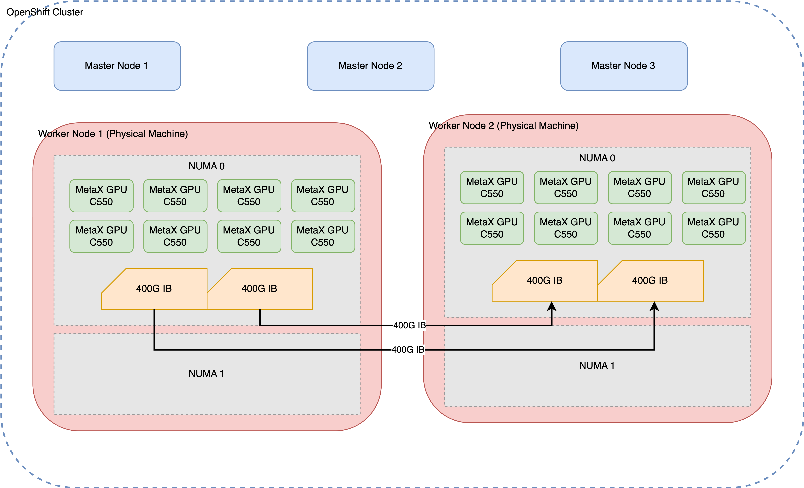

# Debugging MetaX MCCL Performance Issues

## 1. Introduction

This document provides a detailed walkthrough of the process for debugging performance issues with MetaX MCCL (MetaX Collective Communication Library) in a multi-node GPU environment. The primary goal is to ensure efficient cross-node communication for distributed workloads, such as large-scale model inference (e.g., vLLM).

The debugging process is critical for identifying and resolving bottlenecks that can severely impact the performance of distributed applications. By systematically examining each layer of the technology stack—from the physical network to the communication libraries—we can pinpoint the root cause of performance degradation and implement effective solutions.

### 1.1. Environment Setup

The test environment consists of two physical machines, each equipped with eight MetaX GPUs and interconnected via a 400G InfiniBand (IB) network. This high-speed interconnect is essential for achieving optimal performance in distributed GPU computing.



### 1.2. Initial Problem Observation

The initial problem was observed during multi-node inference tasks. While single-node inference performed as expected, scaling to a two-node configuration resulted in a significant performance drop, with a nearly tenfold decrease in throughput. This indicated a potential issue with the cross-node communication setup.

This document outlines the systematic approach taken to diagnose and resolve this performance issue, starting from the foundational network layer and progressing up to the MCCL/NCCL communication layer.

## 2. Initial Environment Assessment

Before diving into performance testing, it's crucial to establish a baseline understanding of the system's hardware and software configuration. This section details the commands used to gather information about the GPUs, PCI devices, CPU power settings, and InfiniBand network configuration.

### 2.1. GPU Configuration

The `mx-smi` command provides a snapshot of the GPU status on each node, confirming that all eight MetaX C500 GPUs are correctly detected and operational.

```bash
[root@mx-sh-demo perf]# mx-smi
mx-smi  version: 2.2.3

=================== MetaX System Management Interface Log ===================
Timestamp                                         : Fri Dec 12 16:34:07 2025

Attached GPUs                                     : 8
+---------------------------------------------------------------------------------+
| MX-SMI 2.2.3                        Kernel Mode Driver Version: 3.5.0           |
| MACA Version: 2.32.0.6              BIOS Version: 1.26.1.0                      |
|------------------------------------+---------------------+----------------------+
| GPU         NAME                   | Bus-id              | GPU-Util             |
| Temp        Pwr:Usage/Cap          | Memory-Usage        |                      |
|====================================+=====================+======================|
| 0           MetaX C500             | 0000:08:00.0        | 0%                   |
| 31C         35W / 350W             | 858/65536 MiB       |                      |
+------------------------------------+---------------------+----------------------+
| 1           MetaX C500             | 0000:09:00.0        | 0%                   |
| 33C         32W / 350W             | 858/65536 MiB       |                      |
+------------------------------------+---------------------+----------------------+
| 2           MetaX C500             | 0000:0e:00.0        | 0%                   |
| 32C         39W / 350W             | 858/65536 MiB       |                      |
+------------------------------------+---------------------+----------------------+
| 3           MetaX C500             | 0000:11:00.0        | 0%                   |
| 31C         36W / 350W             | 858/65536 MiB       |                      |
+------------------------------------+---------------------+----------------------+
| 4           MetaX C500             | 0000:32:00.0        | 0%                   |
| 31C         40W / 350W             | 858/65536 MiB       |                      |
+------------------------------------+---------------------+----------------------+
| 5           MetaX C500             | 0000:38:00.0        | 0%                   |
| 31C         35W / 350W             | 858/65536 MiB       |                      |
+------------------------------------+---------------------+----------------------+
| 6           MetaX C500             | 0000:3b:00.0        | 0%                   |
| 32C         38W / 350W             | 858/65536 MiB       |                      |
+------------------------------------+---------------------+----------------------+
| 7           MetaX C500             | 0000:3c:00.0        | 0%                   |
| 32C         38W / 350W             | 858/65536 MiB       |                      |
+------------------------------------+---------------------+----------------------+

+---------------------------------------------------------------------------------+
| Process:                                                                        |
|  GPU                    PID         Process Name                 GPU Memory     |
|                                                                  Usage(MiB)     |
|=================================================================================|
|  no process found                                                               |
+---------------------------------------------------------------------------------+

End of Log
```

### 2.2. PCI Device Configuration

The `lspci` command is used to inspect the PCI device settings, specifically the Access Control Services (ACS) capabilities. ACS is a critical feature for enabling direct peer-to-peer communication between devices, such as GPUs and network interface cards (NICs), without involving the CPU.

```bash
lspci -vvv | grep ACSCtl
                ACSCtl: SrcValid- TransBlk- ReqRedir- CmpltRedir- UpstreamFwd- EgressCtrl- DirectTrans-
                ACSCtl: SrcValid- TransBlk- ReqRedir- CmpltRedir- UpstreamFwd- EgressCtrl- DirectTrans-
                ACSCtl: SrcValid- TransBlk- ReqRedir- CmpltRedir- UpstreamFwd- EgressCtrl- DirectTrans-
                ACSCtl: SrcValid- TransBlk- ReqRedir- CmpltRedir- UpstreamFwd- EgressCtrl- DirectTrans-
                ACSCtl: SrcValid- TransBlk- ReqRedir- CmpltRedir- UpstreamFwd- EgressCtrl- DirectTrans-
                ACSCtl: SrcValid- TransBlk- ReqRedir- CmpltRedir- UpstreamFwd- EgressCtrl- DirectTrans-
                ACSCtl: SrcValid- TransBlk- ReqRedir- CmpltRedir- UpstreamFwd- EgressCtrl- DirectTrans-
                ACSCtl: SrcValid- TransBlk- ReqRedir- CmpltRedir- UpstreamFwd- EgressCtrl- DirectTrans-
                ACSCtl: SrcValid- TransBlk- ReqRedir- CmpltRedir- UpstreamFwd- EgressCtrl- DirectTrans-
                ACSCtl: SrcValid- TransBlk- ReqRedir- CmpltRedir- UpstreamFwd- EgressCtrl- DirectTrans-
                ACSCtl: SrcValid- TransBlk- ReqRedir- CmpltRedir- UpstreamFwd- EgressCtrl- DirectTrans-
                ACSCtl: SrcValid- TransBlk- ReqRedir- CmpltRedir- UpstreamFwd- EgressCtrl- DirectTrans-
                ACSCtl: SrcValid- TransBlk- ReqRedir- CmpltRedir- UpstreamFwd- EgressCtrl- DirectTrans-
                ACSCtl: SrcValid- TransBlk- ReqRedir- CmpltRedir- UpstreamFwd- EgressCtrl- DirectTrans-
                ACSCtl: SrcValid- TransBlk- ReqRedir- CmpltRedir- UpstreamFwd- EgressCtrl- DirectTrans-
                ACSCtl: SrcValid- TransBlk- ReqRedir- CmpltRedir- UpstreamFwd- EgressCtrl- DirectTrans-
                ACSCtl: SrcValid- TransBlk- ReqRedir- CmpltRedir- UpstreamFwd- EgressCtrl- DirectTrans-
                ACSCtl: SrcValid- TransBlk- ReqRedir- CmpltRedir- UpstreamFwd- EgressCtrl- DirectTrans-
                ACSCtl: SrcValid- TransBlk- ReqRedir- CmpltRedir- UpstreamFwd- EgressCtrl- DirectTrans-
                ACSCtl: SrcValid- TransBlk- ReqRedir- CmpltRedir- UpstreamFwd- EgressCtrl- DirectTrans-
                ACSCtl: SrcValid- TransBlk- ReqRedir- CmpltRedir- UpstreamFwd- EgressCtrl- DirectTrans-
                ACSCtl: SrcValid- TransBlk- ReqRedir- CmpltRedir- UpstreamFwd- EgressCtrl- DirectTrans-
                ACSCtl: SrcValid- TransBlk- ReqRedir- CmpltRedir- UpstreamFwd- EgressCtrl- DirectTrans-
                ACSCtl: SrcValid- TransBlk- ReqRedir- CmpltRedir- UpstreamFwd- EgressCtrl- DirectTrans-
                ACSCtl: SrcValid- TransBlk- ReqRedir- CmpltRedir- UpstreamFwd- EgressCtrl- DirectTrans-
                ACSCtl: SrcValid- TransBlk- ReqRedir- CmpltRedir- UpstreamFwd- EgressCtrl- DirectTrans-
                ACSCtl: SrcValid- TransBlk- ReqRedir- CmpltRedir- UpstreamFwd- EgressCtrl- DirectTrans-
                ACSCtl: SrcValid- TransBlk- ReqRedir- CmpltRedir- UpstreamFwd- EgressCtrl- DirectTrans-
                ACSCtl: SrcValid- TransBlk- ReqRedir- CmpltRedir- UpstreamFwd- EgressCtrl- DirectTrans-
                ACSCtl: SrcValid- TransBlk- ReqRedir- CmpltRedir- UpstreamFwd- EgressCtrl- DirectTrans-
                ACSCtl: SrcValid- TransBlk- ReqRedir- CmpltRedir- UpstreamFwd- EgressCtrl- DirectTrans-
                ACSCtl: SrcValid- TransBlk- ReqRedir- CmpltRedir- UpstreamFwd- EgressCtrl- DirectTrans-
                ACSCtl: SrcValid- TransBlk- ReqRedir- CmpltRedir- UpstreamFwd- EgressCtrl- DirectTrans-
                ACSCtl: SrcValid- TransBlk- ReqRedir- CmpltRedir- UpstreamFwd- EgressCtrl- DirectTrans-
                ACSCtl: SrcValid- TransBlk- ReqRedir- CmpltRedir- UpstreamFwd- EgressCtrl- DirectTrans-
                ACSCtl: SrcValid- TransBlk- ReqRedir- CmpltRedir- UpstreamFwd- EgressCtrl- DirectTrans-
                ACSCtl: SrcValid- TransBlk- ReqRedir- CmpltRedir- UpstreamFwd- EgressCtrl- DirectTrans-
                ACSCtl: SrcValid- TransBlk- ReqRedir- CmpltRedir- UpstreamFwd- EgressCtrl- DirectTrans-
                ACSCtl: SrcValid- TransBlk- ReqRedir- CmpltRedir- UpstreamFwd- EgressCtrl- DirectTrans-
                ACSCtl: SrcValid- TransBlk- ReqRedir- CmpltRedir- UpstreamFwd- EgressCtrl- DirectTrans-
                ACSCtl: SrcValid- TransBlk- ReqRedir- CmpltRedir- UpstreamFwd- EgressCtrl- DirectTrans-
```

### 2.3. CPU Power and Frequency Settings

To ensure maximum performance, the CPU governor should be set to "performance" mode. This prevents the CPU from throttling down, which could otherwise introduce latency in communication-intensive applications.

```bash
[root@10-7-96-17 perf]# cpupower frequency-info
analyzing CPU 31:
  driver: intel_pstate
  CPUs which run at the same hardware frequency: 31
  CPUs which need to have their frequency coordinated by software: 31
  maximum transition latency:  Cannot determine or is not supported.
  hardware limits: 800 MHz - 3.80 GHz
  available cpufreq governors: performance powersave
  current policy: frequency should be within 800 MHz and 3.80 GHz.
                  The governor "performance" may decide which speed to use
                  within this range.
  current CPU frequency: Unable to call hardware
  current CPU frequency: 3.00 GHz (asserted by call to kernel)
  boost state support:
    Supported: yes
    Active: yes
```

### 2.4. InfiniBand Network Configuration

The `ibdev2netdev` and `show_gids` commands are used to verify the InfiniBand network setup. This includes confirming that the IB cards are active and that the network interfaces are up.

```bash
[root@10-7-96-17 perf]# ibdev2netdev -v
0000:12:00.0 mlx5_0 (MT4129 - MCX75310AAS-NEAT) NVIDIA ConnectX-7 HHHL Adapter card, 400GbE / NDR IB (default mode), Single-port OSFP, PCIe 5.0 x16, Crypto Disabled, Secure Boot Enabled                                              fw 28.43.3608 port 1 (ACTIVE) ==> ib0 (Up)
0000:33:00.0 mlx5_1 (MT4129 - MCX75310AAS-NEAT) NVIDIA ConnectX-7 HHHL Adapter card, 400GbE / NDR IB (default mode), Single-port OSFP, PCIe 5.0 x16, Crypto Disabled, Secure Boot Enabled                                              fw 28.43.3608 port 1 (ACTIVE) ==> ib1 (Up)
0000:57:00.0 mlx5_2 (MT41692 - 900-9D3B6-00SV-AA0) BlueField-3 P-Series DPU 200GbE/NDR200 dual-port QSFP-DD112, PCIe Gen5.0 x16 FHHL, Crypto Disabled, 32GB DDR5, BMC, Tall Bracket                                                       fw 32.43.1014 port 1 (ACTIVE) ==> net1 (Up)
```

```bash
[root@10-7-96-17 perf]# show_gids
DEV     PORT    INDEX   GID                                     IPv4            VER     DEV
---     ----    -----   ---                                     ------------    ---     ---
mlx5_0  1       0       fe80:0000:0000:0000:a088:c203:005a:ab6c                 v1
mlx5_1  1       0       fe80:0000:0000:0000:a088:c203:005a:b73c                 v1
mlx5_2  1       0       fe80:0000:0000:0000:c670:bdff:feb9:317a                 v1      net1
mlx5_2  1       1       fe80:0000:0000:0000:c670:bdff:feb9:317a                 v2      net1
mlx5_2  1       2       0000:0000:0000:0000:0000:ffff:0a07:6011 10.7.96.17      v1      net1
mlx5_2  1       3       0000:0000:0000:0000:0000:ffff:0a07:6011 10.7.96.17      v2      net1
mlx5_2  1       4       fe80:0000:0000:0000:6f95:4aae:2415:caab                 v1      net1
mlx5_2  1       5       fe80:0000:0000:0000:6f95:4aae:2415:caab                 v2      net1
n_gids_found=8
```

### 2.5. GPU and NIC Topology

The `mx-smi topo -n` command is crucial for understanding the topology of the GPUs and NICs within a node. This helps identify the optimal pairings of GPUs and NICs for low-latency communication and can reveal potential NUMA-related performance issues.

```bash
[root@10-7-96-17 perf]# mx-smi topo -n
mx-smi  version: 2.2.3

=================== MetaX System Management Interface Log ===================
Timestamp                                         : Sun Dec  7 22:34:56 2025

Attached GPUs                                     : 8
Device link type matrix
        GPU0    GPU1    GPU2    GPU3    GPU4    GPU5    GPU6    GPU7    NIC0    NIC1    NIC2    Node Affinity  CPU Affinity
GPU0    X       MX      MX      MX      NODE    NODE    NODE    NODE    PXB     NODE    NODE    0              0-55,112-167
GPU1    MX      X       MX      MX      NODE    NODE    NODE    NODE    PXB     NODE    NODE    0              0-55,112-167
GPU2    MX      MX      X       MX      NODE    NODE    NODE    NODE    PXB     NODE    NODE    0              0-55,112-167
GPU3    MX      MX      MX      X       NODE    NODE    NODE    NODE    PIX     NODE    NODE    0              0-55,112-167
GPU4    NODE    NODE    NODE    NODE    X       MX      MX      MX      NODE    PIX     NODE    0              0-55,112-167
GPU5    NODE    NODE    NODE    NODE    MX      X       MX      MX      NODE    PXB     NODE    0              0-55,112-167
GPU6    NODE    NODE    NODE    NODE    MX      MX      X       MX      NODE    PXB     NODE    0              0-55,112-167
GPU7    NODE    NODE    NODE    NODE    MX      MX      MX      X       NODE    PXB     NODE    0              0-55,112-167
NIC0    PXB     PXB     PXB     PIX     NODE    NODE    NODE    NODE    X       NODE    NODE
NIC1    NODE    NODE    NODE    NODE    PIX     PXB     PXB     PXB     NODE    X       NODE
NIC2    NODE    NODE    NODE    NODE    NODE    NODE    NODE    NODE    NODE    NODE    X

Legend:
  X    = Self
  SYS  = Connection traversing PCIe as well as the SMP interconnect between NUMA nodes (e.g., QPI/UPI)
  NODE = Connection traversing PCIe as well as the interconnect between PCIe Host Bridges within a NUMA node
  PHB  = Connection traversing PCIe as well as a PCIe Host Bridge (typically the CPU)
  PXB  = Connection traversing multiple PCIe bridges (without traversing the PCIe Host Bridge)
  PIX  = Connection traversing at most a single PCIe bridge
  MX   = Connection traversing MetaXLink
  NA   = Connection type is unknown

NIC Legend:

  NIC0: mlx5_0
  NIC1: mlx5_1
  NIC2: mlx5_2
```

The `lspci -vt` command provides a tree view of the PCI devices, which can be used to further understand the physical layout of the GPUs and NICs on the PCI bus.

```bash
lspci -vt
.......
 +-[0000:2d]-+-00.0  Intel Corporation Ice Lake Memory Map/VT-d
 |           +-00.1  Intel Corporation Ice Lake Mesh 2 PCIe
 |           +-00.2  Intel Corporation Ice Lake RAS
 |           +-00.4  Intel Corporation Device 0b23
 |           \-01.0-[2e-3f]----00.0-[2f-3f]--+-00.0-[30-33]----00.0-[31-33]--+-00.0-[32]----00.0  Device 9999:4001
 |                                           |                               \-10.0-[33]----00.0  Mellanox Technologies MT2910 Family [ConnectX-7]
 |                                           +-04.0-[34-35]----00.0-[35]--
 |                                           +-08.0-[36-38]----00.0-[37-38]----10.0-[38]----00.0  Device 9999:4001
 |                                           +-0c.0-[39-3c]----00.0-[3a-3c]--+-00.0-[3b]----00.0  Device 9999:4001
 |                                           |                               \-10.0-[3c]----00.0  Device 9999:4001
 |                                           \-10.0-[3d-3f]----00.0-[3e-3f]----00.0-[3f]--
 +-[0000:03]-+-00.0  Intel Corporation Ice Lake Memory Map/VT-d
 |           +-00.1  Intel Corporation Ice Lake Mesh 2 PCIe
 |           +-00.2  Intel Corporation Ice Lake RAS
 |           +-00.4  Intel Corporation Device 0b23
 |           \-01.0-[04-15]----00.0-[05-15]--+-00.0-[06-09]----00.0-[07-09]--+-00.0-[08]----00.0  Device 9999:4001
 |                                           |                               \-10.0-[09]----00.0  Device 9999:4001
 |                                           +-04.0-[0a-0b]----00.0-[0b]--
 |                                           +-08.0-[0c-0e]----00.0-[0d-0e]----10.0-[0e]----00.0  Device 9999:4001
 |                                           +-0c.0-[0f-12]----00.0-[10-12]--+-00.0-[11]----00.0  Device 9999:4001
 |                                           |                               \-10.0-[12]----00.0  Mellanox Technologies MT2910 Family [ConnectX-7]
 |                                           \-10.0-[13-15]----00.0-[14-15]----00.0-[15]--
```

## 3. Performance Benchmarking and Analysis

With the environment details established, the next step is to perform a series of benchmarks to quantify the performance of the system at different layers. This section covers the results of single-node and multi-node MCCL performance tests, as well as lower-level InfiniBand benchmarks.

### 3.1. Single-Node MCCL Performance

The `mccl.sh` script is used to run the `all_reduce_perf` benchmark on a single node with eight GPUs. This establishes a performance baseline for intra-node communication.

```bash
(base) [root@10-7-96-17 perf]# cat mccl.sh
#!/bin/bash

export MACA_PATH=/opt/maca
export LD_LIBRARY_PATH=${MACA_PATH}/lib:${MACA_PATH}/ompi/lib

export FORCE_ACTIVE_WAIT=2

GPU_NUM=4
if [[ $1 -gt 0 && $1 -lt 65 ]]; then
  GPU_NUM=$1
fi

TEST_DIR=${MACA_PATH}/samples/mccl_tests/perf/mccl_perf
#BENCH_NAMES="all_reduce_perf all_gather_perf reduce_scatter_perf sendrecv_perf alltoall_perf"
BENCH_NAMES=all_reduce_perf

MPI_PROCESS_NUM=${GPU_NUM}
MPI_RUN_OPT="--allow-run-as-root -mca pml ^ucx -mca osc ^ucx -mca btl ^openib"

for BENCH in ${BENCH_NAMES}; do
echo -n "The test is ${BENCH}, the maca version is " && realpath ${MACA_PATH}
${MACA_PATH}/ompi/bin/mpirun -np ${MPI_PROCESS_NUM} ${MPI_RUN_OPT} ${TEST_DIR}/${BENCH} -b 1K -e 1G -d bfloat16 -f 2 -g 1 -n 10
done
```

The results of the single-node benchmark show good performance, with the bus bandwidth scaling up as the message size increases. This confirms that intra-node communication is functioning correctly.

```bash
[root@mx-sh-demo perf]# bash mccl.sh 8
The test is all_reduce_perf, the maca version is /opt/maca-2.32.0
main_process = 545654
===============================
# nThread 1 nGpus 1 minBytes 1024 maxBytes 1073741824 step: 2(factor) warmup iters: 5 iters: 10 agg iters: 1 validation: 1 graph: 0
#
# Using devices
#   Rank  0 Pid 545654 on mx-sh-demo device  0 [0x08] MetaX C500
#   Rank  1 Pid 545655 on mx-sh-demo device  1 [0x09] MetaX C500
#   Rank  2 Pid 545656 on mx-sh-demo device  2 [0x0e] MetaX C500
#   Rank  3 Pid 545657 on mx-sh-demo device  3 [0x11] MetaX C500
#   Rank  4 Pid 545658 on mx-sh-demo device  4 [0x32] MetaX C500
#   Rank  5 Pid 545659 on mx-sh-demo device  5 [0x38] MetaX C500
#   Rank  6 Pid 545660 on mx-sh-demo device  6 [0x3b] MetaX C500
#   Rank  7 Pid 545661 on mx-sh-demo device  7 [0x3c] MetaX C500
#
#                                                           ┌----- out-of-place ------┐       ┌------ in-place -------┐
#        size         count      type   redop    root      time    algbw   busbw   #wrong    time   algbw   busbw   #wrong
#         (B)    (elements)                                (us)   (GB/s)  (GB/s)              (us)  (GB/s)  (GB/s)
#        1024           512  bfloat16     sum     -1      15.31    0.07    0.12      0      13.91    0.07    0.13      0
#        2048          1024  bfloat16     sum     -1      14.55    0.14    0.25      0      13.82    0.15    0.26      0
#        4096          2048  bfloat16     sum     -1      15.02    0.27    0.48      0      14.81    0.28    0.48      0
#        8192          4096  bfloat16     sum     -1      21.91    0.37    0.65      0      21.30    0.38    0.67      0
#       16384          8192  bfloat16     sum     -1      21.88    0.75    1.31      0      24.84    0.66    1.15      0
#       32768         16384  bfloat16     sum     -1      24.73    1.32    2.32      0      24.29    1.35    2.36      0
#       65536         32768  bfloat16     sum     -1      26.00    2.52    4.41      0      25.63    2.56    4.48      0
#      131072         65536  bfloat16     sum     -1      28.31    4.63    8.10      0      28.37    4.62    8.09      0
#      262144        131072  bfloat16     sum     -1      37.28    7.03   12.31      0      36.68    7.15   12.51      0
#      524288        262144  bfloat16     sum     -1      46.54   11.26   19.71      0      46.42   11.29   19.76      0
#     1048576        524288  bfloat16     sum     -1      72.89   14.38   25.17      0      64.17   16.34   28.60      0
#     2097152       1048576  bfloat16     sum     -1     105.62   19.85   34.75      0     104.79   20.01   35.02      0
#     4194304       2097152  bfloat16     sum     -1     169.97   24.68   43.18      0     169.33   24.77   43.35      0
#     8388608       4194304  bfloat16     sum     -1     321.15   26.12   45.71      0     321.67   26.08   45.64      0
#    16777216       8388608  bfloat16     sum     -1     556.36   30.16   52.77      0     555.66   30.19   52.84      0
#    33554432      16777216  bfloat16     sum     -1    1037.13   32.35   56.62      0    1034.46   32.44   56.76      0
#    67108864      33554432  bfloat16     sum     -1    1944.65   34.51   60.39      0    1947.95   34.45   60.29      0
#   134217728      67108864  bfloat16     sum     -1    3795.68   35.36   61.88      0    3793.51   35.38   61.92      0
#   268435456     134217728  bfloat16     sum     -1    7385.35   36.35   63.61      0    7384.01   36.35   63.62      0
#   536870912     268435456  bfloat16     sum     -1   14556.12   36.88   64.54      0   14568.25   36.85   64.49      0
#  1073741824     536870912  bfloat16     sum     -1   28874.52   37.19   65.08      0   28880.77   37.18   65.06      0
# Out of bounds values : 0 OK
# Avg bus bandwidth    : 29.7818
#
```

### 3.2. Multi-Node MCCL Performance

The `cluster.wzh.sh` script is used to run the `all_reduce_perf` benchmark across two nodes, with eight GPUs per node. This test is designed to expose any issues with inter-node communication.

```bash
sh-5.1# cat cluster.wzh.sh
#!/bin/bash

MACA_PATH=/opt/maca

HOST_IP=10.2.122.225:8,10.2.122.226:8
IP_MASK=10.2.122.0/24
GPU_NUM=16

if [[ -z "$1" || -z "$2" || -z "$3" || -z "$4" ]]; then
  echo "Use the default ip addr. Run with parameters for custom ip addr, for example: bash cluster.sh ip_1 ip_2 ip_mask gpu_num"
else
  HOST_IP=$1,$2
  IP_MASK=$3
  GPU_NUM=$4
fi

IB_PORT=mlx5_0,mlx5_1

TEST_DIR=/opt/maca/samples/mccl_tests/perf/mccl_perf
#BENCH_NAMES="all_reduce_perf all_gather_perf reduce_scatter_perf sendrecv_perf alltoall_perf"
BENCH_NAMES="all_reduce_perf"

PERF_ENV="-x FORCE_ACTIVE_WAIT=2"
LIB_PATH_ENV="-x LD_LIBRARY_PATH=${MACA_PATH}/lib:/${MACA_PATH}/ompi/lib"
ENV_VAR="-x MCCL_IB_HCA=${IB_PORT} -x MCCL_NET_GDR_LEVEL=PHB -x MCCL_DEBUG=INFO -x MCCL_DEBUG_SUBSYS=INIT,NET -x MCCL_IB_PCI_RELAXED_ORDERING=1 -x MCCL_CROSS_NIC=1 ${PERF_ENV} ${LIB_PATH_ENV}"

MPI_PROCESS_NUM=${GPU_NUM}
MPI_RUN_OPT="-mca btl_tcp_if_include ${IP_MASK} -mca oob_tcp_if_include ${IP_MASK} -mca pml ^ucx -mca osc ^ucx -mca btl ^openib"

for BENCH in ${BENCH_NAMES}; do
echo -n "The test is ${BENCH}, the maca version is " && realpath ${MACA_PATH}
${MACA_PATH}/ompi/bin/mpirun --allow-run-as-root -np ${MPI_PROCESS_NUM} ${MPI_RUN_OPT} -host ${HOST_IP} ${ENV_VAR} ${TEST_DIR}/${BENCH} -b 1K -e 1G -d float -f 2 -g 1  -n 10
done
```

The results of the multi-node benchmark reveal a severe performance degradation. The average bus bandwidth is only 4.57 GB/s, which is approximately one-tenth of the single-node performance. This dramatic drop strongly suggests a problem with the inter-node communication path.

```bash
[root@10-7-96-17 perf]# ip_01=10.7.96.17:8
ip_02=10.7.96.189:8
ipmask=10.0.0.0/8
cd /opt/maca/samples/mccl_tests/perf
bash cluster.sh $ip_01 $ip_02 $ipmask 16
The test is all_reduce_perf, the maca version is /opt/maca-2.32.0
main_process = 893596
===============================
# nThread 1 nGpus 1 minBytes 1024 maxBytes 1073741824 step: 2(factor) warmup iters: 5 iters: 10 agg iters: 1 validation: 1 graph: 0
#
# Using devices
#   Rank  0 Pid 893596 on 10-7-96-17 device  0 [0x08] MetaX C500
#   Rank  1 Pid 893597 on 10-7-96-17 device  1 [0x09] MetaX C500
#   Rank  2 Pid 893598 on 10-7-96-17 device  2 [0x0e] MetaX C500
#   Rank  3 Pid 893599 on 10-7-96-17 device  3 [0x11] MetaX C500
#   Rank  4 Pid 893600 on 10-7-96-17 device  4 [0x32] MetaX C500
#   Rank  5 Pid 893601 on 10-7-96-17 device  5 [0x38] MetaX C500
#   Rank  6 Pid 893602 on 10-7-96-17 device  6 [0x3b] MetaX C500
#   Rank  7 Pid 893603 on 10-7-96-17 device  7 [0x3c] MetaX C500
#   Rank  8 Pid 1043923 on 10-7-96-189 device  0 [0x08] MetaX C500
#   Rank  9 Pid 1043924 on 10-7-96-189 device  1 [0x09] MetaX C500
#   Rank 10 Pid 1043925 on 10-7-96-189 device  2 [0x0e] MetaX C500
#   Rank 11 Pid 1043926 on 10-7-96-189 device  3 [0x11] MetaX C500
#   Rank 12 Pid 1043927 on 10-7-96-189 device  4 [0x32] MetaX C500
#   Rank 13 Pid 1043928 on 10-7-96-189 device  5 [0x38] MetaX C500
#   Rank 14 Pid 1043929 on 10-7-96-189 device  6 [0x3b] MetaX C500
#   Rank 15 Pid 1043930 on 10-7-96-189 device  7 [0x3c] MetaX C500
#
#                                                           ┌----- out-of-place ------┐       ┌------ in-place -------┐
#        size         count      type   redop    root      time    algbw   busbw   #wrong    time   algbw   busbw   #wrong
#         (B)    (elements)                                (us)   (GB/s)  (GB/s)              (us)  (GB/s)  (GB/s)
#        1024           256     float     sum     -1      52.37    0.02    0.04      0      51.08    0.02    0.04      0
#        2048           512     float     sum     -1      51.31    0.04    0.07      0      50.92    0.04    0.08      0
#        4096          1024     float     sum     -1      54.01    0.08    0.14      0      49.48    0.08    0.16      0
#        8192          2048     float     sum     -1      54.04    0.15    0.28      0      51.61    0.16    0.30      0
#       16384          4096     float     sum     -1      54.91    0.30    0.56      0      54.96    0.30    0.56      0
#       32768          8192     float     sum     -1      55.25    0.59    1.11      0      57.42    0.57    1.07      0
#       65536         16384     float     sum     -1     133.46    0.49    0.92      0     128.24    0.51    0.96      0
#      131072         32768     float     sum     -1     134.61    0.97    1.83      0      134.68    0.97    1.82      0
#      262144         65536     float     sum     -1     151.12    1.73    3.25      0     147.33    1.78    3.34      0
#      524288        131072     float     sum     -1     184.26    2.85    5.33      0     199.35    2.63    4.93      0
#     1048576        262144     float     sum     -1     319.75    3.28    6.15      0     302.24    3.47    6.51      0
#     2097152        524288     float     sum     -1     477.18    4.39    8.24      0     456.18    4.60    8.62      0
#     4194304       1048576     float     sum     -1    1066.67    3.93    7.37      0    1212.09    3.46    6.49      0
#     8388608       2097152     float     sum     -1    2799.44    3.00    5.62      0    2760.69    3.04    5.70      0
#    16777216       4194304     float     sum     -1    5263.12    3.19    5.98      0    5420.20    3.10    5.80      0
#    33554432       8388608     float     sum     -1    7216.15    4.65    8.72      0    7200.62    4.66    8.74      0
#    67108864      16777216     float     sum     -1   14575.55    4.60    8.63      0   14659.58    4.58    8.58      0
#   134217728      33554432     float     sum     -1   30554.81    4.39    8.24      0   30956.78    4.34    8.13      0
#   268435456      67108864     float     sum     -1   62193.91    4.32    8.09      0   62029.53    4.33    8.11      0
#   536870912     134217728     float     sum     -1  127512.25    4.21    7.89      0  128140.98    4.19    7.86      0
#  1073741824     268435456     float     sum     -1  253028.59    4.24    7.96      0  259465.60    4.14    7.76      0
# Out of bounds values : 0 OK
# Avg bus bandwidth    : 4.57073
#
```

## 4. Deep Dive into the Debugging Process

The significant performance gap between single-node and multi-node tests points to a bottleneck in the inter-node communication path. To systematically isolate the issue, we adopt a bottom-up debugging approach, starting from the physical InfiniBand layer and moving up the stack.

The debugging principles for multi-node GPU + InfiniBand networks are as follows:

1.  **IB Network Layer:** Ensure traffic flows correctly through the IB NICs.
2.  **IB + GPU Layer:** Verify that traffic can flow from the GPU, through the IB NIC, to the remote node.
3.  **MCCL/NCCL Layer:** Use a map-reduce program running on the GPUs to test the end-to-end data path.
4.  **Application Layer:** Test the final application (e.g., the inference service).

### 4.1. IB Network Layer Debugging

We begin by testing the raw bandwidth of the InfiniBand network using the `ib_write_bw` utility. This test measures the bandwidth between two nodes without involving the GPUs.

First, start the `ib_write_bw` server on the remote node:

```bash
/opt/maca/samples/mccl_tests/ib_perf/tests/ib_write_bw -d mlx5_0 --report_gbits -F -a
```

Then, run the client on the local node and observe the results:

```bash
[root@10-7-96-17 perf]# /opt/maca/samples/mccl_tests/ib_perf/tests/ib_write_bw -d mlx5_0 --report_gbits 10.7.96.189 -F -a
---------------------------------------------------------------------------------------
                    RDMA_Write BW Test
 Dual-port       : OFF          Device         : mlx5_0
 Number of qps   : 1            Transport type : IB
 Connection type : RC           Using SRQ      : OFF
 PCIe relax order: ON
 ibv_wr* API     : ON
 TX depth        : 128
 CQ Moderation   : 100
 Mtu             : 4096[B]
 Link type       : IB
 Max inline data : 0[B]
 rdma_cm QPs     : OFF
 Use MACA memory : OFF
 Data ex. method : Ethernet
---------------------------------------------------------------------------------------
 local address: LID 0x0e QPN 0x0289 PSN 0x3a2f43 RKey 0x1fff00 VAddr 0x007f66a9bff000
 remote address: LID 0x0a QPN 0x028b PSN 0x4055a3 RKey 0x1fff00 VAddr 0x007fc5ae9ff000
---------------------------------------------------------------------------------------
 #bytes     #iterations    BW peak[Gb/sec]    BW average[Gb/sec]   MsgRate[Mpps]
 2          5000           0.057868            0.057270            3.579360
 4          5000             0.11               0.11               3.465332
 8          5000             0.22               0.22               3.469740
 16         5000             0.45               0.44               3.456194
 32         5000             0.93               0.93               3.646256
 64         5000             1.78               1.77               3.464702
 128        5000             3.56               3.55               3.468473
 256        5000             7.11               7.09               3.460713
 512        5000             15.46              15.45              3.772055
 1024       5000             28.35              28.29              3.453461
 2048       5000             56.69              56.63              3.456640
 4096       5000             113.39             113.15             3.453037
 8192       5000             182.05             181.90             2.775527
 16384      5000             229.76             229.66             1.752139
 32768      5000             369.75             296.48             1.130967
 65536      5000             383.26             355.27             0.677615
 131072     5000             387.73             376.13             0.358701
 262144     5000             390.69             390.66             0.186281
 524288     5000             391.86             391.75             0.093401
 1048576    5000             391.87             391.85             0.046713
 2097152    5000             392.12             392.11             0.023372
 4194304    5000             392.33             392.32             0.011692
 8388608    5000             392.25             392.25             0.005845
---------------------------------------------------------------------------------------
```

The results show that the InfiniBand network is capable of reaching near line rate (approximately 400 Gb/s), which confirms that the physical network layer is functioning correctly.

### 4.2. IB + GPU Layer Debugging

Next, we test the communication path from the GPU to the InfiniBand network. This test simulates traffic originating from the GPU memory and being sent directly to the NIC buffer via DMA (Direct Memory Access). This helps verify that the system's DMA and RDMA (Remote Direct Memory Access) capabilities are working as expected, and that a local GPU can write directly to a remote GPU's memory.

We start the `ib_write_bw` server on the remote node with the `--use_maca=0` flag, which specifies that GPU 0 should be used for the test.

```bash
/opt/maca/samples/mccl_tests/ib_perf/tests/ib_write_bw -d mlx5_0 --report_gbits -F -a --use_maca=0
```

Then, we run the client on the local node, also with the `--use_maca=0` flag:

```bash
[root@10-7-96-17 perf]# /opt/maca/samples/mccl_tests/ib_perf/tests/ib_write_bw -d mlx5_0 --report_gbits 10.7.96.189 -F -a --use_maca=0
Using maca Device with ID: 0, Name: MetaX C500, PCI Bus ID: 0x8, metax Arch: xcore1000
allocated 16777216 bytes of GPU buffer d_A:0x7f3b4c000000
---------------------------------------------------------------------------------------
                    RDMA_Write BW Test
 Dual-port       : OFF          Device         : mlx5_0
 Number of qps   : 1            Transport type : IB
 Connection type : RC           Using SRQ      : OFF
 PCIe relax order: ON
 ibv_wr* API     : ON
 TX depth        : 128
 CQ Moderation   : 100
 Mtu             : 4096[B]
 Link type       : IB
 Max inline data : 0[B]
 rdma_cm QPs     : OFF
 Use MACA memory : ON
 Data ex. method : Ethernet
---------------------------------------------------------------------------------------
 local address: LID 0x0e QPN 0x028a PSN 0x1a4ddc RKey 0x1fff7f VAddr 0x007f3b4c800000
 remote address: LID 0x0a QPN 0x028c PSN 0xfbcc68 RKey 0x1fff80 VAddr 0x007f7c94800000
---------------------------------------------------------------------------------------
 #bytes     #iterations    BW peak[Gb/sec]    BW average[Gb/sec]   MsgRate[Mpps]
 2          5000           0.069567            0.068741            4.296314
 4          5000             0.12               0.12               3.765015
 8          5000             0.22               0.22               3.449237
 16         5000             0.44               0.44               3.455658
 32         5000             0.93               0.93               3.635270
 64         5000             1.77               1.77               3.457880
 128        5000             3.54               3.53               3.446820
 256        5000             7.07               7.07               3.451033
 512        5000             14.15              14.08              3.437557
 1024       5000             28.20              27.92              3.408096
 2048       5000             56.69              56.44              3.444702
 4096       5000             114.18             114.00             3.478855
 8192       5000             224.06             223.57             3.411355
 16384      5000             340.46             339.93             2.593465
 32768      5000             371.32             371.25             1.416214
 65536      5000             386.80             386.65             0.737485
 131072     5000             389.74             389.69             0.371638
 262144     5000             391.01             390.98             0.186431
 524288     5000             391.73             391.73             0.093395
 1048576    5000             392.45             392.44             0.046783
 2097152    5000             392.43             392.43             0.023391
 4194304    5000             392.52             392.52             0.011698
 8388608    5000             392.57             392.57             0.005850
---------------------------------------------------------------------------------------
deallocating GPU buffer 0x7f3b4c000000
```

The results again show near line-rate performance, indicating that there are no major issues with the operating system configuration or the GPU-to-IB data path.

To be thorough, we also test a cross-GPU/NIC configuration to see if there are any performance penalties when a GPU on one NUMA node communicates with a NIC on another NUMA node.

```bash
# On remote node
# /opt/maca/samples/mccl_tests/ib_perf/tests/ib_write_bw -d mlx5_0 --report_gbits -F -a --use_maca=0

# On local node
[root@10-7-96-17 perf]# /opt/maca/samples/mccl_tests/ib_perf/tests/ib_write_bw -d mlx5_1 --report_gbits 10.7.96.189 -F -a --use_maca=4
Using maca Device with ID: 4, Name: MetaX C500, PCI Bus ID: 0x32, metax Arch: xcore1000
allocated 16777216 bytes of GPU buffer d_A:0x7f45f0000000
---------------------------------------------------------------------------------------
                    RDMA_Write BW Test
 Dual-port       : OFF          Device         : mlx5_1
 Number of qps   : 1            Transport type : IB
 Connection type : RC           Using SRQ      : OFF
 PCIe relax order: ON
 ibv_wr* API     : ON
 TX depth        : 128
 CQ Moderation   : 100
 Mtu             : 4096[B]
 Link type       : IB
 Max inline data : 0[B]
 rdma_cm QPs     : OFF
 Use MACA memory : ON
 Data ex. method : Ethernet
---------------------------------------------------------------------------------------
 local address: LID 0x09 QPN 0x0289 PSN 0x1421aa RKey 0x1fff7f VAddr 0x007f45f0800000
 remote address: LID 0x0a QPN 0x028d PSN 0xc330ae RKey 0x1fff81 VAddr 0x007fa4a4800000
---------------------------------------------------------------------------------------
 #bytes     #iterations    BW peak[Gb/sec]    BW average[Gb/sec]   MsgRate[Mpps]
 2          5000           0.062380            0.061382            3.836366
 4          5000             0.10               0.10               3.216321
 8          5000             0.21               0.21               3.222860
 16         5000             0.41               0.41               3.215393
 32         5000             0.83               0.82               3.219248
 64         5000             1.66               1.65               3.228149
 128        5000             3.30               3.29               3.211092
 256        5000             6.61               6.58               3.212704
 512        5000             13.19              13.15              3.210719
 1024       5000             26.17              25.98              3.171753
 2048       5000             52.85              52.74              3.218862
 4096       5000             106.57             106.24             3.242138
 8192       5000             212.44             212.15             3.237175
 16384      5000             335.66             334.94             2.555425
 32768      5000             370.79             370.75             1.414287
 65536      5000             385.52             385.46             0.735213
 131072     5000             389.60             389.59             0.371543
 262144     5000             391.05             391.01             0.186449
 524288     5000             391.82             391.81             0.093415
 1048576    5000             392.39             392.38             0.046776
 2097152    5000             392.48             392.48             0.023394
 4194304    5000             392.49             392.49             0.011697
 8388608    5000             392.53             392.51             0.005849
---------------------------------------------------------------------------------------
deallocating GPU buffer 0x7f45f0000000
```

The cross-GPU/NIC test also achieves near line-rate performance, which strongly suggests that the issue lies within the MCCL/NCCL layer itself.

### 4.3. MCCL/NCCL Layer Debugging

To further isolate the problem, we modify the `cluster.wzh.sh` script to run the benchmark on a single GPU on each node. This helps determine if the performance issue is related to multi-GPU or multi-NIC interactions within MCCL/NCCL.

```bash
[root@10-7-96-17 perf]# cat cluster.wzh.sh
#!/bin/bash

MACA_PATH=/opt/maca

HOST_IP=10.2.122.225:8,10.2.122.226:8
IP_MASK=10.2.122.0/24
GPU_NUM=16

if [[ -z "$1" || -z "$2" || -z "$3" || -z "$4" ]]; then
  echo "Use the default ip addr. Run with parameters for custom ip addr, for example: bash cluster.sh ip_1 ip_2 ip_mask gpu_num"
else
  HOST_IP=$1,$2
  IP_MASK=$3
  GPU_NUM=$4
fi

#IB_PORT=mlx5_0,mlx5_1
IB_PORT=mlx5_0

TEST_DIR=/opt/maca/samples/mccl_tests/perf/mccl_perf
#BENCH_NAMES="all_reduce_perf all_gather_perf reduce_scatter_perf sendrecv_perf alltoall_perf"
BENCH_NAMES="all_reduce_perf"

PERF_ENV="-x FORCE_ACTIVE_WAIT=0 -x MCCL_IB_POLL_NUM=10000"
LIB_PATH_ENV="-x LD_LIBRARY_PATH=${MACA_PATH}/lib:/${MACA_PATH}/ompi/lib"
ENV_VAR="-x MCCL_IB_HCA=${IB_PORT} -x MACA_VISIBLE_DEVICES=0 -x MCCL_CROSS_NIC=1 ${PERF_ENV} ${LIB_PATH_ENV}"
#ENV_VAR="-x MCCL_IB_HCA=${IB_PORT} -x MACA_VISIBLE_DEVICES=0,1,2,3,4,5,6,7 -x MCCL_CROSS_NIC=1 ${PERF_ENV} ${LIB_PATH_ENV}"

MPI_PROCESS_NUM=${GPU_NUM}
MPI_RUN_OPT="-mca btl_tcp_if_include ${IP_MASK} -mca oob_tcp_if_include ${IP_MASK} -mca pml ^ucx -mca osc ^ucx -mca btl ^openib"

for BENCH in ${BENCH_NAMES}; do
echo -n "The test is ${BENCH}, the maca version is " && realpath ${MACA_PATH}
${MACA_PATH}/ompi/bin/mpirun --allow-run-as-root --bind-to core --map-by socket  -np ${MPI_PROCESS_NUM} ${MPI_RUN_OPT} -host ${HOST_IP} ${ENV_VAR} ${TEST_DIR}/${BENCH} -b 1K -e 1G -d float -f 2 -g 1 -n 10
done
```

The results of the single-GPU-per-node test show a slight improvement in performance, but the bandwidth is still far below the expected level.

```bash
[root@10-7-96-17 perf]#
ip_01=10.7.96.17:1
ip_02=10.7.96.189:1
ipmask=10.0.0.0/8
cd /opt/maca/samples/mccl_tests/perf
bash cluster.wzh.sh $ip_01 $ip_02 $ipmask 2
The test is all_reduce_perf, the maca version is /opt/maca-2.32.0
main_process = 910795
===============================
# nThread 1 nGpus 1 minBytes 1024 maxBytes 1073741824 step: 2(factor) warmup iters: 5 iters: 10 agg iters: 1 validation: 1 graph: 0
#
# Using devices
#   Rank  0 Pid 910795 on 10-7-96-17 device  0 [0x08] MetaX C500
#   Rank  1 Pid 1060984 on 10-7-96-189 device  0 [0x08] MetaX C500
#
#                                                           ┌----- out-of-place ------┐       ┌------ in-place -------┐
#        size         count      type   redop    root      time    algbw   busbw   #wrong    time   algbw   busbw   #wrong
#         (B)    (elements)                                (us)   (GB/s)  (GB/s)              (us)  (GB/s)  (GB/s)
#        1024           256     float     sum     -1      30.12    0.03    0.03      0      27.98    0.04    0.04      0
#        2048           512     float     sum     -1      30.41    0.07    0.07      0      31.03    0.07    0.07      0
#        4096          1024     float     sum     -1      32.53    0.13    0.13      0      31.44    0.13    0.13      0
#        8192          2048     float     sum     -1      33.92    0.24    0.24      0      31.02    0.26    0.26      0
#       16384          4096     float     sum     -1      36.98    0.44    0.44      0      37.11    0.44    0.44      0
#       32768          8192     float     sum     -1      42.99    0.76    0.76      0      43.04    0.76    0.76      0
#       65536         16384     float     sum     -1      54.78    1.20    1.20      0      52.21    1.26    1.26      0
#      131072         32768     float     sum     -1      61.56    2.13    2.13      0      58.88    2.23    2.23      0
#      262144         65536     float     sum     -1      69.40    3.78    3.78      0      70.75    3.71    3.71      0
#      524288        131072     float     sum     -1      82.00    6.39    6.39      0      83.95    6.25    6.25      0
#     1048576        262144     float     sum     -1     125.46    8.36    8.36      0     124.66    8.41    8.41      0
#     2097152        524288     float     sum     -1     197.08   10.64   10.64      0     203.31   10.32   10.32      0
#     4194304       1048576     float     sum     -1     396.82   10.57   10.57      0     391.09   10.72   10.72      0
#     8388608       2097152     float     sum     -1     701.02   11.97   11.97      0     714.30   11.74   11.74      0
#    16777216       4194304     float     sum     -1    1333.76   12.58   12.58      0    1320.30   12.71   12.71      0
#    33554432       8388608     float     sum     -1    2738.63   12.25   12.25      0    2447.86   13.71   13.71      0
#    67108864      16777216     float     sum     -1    4849.54   13.84   13.84      0    5115.59   13.12   13.12      0
#   134217728      33554432     float     sum     -1   10043.14   13.36   13.36      0    9946.74   13.49   13.49      0
#   268435456      67108864     float     sum     -1   20221.11   13.28   13.28      0   19919.85   13.48   13.48      0
#   536870912     134217728     float     sum     -1   45089.10   11.91   11.91      0   46802.72   11.47   11.47      0
#  1073741824     268435456     float     sum     -1   85887.30   12.50   12.50      0   86762.12   12.38   12.38      0
# Out of bounds values : 0 OK
# Avg bus bandwidth    : 6.97858
#
```

## 5. Root Cause Analysis and Resolution

At this point, the debugging process had hit a standstill. The low-level network tests passed with flying colors, yet the MCCL/NCCL benchmarks showed abysmal performance. The MCCL/NCCL logs confirmed that traffic was indeed flowing over the InfiniBand network, but something was clearly amiss.

### 5.1. The Breakthrough: A Missing Kernel File

After engaging with MetaX support, a crucial clue emerged: the system was missing a kernel file, `/sys/kernel/mm/memory_peers/mxcd/version`. This file is created by the Mellanox InfiniBand kernel driver when it is called by the `metax.ko` module. The absence of this file indicated a failure in the interaction between the MetaX and Mellanox drivers.

To investigate further, we rebuilt the Mellanox OFED driver from the source RPM:

```bash
rpmbuild --recompile SRPMS/mlnx-ofa_kernel-24.10-OFED.24.10.3.2.5.1.src.rpm &> build.log
```

We then searched the source code for references to "memory_peer" to understand how the missing file was created:

```bash
find . -type f -exec grep -H memory_peer {} \;
```

This led us to the relevant section of the source code in `./BUILD/mlnx-ofa_kernel-24.10/obj/default/drivers/infiniband/core/peer_mem.c`:

```c++
//............................

void *
ib_register_peer_memory_client(const struct peer_memory_client *peer_client,
                               invalidate_peer_memory *invalidate_callback)
{
        struct ib_peer_memory_client *ib_peer_client;
#ifdef HAVE_MM_KOBJ_EXPORTED
        int ret;
#endif

        if (ib_memory_peer_check_mandatory(peer_client))
                return NULL;

        ib_peer_client = kzalloc(sizeof(*ib_peer_client), GFP_KERNEL);
        if (!ib_peer_client)
                return NULL;
        kobject_init(&ib_peer_client->kobj, &peer_mem_type);
        refcount_set(&ib_peer_client->usecnt, 1);
        init_completion(&ib_peer_client->usecnt_zero);
        ib_peer_client->peer_mem = peer_client;
        xa_init_flags(&ib_peer_client->umem_xa, XA_FLAGS_ALLOC);

        /*
         * If the peer wants the invalidation_callback then all memory users
         * linked to that peer must support invalidation.
         */
        if (invalidate_callback) {
                *invalidate_callback = ib_invalidate_peer_memory;
                ib_peer_client->invalidation_required = true;
        }

        mutex_lock(&peer_memory_mutex);
#ifdef HAVE_MM_KOBJ_EXPORTED
        if (!peers_kobj) {
                /* Created under /sys/kernel/mm */
                peers_kobj = kobject_create_and_add("memory_peers", mm_kobj);
                if (!peers_kobj)
                        goto err_unlock;
        }

        ret = kobject_add(&ib_peer_client->kobj, peers_kobj, peer_client->name);
        if (ret)
                goto err_parent;

        ret = sysfs_create_group(&ib_peer_client->kobj,
                                 &peer_mem_attr_group);
        if (ret)
                goto err_parent;
#endif
        list_add_tail(&ib_peer_client->core_peer_list, &peer_memory_list);
        mutex_unlock(&peer_memory_mutex);
        return ib_peer_client;
#ifdef HAVE_MM_KOBJ_EXPORTED
err_parent:
        if (list_empty(&peer_memory_list)) {
                kobject_put(peers_kobj);
                peers_kobj = NULL;
        }
err_unlock:
        mutex_unlock(&peer_memory_mutex);
        kobject_put(&ib_peer_client->kobj);
        return NULL;
#endif
}
EXPORT_SYMBOL(ib_register_peer_memory_client);

//............................
```

The code revealed that the creation of the `memory_peers` directory is contingent on the `HAVE_MM_KOBJ_EXPORTED` flag being defined during the driver compilation. This flag is set based on whether the `mm_kobj` symbol is exported by the kernel.

### 5.2. The Root Cause: A Kernel Patch

Further investigation of the OFED build process showed that the `configure` script checks for the `mm_kobj` symbol in the kernel's symbol table. A check of the running kernel's symbols confirmed our suspicions:

```bash
# On RHEL 9.4, this command would return the symbol
grep "__ksymtab_mm_kobj" /proc/kallsyms
# ffffffffa7485b2c r __ksymtab_mm_kobj

# On RHEL 9.6, this command returns nothing
grep "mm_kobj" /usr/src/kernels/$(uname -r)/Module.symvers
```

The `mm_kobj` symbol was not being exported by the RHEL 9.6 kernel. A search of the RHEL kernel git repository revealed that a patch had been introduced in October that removed the export of `mm_kobj`:

-   **RHEL Gitlab Commit:** [https://gitlab.com/redhat/centos-stream/src/kernel/centos-stream-9/-/commit/f5f98e718ccbadf22fae8f73625542a68ee79132](https://gitlab.com/redhat/centos-stream/src/kernel/centos-stream-9/-/commit/f5f98e718ccbadf22fae8f73625542a68ee79132)
-   **Upstream Kernel Patch:** [https://lkml.kernel.org/r/2023080436-algebra-cabana-417d@gregkh](https://lkml.kernel.org/r/2023080436-algebra-cabana-417d@gregkh)

The relevant change in the kernel source was:

```diff
struct kobject *mm_kobj;
- EXPORT_SYMBOL_GPL(mm_kobj);

#ifdef CONFIG_SMP
s32 vm_committed_as_batch = 32;
```

Without the `mm_kobj` symbol exported, the OFED driver was being compiled without the necessary logic to create the `/sys/kernel/mm/memory_peers/mxcd/version` file, which in turn prevented the MetaX driver from properly enabling peer-to-peer communication.

### 5.3. The Solution: Kernel Downgrade

The immediate solution was to downgrade the OpenShift cluster from version 4.19 to 4.18, which reverted the kernel from RHEL 9.6 to 9.4. This restored the `mm_kobj` symbol export and allowed the OFED and MetaX drivers to function correctly.

After the downgrade, the multi-node MCCL benchmark was re-run, and the results showed a dramatic improvement, with the average bus bandwidth reaching 24.38 GB/s—a significant increase from the previous 4.57 GB/s.

```bash
bash cluster.wzh.sh $ip_01 $ip_02 $ipmask 16
The test is all_reduce_perf, the maca version is /opt/maca-2.32.0
Warning: Permanently added '10.66.1.214' (ED25519) to the list of known hosts.
main_process = 1021914
===============================
# nThread 1 nGpus 1 minBytes 1024 maxBytes 1073741824 step: 2(factor) warmup iters: 5 iters: 10 agg iters: 1 validation: 1 graph: 0
#
# Using devices
#   Rank  0 Pid 1021914 on mx-sh-demo device  0 [0x08] MetaX C500
#   Rank  1 Pid 1021915 on mx-sh-demo device  1 [0x09] MetaX C500
#   Rank  2 Pid 1021916 on mx-sh-demo device  2 [0x0e] MetaX C500
#   Rank  3 Pid 1021917 on mx-sh-demo device  3 [0x11] MetaX C500
#   Rank  4 Pid 1021918 on mx-sh-demo device  4 [0x32] MetaX C500
#   Rank  5 Pid 1021919 on mx-sh-demo device  5 [0x38] MetaX C500
#   Rank  6 Pid 1021920 on mx-sh-demo device  6 [0x3b] MetaX C500
#   Rank  7 Pid 1021921 on mx-sh-demo device  7 [0x3c] MetaX C500
#   Rank  8 Pid 837993 on mx-sh-demo-02 device  0 [0x08] MetaX C500
#   Rank  9 Pid 837994 on mx-sh-demo-02 device  1 [0x09] MetaX C500
#   Rank 10 Pid 837995 on mx-sh-demo-02 device  2 [0x0e] MetaX C500
#   Rank 11 Pid 837996 on mx-sh-demo-02 device  3 [0x11] MetaX C500
#   Rank 12 Pid 837997 on mx-sh-demo-02 device  4 [0x32] MetaX C500
#   Rank 13 Pid 837998 on mx-sh-demo-02 device  5 [0x38] MetaX C500
#   Rank 14 Pid 837999 on mx-sh-demo-02 device  6 [0x3b] MetaX C500
#   Rank 15 Pid 838000 on mx-sh-demo-02 device  7 [0x3c] MetaX C500
#
#                                                           ┌----- out-of-place ------┐       ┌------ in-place -------┐
#        size         count      type   redop    root      time    algbw   busbw   #wrong    time   algbw   busbw   #wrong
#         (B)    (elements)                                (us)   (GB/s)  (GB/s)              (us)  (GB/s)  (GB/s)
#        1024           256     float     sum     -1      52.73    0.02    0.04      0      48.65    0.02    0.04      0
#        2048           512     float     sum     -1      48.66    0.04    0.08      0      49.40    0.04    0.08      0
#        4096          1024     float     sum     -1      51.73    0.08    0.15      0      48.04    0.09    0.16      0
#        8192          2048     float     sum     -1      58.33    0.14    0.26      0      50.90    0.16    0.30      0
#       16384          4096     float     sum     -1      64.32    0.25    0.48      0      55.95    0.29    0.55      0
#       32768          8192     float     sum     -1      60.40    0.54    1.02      0      57.81    0.57    1.06      0
#       65536         16384     float     sum     -1     142.79    0.46    0.86      0     133.87    0.49    0.92      0
#      131072         32768     float     sum     -1     137.27    0.95    1.79      0     134.81    0.97    1.82      0
#      262144         65536     float     sum     -1     151.64    1.73    3.24      0     148.83    1.76    3.30      0
#      524288        131072     float     sum     -1     177.18    2.96    5.55      0     172.47    3.04    5.70      0
#     1048576        262144     float     sum     -1     223.48    4.69    8.80      0     214.00    4.90    9.19      0
#     2097152        524288     float     sum     -1     250.54    8.37   15.69      0     251.60    8.34   15.63      0
#     4194304       1048576     float     sum     -1     337.92   12.41   23.27      0     333.37   12.58   23.59      0
#     8388608       2097152     float     sum     -1     504.32   16.63   31.19      0     495.75   16.92   31.73      0
#    16777216       4194304     float     sum     -1     837.04   20.04   37.58      0     836.05   20.07   37.63      0
#    33554432       8388608     float     sum     -1    1296.42   25.88   48.53      0    1275.81   26.30   49.31      0
#    67108864      16777216     float     sum     -1    2141.67   31.33   58.75      0    2139.88   31.36   58.80      0
#   134217728      33554432     float     sum     -1    4090.72   32.81   61.52      0    4014.33   33.43   62.69      0
#   268435456      67108864     float     sum     -1    7489.42   35.84   67.20      0    7541.65   35.59   66.74      0
#   536870912     134217728     float     sum     -1   14155.02   37.93   71.11      0   14071.89   38.15   71.54      0
#  1073741824     268435456     float     sum     -1   27490.04   39.06   73.24      0   27560.95   38.96   73.05      0
# Out of bounds values : 0 OK
# Avg bus bandwidth    : 24.3851
#
```

## 6. Conclusion

This debugging journey highlights the importance of a systematic, multi-layered approach to troubleshooting performance issues in complex, high-performance computing environments. The key takeaway is that effective cross-node communication between GPUs over InfiniBand is not just a matter of having the right hardware; it also depends on the intricate interplay between device drivers and the operating system kernel.

By ensuring that MCCL/NCCL can properly leverage the underlying InfiniBand hardware, we can provide a robust and efficient foundation for demanding distributed applications like vLLM-based inference services. This ultimately leads to better scalability and performance, enabling us to tackle ever-larger and more complex AI workloads.
