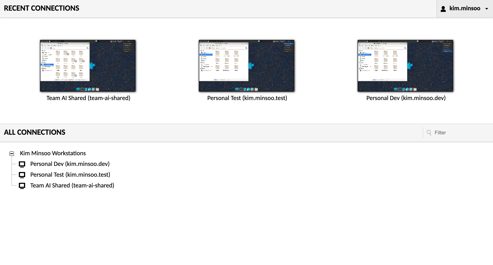
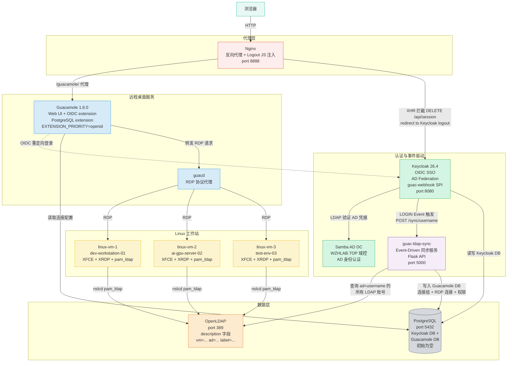

# RHBK + AD + Guacamole Demo 完整部署手册

> **版本**：v3.0（2026-03-30，完整重构：Event-Driven SPI + LDAP 自动同步）
>
> **演示场景**：企业 AD 账号 → OIDC SSO → Guacamole 远程桌面（LDAP 账号自动映射）  
>
> **服务器**：CentOS Stream 9，root 权限，Podman 5.x  
>
> **预计时间**：约 45-60 分钟（含 Linux 桌面镜像构建约 5-15 分钟）  
>
> **源码目录**：`files/keycloak-guac-webhook/`（Java SPI + Python 同步服务）

---

## 演示视频

[](imgs/2026.03.rhbk.ad.demo.deploy.cn.md/2026-04-01-10-39-05.png)

---

## 演示场景说明

### 业务背景

三名员工（Kim、Park、Lee）拥有企业 AD 账号，通过 **统一入口** 访问各自的远程开发/测试工作站。每人有不同数量的工作站权限，AI 团队共享工作站由三人共用。

### 账号关系映射

| AD 账号 | LDAP 账号 | 目标 VM | 连接类型 |
|---------|-----------|---------|---------|
| kim.minsoo | kim.minsoo.dev | linux-vm-1 (dev-workstation-01) | 个人开发 |
| kim.minsoo | kim.minsoo.test | linux-vm-3 (test-env-03) | 个人测试 |
| kim.minsoo | team-ai-shared | linux-vm-2 (ai-gpu-server-02) | 团队共享 |
| park.jiyeon | park.jiyeon.dev | linux-vm-1 (dev-workstation-01) | 个人开发 |
| park.jiyeon | team-ai-shared | linux-vm-2 (ai-gpu-server-02) | 团队共享 |
| lee.seungho | lee.seungho.dev | linux-vm-3 (test-env-03) | 个人开发 |
| lee.seungho | team-ai-shared | linux-vm-2 (ai-gpu-server-02) | 团队共享 |

**关键特性**：
- **1个 AD 账号 → 多个 LDAP 账号** → 不同工作站权限
- **LDAP 自动驱动**：OpenLDAP `description` 字段定义映射关系，无需手动配置 Guacamole
- **Event-Driven**：用户登录时 Keycloak SPI 自动触发连接配置，Guacamole DB 初始为空

---

## 完整架构



### 数据流：用户登录 → 连接自动配置

```
1. 浏览器访问 http://workplace.wzhlab.top:8888/guacamole/
2. Guacamole 重定向到 Keycloak OIDC 登录
3. 用户输入 AD 凭据 (kim.minsoo / Password123!)
4. Keycloak 验证 AD 账号 (via Samba AD LDAP)
5. 登录成功，触发 LOGIN Event
6. guac-webhook SPI: POST http://guac-ldap-sync:5000/sync/kim.minsoo
7. guac-ldap-sync 查询 OpenLDAP，找 ad=kim.minsoo 的所有账号
8. 在 Guacamole DB 创建连接组 + RDP 连接 + 权限
9. 用户在 Guacamole 看到自己的工作站连接列表
```

### 容器清单（共 11 个）

| 容器 | 镜像 | 作用 | 对外端口 |
|------|------|------|---------|
| postgres | postgres:15 | Keycloak + Guacamole DB | 5432 |
| samba-ad | nowsci/samba-domain | AD 身份认证 | - |
| openldap | osixia/openldap:1.5.0 | LDAP 账号 + VM 映射 | - |
| keycloak | keycloak:26.4 + SPI JAR | OIDC + AD Federation + SPI | 8080 |
| guacd | guacamole/guacd:1.6.0 | RDP 协议代理 | - |
| guacamole | guacamole/guacamole:1.6.0 | Web UI + OIDC | - |
| nginx-proxy | nginx:alpine | 反向代理 + Logout JS | 8888 |
| linux-vm-1 | corp-linux-desktop | XFCE dev-workstation-01 | - |
| linux-vm-2 | corp-linux-desktop | XFCE ai-gpu-server-02 | - |
| linux-vm-3 | corp-linux-desktop | XFCE test-env-03 | - |
| guac-ldap-sync | guac-ldap-sync:latest | Event-Driven 同步服务 | 5000 |

---

## 目录

1. [系统准备](#1-系统准备)
2. [创建目录结构](#2-创建目录结构)
3. [部署 PostgreSQL](#3-部署-postgresql)
4. [部署 Samba AD DC](#4-部署-samba-ad-dc)
5. [部署 OpenLDAP（含映射格式说明）](#5-部署-openldap)
6. [构建 Linux 桌面镜像](#6-构建-linux-桌面镜像)
7. [部署 Guacamole + Nginx](#7-部署-guacamole--nginx)
8. [配置 Keycloak + 部署 SPI](#8-配置-keycloak--部署-spi)
9. [部署 guac-ldap-sync](#9-部署-guac-ldap-sync)
10. [端到端验证](#10-端到端验证)
11. [演示脚本](#11-演示脚本)
12. [故障排查](#12-故障排查)
13. [重启恢复](#13-重启恢复)
14. [完整账号信息](#14-完整账号信息)

---

## 1. 系统准备

### 安装必要工具

整个演示环境基于 Podman 容器运行，所有服务（数据库、AD 域控、LDAP、Keycloak、Guacamole 等）均在容器中启动，无需在宿主机上安装任何服务。

安装的工具作用如下：
- `podman` / `podman-compose`：容器运行时，替代 Docker，无需 root daemon
- `vim` / `curl` / `wget` / `jq`：日常调试和配置辅助工具
- `openldap-clients`：提供 `ldapadd` / `ldapsearch` 命令，用于向 OpenLDAP 容器导入账号数据和验证

配置 `/etc/hosts` 的原因：演示环境中 Keycloak 会向浏览器颁发 OIDC token，token 的 `issuer` 字段是 `http://sso.wzhlab.top:8080/realms/corp`，浏览器必须能解析这个域名。同样，Guacamole 的 redirect URI 使用 `workplace.wzhlab.top`。两个域名都指向同一台服务器的宿主机 IP，实现"伪多域名"效果，无需真实 DNS。

最后创建 `corp-demo` 这个 Podman 网络，使所有容器之间可以通过容器名（如 `openldap`、`keycloak`、`postgres`）互相访问，而不依赖 IP 地址——这在容器重启后 IP 可能变化的场景下至关重要。

```bash
dnf install -y podman podman-compose vim curl wget jq openldap-clients

MYIP=$(hostname -I | awk '{print $1}')
echo "${MYIP} sso.wzhlab.top" >> /etc/hosts
echo "${MYIP} workplace.wzhlab.top" >> /etc/hosts

podman network create corp-demo
```

---

## 2. 创建目录结构

整个演示环境所需的配置文件、脚本、SQL 初始化语句都需要在宿主机上预先准备好，再通过 Podman volume 挂载到各容器中。将所有内容集中在 `~/corp-rhbk-demo/` 下统一管理，便于备份和清理。

各子目录用途说明：
- `ldap-seed/`：OpenLDAP 初始化数据文件（LDIF 格式），包含 OU 结构和账号数据
- `linux-desktop/`：Linux 桌面虚拟机的 Dockerfile 和 entrypoint 脚本
- `postgres-init/`：PostgreSQL 启动时自动执行的数据库初始化 SQL
- `guacamole-init/`：从 Guacamole 官方镜像提取的 Schema SQL（初始化 Guacamole 数据库表结构）
- `nginx/`：Nginx 反向代理配置文件（含 Logout JS 注入）
- `keycloak-spi/`：Keycloak 自定义 SPI 的 Java 源码和编译产出 JAR
- `guac-sync/`：guac-ldap-sync 同步服务的 Python 源码和 Dockerfile

```bash
mkdir -p ~/corp-rhbk-demo/{ldap-seed,linux-desktop,postgres-init,guacamole-init,nginx,keycloak-spi,guac-sync}
```

---

## 3. 部署 PostgreSQL

### 为什么用一个 PostgreSQL 承载两个数据库

本演示环境中，Keycloak 和 Guacamole 各自需要一个关系型数据库。为了简化演示环境，将两者统一在同一个 PostgreSQL 实例中，但使用**独立的数据库和用户**进行隔离：
- `keycloak` 库：存储 Keycloak 的 Realm 配置、用户、客户端、Session 等所有持久化数据
- `guacamole` 库：存储 Guacamole 的连接组、RDP 连接配置、用户权限等，**初始为空**（所有数据在用户首次登录时由 guac-ldap-sync 动态写入）

### 两阶段初始化策略

PostgreSQL 的初始化分两步进行：

**第一步：创建数据库和用户**（通过 `docker-entrypoint-initdb.d/` 机制在容器首次启动时自动执行）。这里创建 `admin` 超级用户作为管理账号，并为 Keycloak 和 Guacamole 分别创建专用用户和数据库。

**第二步：初始化 Guacamole Schema**（在 PostgreSQL 启动后手动执行）。Guacamole 官方镜像内置了 `initdb.sh` 脚本，可生成完整的建表 SQL。这里的做法是：先用一次性容器（`--rm`）运行该脚本生成 SQL 文件，再将 SQL 文件复制进 postgres 容器执行，从而避免维护额外的 Schema 版本文件。

```bash
cat > ~/corp-rhbk-demo/postgres-init/init.sql << 'EOF'
CREATE DATABASE keycloak;
CREATE USER keycloak WITH PASSWORD 'KeycloakDB2024!';
GRANT ALL PRIVILEGES ON DATABASE keycloak TO keycloak;
ALTER DATABASE keycloak OWNER TO keycloak;
CREATE DATABASE guacamole;
CREATE USER guacamole WITH PASSWORD 'GuacamoleDB2024!';
GRANT ALL PRIVILEGES ON DATABASE guacamole TO guacamole;
ALTER DATABASE guacamole OWNER TO guacamole;
EOF

podman run -d \
  --name postgres --network corp-demo \
  -e POSTGRES_USER=admin -e POSTGRES_PASSWORD='PgAdmin2024!' \
  -v ~/corp-rhbk-demo/postgres-init/init.sql:/docker-entrypoint-initdb.d/init.sql:Z \
  -v postgres-data:/var/lib/postgresql/data \
  -p 5432:5432 docker.io/postgres:15

sleep 20

# 初始化 Guacamole Schema
podman run --rm docker.io/guacamole/guacamole:1.6.0 \
  /opt/guacamole/bin/initdb.sh --postgresql > ~/corp-rhbk-demo/guacamole-init/initdb.sql
podman cp ~/corp-rhbk-demo/guacamole-init/initdb.sql postgres:/tmp/initdb.sql
podman exec postgres psql -U guacamole -d guacamole -f /tmp/initdb.sql 2>&1 | tail -3
```

---

## 4. 部署 Samba AD DC

### Samba AD 在架构中的角色

Samba AD（Active Directory Domain Controller）是演示中**唯一的身份认证数据源**。三名演示用户（kim.minsoo、park.jiyeon、lee.seungho）的账号密码存储在 Samba AD 中，Keycloak 通过 LDAP 协议连接到 Samba AD 来验证用户登录凭据。

这个设计模拟了真实企业环境中"企业员工使用域账号登录统一门户"的场景。

### 关键操作说明

**① 容器启动（需等待 40 秒）**：Samba AD 的域初始化过程较慢（Kerberos、DNS 服务初始化），需要充分等待后再进行后续操作。

**② 禁用强 TLS 认证（⚠️ 关键步骤，重启后需重新执行）**：Keycloak 使用普通 LDAP 协议（非 LDAPS）连接 Samba AD。Samba 4 默认要求客户端使用 LDAP 签名（`ldap server require strong auth = yes`），这会导致 Keycloak 的连接被拒绝，报 `LDAP_STRONG_AUTH_REQUIRED` 错误。通过在 `smb.conf` 的 `[global]` 段追加 `ldap server require strong auth = no` 来关闭此限制。

**注意**：此配置写在容器运行时文件系统中，容器重启后会丢失，需在每次重启后重新执行（§13 重启恢复步骤已包含此操作）。

**③ 批量创建 AD 用户**：使用 `samba-tool` 命令行工具创建演示用户，循环变量 `$1 $2 $3 $4` 分别对应 `用户名 名 姓 邮箱`，密码统一设为 `Password123!`。

```bash
podman run -d \
  --name samba-ad --hostname ad.wzhlab.top --network corp-demo --privileged \
  -e DOMAIN=WZHLAB.TOP -e DOMAINPASS='CorpAD2024!' \
  -e DNSFORWARDER=8.8.8.8 -e HOSTIP=0.0.0.0 \
  -v samba-data:/var/lib/samba \
  docker.io/nowsci/samba-domain

sleep 40

# ⚠️ 必须执行：禁用强 TLS（容器重启后会丢失，需重新执行）
podman exec samba-ad bash -c \
  "grep -q 'ldap server require strong auth' /etc/samba/smb.conf || \
   sed -i '/\[global\]/a\        ldap server require strong auth = no' /etc/samba/smb.conf"
podman exec samba-ad supervisorctl restart samba
sleep 10

# 创建 AD 用户
for user_info in "kim.minsoo Minsoo Kim kim.minsoo@wzhlab.top" \
                  "park.jiyeon Jiyeon Park park.jiyeon@wzhlab.top" \
                  "lee.seungho Seungho Lee lee.seungho@wzhlab.top"; do
  set -- $user_info
  podman exec samba-ad samba-tool user create $1 'Password123!' \
    --given-name=$2 --surname=$3 --mail-address=$4
done
```

---

## 5. 部署 OpenLDAP

### OpenLDAP 的双重角色

在本演示架构中，OpenLDAP 承担两个独立的角色：

**角色一：Linux 系统账号库（NSS/PAM）**
Linux VM 容器通过 `nslcd` + `pam_ldap` 从 OpenLDAP 获取 POSIX 账号信息（uid、gid、home 目录），实现用户使用 LDAP 账号密码登录 Linux 桌面的能力。这是标准的 LDAP 集中认证方案。

**角色二：Guacamole 连接配置中心（唯一数据源）**
OpenLDAP 的 `description` 字段被设计为结构化的连接映射数据。`guac-ldap-sync` 服务通过解析这个字段，动态生成 Guacamole 的连接组和 RDP 连接配置。这种设计避免了维护独立的配置数据库，所有连接关系的增删改查只需修改 LDAP 条目即可。

### LDAP 账号映射格式

OpenLDAP `description` 字段是连接关系的**唯一数据源**：

```
description: vm=<容器名> ad=<AD用户1>,<AD用户2> label=<连接显示名>
```

- `vm` = 目标 Linux VM 容器名（与 Podman 容器名一致，同时也是 RDP 连接目标主机名）
- `ad` = 有权访问该 LDAP 账号的 AD 账号列表（逗号分隔，多个 AD 用户共享同一工作站时在此列出）
- `label` = 在 Guacamole UI 中显示的连接名称（用户可见的友好名称）

### 账号设计要点

每个 LDAP 条目同时具备两类 objectClass：
- `inetOrgPerson`：提供 cn、sn 等人员属性
- `posixAccount`：提供 uidNumber、gidNumber、homeDirectory 等 Linux 系统所需的 POSIX 属性

`uid` 字段是 Linux 登录用户名，也是 RDP 会话的用户名。RDP 连接建立后，Guacamole 会用此用户名登录对应的 Linux VM。`userPassword` 则是实际的 RDP 桌面登录密码，由 `guac-ldap-sync` 在创建 RDP 连接时作为 `rdp_password` 写入 Guacamole DB。

### 创建数据文件

```bash
cat > ~/corp-rhbk-demo/ldap-seed/01-structure.ldif << 'EOF'
dn: ou=People,dc=wzhlab,dc=top
objectClass: organizationalUnit
ou: People
EOF

cat > ~/corp-rhbk-demo/ldap-seed/02-users.ldif << 'EOF'
dn: uid=kim.minsoo.dev,ou=People,dc=wzhlab,dc=top
objectClass: inetOrgPerson
objectClass: posixAccount
objectClass: shadowAccount
uid: kim.minsoo.dev
cn: Kim Minsoo Dev
sn: Kim
uidNumber: 10001
gidNumber: 10001
homeDirectory: /home/kim.minsoo.dev
loginShell: /bin/bash
userPassword: DemoPass2024!
description: vm=linux-vm-1 ad=kim.minsoo label=Personal Dev

dn: uid=kim.minsoo.test,ou=People,dc=wzhlab,dc=top
objectClass: inetOrgPerson
objectClass: posixAccount
objectClass: shadowAccount
uid: kim.minsoo.test
cn: Kim Minsoo Test
sn: Kim
uidNumber: 10002
gidNumber: 10002
homeDirectory: /home/kim.minsoo.test
loginShell: /bin/bash
userPassword: DemoPass2024!
description: vm=linux-vm-3 ad=kim.minsoo label=Personal Test

dn: uid=team-ai-shared,ou=People,dc=wzhlab,dc=top
objectClass: inetOrgPerson
objectClass: posixAccount
objectClass: shadowAccount
uid: team-ai-shared
cn: AI Team Shared Account
sn: AI-Team
uidNumber: 10003
gidNumber: 10003
homeDirectory: /home/team-ai-shared
loginShell: /bin/bash
userPassword: DemoPass2024!
description: vm=linux-vm-2 ad=kim.minsoo,park.jiyeon,lee.seungho label=Team AI Shared

dn: uid=park.jiyeon.dev,ou=People,dc=wzhlab,dc=top
objectClass: inetOrgPerson
objectClass: posixAccount
objectClass: shadowAccount
uid: park.jiyeon.dev
cn: Park Jiyeon Dev
sn: Park
uidNumber: 10004
gidNumber: 10004
homeDirectory: /home/park.jiyeon.dev
loginShell: /bin/bash
userPassword: DemoPass2024!
description: vm=linux-vm-1 ad=park.jiyeon label=Personal Dev

dn: uid=lee.seungho.dev,ou=People,dc=wzhlab,dc=top
objectClass: inetOrgPerson
objectClass: posixAccount
objectClass: shadowAccount
uid: lee.seungho.dev
cn: Lee Seungho Dev
sn: Lee
uidNumber: 10005
gidNumber: 10005
homeDirectory: /home/lee.seungho.dev
loginShell: /bin/bash
userPassword: DemoPass2024!
description: vm=linux-vm-3 ad=lee.seungho label=Personal Dev
EOF
```

### 启动 OpenLDAP 并导入数据

> ⚠️ 不要使用 `LDAP_SEED_INTERNAL_LDIF_PATH`，会导致容器内自身目录复制错误崩溃。

```bash
podman run -d \
  --name openldap --hostname ldap.wzhlab.top --network corp-demo \
  -e LDAP_ORGANISATION="Corp" -e LDAP_DOMAIN="wzhlab.top" \
  -e LDAP_ADMIN_PASSWORD="LdapAdmin2024!" -e LDAP_BASE_DN="dc=wzhlab,dc=top" \
  -v openldap-data:/var/lib/ldap -v openldap-config:/etc/ldap/slapd.d \
  docker.io/osixia/openldap:1.5.0

sleep 20

LDAP_IP=$(podman inspect openldap --format '{{range .NetworkSettings.Networks}}{{.IPAddress}}{{end}}')
ldapadd -x -H ldap://${LDAP_IP}:389 -D "cn=admin,dc=wzhlab,dc=top" -w "LdapAdmin2024!" \
  -f ~/corp-rhbk-demo/ldap-seed/01-structure.ldif
ldapadd -x -H ldap://${LDAP_IP}:389 -D "cn=admin,dc=wzhlab,dc=top" -w "LdapAdmin2024!" \
  -f ~/corp-rhbk-demo/ldap-seed/02-users.ldif
```

### 验证

```bash
LDAP_IP=$(podman inspect openldap --format '{{range .NetworkSettings.Networks}}{{.IPAddress}}{{end}}')
ldapsearch -x -H ldap://${LDAP_IP}:389 -D "cn=admin,dc=wzhlab,dc=top" -w "LdapAdmin2024!" \
  -b "ou=People,dc=wzhlab,dc=top" "(objectClass=posixAccount)" uid description 2>&1 | \
  grep -E "uid:|description:"
# 应显示 5 个 uid，每个有结构化 description（vm=... ad=... label=...）
```

---

## 6. 构建 Linux 桌面镜像

### 为什么要自定义构建镜像

Linux VM 容器需要同时满足以下三个能力：
1. **RDP 远程桌面**：用户通过 Guacamole Web 界面以 RDP 协议连接
2. **LDAP 账号认证**：用 LDAP 账号（如 `kim.minsoo.dev`）登录 Linux 桌面
3. **图形化桌面环境**：运行 XFCE 轻量级桌面，供用户实际操作

现有的公开镜像没有同时满足这三点的，因此需要基于 Rocky Linux 9 自行构建。整体镜像约 1-2GB，构建时间 5-15 分钟（取决于网络和 CPU）。

### 6.1 创建 entrypoint.sh

`entrypoint.sh` 是容器启动时执行的初始化脚本，在容器每次启动时运行，负责以下 5 个阶段的配置：

**阶段 1：配置 LDAP 客户端（nslcd）**
将容器启动时传入的环境变量（`LDAP_SERVER`、`LDAP_BASE_DN` 等）写入 `/etc/nslcd.conf`，配置 nslcd 守护进程连接 OpenLDAP 服务。nslcd 是 NSS LDAP 客户端守护进程，负责将 LDAP 查询结果提供给 Linux 系统调用（如 `getent passwd`）。

**阶段 2：配置 NSS（名称服务切换）**
修改 `/etc/nsswitch.conf`，让 Linux 在查找 `passwd`/`shadow`/`group` 时先查本地文件，再查 LDAP。这样 LDAP 用户可以在 Linux 系统中被识别。

**阶段 3：配置 PAM 认证链**
配置 `/etc/pam.d/system-auth`，建立认证顺序：先用本地密码认证，失败后再用 LDAP 认证（`pam_ldap.so`）。`pam_mkhomedir.so` 确保用户首次登录时自动创建家目录。

**阶段 4：处理 XFCE 桌面兼容性问题**
- 禁用 `xfce-polkit` PolicyKit 代理：容器内没有 `polkitd` 守护进程，PolicyKit 弹窗会导致桌面卡顿或闪退
- 生成自签名 SSL 证书（xrdp 需要）
- 配置 XRDP session 保持参数（`KillDisconnected=false`），避免断开 RDP 后 session 被杀掉

**阶段 5：配置并启动 XRDP**
`startwm.sh` 是 XRDP 的 session 启动脚本，必须通过 `dbus-launch` 启动 XFCE，否则因为缺少 D-Bus session 会导致 XFCE 立即崩溃（SIGTRAP）。最后启动 `xrdp-sesman`（session manager）和 `xrdp`（主进程），监听 RDP 连接（端口 3389）。

```bash
cat > ~/corp-rhbk-demo/linux-desktop/entrypoint.sh << 'ENTRYEOF'
#!/bin/bash
set -e
LDAP_SERVER=${LDAP_SERVER:-ldap://openldap:389}
LDAP_BASE_DN=${LDAP_BASE_DN:-dc=wzhlab,dc=top}
LDAP_BIND_DN=${LDAP_BIND_DN:-cn=admin,dc=wzhlab,dc=top}
LDAP_BIND_PW=${LDAP_BIND_PW:-LdapAdmin2024!}

cat > /etc/nslcd.conf << EOF
uid nslcd
gid ldap
uri ${LDAP_SERVER}
base ${LDAP_BASE_DN}
binddn ${LDAP_BIND_DN}
bindpw ${LDAP_BIND_PW}
ssl no
tls_cacertdir /etc/openldap/certs
EOF
chmod 600 /etc/nslcd.conf

cat > /etc/nsswitch.conf << EOF
passwd:     files ldap
shadow:     files ldap
group:      files ldap
hosts:      files dns
EOF

cat > /etc/pam.d/system-auth << 'PAMEOF'
#%PAM-1.0
auth        required      pam_env.so
auth        sufficient    pam_unix.so try_first_pass nullok
auth        sufficient    pam_ldap.so try_first_pass
auth        required      pam_deny.so
account     required      pam_unix.so
account     sufficient    pam_ldap.so
account     required      pam_permit.so
password    requisite     pam_pwquality.so try_first_pass local_users_only retry=3
password    sufficient    pam_unix.so try_first_pass use_authtok nullok sha512 shadow
password    sufficient    pam_ldap.so use_authtok
password    required      pam_deny.so
session     optional      pam_keyinit.so revoke
session     required      pam_limits.so
session     required      pam_unix.so
session     optional      pam_ldap.so
session     optional      pam_mkhomedir.so skel=/etc/skel umask=0077
PAMEOF
cp /etc/pam.d/system-auth /etc/pam.d/password-auth

# 禁用 XFCE PolicyKit Agent（容器无 polkitd）
echo "Hidden=true" >> /etc/xdg/autostart/xfce-polkit.desktop 2>/dev/null || true
mkdir -p /etc/skel/.config/autostart
printf "[Desktop Entry]\nHidden=true\n" > /etc/skel/.config/autostart/xfce-polkit.desktop

/usr/sbin/nslcd 2>/dev/null || true
sleep 2
getent passwd kim.minsoo.dev >/dev/null 2>&1 && echo "LDAP OK" || echo "WARN: LDAP not ready"

[ ! -f /etc/xrdp/cert.pem ] && openssl req -x509 -newkey rsa:2048 \
  -keyout /etc/xrdp/key.pem -out /etc/xrdp/cert.pem \
  -days 365 -nodes -subj "/CN=$(hostname)" 2>/dev/null

if [ -f /etc/xrdp/sesman.ini ]; then
  grep -q 'KillDisconnected' /etc/xrdp/sesman.ini || echo 'KillDisconnected=false' >> /etc/xrdp/sesman.ini
  grep -q 'DisconnectedTimeLimit' /etc/xrdp/sesman.ini || echo 'DisconnectedTimeLimit=259200' >> /etc/xrdp/sesman.ini
  grep -q 'IdleTimeLimit' /etc/xrdp/sesman.ini || echo 'IdleTimeLimit=0' >> /etc/xrdp/sesman.ini
fi

sed -i 's|DefaultWindowManager=.*|DefaultWindowManager=/etc/xrdp/startwm.sh|' /etc/xrdp/sesman.ini 2>/dev/null || true

cat > /etc/xrdp/startwm.sh << 'WMEOF'
#!/bin/bash
unset DBUS_SESSION_BUS_ADDRESS
unset XDG_RUNTIME_DIR
if which dbus-launch > /dev/null 2>&1; then
  exec dbus-launch --exit-with-session startxfce4
else
  exec startxfce4
fi
WMEOF
chmod +x /etc/xrdp/startwm.sh

/usr/sbin/xrdp-sesman --nodaemon &
sleep 2
exec /usr/sbin/xrdp --nodaemon
ENTRYEOF
```

### 6.2 创建 Dockerfile

Dockerfile 定义了镜像的构建过程，分为 4 个主要层：

1. **基础系统层**：以 `rockylinux:9` 为基础，先安装 EPEL 仓库（提供 xrdp 等额外软件包），再进行系统全量更新
2. **桌面环境层**：安装 Xfce 桌面（`dnf groupinstall "Xfce"`）和 XRDP 服务；同时安装 `nss-pam-ldapd`（LDAP NSS/PAM 客户端）、`oddjob-mkhomedir`（自动创建家目录）等依赖
3. **XRDP 调优层**：将颜色深度从默认 32bpp 调整为 24bpp（`max_bpp=24`），避免部分 RDP 客户端的颜色问题
4. **启动脚本层**：将 `entrypoint.sh` 复制进镜像，设置为容器启动入口

> **为什么不直接用 Dockerfile 写 LDAP 配置而用 entrypoint.sh？**
> LDAP 服务器地址（如 `ldap://openldap:389`）在容器启动时通过环境变量传入，Dockerfile 构建时并不知道这个地址。因此 LDAP 相关配置必须在运行时（entrypoint.sh）动态写入，而不是在构建时固定。

```bash
cat > ~/corp-rhbk-demo/linux-desktop/Dockerfile << 'DOCKEREOF'
FROM docker.io/rockylinux:9
RUN dnf install -y epel-release && dnf update -y
RUN dnf groupinstall -y "Xfce" && \
    dnf install -y xrdp xorgxrdp tigervnc-server dbus-x11 \
    nss-pam-ldapd openldap-clients oddjob-mkhomedir sudo vim passwd openssl && \
    dnf clean all
RUN sed -i 's/^max_bpp=.*/max_bpp=24/' /etc/xrdp/xrdp.ini 2>/dev/null || true
COPY entrypoint.sh /entrypoint.sh
RUN chmod +x /entrypoint.sh
EXPOSE 3389
CMD ["/entrypoint.sh"]
DOCKEREOF
```

### 6.3 构建并启动

镜像构建需要下载大量软件包（Xfce 桌面约数百 MB），建议在后台运行（`nohup ... &`）。构建完成后，三个 VM 容器使用**同一个镜像**，只是通过 `--name` 和 `--hostname` 参数赋予不同身份，模拟三台独立的工作站：

| 容器名 | 主机名 | 角色 |
|--------|--------|------|
| linux-vm-1 | dev-workstation-01 | 开发工作站 |
| linux-vm-2 | ai-gpu-server-02 | AI GPU 服务器 |
| linux-vm-3 | test-env-03 | 测试环境 |

使用 `--privileged` 标志是因为容器内部需要运行 `nslcd`（LDAP 守护进程）和 `xrdp`（RDP 服务），这些服务需要特权权限来监听端口和操作系统资源。

LDAP 连接参数通过环境变量传入，由 `entrypoint.sh` 在容器启动时动态写入配置文件，这样所有 VM 都指向同一个 OpenLDAP 服务，实现账号的集中管理。

```bash
cd ~/corp-rhbk-demo/linux-desktop
nohup podman build -t corp-linux-desktop:latest . > /tmp/docker-build.log 2>&1 &
echo "构建 PID: $! - 查看：tail -f /tmp/docker-build.log"
# 等待 5-15 分钟

# 构建完成后启动 3 个 VM
for name in linux-vm-1 linux-vm-2 linux-vm-3; do
  hostname_map=("dev-workstation-01" "ai-gpu-server-02" "test-env-03")
  idx=0; [[ $name == "linux-vm-2" ]] && idx=1; [[ $name == "linux-vm-3" ]] && idx=2
  podman run -d \
    --name $name --hostname ${hostname_map[$idx]} --network corp-demo --privileged \
    -e LDAP_SERVER=ldap://openldap:389 \
    -e LDAP_BASE_DN=dc=wzhlab,dc=top \
    -e LDAP_BIND_DN=cn=admin,dc=wzhlab,dc=top \
    -e LDAP_BIND_PW=LdapAdmin2024! \
    corp-linux-desktop:latest
done
sleep 25
```

---

## 7. 部署 Guacamole + Nginx

### Guacamole 在架构中的角色

Guacamole 是整个演示的**用户面入口**，它将浏览器访问转换为 RDP 协议，实现通过 Web 页面访问远程桌面的能力。本演示中 Guacamole 的关键设计决策：

- **OIDC-First 认证**：Guacamole 不做本地密码认证，完全委托给 Keycloak OIDC。用户访问 Guacamole 时，页面直接跳转到 Keycloak 登录页
- **DB 初始为空**：Guacamole 的 PostgreSQL 数据库在部署时没有任何连接配置。连接数据由 guac-ldap-sync 在用户登录时动态写入
- **自动创建账号**：`POSTGRESQL_AUTO_CREATE_ACCOUNTS=true` 让 Guacamole 在用户首次通过 OIDC 登录时，自动在 DB 中创建对应的用户记录

### 7.1 启动 guacd

guacd 是 Guacamole 的后端守护进程，负责实际的 RDP 协议处理。Guacamole Web 应用本身不直接处理 RDP 协议，而是将连接请求转发给 guacd，由 guacd 与目标 Linux VM 建立 RDP 连接，再将桌面图像流回给浏览器。

guacd 不需要对外暴露端口（在 `corp-demo` 网络内部通信），也不需要持久化存储，配置极为简单。

```bash
podman run -d --name guacd --network corp-demo docker.io/guacamole/guacd:1.6.0
```

### 7.2 启动 Guacamole

**关键环境变量解析**：

| 环境变量 | 作用 | 注意事项 |
|----------|------|---------|
| `OPENID_ENABLED=true` | 启用内置 OIDC 扩展 | 1.6.0 内置，无需手动下载 JAR |
| `EXTENSION_PRIORITY=openid` | OIDC 扩展优先于 PostgreSQL 扩展处理认证 | 缺此配置会显示本地登录页而非跳转 Keycloak |
| `POSTGRESQL_AUTO_CREATE_ACCOUNTS=true` | OIDC 登录后自动创建用户记录 | 必须启用，否则用户登录后无法获得 DB 中的权限 |
| `OPENID_AUTHORIZATION_ENDPOINT` | 用公网域名（`sso.wzhlab.top:8080`）| 浏览器重定向时使用，必须可被浏览器解析 |
| `OPENID_JWKS_ENDPOINT` | 用容器内部名（`keycloak:8080`）| 服务器端验证 Token 签名时使用，走内部网络 |
| `OPENID_USERNAME_CLAIM_TYPE=preferred_username` | 从 token 的 `preferred_username` 字段提取用户名 | 对应 AD 的 `sAMAccountName`，即 `kim.minsoo` |

> **关键配置**：
> - `OPENID_ENABLED=true` — 无需手动下载 JAR（1.6.0 内置）
> - `EXTENSION_PRIORITY=openid` — OIDC 优先于 PostgreSQL 处理认证
> - `POSTGRESQL_AUTO_CREATE_ACCOUNTS=true` — 用户首次登录自动创建账号
> - 不对外暴露端口，由 Nginx 代理

```bash
podman run -d \
  --name guacamole --hostname workplace.wzhlab.top --network corp-demo \
  -e GUACD_HOSTNAME=guacd -e GUACD_PORT=4822 \
  -e POSTGRESQL_HOSTNAME=postgres -e POSTGRESQL_PORT=5432 \
  -e POSTGRESQL_DATABASE=guacamole -e POSTGRESQL_USER=guacamole \
  -e POSTGRESQL_PASSWORD='GuacamoleDB2024!' \
  -e POSTGRESQL_AUTO_CREATE_ACCOUNTS=true \
  -e OPENID_ENABLED=true \
  -e OPENID_AUTHORIZATION_ENDPOINT=http://sso.wzhlab.top:8080/realms/corp/protocol/openid-connect/auth \
  -e OPENID_JWKS_ENDPOINT=http://keycloak:8080/realms/corp/protocol/openid-connect/certs \
  -e OPENID_ISSUER=http://sso.wzhlab.top:8080/realms/corp \
  -e OPENID_CLIENT_ID=guacamole \
  -e OPENID_REDIRECT_URI=http://workplace.wzhlab.top:8888/guacamole/ \
  -e "OPENID_SCOPE=openid email profile" \
  -e OPENID_USERNAME_CLAIM_TYPE=preferred_username \
  -e EXTENSION_PRIORITY=openid \
  docker.io/guacamole/guacamole:1.6.0
sleep 20
```

### 7.3 创建 Nginx 配置（含 Logout JS）

> **为什么注入 JS？**
> Guacamole 1.6.0 不支持 RP-Initiated Logout（GUACAMOLE-758/519）。
> 用 Nginx `sub_filter` 注入 XHR 拦截 JS：当 Guacamole 发 `DELETE /api/session` 时，
> 同步发送 DELETE（清理本地 session）+ 200ms 后跳转到 Keycloak logout endpoint 销毁 SSO session。
>
> ⚠️ Guacamole **1.6.0** logout API 从 `DELETE /api/tokens/{token}` 改为 `DELETE /api/session`

```bash
# 使用 Python 写入（避免 shell 引号嵌套问题）
cat << 'PYEOF' | base64 | ssh root@<server-ip> 'base64 -d > /tmp/mk_nginx.py && python3 /tmp/mk_nginx.py'
import os
js = (
    "(function(){var _o=XMLHttpRequest.prototype.open,_s=XMLHttpRequest.prototype.send;"
    "XMLHttpRequest.prototype.open=function(m,u){this._lg=(m==='DELETE'&&u&&u.indexOf('api/session')!==-1);return _o.apply(this,arguments);};"
    "XMLHttpRequest.prototype.send=function(){if(this._lg){"
    "var u='http://sso.wzhlab.top:8080/realms/corp/protocol/openid-connect/logout?client_id=guacamole&post_logout_redirect_uri='+encodeURIComponent('http://workplace.wzhlab.top:8888/guacamole/');"
    "_s.apply(this,arguments);setTimeout(function(){window.location.replace(u);},200);return;}"
    "return _s.apply(this,arguments);};}());"
)
sf = "<head><script>" + js + "</script>"
content = r"""events { worker_connections 1024; }
http { server { listen 80; server_name _;
  sub_filter '<head>' '""" + sf.replace("'", "\\'") + r"""';
  sub_filter_once on; sub_filter_types text/html;
  location /guacamole/ {
    proxy_pass http://guacamole:8080/guacamole/;
    proxy_http_version 1.1;
    proxy_set_header Upgrade $http_upgrade;
    proxy_set_header Connection "upgrade";
    proxy_set_header Host $host;
    proxy_set_header X-Real-IP $remote_addr;
    proxy_set_header X-Forwarded-For $proxy_add_x_forwarded_for;
    proxy_set_header X-Forwarded-Proto $scheme;
    proxy_set_header Accept-Encoding "";
    proxy_read_timeout 3600; proxy_send_timeout 3600;
    proxy_buffering off;
  }
  location = / { return 301 /guacamole/; }
} }
"""
os.makedirs('/root/corp-rhbk-demo/nginx', exist_ok=True)
with open('/root/corp-rhbk-demo/nginx/nginx.conf', 'w') as f: f.write(content)
print('nginx.conf created')
PYEOF

podman run -d \
  --name nginx-proxy --network corp-demo \
  -v ~/corp-rhbk-demo/nginx/nginx.conf:/etc/nginx/nginx.conf:ro,Z \
  -p 8888:80 docker.io/nginx:alpine
```

---

## 8. 配置 Keycloak + 部署 SPI

### Keycloak 在架构中的核心地位

Keycloak 是整个演示的**认证与事件驱动中枢**，承担三个关键职责：

1. **OIDC Identity Provider**：向 Guacamole 提供 OIDC SSO 服务，用户通过 Keycloak 页面登录
2. **AD Federation**：桥接企业 AD（Samba AD），将用户的 AD 凭据验证委托给 Samba AD
3. **Event Trigger（via SPI）**：用户登录成功后，触发自定义 SPI 向 guac-ldap-sync 发送 webhook，驱动连接配置的自动创建

### 8.1 构建 SPI JAR

Keycloak SPI（Service Provider Interface）是 Keycloak 的插件机制。本演示实现了一个 **EventListener SPI**，监听 Keycloak 的 `LOGIN` 事件，当用户成功登录时，自动向 guac-ldap-sync 发送 HTTP POST 请求，携带登录的用户名。

构建方式：使用 Maven 容器（`docker.io/maven:3.9-eclipse-temurin-21`）在宿主机目录中编译 Java 源码，输出 JAR 文件约 5-6KB（仅含 SPI 代码，无需打包依赖）。SPI JAR 通过 Podman volume 挂载到 Keycloak 容器的 `/opt/keycloak/providers/` 目录，Keycloak 启动时会自动发现并加载。

> Keycloak SPI 源码在 repo 的 `files/keycloak-guac-webhook/` 目录。

```bash
scp -r files/keycloak-guac-webhook/ root@<server-ip>:~/corp-rhbk-demo/keycloak-spi/

mkdir -p ~/.m2
podman run --rm \
  -v ~/corp-rhbk-demo/keycloak-spi:/project:Z \
  -v ~/.m2:/root/.m2:Z \
  docker.io/maven:3.9-eclipse-temurin-21 \
  mvn -f /project/pom.xml package -q -DskipTests 2>&1

cp ~/corp-rhbk-demo/keycloak-spi/target/keycloak-guac-webhook.jar \
   ~/corp-rhbk-demo/keycloak-spi/keycloak-guac-webhook.jar
ls -lh ~/corp-rhbk-demo/keycloak-spi/keycloak-guac-webhook.jar  # 应约 5-6K
```

### 8.2 启动 Keycloak（含 SPI volume 挂载持久化）

**关键启动参数说明**：

- `KC_HOSTNAME_STRICT=false` + `KC_HTTP_ENABLED=true`：允许 HTTP 访问，演示环境不配置 TLS
- `KC_PROXY_HEADERS=xforwarded`：Keycloak 处于 Nginx 后端时，正确读取客户端 IP（演示中此处 Nginx 直接代理 Keycloak 端口，实际通过 8888 访问 Guacamole，Keycloak 走 8080 直连）
- `KC_WEBHOOK_URL=http://guac-ldap-sync:5000`：SPI 读取此环境变量，知道 webhook 发往哪里。这是 SPI 和 guac-ldap-sync 之间的唯一耦合点
- `-v .../keycloak-guac-webhook.jar:/opt/keycloak/providers/...`：Keycloak 的 `providers/` 目录是 SPI 发现机制的标准路径，放入 JAR 后下次启动自动加载，无需任何额外配置
- `start-dev`：使用开发模式启动（禁用生产环境强制要求如 TLS、Hostname 检查等），适合演示环境

启动后需等待约 60 秒（Keycloak 数据库初始化 + SPI 加载较慢），然后通过查看日志确认 SPI 是否成功加载。

```bash
podman run -d \
  --name keycloak --hostname sso.wzhlab.top --network corp-demo \
  -e KEYCLOAK_ADMIN=admin \
  -e KEYCLOAK_ADMIN_PASSWORD='KeycloakAdmin2024!' \
  -e KC_DB=postgres \
  -e KC_DB_URL=jdbc:postgresql://postgres:5432/keycloak \
  -e KC_DB_USERNAME=keycloak -e KC_DB_PASSWORD='KeycloakDB2024!' \
  -e KC_HOSTNAME_STRICT=false -e KC_HTTP_ENABLED=true \
  -e KC_PROXY_HEADERS=xforwarded \
  -e KC_WEBHOOK_URL=http://guac-ldap-sync:5000 \
  -v ~/corp-rhbk-demo/keycloak-spi/keycloak-guac-webhook.jar:/opt/keycloak/providers/keycloak-guac-webhook.jar:Z,ro \
  -p 8080:8080 \
  quay.io/keycloak/keycloak:26.4 start-dev

sleep 60

# 验证 SPI 加载
podman logs keycloak 2>&1 | grep "guac-webhook"
# 应看到：[guac-webhook] Initialized. Webhook base URL: http://guac-ldap-sync:5000
```

### 8.3 配置 Keycloak（corp Realm + AD + OIDC Client + SPI）

这一步通过 `kcadm.sh`（Keycloak Admin CLI）完成所有配置，全程无需进入 Web UI。配置分 4 个子步骤：

**① 获取 Admin Token**：先调用 `config credentials` 命令，将管理员凭据缓存在本地（`~/.keycloak/kcadm.config`），后续命令无需重复输入密码。

**② 创建 corp Realm**：演示所有资源（用户、客户端、Federation）都在 `corp` 这个独立 Realm 中，与 `master` Realm 完全隔离。关闭邮箱登录和自助注册，符合企业 AD 登录场景。

**③ 配置 AD Federation**：将 Samba AD 注册为 Keycloak 的 LDAP User Storage Provider。关键参数：
  - `config.vendor=["ad"]`：告知 Keycloak 使用 AD 特定的 LDAP 属性映射
  - `config.usernameLDAPAttribute=["sAMAccountName"]`：AD 的登录名字段（对应 `kim.minsoo`）
  - `config.uuidLDAPAttribute=["objectGUID"]`：AD 对象唯一标识，用于账号同步去重
  - `config.editMode=["READ_ONLY"]`：只读模式，Keycloak 不修改 AD 中的用户数据
  - 创建完成后立即执行 `triggerFullSync`，将 AD 用户同步到 Keycloak 本地 DB

**④ 创建 Guacamole OIDC Client**：
  - `publicClient=true`：公开客户端，无需 client secret（适合 Web 应用）
  - `implicitFlowEnabled=true`：⚠️ 必须启用，Guacamole 1.6.0 的 OIDC 实现使用 Implicit Flow
  - 通过 Python 脚本单独设置 `post_logout_redirect_uris`（`kcadm.sh` 不直接支持此字段）

**⑤ 注册 guac-webhook Event Listener**：将 SPI 注册到 corp Realm 的事件监听器列表中。此配置持久化到 PostgreSQL，重启后自动生效。

```bash
podman exec keycloak /opt/keycloak/bin/kcadm.sh config credentials \
  --server http://localhost:8080 --realm master \
  --user admin --password 'KeycloakAdmin2024!'

# 创建 corp Realm
podman exec keycloak /opt/keycloak/bin/kcadm.sh create realms \
  -s realm=corp -s enabled=true -s displayName="Corp SSO" \
  -s loginWithEmailAllowed=false -s registrationAllowed=false

# AD Federation（使用容器 DNS 名，重启后 IP 变化也没问题）
COMP_ID=$(podman exec keycloak /opt/keycloak/bin/kcadm.sh create components \
  -r corp \
  -s name="Corp Active Directory" \
  -s providerId=ldap \
  -s providerType=org.keycloak.storage.UserStorageProvider \
  -s 'config.vendor=["ad"]' \
  -s 'config.usernameLDAPAttribute=["sAMAccountName"]' \
  -s 'config.rdnLDAPAttribute=["cn"]' \
  -s 'config.uuidLDAPAttribute=["objectGUID"]' \
  -s 'config.userObjectClasses=["person, organizationalPerson, user"]' \
  -s 'config.connectionUrl=["ldap://samba-ad:389"]' \
  -s 'config.usersDn=["CN=Users,DC=WZHLAB,DC=TOP"]' \
  -s 'config.authType=["simple"]' \
  -s 'config.bindDn=["CN=Administrator,CN=Users,DC=WZHLAB,DC=TOP"]' \
  -s 'config.bindCredential=["CorpAD2024!"]' \
  -s 'config.searchScope=["2"]' \
  -s 'config.editMode=["READ_ONLY"]' \
  -s 'config.importEnabled=["true"]' \
  -s 'config.connectionPooling=["true"]' \
  -i 2>&1)
echo "Federation ID: $COMP_ID"
podman exec keycloak /opt/keycloak/bin/kcadm.sh create \
  "user-storage/${COMP_ID}/sync?action=triggerFullSync" -r corp 2>&1

# Guacamole OIDC Client（⚠️ implicitFlowEnabled 必须为 true）
podman exec keycloak /opt/keycloak/bin/kcadm.sh create clients -r corp \
  -s clientId=guacamole -s name="Virtual Workplace Demo" \
  -s enabled=true -s publicClient=true \
  -s 'standardFlowEnabled=true' -s 'implicitFlowEnabled=true' \
  -s 'rootUrl=http://workplace.wzhlab.top:8888/guacamole/' \
  -s 'baseUrl=http://workplace.wzhlab.top:8888/guacamole/' \
  -s 'redirectUris=["http://workplace.wzhlab.top:8888/*"]' \
  -s 'webOrigins=["*"]'

# 配置 post_logout_redirect_uris
python3 -c "
import urllib.request, urllib.parse, json
td = urllib.parse.urlencode({'client_id':'admin-cli','username':'admin',
  'password':'KeycloakAdmin2024!','grant_type':'password'}).encode()
req = urllib.request.Request('http://localhost:8080/realms/master/protocol/openid-connect/token',data=td,method='POST')
with urllib.request.urlopen(req) as r: token = json.loads(r.read())['access_token']
req = urllib.request.Request('http://localhost:8080/admin/realms/corp/clients?clientId=guacamole',
  headers={'Authorization':f'Bearer {token}'})
with urllib.request.urlopen(req) as r: client = json.loads(r.read())[0]
client['attributes']['post.logout.redirect.uris'] = 'http://workplace.wzhlab.top:8888/*'
data = json.dumps(client).encode()
req = urllib.request.Request(f'http://localhost:8080/admin/realms/corp/clients/{client[\"id\"]}',
  data=data, method='PUT', headers={'Authorization':f'Bearer {token}','Content-Type':'application/json'})
with urllib.request.urlopen(req) as r: print('Update:', r.status)
"

# 启用 guac-webhook Event Listener（一次性，存入 PostgreSQL）
podman exec keycloak /opt/keycloak/bin/kcadm.sh update realms/corp \
  -r corp -s 'eventsListeners=["jboss-logging","guac-webhook"]'
```

---

## 9. 部署 guac-ldap-sync

> **这是整个方案的核心**：Keycloak SPI 触发 → 查询 OpenLDAP → 写入 Guacamole DB

### 同步服务的工作原理

`guac-ldap-sync` 是一个用 Python/Flask 实现的轻量级 HTTP API 服务，暴露 `/sync/<username>` 端点。当被调用时，执行以下三步操作：

1. **查询 OpenLDAP**：在 `ou=People,dc=wzhlab,dc=top` 下搜索所有 `description` 字段中包含 `ad=<username>` 的条目（支持多值，如 `ad=kim.minsoo,park.jiyeon`）
2. **解析映射关系**：从 `description` 字段提取 `vm`（目标容器名）、`label`（显示名）、`uid`（Linux 用户名）等信息
3. **写入 Guacamole DB**：在 PostgreSQL 中执行 upsert 操作，幂等地创建/更新：
   - **连接组**（`guacamole_connection_group`）：以 `<AD用户名> Workstations` 命名
   - **RDP 连接**（`guacamole_connection`）：每个 LDAP 账号对应一个连接，目标为 VM 容器名
   - **用户权限**（`guacamole_connection_permission`）：授予该 AD 用户 READ 权限

**环境变量说明**：
- `LDAP_URL/BIND_DN/BIND_PW/BASE`：连接 OpenLDAP 的配置
- `PG_HOST/DB/USER/PASS`：连接 Guacamole PostgreSQL 的配置
- `RDP_PASSWORD`：写入 Guacamole DB 的 RDP 连接密码（LDAP 账号的 `userPassword`）
- `GUAC_BACKEND`：Guacamole Web 服务的内部地址（用于部分 API 操作，如清理旧连接）

### 源码

> 源码在 `files/keycloak-guac-webhook/guac-sync/`，详见目录中的 README.md。

```bash
scp -r files/keycloak-guac-webhook/guac-sync/ root@<server-ip>:~/corp-rhbk-demo/

cd ~/corp-rhbk-demo/guac-sync
cat > requirements.txt << 'EOF'
flask>=3.0
ldap3>=2.9
psycopg2-binary>=2.9
requests>=2.31
EOF
podman build -t guac-ldap-sync:latest .

podman run -d \
  --name guac-ldap-sync --network corp-demo \
  -e LDAP_URL=ldap://openldap:389 \
  -e LDAP_BIND_DN=cn=admin,dc=wzhlab,dc=top \
  -e LDAP_BIND_PW=LdapAdmin2024! \
  -e LDAP_BASE=ou=People,dc=wzhlab,dc=top \
  -e PG_HOST=postgres -e PG_DB=guacamole \
  -e PG_USER=guacamole -e PG_PASS=GuacamoleDB2024! \
  -e RDP_PASSWORD=DemoPass2024! \
  -e GUAC_BACKEND=http://guacamole:8080 \
  -p 5000:5000 guac-ldap-sync:latest

sleep 15
curl -s http://localhost:5000/health
```

---

## 10. 端到端验证

所有服务部署完成后，执行以下验证脚本确认整体链路正常。每个检查项对应一个关键组件或集成点：

| 验证项 | 检查内容 | 预期结果 |
|--------|---------|---------|
| 容器状态 | 11 个容器全部 Up | 无 Exited 状态 |
| AD 认证 | 用 Resource Owner Password 方式获取 token | 返回 `token_type: Bearer`，否则表明 AD 连接或 Realm 配置有误 |
| SPI 验证 | Keycloak 日志中 guac-webhook 初始化 | 出现 `Initialized. Webhook base URL` |
| Guacamole HTTP | Nginx 代理返回 HTTP 200 | 返回 `HTTP 200` |
| Logout JS | Nginx 注入的 JS 在 HTML 中可见 | 输出 `1`（匹配到 `api/session`）|
| 手动触发同步 | 直接调用同步 API，验证 LDAP → DB 链路 | 返回 JSON，包含创建的连接信息 |
| hosts 配置 | 提示演示笔记本需要配置的 hosts 条目 | 将显示的 IP 和域名添加到演示笔记本 /etc/hosts |

```bash
echo "=== 容器状态（应有 11 个）==="
podman ps --format "table {{.Names}}\t{{.Status}}" | sort

echo "=== AD 认证测试 ==="
for u in kim.minsoo park.jiyeon lee.seungho; do
  R=$(curl -s -X POST http://localhost:8080/realms/corp/protocol/openid-connect/token \
    -d "client_id=guacamole&grant_type=password&username=$u&password=Password123!" | \
    python3 -c "import sys,json; d=json.load(sys.stdin); print(d.get('token_type',d.get('error')))")
  echo "  $u: $R"
done

echo "=== SPI 验证 ==="
podman logs keycloak 2>&1 | grep "guac-webhook" | tail -3

echo "=== Guacamole HTTP ==="
curl -s -o /dev/null -w "HTTP %{http_code}" http://localhost:8888/guacamole/

echo "=== Logout JS 注入 ==="
curl -s http://localhost:8888/guacamole/ | grep -c "api/session"
# 应输出 1

echo "=== 手动触发同步（测试）==="
curl -s -X POST http://localhost:5000/sync/kim.minsoo | python3 -m json.tool

echo "=== 演示笔记本 hosts ==="
PUB_IP=$(curl -s http://169.254.169.254/latest/meta-data/public-ipv4 2>/dev/null || echo "35.93.145.230")
echo "添加到笔记本 /etc/hosts："
echo "  ${PUB_IP}  sso.wzhlab.top  workplace.wzhlab.top"
```

---

## 11. 演示脚本

### 11.1 标准演示流程

1. 访问 `http://workplace.wzhlab.top:8888/guacamole/` → 跳转 Keycloak 登录
2. 输入 `kim.minsoo` / `Password123!`
   - Keycloak SPI 触发 `POST /sync/kim.minsoo`
   - guac-ldap-sync 从 OpenLDAP 读取映射，创建 Guacamole 连接
3. 返回 Guacamole → 看到 "Kim Minsoo Workstations" + 3 个连接
4. 点击 "Personal Dev" → XFCE 桌面
5. 点击 Logout → Keycloak 确认 → 返回登录页

### 11.2 新增工作站自动生效演示

这是整个演示的**亮点环节**，展示系统的动态扩展能力：无需重启任何服务、无需修改任何配置文件，仅通过在 OpenLDAP 中添加一条新账号，用户下次登录时就能自动看到新的工作站连接。

**演示要点**：
1. 在 LDAP 中添加 `kim.minsoo.prod` 账号，关联到 `linux-vm-2`（AI GPU Server）
2. 立即手动调用同步 API（实际演示中也可让 kim.minsoo 重新登录 Guacamole）
3. 通过查询 PostgreSQL，直接证明新连接已写入 Guacamole DB
4. 返回 Guacamole 刷新页面，即可看到新的 "Prod GPU Server" 连接出现在列表中

这个演示说明了整个系统的 **Configuration as LDAP Data** 设计哲学：连接配置不是静态的，而是完全由 LDAP 数据驱动，运维团队只需操作 LDAP 即可管理所有用户的工作站权限，实现 Zero-Touch 配置管理。

```bash
# 添加新的 LDAP 账号
LDAP_IP=$(podman inspect openldap --format '{{range .NetworkSettings.Networks}}{{.IPAddress}}{{end}}')
ldapadd -x -H ldap://${LDAP_IP}:389 -D "cn=admin,dc=wzhlab,dc=top" -w "LdapAdmin2024!" << 'EOF'
dn: uid=kim.minsoo.prod,ou=People,dc=wzhlab,dc=top
objectClass: inetOrgPerson
objectClass: posixAccount
objectClass: shadowAccount
uid: kim.minsoo.prod
cn: Kim Minsoo Prod
sn: Kim
uidNumber: 10006
gidNumber: 10006
homeDirectory: /home/kim.minsoo.prod
loginShell: /bin/bash
userPassword: DemoPass2024!
description: vm=linux-vm-2 ad=kim.minsoo label=Prod GPU Server
EOF

# 触发同步（也可让用户重新登录触发 SPI）
curl -X POST http://localhost:5000/sync/kim.minsoo

# 验证新连接
podman exec postgres psql -U guacamole -d guacamole -t -c \
  "SELECT connection_name FROM guacamole_connection WHERE connection_name LIKE '%Prod%';"
```

---

## 12. 故障排查

| 症状 | 根因 | 修复 |
|------|------|------|
| Keycloak 无法连接 Samba AD | smb.conf TLS 禁用配置重启后丢失 | `podman exec samba-ad bash -c "sed -i '/\[global\]/a\        ldap server require strong auth = no' /etc/samba/smb.conf" && podman exec samba-ad supervisorctl restart samba` |
| Guacamole 无限重定向 | Implicit Flow 未启用 | `kcadm.sh update clients/<UUID> -r corp -s implicitFlowEnabled=true` |
| 登录后连接列表为空 | SPI 未触发或 guac-ldap-sync 异常 | 检查 `podman logs keycloak \| grep guac-webhook`；手动 `curl -X POST localhost:5000/sync/kim.minsoo` |
| RDP 提示 "User does not exist" | pam_ldap 未配置或 nslcd 未运行 | `podman exec linux-vm-1 getent passwd kim.minsoo.dev` |
| XFCE 桌面立即断开 SIGTRAP | startwm.sh 缺 dbus-launch | 确认 entrypoint.sh 中的 startwm.sh 包含 dbus-launch |
| XFCE PolicyKit 弹窗 | 容器无 polkitd | `podman exec linux-vm-1 bash -c "echo Hidden=true >> /etc/xdg/autostart/xfce-polkit.desktop"` |
| Logout 后立即重新认证 | Keycloak SSO session 未销毁 | 确认 Nginx JS 拦截的是 `api/session`：`curl -s localhost:8888/guacamole/ \| grep "api/session"` |
| AD 用户被标记 disabled | Keycloak 启动时无法连接 AD | 修复 Samba AD 后 `kcadm.sh create user-storage/<ID>/sync?action=triggerFullSync -r corp` |
| Guacamole 显示本地登录页 | OpenID 优先级设置不对 | 确认容器 `-e EXTENSION_PRIORITY=openid` |

---

## 13. 重启恢复

### 为什么需要专门的重启恢复流程

演示环境的服务之间存在严格的**启动依赖顺序**，且部分配置不持久化（Samba AD 的 smb.conf 修改）。重启后如果按错误顺序启动，会导致一系列连锁失败。

**依赖关系链**：
```
PostgreSQL（数据层）
  ↓
Samba AD + OpenLDAP（身份认证层）
  ↓
Keycloak（OIDC + AD Federation）
  ↓
guacd + Linux VMs（桌面服务层）
  ↓
Guacamole（Web UI）
  ↓
Nginx（代理层）
```

**每次重启必须执行的额外操作**：

| 步骤 | 原因 |
|------|------|
| 修复 Samba AD smb.conf | 容器文件系统不持久化，每次重启后 TLS 限制恢复 |
| Keycloak AD 同步 | Keycloak 启动时如果无法连接 AD，会将 AD 用户标记为 `disabled`，导致登录失败 |
| 重新创建 guac-ldap-sync | 该容器无持久化状态，直接重启即可；但由于 Podman 不总能正确处理状态，建议 stop/rm/run |

**验证要点**：Step 5 的验证脚本会通过 token 方式验证 AD 认证是否正常，返回 `Bearer` 表示正常，`FAIL` 则说明 AD 连接或 Keycloak 配置有问题。

```bash
# Step 1: 按依赖顺序重启
podman restart postgres; sleep 10
podman restart samba-ad openldap; sleep 15
podman restart keycloak; sleep 60
podman restart guacd linux-vm-1 linux-vm-2 linux-vm-3; sleep 15
podman restart guacamole; sleep 10
podman restart nginx-proxy; sleep 5

# Step 2: 修复 Samba AD（⚠️每次重启必须，smb.conf 不持久化）
podman exec samba-ad bash -c \
  "grep -q 'ldap server require strong auth' /etc/samba/smb.conf || \
   sed -i '/\[global\]/a\        ldap server require strong auth = no' /etc/samba/smb.conf"
podman exec samba-ad supervisorctl restart samba
sleep 

# `

# Step 3: Keycloak AD 同步（修复可能被标记 disabled 的用户）
podman exec keycloak /opt/keycloak/bin/kcadm.sh config credentials \
  --server http://localhost:8080 --realm master --user admin --password 'KeycloakAdmin2024!'
COMP_ID=$(podman exec keycloak /opt/keycloak/bin/kcadm.sh get components \
  -r corp -q type=org.keycloak.storage.UserStorageProvider \
  --fields id 2>&1 | python3 -c "import sys,json; print(json.load(sys.stdin)[0]['id'])")
podman exec keycloak /opt/keycloak/bin/kcadm.sh create \
  "user-storage/${COMP_ID}/sync?action=triggerFullSync" -r corp

# Step 4: 重启 guac-ldap-sync
podman stop guac-ldap-sync 2>/dev/null; podman rm guac-ldap-sync 2>/dev/null || true
podman run -d \
  --name guac-ldap-sync --network corp-demo \
  -e LDAP_URL=ldap://openldap:389 \
  -e LDAP_BIND_DN=cn=admin,dc=wzhlab,dc=top -e LDAP_BIND_PW=LdapAdmin2024! \
  -e LDAP_BASE=ou=People,dc=wzhlab,dc=top \
  -e PG_HOST=postgres -e PG_DB=guacamole \
  -e PG_USER=guacamole -e PG_PASS=GuacamoleDB2024! \
  -e RDP_PASSWORD=DemoPass2024! -e GUAC_BACKEND=http://guacamole:8080 \
  -p 5000:5000 guac-ldap-sync:latest

# Step 5: 验证
sleep 15
for u in kim.minsoo park.jiyeon lee.seungho; do
  R=$(curl -s -X POST http://localhost:8080/realms/corp/protocol/openid-connect/token \
    -d "client_id=guacamole&grant_type=password&username=$u&password=Password123!" | \
    python3 -c "import sys,json; d=json.load(sys.stdin); print(d.get('token_type','FAIL'))" 2>/dev/null)
  echo "$u: $R"
done
PUB_IP=$(curl -s http://169.254.169.254/latest/meta-data/public-ipv4 2>/dev/null || echo "unknown")
echo "公网 IP: ${PUB_IP} | 演示入口: http://workplace.wzhlab.top:8888/guacamole/"
```

---

## 14. 完整账号信息

### 服务管理账号

| 服务 | 用户名 | 密码 |
|------|--------|------|
| Keycloak Admin | admin | KeycloakAdmin2024! |
| PostgreSQL | admin | PgAdmin2024! |
| Samba AD | Administrator | CorpAD2024! |
| OpenLDAP | cn=admin,dc=wzhlab,dc=top | LdapAdmin2024! |

### 演示用户（AD 账号）

| AD 用户 | 密码 | 连接数 | 连接组 |
|---------|------|--------|--------|
| kim.minsoo | Password123! | 3 | Kim Minsoo Workstations |
| park.jiyeon | Password123! | 2 | Park Jiyeon Workstations |
| lee.seungho | Password123! | 2 | Lee Seungho Workstations |

### LDAP 账号（Linux 桌面登录）

| LDAP 账号 | 密码 | VM | 用途 |
|-----------|------|-----|------|
| kim.minsoo.dev | DemoPass2024! | linux-vm-1 | Kim 个人开发 |
| kim.minsoo.test | DemoPass2024! | linux-vm-3 | Kim 个人测试 |
| team-ai-shared | DemoPass2024! | linux-vm-2 | AI 团队共享 |
| park.jiyeon.dev | DemoPass2024! | linux-vm-1 | Park 个人开发 |
| lee.seungho.dev | DemoPass2024! | linux-vm-3 | Lee 个人开发 |

### 演示入口

| 用途 | 地址 |
|------|------|
| **主演示入口** | http://workplace.wzhlab.top:8888/guacamole/ |
| Keycloak Admin | http://sso.wzhlab.top:8080/admin/ |
| sync 服务健康 | http://localhost:5000/health |
| 手动触发同步 | `curl -X POST http://localhost:5000/sync/kim.minsoo` |

---

## 附录：源码位置

| 组件 | 路径 | 说明 |
|------|------|------|
| Keycloak SPI（Java） | `files/keycloak-guac-webhook/` | EventListener SPI，监听 LOGIN 事件，调用 /sync |
| guac-ldap-sync（Python） | `files/keycloak-guac-webhook/guac-sync/` | Flask 服务，查 LDAP 写 Guacamole DB |
| Linux VM 镜像 | `~/corp-rhbk-demo/linux-desktop/` | Rocky Linux 9 + XFCE + XRDP |

**SPI 核心代码**（`GuacWebhookEventListenerProvider.java`）：
```java
@Override
public void onEvent(Event event) {
    if (event.getType() == EventType.LOGIN) {
        String username = event.getDetails().get("username");
        // HTTP POST to guac-ldap-sync
        callWebhook(username);  // POST http://guac-ldap-sync:5000/sync/<username>
    }
}
```

**sync.py 核心函数**（`sync_single_user`）：
```python
def sync_single_user(ad_username):
    accounts = query_ldap_for_user(ad_username)  # 查 description 中 ad=<username> 的账号
    for acct in accounts:
        gid = upsert_group(cur, ad_username + " Workstations")  # 创建连接组
        cid = upsert_conn(cur, acct['label'], gid, acct['uid'], acct['vm'])  # 创建 RDP 连接
        ensure_perm(cur, entity_id, cid)  # 分配 READ 权限
```
