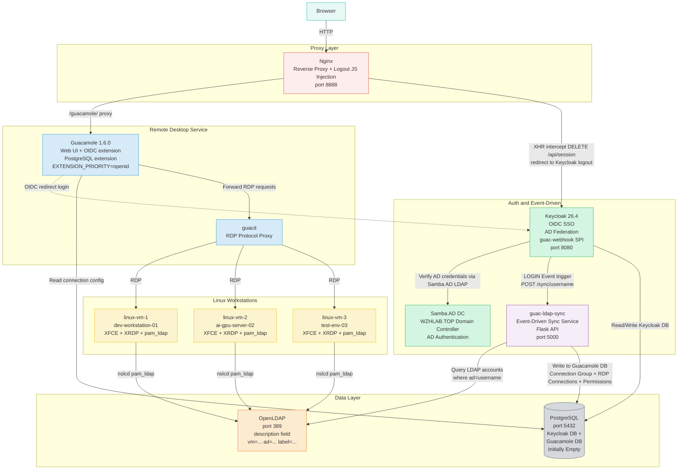

# RHBK + AD + Guacamole Demo Complete Deployment Guide

> **Version**: v3.0 (2026-03-30, Full Refactor: Event-Driven SPI + LDAP Auto-Sync)
> **Demo Scenario**: Enterprise AD Account → OIDC SSO → Guacamole Remote Desktop (LDAP account auto-mapping)
> **Server**: CentOS Stream 9, root privileges, Podman 5.x
> **Estimated Time**: ~45-60 minutes (including Linux desktop image build ~5-15 minutes)
> **Source Directory**: `files/keycloak-guac-webhook/` (Java SPI + Python sync service)

---

## Demo Video

[](imgs/2026.03.rhbk.ad.demo.deploy.cn.md/2026-04-01-10-39-05.png)

---

## Demo Scenario Overview

### Business Background

Three employees (Kim, Park, Lee) have enterprise AD accounts and access their individual remote development/test workstations through a **unified portal**. Each person has different numbers of workstation permissions, and an AI team shared workstation is used by all three.

### Account Relationship Mapping

| AD Account | LDAP Account | Target VM | Connection Type |
|---------|-----------|---------|---------|
| kim.minsoo | kim.minsoo.dev | linux-vm-1 (dev-workstation-01) | Personal Dev |
| kim.minsoo | kim.minsoo.test | linux-vm-3 (test-env-03) | Personal Test |
| kim.minsoo | team-ai-shared | linux-vm-2 (ai-gpu-server-02) | Team Shared |
| park.jiyeon | park.jiyeon.dev | linux-vm-1 (dev-workstation-01) | Personal Dev |
| park.jiyeon | team-ai-shared | linux-vm-2 (ai-gpu-server-02) | Team Shared |
| lee.seungho | lee.seungho.dev | linux-vm-3 (test-env-03) | Personal Dev |
| lee.seungho | team-ai-shared | linux-vm-2 (ai-gpu-server-02) | Team Shared |

**Key Features**:
- **1 AD Account → Multiple LDAP Accounts** → Different workstation permissions
- **LDAP-Driven**: OpenLDAP `description` field defines mappings, no manual Guacamole configuration required
- **Event-Driven**: Keycloak SPI auto-triggers connection setup on user login; Guacamole DB starts empty

---

## Full Architecture



### Data Flow: User Login → Auto Connection Setup

```
1. Browser visits http://workplace.wzhlab.top:8888/guacamole/
2. Guacamole redirects to Keycloak OIDC login
3. User enters AD credentials (kim.minsoo / Password123!)
4. Keycloak verifies AD account (via Samba AD LDAP)
5. Login succeeds, LOGIN Event is triggered
6. guac-webhook SPI: POST http://guac-ldap-sync:5000/sync/kim.minsoo
7. guac-ldap-sync queries OpenLDAP for all accounts where ad=kim.minsoo
8. Creates connection group + RDP connections + permissions in Guacamole DB
9. User sees their workstation connection list in Guacamole
```

### Container Inventory (11 total)

| Container | Image | Role | External Port |
|------|------|------|---------|
| postgres | postgres:15 | Keycloak + Guacamole DB | 5432 |
| samba-ad | nowsci/samba-domain | AD Authentication | - |
| openldap | osixia/openldap:1.5.0 | LDAP Accounts + VM Mapping | - |
| keycloak | keycloak:26.4 + SPI JAR | OIDC + AD Federation + SPI | 8080 |
| guacd | guacamole/guacd:1.6.0 | RDP Protocol Proxy | - |
| guacamole | guacamole/guacamole:1.6.0 | Web UI + OIDC | - |
| nginx-proxy | nginx:alpine | Reverse Proxy + Logout JS | 8888 |
| linux-vm-1 | corp-linux-desktop | XFCE dev-workstation-01 | - |
| linux-vm-2 | corp-linux-desktop | XFCE ai-gpu-server-02 | - |
| linux-vm-3 | corp-linux-desktop | XFCE test-env-03 | - |
| guac-ldap-sync | guac-ldap-sync:latest | Event-Driven Sync Service | 5000 |

---

## Table of Contents

1. [System Preparation](#1-system-preparation)
2. [Create Directory Structure](#2-create-directory-structure)
3. [Deploy PostgreSQL](#3-deploy-postgresql)
4. [Deploy Samba AD DC](#4-deploy-samba-ad-dc)
5. [Deploy OpenLDAP (with mapping format description)](#5-deploy-openldap)
6. [Build Linux Desktop Image](#6-build-linux-desktop-image)
7. [Deploy Guacamole + Nginx](#7-deploy-guacamole--nginx)
8. [Configure Keycloak + Deploy SPI](#8-configure-keycloak--deploy-spi)
9. [Deploy guac-ldap-sync](#9-deploy-guac-ldap-sync)
10. [End-to-End Validation](#10-end-to-end-validation)
11. [Demo Script](#11-demo-script)
12. [Troubleshooting](#12-troubleshooting)
13. [Restart Recovery](#13-restart-recovery)
14. [Complete Account Information](#14-complete-account-information)

---

## 1. System Preparation

### Install Required Tools

The entire demo environment runs on Podman containers. All services (database, AD domain controller, LDAP, Keycloak, Guacamole, etc.) run in containers — no host-level service installation required.

The tools installed serve the following purposes:
- `podman` / `podman-compose`: Container runtime, replaces Docker, no root daemon required
- `vim` / `curl` / `wget` / `jq`: General debugging and configuration utilities
- `openldap-clients`: Provides `ldapadd` / `ldapsearch` commands for importing account data into and validating the OpenLDAP container

Why configure `/etc/hosts`: In the demo environment, Keycloak issues OIDC tokens to the browser. The token's `issuer` field is `http://sso.wzhlab.top:8080/realms/corp`, so the browser must be able to resolve this domain. Similarly, Guacamole's redirect URI uses `workplace.wzhlab.top`. Both domains point to the same server's host IP, achieving a "pseudo-multi-domain" effect without real DNS.

Finally, the `corp-demo` Podman network is created so all containers can communicate by container name (e.g., `openldap`, `keycloak`, `postgres`) rather than IP addresses — critical in scenarios where IPs may change after container restarts.

```bash
dnf install -y podman podman-compose vim curl wget jq openldap-clients

MYIP=$(hostname -I | awk '{print $1}')
echo "${MYIP} sso.wzhlab.top" >> /etc/hosts
echo "${MYIP} workplace.wzhlab.top" >> /etc/hosts

podman network create corp-demo
```

---

## 2. Create Directory Structure

All configuration files, scripts, and SQL initialization statements needed for the demo environment must be prepared on the host in advance and mounted into containers via Podman volumes. Centralizing everything under `~/corp-rhbk-demo/` makes backup and cleanup easy.

Subdirectory purposes:
- `ldap-seed/`: OpenLDAP initialization data files (LDIF format), containing OU structure and account data
- `linux-desktop/`: Dockerfile and entrypoint script for the Linux desktop VM
- `postgres-init/`: SQL initialization scripts auto-executed when PostgreSQL starts
- `guacamole-init/`: Schema SQL extracted from the official Guacamole image (initializes Guacamole DB table structure)
- `nginx/`: Nginx reverse proxy configuration (with Logout JS injection)
- `keycloak-spi/`: Java source and compiled JAR for the Keycloak custom SPI
- `guac-sync/`: Python source and Dockerfile for the guac-ldap-sync service

```bash
mkdir -p ~/corp-rhbk-demo/{ldap-seed,linux-desktop,postgres-init,guacamole-init,nginx,keycloak-spi,guac-sync}
```

---

## 3. Deploy PostgreSQL

### Why Use One PostgreSQL Instance for Two Databases

In this demo environment, both Keycloak and Guacamole each need a relational database. To simplify the environment, they share a single PostgreSQL instance but use **independent databases and users** for isolation:
- `keycloak` database: Stores all Keycloak persistent data — Realm config, users, clients, sessions, etc.
- `guacamole` database: Stores Guacamole connection groups, RDP connection configs, user permissions, etc. **Initially empty** (all data is dynamically written by guac-ldap-sync on first user login)

### Two-Phase Initialization Strategy

PostgreSQL initialization happens in two steps:

**Step 1: Create databases and users** (auto-executed on first container start via `docker-entrypoint-initdb.d/`). Creates an `admin` superuser as the management account, and creates dedicated users and databases for Keycloak and Guacamole.

**Step 2: Initialize Guacamole Schema** (executed manually after PostgreSQL starts). The official Guacamole image includes an `initdb.sh` script that generates the complete table creation SQL. The approach here: run the script in a one-time container (`--rm`) to generate the SQL file, then copy it into the postgres container and execute it — avoiding the need to maintain a separate schema version file.

```bash
cat > ~/corp-rhbk-demo/postgres-init/init.sql << 'EOF'
CREATE DATABASE keycloak;
CREATE USER keycloak WITH PASSWORD 'KeycloakDB2024!';
GRANT ALL PRIVILEGES ON DATABASE keycloak TO keycloak;
ALTER DATABASE keycloak OWNER TO keycloak;
CREATE DATABASE guacamole;
CREATE USER guacamole WITH PASSWORD 'GuacamoleDB2024!';
GRANT ALL PRIVILEGES ON DATABASE guacamole TO guacamole;
ALTER DATABASE guacamole OWNER TO guacamole;
EOF

podman run -d \
  --name postgres --network corp-demo \
  -e POSTGRES_USER=admin -e POSTGRES_PASSWORD='PgAdmin2024!' \
  -v ~/corp-rhbk-demo/postgres-init/init.sql:/docker-entrypoint-initdb.d/init.sql:Z \
  -v postgres-data:/var/lib/postgresql/data \
  -p 5432:5432 docker.io/postgres:15

sleep 20

# Initialize Guacamole Schema
podman run --rm docker.io/guacamole/guacamole:1.6.0 \
  /opt/guacamole/bin/initdb.sh --postgresql > ~/corp-rhbk-demo/guacamole-init/initdb.sql
podman cp ~/corp-rhbk-demo/guacamole-init/initdb.sql postgres:/tmp/initdb.sql
podman exec postgres psql -U guacamole -d guacamole -f /tmp/initdb.sql 2>&1 | tail -3
```

---

## 4. Deploy Samba AD DC

### Samba AD's Role in the Architecture

Samba AD (Active Directory Domain Controller) is the **sole identity authentication data source** in this demo. The three demo users (kim.minsoo, park.jiyeon, lee.seungho) have their credentials stored in Samba AD. Keycloak connects to Samba AD via the LDAP protocol to verify user login credentials.

This design simulates the real enterprise scenario of "employees logging into a unified portal with domain accounts."

### Key Operation Notes

**① Container startup (wait 40 seconds)**: Samba AD's domain initialization process is slow (Kerberos, DNS service initialization) — allow sufficient time before proceeding.

**② Disable strong TLS authentication (⚠️ Critical step, must be re-executed after restart)**: Keycloak uses plain LDAP (not LDAPS) to connect to Samba AD. Samba 4 requires clients to use LDAP signing by default (`ldap server require strong auth = yes`), which causes Keycloak connections to be rejected with `LDAP_STRONG_AUTH_REQUIRED`. This restriction is disabled by appending `ldap server require strong auth = no` to the `[global]` section of `smb.conf`.

**Note**: This configuration is written to the container's runtime filesystem and will be lost on container restart. It must be re-executed after each restart (§13 Restart Recovery steps include this operation).

**③ Bulk create AD users**: Uses the `samba-tool` CLI to create demo users. Loop variables `$1 $2 $3 $4` correspond to `username first-name last-name email`, with all passwords set to `Password123!`.

```bash
podman run -d \
  --name samba-ad --hostname ad.wzhlab.top --network corp-demo --privileged \
  -e DOMAIN=WZHLAB.TOP -e DOMAINPASS='CorpAD2024!' \
  -e DNSFORWARDER=8.8.8.8 -e HOSTIP=0.0.0.0 \
  -v samba-data:/var/lib/samba \
  docker.io/nowsci/samba-domain

sleep 40

# ⚠️ Required: Disable strong TLS (lost after container restart, must be re-executed)
podman exec samba-ad bash -c \
  "grep -q 'ldap server require strong auth' /etc/samba/smb.conf || \
   sed -i '/\[global\]/a\        ldap server require strong auth = no' /etc/samba/smb.conf"
podman exec samba-ad supervisorctl restart samba
sleep 10

# Create AD users
for user_info in "kim.minsoo Minsoo Kim kim.minsoo@wzhlab.top" \
                  "park.jiyeon Jiyeon Park park.jiyeon@wzhlab.top" \
                  "lee.seungho Seungho Lee lee.seungho@wzhlab.top"; do
  set -- $user_info
  podman exec samba-ad samba-tool user create $1 'Password123!' \
    --given-name=$2 --surname=$3 --mail-address=$4
done
```

---

## 5. Deploy OpenLDAP

### OpenLDAP's Dual Role

In this demo architecture, OpenLDAP serves two independent roles:

**Role 1: Linux System Account Store (NSS/PAM)**
Linux VM containers use `nslcd` + `pam_ldap` to obtain POSIX account information (uid, gid, home directory) from OpenLDAP, enabling users to log into the Linux desktop with LDAP account credentials. This is a standard LDAP centralized authentication approach.

**Role 2: Guacamole Connection Configuration Center (Sole Data Source)**
OpenLDAP's `description` field is designed as structured connection mapping data. The `guac-ldap-sync` service parses this field to dynamically generate Guacamole connection groups and RDP connection configs. This design eliminates the need to maintain a separate configuration database — all connection relationship changes only require modifying LDAP entries.

### LDAP Account Mapping Format

The OpenLDAP `description` field is the **sole data source** for connection relationships:

```
description: vm=<container-name> ad=<AD-user1>,<AD-user2> label=<connection-display-name>
```

- `vm` = Target Linux VM container name (matches the Podman container name, also the RDP connection target hostname)
- `ad` = List of AD accounts with access to this LDAP account (comma-separated; list multiple AD users when they share a workstation)
- `label` = Connection name displayed in the Guacamole UI (user-visible friendly name)

### Account Design Notes

Each LDAP entry has two objectClass types:
- `inetOrgPerson`: Provides person attributes like cn, sn
- `posixAccount`: Provides POSIX attributes required by the Linux system (uidNumber, gidNumber, homeDirectory, etc.)

The `uid` field is the Linux login username and also the RDP session username. After an RDP connection is established, Guacamole uses this username to log into the corresponding Linux VM. `userPassword` is the actual RDP desktop login password, written by `guac-ldap-sync` as `rdp_password` into the Guacamole DB when creating RDP connections.

### Create Data Files

```bash
cat > ~/corp-rhbk-demo/ldap-seed/01-structure.ldif << 'EOF'
dn: ou=People,dc=wzhlab,dc=top
objectClass: organizationalUnit
ou: People
EOF

cat > ~/corp-rhbk-demo/ldap-seed/02-users.ldif << 'EOF'
dn: uid=kim.minsoo.dev,ou=People,dc=wzhlab,dc=top
objectClass: inetOrgPerson
objectClass: posixAccount
objectClass: shadowAccount
uid: kim.minsoo.dev
cn: Kim Minsoo Dev
sn: Kim
uidNumber: 10001
gidNumber: 10001
homeDirectory: /home/kim.minsoo.dev
loginShell: /bin/bash
userPassword: DemoPass2024!
description: vm=linux-vm-1 ad=kim.minsoo label=Personal Dev

dn: uid=kim.minsoo.test,ou=People,dc=wzhlab,dc=top
objectClass: inetOrgPerson
objectClass: posixAccount
objectClass: shadowAccount
uid: kim.minsoo.test
cn: Kim Minsoo Test
sn: Kim
uidNumber: 10002
gidNumber: 10002
homeDirectory: /home/kim.minsoo.test
loginShell: /bin/bash
userPassword: DemoPass2024!
description: vm=linux-vm-3 ad=kim.minsoo label=Personal Test

dn: uid=team-ai-shared,ou=People,dc=wzhlab,dc=top
objectClass: inetOrgPerson
objectClass: posixAccount
objectClass: shadowAccount
uid: team-ai-shared
cn: AI Team Shared Account
sn: AI-Team
uidNumber: 10003
gidNumber: 10003
homeDirectory: /home/team-ai-shared
loginShell: /bin/bash
userPassword: DemoPass2024!
description: vm=linux-vm-2 ad=kim.minsoo,park.jiyeon,lee.seungho label=Team AI Shared

dn: uid=park.jiyeon.dev,ou=People,dc=wzhlab,dc=top
objectClass: inetOrgPerson
objectClass: posixAccount
objectClass: shadowAccount
uid: park.jiyeon.dev
cn: Park Jiyeon Dev
sn: Park
uidNumber: 10004
gidNumber: 10004
homeDirectory: /home/park.jiyeon.dev
loginShell: /bin/bash
userPassword: DemoPass2024!
description: vm=linux-vm-1 ad=park.jiyeon label=Personal Dev

dn: uid=lee.seungho.dev,ou=People,dc=wzhlab,dc=top
objectClass: inetOrgPerson
objectClass: posixAccount
objectClass: shadowAccount
uid: lee.seungho.dev
cn: Lee Seungho Dev
sn: Lee
uidNumber: 10005
gidNumber: 10005
homeDirectory: /home/lee.seungho.dev
loginShell: /bin/bash
userPassword: DemoPass2024!
description: vm=linux-vm-3 ad=lee.seungho label=Personal Dev
EOF
```

### Start OpenLDAP and Import Data

> ⚠️ Do not use `LDAP_SEED_INTERNAL_LDIF_PATH` — it causes a crash due to internal directory copy errors inside the container.

```bash
podman run -d \
  --name openldap --hostname ldap.wzhlab.top --network corp-demo \
  -e LDAP_ORGANISATION="Corp" -e LDAP_DOMAIN="wzhlab.top" \
  -e LDAP_ADMIN_PASSWORD="LdapAdmin2024!" -e LDAP_BASE_DN="dc=wzhlab,dc=top" \
  -v openldap-data:/var/lib/ldap -v openldap-config:/etc/ldap/slapd.d \
  docker.io/osixia/openldap:1.5.0

sleep 20

LDAP_IP=$(podman inspect openldap --format '{{range .NetworkSettings.Networks}}{{.IPAddress}}{{end}}')
ldapadd -x -H ldap://${LDAP_IP}:389 -D "cn=admin,dc=wzhlab,dc=top" -w "LdapAdmin2024!" \
  -f ~/corp-rhbk-demo/ldap-seed/01-structure.ldif
ldapadd -x -H ldap://${LDAP_IP}:389 -D "cn=admin,dc=wzhlab,dc=top" -w "LdapAdmin2024!" \
  -f ~/corp-rhbk-demo/ldap-seed/02-users.ldif
```

### Verify

```bash
LDAP_IP=$(podman inspect openldap --format '{{range .NetworkSettings.Networks}}{{.IPAddress}}{{end}}')
ldapsearch -x -H ldap://${LDAP_IP}:389 -D "cn=admin,dc=wzhlab,dc=top" -w "LdapAdmin2024!" \
  -b "ou=People,dc=wzhlab,dc=top" "(objectClass=posixAccount)" uid description 2>&1 | \
  grep -E "uid:|description:"
# Should show 5 uids, each with a structured description (vm=... ad=... label=...)
```

---

## 6. Build Linux Desktop Image

### Why Build a Custom Image

Linux VM containers must simultaneously satisfy three requirements:
1. **RDP Remote Desktop**: Users connect via Guacamole Web UI using the RDP protocol
2. **LDAP Account Authentication**: Log into the Linux desktop with LDAP accounts (e.g., `kim.minsoo.dev`)
3. **Graphical Desktop Environment**: Run the XFCE lightweight desktop for actual user interaction

No existing public image satisfies all three requirements simultaneously, so we build our own based on Rocky Linux 9. The total image is approximately 1-2GB; build time is 5-15 minutes (depending on network and CPU).

### 6.1 Create entrypoint.sh

`entrypoint.sh` is the initialization script executed when the container starts. It runs on every container startup and handles 5 configuration phases:

**Phase 1: Configure LDAP Client (nslcd)**
Writes environment variables passed at container startup (`LDAP_SERVER`, `LDAP_BASE_DN`, etc.) to `/etc/nslcd.conf`, configuring the nslcd daemon to connect to OpenLDAP. nslcd is the NSS LDAP client daemon, responsible for providing LDAP query results to Linux system calls (such as `getent passwd`).

**Phase 2: Configure NSS (Name Service Switch)**
Modifies `/etc/nsswitch.conf` to make Linux look up local files first, then LDAP for `passwd`/`shadow`/`group` queries. This allows LDAP users to be recognized by the Linux system.

**Phase 3: Configure PAM Authentication Chain**
Configures `/etc/pam.d/system-auth` to establish authentication order: try local password authentication first, then LDAP authentication (`pam_ldap.so`) on failure. `pam_mkhomedir.so` ensures the home directory is automatically created on first login.

**Phase 4: Handle XFCE Desktop Compatibility Issues**
- Disable `xfce-polkit` PolicyKit agent: The container has no `polkitd` daemon; PolicyKit popups cause desktop freezes or crashes
- Generate a self-signed SSL certificate (required by xrdp)
- Configure XRDP session persistence parameters (`KillDisconnected=false`) to prevent sessions from being killed when RDP disconnects

**Phase 5: Configure and Start XRDP**
`startwm.sh` is the XRDP session startup script. XFCE must be started via `dbus-launch`, otherwise the lack of a D-Bus session causes XFCE to crash immediately (SIGTRAP). Finally starts `xrdp-sesman` (session manager) and `xrdp` (main process) to listen for RDP connections (port 3389).

```bash
cat > ~/corp-rhbk-demo/linux-desktop/entrypoint.sh << 'ENTRYEOF'
#!/bin/bash
set -e
LDAP_SERVER=${LDAP_SERVER:-ldap://openldap:389}
LDAP_BASE_DN=${LDAP_BASE_DN:-dc=wzhlab,dc=top}
LDAP_BIND_DN=${LDAP_BIND_DN:-cn=admin,dc=wzhlab,dc=top}
LDAP_BIND_PW=${LDAP_BIND_PW:-LdapAdmin2024!}

cat > /etc/nslcd.conf << EOF
uid nslcd
gid ldap
uri ${LDAP_SERVER}
base ${LDAP_BASE_DN}
binddn ${LDAP_BIND_DN}
bindpw ${LDAP_BIND_PW}
ssl no
tls_cacertdir /etc/openldap/certs
EOF
chmod 600 /etc/nslcd.conf

cat > /etc/nsswitch.conf << EOF
passwd:     files ldap
shadow:     files ldap
group:      files ldap
hosts:      files dns
EOF

cat > /etc/pam.d/system-auth << 'PAMEOF'
#%PAM-1.0
auth        required      pam_env.so
auth        sufficient    pam_unix.so try_first_pass nullok
auth        sufficient    pam_ldap.so try_first_pass
auth        required      pam_deny.so
account     required      pam_unix.so
account     sufficient    pam_ldap.so
account     required      pam_permit.so
password    requisite     pam_pwquality.so try_first_pass local_users_only retry=3
password    sufficient    pam_unix.so try_first_pass use_authtok nullok sha512 shadow
password    sufficient    pam_ldap.so use_authtok
password    required      pam_deny.so
session     optional      pam_keyinit.so revoke
session     required      pam_limits.so
session     required      pam_unix.so
session     optional      pam_ldap.so
session     optional      pam_mkhomedir.so skel=/etc/skel umask=0077
PAMEOF
cp /etc/pam.d/system-auth /etc/pam.d/password-auth

# Disable XFCE PolicyKit Agent (container has no polkitd)
echo "Hidden=true" >> /etc/xdg/autostart/xfce-polkit.desktop 2>/dev/null || true
mkdir -p /etc/skel/.config/autostart
printf "[Desktop Entry]\nHidden=true\n" > /etc/skel/.config/autostart/xfce-polkit.desktop

/usr/sbin/nslcd 2>/dev/null || true
sleep 2
getent passwd kim.minsoo.dev >/dev/null 2>&1 && echo "LDAP OK" || echo "WARN: LDAP not ready"

[ ! -f /etc/xrdp/cert.pem ] && openssl req -x509 -newkey rsa:2048 \
  -keyout /etc/xrdp/key.pem -out /etc/xrdp/cert.pem \
  -days 365 -nodes -subj "/CN=$(hostname)" 2>/dev/null

if [ -f /etc/xrdp/sesman.ini ]; then
  grep -q 'KillDisconnected' /etc/xrdp/sesman.ini || echo 'KillDisconnected=false' >> /etc/xrdp/sesman.ini
  grep -q 'DisconnectedTimeLimit' /etc/xrdp/sesman.ini || echo 'DisconnectedTimeLimit=259200' >> /etc/xrdp/sesman.ini
  grep -q 'IdleTimeLimit' /etc/xrdp/sesman.ini || echo 'IdleTimeLimit=0' >> /etc/xrdp/sesman.ini
fi

sed -i 's|DefaultWindowManager=.*|DefaultWindowManager=/etc/xrdp/startwm.sh|' /etc/xrdp/sesman.ini 2>/dev/null || true

cat > /etc/xrdp/startwm.sh << 'WMEOF'
#!/bin/bash
unset DBUS_SESSION_BUS_ADDRESS
unset XDG_RUNTIME_DIR
if which dbus-launch > /dev/null 2>&1; then
  exec dbus-launch --exit-with-session startxfce4
else
  exec startxfce4
fi
WMEOF
chmod +x /etc/xrdp/startwm.sh

/usr/sbin/xrdp-sesman --nodaemon &
sleep 2
exec /usr/sbin/xrdp --nodaemon
ENTRYEOF
```

### 6.2 Create Dockerfile

The Dockerfile defines the image build process in 4 main layers:

1. **Base System Layer**: Using `rockylinux:9` as the base, install the EPEL repository (provides extra packages like xrdp) and perform a full system update
2. **Desktop Environment Layer**: Install the Xfce desktop (`dnf groupinstall "Xfce"`) and XRDP service; also install `nss-pam-ldapd` (LDAP NSS/PAM client), `oddjob-mkhomedir` (auto home directory creation), and other dependencies
3. **XRDP Tuning Layer**: Adjust color depth from default 32bpp to 24bpp (`max_bpp=24`) to avoid color issues with some RDP clients
4. **Startup Script Layer**: Copy `entrypoint.sh` into the image and set it as the container startup entry

> **Why use entrypoint.sh instead of configuring LDAP directly in the Dockerfile?**
> The LDAP server address (e.g., `ldap://openldap:389`) is passed in as an environment variable at container startup — it's not known at Dockerfile build time. Therefore, LDAP-related configuration must be written dynamically at runtime (entrypoint.sh), not hardcoded at build time.

```bash
cat > ~/corp-rhbk-demo/linux-desktop/Dockerfile << 'DOCKEREOF'
FROM docker.io/rockylinux:9
RUN dnf install -y epel-release && dnf update -y
RUN dnf groupinstall -y "Xfce" && \
    dnf install -y xrdp xorgxrdp tigervnc-server dbus-x11 \
    nss-pam-ldapd openldap-clients oddjob-mkhomedir sudo vim passwd openssl && \
    dnf clean all
RUN sed -i 's/^max_bpp=.*/max_bpp=24/' /etc/xrdp/xrdp.ini 2>/dev/null || true
COPY entrypoint.sh /entrypoint.sh
RUN chmod +x /entrypoint.sh
EXPOSE 3389
CMD ["/entrypoint.sh"]
DOCKEREOF
```

### 6.3 Build and Start

The image build requires downloading many packages (the Xfce desktop is several hundred MB), so it's recommended to run in the background (`nohup ... &`). After building, the three VM containers use the **same image** but are given different identities via `--name` and `--hostname` parameters, simulating three independent workstations:

| Container Name | Hostname | Role |
|--------|--------|------|
| linux-vm-1 | dev-workstation-01 | Development Workstation |
| linux-vm-2 | ai-gpu-server-02 | AI GPU Server |
| linux-vm-3 | test-env-03 | Test Environment |

The `--privileged` flag is required because the container needs to run `nslcd` (LDAP daemon) and `xrdp` (RDP service), which need privileged permissions to listen on ports and access system resources.

LDAP connection parameters are passed via environment variables, dynamically written to configuration files by `entrypoint.sh` at container startup. This way, all VMs point to the same OpenLDAP service for centralized account management.

```bash
cd ~/corp-rhbk-demo/linux-desktop
nohup podman build -t corp-linux-desktop:latest . > /tmp/docker-build.log 2>&1 &
echo "Build PID: $! - Monitor: tail -f /tmp/docker-build.log"
# Wait 5-15 minutes

# Start 3 VMs after build completes
for name in linux-vm-1 linux-vm-2 linux-vm-3; do
  hostname_map=("dev-workstation-01" "ai-gpu-server-02" "test-env-03")
  idx=0; [[ $name == "linux-vm-2" ]] && idx=1; [[ $name == "linux-vm-3" ]] && idx=2
  podman run -d \
    --name $name --hostname ${hostname_map[$idx]} --network corp-demo --privileged \
    -e LDAP_SERVER=ldap://openldap:389 \
    -e LDAP_BASE_DN=dc=wzhlab,dc=top \
    -e LDAP_BIND_DN=cn=admin,dc=wzhlab,dc=top \
    -e LDAP_BIND_PW=LdapAdmin2024! \
    corp-linux-desktop:latest
done
sleep 25
```

---

## 7. Deploy Guacamole + Nginx

### Guacamole's Role in the Architecture

Guacamole is the **user-facing entry point** for the entire demo. It converts browser access into RDP protocol, enabling remote desktop access through a web page. Key design decisions for Guacamole in this demo:

- **OIDC-First Authentication**: Guacamole does not perform local password authentication — it fully delegates to Keycloak OIDC. When a user accesses Guacamole, the page immediately redirects to the Keycloak login page
- **DB Starts Empty**: Guacamole's PostgreSQL database has no connection configurations at deploy time. Connection data is dynamically written by guac-ldap-sync when users log in
- **Auto Account Creation**: `POSTGRESQL_AUTO_CREATE_ACCOUNTS=true` makes Guacamole automatically create a corresponding user record in the DB when a user first logs in via OIDC

### 7.1 Start guacd

guacd is Guacamole's backend daemon, responsible for actual RDP protocol handling. The Guacamole web application does not process RDP directly — it forwards connection requests to guacd, which establishes RDP connections to the target Linux VMs and streams desktop images back to the browser.

guacd does not need external port exposure (it communicates internally within the `corp-demo` network), and requires no persistent storage — its configuration is minimal.

```bash
podman run -d --name guacd --network corp-demo docker.io/guacamole/guacd:1.6.0
```

### 7.2 Start Guacamole

**Key Environment Variables Explained**:

| Environment Variable | Purpose | Notes |
|----------|------|---------|
| `OPENID_ENABLED=true` | Enable built-in OIDC extension | Built into 1.6.0, no manual JAR download needed |
| `EXTENSION_PRIORITY=openid` | OIDC extension handles auth before PostgreSQL extension | Without this, local login page shows instead of redirecting to Keycloak |
| `POSTGRESQL_AUTO_CREATE_ACCOUNTS=true` | Auto-create user records after OIDC login | Must be enabled, otherwise user has no DB permissions after login |
| `OPENID_AUTHORIZATION_ENDPOINT` | Use public domain (`sso.wzhlab.top:8080`) | Used for browser redirects, must be resolvable by the browser |
| `OPENID_JWKS_ENDPOINT` | Use internal container name (`keycloak:8080`) | Used server-side to verify token signatures, goes through internal network |
| `OPENID_USERNAME_CLAIM_TYPE=preferred_username` | Extract username from token's `preferred_username` field | Corresponds to AD's `sAMAccountName`, i.e., `kim.minsoo` |

> **Key Configurations**:
> - `OPENID_ENABLED=true` — No manual JAR download needed (built into 1.6.0)
> - `EXTENSION_PRIORITY=openid` — OIDC takes priority over PostgreSQL for authentication
> - `POSTGRESQL_AUTO_CREATE_ACCOUNTS=true` — Auto-create account on first login
> - No external port exposed; proxied through Nginx

```bash
podman run -d \
  --name guacamole --hostname workplace.wzhlab.top --network corp-demo \
  -e GUACD_HOSTNAME=guacd -e GUACD_PORT=4822 \
  -e POSTGRESQL_HOSTNAME=postgres -e POSTGRESQL_PORT=5432 \
  -e POSTGRESQL_DATABASE=guacamole -e POSTGRESQL_USER=guacamole \
  -e POSTGRESQL_PASSWORD='GuacamoleDB2024!' \
  -e POSTGRESQL_AUTO_CREATE_ACCOUNTS=true \
  -e OPENID_ENABLED=true \
  -e OPENID_AUTHORIZATION_ENDPOINT=http://sso.wzhlab.top:8080/realms/corp/protocol/openid-connect/auth \
  -e OPENID_JWKS_ENDPOINT=http://keycloak:8080/realms/corp/protocol/openid-connect/certs \
  -e OPENID_ISSUER=http://sso.wzhlab.top:8080/realms/corp \
  -e OPENID_CLIENT_ID=guacamole \
  -e OPENID_REDIRECT_URI=http://workplace.wzhlab.top:8888/guacamole/ \
  -e "OPENID_SCOPE=openid email profile" \
  -e OPENID_USERNAME_CLAIM_TYPE=preferred_username \
  -e EXTENSION_PRIORITY=openid \
  docker.io/guacamole/guacamole:1.6.0
sleep 20
```

### 7.3 Create Nginx Configuration (with Logout JS)

> **Why inject JS?**
> Guacamole 1.6.0 does not support RP-Initiated Logout (GUACAMOLE-758/519).
> Nginx `sub_filter` injects an XHR intercept JS: when Guacamole sends `DELETE /api/session`,
> it synchronously sends DELETE (to clean the local session) + after 200ms redirects to the Keycloak logout endpoint to destroy the SSO session.
>
> ⚠️ Guacamole **1.6.0** logout API changed from `DELETE /api/tokens/{token}` to `DELETE /api/session`

```bash
# Use Python to write the file (avoids shell quote nesting issues)
cat << 'PYEOF' | base64 | ssh root@<server-ip> 'base64 -d > /tmp/mk_nginx.py && python3 /tmp/mk_nginx.py'
import os
js = (
    "(function(){var _o=XMLHttpRequest.prototype.open,_s=XMLHttpRequest.prototype.send;"
    "XMLHttpRequest.prototype.open=function(m,u){this._lg=(m==='DELETE'&&u&&u.indexOf('api/session')!==-1);return _o.apply(this,arguments);};"
    "XMLHttpRequest.prototype.send=function(){if(this._lg){"
    "var u='http://sso.wzhlab.top:8080/realms/corp/protocol/openid-connect/logout?client_id=guacamole&post_logout_redirect_uri='+encodeURIComponent('http://workplace.wzhlab.top:8888/guacamole/');"
    "_s.apply(this,arguments);setTimeout(function(){window.location.replace(u);},200);return;}"
    "return _s.apply(this,arguments);};}());"
)
sf = "<head><script>" + js + "</script>"
content = r"""events { worker_connections 1024; }
http { server { listen 80; server_name _;
  sub_filter '<head>' '""" + sf.replace("'", "\\'") + r"""';
  sub_filter_once on; sub_filter_types text/html;
  location /guacamole/ {
    proxy_pass http://guacamole:8080/guacamole/;
    proxy_http_version 1.1;
    proxy_set_header Upgrade $http_upgrade;
    proxy_set_header Connection "upgrade";
    proxy_set_header Host $host;
    proxy_set_header X-Real-IP $remote_addr;
    proxy_set_header X-Forwarded-For $proxy_add_x_forwarded_for;
    proxy_set_header X-Forwarded-Proto $scheme;
    proxy_set_header Accept-Encoding "";
    proxy_read_timeout 3600; proxy_send_timeout 3600;
    proxy_buffering off;
  }
  location = / { return 301 /guacamole/; }
} }
"""
os.makedirs('/root/corp-rhbk-demo/nginx', exist_ok=True)
with open('/root/corp-rhbk-demo/nginx/nginx.conf', 'w') as f: f.write(content)
print('nginx.conf created')
PYEOF

podman run -d \
  --name nginx-proxy --network corp-demo \
  -v ~/corp-rhbk-demo/nginx/nginx.conf:/etc/nginx/nginx.conf:ro,Z \
  -p 8888:80 docker.io/nginx:alpine
```

---

## 8. Configure Keycloak + Deploy SPI

### Keycloak's Central Role in the Architecture

Keycloak is the **authentication and event-driven hub** of the entire demo, serving three critical functions:

1. **OIDC Identity Provider**: Provides OIDC SSO service to Guacamole; users log in through the Keycloak page
2. **AD Federation**: Bridges the enterprise AD (Samba AD), delegating AD credential verification to Samba AD
3. **Event Trigger (via SPI)**: After successful user login, triggers the custom SPI to send a webhook to guac-ldap-sync, driving automatic connection configuration creation

### 8.1 Build the SPI JAR

Keycloak SPI (Service Provider Interface) is Keycloak's plugin mechanism. This demo implements an **EventListener SPI** that listens for Keycloak's `LOGIN` event and automatically sends an HTTP POST request to guac-ldap-sync with the logged-in username when a user successfully logs in.

Build method: Use a Maven container (`docker.io/maven:3.9-eclipse-temurin-21`) to compile the Java source in the host directory, producing a JAR file of approximately 5-6KB (contains only SPI code, no bundled dependencies). The SPI JAR is mounted into the Keycloak container's `/opt/keycloak/providers/` directory via Podman volume. Keycloak auto-discovers and loads it on startup without any additional configuration.

> Keycloak SPI source code is in the repo's `files/keycloak-guac-webhook/` directory.

```bash
scp -r files/keycloak-guac-webhook/ root@<server-ip>:~/corp-rhbk-demo/keycloak-spi/

mkdir -p ~/.m2
podman run --rm \
  -v ~/corp-rhbk-demo/keycloak-spi:/project:Z \
  -v ~/.m2:/root/.m2:Z \
  docker.io/maven:3.9-eclipse-temurin-21 \
  mvn -f /project/pom.xml package -q -DskipTests 2>&1

cp ~/corp-rhbk-demo/keycloak-spi/target/keycloak-guac-webhook.jar \
   ~/corp-rhbk-demo/keycloak-spi/keycloak-guac-webhook.jar
ls -lh ~/corp-rhbk-demo/keycloak-spi/keycloak-guac-webhook.jar  # Should be ~5-6K
```

### 8.2 Start Keycloak (with SPI Volume Mount Persistence)

**Key Startup Parameter Notes**:

- `KC_HOSTNAME_STRICT=false` + `KC_HTTP_ENABLED=true`: Allow HTTP access; no TLS configured in the demo environment
- `KC_PROXY_HEADERS=xforwarded`: Correctly read client IP when Keycloak is behind Nginx (in this demo, Nginx directly proxies Keycloak's port; actual Guacamole access is via 8888, Keycloak via 8080 direct connection)
- `KC_WEBHOOK_URL=http://guac-ldap-sync:5000`: The SPI reads this environment variable to know where to send the webhook. This is the sole coupling point between the SPI and guac-ldap-sync
- `-v .../keycloak-guac-webhook.jar:/opt/keycloak/providers/...`: Keycloak's `providers/` directory is the standard path for the SPI discovery mechanism. Once a JAR is placed here, it auto-loads on next startup without any additional configuration
- `start-dev`: Starts in development mode (disables production requirements like TLS, hostname checks, etc.), suitable for demo environments

Wait approximately 60 seconds after startup (Keycloak database initialization + SPI loading is slow), then check the logs to confirm the SPI loaded successfully.

```bash
podman run -d \
  --name keycloak --hostname sso.wzhlab.top --network corp-demo \
  -e KEYCLOAK_ADMIN=admin \
  -e KEYCLOAK_ADMIN_PASSWORD='KeycloakAdmin2024!' \
  -e KC_DB=postgres \
  -e KC_DB_URL=jdbc:postgresql://postgres:5432/keycloak \
  -e KC_DB_USERNAME=keycloak -e KC_DB_PASSWORD='KeycloakDB2024!' \
  -e KC_HOSTNAME_STRICT=false -e KC_HTTP_ENABLED=true \
  -e KC_PROXY_HEADERS=xforwarded \
  -e KC_WEBHOOK_URL=http://guac-ldap-sync:5000 \
  -v ~/corp-rhbk-demo/keycloak-spi/keycloak-guac-webhook.jar:/opt/keycloak/providers/keycloak-guac-webhook.jar:Z,ro \
  -p 8080:8080 \
  quay.io/keycloak/keycloak:26.4 start-dev

sleep 60

# Verify SPI is loaded
podman logs keycloak 2>&1 | grep "guac-webhook"
# Should see: [guac-webhook] Initialized. Webhook base URL: http://guac-ldap-sync:5000
```

### 8.3 Configure Keycloak (corp Realm + AD + OIDC Client + SPI)

This step uses `kcadm.sh` (Keycloak Admin CLI) to complete all configuration without entering the Web UI. Configuration is divided into 4 sub-steps:

**① Obtain Admin Token**: Call `config credentials` to cache admin credentials locally (`~/.keycloak/kcadm.config`); subsequent commands don't need to re-enter the password.

**② Create corp Realm**: All demo resources (users, clients, Federation) live in the independent `corp` Realm, completely isolated from the `master` Realm. Email login and self-registration are disabled, consistent with an enterprise AD login scenario.

**③ Configure AD Federation**: Register Samba AD as a Keycloak LDAP User Storage Provider. Key parameters:
  - `config.vendor=["ad"]`: Tells Keycloak to use AD-specific LDAP attribute mapping
  - `config.usernameLDAPAttribute=["sAMAccountName"]`: AD login name field (corresponds to `kim.minsoo`)
  - `config.uuidLDAPAttribute=["objectGUID"]`: AD object unique identifier, used for account sync deduplication
  - `config.editMode=["READ_ONLY"]`: Read-only mode; Keycloak does not modify user data in AD
  - After creation, immediately execute `triggerFullSync` to sync AD users to Keycloak's local DB

**④ Create Guacamole OIDC Client**:
  - `publicClient=true`: Public client, no client secret required (suitable for web apps)
  - `implicitFlowEnabled=true`: ⚠️ Must be enabled; Guacamole 1.6.0's OIDC implementation uses Implicit Flow
  - Set `post_logout_redirect_uris` separately via Python script (`kcadm.sh` does not directly support this field)

**⑤ Register guac-webhook Event Listener**: Register the SPI in the corp Realm's event listener list. This configuration is persisted to PostgreSQL and takes effect automatically after restarts.

```bash
podman exec keycloak /opt/keycloak/bin/kcadm.sh config credentials \
  --server http://localhost:8080 --realm master \
  --user admin --password 'KeycloakAdmin2024!'

# Create corp Realm
podman exec keycloak /opt/keycloak/bin/kcadm.sh create realms \
  -s realm=corp -s enabled=true -s displayName="Corp SSO" \
  -s loginWithEmailAllowed=false -s registrationAllowed=false

# AD Federation (use container DNS name; no issue if IP changes after restart)
COMP_ID=$(podman exec keycloak /opt/keycloak/bin/kcadm.sh create components \
  -r corp \
  -s name="Corp Active Directory" \
  -s providerId=ldap \
  -s providerType=org.keycloak.storage.UserStorageProvider \
  -s 'config.vendor=["ad"]' \
  -s 'config.usernameLDAPAttribute=["sAMAccountName"]' \
  -s 'config.rdnLDAPAttribute=["cn"]' \
  -s 'config.uuidLDAPAttribute=["objectGUID"]' \
  -s 'config.userObjectClasses=["person, organizationalPerson, user"]' \
  -s 'config.connectionUrl=["ldap://samba-ad:389"]' \
  -s 'config.usersDn=["CN=Users,DC=WZHLAB,DC=TOP"]' \
  -s 'config.authType=["simple"]' \
  -s 'config.bindDn=["CN=Administrator,CN=Users,DC=WZHLAB,DC=TOP"]' \
  -s 'config.bindCredential=["CorpAD2024!"]' \
  -s 'config.searchScope=["2"]' \
  -s 'config.editMode=["READ_ONLY"]' \
  -s 'config.importEnabled=["true"]' \
  -s 'config.connectionPooling=["true"]' \
  -i 2>&1)
echo "Federation ID: $COMP_ID"
podman exec keycloak /opt/keycloak/bin/kcadm.sh create \
  "user-storage/${COMP_ID}/sync?action=triggerFullSync" -r corp 2>&1

# Guacamole OIDC Client (⚠️ implicitFlowEnabled must be true)
podman exec keycloak /opt/keycloak/bin/kcadm.sh create clients -r corp \
  -s clientId=guacamole -s name="Virtual Workplace Demo" \
  -s enabled=true -s publicClient=true \
  -s 'standardFlowEnabled=true' -s 'implicitFlowEnabled=true' \
  -s 'rootUrl=http://workplace.wzhlab.top:8888/guacamole/' \
  -s 'baseUrl=http://workplace.wzhlab.top:8888/guacamole/' \
  -s 'redirectUris=["http://workplace.wzhlab.top:8888/*"]' \
  -s 'webOrigins=["*"]'

# Configure post_logout_redirect_uris
python3 -c "
import urllib.request, urllib.parse, json
td = urllib.parse.urlencode({'client_id':'admin-cli','username':'admin',
  'password':'KeycloakAdmin2024!','grant_type':'password'}).encode()
req = urllib.request.Request('http://localhost:8080/realms/master/protocol/openid-connect/token',data=td,method='POST')
with urllib.request.urlopen(req) as r: token = json.loads(r.read())['access_token']
req = urllib.request.Request('http://localhost:8080/admin/realms/corp/clients?clientId=guacamole',
  headers={'Authorization':f'Bearer {token}'})
with urllib.request.urlopen(req) as r: client = json.loads(r.read())[0]
client['attributes']['post.logout.redirect.uris'] = 'http://workplace.wzhlab.top:8888/*'
data = json.dumps(client).encode()
req = urllib.request.Request(f'http://localhost:8080/admin/realms/corp/clients/{client[\"id\"]}',
  data=data, method='PUT', headers={'Authorization':f'Bearer {token}','Content-Type':'application/json'})
with urllib.request.urlopen(req) as r: print('Update:', r.status)
"

# Enable guac-webhook Event Listener (one-time; persisted in PostgreSQL)
podman exec keycloak /opt/keycloak/bin/kcadm.sh update realms/corp \
  -r corp -s 'eventsListeners=["jboss-logging","guac-webhook"]'
```

---

## 9. Deploy guac-ldap-sync

> **This is the core of the entire solution**: Keycloak SPI triggers → Query OpenLDAP → Write to Guacamole DB

### How the Sync Service Works

`guac-ldap-sync` is a lightweight HTTP API service implemented in Python/Flask, exposing a `/sync/<username>` endpoint. When called, it performs three operations:

1. **Query OpenLDAP**: Search under `ou=People,dc=wzhlab,dc=top` for all entries where the `description` field contains `ad=<username>` (supports multi-value, e.g., `ad=kim.minsoo,park.jiyeon`)
2. **Parse Mapping Relationships**: Extract `vm` (target container name), `label` (display name), `uid` (Linux username), etc. from the `description` field
3. **Write to Guacamole DB**: Execute upsert operations in PostgreSQL, idempotently creating/updating:
   - **Connection groups** (`guacamole_connection_group`): Named `<AD-username> Workstations`
   - **RDP connections** (`guacamole_connection`): One connection per LDAP account, targeting the VM container name
   - **User permissions** (`guacamole_connection_permission`): Grant READ permission to that AD user

**Environment Variable Notes**:
- `LDAP_URL/BIND_DN/BIND_PW/BASE`: Configuration to connect to OpenLDAP
- `PG_HOST/DB/USER/PASS`: Configuration to connect to Guacamole PostgreSQL
- `RDP_PASSWORD`: RDP connection password written to Guacamole DB (the LDAP account's `userPassword`)
- `GUAC_BACKEND`: Internal address of the Guacamole web service (used for certain API operations, such as cleaning up old connections)

### Source Code

> Source code is in `files/keycloak-guac-webhook/guac-sync/`, see the README.md in that directory.

```bash
scp -r files/keycloak-guac-webhook/guac-sync/ root@<server-ip>:~/corp-rhbk-demo/

cd ~/corp-rhbk-demo/guac-sync
cat > requirements.txt << 'EOF'
flask>=3.0
ldap3>=2.9
psycopg2-binary>=2.9
requests>=2.31
EOF
podman build -t guac-ldap-sync:latest .

podman run -d \
  --name guac-ldap-sync --network corp-demo \
  -e LDAP_URL=ldap://openldap:389 \
  -e LDAP_BIND_DN=cn=admin,dc=wzhlab,dc=top \
  -e LDAP_BIND_PW=LdapAdmin2024! \
  -e LDAP_BASE=ou=People,dc=wzhlab,dc=top \
  -e PG_HOST=postgres -e PG_DB=guacamole \
  -e PG_USER=guacamole -e PG_PASS=GuacamoleDB2024! \
  -e RDP_PASSWORD=DemoPass2024! \
  -e GUAC_BACKEND=http://guacamole:8080 \
  -p 5000:5000 guac-ldap-sync:latest

sleep 15
curl -s http://localhost:5000/health
```

---

## 10. End-to-End Validation

After all services are deployed, run the following validation script to confirm the overall chain is working. Each check corresponds to a key component or integration point:

| Validation Item | What to Check | Expected Result |
|--------|---------|---------|
| Container Status | All 11 containers Up | No Exited status |
| AD Authentication | Obtain token via Resource Owner Password method | Returns `token_type: Bearer`; otherwise indicates AD connection or Realm config error |
| SPI Verification | guac-webhook initialization in Keycloak logs | Shows `Initialized. Webhook base URL` |
| Guacamole HTTP | Nginx proxy returns HTTP 200 | Returns `HTTP 200` |
| Logout JS | Nginx-injected JS visible in HTML | Outputs `1` (matched `api/session`) |
| Manual Sync Trigger | Call sync API directly to verify LDAP → DB chain | Returns JSON with created connection information |
| hosts Configuration | Prompt for hosts entries needed on demo laptop | Add the displayed IP and domains to demo laptop's /etc/hosts |

```bash
echo "=== Container Status (should be 11) ==="
podman ps --format "table {{.Names}}\t{{.Status}}" | sort

echo "=== AD Authentication Test ==="
for u in kim.minsoo park.jiyeon lee.seungho; do
  R=$(curl -s -X POST http://localhost:8080/realms/corp/protocol/openid-connect/token \
    -d "client_id=guacamole&grant_type=password&username=$u&password=Password123!" | \
    python3 -c "import sys,json; d=json.load(sys.stdin); print(d.get('token_type',d.get('error')))")
  echo "  $u: $R"
done

echo "=== SPI Verification ==="
podman logs keycloak 2>&1 | grep "guac-webhook" | tail -3

echo "=== Guacamole HTTP ==="
curl -s -o /dev/null -w "HTTP %{http_code}" http://localhost:8888/guacamole/

echo "=== Logout JS Injection ==="
curl -s http://localhost:8888/guacamole/ | grep -c "api/session"
# Should output 1

echo "=== Manual Sync Trigger (test) ==="
curl -s -X POST http://localhost:5000/sync/kim.minsoo | python3 -m json.tool

echo "=== Demo Laptop hosts ==="
PUB_IP=$(curl -s http://169.254.169.254/latest/meta-data/public-ipv4 2>/dev/null || echo "35.93.145.230")
echo "Add to laptop /etc/hosts:"
echo "  ${PUB_IP}  sso.wzhlab.top  workplace.wzhlab.top"
```

---

## 11. Demo Script

### 11.1 Standard Demo Flow

1. Visit `http://workplace.wzhlab.top:8888/guacamole/` → Redirects to Keycloak login
2. Enter `kim.minsoo` / `Password123!`
   - Keycloak SPI triggers `POST /sync/kim.minsoo`
   - guac-ldap-sync reads mappings from OpenLDAP, creates Guacamole connections
3. Return to Guacamole → See "Kim Minsoo Workstations" + 3 connections
4. Click "Personal Dev" → XFCE desktop
5. Click Logout → Keycloak confirms → Returns to login page

### 11.2 Demonstrate Auto-Provisioning of New Workstations

This is the **highlight of the entire demo**, showcasing the system's dynamic extensibility: without restarting any service or modifying any configuration file, simply by adding a new account in OpenLDAP, the user will automatically see the new workstation connection on their next login.

**Demo Key Points**:
1. Add a `kim.minsoo.prod` account in LDAP, mapped to `linux-vm-2` (AI GPU Server)
2. Immediately call the sync API manually (in an actual demo, kim.minsoo can also re-login to Guacamole to trigger it)
3. Query PostgreSQL directly to prove the new connection has been written to the Guacamole DB
4. Return to Guacamole and refresh the page — the new "Prod GPU Server" connection appears in the list

This demo illustrates the system's **Configuration as LDAP Data** design philosophy: connection configurations are not static but entirely driven by LDAP data. Operations teams only need to manage LDAP to control all users' workstation permissions, achieving zero-touch configuration management.

```bash
# Add a new LDAP account
LDAP_IP=$(podman inspect openldap --format '{{range .NetworkSettings.Networks}}{{.IPAddress}}{{end}}')
ldapadd -x -H ldap://${LDAP_IP}:389 -D "cn=admin,dc=wzhlab,dc=top" -w "LdapAdmin2024!" << 'EOF'
dn: uid=kim.minsoo.prod,ou=People,dc=wzhlab,dc=top
objectClass: inetOrgPerson
objectClass: posixAccount
objectClass: shadowAccount
uid: kim.minsoo.prod
cn: Kim Minsoo Prod
sn: Kim
uidNumber: 10006
gidNumber: 10006
homeDirectory: /home/kim.minsoo.prod
loginShell: /bin/bash
userPassword: DemoPass2024!
description: vm=linux-vm-2 ad=kim.minsoo label=Prod GPU Server
EOF

# Trigger sync (or let user re-login to trigger SPI)
curl -X POST http://localhost:5000/sync/kim.minsoo

# Verify new connection
podman exec postgres psql -U guacamole -d guacamole -t -c \
  "SELECT connection_name FROM guacamole_connection WHERE connection_name LIKE '%Prod%';"
```

---

## 12. Troubleshooting

| Symptom | Root Cause | Fix |
|------|------|------|
| Keycloak cannot connect to Samba AD | smb.conf TLS disable config lost after restart | `podman exec samba-ad bash -c "sed -i '/\[global\]/a\        ldap server require strong auth = no' /etc/samba/smb.conf" && podman exec samba-ad supervisorctl restart samba` |
| Guacamole infinite redirect | Implicit Flow not enabled | `kcadm.sh update clients/<UUID> -r corp -s implicitFlowEnabled=true` |
| Empty connection list after login | SPI not triggered or guac-ldap-sync error | Check `podman logs keycloak \| grep guac-webhook`; manually run `curl -X POST localhost:5000/sync/kim.minsoo` |
| RDP shows "User does not exist" | pam_ldap not configured or nslcd not running | `podman exec linux-vm-1 getent passwd kim.minsoo.dev` |
| XFCE desktop disconnects immediately SIGTRAP | startwm.sh missing dbus-launch | Confirm entrypoint.sh's startwm.sh includes dbus-launch |
| XFCE PolicyKit popup | Container has no polkitd | `podman exec linux-vm-1 bash -c "echo Hidden=true >> /etc/xdg/autostart/xfce-polkit.desktop"` |
| Immediately re-authenticates after logout | Keycloak SSO session not destroyed | Confirm Nginx JS is intercepting `api/session`: `curl -s localhost:8888/guacamole/ \| grep "api/session"` |
| AD users marked as disabled | Keycloak could not connect to AD on startup | After fixing Samba AD: `kcadm.sh create user-storage/<ID>/sync?action=triggerFullSync -r corp` |
| Guacamole shows local login page | OpenID priority not configured correctly | Confirm container has `-e EXTENSION_PRIORITY=openid` |

---

## 13. Restart Recovery

### Why a Dedicated Restart Recovery Procedure

Services in the demo environment have a strict **startup dependency order**, and some configurations are not persistent (Samba AD's smb.conf modifications). Starting in the wrong order after a restart will cause a series of cascading failures.

**Dependency Chain**:
```
PostgreSQL (data layer)
  ↓
Samba AD + OpenLDAP (identity authentication layer)
  ↓
Keycloak (OIDC + AD Federation)
  ↓
guacd + Linux VMs (desktop service layer)
  ↓
Guacamole (Web UI)
  ↓
Nginx (proxy layer)
```

**Additional Operations Required After Every Restart**:

| Step | Reason |
|------|------|
| Fix Samba AD smb.conf | Container filesystem is not persistent; TLS restriction restores after each restart |
| Keycloak AD Sync | If Keycloak cannot connect to AD on startup, it marks AD users as `disabled`, causing login failures |
| Recreate guac-ldap-sync | This container has no persistent state, direct restart works; but since Podman doesn't always handle state correctly, stop/rm/run is recommended |

**Validation Notes**: The Step 5 validation script verifies AD authentication via token; returning `Bearer` indicates success, `FAIL` indicates an AD connection or Keycloak configuration issue.

```bash
# Step 1: Restart in dependency order
podman restart postgres; sleep 10
podman restart samba-ad openldap; sleep 15
podman restart keycloak; sleep 60
podman restart guacd linux-vm-1 linux-vm-2 linux-vm-3; sleep 15
podman restart guacamole; sleep 10
podman restart nginx-proxy; sleep 5

# Step 2: Fix Samba AD (⚠️ Required after every restart; smb.conf is not persistent)
podman exec samba-ad bash -c \
  "grep -q 'ldap server require strong auth' /etc/samba/smb.conf || \
   sed -i '/\[global\]/a\        ldap server require strong auth = no' /etc/samba/smb.conf"
podman exec samba-ad supervisorctl restart samba
sleep 

# `

# Step 3: Keycloak AD Sync (fix users that may have been marked as disabled)
podman exec keycloak /opt/keycloak/bin/kcadm.sh config credentials \
  --server http://localhost:8080 --realm master --user admin --password 'KeycloakAdmin2024!'
COMP_ID=$(podman exec keycloak /opt/keycloak/bin/kcadm.sh get components \
  -r corp -q type=org.keycloak.storage.UserStorageProvider \
  --fields id 2>&1 | python3 -c "import sys,json; print(json.load(sys.stdin)[0]['id'])")
podman exec keycloak /opt/keycloak/bin/kcadm.sh create \
  "user-storage/${COMP_ID}/sync?action=triggerFullSync" -r corp

# Step 4: Restart guac-ldap-sync
podman stop guac-ldap-sync 2>/dev/null; podman rm guac-ldap-sync 2>/dev/null || true
podman run -d \
  --name guac-ldap-sync --network corp-demo \
  -e LDAP_URL=ldap://openldap:389 \
  -e LDAP_BIND_DN=cn=admin,dc=wzhlab,dc=top -e LDAP_BIND_PW=LdapAdmin2024! \
  -e LDAP_BASE=ou=People,dc=wzhlab,dc=top \
  -e PG_HOST=postgres -e PG_DB=guacamole \
  -e PG_USER=guacamole -e PG_PASS=GuacamoleDB2024! \
  -e RDP_PASSWORD=DemoPass2024! -e GUAC_BACKEND=http://guacamole:8080 \
  -p 5000:5000 guac-ldap-sync:latest

# Step 5: Validate
sleep 15
for u in kim.minsoo park.jiyeon lee.seungho; do
  R=$(curl -s -X POST http://localhost:8080/realms/corp/protocol/openid-connect/token \
    -d "client_id=guacamole&grant_type=password&username=$u&password=Password123!" | \
    python3 -c "import sys,json; d=json.load(sys.stdin); print(d.get('token_type','FAIL'))" 2>/dev/null)
  echo "$u: $R"
done
PUB_IP=$(curl -s http://169.254.169.254/latest/meta-data/public-ipv4 2>/dev/null || echo "unknown")
echo "Public IP: ${PUB_IP} | Demo Entry: http://workplace.wzhlab.top:8888/guacamole/"
```

---

## 14. Complete Account Information

### Service Management Accounts

| Service | Username | Password |
|------|--------|------|
| Keycloak Admin | admin | KeycloakAdmin2024! |
| PostgreSQL | admin | PgAdmin2024! |
| Samba AD | Administrator | CorpAD2024! |
| OpenLDAP | cn=admin,dc=wzhlab,dc=top | LdapAdmin2024! |

### Demo Users (AD Accounts)

| AD User | Password | Connections | Connection Group |
|---------|------|--------|--------|
| kim.minsoo | Password123! | 3 | Kim Minsoo Workstations |
| park.jiyeon | Password123! | 2 | Park Jiyeon Workstations |
| lee.seungho | Password123! | 2 | Lee Seungho Workstations |

### LDAP Accounts (Linux Desktop Login)

| LDAP Account | Password | VM | Purpose |
|-----------|------|-----|------|
| kim.minsoo.dev | DemoPass2024! | linux-vm-1 | Kim Personal Dev |
| kim.minsoo.test | DemoPass2024! | linux-vm-3 | Kim Personal Test |
| team-ai-shared | DemoPass2024! | linux-vm-2 | AI Team Shared |
| park.jiyeon.dev | DemoPass2024! | linux-vm-1 | Park Personal Dev |
| lee.seungho.dev | DemoPass2024! | linux-vm-3 | Lee Personal Dev |

### Demo Entry Points

| Purpose | URL |
|------|------|
| **Main Demo Entry** | http://workplace.wzhlab.top:8888/guacamole/ |
| Keycloak Admin | http://sso.wzhlab.top:8080/admin/ |
| Sync Service Health | http://localhost:5000/health |
| Manual Sync Trigger | `curl -X POST http://localhost:5000/sync/kim.minsoo` |

---

## Appendix: Source Code Locations

| Component | Path | Description |
|------|------|------|
| Keycloak SPI (Java) | `files/keycloak-guac-webhook/` | EventListener SPI, listens for LOGIN events, calls /sync |
| guac-ldap-sync (Python) | `files/keycloak-guac-webhook/guac-sync/` | Flask service, queries LDAP, writes to Guacamole DB |
| Linux VM Image | `~/corp-rhbk-demo/linux-desktop/` | Rocky Linux 9 + XFCE + XRDP |

**SPI Core Code** (`GuacWebhookEventListenerProvider.java`):
```java
@Override
public void onEvent(Event event) {
    if (event.getType() == EventType.LOGIN) {
        String username = event.getDetails().get("username");
        // HTTP POST to guac-ldap-sync
        callWebhook(username);  // POST http://guac-ldap-sync:5000/sync/<username>
    }
}
```

**sync.py Core Function** (`sync_single_user`):
```python
def sync_single_user(ad_username):
    accounts = query_ldap_for_user(ad_username)  # Query accounts where description contains ad=<username>
    for acct in accounts:
        gid = upsert_group(cur, ad_username + " Workstations")  # Create connection group
        cid = upsert_conn(cur, acct['label'], gid, acct['uid'], acct['vm'])  # Create RDP connection
        ensure_perm(cur, entity_id, cid)  # Grant READ permission
```
