# DGX Spark Qwen3.6-35B-A3B NVFP4 Inference Test Report v6

| Field | Value |
|---|---|
| Test date | 2026-06-01 |
| Test platform | NVIDIA DGX Spark, GB10, Ubuntu, aarch64 |
| Core question | Performance, compatibility, and quality risks for two NVFP4 paths on Spark |
| NVFP4 path A | `RedHatAI/Qwen3.6-35B-A3B-NVFP4`, compressed-tensors |
| NVFP4 path B | `nvidia/Qwen3.6-35B-A3B-NVFP4`, ModelOpt |
| Baseline models | `Qwen/Qwen3.6-35B-A3B-FP8`, `RedHatAI/Qwen3.6-35B-A3B-FP8-dynamic` |
| Runtime | eugr Spark vLLM, upstream/community vLLM, Red Hat AI Inference Server vLLM, SGLang nightly |
| Tools | `vllm bench serve`, GuideLLM 0.6.0, deterministic smoke-quality probes |
| Charts and data | `images/`, `data/` |

## 1. Executive Summary

There are currently two NVFP4 paths on this Spark system, and they need to be managed separately:

- **`RedHatAI/Qwen3.6-35B-A3B-NVFP4` compressed-tensors checkpoint**: This is the most complete performance track so far. Under eugr Spark vLLM, the short-context 128/128 sweep reaches `581.52 output tok/s` at c64 and `827.01 output tok/s` at c256. On the same machine and with the same tool, it starts to show better throughput density than `Qwen/Qwen3.6-35B-A3B-FP8` from c16 onward.
- **`nvidia/Qwen3.6-35B-A3B-NVFP4` ModelOpt checkpoint**: This is a newer checkpoint format. It does not require NIM or TensorRT-LLM just to run inference; `vllm/vllm-openai:nightly` and `spark-vllm-nvfp4:latest` can already run c16/c64/c128. eugr Spark vLLM reaches `807.29 output tok/s` at c128, while upstream nightly reaches `771.79 output tok/s` at c128. However, it requires a newer ModelOpt loader/backend. `vllm/vllm-openai:latest` 0.22.0 and Red Hat vLLM 3.4.0 do not currently run this ModelOpt checkpoint.
- **SGLang lane**: The official `lmsysorg/sglang:spark` image does not yet recognize `qwen3_5_moe`, so this round used the newer `lmsysorg/sglang:nightly-dev-cu13-20260530-95cd2fd2` image. SGLang nightly can run `RedHatAI/Qwen3.6-35B-A3B-NVFP4`, reaching `600.18 output tok/s` at c64 and `723.33 output tok/s` at c128. It can also run `Qwen/Qwen3.6-35B-A3B-FP8` through c128, reaching `636.08 output tok/s` at c128. `nvidia/Qwen3.6-35B-A3B-NVFP4` still fails under SGLang nightly, and `RedHatAI/Qwen3.6-35B-A3B-FP8-dynamic` only passes c1 smoke; the service exits before c4.
- **Agent long context**: 4K/8K only represents medium-length context, not full agent long-session behavior. This version adds `RedHatAI/Qwen3.6-35B-A3B-NVFP4` tests at 16K/32K/64K/100K agent-like prompt lengths under a `--max-model-len 131072` service configuration. 100K prompts complete at both c1 and c4, but TTFT and end-to-end latency are already in a long-wait regime.

The two NVFP4 models should not be forced through the same recipe. The key for `RedHatAI/Qwen3.6-35B-A3B-NVFP4` is compressed-tensors plus cutlass/attention backend tuning. The key for `nvidia/Qwen3.6-35B-A3B-NVFP4` is `--quantization modelopt`, a newer vLLM 0.22.1rc-level loader, and ModelOpt support for the quantized `lm_head` tensors. The SGLang results add another important dimension: support boundaries depend on the exact checkpoint format and runtime implementation, not merely on a broad “supports NVFP4/FP8” label.

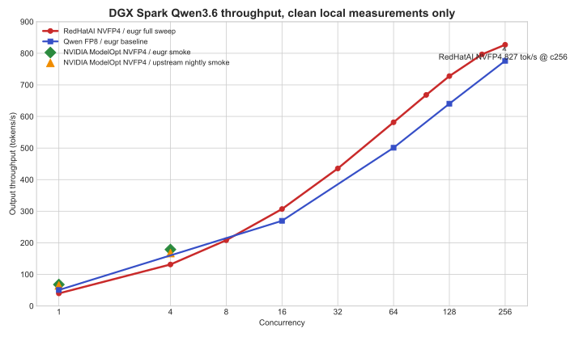

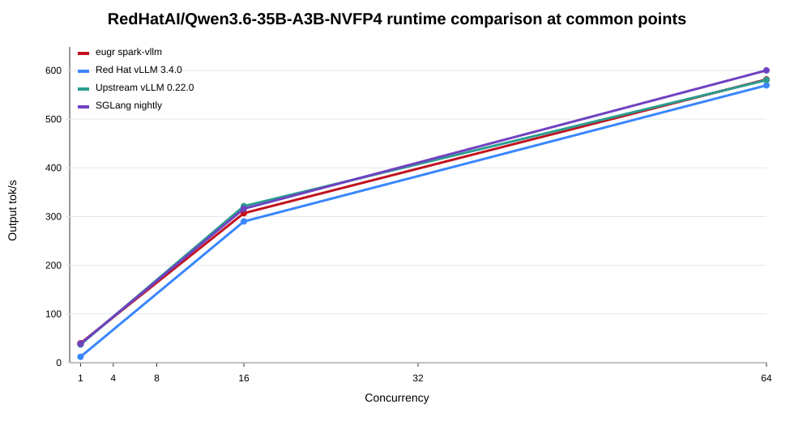

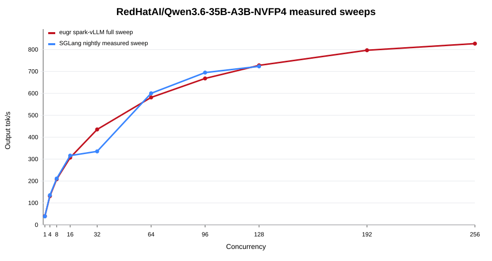

## 2. Test Matrix

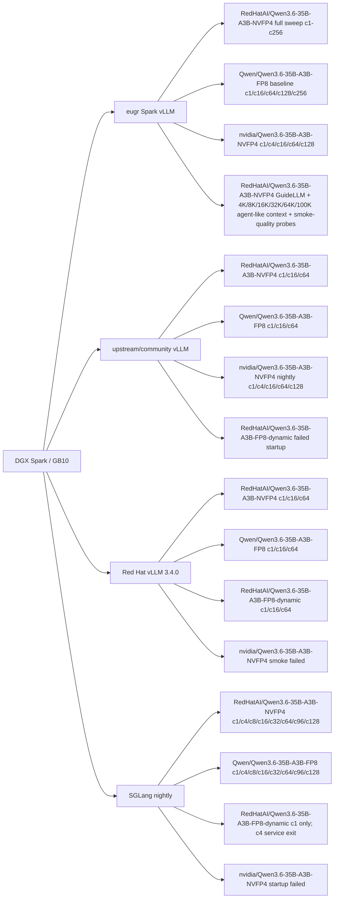

## 3. Why Two NVFP4 Paths Matter

| Model | Format / loading path | Current status | Direct impact |
|---|---|---|---|
| `RedHatAI/Qwen3.6-35B-A3B-NVFP4` | compressed-tensors / `nvfp4-pack-quantized` | eugr, upstream, and Red Hat vLLM all run it | Suitable for full throughput sweeps, long-context tests, and smoke-quality probes |
| `nvidia/Qwen3.6-35B-A3B-NVFP4` | ModelOpt mixed quantization | upstream nightly and eugr run it; upstream latest and Red Hat 3.4 do not currently run it | Requires a separate runtime lane; do not apply the RedHatAI recipe |

SGLang adds a third dimension. The compressed-tensors format in `RedHatAI/Qwen3.6-35B-A3B-NVFP4` can be auto-detected and served by SGLang nightly. The ModelOpt/w4afp8 path in `nvidia/Qwen3.6-35B-A3B-NVFP4` can be recognized structurally by the same SGLang nightly image, but it fails during weight block-shape validation. For now, SGLang is a viable optional runtime for `RedHatAI/Qwen3.6-35B-A3B-NVFP4`, not a replacement runtime for `nvidia/Qwen3.6-35B-A3B-NVFP4`.

The NVIDIA ModelOpt checkpoint also quantizes the output head:

```text
lm_head.input_scale torch.float32 ()
lm_head.weight torch.uint8 (248320, 1024)
lm_head.weight_scale torch.float8_e4m3fn (248320, 128)
lm_head.weight_scale_2 torch.float32 ()
```

This explains why `vllm/vllm-openai:latest` 0.22.0 fails: its model class accepts `lm_head.weight` but not this set of ModelOpt output-head scale tensors. `--ignore-patterns` cannot fix this, because the issue is not file filtering during download; it is a mismatch between checkpoint tensor keys and model-loader support.

## 4. Performance Overview

### 4.1 `RedHatAI/Qwen3.6-35B-A3B-NVFP4` On eugr Spark vLLM

This full sweep uses eugr `spark-vllm-nvfp4:latest`. The benchmark tool is `vllm bench serve`; the workload is random `128 input tokens / 128 output tokens`; and the service uses `max_model_len=32768`. Therefore this table answers the short-context capacity question, not the agent long-session question.

| Concurrency | output tok/s | peak output tok/s | TTFT p50 | TPOT p50 | Interpretation |
|---:|---:|---:|---:|---:|---|
| 1 | 39.85 | 43 | 90 ms | 23.7 ms | Single-user baseline |
| 8 | 208.21 | 250 | 266 ms | 36.4 ms | Light concurrency, still relatively interactive |
| 16 | 306.93 | 400 | 377 ms | 49.0 ms | One of the balanced points |
| 32 | 435.28 | 608 | 724 ms | 68.1 ms | Already throughput-oriented |
| 64 | 581.52 | 896 | 1534 ms | 97.5 ms | Better suited to batch/background work |
| 128 | 727.74 | 1024 | 2897 ms | 153.5 ms | High throughput, not pleasant for human waiting |
| 256 | 827.01 | 1280 | 4595 ms | 272.8 ms | Peak capacity point |

The same model under SGLang nightly is shown below. The SGLang workload is also `vllm bench serve` style, with `128 input tokens / 128 output tokens`. The image is `lmsysorg/sglang:nightly-dev-cu13-20260530-95cd2fd2`, using `--context-length 65536` and `--max-running-requests 128`. At c64 it is in the same range as eugr/upstream/Red Hat vLLM, but c32 has a significant TTFT p99 tail. c96/c128 continue to increase throughput, while TPOT has already moved into a background-throughput range.


| Concurrency | SGLang output tok/s | peak output tok/s | TTFT p50 | TTFT p99 | TPOT p50 |
|---:|---:|---:|---:|---:|---:|
| 1 | 38.70 | 41 | 135 ms | 190 ms | 24.94 ms |
| 4 | 135.26 | 152 | 286 ms | 325 ms | 27.98 ms |
| 8 | 211.46 | 280 | 391 ms | 602 ms | 34.91 ms |
| 16 | 316.10 | 448 | 606 ms | 936 ms | 45.80 ms |
| 32 | 335.25 | 1798 | 1003 ms | 13892 ms | 64.52 ms |
| 64 | 600.18 | 1216 | 1698 ms | 2030 ms | 93.37 ms |
| 96 | 694.80 | 1057 | 2135 ms | 2576 ms | 122.12 ms |
| 128 | 723.33 | 1143 | 2379 ms | 3522 ms | 152.13 ms |

On Spark, maximum throughput and best interactive experience are not the same point:

- Low-latency interaction: c1-c8.
- Balanced assistant use: c16, with c32 only cautiously.
- Background/batch throughput: c64-c256.

### 4.2 `RedHatAI/Qwen3.6-35B-A3B-NVFP4` vs `Qwen/Qwen3.6-35B-A3B-FP8`

The first table in this section also uses eugr `spark-vllm-nvfp4:latest` and `vllm bench serve`, with a random `128 input tokens / 128 output tokens` workload. It compares NVFP4 and FP8 short-context throughput density under the same runtime.

| Concurrency | `RedHatAI/Qwen3.6-35B-A3B-NVFP4` tok/s | `Qwen/Qwen3.6-35B-A3B-FP8` tok/s | `RedHatAI/Qwen3.6-35B-A3B-NVFP4` delta | `RedHatAI/Qwen3.6-35B-A3B-NVFP4` TTFT | `Qwen/Qwen3.6-35B-A3B-FP8` TTFT |
|---:|---:|---:|---:|---:|---:|
| 1 | 39.85 | 50.58 | -21.2% | 90 ms | 115 ms |
| 16 | 306.93 | 269.61 | +13.8% | 377 ms | 602 ms |
| 64 | 581.52 | 500.97 | +16.1% | 1534 ms | 1517 ms |
| 128 | 727.74 | 640.38 | +13.6% | 2897 ms | 2879 ms |
| 256 | 827.01 | 776.18 | +6.5% | 4595 ms | 3841 ms |

At single stream, `Qwen/Qwen3.6-35B-A3B-FP8` is faster. From c16 onward, `RedHatAI/Qwen3.6-35B-A3B-NVFP4` has better system throughput. The main value of `RedHatAI/Qwen3.6-35B-A3B-NVFP4` is not single-user speed; it is throughput density at medium and high concurrency.

SGLang nightly shows a similar pattern, although the absolute values differ. The table is now filled through c96/c128 so both SGLang curves are aligned at the same concurrency points:

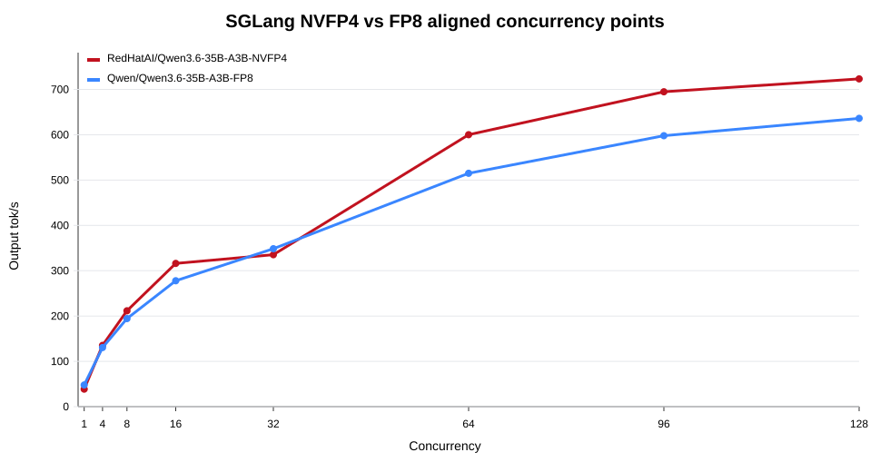

| Concurrency | `RedHatAI/Qwen3.6-35B-A3B-NVFP4` SGLang tok/s | `Qwen/Qwen3.6-35B-A3B-FP8` SGLang tok/s | Interpretation |
|---:|---:|---:|---|
| 1 | 38.70 | 47.80 | FP8 is faster at single stream |
| 4 | 135.26 | 130.49 | Very close |
| 8 | 211.46 | 194.28 | `RedHatAI/Qwen3.6-35B-A3B-NVFP4` starts to lead |
| 16 | 316.10 | 277.74 | NVFP4 has better medium-concurrency throughput |
| 32 | 335.25 | 348.62 | Close, but SGLang NVFP4 has a TTFT tail |
| 64 | 600.18 | 515.03 | NVFP4 leads at c64 |
| 96 | 694.80 | 597.90 | NVFP4 continues to lead; both are in background-throughput territory |
| 128 | 723.33 | 636.08 | NVFP4 still leads, but TPOT is no longer interactive |

### 4.3 `nvidia/Qwen3.6-35B-A3B-NVFP4` ModelOpt Sweep

`nvidia/Qwen3.6-35B-A3B-NVFP4` uses a ModelOpt checkpoint and requires `--quantization modelopt`. This version extends the earlier c1/c4 smoke tests to c16/c64/c128 under `--max-num-seqs 128`. The benchmark tool is still `vllm bench serve`; the workload is random `128 input tokens / 128 output tokens`; and the service configuration includes `--kv-cache-dtype fp8`, `--attention-backend flashinfer`, `--moe-backend marlin`, `--max-model-len 65536`, `--max-num-batched-tokens 8192`, and `--enable-prefix-caching`.

| Runtime | Case | Completed | Request/s | Output tok/s | Total tok/s | TTFT | TPOT |
|---|---:|---:|---:|---:|---:|---:|---:|
| upstream nightly | c1 | 8 | 0.507 | 64.90 | 135.05 | 312.47 ms | 13.07 ms |
| upstream nightly | c4 | 32 | 1.308 | 167.40 | 348.53 | 522.68 ms | 19.96 ms |
| upstream nightly | c16 | 64 | not captured | 368.75 | 767.38 | 786 ms p50 | 36.10 ms p50 |
| upstream nightly | c64 | 256 | not captured | 662.45 | 1378.96 | 1622 ms p50 | 83.74 ms p50 |
| upstream nightly | c128 | 512 | not captured | 771.79 | 1606.30 | 2869 ms p50 | 141.11 ms p50 |
| eugr Spark vLLM | c1 | 8 | 0.530 | 67.87 | 141.24 | 272.85 ms | 12.70 ms |
| eugr Spark vLLM | c4 | 32 | 1.396 | 178.65 | 371.96 | 303.85 ms | 19.94 ms |
| eugr Spark vLLM | c16 | 64 | not captured | 344.91 | 717.78 | 749 ms p50 | 37.79 ms p50 |
| eugr Spark vLLM | c64 | 256 | not captured | 669.20 | 1393.00 | 1392 ms p50 | 85.41 ms p50 |
| eugr Spark vLLM | c128 | 512 | not captured | 807.29 | 1680.19 | 2500 ms p50 | 139.04 ms p50 |

c1/c4 come from the mean-latency fields in the earlier smoke output. c16/c64/c128 come from the full benchmark summary and are marked as p50 in the table. Together they show that the ModelOpt checkpoint can be served and can reach high concurrency, but strict trend analysis should use a future complete sweep generated by the same script format.

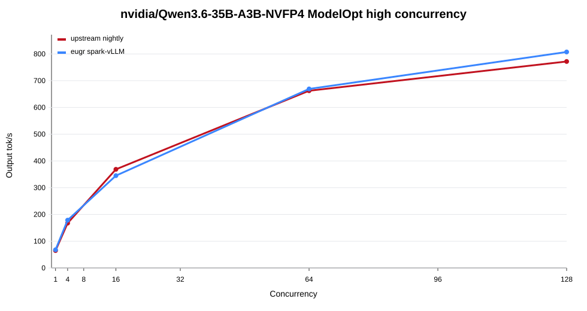

For `nvidia/Qwen3.6-35B-A3B-NVFP4`, SGLang nightly is in a “recognizes the model but cannot finish loading it” state. After auto-detecting a `w4afp8` checkpoint, it fails block-shape validation for a linear-attention projection: `Weight output_partition_size = 32 is not divisible by weight quantization block_n = 128`. Therefore SGLang is not included in the performance table for `nvidia/Qwen3.6-35B-A3B-NVFP4`.

## 5. Runtime Comparison

This runtime chart only uses the three common concurrency points c1/c16/c64, because those are the points where eugr, upstream, Red Hat vLLM, and SGLang currently have aligned data. The full sweeps are covered in section 4.1. Extending runtime lines to c128/c256 where no data was collected would be misleading.


| Runtime | Model | Representative concurrency | output tok/s | Conclusion |
|---|---|---:|---:|---|
| eugr Spark vLLM | `RedHatAI/Qwen3.6-35B-A3B-NVFP4` | c64 | 581.52 | Main performance baseline; c1-c256 available |
| upstream vLLM 0.22.0 | `RedHatAI/Qwen3.6-35B-A3B-NVFP4` | c64 | 580.14 | c64 is close to eugr |
| Red Hat vLLM 3.4.0 | `RedHatAI/Qwen3.6-35B-A3B-NVFP4` | c64 | 569.38 | c64 is close, but c1 is slower |
| SGLang nightly | `RedHatAI/Qwen3.6-35B-A3B-NVFP4` | c64 | 600.18 | Same general range at c64; c96/c128 continue to rise but latency is background-oriented |
| eugr Spark vLLM | `Qwen/Qwen3.6-35B-A3B-FP8` | c64 | 500.97 | Faster at single stream, lower than `RedHatAI/Qwen3.6-35B-A3B-NVFP4` at medium/high concurrency |
| SGLang nightly | `Qwen/Qwen3.6-35B-A3B-FP8` | c64 | 515.03 | Same general range at c64; not clearly better than vLLM |
| Red Hat vLLM 3.4.0 | `RedHatAI/Qwen3.6-35B-A3B-FP8-dynamic` | c64 | 486.42 | Continue only in the Red Hat lane for now |
| SGLang nightly | `RedHatAI/Qwen3.6-35B-A3B-FP8-dynamic` | c4 | failed | `--disable-cuda-graph` passes c1 smoke, but the service exits before c4 |
| eugr Spark vLLM | `nvidia/Qwen3.6-35B-A3B-NVFP4` | c128 | 807.29 | ModelOpt lane now runs high concurrency; c128 is slightly higher than upstream nightly |
| upstream nightly | `nvidia/Qwen3.6-35B-A3B-NVFP4` | c128 | 771.79 | ModelOpt lane now runs high concurrency; requires nightly-level loader support |
| SGLang nightly | `nvidia/Qwen3.6-35B-A3B-NVFP4` | startup | failed | w4afp8 block-shape validation failure |

Red Hat vLLM 3.4.0 remains important for the RedHatAI model line: it can stably run `RedHatAI/Qwen3.6-35B-A3B-NVFP4`, `RedHatAI/Qwen3.6-35B-A3B-FP8-dynamic`, and `Qwen/Qwen3.6-35B-A3B-FP8`. SGLang nightly adds a runtime lane that can run both `RedHatAI/Qwen3.6-35B-A3B-NVFP4` and `Qwen/Qwen3.6-35B-A3B-FP8`, but it is not stable for `RedHatAI/Qwen3.6-35B-A3B-FP8-dynamic` and does not yet run `nvidia/Qwen3.6-35B-A3B-NVFP4`.

## 6. Serving Recipes

### 6.1 `RedHatAI/Qwen3.6-35B-A3B-NVFP4`

Main verified configuration in eugr Spark vLLM:

```text
--max-model-len 32768
--max-num-batched-tokens 8192
--gpu-memory-utilization 0.70
--kv-cache-dtype fp8
--moe-backend cutlass
--load-format fastsafetensors
--attention-backend flashinfer
--enable-prefix-caching
```

### 6.2 `nvidia/Qwen3.6-35B-A3B-NVFP4`

Core parameters that worked for upstream nightly and eugr in this round:

```text
--quantization modelopt
--kv-cache-dtype fp8
--attention-backend flashinfer
--moe-backend marlin
--gpu-memory-utilization 0.85
--max-model-len 65536
--max-num-seqs 128
--max-num-batched-tokens 8192
--enable-chunked-prefill
--async-scheduling
--enable-prefix-caching
```

Parameter boundaries:

- `--quantization modelopt` is for the `nvidia/Qwen3.6-35B-A3B-NVFP4` checkpoint. It should not be applied to the `RedHatAI/Qwen3.6-35B-A3B-NVFP4` compressed-tensors checkpoint.
- `--moe-backend marlin` works for `nvidia/Qwen3.6-35B-A3B-NVFP4`, while `RedHatAI/Qwen3.6-35B-A3B-NVFP4` is better aligned with cutlass-related paths in the Red Hat vLLM lane.
- `VLLM_FP8_MOE_BACKEND=flashinfer_cutlass` is reported as an unknown vLLM environment variable in the 0.22.x logs from this round, so it should not be documented as a confirmed effective recipe parameter.
- `VLLM_USE_FLASHINFER_MOE_FP4=0` is already reported as deprecated in 0.22.1rc logs. Future recipes should prefer explicit `--moe-backend`.

The SGLang nightly configuration that served `RedHatAI/Qwen3.6-35B-A3B-NVFP4` in this round was:

```text
lmsysorg/sglang:nightly-dev-cu13-20260530-95cd2fd2
--model-path /models/huggingface/RedHatAI/Qwen3.6-35B-A3B-NVFP4
--served-model-name RedHatAI/Qwen3.6-35B-A3B-NVFP4
--tensor-parallel-size 1
--trust-remote-code
--dtype auto
--kv-cache-dtype fp8_e4m3
--attention-backend flashinfer
--moe-runner-backend flashinfer_cutlass
--mem-fraction-static 0.85
--max-running-requests 128
--context-length 65536
```

SGLang boundaries:

- Do not apply `--quantization modelopt_fp4` to `RedHatAI/Qwen3.6-35B-A3B-NVFP4`; the working path in this round is to let SGLang auto-detect compressed-tensors/NVFP4 from the checkpoint.
- `Qwen/Qwen3.6-35B-A3B-FP8` should also use auto quantization in SGLang. Explicit `--quantization modelopt_fp8 --moe-runner-backend flashinfer_cutlass` conflicts with the model config's `fp8` setting.
- `lmsysorg/sglang:spark` is not suitable for this Qwen3.6 round because its Transformers version does not recognize `qwen3_5_moe`; the SGLang numbers in this report come from the nightly image.

## 7. `RedHatAI/Qwen3.6-35B-A3B-FP8-dynamic` Is A Red Hat Runtime Lane

`RedHatAI/Qwen3.6-35B-A3B-FP8-dynamic` should not be treated as interchangeable with the regular `Qwen/Qwen3.6-35B-A3B-FP8`.

Observed differences:

- Under eugr Spark vLLM, two conservative startup attempts made the management plane unavailable and required power-cycle recovery.
- Under upstream vLLM 0.22.0, both FlashInfer and `TRITON_ATTN` failed during engine initialization and never reached benchmark.
- Under Red Hat vLLM 3.4.0, `TRITON_ATTN` can run c1/c16/c64.
- Under SGLang nightly, `--disable-cuda-graph` passes smoke and c1, but the service exits after c1, so c4 becomes 16/16 connection failures.

Current recommendation: continue testing `RedHatAI/Qwen3.6-35B-A3B-FP8-dynamic` only in the Red Hat vLLM lane. Do not risk eugr/upstream/SGLang stress tests for it at this point.

## 8. GuideLLM And Agent-Like Long Context

The GuideLLM 0.6.0 concurrent profile used eugr `spark-vllm-nvfp4:latest`, the `RedHatAI/Qwen3.6-35B-A3B-NVFP4` model, and an OpenAI-compatible HTTP endpoint. The GuideLLM workload is synthetic text at roughly `128 prompt tokens / 128 output tokens`. The vLLM benchmark comparison uses the same runtime and model, but the prompts are random `128 input tokens / 128 output tokens` generated by `vllm bench serve`. Therefore this is not a request-by-request same-prompt comparison; it validates the throughput range for the same short-context concurrency band.

| Concurrency | GuideLLM output tok/s | vLLM bench output tok/s | GuideLLM TTFT p50 | vLLM TTFT p50 |
|---:|---:|---:|---:|---:|
| 1 | 41.9 | 39.85 | 86 ms | 90 ms |
| 4 | 135.8 | 131.34 | 194 ms | 139 ms |
| 8 | 220.5 | 208.21 | 312 ms | 266 ms |
| 16 | 277.5 | 306.93 | 504 ms | 377 ms |
| 32 | 394.8 | 435.28 | 900 ms | 724 ms |

Long-context testing should be read in two layers. 4K/8K is a medium-context agent-like prompt and already shows that prefill pressure changes throughput and TTFT significantly. It still does not represent true 64K/100K long sessions. The 16K/32K/64K/100K tests use the same model with the service raised to `--max-model-len 131072`, and the model config was confirmed to have `text_config.max_position_embeddings=262144`. The prompts include state recall, tool-call JSON, policy constraints, and benchmark accounting; each request records throughput/latency and checks task success.

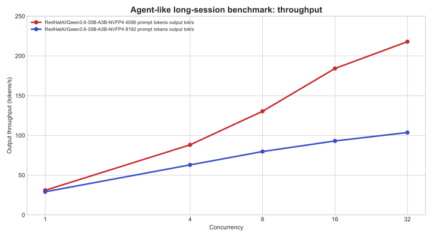

| Model | Prompt tokens | Concurrency | Requests | Success | output tok/s | TTFT p50 | TTFT p95 | Latency p50 | Latency p95 |
|---|---:|---:|---:|---:|---:|---:|---:|---:|---:|
| `RedHatAI/Qwen3.6-35B-A3B-NVFP4` | 4096 | 1 | 4 | 4/4 | 30.93 | 161 ms | 784 ms | 1304 ms | 1639 ms |
| `RedHatAI/Qwen3.6-35B-A3B-NVFP4` | 4096 | 4 | 8 | 8/8 | 88.12 | 251 ms | 456 ms | 1568 ms | 2597 ms |
| `RedHatAI/Qwen3.6-35B-A3B-NVFP4` | 4096 | 8 | 16 | 16/16 | 130.34 | 386 ms | 756 ms | 2262 ms | 3393 ms |
| `RedHatAI/Qwen3.6-35B-A3B-NVFP4` | 4096 | 16 | 32 | 32/32 | 184.19 | 547 ms | 1417 ms | 3274 ms | 5335 ms |
| `RedHatAI/Qwen3.6-35B-A3B-NVFP4` | 4096 | 32 | 64 | 64/64 | 217.90 | 964 ms | 2760 ms | 5619 ms | 9295 ms |
| `RedHatAI/Qwen3.6-35B-A3B-NVFP4` | 8192 | 1 | 4 | 4/4 | 29.07 | 439 ms | 779 ms | 1591 ms | 1968 ms |
| `RedHatAI/Qwen3.6-35B-A3B-NVFP4` | 8192 | 4 | 8 | 8/8 | 62.90 | 766 ms | 1295 ms | 2628 ms | 4018 ms |
| `RedHatAI/Qwen3.6-35B-A3B-NVFP4` | 8192 | 8 | 16 | 16/16 | 79.68 | 1062 ms | 2500 ms | 3977 ms | 7009 ms |
| `RedHatAI/Qwen3.6-35B-A3B-NVFP4` | 8192 | 16 | 32 | 32/32 | 93.01 | 1369 ms | 4783 ms | 6625 ms | 11566 ms |
| `RedHatAI/Qwen3.6-35B-A3B-NVFP4` | 8192 | 32 | 64 | 64/64 | 103.62 | 2281 ms | 9573 ms | 12502 ms | 22225 ms |

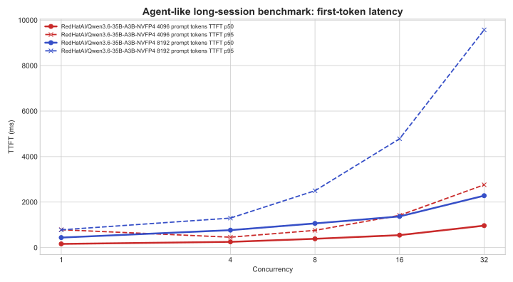

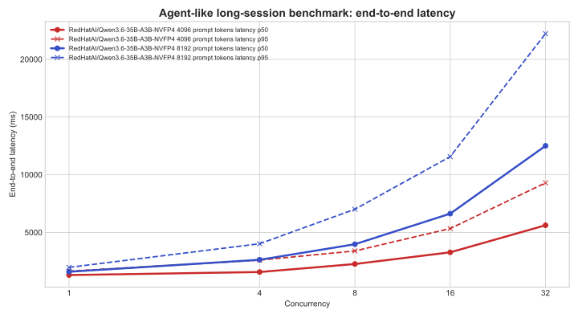

The 100K-level results are below. c8/c16/c32 were not tested here, because the main issue for a 100K prompt is no longer the short-context throughput curve; it is single-request prefill time, KV-cache pressure, and concurrency queueing under ultra-long context. c4 completion does not make it a good interactive default.

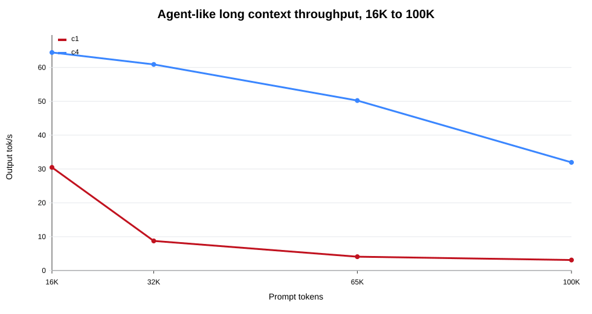

| Model | Prompt tokens | Concurrency | Requests | Success | output tok/s | TTFT p50 | TTFT p95 | Latency p50 | Latency p95 |
|---|---:|---:|---:|---:|---:|---:|---:|---:|---:|
| `RedHatAI/Qwen3.6-35B-A3B-NVFP4` | 16384 | 1 | 4 | 4/4 | 30.47 | 495 ms | 531 ms | 1602 ms | 2167 ms |
| `RedHatAI/Qwen3.6-35B-A3B-NVFP4` | 16384 | 4 | 8 | 8/8 | 64.43 | 753 ms | 1384 ms | 3090 ms | 4413 ms |
| `RedHatAI/Qwen3.6-35B-A3B-NVFP4` | 32768 | 1 | 4 | 4/4 | 8.75 | 4467 ms | 4501 ms | 5618 ms | 6104 ms |
| `RedHatAI/Qwen3.6-35B-A3B-NVFP4` | 32768 | 4 | 8 | 8/8 | 60.90 | 701 ms | 1519 ms | 3281 ms | 4703 ms |
| `RedHatAI/Qwen3.6-35B-A3B-NVFP4` | 65536 | 1 | 4 | 4/4 | 4.08 | 10944 ms | 11034 ms | 12180 ms | 12630 ms |
| `RedHatAI/Qwen3.6-35B-A3B-NVFP4` | 65536 | 4 | 8 | 8/8 | 50.23 | 1197 ms | 2145 ms | 3800 ms | 5246 ms |
| `RedHatAI/Qwen3.6-35B-A3B-NVFP4` | 100000 | 1 | 4 | 4/4 | 3.10 | 15031 ms | 15238 ms | 16616 ms | 16725 ms |
| `RedHatAI/Qwen3.6-35B-A3B-NVFP4` | 100000 | 4 | 8 | 8/8 | 31.95 | 1925 ms | 4063 ms | 6262 ms | 8495 ms |

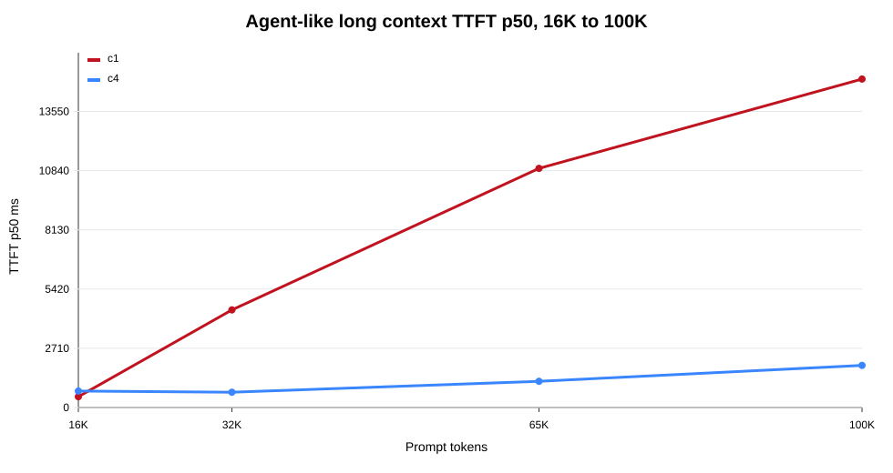

`RedHatAI/Qwen3.6-35B-A3B-NVFP4` maintained a 100% success rate across the 4K/8K/16K/32K/64K/100K agent-like tests. The bottleneck is not task correctness; it is prefill time, queueing, and end-to-end latency as context grows. c4 has lower TTFT p50 than c1 at 32K/64K/100K, mainly because the same service was tested continuously and benefited from cache, scheduling, and prefix-reuse effects. This should not be extrapolated into “higher concurrency is better for interaction.”

Agent long-session guidance should be stratified by context length:

- Around 4096 prompt tokens: c1-c8 is suitable for interactive or semi-interactive use; c16 can support queued multi-agent work; c32 is already background-oriented.
- Around 8192 prompt tokens: c1-c4 is the practical interactive range; c8 is barely semi-interactive; c16-c32 should be treated as background/batch agent work.
- Around 16384 prompt tokens: c1/c4 are both usable, but c4 is closer to a multi-agent background queue.
- Around 32768 prompt tokens: single-request prefill is already heavy at c1; c4 should be treated as background/batch agent configuration.
- Around 65536-100000 prompt tokens: it can run, but should be positioned as long-running tasks, background summaries, offline review, or a small number of high-value requests, not as the default for ordinary interactive agents.
- Do not directly apply the short-context c64-c256 throughput conclusions for `RedHatAI/Qwen3.6-35B-A3B-NVFP4` to long-session agents.

## 9. What Tier-0 Deterministic Eval Means

The **Tier-0 deterministic eval** in this report is not a full accuracy evaluation and cannot provide a statistically significant benchmark conclusion. A more precise name is **Tier-0 smoke-quality probe**.

Its purpose is:

- To quickly check whether the model can still follow basic output format, short reasoning, Chinese constraints, JSON/list structures, long-session recall, and safety instructions outside performance stress tests.
- To use fixed prompts, fixed temperature, and deterministic check rules to reduce random pass/fail noise.
- To act as a smoke gate before larger evaluations: if Tier-0 fails, larger tests are less meaningful; if Tier-0 passes, it only means no obvious smoke-level degradation was observed.

Why only 12 cases:

- The priority of this round was to establish serviceability and throughput paths across multiple runtimes and checkpoints on Spark.
- These 12 cases are a minimal sample of high-risk categories, not a representative task distribution.
- They are useful for finding obvious format/reasoning/constraint failures, not for proving “no accuracy loss.”

Therefore, the conclusion from these 12 probes should be downgraded as follows:

> In a very small deterministic smoke-quality probe, `RedHatAI/Qwen3.6-35B-A3B-NVFP4` and `Qwen/Qwen3.6-35B-A3B-FP8` did not show clearly different failure patterns. This is not enough to prove that `RedHatAI/Qwen3.6-35B-A3B-NVFP4` has no accuracy loss in agent long sessions or complex reasoning tasks.

Current 12-case results:

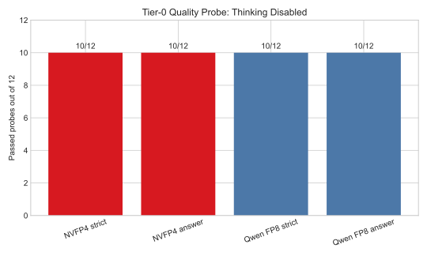

| Model | thinking | strict format | extracted answer | average latency |
|---|---|---:|---:|---:|
| `RedHatAI/Qwen3.6-35B-A3B-NVFP4` | disabled | 10/12 | 10/12 | 0.337 s |
| `Qwen/Qwen3.6-35B-A3B-FP8` | disabled | 10/12 | 10/12 | 0.232 s |

The two failures were identical:

- `math_en_fraction`: both models answered `13/12`; the correct answer is `19/12`.
- `instruction_no_forbidden`: both avoided the forbidden character, but did not satisfy the exact 8-Chinese-character constraint.

The next evaluation should expand to:

- 200-500 small internal cases: JSON/tool-call, Chinese constraints, code, math, refusal boundaries, and long-context recall.
- Agent long-session set: multi-turn state retention, tool-call argument stability, and final-answer quality after a long scratchpad.
- Public benchmarks as feasible: MMLU-Pro, GSM8K/Math, HumanEval/MBPP, BFCL, or equivalent tool-call sets.
- A/B dimensions: `RedHatAI/Qwen3.6-35B-A3B-NVFP4` vs `Qwen/Qwen3.6-35B-A3B-FP8` vs `nvidia/Qwen3.6-35B-A3B-NVFP4`; thinking on/off; short context vs 8K/16K long context.

## 10. Recommendations

If the goal is to deploy `RedHatAI/Qwen3.6-35B-A3B-NVFP4` quickly:

1. Choose eugr Spark vLLM, upstream vLLM, or SGLang nightly as the performance lane; keep Red Hat vLLM 3.4.0 as the Red Hat stack comparison lane.
2. Use chunked prefill, prefix caching, fastsafetensors, and fp8 KV cache by default.
3. Keep interactive concurrency around c8-c16, and use c32 cautiously.
4. Short-context background throughput can use c64-c256, but do not present that as interactive experience. Long-context agents need separate concurrency limits for 16K/32K/64K/100K.
5. For agent/tool-call workloads, default to `chat_template_kwargs.enable_thinking=false`; use a separate thinking strategy for complex reasoning.
6. SGLang nightly has competitive c64/c128 throughput for `RedHatAI/Qwen3.6-35B-A3B-NVFP4`, but the c32 TTFT p99 tail needs retesting. It should not be used directly as the default interactive runtime.
7. Continue testing `RedHatAI/Qwen3.6-35B-A3B-FP8-dynamic` only with Red Hat vLLM 3.4.0.

If the goal is to test `nvidia/Qwen3.6-35B-A3B-NVFP4`:

1. Prefer upstream `vllm/vllm-openai:nightly` or eugr `spark-vllm-nvfp4:latest`.
2. Use `--quantization modelopt`; do not apply the RedHatAI compressed-tensors recipe.
3. Keep `--attention-backend flashinfer` and `--moe-backend marlin` as the current working baseline.
4. c16/c64/c128 have already been run with `--max-num-seqs 128`; next work should add longer prompts, more request repeats, and a NIM or NVIDIA validated runtime comparison.
5. Treat NIM or an NVIDIA validated runtime as a vendor-supported comparison lane, not as a prerequisite for basic “can it run” testing.

## 11. Evidence Index

This report cites only local test artifacts and public model/runtime names.

- Clean report data: `data/report-metrics-summary-r6.csv`
- SGLang report data: `data/sglang-runtime-matrix-2026-06-01-r6.csv`
- `nvidia/Qwen3.6-35B-A3B-NVFP4` c16/c64/c128 data: `data/nvidia-nvfp4-high-concurrency-2026-06-01.csv`
- Agent-like 16K/32K/64K/100K data for `RedHatAI/Qwen3.6-35B-A3B-NVFP4`: `data/redhatai-nvfp4-agent-long-context-16k-100k-2026-06-01.csv`
- Clean throughput chart: `images/chart-throughput-curves-clean-r3.svg`
- `RedHatAI/Qwen3.6-35B-A3B-NVFP4` common-point runtime comparison: `images/chart-redhatai-nvfp4-runtime-common-r6.svg`
- `RedHatAI/Qwen3.6-35B-A3B-NVFP4` eugr and SGLang full-sweep chart: `images/chart-redhatai-nvfp4-eugr-vs-sglang-full-r6.svg`
- SGLang aligned throughput chart: `images/chart-sglang-nvfp4-vs-fp8-aligned-r6.svg`
- NVIDIA ModelOpt high-concurrency chart: `images/chart-nvidia-nvfp4-high-concurrency-r6.svg`
- Agent-like 16K/32K/64K/100K charts: `images/chart-agent-long-16k-100k-throughput-r6.svg`, `images/chart-agent-long-16k-100k-ttft-r6.svg`
- Tier-0 smoke-quality chart: `images/chart-quality-tier0.svg`
