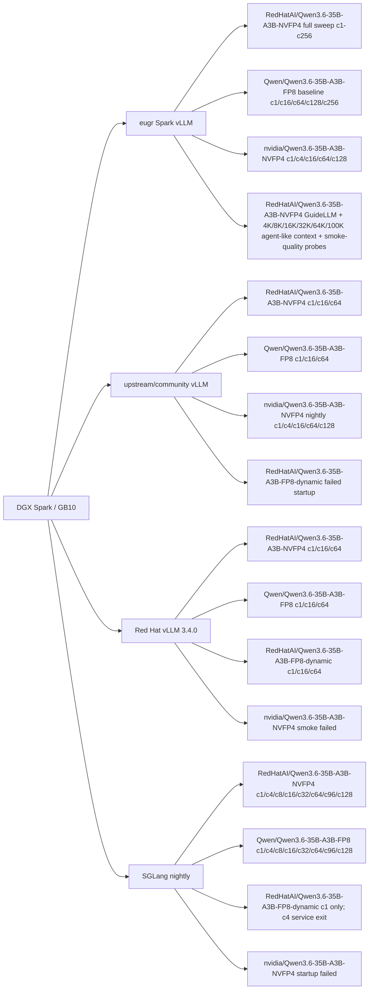

# DGX Spark 上 Qwen3.6-35B-A3B NVFP4 推理测试报告 v6

| 字段 | 值 |
|---|---|
| 测试日期 | 2026-06-01 |
| 测试平台 | NVIDIA DGX Spark, GB10, Ubuntu, aarch64 |
| 核心问题 | Spark 上两条 NVFP4 路线的性能、兼容性和质量风险 |
| NVFP4 路线 A | `RedHatAI/Qwen3.6-35B-A3B-NVFP4`, compressed-tensors |
| NVFP4 路线 B | `nvidia/Qwen3.6-35B-A3B-NVFP4`, ModelOpt |
| 对照模型 | `Qwen/Qwen3.6-35B-A3B-FP8`, `RedHatAI/Qwen3.6-35B-A3B-FP8-dynamic` |
| Runtime | eugr Spark vLLM, upstream/community vLLM, Red Hat AI Inference Server vLLM, SGLang nightly |
| 工具 | `vllm bench serve`, GuideLLM 0.6.0, deterministic smoke-quality probes |
| 图表与数据 | `solution/files/solution-2026-06-01-17-45/`, `solution/files/solution-2026-06-01-19-35/`, `solution/files/solution-2026-06-01-21-56/`, `solution/files/solution-2026-06-01-22-19/` |

## 1. Executive Summary

这台 Spark 上目前有两条需要分开管理的 NVFP4 路线：

- **`RedHatAI/Qwen3.6-35B-A3B-NVFP4` compressed-tensors checkpoint**：这是目前性能测试最完整的主线。eugr Spark vLLM 下短上下文 128/128 sweep 在 c64 达到 `581.52 output tok/s`，c256 达到 `827.01 output tok/s`。在同机同工具下，它从 c16 开始比 `Qwen/Qwen3.6-35B-A3B-FP8` 有更好的吞吐密度。
- **`nvidia/Qwen3.6-35B-A3B-NVFP4` ModelOpt checkpoint**：这是新出现的 checkpoint 格式。它不是必须依赖 NIM 或 TensorRT-LLM 才能推理；`vllm/vllm-openai:nightly` 和 `spark-vllm-nvfp4:latest` 已经能跑通 c16/c64/c128。eugr Spark vLLM 在 c128 达到 `807.29 output tok/s`，upstream nightly 在 c128 达到 `771.79 output tok/s`。但它需要更新的 ModelOpt loader/backend。`vllm/vllm-openai:latest` 0.22.0 和 Red Hat vLLM 3.4.0 当前没有跑通这个 ModelOpt checkpoint。
- **SGLang lane**：官方 `lmsysorg/sglang:spark` 镜像还不能识别 `qwen3_5_moe`，因此本轮使用更新的 `lmsysorg/sglang:nightly-dev-cu13-20260530-95cd2fd2`。SGLang nightly 可以跑通 `RedHatAI/Qwen3.6-35B-A3B-NVFP4`，c64 达到 `600.18 output tok/s`，c128 达到 `723.33 output tok/s`；也可以跑通 `Qwen/Qwen3.6-35B-A3B-FP8` 到 c128，c128 达到 `636.08 output tok/s`。`nvidia/Qwen3.6-35B-A3B-NVFP4` 在 SGLang nightly 中仍失败，`RedHatAI/Qwen3.6-35B-A3B-FP8-dynamic` 只能 c1 smoke，c4 前服务退出。
- **Agent 长会话**：4K/8K 只代表中等长度上下文，不足以代表 agent 的长会话。本版增加 `RedHatAI/Qwen3.6-35B-A3B-NVFP4` 在 `--max-model-len 131072` 服务配置下的 16K/32K/64K/100K agent-like prompt 测试。100K prompt 在 c1/c4 都可完成，但 TTFT 与端到端延迟已经明显进入长等待区间。

这两个 NVFP4 模型不能用同一套 recipe 粗暴处理。`RedHatAI/Qwen3.6-35B-A3B-NVFP4` 的关键是 compressed-tensors + cutlass/attention backend 调优；`nvidia/Qwen3.6-35B-A3B-NVFP4` 的关键是 `--quantization modelopt`、较新的 vLLM 0.22.1rc 级 loader，以及 ModelOpt 对 `lm_head` 量化参数的支持。SGLang 的加入进一步说明：同一个模型文件格式在不同 runtime 中的支持边界非常具体，不能只看“支持 NVFP4/FP8”这个大标签。


## 2. 测试矩阵



## 3. Why Two NVFP4 Paths Matter

| 模型 | 格式/加载路径 | 当前状态 | 直接影响 |
|---|---|---|---|
| `RedHatAI/Qwen3.6-35B-A3B-NVFP4` | compressed-tensors / `nvfp4-pack-quantized` | eugr、upstream、Red Hat vLLM 都能跑通 | 可以做完整吞吐、长上下文和质量 smoke |
| `nvidia/Qwen3.6-35B-A3B-NVFP4` | ModelOpt mixed quantization | upstream nightly 和 eugr 可跑通；upstream latest 与 Red Hat 3.4 当前未跑通 | 需要单独 runtime lane，不能套 RedHatAI recipe |

SGLang 的结果补充了第三个维度：`RedHatAI/Qwen3.6-35B-A3B-NVFP4` 的 compressed-tensors 格式在 SGLang nightly 中可以自动识别并服务；`nvidia/Qwen3.6-35B-A3B-NVFP4` 的 ModelOpt/w4afp8 路线在同一个 SGLang nightly 中能识别模型结构，但在 weight block shape 校验阶段失败。因此，SGLang 目前更像 `RedHatAI/Qwen3.6-35B-A3B-NVFP4` 的可选 runtime，而不是 `nvidia/Qwen3.6-35B-A3B-NVFP4` 的替代 runtime。

NVIDIA ModelOpt checkpoint 的 output head 也是量化的：

```text
lm_head.input_scale torch.float32 ()
lm_head.weight torch.uint8 (248320, 1024)
lm_head.weight_scale torch.float8_e4m3fn (248320, 128)
lm_head.weight_scale_2 torch.float32 ()
```

这解释了 `vllm/vllm-openai:latest` 0.22.0 的失败原因：它的模型类只接受 `lm_head.weight`，不接受这组 ModelOpt output-head scale tensor。`--ignore-patterns` 不能解决这个问题，因为这不是下载文件过滤问题，而是 checkpoint tensor key 与 model loader 支持不匹配。

## 4. Performance Overview

### 4.1 `RedHatAI/Qwen3.6-35B-A3B-NVFP4` On eugr Spark vLLM

本节的 full sweep 使用 eugr `spark-vllm-nvfp4:latest`，测试工具是 `vllm bench serve`，workload 是随机 `128 input tokens / 128 output tokens`，服务配置 `max_model_len=32768`。所以这张表回答的是短上下文容量问题，不是 agent 长会话问题。

| 并发 | output tok/s | peak output tok/s | TTFT p50 | TPOT p50 | 适用解释 |
|---:|---:|---:|---:|---:|---|
| 1 | 39.85 | 43 | 90 ms | 23.7 ms | 单用户基线 |
| 8 | 208.21 | 250 | 266 ms | 36.4 ms | 轻并发仍偏交互 |
| 16 | 306.93 | 400 | 377 ms | 49.0 ms | 平衡点之一 |
| 32 | 435.28 | 608 | 724 ms | 68.1 ms | 已偏吞吐 |
| 64 | 581.52 | 896 | 1534 ms | 97.5 ms | 批处理/后台更合理 |
| 128 | 727.74 | 1024 | 2897 ms | 153.5 ms | 高吞吐，不适合人等 |
| 256 | 827.01 | 1280 | 4595 ms | 272.8 ms | 峰值容量点 |

同一模型在 SGLang nightly 中的短上下文曲线如下。SGLang workload 同样是 `vllm bench serve` 风格的 `128 input tokens / 128 output tokens`，镜像为 `lmsysorg/sglang:nightly-dev-cu13-20260530-95cd2fd2`，服务配置 `--context-length 65536`、`--max-running-requests 128`。它在 c64 与 eugr/upstream/Red Hat vLLM 同量级，但 c32 的 TTFT p99 有明显长尾，c96/c128 虽然继续涨吞吐，TPOT 已经进入后台吞吐区间。


| 并发 | SGLang output tok/s | peak output tok/s | TTFT p50 | TTFT p99 | TPOT p50 |
|---:|---:|---:|---:|---:|---:|
| 1 | 38.70 | 41 | 135 ms | 190 ms | 24.94 ms |
| 4 | 135.26 | 152 | 286 ms | 325 ms | 27.98 ms |
| 8 | 211.46 | 280 | 391 ms | 602 ms | 34.91 ms |
| 16 | 316.10 | 448 | 606 ms | 936 ms | 45.80 ms |
| 32 | 335.25 | 1798 | 1003 ms | 13892 ms | 64.52 ms |
| 64 | 600.18 | 1216 | 1698 ms | 2030 ms | 93.37 ms |
| 96 | 694.80 | 1057 | 2135 ms | 2576 ms | 122.12 ms |
| 128 | 723.33 | 1143 | 2379 ms | 3522 ms | 152.13 ms |

Spark 的最高吞吐和最好交互体验不是同一个点：

- 低延迟交互：c1-c8。
- 平衡对话助手：c16，最多谨慎到 c32。
- 后台/批处理：c64-c256。

### 4.2 `RedHatAI/Qwen3.6-35B-A3B-NVFP4` vs `Qwen/Qwen3.6-35B-A3B-FP8`

本节第一张表同样使用 eugr `spark-vllm-nvfp4:latest` 和 `vllm bench serve`，workload 是随机 `128 input tokens / 128 output tokens`。这里比较的是同一 runtime 下 NVFP4 与 FP8 的短上下文吞吐密度。

| 并发 | `RedHatAI/Qwen3.6-35B-A3B-NVFP4` tok/s | `Qwen/Qwen3.6-35B-A3B-FP8` tok/s | `RedHatAI/Qwen3.6-35B-A3B-NVFP4` 差异 | `RedHatAI/Qwen3.6-35B-A3B-NVFP4` TTFT | `Qwen/Qwen3.6-35B-A3B-FP8` TTFT |
|---:|---:|---:|---:|---:|---:|
| 1 | 39.85 | 50.58 | -21.2% | 90 ms | 115 ms |
| 16 | 306.93 | 269.61 | +13.8% | 377 ms | 602 ms |
| 64 | 581.52 | 500.97 | +16.1% | 1534 ms | 1517 ms |
| 128 | 727.74 | 640.38 | +13.6% | 2897 ms | 2879 ms |
| 256 | 827.01 | 776.18 | +6.5% | 4595 ms | 3841 ms |

单流时 `Qwen/Qwen3.6-35B-A3B-FP8` 更快；从 c16 开始，`RedHatAI/Qwen3.6-35B-A3B-NVFP4` 的系统吞吐更好。`RedHatAI/Qwen3.6-35B-A3B-NVFP4` 的主要价值不是单用户速度，而是中高并发吞吐密度。

SGLang nightly 下也呈现类似趋势，但绝对值略不同。这里已经补齐到 c96/c128，使两条 SGLang 曲线在相同并发点上对齐：


| 并发 | `RedHatAI/Qwen3.6-35B-A3B-NVFP4` SGLang tok/s | `Qwen/Qwen3.6-35B-A3B-FP8` SGLang tok/s | 解释 |
|---:|---:|---:|---|
| 1 | 38.70 | 47.80 | FP8 单流更快 |
| 4 | 135.26 | 130.49 | 两者接近 |
| 8 | 211.46 | 194.28 | `RedHatAI/Qwen3.6-35B-A3B-NVFP4` 开始领先 |
| 16 | 316.10 | 277.74 | NVFP4 中并发吞吐更好 |
| 32 | 335.25 | 348.62 | 两者接近，但 SGLang NVFP4 有 TTFT 长尾 |
| 64 | 600.18 | 515.03 | NVFP4 在 c64 领先 |
| 96 | 694.80 | 597.90 | NVFP4 继续领先，二者都进入后台吞吐区间 |
| 128 | 723.33 | 636.08 | NVFP4 仍领先，但 TPOT 已不适合交互 |

### 4.3 `nvidia/Qwen3.6-35B-A3B-NVFP4` ModelOpt Sweep

`nvidia/Qwen3.6-35B-A3B-NVFP4` 使用 ModelOpt checkpoint，需要 `--quantization modelopt`。本版已经把早先 c1/c4 smoke 扩展到 `--max-num-seqs 128` 下的 c16/c64/c128。测试工具仍是 `vllm bench serve`，workload 是随机 `128 input tokens / 128 output tokens`，服务配置包括 `--kv-cache-dtype fp8`、`--attention-backend flashinfer`、`--moe-backend marlin`、`--max-model-len 65536`、`--max-num-batched-tokens 8192`、`--enable-prefix-caching`。

| Runtime | Case | Completed | Request/s | Output tok/s | Total tok/s | TTFT | TPOT |
|---|---:|---:|---:|---:|---:|---:|---:|
| upstream nightly | c1 | 8 | 0.507 | 64.90 | 135.05 | 312.47 ms | 13.07 ms |
| upstream nightly | c4 | 32 | 1.308 | 167.40 | 348.53 | 522.68 ms | 19.96 ms |
| upstream nightly | c16 | 64 | not captured | 368.75 | 767.38 | 786 ms p50 | 36.10 ms p50 |
| upstream nightly | c64 | 256 | not captured | 662.45 | 1378.96 | 1622 ms p50 | 83.74 ms p50 |
| upstream nightly | c128 | 512 | not captured | 771.79 | 1606.30 | 2869 ms p50 | 141.11 ms p50 |
| eugr Spark vLLM | c1 | 8 | 0.530 | 67.87 | 141.24 | 272.85 ms | 12.70 ms |
| eugr Spark vLLM | c4 | 32 | 1.396 | 178.65 | 371.96 | 303.85 ms | 19.94 ms |
| eugr Spark vLLM | c16 | 64 | not captured | 344.91 | 717.78 | 749 ms p50 | 37.79 ms p50 |
| eugr Spark vLLM | c64 | 256 | not captured | 669.20 | 1393.00 | 1392 ms p50 | 85.41 ms p50 |
| eugr Spark vLLM | c128 | 512 | not captured | 807.29 | 1680.19 | 2500 ms p50 | 139.04 ms p50 |

c1/c4 是早先 smoke 输出中的 mean latency 字段；c16/c64/c128 来自 full benchmark summary，表中标注为 p50。它们共同证明 ModelOpt checkpoint 已可服务并进入高并发区间，但做严格趋势分析应以后续同一脚本格式的完整 sweep 为准。


SGLang nightly 对 `nvidia/Qwen3.6-35B-A3B-NVFP4` 的状态是“能识别模型，不能加载完成”。自动量化路径检测到 `w4afp8` checkpoint 后，在 linear-attention projection 的 block shape 校验中失败：`Weight output_partition_size = 32 is not divisible by weight quantization block_n = 128`。因此本轮 SGLang 不进入 `nvidia/Qwen3.6-35B-A3B-NVFP4` 的性能表。

## 5. Runtime Comparison

这张 runtime 图只画 c1/c16/c64 三个共同并发点，因为 eugr、upstream、Red Hat vLLM 和 SGLang 目前只有这些点能做严格同点比较。完整 sweep 另见 4.1；把未测到 c128/c256 的 runtime 线硬拉长会误导读者。


| Runtime | 模型 | 代表并发 | output tok/s | 结论 |
|---|---|---:|---:|---|
| eugr Spark vLLM | `RedHatAI/Qwen3.6-35B-A3B-NVFP4` | c64 | 581.52 | 主性能基线，已有 c1-c256 |
| upstream vLLM 0.22.0 | `RedHatAI/Qwen3.6-35B-A3B-NVFP4` | c64 | 580.14 | c64 接近 eugr |
| Red Hat vLLM 3.4.0 | `RedHatAI/Qwen3.6-35B-A3B-NVFP4` | c64 | 569.38 | c64 接近，但 c1 慢 |
| SGLang nightly | `RedHatAI/Qwen3.6-35B-A3B-NVFP4` | c64 | 600.18 | c64 同量级；c96/c128 继续涨但延迟进入后台区间 |
| eugr Spark vLLM | `Qwen/Qwen3.6-35B-A3B-FP8` | c64 | 500.97 | 单流快，中高并发低于 `RedHatAI/Qwen3.6-35B-A3B-NVFP4` |
| SGLang nightly | `Qwen/Qwen3.6-35B-A3B-FP8` | c64 | 515.03 | c64 同量级；不明显优于 vLLM |
| Red Hat vLLM 3.4.0 | `RedHatAI/Qwen3.6-35B-A3B-FP8-dynamic` | c64 | 486.42 | 当前只建议在 Red Hat lane 继续 |
| SGLang nightly | `RedHatAI/Qwen3.6-35B-A3B-FP8-dynamic` | c4 | failed | `--disable-cuda-graph` 可 c1 smoke，但 c4 前服务退出 |
| eugr Spark vLLM | `nvidia/Qwen3.6-35B-A3B-NVFP4` | c128 | 807.29 | ModelOpt lane 已跑通高并发；c128 略高于 upstream nightly |
| upstream nightly | `nvidia/Qwen3.6-35B-A3B-NVFP4` | c128 | 771.79 | ModelOpt lane 已跑通高并发；需要 nightly 级 loader |
| SGLang nightly | `nvidia/Qwen3.6-35B-A3B-NVFP4` | startup | failed | w4afp8 block shape 校验失败 |

Red Hat vLLM 3.4.0 对 RedHatAI 模型线很重要：它能稳定跑 `RedHatAI/Qwen3.6-35B-A3B-NVFP4`、`RedHatAI/Qwen3.6-35B-A3B-FP8-dynamic` 和 `Qwen/Qwen3.6-35B-A3B-FP8`。SGLang nightly 则补上了一个对 `RedHatAI/Qwen3.6-35B-A3B-NVFP4` 与 `Qwen/Qwen3.6-35B-A3B-FP8` 都可跑的对照 runtime，但它对 `RedHatAI/Qwen3.6-35B-A3B-FP8-dynamic` 还不稳定，对 `nvidia/Qwen3.6-35B-A3B-NVFP4` 还未跑通。

## 6. Serving Recipes

### 6.1 `RedHatAI/Qwen3.6-35B-A3B-NVFP4`

eugr Spark vLLM 中已验证的主配置：

```text
--max-model-len 32768
--max-num-batched-tokens 8192
--gpu-memory-utilization 0.70
--kv-cache-dtype fp8
--moe-backend cutlass
--load-format fastsafetensors
--attention-backend flashinfer
--enable-prefix-caching
```

### 6.2 `nvidia/Qwen3.6-35B-A3B-NVFP4`

本轮能跑通 upstream nightly 和 eugr 的核心参数：

```text
--quantization modelopt
--kv-cache-dtype fp8
--attention-backend flashinfer
--moe-backend marlin
--gpu-memory-utilization 0.85
--max-model-len 65536
--max-num-seqs 128
--max-num-batched-tokens 8192
--enable-chunked-prefill
--async-scheduling
--enable-prefix-caching
```

参数边界：

- `--quantization modelopt` 是 `nvidia/Qwen3.6-35B-A3B-NVFP4` checkpoint 的路径，不适用于 `RedHatAI/Qwen3.6-35B-A3B-NVFP4` compressed-tensors checkpoint。
- `--moe-backend marlin` 对 `nvidia/Qwen3.6-35B-A3B-NVFP4` 有效，但 `RedHatAI/Qwen3.6-35B-A3B-NVFP4` 在 Red Hat vLLM lane 里更适合 cutlass 相关路径。
- `VLLM_FP8_MOE_BACKEND=flashinfer_cutlass` 在本轮 0.22.x 日志里被识别为 unknown vLLM environment variable，不应作为确认有效参数写入 recipe。
- `VLLM_USE_FLASHINFER_MOE_FP4=0` 已在 0.22.1rc 日志中提示 deprecation，后续应优先使用显式 `--moe-backend`。

SGLang nightly 中，本轮可服务的 `RedHatAI/Qwen3.6-35B-A3B-NVFP4` 配置是：

```text
lmsysorg/sglang:nightly-dev-cu13-20260530-95cd2fd2
--model-path /models/huggingface/RedHatAI/Qwen3.6-35B-A3B-NVFP4
--served-model-name RedHatAI/Qwen3.6-35B-A3B-NVFP4
--tensor-parallel-size 1
--trust-remote-code
--dtype auto
--kv-cache-dtype fp8_e4m3
--attention-backend flashinfer
--moe-runner-backend flashinfer_cutlass
--mem-fraction-static 0.85
--max-running-requests 128
--context-length 65536
```

SGLang 配置边界：

- 不要把 `--quantization modelopt_fp4` 套到 `RedHatAI/Qwen3.6-35B-A3B-NVFP4`；本轮可服务路径是让 SGLang 从 checkpoint 自动识别 compressed-tensors/NVFP4。
- `Qwen/Qwen3.6-35B-A3B-FP8` 在 SGLang 中也应走 auto 量化；显式 `--quantization modelopt_fp8 --moe-runner-backend flashinfer_cutlass` 会和模型 config 中的 `fp8` 冲突。
- `lmsysorg/sglang:spark` 不适合作为本轮 Qwen3.6 测试镜像，因为其 Transformers 不识别 `qwen3_5_moe`；报告中的 SGLang 数字来自 nightly 镜像。

## 7. `RedHatAI/Qwen3.6-35B-A3B-FP8-dynamic` Is A Red Hat Runtime Lane

`RedHatAI/Qwen3.6-35B-A3B-FP8-dynamic` 不应该和普通 `Qwen/Qwen3.6-35B-A3B-FP8` 混为一谈。

观测到的差别：

- 在 eugr Spark vLLM 下，两次保守启动都导致管理面不可用，需要断电恢复。
- 在 upstream vLLM 0.22.0 下，FlashInfer 和 `TRITON_ATTN` 都在 engine initialization 阶段失败，未进入 benchmark。
- 在 Red Hat vLLM 3.4.0 下，使用 `TRITON_ATTN` 可以跑通 c1/c16/c64。
- 在 SGLang nightly 下，`--disable-cuda-graph` 可以通过 smoke 和 c1，但 c1 结束后服务端退出，c4 变成 16/16 连接失败。

当前建议：`RedHatAI/Qwen3.6-35B-A3B-FP8-dynamic` 只在 Red Hat vLLM lane 继续，不再用 eugr/upstream/SGLang 冒险压测。

## 8. GuideLLM And Agent-Like Long Context

GuideLLM 0.6.0 的 concurrent profile 使用 eugr `spark-vllm-nvfp4:latest`，模型是 `RedHatAI/Qwen3.6-35B-A3B-NVFP4`，服务接口是 OpenAI-compatible HTTP endpoint。GuideLLM workload 是合成文本，约 `128 prompt tokens / 128 output tokens`；对照的 vLLM benchmark 使用同一 runtime 和同一模型，但 prompt 是 `vllm bench serve` 的随机 `128 input tokens / 128 output tokens`。因此二者不是逐请求同 prompt 对比，但能验证同一个短上下文并发区间的吞吐量级。

| 并发 | GuideLLM output tok/s | vLLM bench output tok/s | GuideLLM TTFT p50 | vLLM TTFT p50 |
|---:|---:|---:|---:|---:|
| 1 | 41.9 | 39.85 | 86 ms | 90 ms |
| 4 | 135.8 | 131.34 | 194 ms | 139 ms |
| 8 | 220.5 | 208.21 | 312 ms | 266 ms |
| 16 | 277.5 | 306.93 | 504 ms | 377 ms |
| 32 | 394.8 | 435.28 | 900 ms | 724 ms |

长上下文测试分两层看。4K/8K 是中等上下文 agent-like prompt，能说明 prefill 压力已经显著改变吞吐和 TTFT；但它仍不能代表真正的 64K/100K 长会话。后续 16K/32K/64K/100K 测试使用同一模型，服务配置提高到 `--max-model-len 131072`，并确认模型 config 的 `text_config.max_position_embeddings=262144`。prompt 包含状态回忆、工具调用 JSON、策略约束和 benchmark accounting；每个请求不仅记录 tok/s 和延迟，还检查任务是否成功。


| Model | Prompt tokens | 并发 | Requests | Success | output tok/s | TTFT p50 | TTFT p95 | Latency p50 | Latency p95 |
|---|---:|---:|---:|---:|---:|---:|---:|---:|---:|
| `RedHatAI/Qwen3.6-35B-A3B-NVFP4` | 4096 | 1 | 4 | 4/4 | 30.93 | 161 ms | 784 ms | 1304 ms | 1639 ms |
| `RedHatAI/Qwen3.6-35B-A3B-NVFP4` | 4096 | 4 | 8 | 8/8 | 88.12 | 251 ms | 456 ms | 1568 ms | 2597 ms |
| `RedHatAI/Qwen3.6-35B-A3B-NVFP4` | 4096 | 8 | 16 | 16/16 | 130.34 | 386 ms | 756 ms | 2262 ms | 3393 ms |
| `RedHatAI/Qwen3.6-35B-A3B-NVFP4` | 4096 | 16 | 32 | 32/32 | 184.19 | 547 ms | 1417 ms | 3274 ms | 5335 ms |
| `RedHatAI/Qwen3.6-35B-A3B-NVFP4` | 4096 | 32 | 64 | 64/64 | 217.90 | 964 ms | 2760 ms | 5619 ms | 9295 ms |
| `RedHatAI/Qwen3.6-35B-A3B-NVFP4` | 8192 | 1 | 4 | 4/4 | 29.07 | 439 ms | 779 ms | 1591 ms | 1968 ms |
| `RedHatAI/Qwen3.6-35B-A3B-NVFP4` | 8192 | 4 | 8 | 8/8 | 62.90 | 766 ms | 1295 ms | 2628 ms | 4018 ms |
| `RedHatAI/Qwen3.6-35B-A3B-NVFP4` | 8192 | 8 | 16 | 16/16 | 79.68 | 1062 ms | 2500 ms | 3977 ms | 7009 ms |
| `RedHatAI/Qwen3.6-35B-A3B-NVFP4` | 8192 | 16 | 32 | 32/32 | 93.01 | 1369 ms | 4783 ms | 6625 ms | 11566 ms |
| `RedHatAI/Qwen3.6-35B-A3B-NVFP4` | 8192 | 32 | 64 | 64/64 | 103.62 | 2281 ms | 9573 ms | 12502 ms | 22225 ms |


100K 级别的测试结果如下。这里没有测 c8/c16/c32，因为 100K prompt 的主要问题已经不是短上下文吞吐曲线，而是超长上下文下单请求 prefill 时间、KV cache 压力和并发排队。c4 能完成不等于适合作为交互默认值。


| Model | Prompt tokens | 并发 | Requests | Success | output tok/s | TTFT p50 | TTFT p95 | Latency p50 | Latency p95 |
|---|---:|---:|---:|---:|---:|---:|---:|---:|---:|
| `RedHatAI/Qwen3.6-35B-A3B-NVFP4` | 16384 | 1 | 4 | 4/4 | 30.47 | 495 ms | 531 ms | 1602 ms | 2167 ms |
| `RedHatAI/Qwen3.6-35B-A3B-NVFP4` | 16384 | 4 | 8 | 8/8 | 64.43 | 753 ms | 1384 ms | 3090 ms | 4413 ms |
| `RedHatAI/Qwen3.6-35B-A3B-NVFP4` | 32768 | 1 | 4 | 4/4 | 8.75 | 4467 ms | 4501 ms | 5618 ms | 6104 ms |
| `RedHatAI/Qwen3.6-35B-A3B-NVFP4` | 32768 | 4 | 8 | 8/8 | 60.90 | 701 ms | 1519 ms | 3281 ms | 4703 ms |
| `RedHatAI/Qwen3.6-35B-A3B-NVFP4` | 65536 | 1 | 4 | 4/4 | 4.08 | 10944 ms | 11034 ms | 12180 ms | 12630 ms |
| `RedHatAI/Qwen3.6-35B-A3B-NVFP4` | 65536 | 4 | 8 | 8/8 | 50.23 | 1197 ms | 2145 ms | 3800 ms | 5246 ms |
| `RedHatAI/Qwen3.6-35B-A3B-NVFP4` | 100000 | 1 | 4 | 4/4 | 3.10 | 15031 ms | 15238 ms | 16616 ms | 16725 ms |
| `RedHatAI/Qwen3.6-35B-A3B-NVFP4` | 100000 | 4 | 8 | 8/8 | 31.95 | 1925 ms | 4063 ms | 6262 ms | 8495 ms |


`RedHatAI/Qwen3.6-35B-A3B-NVFP4` 在 4K/8K/16K/32K/64K/100K agent-like 测试中保持 100% 成功率。瓶颈不是任务正确性，而是上下文变长后的 prefill 时间、并发排队和端到端延迟。c4 在 32K/64K/100K 上的 TTFT p50 比 c1 低，主要来自同一服务连续测试中的缓存、调度与 prefix reuse 效应；这不能外推为“并发越高越适合交互”。

Agent 长会话建议应按上下文长度分层：

- 约 4096 prompt tokens：c1-c8 适合交互或半交互；c16 可用于排队式多 agent；c32 已经偏后台吞吐。
- 约 8192 prompt tokens：c1-c4 是实际交互区间；c8 勉强可用于半交互；c16-c32 应视为后台/批处理 agent。
- 约 16384 prompt tokens：c1/c4 都还可用，但 c4 已经更接近多 agent 后台队列。
- 约 32768 prompt tokens：c1 单请求 prefill 已明显变重；c4 只能作为后台/批处理类 agent 设置。
- 约 65536-100000 prompt tokens：可以跑，但应定位为长任务、后台总结、离线复盘或少量高价值请求，不建议作为普通交互式 agent 默认上下文。
- 不要把 `RedHatAI/Qwen3.6-35B-A3B-NVFP4` 短上下文 c64-c256 的吞吐结论直接套到长会话 agent 上。

## 9. What Tier-0 Deterministic Eval Means

这里的 **Tier-0 deterministic eval** 不是完整精度评测，也不是能给出统计显著结论的 benchmark。它更准确的名字应该是 **Tier-0 smoke-quality probe**。

它的目的：

- 在性能压测之外，快速确认模型是否还能遵守最基本的输出格式、短推理、中文约束、JSON/数组结构、长会话回忆和安全指令。
- 使用固定 prompt、固定温度、确定性检查规则，尽量减少“随机抽样刚好过/不过”的噪声。
- 作为进入更大规模 eval 前的冒烟测试：如果 Tier-0 都失败，后面大测意义不大；如果 Tier-0 通过，也只能说明没有明显冒烟级退化。

为什么只有 12 个用例：

- 这轮的优先级是先把 Spark 上多 runtime、多 checkpoint 的可服务性和吞吐路径跑通。
- 12 个 case 覆盖的是高风险类别的最小样本，不是覆盖真实任务分布。
- 它适合发现非常明显的格式/推理/约束问题，不适合证明“精度无损”。

因此，本报告对这 12 条 probe 的结论必须降级表述为：

> 在一个很小的 deterministic smoke-quality probe 中，`RedHatAI/Qwen3.6-35B-A3B-NVFP4` 和 `Qwen/Qwen3.6-35B-A3B-FP8` 没有表现出明显不同的失败模式；这不足以证明 `RedHatAI/Qwen3.6-35B-A3B-NVFP4` 在 agent 长会话或复杂推理中没有精度损失。

当前 12 条结果：


| 模型 | thinking | strict format | extracted answer | 平均延迟 |
|---|---|---:|---:|---:|
| `RedHatAI/Qwen3.6-35B-A3B-NVFP4` | disabled | 10/12 | 10/12 | 0.337 s |
| `Qwen/Qwen3.6-35B-A3B-FP8` | disabled | 10/12 | 10/12 | 0.232 s |

两个失败项完全相同：

- `math_en_fraction`: 两者都答 `13/12`，正确答案应为 `19/12`。
- `instruction_no_forbidden`: 两者都避开了禁字，但没有满足精确 8 个中文字符限制。

下一步 eval 应扩展为：

- 200-500 条小规模内部集：JSON/tool-call、中文约束、代码、数学、拒答边界、长上下文回忆。
- agent 长会话集：多轮状态保持、工具调用参数稳定性、长 scratchpad 后的最终答案质量。
- 公开基准补充：按可运行性选择 MMLU-Pro、GSM8K/Math、HumanEval/MBPP、BFCL 或等价工具调用集。
- A/B 维度：`RedHatAI/Qwen3.6-35B-A3B-NVFP4` vs `Qwen/Qwen3.6-35B-A3B-FP8` vs `nvidia/Qwen3.6-35B-A3B-NVFP4`；thinking on/off；短上下文 vs 8K/16K 长上下文。

## 10. Recommendations

如果目标是尽快部署 `RedHatAI/Qwen3.6-35B-A3B-NVFP4`：

1. 选择 eugr Spark vLLM、upstream vLLM 或 SGLang nightly 作为性能路线；Red Hat vLLM 3.4.0 作为 Red Hat stack 对照路线继续保留。
2. 服务默认使用 chunked prefill、prefix caching、fastsafetensors、fp8 KV cache。
3. 交互并发控制在 c8-c16，谨慎放到 c32。
4. 后台吞吐任务可以跑短上下文 c64-c256，但不要把它包装成交互体验；长上下文 agent 需要按 16K/32K/64K/100K 重新定并发上限。
5. agent/tool-call 默认传 `chat_template_kwargs.enable_thinking=false`，复杂推理场景另开 thinking 策略。
6. SGLang nightly 下 `RedHatAI/Qwen3.6-35B-A3B-NVFP4` 的 c64/c128 吞吐有竞争力，但 c32 TTFT p99 长尾需要复测，不建议直接作为交互默认 runtime。
7. `RedHatAI/Qwen3.6-35B-A3B-FP8-dynamic` 只用 Red Hat vLLM 3.4.0 继续测试。

如果目标是测试 `nvidia/Qwen3.6-35B-A3B-NVFP4`：

1. 首选 upstream `vllm/vllm-openai:nightly` 或 eugr `spark-vllm-nvfp4:latest`。
2. 使用 `--quantization modelopt`，不要套用 RedHatAI compressed-tensors recipe。
3. 保留 `--attention-backend flashinfer` 和 `--moe-backend marlin` 作为当前工作 baseline。
4. 当前已用 `--max-num-seqs 128` 跑通 c16/c64/c128；后续应补的是更长 prompt、更多 request repeat、以及 NIM 或 NVIDIA validated runtime 对照。
5. 把 NIM 或 NVIDIA validated runtime 作为 vendor-supported 对照组，而不是当前“能否推理”的前置条件。

## 11. Evidence Index

本报告只引用本机测试产物和公开模型/runtime 名称。

- Clean report data: `solution/files/solution-2026-06-01-17-45/report-metrics-summary-clean-r3.csv`
- Clean throughput chart: `solution/files/solution-2026-06-01-17-45/chart-throughput-curves-clean-r3.svg`
- Clean runtime/model chart: `solution/files/solution-2026-06-01-17-45/chart-runtime-model-comparison-clean-r3.svg`
- NVIDIA ModelOpt smoke chart: `solution/files/solution-2026-06-01-17-45/chart-modelopt-smoke-r3.svg`
- NVIDIA ModelOpt high-concurrency chart: `solution/files/solution-2026-06-01-22-19/chart-nvidia-nvfp4-high-concurrency-r6.svg`
- SGLang report data: `analysis/sglang-runtime-matrix-2026-06-01.csv`
- SGLang aligned throughput chart: `solution/files/solution-2026-06-01-22-19/chart-sglang-nvfp4-vs-fp8-aligned-r6.svg`
- `RedHatAI/Qwen3.6-35B-A3B-NVFP4` common-point runtime comparison: `solution/files/solution-2026-06-01-22-19/chart-redhatai-nvfp4-runtime-common-r6.svg`
- `RedHatAI/Qwen3.6-35B-A3B-NVFP4` eugr and SGLang full-sweep chart: `solution/files/solution-2026-06-01-22-19/chart-redhatai-nvfp4-eugr-vs-sglang-full-r6.svg`
- Combined report data r5: `solution/files/solution-2026-06-01-21-56/report-metrics-summary-r5.csv`
- Combined report data r6: `solution/files/solution-2026-06-01-22-19/report-metrics-summary-r6.csv`
- SGLang raw artifacts: `steps/files/steps-2026-06-01-21-56/round27-sglang-artifacts.tgz`
- `RedHatAI/Qwen3.6-35B-A3B-NVFP4` full sweep: `analysis/nvfp4-default-sweep-2026-06-01.md`
- `Qwen/Qwen3.6-35B-A3B-FP8` comparison: `analysis/fp8-baseline-comparison-2026-06-01.md`
- Red Hat / upstream runtime matrix: `analysis/redhat-upstream-short-sweep-2026-06-01.md`
- GuideLLM: `analysis/nvfp4-guidellm-sweep-2026-06-01.md`
- Agent-like long context for `RedHatAI/Qwen3.6-35B-A3B-NVFP4`: `analysis/redhatai-nvfp4-agent-long-context-2026-06-01.md`
- Agent-like 16K/32K/64K/100K data for `RedHatAI/Qwen3.6-35B-A3B-NVFP4`: `analysis/redhatai-nvfp4-agent-long-context-16k-100k-2026-06-01.csv`
- Agent-like 16K/32K/64K/100K charts: `solution/files/solution-2026-06-01-22-19/chart-agent-long-16k-100k-throughput-r6.svg`, `solution/files/solution-2026-06-01-22-19/chart-agent-long-16k-100k-ttft-r6.svg`
- Agent-like long-context raw artifacts: `steps/files/steps-2026-06-01-19-35/`
- Smoke-quality probes: `analysis/nvfp4-vs-qwen-fp8-tier0-disable-thinking-2026-06-01.md`
- `nvidia/Qwen3.6-35B-A3B-NVFP4` smoke data: `analysis/nvidia-nvfp4-runtime-smoke-2026-06-01.tsv`
- `nvidia/Qwen3.6-35B-A3B-NVFP4` c16/c64/c128 data: `analysis/nvidia-nvfp4-high-concurrency-2026-06-01.csv`
- `nvidia/Qwen3.6-35B-A3B-NVFP4` steps: `steps/steps-2026.06.01.16.46.md`
- `nvidia/Qwen3.6-35B-A3B-NVFP4` raw artifacts: `steps/files/steps-2026-06-01-16-46/`
- Round 28 raw artifacts: `steps/files/steps-2026-06-01-22-19/round28-report-align-artifacts.tgz`
