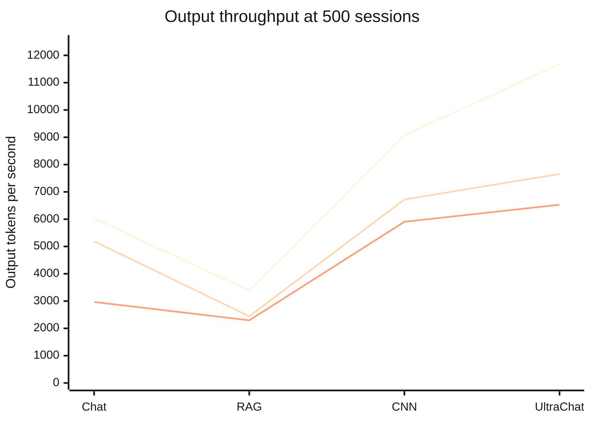
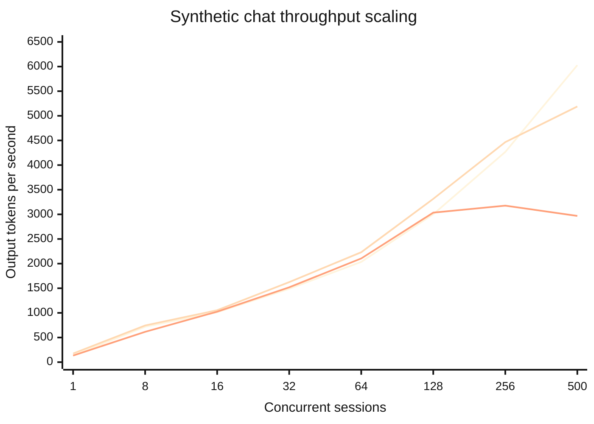
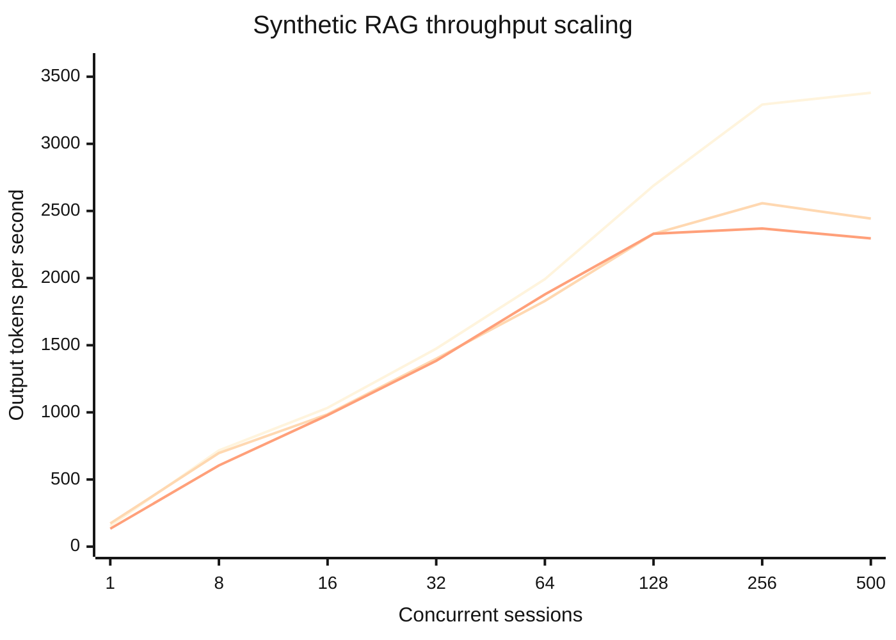
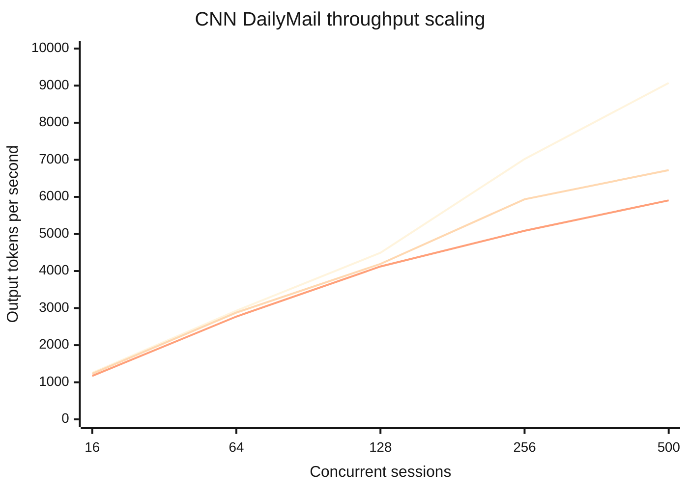
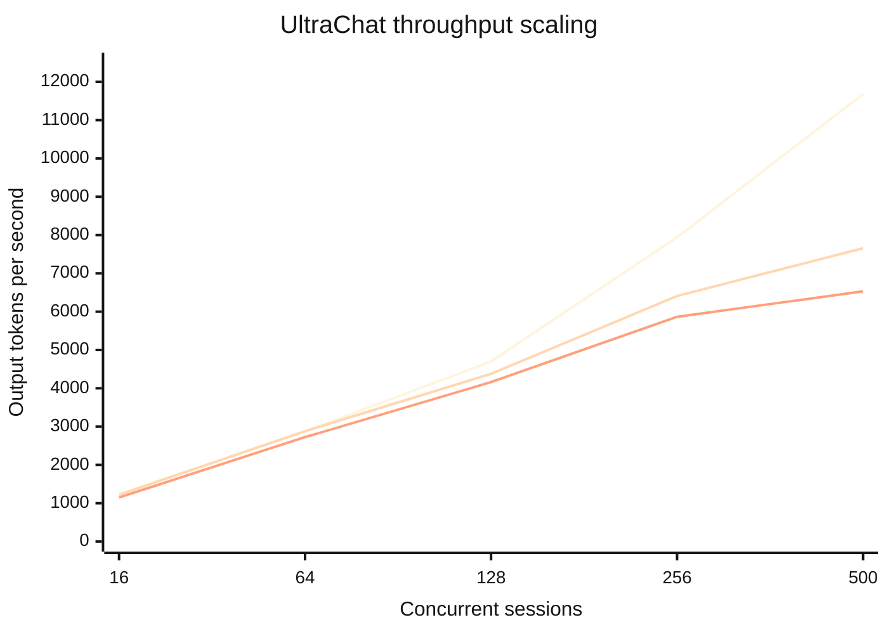
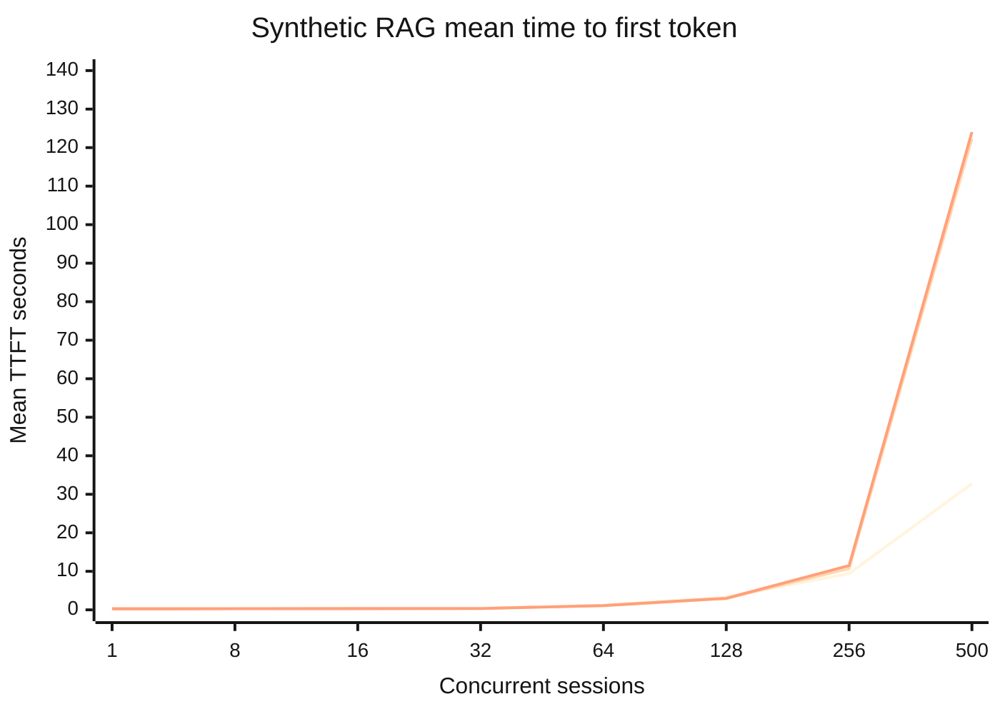
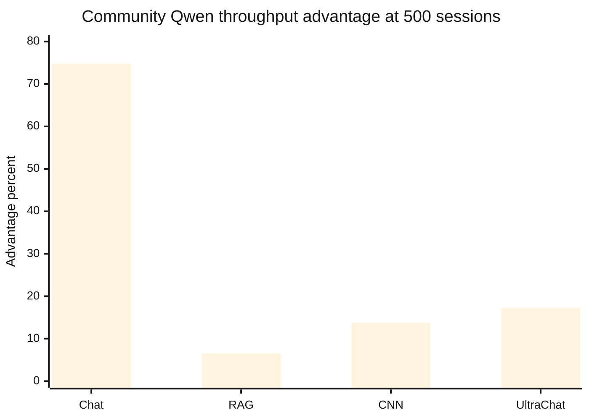
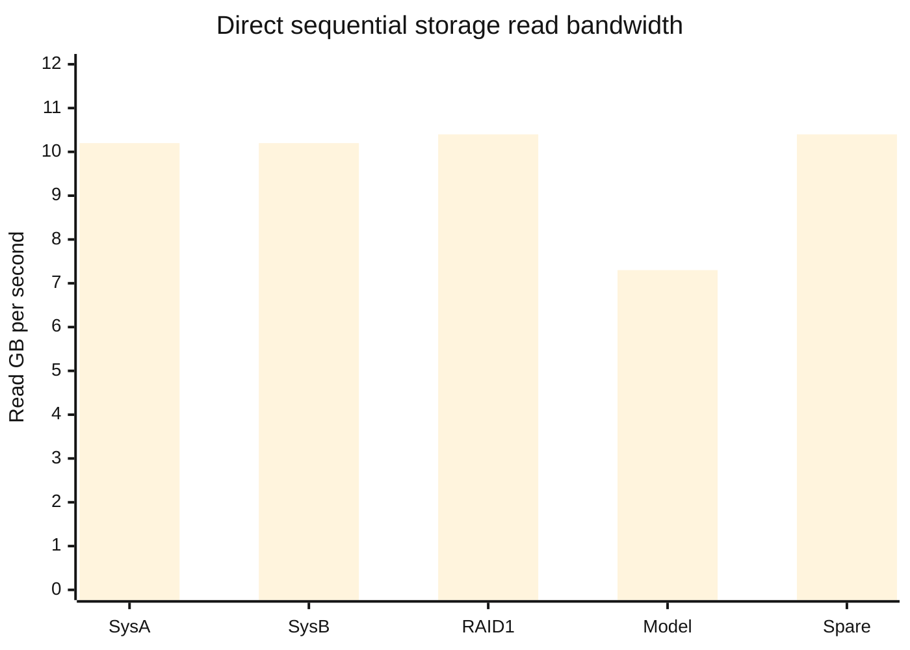

# HP GB300 Comprehensive LLM Inference Device Test Report

AI-Author: Codex (OpenAI model not exposed by runtime)

> **Portable copy:** This Markdown file is self-contained. It references no images, scripts, stylesheets, local sibling files, or network resources. Mermaid-capable readers render the charts; every chart is immediately followed by its exact fallback data table.

## Technical summary

The tested single NVIDIA GB300 system sustained a peak **11,681.38 output tokens/s** at 500 sessions on UltraChat with DeepSeek / Community. The formal matrix contains **78 operating points**, **100,818 completed requests**, **11 errors**, **6,672 boundary-incomplete requests**, and **9.35 aggregate measured workload-hours**. Community vLLM with DeepSeek-V4-Flash produced the highest c500 throughput in all four workloads. With identical Qwen3.5-122B-A10B-FP8 weights, Community vLLM exceeded Red Hat AI Inference 3.4.1 by 6.5%–74.8% at c500. Long-context RAG saturated first: both Qwen deployments peaked at 256 sessions, then regressed at 500 while mean TTFT exceeded 122 seconds. Storage measured 7.3–10.4 GB/s, ruling out local NVMe bandwidth as the cause of the earlier GPTQ conversion delay.

| Headline metric | Validated value | Meaning |
| :--- | ---: | :--- |
| GPU HBM | 256,703 MiB / 250.7 GiB | Installed accelerator memory |
| Peak output throughput | 11,681.38 tokens/s | UltraChat, DeepSeek / Community, c500 |
| Maximum concurrency | 500 sessions | Stress endpoint, not a production recommendation |
| Formal operating points | 78 | Deployment × workload × concurrency rows |
| Completed requests | 100,818 | Successfully completed inside measurement windows |
| Measured workload time | 9.35 hours | Sum of GuideLLM measured intervals |

## Device and software snapshot

| Component | Validated value | Evidence mechanism |
| :--- | :--- | :--- |
| System | HP GB300-class single-GPU system | Remote inventory |
| Accelerator | 1 × NVIDIA GB300 | nvidia-smi |
| HBM | 256,703 MiB / 250.7 GiB | nvidia-smi |
| Driver / CUDA | 595.71.05 / CUDA 13.2 | nvidia-smi |
| CPU | 72-core ARM Neoverse-V2 | lscpu |
| System RAM | 743 GiB; no swap | free and swapon |
| Operating system | Ubuntu 24.04.4 LTS, aarch64 | os-release and uname |
| Community runtime | vLLM 0.25.1 | Image/runtime inventory |
| Enterprise runtime | Red Hat AI Inference 3.4.1; vLLM 0.18.0+rhaiv.11 | Image/runtime inventory |
| Load generator | GuideLLM 0.7.1 | Benchmark container inventory |

## Workload and measurement design

| Workload | Input tokens | Output tokens | Concurrent sessions | Measured seconds per point | Purpose |
| :--- | :--- | :--- | :--- | :--- | :--- |
| Synthetic chat | 1,024 | 1,024 | 1, 8, 16, 32, 64, 128, 256, 500 | 255 | Balanced prompt/decode scaling |
| Synthetic RAG | 8,192 | 2,048 | 1, 8, 16, 32, 64, 128, 256, 500 | 510 | Long-context pressure |
| CNN/DailyMail | Dataset-driven | Dataset-driven | 16, 64, 128, 256, 500 | 510 | Public summarization workload |
| UltraChat | Dataset-driven | Dataset-driven | 16, 64, 128, 256, 500 | 510 | Public conversational workload |

### Metric definitions

- **Output throughput:** output tokens from requests completed successfully inside the measurement interval divided by measured seconds.
- **Total output throughput:** all observed output tokens, including requests still in flight at the boundary, divided by measured seconds.
- **TTFT:** time from request submission to the first generated token.
- **TPOT:** mean time per output token after the first token.
- **Boundary incomplete:** request still in flight when the fixed measurement window ended; this is not a service error.

## DeepSeek produced the highest c500 throughput in every workload

**Series order:** Community vLLM + DeepSeek V4; Community vLLM + Qwen3.5; Red Hat AI Inference + Qwen3.5.

| Deployment | Workload | Output tokens/s | TTFT s | TPOT ms/token | Completed | Boundary incomplete | Errors | Completion % |
| :--- | :--- | ---: | ---: | ---: | ---: | ---: | ---: | ---: |
| RHAI 3.4.1 + Qwen3.5 | CNN/DailyMail | 5,904.94 | 4.98 | 81.69 | 3,460 | 16 | 0 | 99.54 |
| vLLM + DeepSeek V4 | CNN/DailyMail | 9,071.02 | 5.41 | 50.30 | 5,001 | 498 | 1 | 90.93 |
| vLLM + Qwen3.5 | CNN/DailyMail | 6,721.85 | 6.06 | 70.21 | 3,939 | 390 | 0 | 90.99 |
| RHAI 3.4.1 + Qwen3.5 | Synthetic RAG | 2,295.24 | 124.02 | 150.63 | 676 | 446 | 0 | 60.25 |
| vLLM + DeepSeek V4 | Synthetic RAG | 3,379.86 | 32.76 | 121.91 | 990 | 444 | 0 | 69.04 |
| vLLM + Qwen3.5 | Synthetic RAG | 2,443.63 | 122.29 | 145.42 | 718 | 452 | 0 | 61.37 |
| RHAI 3.4.1 + Qwen3.5 | Synthetic chat | 2,968.45 | 6.44 | 129.49 | 879 | 430 | 0 | 67.15 |
| vLLM + DeepSeek V4 | Synthetic chat | 6,028.27 | 3.39 | 72.10 | 1,766 | 378 | 0 | 82.37 |
| vLLM + Qwen3.5 | Synthetic chat | 5,189.37 | 3.74 | 81.83 | 1,513 | 467 | 0 | 76.41 |
| RHAI 3.4.1 + Qwen3.5 | UltraChat | 6,530.31 | 2.38 | 68.16 | 4,001 | 499 | 0 | 88.91 |
| vLLM + DeepSeek V4 | UltraChat | 11,681.38 | 1.09 | 41.17 | 6,500 | 0 | 1 | 99.98 |
| vLLM + Qwen3.5 | UltraChat | 7,656.98 | 2.68 | 60.10 | 4,497 | 499 | 0 | 90.01 |

## Synthetic chat throughput scaling

Both Community combinations continued increasing through 500 sessions; Red Hat Qwen peaked at 256.

**Series order:** DeepSeek / Community; Qwen / Community; Qwen / Red Hat.

**Exact fallback data:**

| Sessions | DeepSeek / Community | Qwen / Community | Qwen / Red Hat |
| ---: | ---: | ---: | ---: |
| 1 | 135.79 | 175.42 | 134.34 |
| 8 | 719.06 | 744.69 | 615.35 |
| 16 | 1,014.30 | 1,054.17 | 1,024.80 |
| 32 | 1,487.85 | 1,624.63 | 1,519.10 |
| 64 | 2,034.80 | 2,230.94 | 2,104.74 |
| 128 | 3,002.20 | 3,314.23 | 3,034.59 |
| 256 | 4,267.22 | 4,465.83 | 3,176.85 |
| 500 | 6,028.27 | 5,189.37 | 2,968.45 |

## Synthetic RAG throughput scaling

Both Qwen deployments peaked at 256 sessions and regressed at 500; DeepSeek continued increasing.

**Series order:** DeepSeek / Community; Qwen / Community; Qwen / Red Hat.

**Exact fallback data:**

| Sessions | DeepSeek / Community | Qwen / Community | Qwen / Red Hat |
| ---: | ---: | ---: | ---: |
| 1 | 153.63 | 172.61 | 133.54 |
| 8 | 716.53 | 697.13 | 604.86 |
| 16 | 1,033.35 | 985.48 | 978.70 |
| 32 | 1,474.92 | 1,399.01 | 1,384.29 |
| 64 | 1,991.80 | 1,829.70 | 1,878.62 |
| 128 | 2,688.51 | 2,329.45 | 2,330.37 |
| 256 | 3,292.46 | 2,557.76 | 2,369.81 |
| 500 | 3,379.86 | 2,443.63 | 2,295.24 |

## CNN DailyMail throughput scaling

All valid deployments continued increasing through the 500-session endpoint.

**Series order:** DeepSeek / Community; Qwen / Community; Qwen / Red Hat.

**Exact fallback data:**

| Sessions | DeepSeek / Community | Qwen / Community | Qwen / Red Hat |
| ---: | ---: | ---: | ---: |
| 16 | 1,254.40 | 1,230.82 | 1,171.20 |
| 64 | 2,930.22 | 2,880.16 | 2,771.65 |
| 128 | 4,492.70 | 4,192.09 | 4,123.22 |
| 256 | 7,020.49 | 5,935.42 | 5,086.08 |
| 500 | 9,071.02 | 6,721.85 | 5,904.94 |

## UltraChat throughput scaling

UltraChat produced the experiment-wide throughput maximum.

**Series order:** DeepSeek / Community; Qwen / Community; Qwen / Red Hat.

**Exact fallback data:**

| Sessions | DeepSeek / Community | Qwen / Community | Qwen / Red Hat |
| ---: | ---: | ---: | ---: |
| 16 | 1,240.93 | 1,219.96 | 1,150.03 |
| 64 | 2,872.92 | 2,880.54 | 2,724.94 |
| 128 | 4,699.69 | 4,378.55 | 4,160.91 |
| 256 | 7,940.21 | 6,408.42 | 5,866.33 |
| 500 | 11,681.38 | 7,656.98 | 6,530.31 |

## Long-context TTFT rises sharply after the throughput knee

At c500, both Qwen stacks exceeded 122 seconds mean TTFT. High GPU utilization and high token throughput therefore do not establish an acceptable interactive-latency SLO.

**Series order:** DeepSeek / Community; Qwen / Community; Qwen / Red Hat.

| Sessions | DeepSeek / Community | Qwen / Community | Qwen / Red Hat |
| ---: | ---: | ---: | ---: |
| 1 | 0.32 | 0.35 | 0.25 |
| 8 | 0.33 | 0.37 | 0.28 |
| 16 | 0.34 | 0.38 | 0.29 |
| 32 | 0.36 | 0.41 | 0.32 |
| 64 | 1.25 | 1.13 | 1.09 |
| 128 | 3.37 | 2.95 | 3.00 |
| 256 | 9.41 | 10.69 | 11.48 |
| 500 | 32.76 | 122.29 | 124.02 |

## Community vLLM led Red Hat by 6.5% to 74.8% with identical Qwen weights

| Workload | Community advantage |
| :--- | ---: |
| Synthetic chat | 74.8% |
| Synthetic RAG | 6.5% |
| CNN/DailyMail | 13.8% |
| UltraChat | 17.3% |

## Storage bandwidth was not the model-load bottleneck

The model disk was slower than the other targets but remained a multi-GB/s device. Reading roughly 149 GiB at 7.3 GB/s is a tens-of-seconds operation; the earlier per-shard GPTQ delay was CPU-side weight conversion/reordering.

| Target | Role | Read GB/s | Method |
| :--- | :--- | ---: | :--- |
| System NVMe A | OS / system | 10.2 | 16 GiB direct sequential read |
| System NVMe B | OS / system | 10.2 | 16 GiB direct sequential read |
| md0 RAID1 | System RAID1 | 10.4 | 16 GiB direct sequential read |
| Model NVMe | Benchmark model/data | 7.3 | 16 GiB direct sequential read |
| Spare NVMe | Unused data disk | 10.4 | 16 GiB direct sequential read |

## Compatibility failures were excluded from performance ranking

| Runtime | Model | Outcome | Evidence |
| :--- | :--- | :--- | :--- |
| Community vLLM 0.25.1 | DeepSeek-V4-Flash | Compatible; four workloads completed | Formal c500 results; 0–1 errors per endpoint. |
| Community vLLM 0.25.1 | Qwen3.5-122B-A10B-FP8 | Compatible; four workloads completed | Native FP8 with Triton GDN; zero errors at formal c500 endpoints. |
| Red Hat AI Inference 3.4.1 | Qwen3.5-122B-A10B-FP8 | Compatible; four workloads completed | vLLM 0.18.0+rhaiv.11 base; zero errors at formal c500 endpoints. |
| Red Hat AI Inference 3.4.1 | DeepSeek-V4-Flash | Incompatible; API did not start | The image did not recognize deepseek_v4 and lacked DeepseekV4ForCausalLM; exit 1. |
| LightLLM main 9565289 | Qwen3.5-122B-A10B-FP8 | Incompatible; API did not start | Qwen GDN FP8 scale size 161 could not be split by the current rule whose parts total 160. |

A runtime/model pair had to start a usable API before it could enter GuideLLM. No synthetic performance number was assigned to Red Hat + DeepSeek or LightLLM + Qwen because neither pair served requests.

## Complete 78-point formal dataset

This table is the portable audit appendix. It contains every row used by the scaling charts and preserves throughput, latency, completion, error, and measurement-window values.

| Deployment | Workload | Sessions | Output tok/s | Total tok/s | Req/s | TTFT mean s | TTFT p95 s | TPOT mean ms | TPOT p95 ms | Latency mean s | Latency p95 s | Completed | Boundary incomplete | Errors | Duration s |
| :--- | :--- | ---: | ---: | ---: | ---: | ---: | ---: | ---: | ---: | ---: | ---: | ---: | ---: | ---: | ---: |
| DeepSeek / Community | Synthetic chat | 1 | 135.79 | 135.79 | 0.1333 | 1.38 | 10.88 | 7.67 | 17.31 | 7.88 | 17.23 | 35 | 0 | 0 | 255.00 |
| DeepSeek / Community | Synthetic chat | 8 | 719.06 | 719.06 | 0.7451 | 0.20 | 0.19 | 10.81 | 11.02 | 10.82 | 13.19 | 198 | 0 | 0 | 255.00 |
| DeepSeek / Community | Synthetic chat | 16 | 1,014.30 | 1,009.06 | 1.0510 | 0.25 | 0.18 | 14.87 | 22.86 | 15.26 | 23.57 | 283 | 1 | 0 | 255.00 |
| DeepSeek / Community | Synthetic chat | 32 | 1,487.85 | 1,508.47 | 1.5294 | 0.26 | 0.31 | 20.36 | 28.78 | 20.94 | 30.67 | 415 | 7 | 0 | 255.00 |
| DeepSeek / Community | Synthetic chat | 64 | 2,034.80 | 2,102.70 | 2.1882 | 0.31 | 0.46 | 28.62 | 38.01 | 29.07 | 38.39 | 596 | 26 | 0 | 255.00 |
| DeepSeek / Community | Synthetic chat | 128 | 3,002.20 | 3,175.01 | 3.1804 | 0.79 | 4.66 | 39.69 | 48.22 | 40.83 | 51.66 | 862 | 77 | 0 | 255.00 |
| DeepSeek / Community | Synthetic chat | 256 | 4,267.22 | 4,620.41 | 4.6078 | 2.22 | 19.51 | 54.84 | 60.86 | 55.98 | 71.06 | 1,252 | 179 | 0 | 255.00 |
| DeepSeek / Community | Synthetic chat | 500 | 6,028.27 | 6,876.62 | 6.4471 | 3.39 | 15.33 | 72.10 | 76.84 | 73.53 | 92.77 | 1,766 | 378 | 0 | 255.00 |
| DeepSeek / Community | Synthetic RAG | 1 | 153.63 | 153.63 | 0.0745 | 0.32 | 0.36 | 6.51 | 6.56 | 13.42 | 15.84 | 39 | 0 | 0 | 510.00 |
| DeepSeek / Community | Synthetic RAG | 8 | 716.53 | 716.53 | 0.3706 | 0.33 | 0.40 | 10.85 | 11.13 | 21.76 | 25.65 | 197 | 0 | 0 | 510.00 |
| DeepSeek / Community | Synthetic RAG | 16 | 1,033.35 | 1,033.35 | 0.5333 | 0.34 | 0.41 | 14.52 | 14.88 | 29.80 | 36.33 | 288 | 0 | 0 | 510.00 |
| DeepSeek / Community | Synthetic RAG | 32 | 1,474.92 | 1,510.57 | 0.7549 | 0.36 | 0.49 | 20.33 | 20.99 | 41.89 | 50.58 | 406 | 11 | 0 | 510.00 |
| DeepSeek / Community | Synthetic RAG | 64 | 1,991.80 | 2,065.27 | 1.0804 | 1.25 | 10.06 | 29.82 | 33.52 | 60.62 | 74.93 | 587 | 28 | 0 | 510.00 |
| DeepSeek / Community | Synthetic RAG | 128 | 2,688.51 | 2,897.20 | 1.4667 | 3.37 | 24.85 | 43.91 | 51.11 | 89.86 | 113.20 | 786 | 90 | 1 | 510.00 |
| DeepSeek / Community | Synthetic RAG | 256 | 3,292.46 | 3,649.73 | 1.7608 | 9.41 | 52.22 | 69.24 | 83.33 | 141.23 | 192.99 | 966 | 188 | 2 | 510.00 |
| DeepSeek / Community | Synthetic RAG | 500 | 3,379.86 | 3,997.43 | 1.8314 | 32.76 | 111.65 | 121.91 | 144.46 | 249.17 | 345.27 | 990 | 444 | 0 | 510.00 |
| DeepSeek / Community | CNN/DailyMail | 16 | 1,254.40 | 1,254.40 | 1.2235 | 0.48 | 0.68 | 12.76 | 12.93 | 13.07 | 13.24 | 640 | 0 | 0 | 510.00 |
| DeepSeek / Community | CNN/DailyMail | 64 | 2,930.22 | 2,930.22 | 2.8863 | 1.34 | 1.92 | 21.84 | 22.33 | 22.37 | 22.87 | 1,536 | 0 | 0 | 510.00 |
| DeepSeek / Community | CNN/DailyMail | 128 | 4,492.70 | 4,492.70 | 4.2667 | 2.51 | 3.30 | 28.49 | 29.06 | 29.18 | 29.76 | 2,304 | 0 | 0 | 510.00 |
| DeepSeek / Community | CNN/DailyMail | 256 | 7,020.49 | 7,020.49 | 7.0275 | 4.01 | 5.28 | 36.39 | 38.85 | 37.28 | 39.78 | 3,840 | 0 | 0 | 510.00 |
| DeepSeek / Community | CNN/DailyMail | 500 | 9,071.02 | 9,970.76 | 9.8039 | 5.41 | 7.55 | 50.30 | 52.50 | 51.53 | 53.76 | 5,001 | 498 | 1 | 510.00 |
| DeepSeek / Community | UltraChat | 16 | 1,240.93 | 1,242.45 | 1.2216 | 0.22 | 0.32 | 12.88 | 13.09 | 13.19 | 13.41 | 639 | 0 | 1 | 510.00 |
| DeepSeek / Community | UltraChat | 64 | 2,872.92 | 2,874.85 | 2.8863 | 0.37 | 0.47 | 21.72 | 22.09 | 22.24 | 22.62 | 1,536 | 0 | 2 | 510.00 |
| DeepSeek / Community | UltraChat | 128 | 4,699.69 | 4,699.79 | 4.5176 | 0.54 | 0.91 | 27.14 | 27.70 | 27.79 | 28.37 | 2,432 | 0 | 1 | 510.00 |
| DeepSeek / Community | UltraChat | 256 | 7,940.21 | 7,942.03 | 8.0275 | 0.73 | 1.56 | 32.21 | 33.02 | 32.99 | 33.82 | 4,350 | 0 | 2 | 510.00 |
| DeepSeek / Community | UltraChat | 500 | 11,681.38 | 11,682.20 | 11.7647 | 1.09 | 1.55 | 41.17 | 43.41 | 42.16 | 44.45 | 6,500 | 0 | 1 | 510.00 |
| Qwen / Community | Synthetic chat | 1 | 175.42 | 175.42 | 0.1725 | 0.13 | 0.13 | 5.70 | 5.73 | 5.81 | 6.82 | 45 | 0 | 0 | 255.00 |
| Qwen / Community | Synthetic chat | 8 | 744.69 | 744.69 | 0.7686 | 0.14 | 0.14 | 10.38 | 10.56 | 10.47 | 12.29 | 204 | 0 | 0 | 255.00 |
| Qwen / Community | Synthetic chat | 16 | 1,054.17 | 1,057.65 | 1.1020 | 0.14 | 0.15 | 13.99 | 14.30 | 14.34 | 17.30 | 296 | 1 | 0 | 255.00 |
| Qwen / Community | Synthetic chat | 32 | 1,624.63 | 1,636.37 | 1.6706 | 0.15 | 0.25 | 18.71 | 19.10 | 19.23 | 23.23 | 454 | 4 | 0 | 255.00 |
| Qwen / Community | Synthetic chat | 64 | 2,230.94 | 2,297.16 | 2.4314 | 0.18 | 0.27 | 25.43 | 26.19 | 25.69 | 31.50 | 662 | 22 | 0 | 255.00 |
| Qwen / Community | Synthetic chat | 128 | 3,314.23 | 3,498.30 | 3.5451 | 0.61 | 4.13 | 35.95 | 37.15 | 36.89 | 44.57 | 956 | 76 | 0 | 255.00 |
| Qwen / Community | Synthetic chat | 256 | 4,465.83 | 4,915.74 | 4.9098 | 1.17 | 6.16 | 52.09 | 54.48 | 53.23 | 65.81 | 1,305 | 203 | 0 | 255.00 |
| Qwen / Community | Synthetic chat | 500 | 5,189.37 | 6,081.89 | 5.8039 | 3.74 | 11.47 | 81.83 | 87.20 | 83.94 | 104.75 | 1,513 | 467 | 0 | 255.00 |
| Qwen / Community | Synthetic RAG | 1 | 172.61 | 172.61 | 0.0843 | 0.35 | 0.43 | 5.80 | 5.87 | 11.79 | 13.84 | 44 | 0 | 0 | 510.00 |
| Qwen / Community | Synthetic RAG | 8 | 697.13 | 697.13 | 0.3608 | 0.37 | 0.49 | 11.00 | 11.29 | 22.05 | 26.22 | 192 | 0 | 0 | 510.00 |
| Qwen / Community | Synthetic RAG | 16 | 985.48 | 989.14 | 0.5157 | 0.38 | 0.49 | 15.27 | 15.87 | 31.25 | 37.76 | 278 | 1 | 0 | 510.00 |
| Qwen / Community | Synthetic RAG | 32 | 1,399.01 | 1,429.81 | 0.7118 | 0.41 | 0.64 | 21.49 | 22.14 | 44.29 | 53.51 | 385 | 10 | 0 | 510.00 |
| Qwen / Community | Synthetic RAG | 64 | 1,829.70 | 1,927.71 | 1.0078 | 1.13 | 8.30 | 32.05 | 34.03 | 65.05 | 80.16 | 540 | 38 | 0 | 510.00 |
| Qwen / Community | Synthetic RAG | 128 | 2,329.45 | 2,572.46 | 1.2745 | 2.95 | 18.76 | 49.71 | 53.74 | 101.39 | 126.29 | 684 | 94 | 0 | 510.00 |
| Qwen / Community | Synthetic RAG | 256 | 2,557.76 | 2,826.08 | 1.3490 | 10.69 | 40.59 | 87.47 | 95.82 | 179.53 | 235.23 | 746 | 198 | 0 | 510.00 |
| Qwen / Community | Synthetic RAG | 500 | 2,443.63 | 2,762.28 | 1.3137 | 122.29 | 216.64 | 145.42 | 192.50 | 296.12 | 407.73 | 718 | 452 | 0 | 510.00 |
| Qwen / Community | CNN/DailyMail | 16 | 1,230.82 | 1,230.82 | 1.1922 | 0.50 | 0.67 | 13.01 | 13.17 | 13.32 | 13.49 | 624 | 0 | 0 | 510.00 |
| Qwen / Community | CNN/DailyMail | 64 | 2,880.16 | 2,880.16 | 2.8863 | 1.63 | 2.37 | 22.22 | 22.84 | 22.76 | 23.39 | 1,536 | 0 | 0 | 510.00 |
| Qwen / Community | CNN/DailyMail | 128 | 4,192.09 | 4,192.09 | 4.2667 | 3.20 | 4.37 | 30.48 | 31.37 | 31.22 | 32.12 | 2,304 | 0 | 0 | 510.00 |
| Qwen / Community | CNN/DailyMail | 256 | 5,935.42 | 5,935.42 | 5.5216 | 4.05 | 5.49 | 43.05 | 44.05 | 44.08 | 45.11 | 3,072 | 0 | 0 | 510.00 |
| Qwen / Community | CNN/DailyMail | 500 | 6,721.85 | 7,007.85 | 7.5078 | 6.06 | 9.89 | 70.21 | 74.17 | 71.90 | 75.95 | 3,939 | 390 | 0 | 510.00 |
| Qwen / Community | UltraChat | 16 | 1,219.96 | 1,219.96 | 1.1922 | 0.20 | 0.26 | 13.12 | 13.35 | 13.44 | 13.67 | 624 | 0 | 0 | 510.00 |
| Qwen / Community | UltraChat | 64 | 2,880.54 | 2,880.54 | 2.8863 | 0.56 | 0.74 | 22.22 | 22.69 | 22.75 | 23.23 | 1,536 | 0 | 0 | 510.00 |
| Qwen / Community | UltraChat | 128 | 4,378.55 | 4,378.55 | 4.2667 | 0.89 | 1.16 | 29.23 | 29.49 | 29.93 | 30.20 | 2,304 | 0 | 0 | 510.00 |
| Qwen / Community | UltraChat | 256 | 6,408.42 | 6,408.42 | 6.0235 | 1.67 | 2.42 | 39.94 | 40.39 | 40.90 | 41.37 | 3,328 | 0 | 0 | 510.00 |
| Qwen / Community | UltraChat | 500 | 7,656.98 | 8,319.05 | 8.8157 | 2.68 | 3.79 | 60.10 | 60.44 | 61.54 | 61.90 | 4,497 | 499 | 0 | 510.00 |
| Qwen / Red Hat | Synthetic chat | 1 | 134.34 | 134.34 | 0.1294 | 0.14 | 0.15 | 7.45 | 7.47 | 7.62 | 8.91 | 34 | 0 | 0 | 255.00 |
| Qwen / Red Hat | Synthetic chat | 8 | 615.35 | 615.35 | 0.6510 | 0.14 | 0.14 | 12.29 | 12.47 | 12.27 | 14.52 | 174 | 0 | 0 | 255.00 |
| Qwen / Red Hat | Synthetic chat | 16 | 1,024.80 | 1,014.02 | 1.0549 | 0.14 | 0.14 | 14.65 | 14.86 | 15.03 | 18.00 | 284 | 1 | 0 | 255.00 |
| Qwen / Red Hat | Synthetic chat | 32 | 1,519.10 | 1,531.02 | 1.5490 | 0.15 | 0.15 | 20.00 | 20.44 | 20.57 | 24.61 | 423 | 4 | 0 | 255.00 |
| Qwen / Red Hat | Synthetic chat | 64 | 2,104.74 | 2,186.42 | 2.3059 | 0.18 | 0.26 | 26.82 | 27.42 | 27.05 | 33.31 | 622 | 30 | 0 | 255.00 |
| Qwen / Red Hat | Synthetic chat | 128 | 3,034.59 | 3,216.17 | 3.2431 | 0.62 | 3.47 | 39.25 | 40.82 | 40.33 | 48.81 | 876 | 79 | 0 | 255.00 |
| Qwen / Red Hat | Synthetic chat | 256 | 3,176.85 | 3,555.84 | 3.3882 | 1.69 | 6.48 | 71.01 | 78.60 | 72.32 | 91.85 | 931 | 189 | 0 | 255.00 |
| Qwen / Red Hat | Synthetic chat | 500 | 2,968.45 | 3,608.19 | 3.1725 | 6.44 | 12.95 | 129.49 | 158.15 | 130.84 | 177.49 | 879 | 430 | 0 | 255.00 |
| Qwen / Red Hat | Synthetic RAG | 1 | 133.54 | 133.54 | 0.0647 | 0.25 | 0.29 | 7.49 | 7.52 | 15.44 | 17.91 | 34 | 0 | 0 | 510.00 |
| Qwen / Red Hat | Synthetic RAG | 8 | 604.86 | 604.86 | 0.3196 | 0.28 | 0.33 | 12.57 | 12.79 | 25.07 | 29.82 | 171 | 0 | 0 | 510.00 |
| Qwen / Red Hat | Synthetic RAG | 16 | 978.70 | 982.43 | 0.5098 | 0.29 | 0.34 | 15.38 | 15.63 | 31.51 | 37.73 | 275 | 1 | 0 | 510.00 |
| Qwen / Red Hat | Synthetic RAG | 32 | 1,384.29 | 1,412.86 | 0.7000 | 0.32 | 0.48 | 21.66 | 22.22 | 44.64 | 53.84 | 380 | 9 | 0 | 510.00 |
| Qwen / Red Hat | Synthetic RAG | 64 | 1,878.62 | 1,971.37 | 1.0333 | 1.09 | 7.97 | 31.37 | 33.58 | 63.71 | 78.62 | 555 | 36 | 0 | 510.00 |
| Qwen / Red Hat | Synthetic RAG | 128 | 2,330.37 | 2,561.47 | 1.2725 | 3.00 | 19.02 | 49.71 | 54.22 | 101.47 | 125.51 | 686 | 91 | 0 | 510.00 |
| Qwen / Red Hat | Synthetic RAG | 256 | 2,369.81 | 2,724.98 | 1.2588 | 11.48 | 42.79 | 91.80 | 100.06 | 187.58 | 244.14 | 694 | 204 | 0 | 510.00 |
| Qwen / Red Hat | Synthetic RAG | 500 | 2,295.24 | 2,679.63 | 1.2196 | 124.02 | 228.19 | 150.63 | 202.13 | 306.15 | 428.93 | 676 | 446 | 0 | 510.00 |
| Qwen / Red Hat | CNN/DailyMail | 16 | 1,171.20 | 1,171.20 | 1.1294 | 0.36 | 0.47 | 13.67 | 13.80 | 14.00 | 14.14 | 592 | 0 | 0 | 510.00 |
| Qwen / Red Hat | CNN/DailyMail | 64 | 2,771.65 | 2,771.65 | 2.7608 | 1.28 | 1.58 | 23.12 | 23.37 | 23.68 | 23.93 | 1,472 | 0 | 0 | 510.00 |
| Qwen / Red Hat | CNN/DailyMail | 128 | 4,123.22 | 4,123.22 | 4.0157 | 2.12 | 2.66 | 31.07 | 31.55 | 31.82 | 32.31 | 2,176 | 0 | 0 | 510.00 |
| Qwen / Red Hat | CNN/DailyMail | 256 | 5,086.08 | 5,544.54 | 5.5216 | 3.47 | 4.52 | 46.26 | 46.62 | 47.37 | 47.74 | 2,817 | 255 | 0 | 510.00 |
| Qwen / Red Hat | CNN/DailyMail | 500 | 5,904.94 | 5,920.02 | 5.8353 | 4.98 | 7.65 | 81.69 | 82.80 | 83.66 | 84.79 | 3,460 | 16 | 0 | 510.00 |
| Qwen / Red Hat | UltraChat | 16 | 1,150.03 | 1,150.03 | 1.1294 | 0.18 | 0.24 | 13.92 | 14.12 | 14.25 | 14.46 | 592 | 0 | 0 | 510.00 |
| Qwen / Red Hat | UltraChat | 64 | 2,724.94 | 2,724.94 | 2.6353 | 0.39 | 0.47 | 23.49 | 23.80 | 24.05 | 24.37 | 1,408 | 0 | 0 | 510.00 |
| Qwen / Red Hat | UltraChat | 128 | 4,160.91 | 4,160.91 | 4.2667 | 0.70 | 0.83 | 30.76 | 31.00 | 31.50 | 31.74 | 2,304 | 0 | 0 | 510.00 |
| Qwen / Red Hat | UltraChat | 256 | 5,866.33 | 5,866.33 | 5.5216 | 1.18 | 1.58 | 43.62 | 43.84 | 44.67 | 44.90 | 3,072 | 0 | 0 | 510.00 |
| Qwen / Red Hat | UltraChat | 500 | 6,530.31 | 7,341.67 | 7.8431 | 2.38 | 2.92 | 68.16 | 68.31 | 69.80 | 69.95 | 4,001 | 499 | 0 | 510.00 |

## Methodology and evidence controls

GuideLLM 0.7.1 generated load through an OpenAI-compatible API. Completed scenarios retained JSON, CSV, HTML, YAML, service/scenario logs, and GPU samples. Model shards were counted and byte-checked before testing; downloaded results were parsed and SHA-256 verified. Failed smokes, invalid prefix-cache behavior, and conversion-bound weight variants were excluded before aggregation. The Markdown tables and Mermaid arrays are generated from the same validated CSV rows, preventing chart/table drift.

## Limitations and interpretation boundaries

- DeepSeek-versus-Qwen results combine architecture, active parameters, quantization, kernels, and runtime behavior; they are not a controlled model-only experiment.
- The same-weight Qwen comparison still uses different vLLM generations and packaging.
- Boundary-incomplete requests reflect fixed measurement windows, not service errors.
- GPU board telemetry is not calibrated wall-power data; this report does not claim system joules per token.
- Public datasets are reproducible proxies, not the customer's production request distribution.
- Results are a 2026-07-17 snapshot and should be rerun after material driver, kernel, runtime, or model changes.

## Evidence-backed recommendations

1. Use Community vLLM + DeepSeek-V4-Flash as the throughput-first baseline when its model quality fits the application.
2. For Qwen3.5, start with Community vLLM; select Red Hat AI Inference when enterprise lifecycle/support value outweighs the measured throughput gap.
3. Do not deploy directly at 500 sessions. Define TTFT/TPOT SLOs and select an operating point from 64, 128, or 256 sessions.
4. Retain native no-conversion weights. These storage measurements do not justify replacing the model NVMe.
5. Retest LightLLM after upstream Qwen3.5 GDN FP8 scale handling changes and Red Hat DeepSeek after the shipped registry supports deepseek_v4.

## Further questions

- Which concurrency satisfies the application's actual TTFT, TPOT, and tail-latency SLOs?
- How do production prompt/output distributions map onto the four benchmark workloads?
- What is the full-system energy per million output tokens when measured at the wall?
- How much throughput changes under tensor parallelism or multi-GPU scale-out?
- Do newer Red Hat, Community vLLM, or LightLLM releases close the compatibility and performance gaps?

## Embedded source inventory

The report was generated from the validated contents of `hp-gb300-session-scaling-all.csv`, `hp-gb300-c500-results.csv`, and `hp-gb300-compatibility.csv`. All values needed to read, audit, or reconstruct the report are embedded above; those source filenames are provenance labels, not runtime dependencies.
