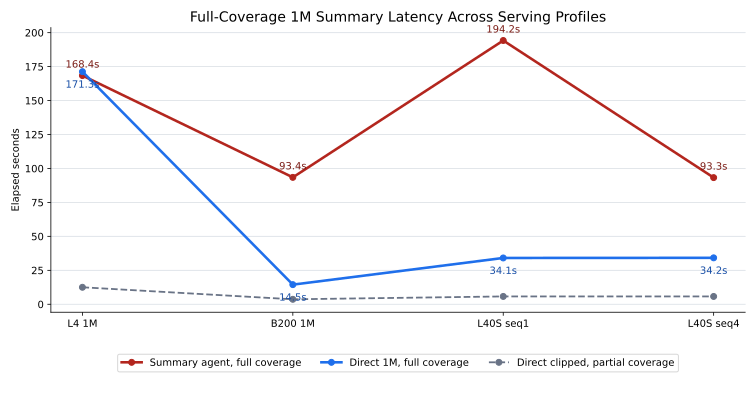
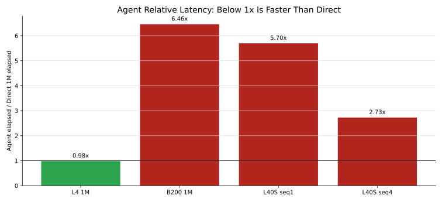

# 1M Summary Agent Comparison Report

| Field | Value |
|---|---|
| Package date | 2026-06-11 |
| Source workspace | `/Users/zhengwan/Desktop/dev/2026.06.pi-agent-summary` |
| Portable directory | `portable-report/pi-summary-comparison-2026.06.11` |
| Input shape | Synthetic 1,000,000-character customer document |
| Agent implementation | Python deterministic chunk-map-reduce pipeline, not `pi-agent-core` |

## Executive Conclusion

Across the completed scenarios, the summary-agent approach only wins when the direct full-context request is impossible or effectively unavailable. Once the serving endpoint can accept the full 1M input, direct 1M is usually faster for this synthetic repeated document.

The best agent result was the tuned L40S run at `93.26s`, but the same endpoint still completed direct 1M in `34.19s`. The B200 run was even clearer: direct 1M took `14.46s`, while the agent took `93.45s`.

So the practical conclusion is:

> Use this map/reduce agent for bounded prompts, auditability, deterministic coverage, and inputs beyond the available context window. Do not use it as a latency optimization when the model service already supports direct 1M context efficiently.

## Latency Charts

## Scenario Comparison

| Scenario | Hardware | Serving profile | Agent full coverage | Direct full 1M | Direct clipped | Agent/direct interpretation |
|---|---|---|---:|---:|---:|---|
| L4 32K | 4x NVIDIA L4 | max_model_len=32768 | 168.40s | N/A | 12.51s | direct full failed |
| L4 1M | 4x NVIDIA L4 | max_model_len=1010000, YaRN/RoPE | 168.40s | 171.27s | 12.51s | agent faster, 0.98x direct time |
| B200 1M | 1x NVIDIA B200 | max_model_len=1010000, max_num_seqs=1 | 93.45s | 14.46s | 3.66s | agent slower, 6.46x direct time |
| L40S seq1 | 4x NVIDIA L40S, PCIe only | max_model_len=1010000, max_num_seqs=1 | 194.22s | 34.10s | 5.77s | agent slower, 5.70x direct time |
| L40S seq4 | 4x NVIDIA L40S, PCIe only | max_model_len=1010000, max_num_seqs=4 | 93.26s | 34.19s | 5.76s | agent slower, 2.73x direct time |

## Reading The Charts

- The first 32K L4 service is shown in the table because direct full 1M failed; it is omitted from the main full-coverage line chart.
- The clipped direct baseline is useful only as a partial-coverage speed reference. It covers 28,000 characters, about 2.8% of the source, so it is not a valid substitute for full 1M summarization.
- The Qwen3.6 L4 corrected comparison combines the audited agent result with a later long-context direct run after the endpoint was restarted with `max_model_len=1010000`.
- The L40S `seqs=4` run proves `max_num_seqs` matters: agent latency improved from `194.22s` to `93.26s`, but direct 1M still stayed near `34s`.

## What The Agent Actually Buys

The agent is still useful when one or more of these are true:

- The model endpoint cannot accept the full input because context length, gateway request size, or KV cache limits are binding.
- The workflow must prove every source character range entered a model call.
- The operator needs full request-body audit JSONL for later inspection.
- The summary needs structured per-section extraction before reduction, not just a single free-form summary.
- The input size exceeds the largest available model context.

For a simple 1M summarization request on a working 1M context endpoint, the direct path is simpler and faster in these tests.

## Evidence Inventory

This directory is self-contained. The report uses local chart assets under `assets/`, and the copied source reports/raw benchmark artifacts are under `evidence/`.

Key files:

- `metrics.csv`: normalized scenario table used for the charts.
- `metrics.json`: same metrics in JSON form.
- `assets/latency-trend.svg` and `.png`: full-coverage latency chart.
- `assets/agent-direct-ratio.svg` and `.png`: relative latency chart.
- `evidence/reports/`: copied Markdown reports from each round.
- `evidence/raw/`: copied benchmark JSON, request audit JSONL, and vLLM startup logs.

## Caveats

- The source document is synthetic and highly repetitive, so this report is about transport, context, and latency behavior, not human summary quality.
- The agent implementation is not based on `pi-agent-core`; it is a deterministic Python map/reduce summary pipeline.
- Hardware differs across scenarios, so the chart is a scenario comparison rather than a controlled A/B test.
- Some model outputs contained reasoning-style text; the timing data remains useful, but production summary formatting would need stricter prompts or model settings.
