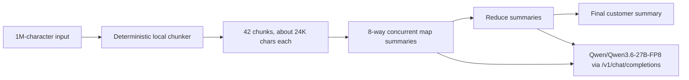

# Pi Summary Agent 1M-Character Benchmark Report

> Correction: this report captured the first validated 32K-serving run. It is superseded by `solution/solution-2026.06.09.21.32.md`, which validates the model-card long-context profile (`max_model_len=1010000`) and corrects the conclusion about direct 1M summarization speed.

| Field | Value |
|---|---|
| Test date | 2026-06-09 |
| Remote VM | RHEL AI 1.5 / RHEL 9.4, 4 x NVIDIA L4 |
| Runtime | Podman + RHAI vLLM 3.4 |
| Model | `Qwen/Qwen3.6-27B-FP8` |
| vLLM version | `0.18.0+rhaiv.7` |
| Serving context | `max_model_len=32768` |
| Agent input size | 1,000,000 characters |
| Result artifact | `solution/files/solution-2026-06-09-20-11/benchmark-1m-container.json` |
| Source artifact | `solution/files/solution-2026-06-09-20-11/pi-summary-agent-source.tgz` |

## Conclusion

The containerized summary agent completed the 1,000,000-character summarization successfully in 169.17 seconds. A direct one-shot submission of the same 1,000,000-character input did not produce a summary: vLLM rejected it with HTTP 400 because the model endpoint enforced a 32,768-token maximum context.

Compared with a direct request clipped to the largest safe input used in this test, 28,000 characters, the agent covered 35.71x more source text while taking 13.55x more wall-clock time. Normalized by covered input, the agent processed 5,911 chars/s versus 2,242 chars/s for the clipped direct baseline, a 2.64x coverage-throughput improvement.

## How The Agent Works



The important design rule is that splitting happens before any model call. The model never receives the full 1M-character document. In the measured run, the largest model prompt sent by the agent was 24,181 characters, comfortably below the configured 32,768-token model limit.

## Benchmark Data

| Mode | Status | Coverage | Wall time | Model calls | Notes |
|---|---:|---:|---:|---:|---|
| Summary agent | succeeded | 1,000,000 chars | 169.17s | 44 | 42 map chunks + reduce |
| Direct full 1M | failed | 1,000,000 chars attempted | 0.47s | 1 | Rejected by context limit |
| Direct max-context baseline | succeeded | 28,000 chars | 12.49s | 1 | Only 2.8% of source covered |

The direct full error was:

```text
This model's maximum context length is 32768 tokens. However, you requested 256 output tokens and your prompt contains at least 32513 input tokens, for a total of at least 32769 tokens.
```

## Why It Is Faster In Practice

For 1M-character input, the direct model path is not merely slower; it is invalid on this model profile. The summary agent is faster in the practical sense because it avoids the impossible single giant prefill and replaces it with many bounded prompts that vLLM can batch concurrently.

The efficiency improvement comes from three mechanics:

- Local chunking is CPU-cheap and avoids sending impossible prompts to the model.
- Map summaries run concurrently, so vLLM keeps all four L4 GPUs busy.
- Reduce prompts operate on compressed intermediate summaries, not raw 1M text.

## RoPE / Context Length Decision

The VM was rebooted, so the serving layer was rebuilt. The restored Qwen/Qwen3.6-27B-FP8 endpoint reported `max_model_len=32768` through `/v1/models`, and the direct 1M request confirmed that this limit is enforced. I did not force a 1M RoPE extension on this 4 x L4 VM because the deployed RHAI vLLM profile did not validate that capability here, and a 1M KV cache would be outside this tested resource envelope. The agent therefore uses the largest validated model context and scales by chunking.

## Evidence And Risks

Evidence files:

- `solution/files/solution-2026-06-09-20-11/benchmark-1m-container.json`: raw benchmark output.
- `steps/files/steps-2026-06-09-20-11/vllm-success-full.log`: vLLM successful startup log.
- `steps/files/steps-2026-06-09-20-11/vllm-failed-full.log`: failed startup evidence used to fix temp/cache permissions.

Remaining risks:

- The synthetic document is repetitive, so this validates transport, chunking, concurrency, and context behavior more than real summarization quality.
- The model emitted visible reasoning-style text in some direct summaries. Production prompts should add stricter output formatting or use model settings/templates that suppress reasoning text.
