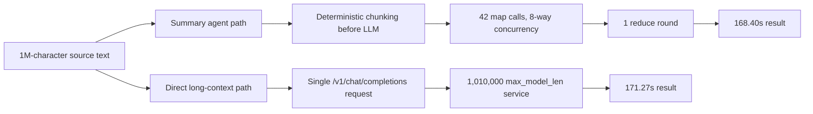

# Pi Summary Agent Long-Context Correction Report

| Field | Value |
|---|---|
| Test date | 2026-06-09 |
| Remote VM | RHEL AI 1.5 / RHEL 9.4, 4 x NVIDIA L4 |
| Runtime | Podman + RHAI vLLM 3.4 |
| Model | `Qwen/Qwen3.6-27B-FP8` |
| First serving profile | `max_model_len=32768` |
| Corrected serving profile | `max_model_len=1010000` with YaRN/RoPE override |
| Input size | 1,000,000 characters |

## Corrected Conclusion

你说得对：Qwen3.6-27B-FP8 的模型卡写了长上下文能力。上一轮把 `setup.md` 里用于恢复服务的 `max_model_len=32768` 当成了当前测试上限，这个结论不严谨。

本轮用模型卡/vLLM recipe 的 YaRN/RoPE 参数重启 vLLM 后，`/v1/models` 确认 endpoint 已变成 `max_model_len=1010000`。在这个配置下，直接把 1,000,000 字符文本发给模型可以成功，耗时 `171.27s`。

修正后的性能结论是：在这份 synthetic 1M 文本上，summary agent 是 `168.40s`，direct 1M long-context 是 `171.27s`。agent 略快约 `2.87s`，约 `1.7%`，但不是“大很多”。agent 的主要价值从“绕过不可能的 32K direct 请求”修正为“用较小 prompt、可审计分块和并发 map/reduce 来控制长文处理形态”；在支持 1M context 的服务上，是否显著更快要靠真实文档和更大样本测试证明。

## Architecture



## Benchmark Data

| Mode | Serving profile | Status | Coverage | Wall time | Model calls | Evidence |
|---|---|---:|---:|---:|---:|---|
| Summary agent, audited | 32K service | succeeded | 1,000,000 chars | 168.40s | 44 | `benchmark-1m-audited.json` |
| Direct full, first run | 32K service | failed | 1,000,000 chars attempted | 0.42s | 1 | context-limit HTTP 400 |
| Direct clipped baseline | 32K service | succeeded | 28,000 chars | 12.51s | 1 | only 2.8% coverage |
| Direct full, corrected | 1,010,000 service | succeeded | 1,000,000 chars | 171.27s | 1 | `direct-1m-long-context.json` |

## What Was Sent To The LLM

Round 1 did not persist full request bodies. Round 2 fixed this by adding request audit logging before every model call.

Agent map prompt shape:

```text
system:
You are a careful enterprise document summary agent. Preserve customer facts, risks, decisions, dates, and action items. Do not invent evidence.

user:
Summarize chunk {i}. Source character range: {start}-{end}.

{chunk.text}
```

Agent reduce prompt shape:

```text
system:
You are a careful enterprise document summary agent. Preserve customer facts, risks, decisions, dates, and action items. Do not invent evidence.

user:
Merge these partial summaries into a concise customer-facing summary. Reduce round: {round_number}.

- {partial_summary_1}
- {partial_summary_2}
...
```

Direct prompt shape:

```text
system:
Summarize the provided customer document. Preserve facts and risks.

user:
{full 1,000,000-character synthetic document}
```

Audit artifacts:

| File | Lines | Size | Purpose |
|---|---:|---:|---|
| `solution/files/solution-2026-06-09-20-11/benchmark-1m-requests.jsonl` | 46 | 2,090,736 bytes | Full audited requests for 42 map calls, reduce calls, and 32K direct baselines |
| `solution/files/solution-2026-06-09-20-11/direct-1m-long-context-requests.jsonl` | 1 | 1,009,885 bytes | Full audited request for direct 1M long-context run |

The direct 1M audited request has `request_char_count=1000067`: system prompt plus the full synthetic document.

## Long-Context Serving Evidence

The 1M service was started with:

```text
MAX_MODEL_LEN=1010000
MAX_NUM_SEQS=1
MAX_NUM_BATCHED_TOKENS=32768
GPU_MEMORY_UTILIZATION=0.90
VLLM_ALLOW_LONG_MAX_MODEL_LEN=1
HF_OVERRIDES={"text_config":{"rope_parameters":{"mrope_interleaved":true,"mrope_section":[11,11,10],"rope_type":"yarn","rope_theta":10000000,"partial_rotary_factor":0.25,"factor":4.0,"original_max_position_embeddings":262144}}}
```

The endpoint returned:

```json
{"id":"Qwen/Qwen3.6-27B-FP8","max_model_len":1010000}
```

This matches the public Qwen3.6 model card and vLLM Qwen3.6 recipe guidance: native context is 262,144 tokens, and 1,010,000 context is enabled through YaRN/RoPE override plus `VLLM_ALLOW_LONG_MAX_MODEL_LEN=1`.

References:

- Hugging Face model card: <https://huggingface.co/Qwen/Qwen3.6-27B-FP8/blob/main/README.md>
- vLLM Qwen3.6 recipe: <https://recipes.vllm.ai/Qwen/Qwen3.6-27B>

## Evidence Files

- `solution/files/solution-2026-06-09-20-11/benchmark-1m-audited.json`: audited agent and 32K baseline metrics.
- `solution/files/solution-2026-06-09-20-11/benchmark-1m-requests.jsonl`: full audited request bodies for the agent run and first direct baselines.
- `solution/files/solution-2026-06-09-20-11/direct-1m-long-context.json`: corrected direct 1M long-context result.
- `solution/files/solution-2026-06-09-20-11/direct-1m-long-context-requests.jsonl`: full direct 1M request body.
- `solution/files/solution-2026-06-09-20-11/prepare-long-1m.log`: full 1,010,000-context vLLM startup log.
- `solution/files/solution-2026-06-09-20-11/direct-1m-long-context.stdout`: direct 1M command output.

## Risks And Next Step

The synthetic document is highly repetitive, so it is a transport/context/performance validation, not a quality benchmark. A realistic conclusion about speed should use multiple long, heterogeneous documents and compare output quality, not only wall time.

The active remote vLLM service was left on the corrected `max_model_len=1010000` profile.
