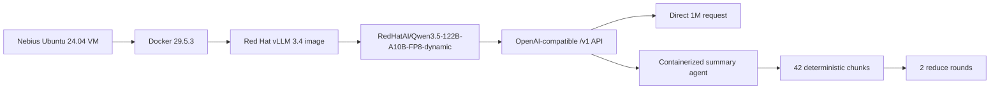

# Nebius Qwen3.5 122B 1M-Context Summary Benchmark Report

| Field | Value |
|---|---|
| Test date | 2026-06-10 |
| Environment | Nebius VM `wzh@46.243.146.148` |
| OS | Ubuntu 24.04.4 LTS |
| GPU | 1 x NVIDIA B200, 183,359 MiB |
| Runtime | Docker 29.5.3 |
| vLLM image | `registry.redhat.io/rhaii/vllm-cuda-rhel9:3.4.0` |
| vLLM version | `0.18.0+rhaiv.7` |
| Model | `RedHatAI/Qwen3.5-122B-A10B-FP8-dynamic` |
| Serving profile | `max_model_len=1010000`, YaRN/RoPE, text-only, `max_num_seqs=1` |
| Input size | 1,000,000 characters |

## Conclusion

The Nebius environment successfully served `RedHatAI/Qwen3.5-122B-A10B-FP8-dynamic` with a 1,010,000-token YaRN/RoPE profile using Red Hat vLLM 3.4. `/v1/models` reported `max_model_len=1010000`, and both the direct 1M request and the summary-agent 1M workflow completed.

In this environment, direct 1M input was much faster than the current agent workflow:

| Mode | Status | Coverage | Wall time | Model calls | Notes |
|---|---:|---:|---:|---:|---|
| Direct 1M | succeeded | 1,000,000 chars | 14.46s | 1 | Single long-context request |
| Summary agent | succeeded | 1,000,000 chars | 93.45s | 46 | 42 map chunks + 2 reduce rounds + audit-compatible parser |
| Direct clipped baseline | succeeded | 28,000 chars | 3.66s | 1 | Partial coverage baseline |

So for this specific synthetic benchmark on a single B200 with the 1M long-context profile, the agent is not faster. Direct 1M is about `6.46x` faster than the current map/reduce agent (`93.45 / 14.46`). The agent remains useful for bounded prompts, deterministic pre-LLM splitting, traceability, and workflows that require per-chunk audit, but it did not win on raw latency here.

## Deployment Shape



The vLLM service used:

```text
MODEL_NAME=RedHatAI/Qwen3.5-122B-A10B-FP8-dynamic
MAX_MODEL_LEN=1010000
MAX_NUM_SEQS=1
MAX_NUM_BATCHED_TOKENS=32768
GPU_MEMORY_UTILIZATION=0.92
VLLM_ALLOW_LONG_MAX_MODEL_LEN=1
--language-model-only
--reasoning-parser qwen3
--hf-overrides {"text_config":{"rope_parameters":{"mrope_interleaved":true,"mrope_section":[11,11,10],"rope_type":"yarn","rope_theta":10000000,"partial_rotary_factor":0.25,"factor":4.0,"original_max_position_embeddings":262144}}}
```

Important startup evidence from `prepare-nebius-qwen35-1m.log`:

- vLLM accepted `max_model_len=1010000`.
- The model resolved as `Qwen3_5MoeForConditionalGeneration`.
- Text-only mode disabled multimodal limits to save memory.
- Weight download took `372.09s`.
- Model loading took `118.91 GiB` GPU memory and `405.21s`.
- Available KV cache memory was `36.81 GiB`.
- vLLM reported maximum concurrency for `1,010,000` tokens per request as `1.58x`.
- `/v1/models` returned `max_model_len=1010000`.

## Request Audit

The benchmark wrote full pre-call request bodies to JSONL:

| Artifact | Lines | Bytes | Purpose |
|---|---:|---:|---|
| `solution/files/solution-2026-06-10-13-48/nebius-qwen35-1m-agent-benchmark.json` | 33 | 7,848 | Final metrics and summaries |
| `solution/files/solution-2026-06-10-13-48/nebius-qwen35-1m-agent-requests.jsonl` | 48 | 2,120,397 | Full audited model request bodies |
| `solution/files/solution-2026-06-10-13-48/prepare-nebius-qwen35-1m.log` | 460 | 79,850 | Full vLLM deployment/startup log |

Request audit highlights:

| Call | Purpose | Request chars | Max tokens |
|---:|---|---:|---:|
| 1 | Agent map chunk 1 | 24,049 | 256 |
| 42 | Agent map chunk 42 | 23,367 | 256 |
| 47 | Direct full 1M | 1,000,067 | 512 |
| 48 | Direct clipped baseline | 28,067 | 512 |

The agent never sent the full 1M document in one request. The direct baseline did.

## Output Caveat

This model service returned Qwen thinking-mode payloads through the OpenAI-compatible `message.reasoning` field while `message.content` was often `null`. The client was updated to accept `content`, `reasoning_content`, or `reasoning` so benchmark outputs are no longer empty.

The reported wall times are valid latency measurements for the request/serving profile, but this synthetic repeated document should not be treated as a production summary-quality benchmark. The generated summaries are reasoning-style text, not polished final customer summaries.

## Comparison With Earlier Qwen3.6 Result

The earlier 4 x L4 Qwen3.6 run showed direct 1M and agent within a few seconds once 1M context was enabled. The Nebius B200 + Qwen3.5-122B run is different:

- The direct 1M path is very fast on B200: `14.46s`.
- The agent path makes many calls and is penalized by `max_num_seqs=1`.
- The current 1M profile was optimized for allowing direct 1M, not for concurrent chunk-map throughput.

If the goal is to make the agent competitive on this host, the next experiment should restart vLLM with higher `max_num_seqs` and a larger `max_num_batched_tokens`, then rerun only the agent benchmark. That would test whether chunked map concurrency can use the B200 more effectively while still preserving the 1M direct-serving profile.

## Source References

- RedHatAI model card: <https://huggingface.co/RedHatAI/Qwen3.5-122B-A10B-FP8-dynamic>
- Qwen3.5 model card: <https://huggingface.co/Qwen/Qwen3.5-122B-A10B>

The Qwen3.5 card states native 262,144-token context and extension up to 1,010,000 tokens with YaRN/RoPE. The RedHatAI card identifies this FP8 dynamic model as validated on vLLM `0.18.0` and RHAIIS `3.4`.
