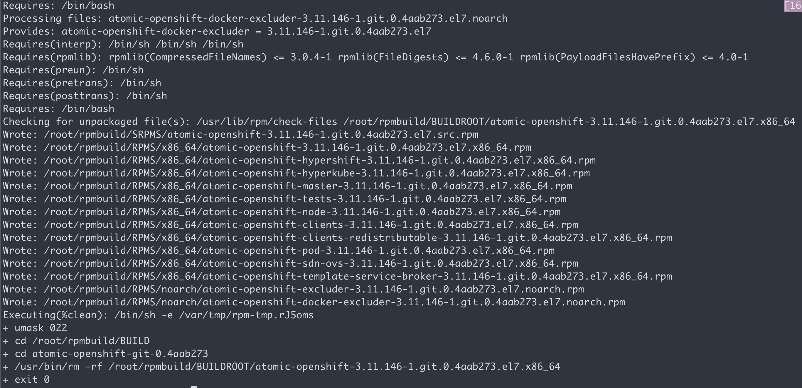

# 从源代码编译openshift 3.11

todo:
- 编译出来的成果，还没有实际安装验证。

## 环境准备

```bash
yum -y install rpmdevtools
rpmdev-setuptree

yum -y install git docker
yum -y install golang make gcc zip mercurial krb5-devel bsdtar bc rsync bind-utils file jq tito createrepo openssl gpgme gpgme-devel libassuan libassuan-devel
yum -y install vim goversioninfo bsdtar golang krb5-devel

```

## 下载源代码

```bash
yum install yum-utils
yumdownloader --source atomic-openshift
```

## 修改源代码内容

不知道为什么，src.rpm的内容，必须要修改一下，才能顺利编译
```bash
cp atomic-openshift-3.11.146-1.git.0.4aab273.el7.src.rpm ~/down
rpm2cpio atomic-openshift-3.11.146-1.git.0.4aab273.el7.src.rpm | cpio -idm
tar zxf atomic-openshift-git-0.4aab273.tar.gz
```
需要修改etcd.go文件，改一下import包的位置，完成的参考文件，在arm/x86下面
```bash
cd /root/down
# mv atomic-openshift-git-0.4aab273 atomic-openshift-3.11.146
# patch pkg/apps/apiserver/registry/deployconf/etcd/etcd.go
# common out //"k8s.io/kubernetes/staging/src/k8s.io/apimachinery/pkg/labels"
# to "k8s.io/apimachinery/pkg/labels"
vim /root/down/atomic-openshift-git-0.4aab273/pkg/apps/apiserver/registry/deployconfig/etcd/etcd.go
```
还有修改build-cross.sh文件，限制仅仅编译linux/amd64，完成的参考文件，在arm/x86下面
```bash
# only to build linux/amd64
vim /root/down/atomic-openshift-git-0.4aab273/hack/build-cross.sh
```
还要改origin.spec，去掉对goversioninfo，并且去掉为windows, darwin打包的步骤。完成的参考文件，在arm/x86下面
```bash
vim /root/down/origin.spec
```
最后，修改好的文件，重新打包，复制到编译目录，就可以开始编译了。
```bash
tar zcf atomic-openshift-git-0.4aab273.tar.gz ./atomic-openshift-git-0.4aab273
/bin/cp -f atomic-openshift-git-0.4aab273.tar.gz ~/rpmbuild/SOURCES/
# change origin.spec, remove goversioninfo, remove windows build
/bin/cp -f origin.spec /root/rpmbuild/SPECS/
cd /root/rpmbuild/SPECS/
rpmbuild -ba origin.spec
```
然后编译一下镜像
```bash
build-local-images.py
```
## 效果
编译成功以后，会有如下的一堆rpm出现。

镜像编译了以后，会有如下的镜像出现

