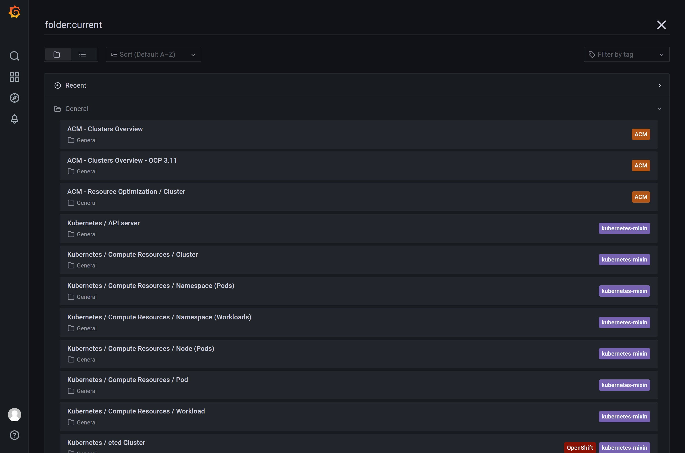
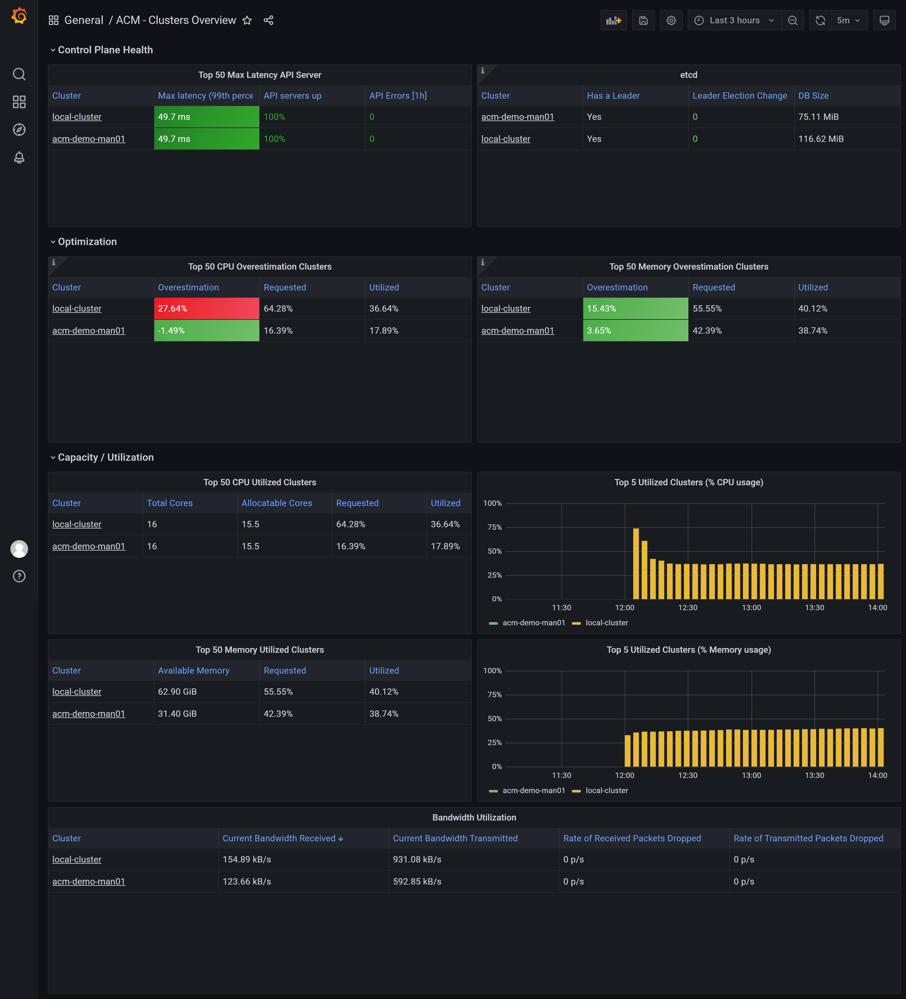
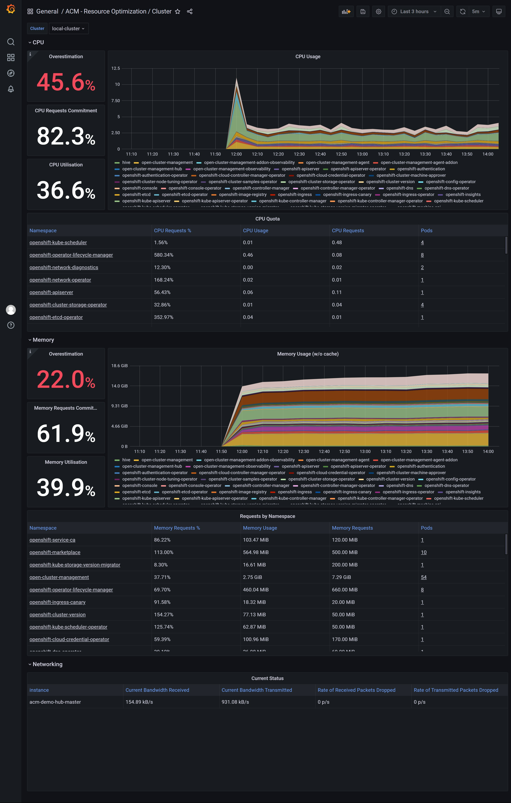
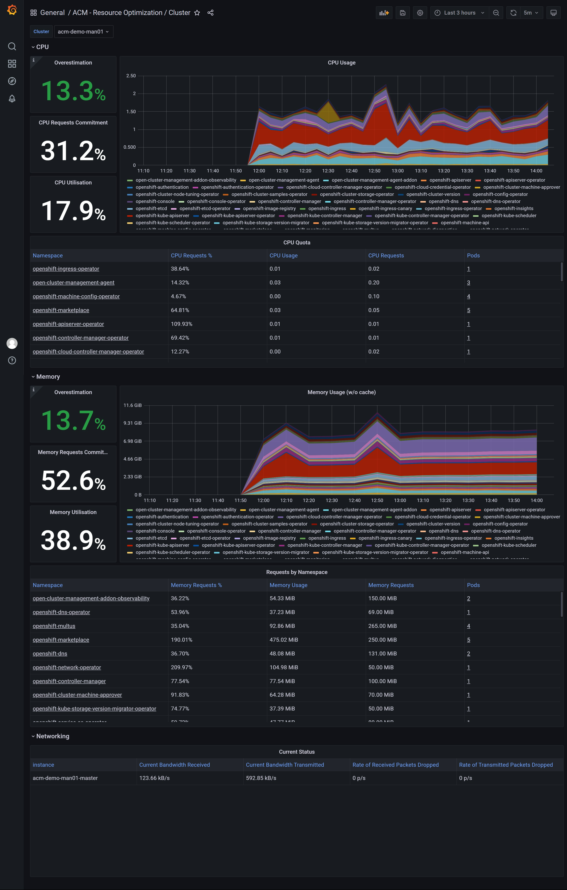

# openshift 4.10 ACM with observ user case

# create the acm hub cluster

- install a sno cluster with 16C, 64GB memory, and 2 100GB disks
- install ACM from operator hub
- install multiclusterhub with default setting

# create the managed cluster

install a sno cluster with 16C, 32GB memory.

```bash

NODE_SSH_KEY="$(cat ~/.ssh/id_rsa.pub)"
INSTALL_IMAGE_REGISTRY=quaylab.infra.redhat.ren:8443

PULL_SECRET='{"auths":{"registry.redhat.io": {"auth": "ZHVtbXk6ZHVtbXk=","email": "noemail@localhost"},"registry.ocp4.redhat.ren:5443": {"auth": "ZHVtbXk6ZHVtbXk=","email": "noemail@localhost"},"'${INSTALL_IMAGE_REGISTRY}'": {"auth": "'$( echo -n 'admin:shadowman' | openssl base64 )'","email": "noemail@localhost"}}}'

NTP_SERVER=192.168.7.11
HELP_SERVER=192.168.7.11
KVM_HOST=192.168.7.11
API_VIP=192.168.7.100
INGRESS_VIP=192.168.7.101
CLUSTER_PROVISION_IP=192.168.7.103
BOOTSTRAP_IP=192.168.7.12

ACM_DEMO_MNGED_CLUSTER=acm-demo-man01
ACM_DEMO_MNGED_SNO_IP=192.168.7.23

# 定义单节点集群的节点信息
SNO_CLUSTER_NAME=acm-demo-man01
SNO_BASE_DOMAIN=redhat.ren
SNO_IP=192.168.7.23
SNO_GW=192.168.7.11
SNO_NETMAST=255.255.255.0
SNO_NETMAST_S=24
SNO_HOSTNAME=acm-demo-man01-master
SNO_IF=enp1s0
SNO_IF_MAC=`printf '00:60:2F:%02X:%02X:%02X' $[RANDOM%256] $[RANDOM%256] $[RANDOM%256]`
SNO_DNS=192.168.7.11
SNO_DISK=/dev/vda
SNO_CORE_PWD=redhat

echo ${SNO_IF_MAC} > /data/sno/sno.mac

# goto kvm host ( 103 )

scp root@192.168.7.11:/data/install/sno.iso /data/kvm/

virsh destroy ocp4-acm-man01
virsh undefine ocp4-acm-man01

create_lv() {
    var_vg=$1
    var_pool=$2
    var_lv=$3
    var_size=$4
    var_action=$5
    lvremove -f $var_vg/$var_lv
    # lvcreate -y -L $var_size -n $var_lv $var_vg
    if [ "$var_action" == "recreate" ]; then
      lvcreate --type thin -n $var_lv -V $var_size --thinpool $var_vg/$var_pool
      wipefs --all --force /dev/$var_vg/$var_lv
    fi
}

create_lv vgdata poolA lvacm-man01 100G recreate
create_lv vgdata poolA lvacm-man01-data 100G recreate

SNO_MEM=32

virt-install --name=ocp4-acm-man01-master01 --vcpus=16 --ram=$(($SNO_MEM*1024)) \
  --cpu=host-model \
  --disk path=/dev/vgdata/lvacm-man01,device=disk,bus=virtio,format=raw \
  --disk path=/dev/vgdata/lvacm-man01-data,device=disk,bus=virtio,format=raw \
  --os-variant rhel8.3 --network bridge=baremetal,model=virtio \
  --graphics vnc,port=59003 \
  --boot menu=on --cdrom /data/kvm/sno.iso 


# INFO Install complete!
# INFO To access the cluster as the system:admin user when using 'oc', run 'export KUBECONFIG=/data/install/auth/kubeconfig'
# INFO Access the OpenShift web-console here: https://console-openshift-console.apps.acm-demo-man01.redhat.ren
# INFO Login to the console with user: "kubeadmin", and password: "FohuH-IwyJe-3UQPL-AakHm"
# INFO Time elapsed: 0s

```

# enable acm observ in acm hub cluster

[offical document: acm observ enable](https://access.redhat.com/documentation/en-us/red_hat_advanced_cluster_management_for_kubernetes/2.4/html-single/observability/index), it will enable observ in managed cluster automatically.

```bash
# try to install acm observ
# https://access.redhat.com/documentation/en-us/red_hat_advanced_cluster_management_for_kubernetes/2.4/html-single/observability/index
oc create namespace open-cluster-management-observability

DOCKER_CONFIG_JSON=`oc extract secret/pull-secret -n openshift-config --to=-`

oc create secret generic multiclusterhub-operator-pull-secret \
    -n open-cluster-management-observability \
    --from-literal=.dockerconfigjson="$DOCKER_CONFIG_JSON" \
    --type=kubernetes.io/dockerconfigjson

cat << EOF > /data/install/acm.observ.secret.yaml
---
apiVersion: v1
kind: Secret
metadata:
  name: thanos-object-storage
  namespace: open-cluster-management-observability
type: Opaque
stringData:
  thanos.yaml: |
    type: s3
    config:
      bucket: $BUCKET_NAME
      endpoint: $AWS_HOST
      insecure: true
      access_key: $AWS_ACCESS_KEY_ID
      secret_key: $AWS_SECRET_ACCESS_KEY
EOF
oc create -f /data/install/acm.observ.secret.yaml

# oc delete -f /data/install/acm.observ.secret.yaml

cat << EOF > /data/install/acm.observ.yaml
---
apiVersion: observability.open-cluster-management.io/v1beta2
kind: MultiClusterObservability
metadata:
  name: observability
spec:
  observabilityAddonSpec: {}
  storageConfig:
    metricObjectStorage:
      name: thanos-object-storage
      key: thanos.yaml
---
EOF
oc create -f /data/install/acm.observ.yaml -n open-cluster-management

# oc delete -f /data/install/acm.observ.yaml -n open-cluster-management


```

import second cluster into acm, by using kubeconfig file


click 'Grafana' on top right, you will see the grafana dashboard



you can see there are 3 default dashboard included with acm, 2 of them are usable for ocp4

look at the 'ACM - Clusters Overview' dashboard



look at the 'ACM - Resource Optimization / Cluster' dashboard

for acm hub cluster:



for managed cluster:




