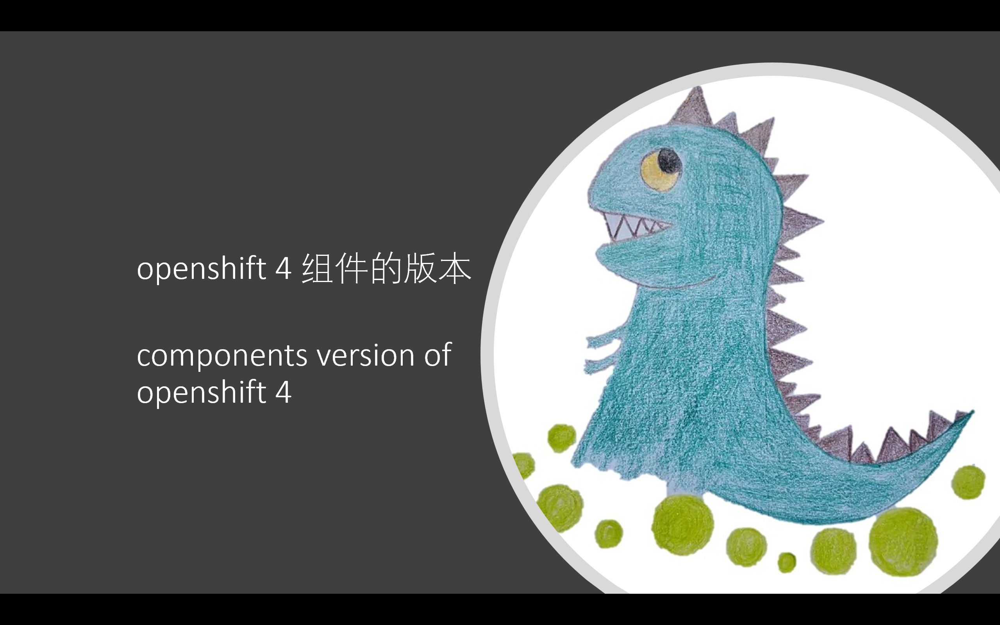
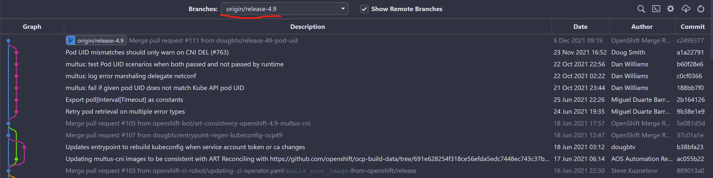
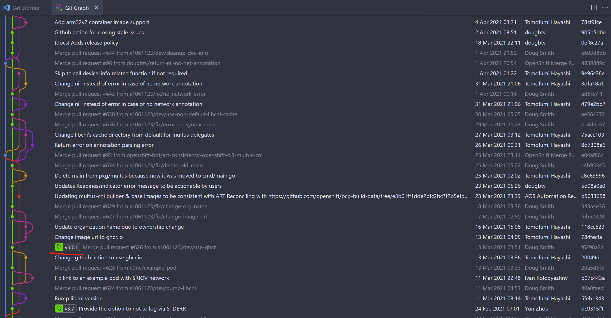

# openshift 4 组件的版本 / components version of openshift 4

客户在项目中提出了一个问题，就是openshift 4是由很多开源组件构成，并且打了补丁的，那么这些开源组件是什么版本呢？

针对这个问题，红帽由一个官方知识库，里面由核心组件的版本信息：
- [OpenShift Container Platform 4.x Tested Integrations](https://access.redhat.com/articles/4128421)
- [OpenShift Container Platform 4.x Tested Integrations (for x86_x64)](https://access.redhat.com/articles/4763741)

但是上面的知识库，只告诉了我们，crio, etcd, ovs, ovn 的版本信息，但是并没有说其他的，比如 multus 的版本信息。

客户需要很多其他组件的版本信息，好和已有的解决方法进行匹配度检查。那么我们就来一步一步的看，怎么找到这些版本信息吧。

本文，用 multus 来举例子。

## 视频讲解 / Video explanation

[<kbd></kbd>](https://www.bilibili.com/video/BV1zP41137wg/)

- [bilibili](https://www.bilibili.com/video/BV1zP41137wg/)
- [youtube](https://youtu.be/KiXrvsTUBpI)

## begin

首先，我们可以从openshift的发布信息中，得到multus的源代码地址。
```bash
oc adm release info `curl -s https://mirror.openshift.com/pub/openshift-v4/x86_64/clients/ocp/4.9.30/release.txt | grep ocp-release | awk '{print $3}'` --commit-urls=true | grep multus
# ......
#   multus-admission-controller                    https://github.com/openshift/multus-admission-controller/commit/3c28a57a831d11380e612a616820bf8a42261d9d
#   multus-cni                                     https://github.com/openshift/multus-cni/commit/c2499377b6fb43320618025876eb5b9751006222
#   multus-networkpolicy                           https://github.com/openshift/multus-networkpolicy/commit/fd12fedeb9e05637279386aa2aacd443ac1c0da7
#   multus-route-override-cni                      https://github.com/openshift/route-override-cni/commit/1953205643c2739486c315d4ea58e17d29cfa610
#   multus-whereabouts-ipam-cni                    https://github.com/openshift/whereabouts-cni/commit/43552df5f301618a1857c9a1c2b51cbb7188ad38
# ......
```
我们可以看到，openshift 4 使用的multus，源代码地址是： https://github.com/openshift/multus-cni ，使用的版本id是 c2499377b6fb43320618025876eb5b9751006222

我们用git clone出来这个源代码项目，并且打开git history，查找 c2499377b6fb43320618025876eb5b9751006222 这个commit id，可以看到，他对应的是 release-4.9 分支。


那么，我们就筛选 release-4.9 分支，看看 git 的历史上有些什么 tag 信息。





我们可以看到，在release-4.9 分支上，有很多的补丁，但是最近的一个 tag 是 3.7.1 

到这里，我们就知道了，openshift 4.9 使用的 multus ，是在 3.7.1 版本基础上打补丁出来的版本。
