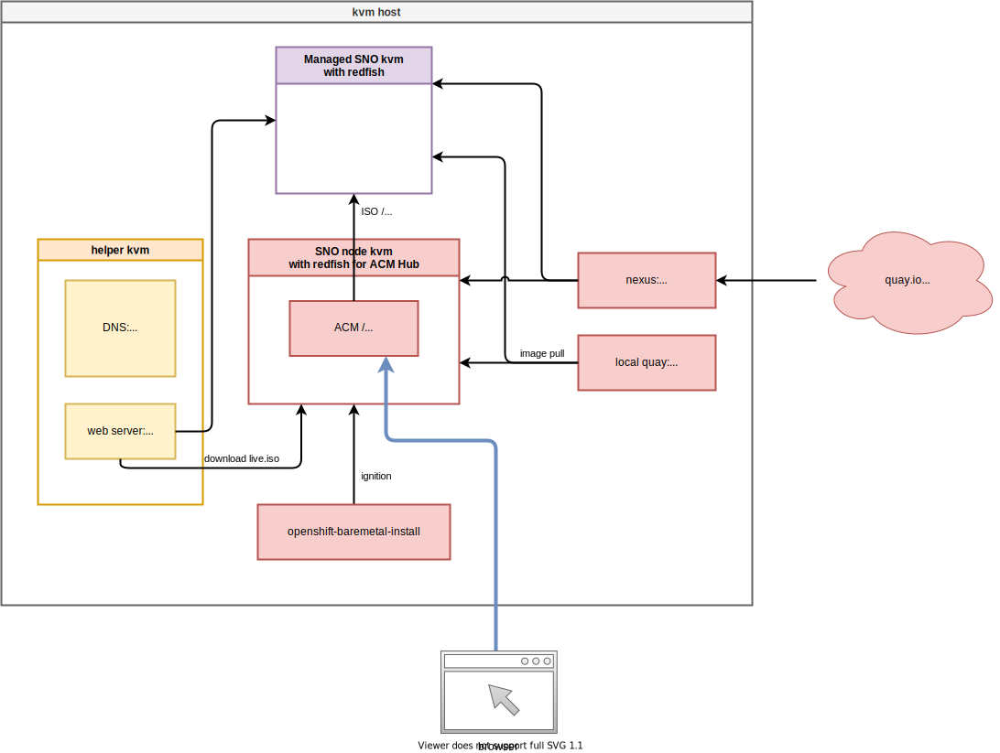
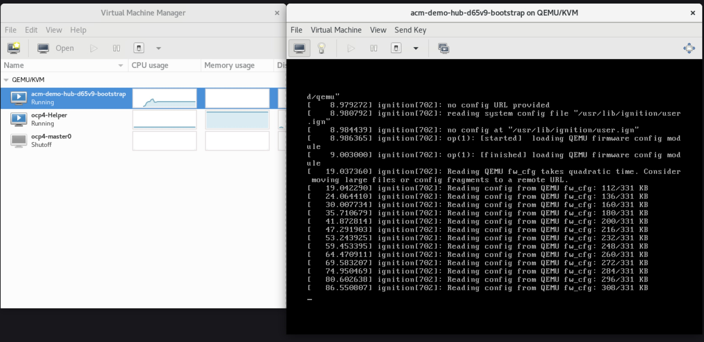
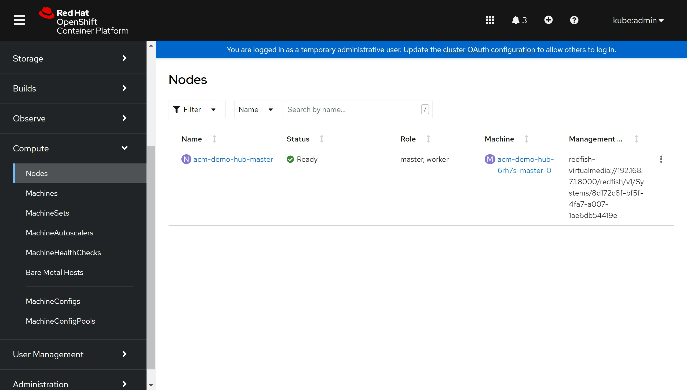
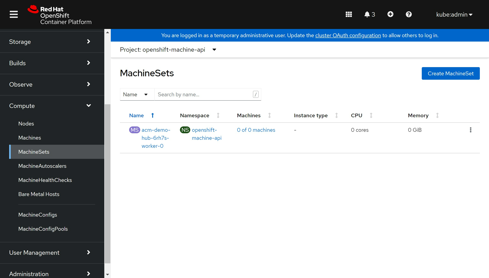
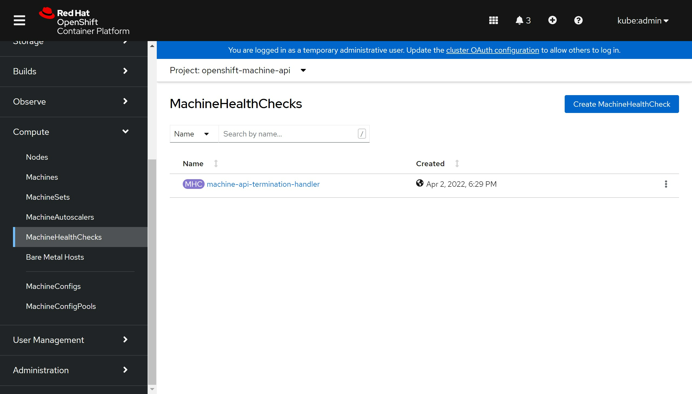
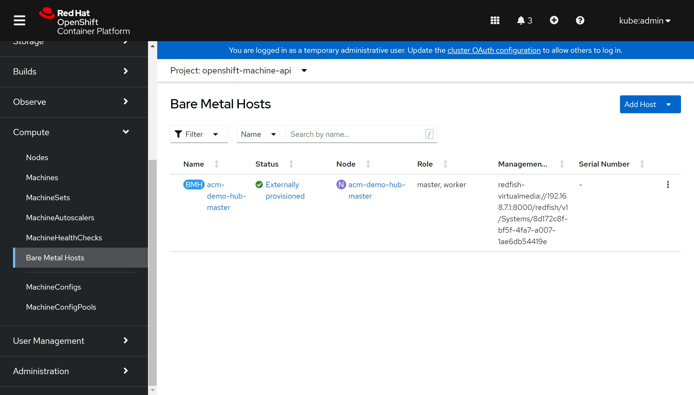

# openshift 4.10 离线 baremetal IPI (全自动)安装 单网络 静态IP模式

## 简介

视频讲解

[<kbd></kbd>]()

- [bilibili]()
- [youtube]()

本文描述ocp4.10在baremetal(kvm模拟)上面，IPI (全自动)安装。由于4.10支持nmstat，所以他原生支持静态IP安装了。

根据openshift文档，baremetal IPI安装有两种模式，一种是provisioning网络独立，另外一种是provisioning网络和baremetal(服务)网络合并的模式。考虑到POC现场的环境，本次实验，使用简单的网络部署，也就是合并的网络模式。

以下是本次实验的架构图:



注意：本文使用single node (sno) 模式，并使用 IPI (全自动) 安装，这种模式官方是不支持的，我们这么做，是为了后续的ACM zero touch provision 实验， ZTP实验，需要ACM hub集群是IPI模式安装，而我们做实验资源紧张，所以我们搞了一个sno with IPI 模式的安装步骤。本文中有一些手动执行的步骤，都是因为官方IPI不支持sno，我们需要做一些小小的patch操作。

## 离线安装包下载
打包好的安装包，在这里下载，百度盘下载链接，版本是4.10.4:

链接: https://pan.baidu.com/s/1jJU0HLnZMnvCNMNq1OEDxA  密码: uaaw

其中包括如下类型的文件：
- ocp4.tgz  这个文件包含了iso等安装介质，以及各种安装脚本，全部下载的镜像列表等。需要复制到宿主机，以及工具机上去。
- registry.tgz  这个文件也是docker image registry的仓库打包文件。需要先补充镜像的话，按照这里操作: [4.6.add.image.md](./4.6.add.image.md)
- nexus-image.tgz 这个是nexus的镜像仓库打包，集群的镜像proxy指向nexus，由nexus提供镜像的cache
- poc.image.tgz 这个是给registry.tgz补充的一些镜像，主要是ccn使用，补充的镜像列表在这里 [poc.image.list](./ccn/poc.image.list) ，按照这里操作: [4.6.add.image.md](./4.6.add.image.md)

合并这些切分文件，使用类似如下的命令
```bash
cat registry.?? > registry.tgz
```

注意，可能需要更新离线镜像包中的helper用的ansible脚本。

## 在外网云主机上面准备离线安装源

准备离线安装介质的文档，已经转移到了这里：[4.10.build.dist.md](./4.10.build.dist.md)

# 前期准备，主要在宿主机上

本次实验，是在一个24C， 128G 的主机上面，用很多个虚拟机安装测试。所以先准备这个宿主机。

如果是多台宿主机，记得一定要调整时间配置，让这些宿主机的时间基本一致，否则证书会出问题。

主要的准备工作有
- 配置yum源
- 配置dns
- 安装镜像仓库
- 配置vnc环境
- 配置kvm需要的网络
- 创建helper kvm

以上准备工作，dns部分需要根据实际项目环境有所调整。

本次的宿主机是一台rhel8, 参考这里进行离线repo等基本的配置[rhel8.build.kernel.repo.cache.md](../../rhel/rhel8.build.kernel.repo.cache.md)

```bash
cat << EOF > /root/.ssh/config
StrictHostKeyChecking no
UserKnownHostsFile=/dev/null
EOF

cat << EOF >>  /etc/hosts
127.0.0.1 registry.ocp4.redhat.ren nexus.ocp4.redhat.ren git.ocp4.redhat.ren
EOF

dnf clean all
dnf repolist

dnf -y install byobu htop jq ipmitool

systemctl disable --now firewalld

# 配置registry
mkdir -p /etc/crts/ && cd /etc/crts

# https://access.redhat.com/documentation/en-us/red_hat_codeready_workspaces/2.1/html/installation_guide/installing-codeready-workspaces-in-tls-mode-with-self-signed-certificates_crw
openssl genrsa -out /etc/crts/redhat.ren.ca.key 4096
openssl req -x509 \
  -new -nodes \
  -key /etc/crts/redhat.ren.ca.key \
  -sha256 \
  -days 36500 \
  -out /etc/crts/redhat.ren.ca.crt \
  -subj /CN="Local Red Hat Ren Signer" \
  -reqexts SAN \
  -extensions SAN \
  -config <(cat /etc/pki/tls/openssl.cnf \
      <(printf '[SAN]\nbasicConstraints=critical, CA:TRUE\nkeyUsage=keyCertSign, cRLSign, digitalSignature'))

openssl genrsa -out /etc/crts/redhat.ren.key 2048

openssl req -new -sha256 \
    -key /etc/crts/redhat.ren.key \
    -subj "/O=Local Red Hat Ren /CN=*.ocp4.redhat.ren" \
    -reqexts SAN \
    -config <(cat /etc/pki/tls/openssl.cnf \
        <(printf "\n[SAN]\nsubjectAltName=DNS:*.ocp4.redhat.ren,DNS:*.apps.ocp4.redhat.ren,DNS:*.redhat.ren\nbasicConstraints=critical, CA:FALSE\nkeyUsage=digitalSignature, keyEncipherment, keyAgreement, dataEncipherment\nextendedKeyUsage=serverAuth")) \
    -out /etc/crts/redhat.ren.csr

openssl x509 \
    -req \
    -sha256 \
    -extfile <(printf "subjectAltName=DNS:*.ocp4.redhat.ren,DNS:*.apps.ocp4.redhat.ren,DNS:*.redhat.ren\nbasicConstraints=critical, CA:FALSE\nkeyUsage=digitalSignature, keyEncipherment, keyAgreement, dataEncipherment\nextendedKeyUsage=serverAuth") \
    -days 36500 \
    -in /etc/crts/redhat.ren.csr \
    -CA /etc/crts/redhat.ren.ca.crt \
    -CAkey /etc/crts/redhat.ren.ca.key \
    -CAcreateserial -out /etc/crts/redhat.ren.crt

openssl x509 -in /etc/crts/redhat.ren.crt -text

/bin/cp -f /etc/crts/redhat.ren.ca.crt /etc/pki/ca-trust/source/anchors/
update-ca-trust extract
```
## 配置镜像仓库

这里是旧的，使用docker registry的配置镜像仓库的方法，如果想配置quay，可以[参考这里](../4.9/4.9.ci.cd.demo.md#quay) 。

```bash
cd /data
mkdir -p /data/registry
# tar zxf registry.tgz
dnf -y install podman pigz skopeo jq 
# pigz -dc registry.tgz | tar xf -
cd /data/ocp4
podman load -i /data/ocp4/registry.tgz

podman run --name local-registry -p 5443:5000 \
  -d --restart=always \
  -v /data/registry/:/var/lib/registry:z \
  -v /etc/crts:/certs:z \
  -e REGISTRY_HTTP_TLS_CERTIFICATE=/certs/redhat.ren.crt \
  -e REGISTRY_HTTP_TLS_KEY=/certs/redhat.ren.key \
  docker.io/library/registry:2

podman start local-registry

# firewall-cmd --permanent --add-port=5443/tcp
# firewall-cmd --reload

# 加载更多的镜像
# 解压缩 ocp4.tgz
bash add.image.load.sh /data/install.image 'registry.ocp4.redhat.ren:5443'

# https://github.com/christianh814/ocp4-upi-helpernode/blob/master/docs/quickstart.md

oc image mirror -a /data/registry.auth.json --from-dir=/data/file.registry/ 'file://openshift/release:4.10.4-x86_64*' quaylab.infra.redhat.ren/ocp4/openshift4

```

## 准备vnc环境

```bash
vncpasswd

cat << EOF > ~/.vnc/config
session=gnome
securitytypes=vncauth,tlsvnc
desktop=sandbox
geometry=1440x855
alwaysshared
EOF

cat << EOF >> /etc/tigervnc/vncserver.users
:1=root
EOF

systemctl start vncserver@:1
# 如果你想停掉vnc server，这么做
systemctl stop vncserver@:1

# firewall-cmd --permanent --add-port=6001/tcp
# firewall-cmd --permanent --add-port=5901/tcp
# firewall-cmd --reload

# connect vnc at port 5901
# export DISPLAY=:1
```

## 创建实验用虚拟网络

```bash
cat << 'EOF' > /data/kvm/bridge.sh
#!/usr/bin/env bash

PUB_CONN='eno1'
PUB_IP='172.21.6.105/24'
PUB_GW='172.21.6.254'
PUB_DNS='172.21.1.1'

nmcli con down "$PUB_CONN"
nmcli con delete "$PUB_CONN"
nmcli con down baremetal
nmcli con delete baremetal
# RHEL 8.1 appends the word "System" in front of the connection,delete in case it exists
nmcli con down "System $PUB_CONN"
nmcli con delete "System $PUB_CONN"
nmcli connection add ifname baremetal type bridge con-name baremetal ipv4.method 'manual' \
    ipv4.address "$PUB_IP" \
    ipv4.gateway "$PUB_GW" \
    ipv4.dns "$PUB_DNS"
    
nmcli con add type bridge-slave ifname "$PUB_CONN" master baremetal
nmcli con down "$PUB_CONN";pkill dhclient;dhclient baremetal
nmcli con up baremetal
EOF

nmcli con mod baremetal +ipv4.address '192.168.7.1/24'
nmcli networking off; nmcli networking on
```

## 创建工具机

```bash
mkdir -p /data/kvm
cd /data/kvm

lvremove -f rhel/helperlv
lvcreate -y -L 200G -n helperlv rhel

virt-install --name="ocp4-aHelper" --vcpus=2 --ram=4096 \
--disk path=/dev/rhel/helperlv,device=disk,bus=virtio,format=raw \
--os-variant rhel8.0 --network bridge=baremetal,model=virtio \
--boot menu=on --location /data/kvm/rhel-8.3-x86_64-dvd.iso \
--initrd-inject helper-ks-rhel8-ipi.cfg --extra-args "inst.ks=file:/helper-ks-rhel8-ipi.cfg" 

virsh start ocp4-aHelper

# DO NOT USE, restore kvm
virsh destroy ocp4-aHelper
virsh undefine ocp4-aHelper

# virt-viewer --domain-name ocp4-aHelper
# virsh start ocp4-aHelper
# virsh list --all

```
## 配置时间服务

```bash
# start chrony/ntp server on host
/bin/cp -f /etc/chrony.conf /etc/chrony.conf.default
cat << EOF > /etc/chrony.conf
# pool 2.rhel.pool.ntp.org iburst
driftfile /var/lib/chrony/drift
makestep 1.0 3
rtcsync
allow 192.0.0.0/8
local stratum 10
logdir /var/log/chrony
EOF
systemctl enable --now chronyd
# systemctl restart chronyd
chronyc tracking
chronyc sources -v
chronyc sourcestats -v
chronyc makestep

# setup ftp data root
mount --bind /data/dnf /var/ftp/dnf
chcon -R -t public_content_t  /var/ftp/dnf

```

## 在helper上配置静态变量

在 helper / 工具机上，配置静态变量。这些变量，将帮助配置工作可以在不同项目之间复用。后续也许可以考虑把相关的脚本，放到ansible项目里面去。

```bash
# on helper define static parameter

NODE_SSH_KEY="$(cat ~/.ssh/id_rsa.pub)"
INSTALL_IMAGE_REGISTRY=quaylab.infra.redhat.ren

PULL_SECRET='{"auths":{"registry.redhat.io": {"auth": "ZHVtbXk6ZHVtbXk=","email": "noemail@localhost"},"registry.ocp4.redhat.ren:5443": {"auth": "ZHVtbXk6ZHVtbXk=","email": "noemail@localhost"},"'${INSTALL_IMAGE_REGISTRY}'": {"auth": "'$( echo -n 'quayadmin:password' | openssl base64 )'","email": "noemail@localhost"}}}'

NTP_SERVER=192.168.7.1
HELP_SERVER=192.168.7.11
KVM_HOST=192.168.7.1
API_VIP=192.168.7.100
INGRESS_VIP=192.168.7.101
CLUSTER_PROVISION_IP=192.168.7.103
BOOTSTRAP_IP=192.168.7.12

ACM_DEMO_MNGED_CLUSTER=acm-demo1
ACM_DEMO_MNGED_SNO_IP=192.168.7.15

echo $PULL_SECRET

# 定义单节点集群的节点信息
SNO_CLUSTER_NAME=acm-demo-hub
SNO_BASE_DOMAIN=redhat.ren
SNO_IP=192.168.7.13
SNO_GW=192.168.7.1
SNO_NETMAST=255.255.255.0
SNO_NETMAST_S=24
SNO_HOSTNAME=acm-demo-hub-master
SNO_IF=enp1s0
SNO_IF_MAC=`printf '00:60:2F:%02X:%02X:%02X' $[RANDOM%256] $[RANDOM%256] $[RANDOM%256]`
SNO_DNS=192.168.7.11
SNO_DISK=/dev/vda
SNO_CORE_PWD=redhat

echo ${SNO_IF_MAC} > /data/sno/sno.mac

```

## 创建openshift4集群节点vm模板

```bash
# back to kvm host

# create the master and worker vm, but not start them
export KVM_DIRECTORY=/data/kvm
mkdir -p ${KVM_DIRECTORY}
cd ${KVM_DIRECTORY}
# scp root@192.168.7.11:/data/install/*.iso ${KVM_DIRECTORY}/
scp root@192.168.7.11:/data/sno/sno.mac ${KVM_DIRECTORY}/

remove_lv() {
    var_vg=$1
    var_lv=$2
    lvremove -f $var_vg/$var_lv
}

create_lv() {
    var_vg=$1
    var_lv=$2
    lvcreate -y -L 120G -n $var_lv $var_vg
    wipefs --all --force /dev/$var_vg/$var_lv
}

remove_lv vgdata lvacmdemo1
# remove_lv vgdata lvbootstrap
# remove_lv vgdata lvdata01
# remove_lv vgdata lvdata02
remove_lv vgdata lvmaster0
# remove_lv vgdata lvsno

# create_lv rhel bootstraplv
create_lv vgdata lvmaster0

virt-install --name=ocp4-master0 --vcpus=16 --ram=49152 \
--cpu=host-model \
--disk path=/dev/vgdata/lvmaster0,device=disk,bus=virtio,format=raw \
--os-variant rhel8.0 --network bridge=baremetal,model=virtio,mac=$(<sno.mac) \
--boot uefi,nvram_template=/usr/share/OVMF/OVMF_VARS.fd,menu=on  \
--print-xml > ${KVM_DIRECTORY}/ocp4-master0.xml
virsh define --file ${KVM_DIRECTORY}/ocp4-master0.xml

# --boot uefi,nvram_template=/usr/share/OVMF/OVMF_VARS.fd,menu=on  \
# --boot hd,cdrom,menu=on  \

cd /data/kvm/
# for i in master{0..2} worker{0..2}
for i in master{0..0}
do
  echo -ne "${i}\t" ; 
  virsh dumpxml ocp4-${i} | grep "mac address" | cut -d\' -f2 | tr '\n' '\t'
  echo 
done > mac.list
cat /data/kvm/mac.list
# master0 00:60:2f:86:fc:ba

# GOTO image registry & kvm host
# copy crt files to helper node
ssh-copy-id root@192.168.7.11

ssh root@192.168.7.11 mkdir -p /data/install
ssh root@192.168.7.11 mkdir -p /data/ocp4
ssh root@192.168.7.11 mkdir -p /etc/crts
scp /data/down/ocp4.tgz root@192.168.7.11:/data/
rsync -e ssh --info=progress2 -P --delete -arz /data/ocp4/ 192.168.7.11:/data/ocp4/

# scp /etc/crts/redhat.ren.ca.crt root@192.168.7.11:/data/install/
scp /etc/crts/redhat.ren.ca.crt root@192.168.7.11:/etc/crts/

scp /data/kvm/mac.list root@192.168.7.11:/data/install/

```

## 配置redfish模拟

```bash

# install redfish for kvm
# https://access.redhat.com/solutions/4315581
# https://access.redhat.com/solutions/3057171
# https://docs.openstack.org/virtualbmc/latest/user/index.html
# https://docs.openstack.org/sushy-tools/latest/user/dynamic-emulator.html
dnf -y install python3-pip
# pip3 install --user sushy-tools

mkdir -p /data/install
cd /data/install

# podman create --name swap docker.io/wangzheng422/imgs:openshift-baremetal-install-4.6.5 ls
# podman cp swap:/openshift-baremetal-install ./
# podman rm -fv swap
# quay.io/wangzheng422/qimgs:ocp.bm.ipi.python.dep.rhel8-4.6.7

podman create --name swap quay.io/wangzheng422/qimgs:ocp.bm.ipi.python.dep.rhel8-4.10.4 ls
podman cp swap:/wheelhouse.tar.gz - > wheelhouse.tar.gz.tar
tar xvf wheelhouse.tar.gz.tar
tar zvxf wheelhouse.tar.gz
podman rm -fv swap

dnf groupinstall -y 'Development Tools'
dnf -y install python3-pip libvirt libvirt-devel python3-devel openssl-devel

pip3 install --user --no-index --find-links wheelhouse setuptools-rust
# export CRYPTOGRAPHY_DONT_BUILD_RUST=1
dnf install -y rust cargo
pip3 install --user -r wheelhouse/requirements.txt --no-index --find-links wheelhouse

/root/.local/bin/sushy-emulator -i 0.0.0.0 --ssl-certificate /etc/crts/redhat.ren.crt --ssl-key /etc/crts/redhat.ren.key

# curl https://registry.ocp4.redhat.ren:8000/redfish/v1/Systems/

# DO NOT USE, restore 
# if you want to stop or delete vm, try this
virsh list --all
# virsh destroy ocp4-bootstrap
virsh destroy ocp4-master0 
# virsh destroy ocp4-master1 
# virsh destroy ocp4-master2 
# virsh destroy ocp4-worker0 
# virsh destroy ocp4-worker1 
# virsh destroy ocp4-worker2
# virsh undefine ocp4-bootstrap
virsh undefine ocp4-master0 --nvram
# virsh undefine ocp4-master1 --nvram
# virsh undefine ocp4-master2 --nvram
# virsh undefine ocp4-worker0 --nvram
# virsh undefine ocp4-worker1 --nvram
# virsh undefine ocp4-worker2 --nvram

```

# 工具机上的准备工作

以下是在工具机里面，进行的安装操作。

主要的操作有
- 配置yum源
- 运行ansible脚本，自动配置工具机
- 上传定制的安装配置文件
- 生成ignition文件

## 工具机的基础配置

```bash

sed -i 's/#UseDNS yes/UseDNS no/g' /etc/ssh/sshd_config
systemctl restart sshd

cat << EOF > /root/.ssh/config
StrictHostKeyChecking no
UserKnownHostsFile=/dev/null
EOF

systemctl disable --now firewalld

# in helper node
mkdir /etc/yum.repos.d.bak
mv /etc/yum.repos.d/* /etc/yum.repos.d.bak

export YUMIP="192.168.7.1"
cat << EOF > /etc/yum.repos.d/remote.repo
[remote-epel]
name=epel
baseurl=ftp://${YUMIP}/dnf/epel
enabled=1
gpgcheck=0

[remote-epel-modular]
name=epel-modular
baseurl=ftp://${YUMIP}/dnf/epel-modular
enabled=1
gpgcheck=0

[remote-appstream]
name=appstream
baseurl=ftp://${YUMIP}/dnf/rhel-8-for-x86_64-appstream-rpms
enabled=1
gpgcheck=0

[remote-baseos]
name=baseos
baseurl=ftp://${YUMIP}/dnf/rhel-8-for-x86_64-baseos-rpms
enabled=1
gpgcheck=0

[remote-baseos-source]
name=baseos-source
baseurl=ftp://${YUMIP}/dnf/rhel-8-for-x86_64-baseos-source-rpms
enabled=1
gpgcheck=0

[remote-supplementary]
name=supplementary
baseurl=ftp://${YUMIP}/dnf/rhel-8-for-x86_64-supplementary-rpms
enabled=1
gpgcheck=0

[remote-codeready-builder]
name=supplementary
baseurl=ftp://${YUMIP}/dnf/codeready-builder-for-rhel-8-x86_64-rpms
enabled=1
gpgcheck=0

EOF

yum clean all
yum makecache
yum repolist

yum -y install ansible git unzip podman python3

yum -y update

reboot

# yum -y install ansible git unzip podman python36
```

## 准备 openshift 的定制化 ansible 安装工具

```bash

mkdir -p /data/ocp4/
# scp ocp4.tgz to /data
# scp /data/down/ocp4.tgz root@192.168.7.11:/data/
cd /data
tar zvxf ocp4.tgz
cd /data/ocp4

# 这里使用了一个ansible的项目，用来部署helper节点的服务。
# https://github.com/wangzheng422/ocp4-upi-helpernode
unzip ocp4-upi-helpernode.zip
# 这里使用了一个ignition文件合并的项目，用来帮助自定义ignition文件。
# https://github.com/wangzheng422/filetranspiler
podman load -i filetranspiler.tgz

mkdir -p /data/install

# on helper

mkdir -p /data/ocp4/
cd /data/ocp4/
cat << EOF > redfish.sh
#!/usr/bin/env bash

curl -k -s https://${KVM_HOST}:8000/redfish/v1/Systems/ | jq -r '.Members[]."@odata.id"' >  list

while read -r line; do
    curl -k -s https://${KVM_HOST}:8000/\$line | jq -j '.Id, " ", .Name, "\n" '
done < list

EOF
bash redfish.sh > /data/install/vm.list
cat /data/install/vm.list
# 1bc0116f-d376-45e2-b28c-d6b4b772b2bf ocp4-master0
# e70f66bc-7878-4617-811d-89cdaf62cc8c ocp4-Helper

# 配置ansible脚本的参数，注意修改里面的静态参数

cat << EOF > /data/ocp4/ocp4-upi-helpernode-master/vars.yaml
---
ocp_version: 4.10.4
ssh_gen_key: false
staticips: true
bm_ipi: true
firewalld: false
dns_forward: true
iso:
  iso_dl_url: "file:///data/ocp4/rhcos-live.x86_64.iso"
  my_iso: "rhcos-live.iso"
helper:
  name: "helper"
  ipaddr: "${HELP_SERVER}"
  networkifacename: "enp1s0"
  gateway: "${SNO_GW}"
  netmask: "${SNO_NETMAST}"
dns:
  domain: "redhat.ren"
  clusterid: "ocp4"
  forwarder1: "172.21.1.1"
  forwarder2: "172.21.1.1"
  api_vip: "${API_VIP}"
  ingress_vip: "${INGRESS_VIP}"
bootstrap:
  name: "bootstrap"
  ipaddr: "${BOOTSTRAP_IP}"
  interface: "enp1s0"
  install_drive: "vda"
masters:
  - name: "master-0"
    ipaddr: "192.168.7.13"
    interface: "enp1s0"
    install_drive: "vda"
others:
  - name: "registry"
    ipaddr: "192.168.7.103"
  - name: "yum"
    ipaddr: "172.21.6.103"
  - name: "quay"
    ipaddr: "172.21.6.103"
  - name: "nexus"
    ipaddr: "172.21.6.103"
  - name: "git"
    ipaddr: "172.21.6.103"
otherdomains:
  - domain: "infra.redhat.ren"
    hosts:
    - name: "registry"
      ipaddr: "192.168.7.1"
    - name: "yum"
      ipaddr: "192.168.7.1"
    - name: "quay"
      ipaddr: "192.168.7.1"
    - name: "quaylab"
      ipaddr: "192.168.7.1"
    - name: "nexus"
      ipaddr: "192.168.7.1"
    - name: "git"
      ipaddr: "192.168.7.1"
  - domain: "${ACM_DEMO_MNGED_CLUSTER}.${SNO_BASE_DOMAIN}"
    hosts:
    - name: "api"
      ipaddr: "${ACM_DEMO_MNGED_SNO_IP}"
    - name: "api-int"
      ipaddr: "${ACM_DEMO_MNGED_SNO_IP}"
    - name: "${ACM_DEMO_MNGED_CLUSTER}-master"
      ipaddr: "${ACM_DEMO_MNGED_SNO_IP}"
    - name: "*.apps"
      ipaddr: "${ACM_DEMO_MNGED_SNO_IP}"
  - domain: "${SNO_CLUSTER_NAME}.${SNO_BASE_DOMAIN}"
    hosts:
    - name: "api"
      ipaddr: "${SNO_IP}"
    - name: "api-int"
      ipaddr: "${SNO_IP}"
    - name: "${SNO_CLUSTER_NAME}-master"
      ipaddr: "${SNO_IP}"
    - name: "*.apps"
      ipaddr: "${SNO_IP}"
force_ocp_download: false
remove_old_config_files: false
ocp_client: "file:///data/ocp4/{{ ocp_version }}/openshift-client-linux-{{ ocp_version }}.tar.gz"
ocp_installer: "file:///data/ocp4/{{ ocp_version }}/openshift-install-linux-{{ ocp_version }}.tar.gz"
ppc64le: false
arch: 'x86_64'
chronyconfig:
  enabled: true
  content:
    - server: "${NTP_SERVER}"
      options: iburst
setup_registry: # don't worry about this, just leave it here
  deploy: false
  registry_image: docker.io/library/registry:2
  local_repo: "ocp4/openshift4"
  product_repo: "openshift-release-dev"
  release_name: "ocp-release"
  release_tag: "4.6.1-x86_64"
ocp_filetranspiler: "file:///data/ocp4/filetranspiler.tgz"

EOF

# 接下来，我们使用ansible来配置helper节点，装上各种openshift集群需要的服务
# 根据现场环境，修改 ocp4-upi-helpernode-master/vars-static.yaml
cd /data/ocp4/ocp4-upi-helpernode-master
ansible-playbook -e @vars.yaml -e '{ staticips: true, bm_ipi: true }'  tasks/main.yml


# generate image registry proxy related config
cd /data/ocp4
bash image.registries.conf.sh nexus.ocp4.redhat.ren:8083


# try this:
/usr/local/bin/helpernodecheck

mkdir -p /data/install

# GO back to help node
# apply registry's CA
/bin/cp -f /etc/crts/redhat.ren.ca.crt /etc/pki/ca-trust/source/anchors/
update-ca-trust extract

```

## 配置 ignition 点火配置文件

openshift4安装的关键，就是ignition文件，更准确的说，是rhcos的点火配置文件，所有项目现场想做的定制，都在ignition文件里面。

rhcos就是一个rhel，所有你想要的定制化，都可以写成配置文件和脚本，加到ignition文件中去。但是，openshift4在安装过程中，至少要重启3次，我们的ignition文件中的配置，更多的是影响第一次启动，而之后的启动，rhcos会根据自身的升级机制，使用新的ignition去启动，这个新的ignition文件在哪里？怎么影响这个igntion文件的生成？作者现在也还在探索中，但是大致的方向是定制 /opt/openshift/openshift/ 下面的machine config yaml文件，把machine config写进去。

```bash
# on helper

# 根据现场环境，修改 install-config.yaml
# 至少要修改ssh key， 还有 additionalTrustBundle，这个是镜像仓库的csr 

# copy your pull secret file into helper
# SEC_FILE='/data/pull-secret.json'
# cat << 'EOF' > $SEC_FILE

# 定制ignition
mkdir -p /data/install

cd /data/install

# vi install-config.yaml 
cat << EOF > /data/install/install-config.yaml 
apiVersion: v1
baseDomain: ${SNO_BASE_DOMAIN}
# bootMode: legacy
platform:
  baremetal:
    apiVIP: ${API_VIP}
    ingressVIP: ${INGRESS_VIP}
    bootstrapProvisioningIP: ${BOOTSTRAP_IP}
    clusterProvisioningIP: ${CLUSTER_PROVISION_IP}
    provisioningNetwork: "Disabled"
    externalBridge: baremetal
    bootstrapOSImage: http://${HELP_SERVER}:8080/install/rhcos-qemu.x86_64.qcow2.gz?sha256=$(zcat /var/www/html/install/rhcos-qemu.x86_64.qcow2.gz | sha256sum | awk '{print $1}')
    clusterOSImage: http://${HELP_SERVER}:8080/install/rhcos-openstack.x86_64.qcow2.gz?sha256=$(zcat /var/www/html/install/rhcos-openstack.x86_64.qcow2.gz | sha256sum  | awk '{print $1}')
    hosts:
      - name: ${SNO_HOSTNAME}
        role: master
        bmc:
          address: redfish-virtualmedia://${KVM_HOST}:8000/redfish/v1/Systems/$(cat vm.list | grep master0 | awk '{print $1}')
          username: admin
          password: password
          disableCertificateVerification: True
        bootMACAddress: $(cat mac.list | grep master0 | awk '{print $2}')
        rootDeviceHints:
          deviceName: "${SNO_DISK}"
        networkConfig: 
          dns-resolver:
            config:
              server:
              - ${SNO_DNS}
          interfaces:
          - ipv4:
              address:
              - ip: ${SNO_IP}
                prefix-length: ${SNO_NETMAST_S}
              # - ip: ${API_VIP}
              #   prefix-length: 32
              # - ip: ${INGRESS_VIP}
              #   prefix-length: 32
              # - ip: ${CLUSTER_PROVISION_IP}
              #   prefix-length: 32
              dhcp: false
              enabled: true
            name: ${SNO_IF}
            state: up
            type: ethernet
          routes:
            config:
            - destination: 0.0.0.0/0
              next-hop-address: ${SNO_GW}
              next-hop-interface: ${SNO_IF}
              table-id: 254
metadata:
  name: ${SNO_CLUSTER_NAME}
networking:
  clusterNetworks:
  - cidr: 10.254.0.0/16
    hostPrefix: 24
  networkType: OpenShiftSDN
  serviceNetwork:
  - 172.30.0.0/16
  machineCIDR: 192.168.7.0/24
compute:
- name: worker
  replicas: 0
controlPlane:
  name: master
  replicas: 1
  platform:
    baremetal: {}
pullSecret: '${PULL_SECRET}'
sshKey: |
$( cat /root/.ssh/id_rsa.pub | sed 's/^/   /g' )
additionalTrustBundle: |
$( cat /etc/crts/redhat.ren.ca.crt | sed 's/^/   /g' )
imageContentSources:
- mirrors:
  - ${INSTALL_IMAGE_REGISTRY}/ocp4/openshift4
  source: quay.io/openshift-release-dev/ocp-release
- mirrors:
  - ${INSTALL_IMAGE_REGISTRY}/ocp4/openshift4
  source: quay.io/openshift-release-dev/ocp-v4.0-art-dev
EOF

```

# 在宿主机上开始安装

## 将配置文件复制到宿主机上

```bash

# GO back to host
mkdir -p /data/install
cd /data/install
/bin/rm -rf .openshift_install.log .openshift_install_state.json terraform* auth tls *

scp root@192.168.7.11:/data/install/install-config.yaml /data/install/

cd /data/install
for i in $(sudo virsh list --all | tail -n +3 | grep bootstrap | awk {'print $2'});
do
  sudo virsh destroy $i;
  sudo virsh undefine $i;
  sudo virsh vol-delete $i --pool default;
  sudo virsh vol-delete $i.ign --pool default;
  virsh pool-destroy $i
  virsh pool-delete $i
  virsh pool-undefine $i
done

```

## 从ignition点火配置文件创建安装配置文件

```bash

export BUILDNUMBER=4.10.4

/data/ocp4/${BUILDNUMBER}/openshift-baremetal-install --dir /data/install/ create manifests

# copy ntp related config
scp root@192.168.7.11:/data/ocp4/ocp4-upi-helpernode-master/machineconfig/* /data/install/openshift/

# /bin/cp -f /data/ocp4/image.registries.conf /etc/containers/registries.conf.d/

scp root@192.168.7.11:/data/ocp4/99-worker-container-registries.yaml /data/install/openshift
scp root@192.168.7.11:/data/ocp4/99-master-container-registries.yaml /data/install/openshift

# /data/ocp4/${BUILDNUMBER}/openshift-baremetal-install --dir /data/install/ --log-level debug create cluster
/data/ocp4/${BUILDNUMBER}/openshift-baremetal-install --dir /data/install/ create ignition-configs

```

## 定制 bootstrap 的 ignition 点火配置文件

```bash
mkdir -p /data/sno/disconnected/

# 定义单节点集群的节点信息
BTS_CLUSTER_NAME=ocp4s-ais
BTS_BASE_DOMAIN=redhat.ren
BTS_IP=192.168.7.12
BTS_GW=192.168.7.1
BTS_NETMAST=255.255.255.0
BTS_NETMAST_S=24
BTS_HOSTNAME=ocp4s-ais-bootstrap
# SNO_CON="Wired connection 1"
BTS_CON="ens3"
BTS_IF=ens3
BTS_DNS=192.168.7.11
BTS_DISK=/dev/vda
BTS_CORE_PWD=redhat

SNO_HOSTNAME=acm-demo-hub-master

cat << EOF > /data/sno/static.ip.bu
variant: openshift
version: 4.9.0
metadata:
  labels:
    machineconfiguration.openshift.io/role: master
  name: 99-zzz-master-static-ip
storage:
  files:
    - path: /etc/NetworkManager/system-connections/${BTS_CON}.nmconnection
      mode: 0600
      overwrite: true
      contents:
        inline: |
          [connection]
          id=${BTS_IF}
          # uuid=$(uuidgen)
          type=ethernet
          interface-name=${BTS_IF}
          autoconnect=true

          [ipv4]
          address1=${BTS_IP}/${BTS_NETMAST_S=24},${BTS_GW}
          dns=${BTS_DNS};
          dns-search=
          method=manual

          [ipv6]
          addr-gen-mode=eui64
          dhcp-hostname=${BTS_HOSTNAME}
          dhcp-timeout=90
          dns-search=
          method=disabled

          [proxy]

EOF

# set static hostname for master
# only works for sno
# do not use this in 3-master cluster
# in 3-master cluster, use dhcp to set hostname instead.

cat << EOF > /data/sno/static.hostname.bu
variant: openshift
version: 4.9.0
metadata:
  labels:
    machineconfiguration.openshift.io/role: master
  name: 99-zzz-master-static-hostname
storage:
  files:
    - path: /etc/hostname
      mode: 0644
      overwrite: true
      contents:
        inline: |
          ${SNO_HOSTNAME}

EOF

source /data/ocp4/acm.fn.sh

butane /data/sno/static.ip.bu > /data/sno/disconnected/99-zzz-bootstrap-ip.yaml
get_file_content_for_ignition "/opt/openshift/openshift/99-zzz-bootstrap-ip.yaml" "/data/sno/disconnected/99-zzz-bootstrap-ip.yaml"
VAR_99_master_bootstrap_ip=$RET_VAL
VAR_99_master_bootstrap_ip_2=$RET_VAL_2

butane /data/sno/static.hostname.bu > /data/sno/disconnected/99-zzz-master-static-hostname.yaml
get_file_content_for_ignition "/opt/openshift/openshift/99-zzz-master-static-hostname.yaml" "/data/sno/disconnected/99-zzz-master-static-hostname.yaml"
VAR_99_master_master_static_hostname=$RET_VAL
VAR_99_master_master_static_hostname_2=$RET_VAL_2

VAR_PWD_HASH="$(python3 -c 'import crypt,getpass; print(crypt.crypt("redhat"))')"

tmppath=$(mktemp)
cat /data/install/bootstrap.ign \
  | jq --arg VAR "$VAR_PWD_HASH" --arg VAR_SSH "$NODE_SSH_KEY" '.passwd.users += [{ "name": "wzh", "system": true, "passwordHash": $VAR , "sshAuthorizedKeys": [ $VAR_SSH ], "groups": [ "adm", "wheel", "sudo", "systemd-journal"  ] }]' \
  | jq --argjson VAR "$VAR_99_master_bootstrap_ip_2" '.storage.files += [$VAR] ' \
  | jq --argjson VAR "$VAR_99_master_master_static_hostname" '.storage.files += [$VAR] ' \
  | jq -c . \
  > ${tmppath}
/bin/cp -f ${tmppath} /data/install/bootstrap.ign
rm -f ${tmppath}

```

## 开始 IPI 安装 openshift4

```bash

/data/ocp4/${BUILDNUMBER}/openshift-baremetal-install --dir /data/install/ --log-level debug create cluster

```
安装自动开始，等2分钟以后，可以看到自动创建了一个bootstrap虚拟机


bootstrap运行一段时间后，会通过redfish，启动 master vm.

```bash

# we can login to the bootstrap by using username and password ( wzh/redhat ) in console
# or we can login using ssh
ssh core@192.168.7.12

# 在安装过程中，安装程序会检查master-0节点的hostname是不是localhost，不是的话等待网络配置
# 这个超时时间还有点长，等不及的话，登录到master-0节点上，直接用以下命令改一下
# hostnamectl set-hostname acm-demo-hub-master

# 在安装过程中，也许是bug，apiVIP, ingressVIP 无法漂移到master-0上正常加载
# 我们手动加上去就好了
# 这并不是一个bug，而是一个解决方案，因为IPI安装的设计，是要求3个master节点. 也许以后会内置支持吧。
# on master-0 kvm
nmcli con mod enp1s0 +ipv4.addresses 192.168.7.100/32
nmcli con mod enp1s0 +ipv4.addresses 192.168.7.101/32
nmcli con mod enp1s0 +ipv4.addresses 192.168.7.103/32
nmcli con up enp1s0

/data/ocp4/${BUILDNUMBER}/openshift-baremetal-install --dir /data/install/ wait-for bootstrap-complete --log-level debug
# DEBUG Bootstrap status: complete
# INFO It is now safe to remove the bootstrap resources
# DEBUG Time elapsed per stage:
# DEBUG Bootstrap Complete: 14s
# DEBUG                API: 14s
# INFO Time elapsed: 14s

/data/ocp4/${BUILDNUMBER}/openshift-baremetal-install --dir /data/install/  wait-for install-complete --log-level debug
# INFO Install complete!
# INFO To access the cluster as the system:admin user when using 'oc', run 'export KUBECONFIG=/data/install/auth/kubeconfig'
# INFO Access the OpenShift web-console here: https://console-openshift-console.apps.acm-demo-hub.redhat.ren
# INFO Login to the console with user: "kubeadmin", and password: "FpbMV-zasXr-8xczB-SSuIy"
# DEBUG Time elapsed per stage:
# DEBUG Cluster Operators: 8m39s
# INFO Time elapsed: 8m39s

# on kvm host, copy back auth folder to helper node
rsync -arz /data/install/auth root@192.168.7.11:/data/install/

# Go back to helper
ansible localhost -m lineinfile -a 'path=$HOME/.bashrc regexp="^export KUBECONFIG" line="export KUBECONFIG=/data/install/auth/kubeconfig"'
source $HOME/.bashrc

oc get node
# NAME                  STATUS   ROLES           AGE    VERSION
# acm-demo-hub-master   Ready    master,worker   143m   v1.23.3+e419edf

oc get pod -n openshift-machine-api
# NAME                                          READY   STATUS    RESTARTS       AGE
# cluster-autoscaler-operator-86fb4975-ljssk    2/2     Running   8              137m
# cluster-baremetal-operator-5946dc9f9b-sksrh   2/2     Running   6              137m
# machine-api-controllers-9688d969d-qgn2j       7/7     Running   32 (34m ago)   135m
# machine-api-operator-568bb89984-s28kx         2/2     Running   6              137m
# metal3-d88947f6f-rbp9m                        7/7     Running   24 (35m ago)   134m
# metal3-image-cache-vf548                      1/1     Running   3              134m
# metal3-image-customization-577f886bb4-v7xg5   1/1     Running   3              134m

oc get all -n openshift-kni-infra
# NAME                                 READY   STATUS    RESTARTS   AGE
# pod/coredns-acm-demo-hub-master      2/2     Running   4          92m
# pod/haproxy-acm-demo-hub-master      2/2     Running   4          93m
# pod/keepalived-acm-demo-hub-master   2/2     Running   4          92m

oc get BareMetalHost -n openshift-machine-api
# NAME                  STATE                    CONSUMER                      ONLINE   ERROR   AGE
# acm-demo-hub-master   externally provisioned   acm-demo-hub-6rh7s-master-0   true             157m

oc get bmh -n openshift-machine-api
# NAME                  STATE                    CONSUMER                      ONLINE   ERROR   AGE
# acm-demo-hub-master   externally provisioned   acm-demo-hub-6rh7s-master-0   true             161m

```

可以看到web console上node的配置指向了bm


我们也可以看到久违的machine配置


machine set 也有了


有了machine 自然 machine health check 也有了


有一个单独的 baremetal hosts 的页面也出来了


## 静态添加 vip for api_server, ingress

我们是定制的 SNO IPI，其实不需要 api server , ingress 的 vip， 所以我们就写死到节点的启动脚本中，把这些 vip 给静态加上。 但是默认 ipi 安装会有一个 keepalived static pod ， 启动的时候，会清除到这些vip，那么我们还要把这个 keepalived static pod 关掉，否则会导致 vip 不可用。

```bash
# on helper

cat << EOF > /data/install/wzh.script
#!/bin/bash

nmcli con mod enp1s0 +ipv4.addresses 192.168.7.100/32
nmcli con mod enp1s0 +ipv4.addresses 192.168.7.101/32
nmcli con mod enp1s0 +ipv4.addresses 192.168.7.103/32
nmcli con up enp1s0

EOF

var_local=$(cat /data/install/wzh.script | python3 -c "import sys, urllib.parse; print(urllib.parse.quote(''.join(sys.stdin.readlines())))"  )

cat <<EOF > /data/install/45-master-wzh-service.yaml
apiVersion: machineconfiguration.openshift.io/v1
kind: MachineConfig
metadata:
  labels:
    machineconfiguration.openshift.io/role: master
  name: 45-master-wzh-service
spec:
  config:
    ignition:
      version: 3.2.0
    storage:
      files:
      - contents:
          source: data:text/plain,${var_local}
          verification: {}
        filesystem: root
        mode: 0755
        path: /etc/rc.d/wzh.local
      - path: /etc/kubernetes/manifests/keepalived.yaml
        contents:
          source: data:text/plain,
          verification: {}
        filesystem: root
        mode: 0644
        overwrite: true
    systemd:
      units:
      - name: wzh.service
        enabled: true
        contents: |
          [Unit]
          Description=/etc/rc.d/wzh.local Compatibility
          ConditionFileIsExecutable=/etc/rc.d/wzh.local
          After=network.target

          [Service]
          Type=oneshot
          User=root
          Group=root
          ExecStart=/bin/bash -c /etc/rc.d/wzh.local

          [Install]
          WantedBy=multi-user.target

EOF
oc apply -f 45-master-wzh-service.yaml 

```

# 安装后的操作

## 添加一个新节点（sno未验证）
IPI 模式下，添加一个新节点非常方便，只要定义一个BareMetalHost就好了。
```bash
cd /data/install/
cat << EOF > /data/install/bmh.yaml
---
apiVersion: v1
kind: Secret
metadata:
  name: worker-2-bmc-secret
type: Opaque
data:
  username: $(echo -ne "admin" | base64)
  password: $(echo -ne "password" | base64)
---
apiVersion: metal3.io/v1alpha1
kind: BareMetalHost
metadata:
  name: worker-2
spec:
  online: true
  bootMACAddress: $(cat mac.list | grep worker2 | awk '{print $2}')
  bmc:
    address: redfish-virtualmedia://192.168.7.1:8000/redfish/v1/Systems/$(cat vm.list | grep worker2 | awk '{print $1}')
    credentialsName: worker-2-bmc-secret
    disableCertificateVerification: true
  rootDeviceHints:
    deviceName: /dev/vda
EOF
oc -n openshift-machine-api create -f bmh.yaml

# DO NOT USE, restore, delete the vm
oc -n openshift-machine-api delete -f bmh.yaml

oc get bmh -n openshift-machine-api
# NAME       STATUS   PROVISIONING STATUS      CONSUMER                    BMC                                                                                               HARDWARE PROFILE   ONLINE   ERROR
# master-0   OK       externally provisioned   ocp4-zn8lq-master-0         redfish-virtualmedia://192.168.7.1:8000/redfish/v1/Systems/965c420a-f127-4639-9184-fe3546d2bde4                      true
# master-1   OK       externally provisioned   ocp4-zn8lq-master-1         redfish-virtualmedia://192.168.7.1:8000/redfish/v1/Systems/46f9dff4-1b44-4286-8a7c-691673340030                      true
# master-2   OK       externally provisioned   ocp4-zn8lq-master-2         redfish-virtualmedia://192.168.7.1:8000/redfish/v1/Systems/9e544eb6-1b98-4b0a-ad32-7df232ae582a                      true
# worker-0   OK       provisioned              ocp4-zn8lq-worker-0-mv4d7   redfish-virtualmedia://192.168.7.1:8000/redfish/v1/Systems/c399c6b7-525a-4f4e-8280-0472b6494fc5   unknown            true
# worker-1   OK       provisioned              ocp4-zn8lq-worker-0-9frt6   redfish-virtualmedia://192.168.7.1:8000/redfish/v1/Systems/a4052132-7598-4879-b3e1-c48c47cf67ed   unknown            true
# worker-2   OK       inspecting                                           redfish-virtualmedia://192.168.7.1:8000/redfish/v1/Systems/2eee2e57-e18b-460b-bb3f-7f048f84c69b                      true

oc get machinesets -n openshift-machine-api
# NAME                  DESIRED   CURRENT   READY   AVAILABLE   AGE
# ocp4-zn8lq-worker-0   2         2         2       2           155m

oc get machinesets -n openshift-machine-api -o json | jq -r .items[0].metadata.name

# 扩容worker到3副本，会触发worker-2的部署
oc scale --replicas=3 machineset $(oc get machinesets -n openshift-machine-api -o json | jq -r .items[0].metadata.name) -n openshift-machine-api

```

## 镜像仓库代理 / image registry proxy

准备离线镜像仓库非常麻烦，好在我们找到了一台在线的主机，那么我们可以使用nexus构造image registry proxy，在在线环境上面，做一遍PoC，然后就能通过image registry proxy得到离线镜像了

- https://mtijhof.wordpress.com/2018/07/23/using-nexus-oss-as-a-proxy-cache-for-docker-images/

```bash
#####################################################
# init build the nexus fs
/bin/cp -f nexus-image.tgz /data/ccn/
tar zxf nexus-image.tgz
chown -R 200 /data/ccn/nexus-image

# podman run -d -p 8082:8081 -p 8083:8083 -it --name nexus-image -v /data/ccn/nexus-image:/nexus-data:Z docker.io/sonatype/nexus3:3.29.0

podman run -d -p 8082:8081 -p 8083:8083 -it --name nexus-image -v /data/ccn/nexus-image:/nexus-data:Z docker.io/wangzheng422/imgs:nexus3-3.29.0-wzh

podman stop nexus-image
podman rm nexus-image

# get the admin password
cat /data/ccn/nexus-image/admin.password && echo
# 84091bcd-c82f-44a3-8b7b-dfc90f5b7da1

# open http://nexus.ocp4.redhat.ren:8082

# 开启 https
# https://blog.csdn.net/s7799653/article/details/105378645
# https://help.sonatype.com/repomanager3/system-configuration/configuring-ssl#ConfiguringSSL-InboundSSL-ConfiguringtoServeContentviaHTTPS
mkdir -p /data/install/tmp
cd /data/install/tmp

# 将证书导出成pkcs格式
# 这里需要输入密码  用 password，
openssl pkcs12 -export -out keystore.pkcs12 -inkey /etc/crts/redhat.ren.key -in /etc/crts/redhat.ren.crt

cat << EOF >> Dockerfile
FROM docker.io/sonatype/nexus3:3.29.0
USER root
COPY keystore.pkcs12 /keystore.pkcs12
RUN keytool -v -importkeystore -srckeystore keystore.pkcs12 -srcstoretype PKCS12 -destkeystore keystore.jks -deststoretype JKS -storepass password -srcstorepass password  &&\
    cp keystore.jks /opt/sonatype/nexus/etc/ssl/
USER nexus
EOF
buildah bud --format=docker -t docker.io/wangzheng422/imgs:nexus3-3.29.0-wzh -f Dockerfile .
buildah push docker.io/wangzheng422/imgs:nexus3-3.29.0-wzh

######################################################
# go to helper, update proxy setting for ocp cluster
cd /data/ocp4
bash image.registries.conf.sh nexus.ocp4.redhat.ren:8083

mkdir -p /etc/containers/registries.conf.d
/bin/cp -f image.registries.conf /etc/containers/registries.conf.d/

cd /data/ocp4
oc apply -f ./99-worker-container-registries.yaml -n openshift-config
oc apply -f ./99-master-container-registries.yaml -n openshift-config

######################################################
# dump the nexus image fs out
podman stop nexus-image

var_date=$(date '+%Y-%m-%d-%H%M')
echo $var_date
cd /data/ccn

tar cf - ./nexus-image | pigz -c > nexus-image.tgz 
buildah from --name onbuild-container scratch
buildah copy onbuild-container nexus-image.tgz  /
buildah umount onbuild-container 
buildah commit --rm --format=docker onbuild-container docker.io/wangzheng422/nexus-fs:image-$var_date
# buildah rm onbuild-container
# rm -f nexus-image.tgz 
buildah push docker.io/wangzheng422/nexus-fs:image-$var_date
echo "docker.io/wangzheng422/nexus-fs:image-$var_date"

# 以下这个版本，可以作为初始化的image proxy，里面包含了nfs provision，以及sample operator的metadata。很高兴的发现，image stream并不会完全下载镜像，好想只是下载metadata，真正用的时候，才去下载。
# docker.io/wangzheng422/nexus-fs:image-2020-12-26-1118

```

## 配置镜像仓库的ca
安装过程里面，已经把镜像仓库的ca放进去了，但是好想image stream不认，让我们再试试

```bash
oc project openshift-config
oc create configmap ca.for.registry -n openshift-config \
    --from-file=registry.ocp4.redhat.ren..5443=/data/install/redhat.ren.ca.crt \
    --from-file=nexus.ocp4.redhat.ren..8083=/data/install/redhat.ren.ca.crt 
oc patch image.config.openshift.io/cluster -p '{"spec":{"additionalTrustedCA":{"name":"ca.for.registry"}}}'  --type=merge

# oc patch image.config.openshift.io/cluster -p '{"spec":{"registrySources":{"insecureRegistries":["nexus.ocp4.redhat.ren:8083"]}}}'  --type=merge

oc get image.config.openshift.io/cluster -o yaml

# openshift project下面的image stream重新加载一下把
oc get is -o json | jq -r '.items[].metadata.name' | xargs -L1 oc import-image --all 

```
## 配置internal registry

我们的工具机是带nfs的，那么就给interneal registry配置高档一些的nfs存储吧，不要用emptydir
```bash
bash /data/ocp4/ocp4-upi-helpernode-master/files/nfs-provisioner-setup.sh

# oc edit configs.imageregistry.operator.openshift.io
# 修改 storage 部分
# storage:
#   pvc:
#     claim:
oc patch configs.imageregistry.operator.openshift.io cluster -p '{"spec":{"managementState": "Managed","storage":{"pvc":{"claim":""}}}}' --type=merge

oc patch configs.imageregistry.operator.openshift.io cluster -p '{"spec":{"managementState": "Removed"}}' --type=merge

oc get clusteroperator image-registry

oc get configs.imageregistry.operator.openshift.io cluster -o yaml

# 把imagepruner给停掉
# https://bugzilla.redhat.com/show_bug.cgi?id=1852501#c24
# oc patch imagepruner.imageregistry/cluster --patch '{"spec":{"suspend":true}}' --type=merge
# oc -n openshift-image-registry delete jobs --all
```

## 配置sample operator
openshift内置了一个sample operator，里面有一大堆红帽的产品。
```bash
oc get configs.samples.operator.openshift.io/cluster -o yaml

oc patch configs.samples.operator.openshift.io/cluster -p '{"spec":{"managementState": "Managed", "samplesRegistry": "nexus.ocp4.redhat.ren:8083"}}' --type=merge

oc patch configs.samples.operator.openshift.io/cluster -p '{"spec":{"managementState": "Unmanaged"}}' --type=merge

oc patch configs.samples.operator.openshift.io/cluster -p '{"spec":{"managementState": "Removed"}}' --type=merge

```

## chrony/NTP 设置
在 ocp 4.6 里面，需要设定ntp同步，我们之前ansible脚本，已经创建好了ntp的mco配置，把他打到系统里面就好了。

```bash
oc apply -f /data/ocp4/ocp4-upi-helpernode-master/machineconfig/

```

## Operator Hub 离线安装
使用nexus作为image proxy以后，就不需要做这个离线操作了，但是如果我们想搞CCN这种项目，因为他自带了一个catalog，为了避免冲突，我们可能还是需要屏蔽到默认的operator hub
```bash

oc patch OperatorHub cluster --type json \
    -p '[{"op": "add", "path": "/spec/disableAllDefaultSources", "value": true}]'

oc get OperatorHub cluster -o yaml

```

## 给 openshift project image stream 打补丁
在有代理的网络环境中，我们需要给openshift project下的image stream打一些补丁。
```bash
cd /data/ocp4
bash is.patch.sh registry.ocp4.redhat.ren:5443/ocp4/openshift4

```

## 给 router / ingress 更换证书

有时候，我们需要公网CA认证的证书，给router来用，那么我们就搞一下

https://docs.openshift.com/container-platform/4.6/security/certificates/replacing-default-ingress-certificate.html

```bash

mkdir -p /data/ccn/ingress-keys/etc
mkdir -p /data/ccn/ingress-keys/lib
cd /data/ccn/ingress-keys
podman run -it --rm --name certbot \
            -v "/data/ccn/ingress-keys/etc:/etc/letsencrypt":Z \
            -v "/data/ccn/ingress-keys/lib:/var/lib/letsencrypt":Z \
            docker.io/certbot/certbot certonly  -d "*.apps.ocp4.redhat.ren" --manual --preferred-challenges dns-01  --server https://acme-v02.api.letsencrypt.org/directory

cp ./etc/archive/apps.ocp4.redhat.ren/fullchain1.pem apps.ocp4.redhat.ren.crt
cp ./etc/archive/apps.ocp4.redhat.ren/privkey1.pem apps.ocp4.redhat.ren.key

ssh root@192.168.7.11 mkdir -p /data/install/ingress-key

scp apps.* root@192.168.7.11:/data/install/ingress-key

# on helper
cd /data/install/ingress-key

oc create secret tls wzh-ingress-key \
     --cert=apps.ocp4.redhat.ren.crt \
     --key=apps.ocp4.redhat.ren.key \
     -n openshift-ingress

oc patch ingresscontroller.operator default \
     --type=merge -p \
     '{"spec":{"defaultCertificate": {"name": "wzh-ingress-key"}}}' \
     -n openshift-ingress-operator

```

# build the pip dependencies for rhel8

```bash

export BUILDNUMBER=4.10.4

dnf groupinstall -y 'Development Tools'
dnf -y install python3-pip libvirt libvirt-devel python3-devel

pip3 uninstall -y $(pip3 list --user --format=legacy | awk '{print $1}' | tr '\n' ' ' )

pip3 install --user setuptools-rust
pip3 install --user virtualbmc
pip3 install --user sushy-tools
pip3 freeze --user > requirements.txt
# pip3 install -r requirements.txt --user
mkdir -p wheelhouse
pip3 download -r requirements.txt -d wheelhouse
/bin/cp -f requirements.txt wheelhouse/
tar -zcf wheelhouse.tar.gz wheelhouse

buildah from --name onbuild-container scratch
buildah copy onbuild-container wheelhouse.tar.gz /
buildah umount onbuild-container 
buildah commit --rm --format=docker onbuild-container quay.io/wangzheng422/qimgs:ocp.bm.ipi.python.dep.rhel8-${BUILDNUMBER}
# buildah rm onbuild-container
buildah push quay.io/wangzheng422/qimgs:ocp.bm.ipi.python.dep.rhel8-${BUILDNUMBER}
echo "quay.io/wangzheng422/qimgs:ocp.bm.ipi.python.dep.rhel8-${BUILDNUMBER}"

# quay.io/wangzheng422/qimgs:ocp.bm.ipi.python.dep.rhel8-4.10.4

```


## 排错技巧

```bash

# login to bootstrap to debug
# find the ip from kvm console
ssh -i ~/.ssh/helper_rsa core@192.168.7.75
journalctl -b -f -u release-image.service -u bootkube.service
journalctl -b -u release-image.service -u bootkube.service | grep -i baremetal
sudo -i
export KUBECONFIG=/etc/kubernetes/kubeconfig
oc get pod -n openshift-machine-api
oc get BareMetalHost -n openshift-machine-api

# debug why bootstrap can't be ping...
cat .openshift_install_state.json | jq  '."*bootstrap.Bootstrap"'.Config.storage.files[].path

cat .openshift_install_state.json | jq -r '."*bootstrap.Bootstrap"'.File.Data | base64 -d | jq -r . > ign.json

cat .openshift_install_state.json | jq  -r '."*bootstrap.Bootstrap".Config.storage.files[].contents.source ' | sed 's/.*base64,//g' | base64 -d > decode

cat .openshift_install_state.json | jq  -r '."*bootstrap.Bootstrap".Config.storage.files[] | .path, .contents.source ' | while read -r line ; do if [[ $line =~ .*base64,.* ]]; then echo $(echo $line | sed 's/.*base64,//g' | base64 -d) ; else echo $line; fi; done > files

cat bootstrap.ign | jq '.storage.files[] | select ( .path == "/opt/openshift/openshift/99_baremetal-provisioning-config.yaml" ) ' | jq  -r .contents.source | sed 's/.*base64,//g' | base64 -d

cat bootstrap.ign | jq '.storage.files[] | select ( .path | contains("/opt/openshift/openshift/") ) ' | jq  -r .contents.source | sed 's/.*base64,//g' | base64 -d


```
