# openshift4 内置 dns, haproxy, image registry / openshift4 embeds dns, haproxy, image registry

⚠️注意，本文所述操作，可能导致失去红帽支持资格，具体的情况，请和对口的红帽 GPS 团队沟通， 或者联系红帽 CEE 团队确认。这是因为本方案：
- 没有经过严格的测试

⚠️Note that the operation described in this article  may lead to the loss of Red Hat support qualification. For specific circumstances, please communicate with the corresponding Red Hat GPS team, or contact the Red Hat CEE team for confirmation. This is because this solution:
- Not rigorously tested

我们有一个边缘的5GC的场景，客户要求服务器数量尽量少，并且要求高可用。而openshift 4如果要做到高可用，必须3台服务器，而如果考虑到，需要外部的dns, 负载分担，镜像仓库，并且考虑他们的HA，那么还需要2个服务器，这样一共就5台服务器了。这对于一个边缘部署来说，太重了。

we have an edge 5GC scenario, where customers require as few servers as possible and high availability. If openshift 4 is to be highly available, 3 servers are required, and if it is considered that external dns, load sharing, mirror registry are required, and their HA is considered, then 2 servers are needed, so there are 5 servers in total. This is too heavy for an edge deployment.

openshift4 虽然号称支持单节点，3节点的边缘部署模式，但是实际项目实施的时候，往往需要多一个节点，这个节点需要承载的任务有：
- DNS服务 : 因为k8s的各种内部服务，都依赖DNS解析
- load balancer 服务 : 3 k8s master是需要负载均衡服务的。
- 镜像仓库 : 这个是因为crio会在系统重启的时候，检查是否是意外重启，如果是，会清空本机镜像缓存，重新从镜像仓库下载。
- NTP服务 : 集群节点之间的时间同步服务，好在现在大多数 交换机/路由器 都可以提供这个服务。

Although openshift4 claims to support the edge deployment mode of single node and 3 nodes, when the actual project is implemented, one more node is often required. The tasks that this node needs to carry include:
- DNS service: Because various internal services of k8s rely on DNS resolution
- Load balancer service: 3 k8s master needs load balancing service.
- Mirror registry: This is because crio will check whether it is an accidental restart when the system restarts. If so, it will clear the local container image cache and download it from the mirror registry again.
- NTP service: Time synchronization service between cluster nodes. Fortunately, most switches/routers can provide this service.

上述服务，当然可以集中部署到核心区域，但是有些场景，比如私有5G核心网，我们必须把上述服务部署到边缘站点中，这是因为，私有5GC是断外网的环境。

The above services can of course be deployed in the core area, but in some scenarios, such as private 5G core networks, we must deploy the above services to edge sites, because private 5GC is an environment where the external network is disconnected.

如果没有本方案，那么我们的部署会是这个样子的，可以看到，必须要有一个 helper 节点，提供辅助功能。

Without this solution, our deployment would look like this. As you can see, there must be a helper node to provide auxiliary functions.

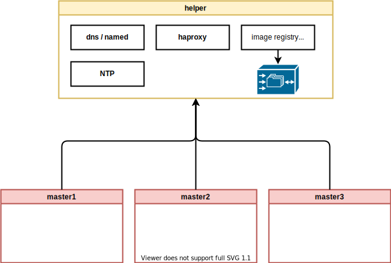

以下是本方案的架构设计： / The following is the architectural design of this scheme:

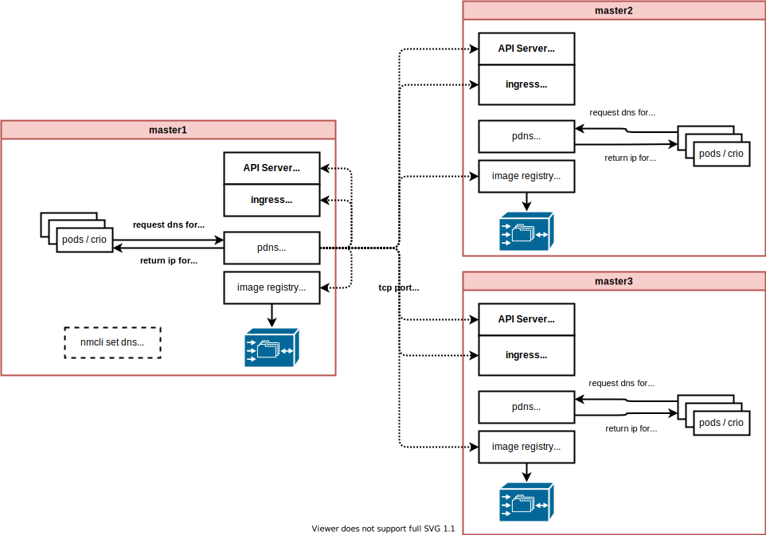

让我们开始吧。 / Let's begin

# on single node ocp

我们从最简单的单节点openshift 4 集群开始。我们的目标，是把helper上的以下组件，用openshift 4的单节点中的组件替代：

We start with the simplest single node openshift 4 cluster. Our goal is to replace the following components on the helper with components in a single node of openshift 4:

- dns -> pdns (power dns)
- image registry -> docker distribution

我们不考虑 haproxy ，是因为单节点，没有外部负载分担的需要。

We do not consider haproxy because it is a single node and there is no need for external load sharing.

而NTP服务，我们认为网络交换机/路由器可以提供。或者在SNO场景下，可以不用NTP服务。也可以在SNO节点上直接启动一个NTP服务都可以。

And NTP service, we think network switch/router can provide. Or in the SNO scenario, the NTP service may not be used. You can also directly start an NTP service on the SNO node.

这里是这个single node ocp的day-0的部署[过程记录](./4.10.sno.installer.embed.registry.md)。

Here is the [deployment process record](./4.10.sno.installer.embed.registry.md) of day-0 of this single node ocp.

以下是day-0的时候，部署的架构图： / The following is the architecture diagram of the deployment at day-0:

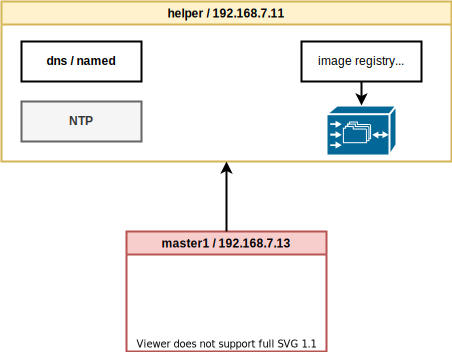

我们的目标，是通过day-2的操作，把他变成这个样子： / Our goal is to make it look like this through the operation of day-2:

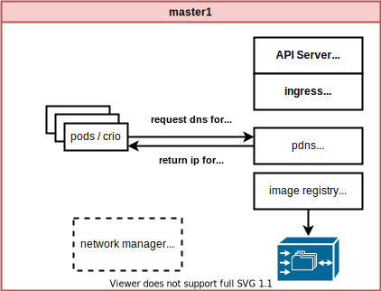

## prepare docker registry content

我们需要先准备以下离线镜像仓库，openshift支持了一个oc-mirror的工具，我们可以方便的使用。我们先把离线镜像仓库下载到文件中。留着后面使用。

We need to prepare the following offline mirror images first. Openshift supports an oc-mirror tool, which we can use easily. We first download the offline mirror repository to a file. Save it for later use.

```bash

# setup a stand alone docker registry
# on helper

cat > /data/ocp4/mirror.yaml << EOF
apiVersion: mirror.openshift.io/v1alpha1
kind: ImageSetConfiguration
# archiveSize: 4
mirror:
  ocp:
    channels:
      - name: stable-4.10
        versions:
          - '4.10.28'
          - '4.10.26'
  additionalImages:
    - name: registry.redhat.io/redhat/redhat-operator-index:v4.10
    - name: registry.redhat.io/redhat/certified-operator-index:v4.10
    - name: registry.redhat.io/redhat/community-operator-index:v4.10
    - name: registry.redhat.io/redhat/redhat-marketplace-index:v4.10

EOF

mkdir -p /data/install/mirror-tmp
cd /data/install/mirror-tmp

oc-mirror --config /data/ocp4/mirror.yaml file:///data/install/mirror-tmp

```

## build & upload podman image tar file

我们采用podman的方法加载服务，但是 podman/crio 在宿主机 reset 重启以后，会丢失全部container image , 于是，我们上传 podman image tar file ，然后在系统启动的时候，主动加载镜像。

We use the podman method to load the service, but podman/crio will lose all the container images after the host resets and restarts. Therefore, we upload the podman image tar file, and then automatically load the image when the system starts.

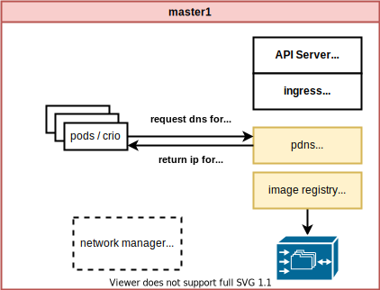

### build the podman image

Here we build the pdns podman image we will use.

```bash
mkdir -p /data/pdns/conf
cd /data/pdns

cat > /data/pdns/pdns.Dockerfile << EOF
FROM registry.access.redhat.com/ubi8

RUN dnf -y install https://dl.fedoraproject.org/pub/epel/epel-release-latest-8.noarch.rpm

RUN dnf -y update

RUN dnf -y install pdns pdns-recursor

ENTRYPOINT ["/usr/sbin/pdns_server"]
CMD ["--socket-dir=/tmp/pdns", "--guardian=no", "--daemon=no", "--disable-syslog", "--log-timestamp=no", "--write-pid=no"]
EOF

podman build --squash -t quay.io/nepdemo/pdns:4.6.2-ubi8 -f pdns.Dockerfile .

podman push quay.io/nepdemo/pdns:4.6.2-ubi8

podman pull quay.io/nepdemo/pdns:4.6.2-ubi8
podman save quay.io/nepdemo/pdns:4.6.2-ubi8 | pigz -c > pdns.tgz

podman pull docker.io/library/registry:2
podman save docker.io/library/registry:2 | pigz -c > registry.tgz

```

### upload podman image tar file

Then we upload the podman image tgz file to ocp node.

```bash

# make dir on sno
ssh root@192.168.7.13 "mkdir -p /var/wzh-static/"

# on helper
scp /data/ocp4/{pdns,registry}.tgz root@192.168.7.13:/var/wzh-static/

```

## embed registry on single node ocp

接下来，我们就做一些配置，把本地的镜像仓库激活。注意，这里面我们使用的是docker distribution， 我们把之前helper上的镜像仓库的证书拿来直接给他用，这样之后，我们只要更改dns指向就可以了。

Next, we will do some configuration to activate the local mirror registry. Note that we are using the docker distribution here. We use the certificate of the image registry on the helper directly for it to use. After that, we only need to change the dns point.

我们的配置文件位于/etc下面, 上传的镜像位于/var下面，那么节点重启，集群升级，这些目录会不会被重置呢？目前的实测表明不会，按照文档的说法，/etc下面的内容，在升级的时候会进行合并，/var下面的内容，会保留。

Our configuration file is located under /etc, and the uploaded image is located under /var. Then, if the node is restarted and the cluster is upgraded, will these directories be reset? The current testing shows that it will not. According to the document, the content under /etc will be merged during the upgrade, and the content under /var will be retained.

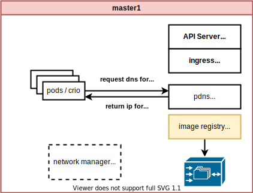

```bash

export BASE_DIR='/home/sno/'
export VAR_CERT_DIR=/etc/crts/

echo "obase=8;ibase=10;420" | bc
# 644

echo "obase=10;ibase=8;700" | bc
# 448

#########################
# run with root
# to grant read access to key
chmod og+r $VAR_CERT_DIR/redhat.ren.key
#########################

cat << EOF > ${BASE_DIR}/data/sno/registry.images.bu
variant: openshift
version: 4.10.0
metadata:
  labels:
    machineconfiguration.openshift.io/role: master
  name: 99-zzz-master-registry
storage:
  files:
    - path: /etc/wzh/redhat.ren.crt
      overwrite: true
      contents:
        source: data:text/plain;charset=utf-8;base64,$( base64 -w 0 < ${VAR_CERT_DIR}/redhat.ren.crt )
      mode: 420
      user:
        name: root

    - path: /etc/wzh/redhat.ren.key
      overwrite: true
      contents:
        source: data:text/plain;charset=utf-8;base64,$( base64 -w 0 < ${VAR_CERT_DIR}/redhat.ren.key )
      mode: 420
      user:
        name: root

    - path: /etc/wzh/registry-config.yml
      overwrite: true
      contents:
        inline: |
          version: 0.1
          log:
            accesslog:
                disabled: true
            fields:
                service: registry
          storage:
              cache:
                  layerinfo: inmemory
              filesystem:
                  rootdirectory: /var/wzh-registry
              delete:
                  enabled: true
              maintenance:
                  readonly:
                      enabled: false
          http:
              addr: :8443
              tls:
                certificate: /etc/wzh/redhat.ren.crt
                key: /etc/wzh/redhat.ren.key
      mode: 420
      user:
        name: root

systemd:
  units:
    - contents: |
        [Unit]
        Description=Set SELinux chcon for image registry
        Before=docker-distribution.service

        [Service]
        Type=oneshot
        RemainAfterExit=yes
        User=root
        ExecStartPre=-mkdir -p /var/wzh-registry
        ExecStart=/usr/bin/chcon -Rt container_file_t /var/wzh-registry

        [Install]
        WantedBy=multi-user.target
      enabled: true
      name: hostpath-registry.service

    - contents: |
        [Unit]
        Description=v2 Registry server for Docker
        After=network.target hostpath-registry.service crio-wipe.service
        Requires=hostpath-registry.service crio-wipe.service
        Before=kubelet.service

        [Service]
        Type=simple
        TimeoutStartSec=5m
        ExecStartPre=-/usr/bin/podman load -i /var/wzh-static/registry.tgz
        ExecStartPre=-/bin/rm -f %t/%n-pid %t/%n-cid
        ExecStart=/usr/bin/podman run \
            --name local-registry \
            --network=host \
            -v /var/wzh-registry/:/var/lib/registry:z \
            -v /etc/wzh:/certs:z \
            -e REGISTRY_HTTP_ADDR=0.0.0.0:8443 \
            -e REGISTRY_HTTP_TLS_CERTIFICATE=/certs/redhat.ren.crt \
            -e REGISTRY_HTTP_TLS_KEY=/certs/redhat.ren.key \
            --conmon-pidfile %t/%n-pid \
            --cidfile %t/%n-cid \
            --cgroups=no-conmon \
            --replace \
            docker.io/library/registry:2

        ExecStop=-/usr/bin/podman stop --ignore --cidfile %t/%n-cid -t 1
        ExecStopPost=-/usr/bin/podman rm --ignore -f --cidfile %t/%n-cid
        PIDFile=%t/%n-pid
        KillMode=none
        Restart=always
        RestartSec=30

        [Install]
        WantedBy=multi-user.target
      enabled: true
      name: docker-distribution.service

    - name: kubelet.service
      dropins:
      - name: 99-after-registry.conf
        contents: |
          [Unit]
          Requires=docker-distribution.service
          After=docker-distribution.service

EOF

butane ${BASE_DIR}/data/sno/registry.images.bu > ${BASE_DIR}/data/sno/99-zzz-master-registry.yaml

oc create --save-config -f ${BASE_DIR}/data/sno/99-zzz-master-registry.yaml

# oc apply -f ${BASE_DIR}/data/sno/99-zzz-master-registry.yaml
# oc delete -f ${BASE_DIR}/data/sno/99-zzz-master-registry.yaml

```

## upload registry content

有了镜像仓库，我们就把之前下载的离线镜像文件，导入到节点内置的镜像仓库中。

With the mirror registry, we import the offline mirror file downloaded before into the built-in mirror registry of the node.


```bash
# on helper
oc-mirror --dest-skip-tls --from mirror_seq1_000000.tar docker://192.168.7.13:8443

```

## (optional) update registry config to read only

我们的离线镜像上传了，就不希望别别人改掉，那么我们可以把本地的镜像仓库设置成只读模式。

Our offline mirror is uploaded, and we don't want others to change it, then we can set the local mirror repository to read-only mode.

```bash
cat << EOF > ${BASE_DIR}/data/sno/registry.images.bu
variant: openshift
version: 4.10.0
metadata:
  labels:
    machineconfiguration.openshift.io/role: master
  name: 99-zzz-master-registry
storage:
  files:
    - path: /etc/wzh/redhat.ren.crt
      overwrite: true
      contents:
        source: data:text/plain;charset=utf-8;base64,$( base64 -w 0 < ${VAR_CERT_DIR}/redhat.ren.crt )
      mode: 420
      user:
        name: root

    - path: /etc/wzh/redhat.ren.key
      overwrite: true
      contents:
        source: data:text/plain;charset=utf-8;base64,$( base64 -w 0 < ${VAR_CERT_DIR}/redhat.ren.key )
      mode: 420
      user:
        name: root

    - path: /etc/wzh/registry-config.yml
      overwrite: true
      contents:
        inline: |
          version: 0.1
          log:
            accesslog:
                disabled: true
            fields:
                service: registry
          storage:
              cache:
                  layerinfo: inmemory
              filesystem:
                  rootdirectory: /var/wzh-registry
              delete:
                  enabled: false
              maintenance:
                  readonly:
                      enabled: true
          http:
              addr: :5443
              tls:
                certificate: /etc/wzh/redhat.ren.crt
                key: /etc/wzh/redhat.ren.key
      mode: 420
      user:
        name: root

systemd:
  units:
    - contents: |
        [Unit]
        Description=Set SELinux chcon for image registry
        Before=docker-distribution.service

        [Service]
        Type=oneshot
        RemainAfterExit=yes
        User=root
        ExecStartPre=-mkdir -p /var/wzh-registry
        ExecStart=/usr/bin/chcon -Rt container_file_t /var/wzh-registry

        [Install]
        WantedBy=multi-user.target
      enabled: true
      name: hostpath-registry.service

    - contents: |
        [Unit]
        Description=v2 Registry server for Docker
        After=network.target hostpath-registry.service crio-wipe.service
        Requires=hostpath-registry.service crio-wipe.service
        Before=kubelet.service

        [Service]
        Type=simple
        ExecStart=/usr/bin/registry serve /etc/wzh/registry-config.yml

        [Install]
        WantedBy=multi-user.target
      enabled: true
      name: docker-distribution.service

    - name: kubelet.service
      dropins:
      - name: 99-after-registry.conf
        contents: |
          [Unit]
          Requires=docker-distribution.service
          After=docker-distribution.service

EOF

butane ${BASE_DIR}/data/sno/registry.images.bu > ${BASE_DIR}/data/sno/99-zzz-master-registry.yaml

oc apply -f ${BASE_DIR}/data/sno/99-zzz-master-registry.yaml

```

## deploy power dns (pdns) as local dns service

我们配置本地的power dns，把我们需要的dns记录都写进去，并且配置它在kubelet之前启动。

We configure the local power dns, write all the dns records we need, and configure it to start before the kubelet.

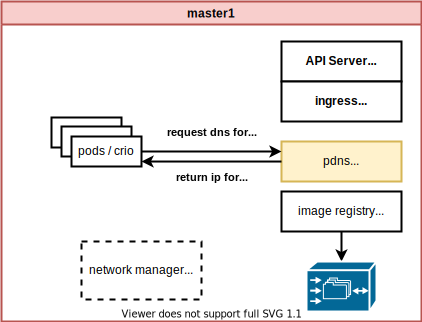

```bash

oc patch mcp/master --patch '{"spec":{"paused":true}}' --type=merge
oc patch mcp/worker --patch '{"spec":{"paused":true}}' --type=merge

cat > ${BASE_DIR}/data/sno/pdns.bu << 'EOF' 
variant: openshift
version: 4.10.0
metadata:
  labels:
    machineconfiguration.openshift.io/role: master
  name: 99-zzz-master-pdns
storage:
  files:
    - path: /etc/pdns/pdns.conf
      overwrite: true
      contents:
        inline: |
          launch=bind
          local-address=0.0.0.0
          local-port=53
          setgid=pdns
          setuid=pdns
          bind-config=/etc/pdns/bind.conf
          bind-check-interval=300
          enable-lua-records=yes
      mode: 420
      user:
        name: root

    - path: /etc/pdns/bind.conf
      overwrite: true
      contents:
        inline: |
          zone "acm-demo-hub.redhat.ren" { type master; file "/etc/pdns/inside-out.xyz"; };
          zone "infra.redhat.ren" { type master; file "/etc/pdns/infra.xyz"; };
      mode: 420
      user:
        name: root

    - path: /etc/pdns/inside-out.xyz
      overwrite: true
      contents:
        inline: |
          $TTL 10 
          @ IN SOA ns1.acm-demo-hub.redhat.ren. postmaster.acm-demo-hub.redhat.ren. (
                  2014080704 ; Serial Number (date YYYYMMDD++) 
                  3H              ; refresh (3 hours)
                  30M             ; retry (30 minutes)
                  2W              ; expiry (2 weeks)
                  1W )            ; minimum (1 week)
                  ;IN NS ns1.ocp4.redhat.ren.
                  ;IN NS ns2.ocp4.redhat.ren.
          @       IN    A    192.168.7.13
          ;ns1     IN A 8.8.8.8 
          ;ns2     IN A 8.8.4.4
          helper  IN      A       192.168.7.11
          ;
          ;
          ; The api points to the IP of your load balancer
          api             IN    A    192.168.7.13
          api-int         IN    A    192.168.7.13
          ;
          ; The wildcard also points to the load balancer
          *.apps          IN    A    192.168.7.13
          ;
          ; Create entry for the bootstrap host
          ; bootstrap       IN      A       192.168.7.12
          ;
          ; Create entries for the master hosts
          master-0                IN      A       192.168.7.13
          ;master-1                IN      A       192.168.7.14
          ;master-2                IN      A       192.168.7.15
          ;
          ; Create entries for the worker hosts
          ;worker-0                IN      A       192.168.7.16
          ;worker-1                IN      A       192.168.7.17
          ;worker-2                IN      A       192.168.7.18
          ;
          ; The ETCd cluster lives on the masters...so point these to the IP of the masters
          ;etcd-0  IN      A       192.168.7.13
          ;etcd-1  IN      A       192.168.7.14
          ;etcd-2  IN      A       192.168.7.15
          ;
          ; Create entries for the other hosts
          registry        IN      A       192.168.7.13
          yum             IN      A       192.168.7.1
          nexus           IN      A       192.168.7.1
          git             IN      A       192.168.7.11
          tmp-registry    IN      A       192.168.7.177
      mode: 420
      user:
        name: root

    - path: /etc/pdns/infra.xyz
      overwrite: true
      contents:
        inline: |
          $TTL 10 
          @ IN SOA ns1.infra.redhat.ren. postmaster.infra.redhat.ren. (
                  2014080704 ; Serial Number (date YYYYMMDD++) 
                  3H              ; refresh (3 hours)
                  30M             ; retry (30 minutes)
                  2W              ; expiry (2 weeks)
                  1W )            ; minimum (1 week)
                  ;IN NS ns1.ocp4.redhat.ren.
                  ;IN NS ns2.ocp4.redhat.ren.
          @       IN    A    192.168.7.13
          quaylab         IN    A    192.168.7.13

      mode: 420
      user:
        name: root
systemd:
  units:
    - contents: |
        [Unit]
        Description=PowerDNS Authoritative Server
        After=network.target crio-wipe.service
        Requires=crio-wipe.service
        Before=kubelet.service

        [Service]
        Type=simple
        TimeoutStartSec=5m
        ExecStartPre=-/usr/bin/podman load -i /var/wzh-static/pdns.tgz
        ExecStartPre=-/bin/rm -f %t/%n-pid %t/%n-cid
        ExecStart=/usr/bin/podman run \
            --name local-pdns \
            --network=host \
            -v /etc/pdns/:/etc/pdns/:z \
            --conmon-pidfile %t/%n-pid \
            --cidfile %t/%n-cid \
            --cgroups=no-conmon \
            --replace \
            quay.io/nepdemo/pdns:4.6.2-ubi8

        ExecStop=-/usr/bin/podman stop --ignore --cidfile %t/%n-cid -t 1
        ExecStopPost=-/usr/bin/podman rm --ignore -f --cidfile %t/%n-cid
        PIDFile=%t/%n-pid
        KillMode=none
        Restart=always
        SyslogIdentifier=pdns_server
        RestartSec=1
        StartLimitInterval=0
        RuntimeDirectory=pdns

        [Install]
        WantedBy=multi-user.target
      name: pdns.service
      enabled: true

    - name: kubelet.service
      dropins:
      - name: 99-after-pdns.conf
        contents: |
          [Unit]
          Requires=pdns.service
          After=pdns.service

EOF

butane ${BASE_DIR}/data/sno/pdns.bu > ${BASE_DIR}/data/sno/99-zzz-master-pdns.yaml

oc create --save-config -f ${BASE_DIR}/data/sno/99-zzz-master-pdns.yaml

# oc apply -f ${BASE_DIR}/data/sno/99-zzz-master-pdns.yaml

```

## update registry.conf to point to local registry

默认情况下，这一步并不需要，但是作者的集群装的时候，对registries.conf做过特殊的配置，这里面就要把镜像仓库重新调整以下。image.registries.conf.sh脚本的源代码在[这里](https://github.com/wangzheng422/openshift4-shell/blob/ocp-4.10/image.registries.conf.sh)。

By default, this step is not required, but when the author's cluster is installed, he has made special configuration to registries.conf, and the mirror warehouse needs to be readjusted as follows. The source code for the image.registries.conf.sh script is [here](https://github.com/wangzheng422/openshift4-shell/blob/ocp-4.10/image.registries.conf.sh).

```bash

######################
# run as root
cd /data/ocp4
bash image.registries.conf.sh quaylab.infra.redhat.ren:8443
######################

oc apply -f /data/ocp4/99-worker-container-registries.yaml
oc apply -f /data/ocp4/99-master-container-registries.yaml

```


## set sno dns to local dns service

更改single node ocp的dns配置，根据集群安装的方法不同而不同。本次实验的集群的安装方法在[这里](4.10.sno.installer.embed.registry.md)，于是我们就这样来更改dns指向。

Change the dns configuration of the single node ocp, which varies according to the method of cluster installation. The installation method of the cluster in this experiment is [here](4.10.sno.installer.embed.registry.md), so we will change the dns point like this.

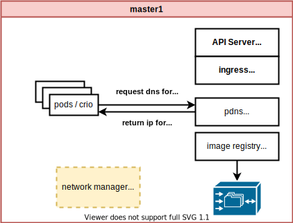

```bash

NTP_SERVER=192.168.7.11
HELP_SERVER=192.168.7.11
KVM_HOST=192.168.7.11
API_VIP=192.168.7.100
INGRESS_VIP=192.168.7.101
CLUSTER_PROVISION_IP=192.168.7.103
BOOTSTRAP_IP=192.168.7.12

ACM_DEMO_MNGED_CLUSTER=acm-demo1
ACM_DEMO_MNGED_SNO_IP=192.168.7.15

# 定义单节点集群的节点信息
SNO_CLUSTER_NAME=acm-demo-hub
SNO_BASE_DOMAIN=redhat.ren
SNO_IP=192.168.7.13
# ocp bug, gateway needs to be online, otherwise, ovn will mis-behaviour, and ingress failed to start.
SNO_GW=192.168.7.9
SNO_NETMAST=255.255.255.0
SNO_NETMAST_S=24
SNO_HOSTNAME=acm-demo-hub-master
SNO_IF=enp1s0
SNO_IF_MAC=`printf '00:60:2F:%02X:%02X:%02X' $[RANDOM%256] $[RANDOM%256] $[RANDOM%256]`
SNO_DNS=192.168.7.11
SNO_DISK=/dev/vda
SNO_CORE_PWD=redhat

export BASE_DIR='/home/sno/'

cat << EOF > ${BASE_DIR}/data/sno/static.ip.bu
variant: openshift
version: 4.9.0
metadata:
  labels:
    machineconfiguration.openshift.io/role: master
  name: 99-zzz-master-static-ip
storage:
  files:
    - path: /etc/NetworkManager/system-connections/${SNO_IF}.nmconnection
      mode: 0600
      overwrite: true
      contents:
        inline: |
          [connection]
          id=${SNO_IF}
          type=ethernet
          autoconnect-retries=1
          interface-name=${SNO_IF}
          multi-connect=1
          permissions=
          wait-device-timeout=60000

          [ethernet]
          mac-address-blacklist=

          [ipv4]
          address1=${SNO_IP}/${SNO_NETMAST_S=24},${SNO_GW}
          dhcp-hostname=${SNO_HOSTNAME}
          dhcp-timeout=90
          dns=${SNO_IP};
          dns-search=
          may-fail=false
          method=manual

          [ipv6]
          addr-gen-mode=eui64
          dhcp-hostname=${SNO_HOSTNAME}
          dhcp-timeout=90
          dns-search=
          method=disabled

          [proxy]

EOF

butane ${BASE_DIR}/data/sno/static.ip.bu > ${BASE_DIR}/data/sno/disconnected/99-zzz-master-ip.yaml

oc apply -f ${BASE_DIR}/data/sno/disconnected/99-zzz-master-ip.yaml

oc patch mcp/master --patch '{"spec":{"paused":false}}' --type=merge
oc patch mcp/worker --patch '{"spec":{"paused":false}}' --type=merge

```

## test with force power off

我们知道，如果ocp node意外断电的话，启动的时候，他会重新下载集群需要的基础镜像，那么我们就暴力断电，来测试sno能否启动吧。

We know that if the ocp node is accidentally powered off, it will re-download the basic image required by the cluster when it starts up, so we will power off violently to test whether the sno can be started.


重启之后，正常启动。 / After restarting, start normally.
```bash
podman ps
# CONTAINER ID  IMAGE                            COMMAND               CREATED             STATUS                 PORTS       NAMES
# 873d564654f8  docker.io/library/registry:2     /etc/docker/regis...  About a minute ago  Up About a minute ago              local-registry
# f10cf0c1b027  quay.io/nepdemo/pdns:4.6.2-ubi8  --socket-dir=/tmp...  About a minute ago  Up About a minute ago              local-pdns

oc get co
# NAME                                       VERSION   AVAILABLE   PROGRESSING   DEGRADED   SINCE   MESSAGE
# authentication                             4.10.26   True        False         False      30m
# baremetal                                  4.10.26   True        False         False      4d22h
# cloud-controller-manager                   4.10.26   True        False         False      4d22h
# cloud-credential                           4.10.26   True        False         False      4d22h
# cluster-autoscaler                         4.10.26   True        False         False      4d22h
# config-operator                            4.10.26   True        False         False      4d22h
# console                                    4.10.26   True        False         False      7m23s
# csi-snapshot-controller                    4.10.26   True        False         False      4d22h
# dns                                        4.10.26   True        False         False      20m
# etcd                                       4.10.26   True        False         False      4d22h
# image-registry                             4.10.26   True        False         False      4d22h
# ingress                                    4.10.26   True        False         False      4d22h
# insights                                   4.10.26   True        False         False      40s
# kube-apiserver                             4.10.26   True        False         False      4d22h
# kube-controller-manager                    4.10.26   True        False         False      4d22h
# kube-scheduler                             4.10.26   True        False         False      4d22h
# kube-storage-version-migrator              4.10.26   True        False         False      3d18h
# machine-api                                4.10.26   True        False         False      4d22h
# machine-approver                           4.10.26   True        False         False      4d22h
# machine-config                             4.10.26   True        False         False      4d22h
# marketplace                                4.10.26   True        False         False      4d22h
# monitoring                                 4.10.26   True        False         False      4d22h
# network                                    4.10.26   True        False         False      4d22h
# node-tuning                                4.10.26   True        False         False      30m
# openshift-apiserver                        4.10.26   True        False         False      3d22h
# openshift-controller-manager               4.10.26   True        False         False      2d19h
# openshift-samples                          4.10.26   True        False         False      3d23h
# operator-lifecycle-manager                 4.10.26   True        False         False      4d22h
# operator-lifecycle-manager-catalog         4.10.26   True        False         False      4d22h
# operator-lifecycle-manager-packageserver   4.10.26   True        False         False      7m48s
# service-ca                                 4.10.26   True        False         False      4d22h
# storage                                    4.10.26   True        False         False      4d22h

```

## test with ocp upgrade

我们上传的镜像，包括了4.10.26, 4.10.28两个版本，那么我们就来试试升级吧

The images we uploaded include two versions: 4.10.26 and 4.10.28, so let's try to upgrade

```bash
rpm-ostree status
# State: idle
# Deployments:
# ● pivot://quay.io/openshift-release-dev/ocp-v4.0-art-dev@sha256:23d0609643c25efcd30a7a64483fdee2343ced26b1fd08c0cbf8d03a5d405939
#               CustomOrigin: Managed by machine-config-operator
#                    Version: 410.84.202208030316-0 (2022-08-03T03:19:21Z)

#   ostree://5d0c3f8af7d3cdb694d21a53041c692aea6ef7a1b620aa637c697ec7f37b029b
#                    Version: 410.84.202205191234-0 (2022-05-19T12:37:38Z)

# upgrade ocp to 4.10.28
oc adm upgrade \
  --to-image=quay.io/openshift-release-dev/ocp-release@sha256:2127608ebd67a2470860c42368807a0de2308dba144ec4c298bec1c03d79cb52 \
  --allow-explicit-upgrade --allow-upgrade-with-warnings=true --force=true 

# after upgrade and reboot
rpm-ostree status
# State: idle
# Deployments:
# ● pivot://quay.io/openshift-release-dev/ocp-v4.0-art-dev@sha256:822737b305b28aa4890f7bf847ebebc896cd7b549318195fc8c953ae3008cc44
#               CustomOrigin: Managed by machine-config-operator
#                    Version: 410.84.202208161501-0 (2022-08-16T15:04:45Z)

#   pivot://quay.io/openshift-release-dev/ocp-v4.0-art-dev@sha256:23d0609643c25efcd30a7a64483fdee2343ced26b1fd08c0cbf8d03a5d405939
#               CustomOrigin: Managed by machine-config-operator
#                    Version: 410.84.202208030316-0 (2022-08-03T03:19:21Z)

oc get co
# NAME                                       VERSION   AVAILABLE   PROGRESSING   DEGRADED   SINCE   MESSAGE
# authentication                             4.10.28   True        False         False      26m
# baremetal                                  4.10.28   True        False         False      130m
# cloud-controller-manager                   4.10.28   True        False         False      130m
# cloud-credential                           4.10.28   True        False         False      154m
# cluster-autoscaler                         4.10.28   True        False         False      130m
# config-operator                            4.10.28   True        False         False      142m
# console                                    4.10.28   True        False         False      26m
# csi-snapshot-controller                    4.10.28   True        False         False      32m
# dns                                        4.10.28   True        False         False      26m
# etcd                                       4.10.28   True        False         False      138m
# image-registry                             4.10.28   True        False         False      36m
# ingress                                    4.10.28   True        False         False      141m
# insights                                   4.10.28   True        False         False      17s
# kube-apiserver                             4.10.28   True        False         False      131m
# kube-controller-manager                    4.10.28   True        False         False      136m
# kube-scheduler                             4.10.28   True        False         False      133m
# kube-storage-version-migrator              4.10.28   True        False         False      141m
# machine-api                                4.10.28   True        False         False      130m
# machine-approver                           4.10.28   True        False         False      141m
# machine-config                             4.10.28   True        False         False      138m
# marketplace                                4.10.28   True        False         False      141m
# monitoring                                 4.10.28   True        False         False      35m
# network                                    4.10.28   True        False         False      142m
# node-tuning                                4.10.28   True        False         False      36m
# openshift-apiserver                        4.10.28   True        False         False      36m
# openshift-controller-manager               4.10.28   True        False         False      131m
# openshift-samples                          4.10.28   True        False         False      36m
# operator-lifecycle-manager                 4.10.28   True        False         False      130m
# operator-lifecycle-manager-catalog         4.10.28   True        False         False      130m
# operator-lifecycle-manager-packageserver   4.10.28   True        False         False      104m
# service-ca                                 4.10.28   True        False         False      141m
# storage                                    4.10.28   True        False         False      130m

```

我们可以看到，能够正常的升级和启动。

We can see that it can be upgraded and started normally.

# 3 node cluster

接下来，我们尝试 3 node openshift / compact cluster。我们的目标，是把helper上的以下组件，用openshift 4的节点中的组件替代：

Next, we try a 3 node openshift / compact cluster. Our goal is to replace the following components on the helper with components in the openshift 4 node:

- dns -> pdns (power dns)
- haproxy -> pdns lua plugin (ifportup)
- image registry -> docker distribution

而NTP服务，我们依然认为网络交换机/路由器可以提供。

And NTP service, we still think that network switch/router can provide.

## upload podman image tar file

这个步骤，和single node ocp是一样的，只不过需要在 3 master 上都执行一遍。

This step is the same as single node ocp, except that it needs to be executed on all 3 masters. 

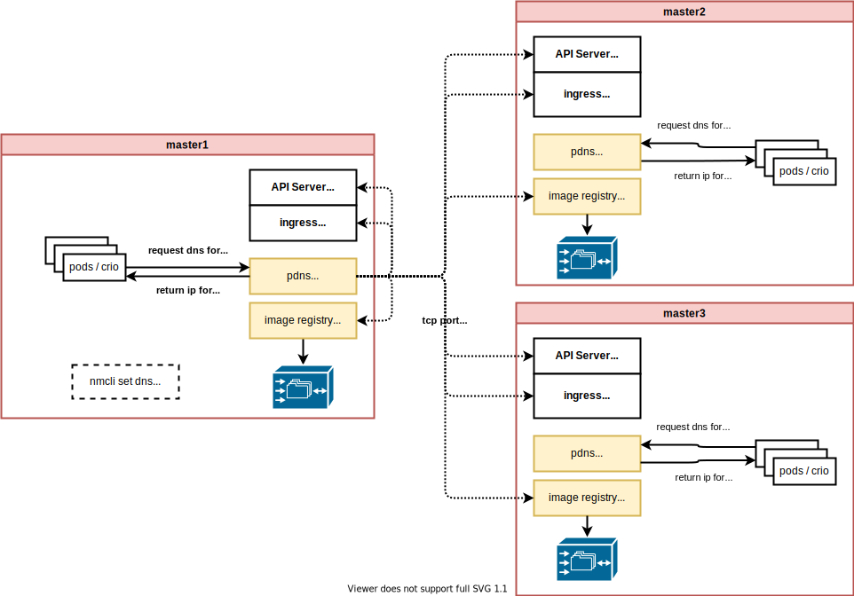

```bash

# make dir on each node, and copy file into
for i in 23 24 25 
do
  ssh root@192.168.7.$i "mkdir -p /var/wzh-static/"
  scp /data/ocp4/{pdns,registry}.tgz root@192.168.7.$i:/var/wzh-static/
done

```

## embed registry on each ocp node

这个步骤，也和 single node ocp是一样的。

This step is also the same as single node ocp.

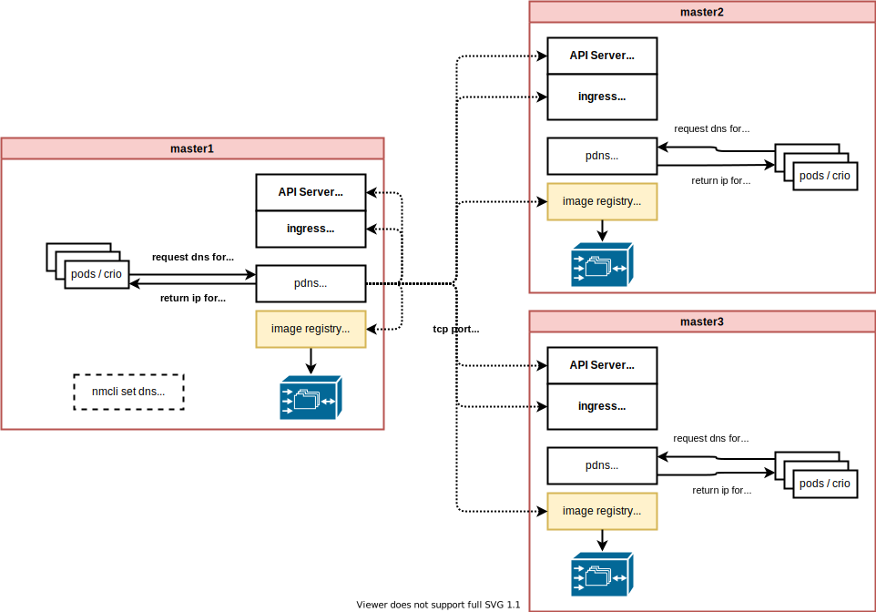

```bash

export BASE_DIR='/home/3node/'
export VAR_CERT_DIR=/etc/crts/

# ......

# check the result
for i in 23 24 25
do
  ssh root@192.168.7.$i podman ps
done
# Warning: Permanently added '192.168.7.23' (ECDSA) to the list of known hosts.
# CONTAINER ID  IMAGE                         COMMAND               CREATED         STATUS             PORTS       NAMES
# b5698bf26d9b  docker.io/library/registry:2  /etc/docker/regis...  17 minutes ago  Up 17 minutes ago              local-registry
# Warning: Permanently added '192.168.7.24' (ECDSA) to the list of known hosts.
# CONTAINER ID  IMAGE                         COMMAND               CREATED         STATUS             PORTS       NAMES
# 5bdba2455860  docker.io/library/registry:2  /etc/docker/regis...  13 minutes ago  Up 13 minutes ago              local-registry
# Warning: Permanently added '192.168.7.25' (ECDSA) to the list of known hosts.
# CONTAINER ID  IMAGE                         COMMAND               CREATED        STATUS            PORTS       NAMES
# 1269f3943c3d  docker.io/library/registry:2  /etc/docker/regis...  7 minutes ago  Up 7 minutes ago              local-registry

```

## upload registry content

这个步骤，和single node ocp是一样的，只不过需要为 3 master 都执行一遍。

This step is the same as single node ocp, but it needs to be executed for all 3 masters.

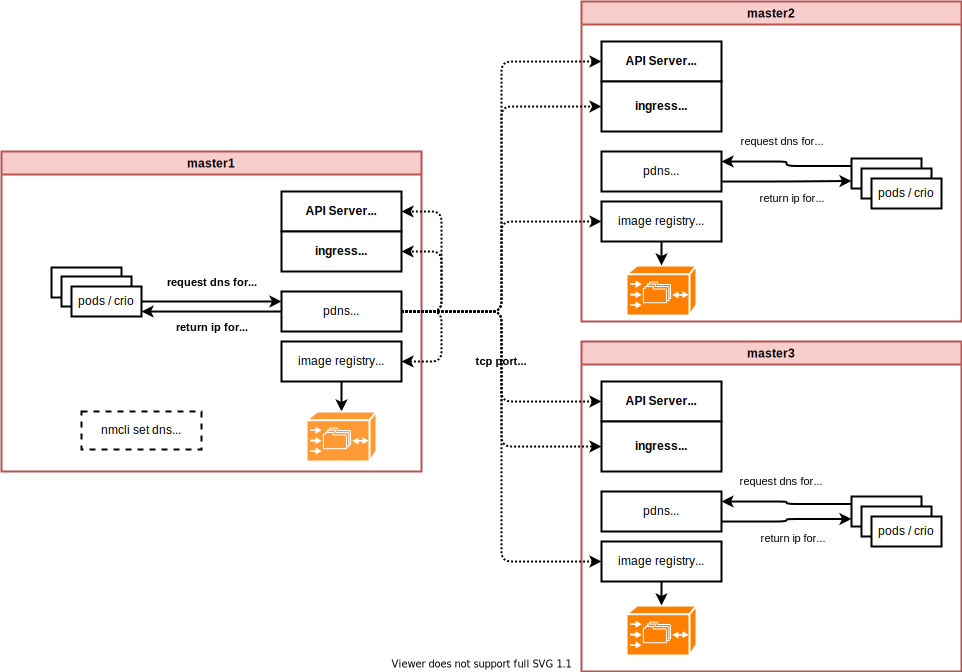

```bash

for i in 23 24 25 
do
  oc-mirror --dest-skip-tls --from mirror_seq1_000000.tar docker://192.168.7.$i:8443
done

```

## deploy power dns (pdns) as local dns service

我们配置本地的power dns，把我们需要的dns记录都写进去，并且配置它在kubelet之前启动。这一步和之前的single node ocp不一样，需要用到pdns lua plugin，用 ifportup 的方法，探测对应节点上的端口是否打开，如果没有打开，认为对应的服务没有启动，或者节点掉线，然后 pdns 就不会返回对应节点的解析。我们用这种方法，来代替haproxy。

We configure the local power dns, write all the dns records we need, and configure it to start before the kubelet. This step is different from the previous single node ocp. You need to use the pdns lua plugin. Use the ifportup method to detect whether the port on the corresponding node is open. If it is not open, it is considered that the corresponding service is not started, or the node is offline, and then pdns The parsing of the corresponding node will not be returned. We use this method to replace haproxy.


```bash

cat > ${BASE_DIR}/data/sno/pdns.bu << 'EOF' 
variant: openshift
version: 4.10.0
metadata:
  labels:
    machineconfiguration.openshift.io/role: master
  name: 99-zzz-master-pdns
storage:
  files:
    - path: /etc/pdns/pdns.conf
      overwrite: true
      contents:
        inline: |
          launch=bind
          local-address=0.0.0.0
          local-port=53
          setgid=pdns
          setuid=pdns
          bind-config=/etc/pdns/bind.conf
          bind-check-interval=300
          enable-lua-records=yes
      mode: 420
      user:
        name: root

    - path: /etc/pdns/bind.conf
      overwrite: true
      contents:
        inline: |
          zone "acm-demo-one.redhat.ren" { type master; file "/etc/pdns/inside-out.xyz"; };
          zone "infra.redhat.ren" { type master; file "/etc/pdns/infra.xyz"; };
      mode: 420
      user:
        name: root

    - path: /etc/pdns/inside-out.xyz
      overwrite: true
      contents:
        inline: |
          $TTL 10 
          @ IN SOA ns1.acm-demo-one.redhat.ren. postmaster.acm-demo-one.redhat.ren. (
                  2014080704 ; Serial Number (date YYYYMMDD++) 
                  3H              ; refresh (3 hours)
                  30M             ; retry (30 minutes)
                  2W              ; expiry (2 weeks)
                  1W )            ; minimum (1 week)
                  ;IN NS ns1.ocp4.redhat.ren.
                  ;IN NS ns2.ocp4.redhat.ren.
          @       IN    LUA    A    "ifportup(6443, {'192.168.7.23', '192.168.7.24', '192.168.7.25'})"
          ;ns1     IN A 8.8.8.8 
          ;ns2     IN A 8.8.4.4
          helper  IN      A       192.168.7.11
          ;
          ;
          ; The api points to the IP of your load balancer
          api             IN    LUA    A    "ifportup(6443, {'192.168.7.23', '192.168.7.24', '192.168.7.25'})"
          api-int         IN    LUA    A    "ifportup(6443, {'192.168.7.23', '192.168.7.24', '192.168.7.25'})"
          ;
          ; The wildcard also points to the load balancer
          *.apps          IN    LUA    A    "ifportup(443, {'192.168.7.23', '192.168.7.24', '192.168.7.25'})"
          ;
          ; Create entry for the bootstrap host
          ; bootstrap       IN      A       192.168.7.12
          ;
          ; Create entries for the master hosts
          ;master-0                IN      A       192.168.7.13
          ;master-1                IN      A       192.168.7.14
          ;master-2                IN      A       192.168.7.15
          ;
          ; Create entries for the worker hosts
          ;worker-0                IN      A       192.168.7.16
          ;worker-1                IN      A       192.168.7.17
          ;worker-2                IN      A       192.168.7.18
          ;
          ; The ETCd cluster lives on the masters...so point these to the IP of the masters
          ;etcd-0  IN      A       192.168.7.13
          ;etcd-1  IN      A       192.168.7.14
          ;etcd-2  IN      A       192.168.7.15
          ;
          ; Create entries for the other hosts
          ;registry        IN    LUA    A    "ifportup(8443, {'192.168.7.13', '192.168.7.14', '192.168.7.15'})"
          ;yum             IN      A       192.168.7.1
          ;quay            IN    LUA    A    "ifportup(8443, {'192.168.7.13', '192.168.7.14', '192.168.7.15'})"
          nexus           IN      A       192.168.7.1
          git             IN      A       192.168.7.11
          tmp-registry    IN      A       192.168.7.177
      mode: 420
      user:
        name: root

    - path: /etc/pdns/infra.xyz
      overwrite: true
      contents:
        inline: |
          $TTL 10 
          @ IN SOA ns1.infra.redhat.ren. postmaster.infra.redhat.ren. (
                  2014080704 ; Serial Number (date YYYYMMDD++) 
                  3H              ; refresh (3 hours)
                  30M             ; retry (30 minutes)
                  2W              ; expiry (2 weeks)
                  1W )            ; minimum (1 week)
                  ;IN NS ns1.ocp4.redhat.ren.
                  ;IN NS ns2.ocp4.redhat.ren.
          @       IN    A    192.168.7.13
          quaylab         IN    LUA    A    "ifportup(8443, {'192.168.7.23', '192.168.7.24', '192.168.7.25'})"

      mode: 420
      user:
        name: root
systemd:
  units:
    - contents: |
        [Unit]
        Description=PowerDNS Authoritative Server
        After=network.target crio-wipe.service
        Requires=crio-wipe.service
        Before=kubelet.service

        [Service]
        Type=simple
        TimeoutStartSec=5m
        ExecStartPre=-/usr/bin/podman load -i /var/wzh-static/pdns.tgz
        ExecStartPre=-/bin/rm -f %t/%n-pid %t/%n-cid
        ExecStart=/usr/bin/podman run \
            --name local-pdns \
            --network=host \
            -v /etc/pdns/:/etc/pdns/:z \
            --conmon-pidfile %t/%n-pid \
            --cidfile %t/%n-cid \
            --cgroups=no-conmon \
            --replace \
            quay.io/nepdemo/pdns:4.6.2-ubi8

        ExecStop=-/usr/bin/podman stop --ignore --cidfile %t/%n-cid -t 1
        ExecStopPost=-/usr/bin/podman rm --ignore -f --cidfile %t/%n-cid
        PIDFile=%t/%n-pid
        KillMode=none
        Restart=always
        SyslogIdentifier=pdns_server
        RestartSec=1
        StartLimitInterval=0
        RuntimeDirectory=pdns

        [Install]
        WantedBy=multi-user.target
      name: pdns.service
      enabled: true

    - name: kubelet.service
      dropins:
      - name: 99-after-pdns.conf
        contents: |
          [Unit]
          Requires=pdns.service
          After=pdns.service

EOF

butane ${BASE_DIR}/data/sno/pdns.bu > ${BASE_DIR}/data/sno/99-zzz-master-pdns.yaml

oc create --save-config -f ${BASE_DIR}/data/sno/99-zzz-master-pdns.yaml

# oc apply -f ${BASE_DIR}/data/sno/99-zzz-master-pdns.yaml
# oc delete -f ${BASE_DIR}/data/sno/99-zzz-master-pdns.yaml

```

## update registry.conf to point to local registry

这个步骤，也和 single node ocp是一样的。根据集群的安装方法不同，而不同。

This step is also the same as single node ocp. It varies according to the installation method of the cluster.

```bash

######################
# run as root
cd /data/ocp4
bash image.registries.conf.sh quaylab.infra.redhat.ren:8443
######################

oc patch mcp/master --patch '{"spec":{"paused":true}}' --type=merge
oc patch mcp/worker --patch '{"spec":{"paused":true}}' --type=merge

oc apply -f /data/ocp4/99-worker-container-registries.yaml
oc apply -f /data/ocp4/99-master-container-registries.yaml

oc patch mcp/master --patch '{"spec":{"paused":false}}' --type=merge
oc patch mcp/worker --patch '{"spec":{"paused":false}}' --type=merge

```


## set sno dns to local dns service

把dns指向到本地的 power dns， 指向的方法根据集群安装的方法各不相同。作者的 3 node / compact cluster 是[这么安装的](4.10.3node.installer.embed.registry.md)，因为网络使用ovn，dns配置信息会在启动的时候，从网卡copy到 br-ex 上，所以作者需要在每个节点上，修改网卡的dns指向，然后重启。

Point the dns to the local power dns, the method of pointing varies according to the method of cluster installation. The author's 3 node / compact cluster is installed [like this](4.10.3node.installer.embed.registry.md). Because the network uses ovn, the dns configuration information will be copied from the network card to br-ex at startup, so the author needs to modify the dns point of the network card on each node. Then reboot.

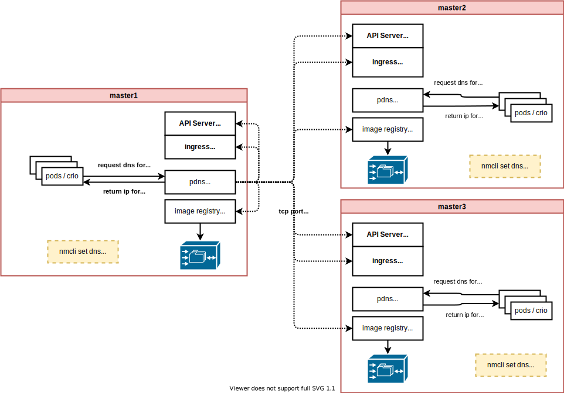

```bash

# for each node, set dns and reboot
for i in 23 24 25 
do
  ssh root@192.168.7.$i "nmcli con mod enp1s0 ipv4.dns 192.168.7.$i; reboot"
done

# after reboot, test the dns
dig @127.0.0.1 quaylab.infra.redhat.ren
# ; <<>> DiG 9.11.26-RedHat-9.11.26-4.el8_4 <<>> @127.0.0.1 quaylab.infra.redhat.ren
# ; (1 server found)
# ;; global options: +cmd
# ;; Got answer:
# ;; ->>HEADER<<- opcode: QUERY, status: NOERROR, id: 55590
# ;; flags: qr aa rd; QUERY: 1, ANSWER: 1, AUTHORITY: 0, ADDITIONAL: 1
# ;; WARNING: recursion requested but not available

# ;; OPT PSEUDOSECTION:
# ; EDNS: version: 0, flags:; udp: 1232
# ;; QUESTION SECTION:
# ;quaylab.infra.redhat.ren.      IN      A

# ;; ANSWER SECTION:
# quaylab.infra.redhat.ren. 10    IN      A       192.168.7.15

# ;; Query time: 7 msec
# ;; SERVER: 127.0.0.1#53(127.0.0.1)
# ;; WHEN: Thu Sep 15 02:23:09 UTC 2022
# ;; MSG SIZE  rcvd: 69


dig @127.0.0.1 api.acm-demo-one.redhat.ren
# ; <<>> DiG 9.11.26-RedHat-9.11.26-4.el8_4 <<>> @127.0.0.1 api.acm-demo-one.redhat.ren
# ; (1 server found)
# ;; global options: +cmd
# ;; Got answer:
# ;; ->>HEADER<<- opcode: QUERY, status: NOERROR, id: 12821
# ;; flags: qr aa rd; QUERY: 1, ANSWER: 1, AUTHORITY: 0, ADDITIONAL: 1
# ;; WARNING: recursion requested but not available

# ;; OPT PSEUDOSECTION:
# ; EDNS: version: 0, flags:; udp: 1232
# ;; QUESTION SECTION:
# ;api.acm-demo-one.redhat.ren.   IN      A

# ;; ANSWER SECTION:
# api.acm-demo-one.redhat.ren. 10 IN      A       192.168.7.25

# ;; Query time: 1 msec
# ;; SERVER: 127.0.0.1#53(127.0.0.1)
# ;; WHEN: Fri Sep 30 07:22:19 UTC 2022
# ;; MSG SIZE  rcvd: 72

dig @127.0.0.1 a.apps.acm-demo-one.redhat.ren
# ; <<>> DiG 9.11.26-RedHat-9.11.26-4.el8_4 <<>> @127.0.0.1 a.apps.acm-demo-one.redhat.ren
# ; (1 server found)
# ;; global options: +cmd
# ;; Got answer:
# ;; ->>HEADER<<- opcode: QUERY, status: NOERROR, id: 32885
# ;; flags: qr aa rd; QUERY: 1, ANSWER: 1, AUTHORITY: 0, ADDITIONAL: 1
# ;; WARNING: recursion requested but not available

# ;; OPT PSEUDOSECTION:
# ; EDNS: version: 0, flags:; udp: 1232
# ;; QUESTION SECTION:
# ;a.apps.acm-demo-one.redhat.ren.        IN      A

# ;; ANSWER SECTION:
# a.apps.acm-demo-one.redhat.ren. 10 IN   A       192.168.7.25

# ;; Query time: 1 msec
# ;; SERVER: 127.0.0.1#53(127.0.0.1)
# ;; WHEN: Fri Sep 30 07:23:02 UTC 2022
# ;; MSG SIZE  rcvd: 75

```

## test with force power off

我们知道，如果ocp node意外断电的话，启动的时候，他会重新下载集群需要的基础镜像，那么我们就暴力断电其中一个节点，来测试这个节点能否启动吧。

We know that if the ocp node is accidentally powered off, it will re-download the basic image required by the cluster when it starts up. Then we will violently power off one of the nodes to test whether the node can be started.

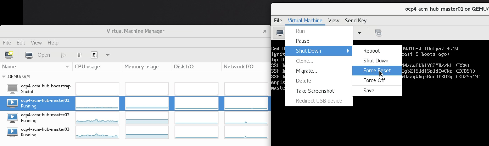

```bash
oc get mcp
# NAME     CONFIG                                             UPDATED   UPDATING   DEGRADED   MACHINECOUNT   READYMACHINECOUNT   UPDATEDMACHINECOUNT   DEGRADEDMACHINECOUNT   AGE
# master   rendered-master-80dda25e010fb6de88514875eefd7c19   True      False      False      3              3                   3                     0                      19h
# worker   rendered-worker-df248a1c64755ca00714f4f2b6d13e48   True      False      False      0              0                   0                     0                      19h

oc get node
# NAME             STATUS   ROLES           AGE   VERSION
# master-01-demo   Ready    master,worker   19h   v1.23.5+012e945
# master-02-demo   Ready    master,worker   19h   v1.23.5+012e945
# master-03-demo   Ready    master,worker   19h   v1.23.5+012e945

oc get co
# NAME                                       VERSION   AVAILABLE   PROGRESSING   DEGRADED   SINCE   MESSAGE
# authentication                             4.10.26   True        False         False      3m14s
# baremetal                                  4.10.26   True        False         False      19h
# cloud-controller-manager                   4.10.26   True        False         False      19h
# cloud-credential                           4.10.26   True        False         False      19h
# cluster-autoscaler                         4.10.26   True        False         False      19h
# config-operator                            4.10.26   True        False         False      19h
# console                                    4.10.26   True        False         False      3m58s
# csi-snapshot-controller                    4.10.26   True        False         False      19h
# dns                                        4.10.26   True        False         False      153m
# etcd                                       4.10.26   True        False         False      19h
# image-registry                             4.10.26   True        False         False      19h
# ingress                                    4.10.26   True        False         False      130m
# insights                                   4.10.26   True        False         False      55s
# kube-apiserver                             4.10.26   True        False         False      19h
# kube-controller-manager                    4.10.26   True        False         False      19h
# kube-scheduler                             4.10.26   True        False         False      19h
# kube-storage-version-migrator              4.10.26   True        False         False      71m
# machine-api                                4.10.26   True        False         False      19h
# machine-approver                           4.10.26   True        False         False      19h
# machine-config                             4.10.26   True        False         False      12h
# marketplace                                4.10.26   True        False         False      19h
# monitoring                                 4.10.26   True        False         False      19h
# network                                    4.10.26   True        False         False      19h
# node-tuning                                4.10.26   True        False         False      19h
# openshift-apiserver                        4.10.26   True        False         False      131m
# openshift-controller-manager               4.10.26   True        False         False      19h
# openshift-samples                          4.10.26   True        False         False      19h
# operator-lifecycle-manager                 4.10.26   True        False         False      19h
# operator-lifecycle-manager-catalog         4.10.26   True        False         False      19h
# operator-lifecycle-manager-packageserver   4.10.26   True        False         False      131m
# service-ca                                 4.10.26   True        False         False      19h
# storage                                    4.10.26   True        False         False      19h

```

测试结果，能正常启动。

The test result shows that it can be started normally.

## test showdown 1 master

我们关掉一个节点，然后看集群的状态

We shut down a node and see the status of the cluster

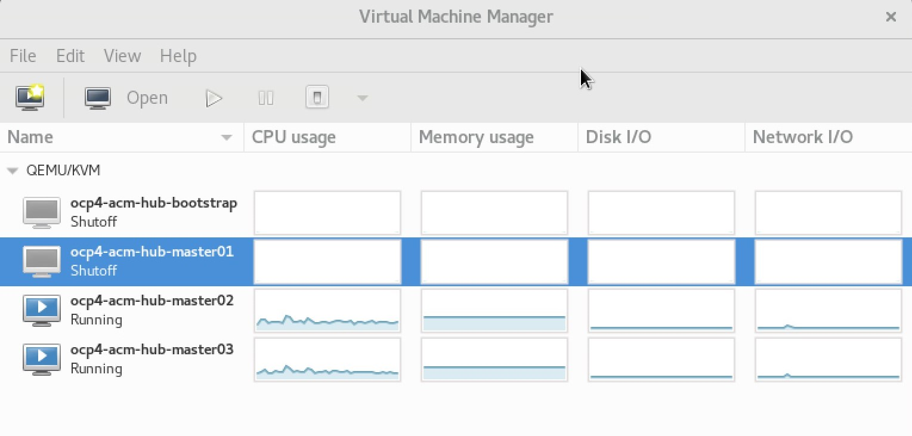

```bash
oc get node
# NAME             STATUS     ROLES           AGE   VERSION
# master-01-demo   NotReady   master,worker   19h   v1.23.5+012e945
# master-02-demo   Ready      master,worker   19h   v1.23.5+012e945
# master-03-demo   Ready      master,worker   19h   v1.23.5+012e945

oc get co
# NAME                                       VERSION   AVAILABLE   PROGRESSING   DEGRADED   SINCE   MESSAGE
# authentication                             4.10.26   True        False         False      8m5s
# baremetal                                  4.10.26   True        False         False      19h
# cloud-controller-manager                   4.10.26   True        False         False      19h
# cloud-credential                           4.10.26   True        False         False      19h
# cluster-autoscaler                         4.10.26   True        False         False      19h
# config-operator                            4.10.26   True        False         False      19h
# console                                    4.10.26   True        False         False      14m
# csi-snapshot-controller                    4.10.26   True        False         False      19h
# dns                                        4.10.26   True        True          False      164m    DNS "default" reports Progressing=True: "Have 2 available node-resolver pods, want 3."
# etcd                                       4.10.26   True        False         True       19h     ClusterMemberControllerDegraded: unhealthy members found during reconciling members...
# image-registry                             4.10.26   True        False         False      19h
# ingress                                    4.10.26   True        False         False      141m
# insights                                   4.10.26   True        False         False      93s
# kube-apiserver                             4.10.26   True        False         True       19h     NodeControllerDegraded: The master nodes not ready: node "master-01-demo" not ready since 2022-09-15 03:33:40 +0000 UTC because NodeStatusUnknown (Kubelet stopped posting node status.)
# kube-controller-manager                    4.10.26   True        False         True       19h     NodeControllerDegraded: The master nodes not ready: node "master-01-demo" not ready since 2022-09-15 03:33:40 +0000 UTC because NodeStatusUnknown (Kubelet stopped posting node status.)
# kube-scheduler                             4.10.26   True        False         True       19h     NodeControllerDegraded: The master nodes not ready: node "master-01-demo" not ready since 2022-09-15 03:33:40 +0000 UTC because NodeStatusUnknown (Kubelet stopped posting node status.)
# kube-storage-version-migrator              4.10.26   True        False         False      82m
# machine-api                                4.10.26   True        False         False      19h
# machine-approver                           4.10.26   True        False         False      19h
# machine-config                             4.10.26   True        False         False      12h
# marketplace                                4.10.26   True        False         False      19h
# monitoring                                 4.10.26   True        False         False      19h
# network                                    4.10.26   True        True          False      19h     DaemonSet "openshift-multus/multus" is not available (awaiting 1 nodes)...
# node-tuning                                4.10.26   True        False         False      19h
# openshift-apiserver                        4.10.26   True        False         False      8m
# openshift-controller-manager               4.10.26   True        False         False      19h
# openshift-samples                          4.10.26   True        False         False      19h
# operator-lifecycle-manager                 4.10.26   True        False         False      19h
# operator-lifecycle-manager-catalog         4.10.26   True        False         False      19h
# operator-lifecycle-manager-packageserver   4.10.26   True        False         False      142m
# service-ca                                 4.10.26   True        False         False      19h
# storage                                    4.10.26   True        False         False      19h


```

关闭了一个节点，集群还能工作。

After shutting down a node, the cluster still works.

看看web console能否使用？ / See if the web console can be used?

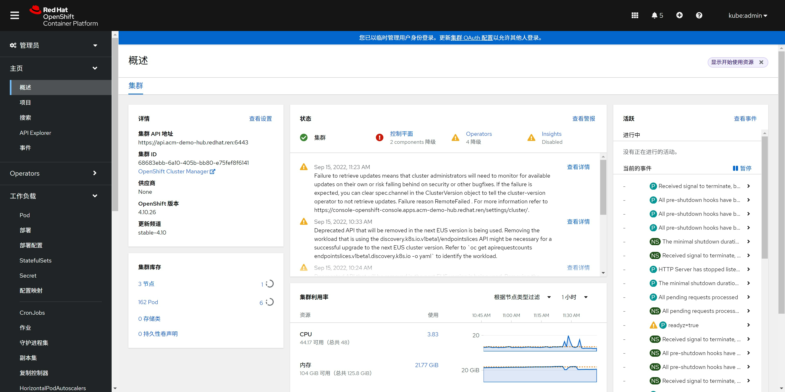

## test with ocp upgrade

我们上传的镜像，包括了4.10.26, 4.10.28两个版本，那么我们就来试试升级吧

The images we uploaded include two versions: 4.10.26 and 4.10.28, so let's try to upgrade

```bash
oc get node
# NAME             STATUS   ROLES           AGE   VERSION
# master-01-demo   Ready    master,worker   19h   v1.23.5+012e945
# master-02-demo   Ready    master,worker   19h   v1.23.5+012e945
# master-03-demo   Ready    master,worker   19h   v1.23.5+012e945

oc get clusterversion
# NAME      VERSION   AVAILABLE   PROGRESSING   SINCE   STATUS
# version   4.10.26   True        False         19h     Cluster version is 4.10.26

# upgrade ocp to 4.10.28
oc adm upgrade \
  --to-image=quay.io/openshift-release-dev/ocp-release@sha256:2127608ebd67a2470860c42368807a0de2308dba144ec4c298bec1c03d79cb52 \
  --allow-explicit-upgrade --allow-upgrade-with-warnings=true --force=true 

# after upgrade
oc get clusterversion
# NAME      VERSION   AVAILABLE   PROGRESSING   SINCE   STATUS
# version   4.10.28   True        False         43m     Cluster version is 4.10.28

oc get co
# NAME                                       VERSION   AVAILABLE   PROGRESSING   DEGRADED   SINCE   MESSAGE
# authentication                             4.10.28   True        False         False      62m
# baremetal                                  4.10.28   True        False         False      21h
# cloud-controller-manager                   4.10.28   True        False         False      21h
# cloud-credential                           4.10.28   True        False         False      22h
# cluster-autoscaler                         4.10.28   True        False         False      21h
# config-operator                            4.10.28   True        False         False      21h
# console                                    4.10.28   True        False         False      148m
# csi-snapshot-controller                    4.10.28   True        False         False      21h
# dns                                        4.10.28   True        False         False      4h58m
# etcd                                       4.10.28   True        False         False      21h
# image-registry                             4.10.28   True        False         False      21h
# ingress                                    4.10.28   True        False         False      4h35m
# insights                                   4.10.28   True        False         False      81s
# kube-apiserver                             4.10.28   True        False         False      21h
# kube-controller-manager                    4.10.28   True        False         False      21h
# kube-scheduler                             4.10.28   True        False         False      21h
# kube-storage-version-migrator              4.10.28   True        False         False      54m
# machine-api                                4.10.28   True        False         False      21h
# machine-approver                           4.10.28   True        False         False      21h
# machine-config                             4.10.28   True        False         False      129m
# marketplace                                4.10.28   True        False         False      21h
# monitoring                                 4.10.28   True        False         False      21h
# network                                    4.10.28   True        False         False      21h
# node-tuning                                4.10.28   True        False         False      100m
# openshift-apiserver                        4.10.28   True        False         False      142m
# openshift-controller-manager               4.10.28   True        False         False      21h
# openshift-samples                          4.10.28   True        False         False      98m
# operator-lifecycle-manager                 4.10.28   True        False         False      21h
# operator-lifecycle-manager-catalog         4.10.28   True        False         False      21h
# operator-lifecycle-manager-packageserver   4.10.28   True        False         False      4h36m
# service-ca                                 4.10.28   True        False         False      21h
# storage                                    4.10.28   True        False         False      21h

oc get mcp
# NAME     CONFIG                                             UPDATED   UPDATING   DEGRADED   MACHINECOUNT   READYMACHINECOUNT   UPDATEDMACHINECOUNT   DEGRADEDMACHINECOUNT   AGE
# master   rendered-master-24f4773e2eb47a6524572c1e7185e836   True      False      False      3              3                   3                     0                      21h
# worker   rendered-worker-28261f188bfcb7348c5f6aab2e876b2e   True      False      False      0              0                   0                     0                      21h

rpm-ostree status
# State: idle
# Deployments:
# ● pivot://quay.io/openshift-release-dev/ocp-v4.0-art-dev@sha256:822737b305b28aa4890f7bf847ebebc896cd7b549318195fc8c953ae3008cc44
#               CustomOrigin: Managed by machine-config-operator
#                    Version: 410.84.202208161501-0 (2022-08-16T15:04:45Z)

#   pivot://quay.io/openshift-release-dev/ocp-v4.0-art-dev@sha256:23d0609643c25efcd30a7a64483fdee2343ced26b1fd08c0cbf8d03a5d405939
#               CustomOrigin: Managed by machine-config-operator
#                    Version: 410.84.202208030316-0 (2022-08-03T03:19:21Z)

```
我们可以看到，升级成功，各个后安装的软件包也都在。

We can see that the upgrade is successful, and all the installed packages are also there.

web console工作也正常。 / The web console works fine too.

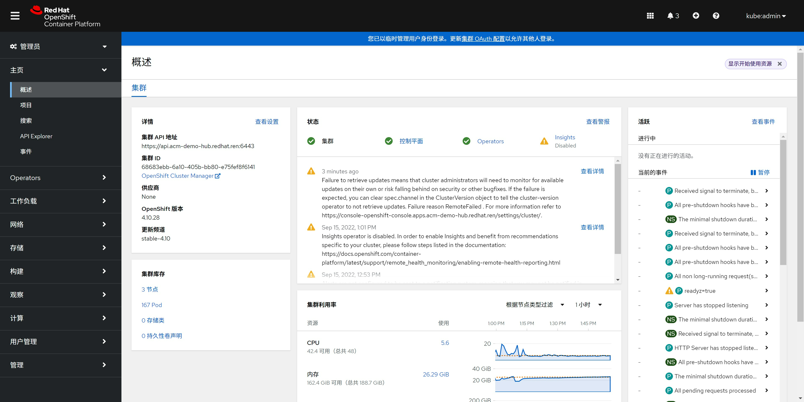

# finished

# notes

## research
```bash

yum install -y pdns pdns-recursor

mv /etc/pdns/pdns.conf /etc/pdns/pdns.conf.bak

cat << EOF > /etc/pdns/pdns.conf
launch=bind
local-address=127.0.0.1
local-port=5301
setgid=pdns
setuid=pdns
bind-config=/etc/pdns/bind.conf
bind-check-interval=300
enable-lua-records=yes
EOF

cat << EOF > /etc/pdns/bind.conf
zone "ocp4.redhat.ren" { type master; file "/etc/pdns/inside-out.xyz"; };
EOF

cat << 'EOF' > /etc/pdns/inside-out.xyz
$TTL 180 
@ IN SOA ns1.ocp4.redhat.ren. postmaster.ocp4.redhat.ren. (
        2014080704 ; Serial Number (date YYYYMMDD++) 
        3H              ; refresh (3 hours)
        30M             ; retry (30 minutes)
        2W              ; expiry (2 weeks)
        1W )            ; minimum (1 week)
        IN NS ns1.ocp4.redhat.ren.
        IN NS ns2.ocp4.redhat.ren.
@       IN    LUA    A    "ifportup(6443, {'192.168.7.13', '192.168.7.14', '192.168.7.15'})"
ns1     IN A 8.8.8.8 
ns2     IN A 8.8.4.4
helper  IN      A       192.168.7.11
;
;
; The api points to the IP of your load balancer
api             IN    LUA    A    "ifportup(6443, {'192.168.7.13', '192.168.7.14', '192.168.7.15'})"
api-int         IN    LUA    A    "ifportup(6443, {'192.168.7.13', '192.168.7.14', '192.168.7.15'})"
;
; The wildcard also points to the load balancer
*.apps          IN    LUA    A    "ifportup(443, {'192.168.7.13', '192.168.7.14', '192.168.7.15'})"
;
; Create entry for the bootstrap host
; bootstrap       IN      A       192.168.7.12
;
; Create entries for the master hosts
master-0                IN      A       192.168.7.13
master-1                IN      A       192.168.7.14
master-2                IN      A       192.168.7.15
;
; Create entries for the worker hosts
worker-0                IN      A       192.168.7.16
worker-1                IN      A       192.168.7.17
worker-2                IN      A       192.168.7.18
;
; The ETCd cluster lives on the masters...so point these to the IP of the masters
etcd-0  IN      A       192.168.7.13
etcd-1  IN      A       192.168.7.14
etcd-2  IN      A       192.168.7.15
;
; Create entries for the other hosts
registry        IN    LUA    A    "ifportup(5443, {'192.168.7.13', '192.168.7.14', '192.168.7.15'})"
yum             IN      A       192.168.7.1
quay            IN    LUA    A    "ifportup(5443, {'192.168.7.13', '192.168.7.14', '192.168.7.15'})"
nexus           IN      A       192.168.7.1
git             IN      A       192.168.7.11
tmp-registry    IN      A       192.168.7.177
EOF

# ausearch -c 'pdns_server' --raw | audit2allow -M my-pdnsserver
# semodule -X 300 -i my-pdnsserver.pp

# SELinux is preventing /usr/sbin/pdns_server from name_connect access on the tcp_socket port 6443.

# *****  Plugin connect_ports (92.2 confidence) suggests   *********************

# If you want to allow /usr/sbin/pdns_server to connect to network port 6443
# Then you need to modify the port type.
# Do
# # semanage port -a -t PORT_TYPE -p tcp 6443
#     where PORT_TYPE is one of the following: dns_port_t, dnssec_port_t, kerberos_port_t, ocsp_port_t.
#                                                                                                                                                                                                       *****  Plugin catchall_boolean (7.83 confidence) suggests   ******************

# If you want to allow system to run with NIS
# Then you must tell SELinux about this by enabling the 'nis_enabled' boolean.

# Do
# setsebool -P nis_enabled 1

# *****  Plugin catchall (1.41 confidence) suggests   **************************

# If you believe that pdns_server should be allowed name_connect access on the port 6443 tcp_socket by default.
# Then you should report this as a bug.
# You can generate a local policy module to allow this access.
# Do
# allow this access for now by executing:
# # ausearch -c 'pdns/distributo' --raw | audit2allow -M my-pdnsdistributo
# # semodule -X 300 -i my-pdnsdistributo.pp

systemctl enable --now pdns

pdnsutil check-all-zones

mv /etc/pdns-recursor/recursor.conf /etc/pdns-recursor/recursor.conf.bak

cat << EOF > /etc/pdns-recursor/recursor.conf
local-address=0.0.0.0 ::
allow-from=192.168.7.0/0    #允许所有用户端请求
dnssec=off    #关闭dnssec
forward-zones=ocp4.redhat.ren=127.0.0.1:5301 
forward-zones-recurse=.=114.114.114.114
setgid=pdns-recursor
setuid=pdns-recursor
security-poll-suffix=
EOF

systemctl enable --now pdns-recursor

ausearch -m avc --start recent -i

audit2allow -a -M wzh-pdns

semodule -i wzh-pdns.pp


systemctl restart pdns


dig @127.0.0.1 helper.ocp4.redhat.ren

dig @127.0.0.1 api.ocp4.redhat.ren

dig @127.0.0.1 c.apps.ocp4.redhat.ren

dig @127.0.0.1 registry.ocp4.redhat.ren

```

## test stand alone

```bash

dnf install -y epel-release

dnf install -y pdns pdns-recursor

dnf update -y

semodule -i wzh-pdns.pp

cat << EOF > /etc/pdns/pdns.conf
launch=bind
local-address=0.0.0.0 ::
# local-port=5301
setgid=pdns
setuid=pdns
bind-config=/etc/pdns/bind.conf
bind-check-interval=300
enable-lua-records=yes
EOF

cat << EOF > /etc/pdns/bind.conf
zone "ocp4.redhat.ren" { type master; file "/etc/pdns/inside-out.xyz"; };
EOF

cat << 'EOF' > /etc/pdns/inside-out.xyz
$TTL 180 
@ IN SOA ns1.ocp4.redhat.ren. postmaster.ocp4.redhat.ren. (
        2014080704 ; Serial Number (date YYYYMMDD++) 
        3H              ; refresh (3 hours)
        30M             ; retry (30 minutes)
        2W              ; expiry (2 weeks)
        1W )            ; minimum (1 week)
        IN NS ns1.ocp4.redhat.ren.
        IN NS ns2.ocp4.redhat.ren.
@       IN    LUA    A    "ifportup(6443, {'192.168.7.13', '192.168.7.14', '192.168.7.15'})"
ns1     IN A 8.8.8.8 
ns2     IN A 8.8.4.4
helper  IN      A       192.168.7.11
;
;
; The api points to the IP of your load balancer
api             IN    LUA    A    "ifportup(6443, {'192.168.7.13', '192.168.7.14', '192.168.7.15'})"
api-int         IN    LUA    A    "ifportup(6443, {'192.168.7.13', '192.168.7.14', '192.168.7.15'})"
;
; The wildcard also points to the load balancer
*.apps          IN    LUA    A    "ifportup(443, {'192.168.7.13', '192.168.7.14', '192.168.7.15'})"
;
; Create entry for the bootstrap host
; bootstrap       IN      A       192.168.7.12
;
; Create entries for the master hosts
master-0                IN      A       192.168.7.13
master-1                IN      A       192.168.7.14
master-2                IN      A       192.168.7.15
;
; Create entries for the worker hosts
worker-0                IN      A       192.168.7.16
worker-1                IN      A       192.168.7.17
worker-2                IN      A       192.168.7.18
;
; The ETCd cluster lives on the masters...so point these to the IP of the masters
etcd-0  IN      A       192.168.7.13
etcd-1  IN      A       192.168.7.14
etcd-2  IN      A       192.168.7.15
;
; Create entries for the other hosts
registry        IN    LUA    A    "ifportup(5443, {'192.168.7.13', '192.168.7.14', '192.168.7.15'})"
yum             IN      A       192.168.7.1
quay            IN    LUA    A    "ifportup(5443, {'192.168.7.13', '192.168.7.14', '192.168.7.15'})"
nexus           IN      A       192.168.7.1
git             IN      A       192.168.7.11
tmp-registry    IN      A       192.168.7.177
EOF

systemctl enable --now pdns

dig @127.0.0.1 helper.ocp4.redhat.ren

dig @127.0.0.1 api.ocp4.redhat.ren

dig @127.0.0.1 c.apps.ocp4.redhat.ren

dig @127.0.0.1 registry.ocp4.redhat.ren

```

## test install

```bash

======================================================================================================================================================================================================
 Package                                                Architecture                            Version                                              Repository                                  Size
======================================================================================================================================================================================================
Installing:
 pdns                                                   x86_64                                  4.6.2-1.el8                                          epel                                       3.7 M
 pdns-recursor                                          x86_64                                  4.3.6-1.el8                                          epel                                       2.0 M
Installing dependencies:
 boost-context                                          x86_64                                  1.66.0-10.el8                                        appstream                                   15 k
 boost-program-options                                  x86_64                                  1.66.0-10.el8                                        appstream                                  140 k
 libsodium                                              x86_64                                  1.0.18-2.el8                                         epel                                       162 k
 luajit                                                 x86_64                                  2.1.0-0.16beta3.el8                                  epel                                       359 k
 protobuf                                               x86_64                                  3.5.0-13.el8                                         appstream                                  892 k

Transaction Summary
======================================================================================================================================================================================================
Install  7 Packages


```

## registry

```bash

cat << EOF > /usr/lib/systemd/system/docker-distribution.service
[Unit]
Description=v2 Registry server for Docker
After=network.target

[Service]
Type=simple
ExecStart=/usr/bin/registry serve /etc/wzh/registry-config.yml
Restart=on-failure

[Install]
WantedBy=multi-user.target

EOF

mkdir -p /etc/wzh

cat << EOF > /etc/wzh/registry-config.yml
version: 0.1
log:
  accesslog:
    disabled: true
  fields:
    service: registry
storage:
    cache:
        layerinfo: inmemory
    filesystem:
        rootdirectory: /var/wzh-registry
    delete:
        enabled: false
    maintenance:
        readonly:
            enabled: true
http:
    addr: :5443
    tls:
       certificate: /etc/wzh/redhat.ren.crt
       key: /etc/wzh/redhat.ren.key
EOF


# 配置registry
export VAR_CERT_DIR=/etc/wzh/
mkdir -p ${VAR_CERT_DIR} && cd ${VAR_CERT_DIR}

# https://access.redhat.com/documentation/en-us/red_hat_codeready_workspaces/2.1/html/installation_guide/installing-codeready-workspaces-in-tls-mode-with-self-signed-certificates_crw
openssl genrsa -out ${VAR_CERT_DIR}/redhat.ren.ca.key 4096
openssl req -x509 \
  -new -nodes \
  -key ${VAR_CERT_DIR}/redhat.ren.ca.key \
  -sha256 \
  -days 36500 \
  -out ${VAR_CERT_DIR}/redhat.ren.ca.crt \
  -subj /CN="Local Red Hat Ren Signer" \
  -reqexts SAN \
  -extensions SAN \
  -config <(cat /etc/pki/tls/openssl.cnf \
      <(printf '[SAN]\nbasicConstraints=critical, CA:TRUE\nkeyUsage=keyCertSign, cRLSign, digitalSignature'))

openssl genrsa -out ${VAR_CERT_DIR}/redhat.ren.key 2048

openssl req -new -sha256 \
    -key ${VAR_CERT_DIR}/redhat.ren.key \
    -subj "/O=Local Red Hat Ren /CN=*.ocp4.redhat.ren" \
    -reqexts SAN \
    -config <(cat /etc/pki/tls/openssl.cnf \
        <(printf "\n[SAN]\nsubjectAltName=DNS:*.ocp4.redhat.ren,DNS:*.apps.ocp4.redhat.ren,DNS:*.redhat.ren\nbasicConstraints=critical, CA:FALSE\nkeyUsage=digitalSignature, keyEncipherment, keyAgreement, dataEncipherment\nextendedKeyUsage=serverAuth")) \
    -out ${VAR_CERT_DIR}/redhat.ren.csr

openssl x509 \
    -req \
    -sha256 \
    -extfile <(printf "subjectAltName=DNS:*.ocp4.redhat.ren,DNS:*.apps.ocp4.redhat.ren,DNS:*.redhat.ren\nbasicConstraints=critical, CA:FALSE\nkeyUsage=digitalSignature, keyEncipherment, keyAgreement, dataEncipherment\nextendedKeyUsage=serverAuth") \
    -days 36500 \
    -in ${VAR_CERT_DIR}/redhat.ren.csr \
    -CA ${VAR_CERT_DIR}/redhat.ren.ca.crt \
    -CAkey ${VAR_CERT_DIR}/redhat.ren.ca.key \
    -CAcreateserial -out ${VAR_CERT_DIR}/redhat.ren.crt

openssl x509 -in ${VAR_CERT_DIR}/redhat.ren.crt -text

/bin/cp -f ${VAR_CERT_DIR}/redhat.ren.ca.crt /etc/pki/ca-trust/source/anchors/
update-ca-trust extract

cat << EOF >> /etc/hosts

127.0.0.1       registry.redhat.ren

EOF

mkdir -p /var/wzh-registry

systemctl restart docker-distribution

```

## podman for pdns & registrty

```bash

mkdir -p /data/pdns/conf
cd /data/pdns

cat > /data/pdns/pdns.Dockerfile << EOF
FROM docker.io/library/almalinux:8

RUN dnf -y install epel-release

RUN dnf -y update

RUN dnf -y install pdns pdns-recursor

ENTRYPOINT ["/usr/sbin/pdns_server"]
CMD ["--socket-dir=/tmp/pdns", "--guardian=no", "--daemon=no", "--disable-syslog", "--log-timestamp=no", "--write-pid=no"]
EOF

podman build --squash -t quay.io/nepdemo/pdns:4.6.2-alma8 -f pdns.Dockerfile .

podman push quay.io/nepdemo/pdns:4.6.2-alma8

cat > /data/pdns/pdns.Dockerfile << EOF
FROM registry.access.redhat.com/ubi8

RUN dnf -y install https://dl.fedoraproject.org/pub/epel/epel-release-latest-8.noarch.rpm

RUN dnf -y update

RUN dnf -y install pdns pdns-recursor

ENTRYPOINT ["/usr/sbin/pdns_server"]
CMD ["--socket-dir=/tmp/pdns", "--guardian=no", "--daemon=no", "--disable-syslog", "--log-timestamp=no", "--write-pid=no"]
EOF

podman build --squash -t quay.io/nepdemo/pdns:4.6.2-ubi8 -f pdns.Dockerfile .

podman push quay.io/nepdemo/pdns:4.6.2-ubi8

podman pull quay.io/nepdemo/pdns:4.6.2-ubi8
podman save quay.io/nepdemo/pdns:4.6.2-ubi8 | pigz -c > pdns.tgz

cat > /data/pdns/conf/pdns.conf << EOF
launch=bind
local-address=0.0.0.0
local-port=53
setgid=pdns
setuid=pdns
bind-config=/etc/pdns/bind.conf
bind-check-interval=300
enable-lua-records=yes
EOF

cat > /data/pdns/conf/bind.conf << EOF
zone "acm-demo-hub.redhat.ren" { type master; file "/etc/pdns/inside-out.xyz"; };
zone "infra.redhat.ren" { type master; file "/etc/pdns/infra.xyz"; };
EOF

cat > /data/pdns/conf/inside-out.xyz << 'EOF'
$TTL 10 
@ IN SOA ns1.acm-demo-hub.redhat.ren. postmaster.acm-demo-hub.redhat.ren. (
        2014080704 ; Serial Number (date YYYYMMDD++) 
        3H              ; refresh (3 hours)
        30M             ; retry (30 minutes)
        2W              ; expiry (2 weeks)
        1W )            ; minimum (1 week)
        ;IN NS ns1.ocp4.redhat.ren.
        ;IN NS ns2.ocp4.redhat.ren.
@       IN    A    192.168.7.13
;ns1     IN A 8.8.8.8 
;ns2     IN A 8.8.4.4
helper  IN      A       192.168.7.11
;
;
; The api points to the IP of your load balancer
api             IN    A    192.168.7.13
api-int         IN    A    192.168.7.13
;
; The wildcard also points to the load balancer
*.apps          IN    A    192.168.7.13
;
; Create entry for the bootstrap host
; bootstrap       IN      A       192.168.7.12
;
; Create entries for the master hosts
master-0                IN      A       192.168.7.13
;master-1                IN      A       192.168.7.14
;master-2                IN      A       192.168.7.15
;
; Create entries for the worker hosts
;worker-0                IN      A       192.168.7.16
;worker-1                IN      A       192.168.7.17
;worker-2                IN      A       192.168.7.18
;
; The ETCd cluster lives on the masters...so point these to the IP of the masters
;etcd-0  IN      A       192.168.7.13
;etcd-1  IN      A       192.168.7.14
;etcd-2  IN      A       192.168.7.15
;
; Create entries for the other hosts
registry        IN      A       192.168.7.13
yum             IN      A       192.168.7.1
nexus           IN      A       192.168.7.1
git             IN      A       192.168.7.11
tmp-registry    IN      A       192.168.7.177
EOF

cat > /data/pdns/conf/infra.xyz << 'EOF'
$TTL 10 
@ IN SOA ns1.infra.redhat.ren. postmaster.infra.redhat.ren. (
        2014080704 ; Serial Number (date YYYYMMDD++) 
        3H              ; refresh (3 hours)
        30M             ; retry (30 minutes)
        2W              ; expiry (2 weeks)
        1W )            ; minimum (1 week)
        ;IN NS ns1.ocp4.redhat.ren.
        ;IN NS ns2.ocp4.redhat.ren.
@       IN    A    192.168.7.13
quay            IN    LUA    A    "ifportup(5180, {'158.247.225.4', '192.168.7.14', '192.168.7.15'})"
quaylab         IN    A    192.168.7.13
EOF

rm -f /tmp/pdns-*

podman run \
  --name local-pdns \
  --network=host \
  -v /data/pdns/conf/:/etc/pdns/:z \
  --conmon-pidfile /tmp/pdns-pid \
  --cidfile /tmp/pdns-cid \
  --cgroups=no-conmon \
  --replace \
  quay.io/nepdemo/pdns:4.6.2-ubi8

/usr/bin/podman stop --ignore --cidfile /tmp/pdns-cid -t 1

```


### registry

```bash

cat << EOF > ${BASE_DIR}/data/sno/registry.images.bu
variant: openshift
version: 4.10.0
metadata:
  labels:
    machineconfiguration.openshift.io/role: master
  name: 99-zzz-master-registry
storage:
  files:
    - path: /etc/wzh/redhat.ren.crt
      overwrite: true
      contents:
        source: data:text/plain;charset=utf-8;base64,$( base64 -w 0 < ${VAR_CERT_DIR}/redhat.ren.crt )
      mode: 420
      user:
        name: root

    - path: /etc/wzh/redhat.ren.key
      overwrite: true
      contents:
        source: data:text/plain;charset=utf-8;base64,$( base64 -w 0 < ${VAR_CERT_DIR}/redhat.ren.key )
      mode: 420
      user:
        name: root

    - path: /etc/wzh/registry-config.yml
      overwrite: true
      contents:
        inline: |
          version: 0.1
          log:
            accesslog:
                disabled: true
            fields:
                service: registry
          storage:
              cache:
                  layerinfo: inmemory
              filesystem:
                  rootdirectory: /var/wzh-registry
              delete:
                  enabled: true
              maintenance:
                  readonly:
                      enabled: false
          http:
              addr: :8443
              tls:
                certificate: /etc/wzh/redhat.ren.crt
                key: /etc/wzh/redhat.ren.key
      mode: 420
      user:
        name: root

systemd:
  units:
    - contents: |
        [Unit]
        Description=Set SELinux chcon for image registry
        Before=docker-distribution.service

        [Service]
        Type=oneshot
        RemainAfterExit=yes
        User=root
        ExecStartPre=-mkdir -p /var/wzh-registry
        ExecStart=/usr/bin/chcon -Rt container_file_t /var/wzh-registry

        [Install]
        WantedBy=multi-user.target
      enabled: true
      name: hostpath-registry.service

    - contents: |
        [Unit]
        Description=v2 Registry server for Docker
        After=network.target hostpath-registry.service
        Requires=hostpath-registry.service
        Before=kubelet.service

        [Service]
        Type=simple
        TimeoutStartSec=5m
        ExecStartPre=-/usr/bin/podman load -i /var/wzh-static/registry.tgz
        ExecStartPre=-/bin/rm -f %t/%n-pid %t/%n-cid
        ExecStart=/usr/bin/podman run \
            --name local-registry \
            --network=host \
            -v /var/wzh-registry/:/var/lib/registry:z \
            -v /etc/wzh:/certs:z \
            -e REGISTRY_HTTP_ADDR=0.0.0.0:8443 \
            -e REGISTRY_HTTP_TLS_CERTIFICATE=/certs/redhat.ren.crt \
            -e REGISTRY_HTTP_TLS_KEY=/certs/redhat.ren.key \
            --conmon-pidfile %t/%n-pid \
            --cidfile %t/%n-cid \
            --cgroups=no-conmon \
            --replace \
            docker.io/library/registry:2

        ExecStop=-/usr/bin/podman stop --ignore --cidfile %t/%n-cid -t 1
        ExecStopPost=-/usr/bin/podman rm --ignore -f --cidfile %t/%n-cid
        PIDFile=%t/%n-pid
        KillMode=none
        Restart=always
        RestartSec=30

        [Install]
        WantedBy=multi-user.target
      enabled: true
      name: docker-distribution.service

    - name: kubelet.service
      dropins:
      - name: 99-after-registry.conf
        contents: |
          [Unit]
          Requires=docker-distribution.service
          After=docker-distribution.service

EOF

butane ${BASE_DIR}/data/sno/registry.images.bu > ${BASE_DIR}/data/sno/99-zzz-master-registry.yaml

oc create --save-config -f ${BASE_DIR}/data/sno/99-zzz-master-registry.yaml

# oc apply -f ${BASE_DIR}/data/sno/99-zzz-master-registry.yaml
# oc delete -f ${BASE_DIR}/data/sno/99-zzz-master-registry.yaml


```

### pdns

```bash


cat > ${BASE_DIR}/data/sno/pdns.bu << 'EOF' 
variant: openshift
version: 4.10.0
metadata:
  labels:
    machineconfiguration.openshift.io/role: master
  name: 99-zzz-master-pdns
storage:
  files:
    - path: /etc/pdns/pdns.conf
      overwrite: true
      contents:
        inline: |
          launch=bind
          local-address=0.0.0.0
          local-port=53
          setgid=pdns
          setuid=pdns
          bind-config=/etc/pdns/bind.conf
          bind-check-interval=300
          enable-lua-records=yes
      mode: 420
      user:
        name: root

    - path: /etc/pdns/bind.conf
      overwrite: true
      contents:
        inline: |
          zone "acm-demo-hub.redhat.ren" { type master; file "/etc/pdns/inside-out.xyz"; };
          zone "infra.redhat.ren" { type master; file "/etc/pdns/infra.xyz"; };
      mode: 420
      user:
        name: root

    - path: /etc/pdns/inside-out.xyz
      overwrite: true
      contents:
        inline: |
          $TTL 10 
          @ IN SOA ns1.acm-demo-hub.redhat.ren. postmaster.acm-demo-hub.redhat.ren. (
                  2014080704 ; Serial Number (date YYYYMMDD++) 
                  3H              ; refresh (3 hours)
                  30M             ; retry (30 minutes)
                  2W              ; expiry (2 weeks)
                  1W )            ; minimum (1 week)
                  ;IN NS ns1.ocp4.redhat.ren.
                  ;IN NS ns2.ocp4.redhat.ren.
          @       IN    A    192.168.7.13
          ;ns1     IN A 8.8.8.8 
          ;ns2     IN A 8.8.4.4
          helper  IN      A       192.168.7.11
          ;
          ;
          ; The api points to the IP of your load balancer
          api             IN    A    192.168.7.13
          api-int         IN    A    192.168.7.13
          ;
          ; The wildcard also points to the load balancer
          *.apps          IN    A    192.168.7.13
          ;
          ; Create entry for the bootstrap host
          ; bootstrap       IN      A       192.168.7.12
          ;
          ; Create entries for the master hosts
          master-0                IN      A       192.168.7.13
          ;master-1                IN      A       192.168.7.14
          ;master-2                IN      A       192.168.7.15
          ;
          ; Create entries for the worker hosts
          ;worker-0                IN      A       192.168.7.16
          ;worker-1                IN      A       192.168.7.17
          ;worker-2                IN      A       192.168.7.18
          ;
          ; The ETCd cluster lives on the masters...so point these to the IP of the masters
          ;etcd-0  IN      A       192.168.7.13
          ;etcd-1  IN      A       192.168.7.14
          ;etcd-2  IN      A       192.168.7.15
          ;
          ; Create entries for the other hosts
          registry        IN      A       192.168.7.13
          yum             IN      A       192.168.7.1
          nexus           IN      A       192.168.7.1
          git             IN      A       192.168.7.11
          tmp-registry    IN      A       192.168.7.177
      mode: 420
      user:
        name: root

    - path: /etc/pdns/infra.xyz
      overwrite: true
      contents:
        inline: |
          $TTL 10 
          @ IN SOA ns1.infra.redhat.ren. postmaster.infra.redhat.ren. (
                  2014080704 ; Serial Number (date YYYYMMDD++) 
                  3H              ; refresh (3 hours)
                  30M             ; retry (30 minutes)
                  2W              ; expiry (2 weeks)
                  1W )            ; minimum (1 week)
                  ;IN NS ns1.ocp4.redhat.ren.
                  ;IN NS ns2.ocp4.redhat.ren.
          @       IN    A    192.168.7.13
          quay            IN    A    192.168.7.13
          quaylab         IN    A    192.168.7.13

      mode: 420
      user:
        name: root
systemd:
  units:
    - contents: |
        [Unit]
        Description=PowerDNS Authoritative Server
        After=network.target
        Before=kubelet.service

        [Service]
        Type=simple
        TimeoutStartSec=5m
        ExecStartPre=-/usr/bin/podman load -i /var/wzh-static/pdns.tgz
        ExecStartPre=-/bin/rm -f %t/%n-pid %t/%n-cid
        ExecStart=/usr/bin/podman run \
            --name local-pdns \
            --network=host \
            -v /etc/pdns/:/etc/pdns/:z \
            --conmon-pidfile %t/%n-pid \
            --cidfile %t/%n-cid \
            --cgroups=no-conmon \
            --replace \
            quay.io/nepdemo/pdns:4.6.2-ubi8

        ExecStop=-/usr/bin/podman stop --ignore --cidfile %t/%n-cid -t 1
        ExecStopPost=-/usr/bin/podman rm --ignore -f --cidfile %t/%n-cid
        PIDFile=%t/%n-pid
        KillMode=none
        Restart=always
        SyslogIdentifier=pdns_server
        User=pdns
        Group=pdns
        RestartSec=1
        StartLimitInterval=0
        RuntimeDirectory=pdns

        [Install]
        WantedBy=multi-user.target
      name: pdns.service
      enabled: true

    - name: kubelet.service
      dropins:
      - name: 99-after-pdns.conf
        contents: |
          [Unit]
          Requires=pdns.service
          After=pdns.service

EOF

butane ${BASE_DIR}/data/sno/pdns.bu > ${BASE_DIR}/data/sno/99-zzz-master-pdns.yaml

oc create --save-config -f ${BASE_DIR}/data/sno/99-zzz-master-pdns.yaml

# oc apply -f ${BASE_DIR}/data/sno/99-zzz-master-pdns.yaml

```

## other test

```bash

for i in 23 24 25 
do
  ssh root@192.168.7.$i "reboot"
done


```

# end