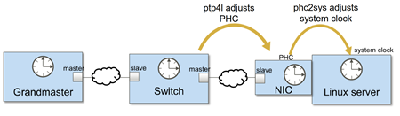

# FlexRAN 20.11 enable on ocp4, pf mode

本文描述，如何把 intel 的 oran 解决方案 flexran (版本 20.11) ，移植到 openshift 平台之上。

本运行环境，是在openshift 4.9.5 上，硬件包含了intel e810网卡， ACC100 加速卡。 由于软件的现在，网卡开启了VF模式，但是ACC100没有开启VF模式。 PTP 组件没有使用openshift自带的ptp operator，而是使用了升级的自定义版本。 容器运行的时候，和operator以及硬件的关系结构图：


本次实验整体网络架构图：


如何编译相关的基础镜像，请参考[环境开发文档](./4.10.flexran.20.11.pf.md) 。

# 应用镜像编译

我们已经制作好了一个基础镜像，quay.io/nepdemo/flexran_vdu:flexran-20.11-dpdk-19.11-ocp4.9.5-ubi-8.4 ，但是在项目现场，我们是需要调整bbu应用参数的，所以我们需要在现场编译出一个镜像来，并push到项目现场的镜像仓库，因为镜像很大（>5G)， 项目现场有一个镜像仓库，就很有必要了。

## 核配置

bbu应用是大型的dpdk应用，而dpdk应用，cpu绑定配置，非常重要，配置不善，之间导致dpdk应用core dump，这里，我们就提供一个 12 核配置的模板。他使用 1-12 core，实际测试证明，稳定性还是可以接受的。

demo bbu 应用的特点，是物理层使用8个core，l2, l3使用剩下的4个core，这些core如果相互冲突，物理层就会coredump.


# 制作镜像

上游镜像是一个包含systemd的ubi-init镜像，里面是有一个set_ip.sh的脚本，并且配置了对应的system service。 但是在项目实际过程中，发现通过systemd 启动服务的方式，启动bbu等应用，有莫名其妙的退出问题，于是我们还是用这个 ubi-init 的镜像，但是启动的时候，就不去用默认的init了，而是指定脚本运行。

既然指定脚本运行了，那我们就在这个脚本里面，做环境初始化，并且把bbu的核绑定参数也放进去。最后，在k8s的配置里面，启动bbu应用。

```bash

podman pull quay.io/nepdemo/flexran_vdu:flexran-20.11-dpdk-19.11-ocp4.9.5-ubi-8.4

podman tag quay.io/nepdemo/flexran_vdu:flexran-20.11-dpdk-19.11-ocp4.9.5-ubi-8.4  flexran.docker.registry/flexran_vdu

cat << 'EOF' > /data/nepdemo/set_ip.sh
#!/bin/bash

# Import our environment variables from systemd
for e in $(tr "\000" "\n" < /proc/1/environ); do
  # if [[ $e == DEMO_ENV* ]]; then
    eval "export $e"
  # fi
done

echo $DEMO_ENV_NIC > /demo.txt
echo $DEMO_ENV_IP >> /demo.txt
echo $DEMO_ENV_MASK >> /demo.txt

ifconfig $DEMO_ENV_NIC:1 $DEMO_ENV_IP/$DEMO_ENV_MASK up

insmod /root/dpdk-19.11/build/kernel/linux/igb_uio/igb_uio.ko

installLic /root/13FD549D912D82B3C50C58E6D233.lic
modprobe sctp

# sleep infinity


cat /sys/fs/cgroup/cpuset/cpuset.cpus
# 1-15

cd /root/pf-bb-config
./pf_bb_config ACC100 -p 0000:17:00.0 

cd /root/dpdk-19.11/usertools
python3 dpdk-devbind.py -b igb_uio 0000:17:00.0
echo "8086 0D8F" | tee /sys/bus/pci/drivers/igb_uio/new_id

python3 /root/dpdk-19.11/usertools/dpdk-devbind.py -s

# below is the core-binding parameter for dpdk/bbu application

sed -i 's/<systemThread>.*<\/systemThread>/<systemThread>2, 0, 0<\/systemThread>/' /root/flexran/bin/nr5g/gnb/l1/phycfg_xran.xml
sed -i 's/<timerThread>.*<\/timerThread>/<timerThread>1, 96, 0<\/timerThread>/' /root/flexran/bin/nr5g/gnb/l1/phycfg_xran.xml
sed -i 's/<FpgaDriverCpuInfo>.*<\/FpgaDriverCpuInfo>/<FpgaDriverCpuInfo>3, 96, 0<\/FpgaDriverCpuInfo>/' /root/flexran/bin/nr5g/gnb/l1/phycfg_xran.xml
sed -i 's/<FrontHaulCpuInfo>.*<\/FrontHaulCpuInfo>/<FrontHaulCpuInfo>3, 96, 0<\/FrontHaulCpuInfo>/' /root/flexran/bin/nr5g/gnb/l1/phycfg_xran.xml
sed -i 's/<radioDpdkMaster>.*<\/radioDpdkMaster>/<radioDpdkMaster>2, 99, 0<\/radioDpdkMaster>/' /root/flexran/bin/nr5g/gnb/l1/phycfg_xran.xml
sed -i 's/<BbuPoolThreadDefault_0_63>.*<\/BbuPoolThreadDefault_0_63>/<BbuPoolThreadDefault_0_63>0x1F80<\/BbuPoolThreadDefault_0_63>/' /root/flexran/bin/nr5g/gnb/l1/phycfg_xran.xml

sed -i 's/<xRANThread>.*<\/xRANThread>/<xRANThread>5, 96, 0<\/xRANThread>/' /root/flexran/bin/nr5g/gnb/l1/xrancfg_sub6.xml
sed -i 's/<xRANWorker>.*<\/xRANWorker>/<xRANWorker>0x40, 96, 0<\/xRANWorker>/' /root/flexran/bin/nr5g/gnb/l1/xrancfg_sub6.xml

sed -i 's/OAM_SHARED_CORE_BITMAP=.*/OAM_SHARED_CORE_BITMAP=24/' /etc/BBU_cfg/cu_cfg/gNodeB_CU_Configuration.cfg
sed -i 's/L3_SHARED_CORE_BITMAP=.*/L3_SHARED_CORE_BITMAP=20/' /etc/BBU_cfg/cu_cfg/gNodeB_CU_Configuration.cfg
sed -i 's/PDCP_SHRED_CORE_BITMAP=.*/PDCP_SHRED_CORE_BITMAP=6/' /etc/BBU_cfg/cu_cfg/gNodeB_CU_Configuration.cfg
sed -i 's/RRM_SHARED_CORE_BITMAP=.*/RRM_SHARED_CORE_BITMAP=6/' /etc/BBU_cfg/cu_cfg/gNodeB_CU_Configuration.cfg
sed -i 's/SON_SHARED_CORE_BITMAP=.*/SON_SHARED_CORE_BITMAP=6/' /etc/BBU_cfg/cu_cfg/gNodeB_CU_Configuration.cfg

# https://unix.stackexchange.com/questions/487451/sed-replace-a-pattern-between-a-pattern-and-the-end-of-file
sed -i '/<oam_shm_logger_cfg>/,$s/<cpu_bitmap>.*</<cpu_bitmap>2</' /etc/BBU_cfg/cu_cfg/Proprietary_gNodeB_CU_Data_Model.xml
sed -i '/<shm_logger_cfg>/,$s/<cpu_bitmap>.*</<cpu_bitmap>2</' /etc/BBU_cfg/cu_cfg/Proprietary_gNodeB_CU_Data_Model.xml
sed -i '/<L3Params>/,$s/<core_no>.*</<core_no>2</' /etc/BBU_cfg/cu_cfg/Proprietary_gNodeB_CU_Data_Model.xml
sed -i '/<process_name>gnb_cu_son</,$s/<process_args>.* /<process_args>2 /' /etc/BBU_cfg/cu_cfg/Proprietary_gNodeB_CU_Data_Model.xml
sed -i '/<process_name>gnb_cu_rrm</,$s/<process_args>.* /<process_args>2 /' /etc/BBU_cfg/cu_cfg/Proprietary_gNodeB_CU_Data_Model.xml
sed -i '/<pdcp_index>0</,$s/<core_num_for_worker_thread>.*</<core_num_for_worker_thread>3</' /etc/BBU_cfg/cu_cfg/Proprietary_gNodeB_CU_Data_Model.xml
sed -i '/<pdcp_index>1</,$s/<core_num_for_worker_thread>.*</<core_num_for_worker_thread>3</' /etc/BBU_cfg/cu_cfg/Proprietary_gNodeB_CU_Data_Model.xml
sed -i '/<egtpu_instance>0</,$s/<core_num_for_worker_thread>.*</<core_num_for_worker_thread>2</' /etc/BBU_cfg/cu_cfg/Proprietary_gNodeB_CU_Data_Model.xml
sed -i '/<egtpu_instance>1</,$s/<core_num_for_worker_thread>.*</<core_num_for_worker_thread>2</' /etc/BBU_cfg/cu_cfg/Proprietary_gNodeB_CU_Data_Model.xml
sed -i '/<f1u_instance>0</,$s/<core_num_for_worker_thread>.*</<core_num_for_worker_thread>2</' /etc/BBU_cfg/cu_cfg/Proprietary_gNodeB_CU_Data_Model.xml
sed -i '/<f1u_instance>1</,$s/<core_num_for_worker_thread>.*</<core_num_for_worker_thread>2</' /etc/BBU_cfg/cu_cfg/Proprietary_gNodeB_CU_Data_Model.xml
sed -i 's/<core_num_mapping>.*</<core_num_mapping>4,4</' /etc/BBU_cfg/cu_cfg/Proprietary_gNodeB_CU_Data_Model.xml

sed -i 's/MAC_BINREAD_CORE_NUM=.*/MAC_BINREAD_CORE_NUM=1/' /etc/BBU_cfg/du_cfg/gNB_DU_Configuration.cfg
sed -i 's/RLC_BINREAD_CORE_NUM=.*/RLC_BINREAD_CORE_NUM=1/' /etc/BBU_cfg/du_cfg/gNB_DU_Configuration.cfg
sed -i 's/MAC_HP_CORE_NUM=.*/MAC_HP_CORE_NUM=3/' /etc/BBU_cfg/du_cfg/gNB_DU_Configuration.cfg
sed -i 's/RLC_MASTER_CORE_NUM=.*/RLC_MASTER_CORE_NUM=2/' /etc/BBU_cfg/du_cfg/gNB_DU_Configuration.cfg
sed -i 's/SHARED_CORE_BITMAP=.*/SHARED_CORE_BITMAP=6/' /etc/BBU_cfg/du_cfg/gNB_DU_Configuration.cfg
sed -i 's/RELAY_ADAPTER_RECVR_THREAD_CORE_NUM=.*/RELAY_ADAPTER_RECVR_THREAD_CORE_NUM=4/' /etc/BBU_cfg/du_cfg/gNB_DU_Configuration.cfg

sed -i '/<RlcProvsioningParams>/,$s/<CoreNumWorkerThread>.*</<CoreNumWorkerThread>1</' /etc/BBU_cfg/du_cfg/Proprietary_gNodeB_DU_Data_Model.xml
sed -i '/<RlclSystemParams>/,$s/<CoreNumWorkerThread>.*</<CoreNumWorkerThread>4</' /etc/BBU_cfg/du_cfg/Proprietary_gNodeB_DU_Data_Model.xml
sed -i '/<F1uProvisioningParams>/,$s/<numCoreWorkerThreads>.*</<numCoreWorkerThreads>3</' /etc/BBU_cfg/du_cfg/Proprietary_gNodeB_DU_Data_Model.xml

sed -i 's/\.\/gnb_cu_pdcp .* >/\.\/gnb_cu_pdcp --r=2 --a=2 --t=2 --m=2 --i=0 --b=2 --p=0 --s=50 --n=10 >/' /home/BaiBBU_XSS/BaiBBU_SXSS/gNB_app

EOF

cat << EOF > /data/nepdemo/setip.service
[Unit]
Description=set ip service
After=network.target

[Service]
Type=simple
User=root
WorkingDirectory=/root/
ExecStart=/root/systemd/set_ip.sh

[Install]
WantedBy=multi-user.target
EOF

cat << EOF > /data/nepdemo/flexran_vdu.dockerfile
FROM flexran.docker.registry/flexran_vdu

COPY set_ip.sh      /root/systemd/
RUN chmod +x /root/systemd/set_ip.sh   
COPY setip.service  /etc/systemd/system/setip.service
RUN systemctl enable setip.service

EOF

cd /data/nepdemo
podman build --squash -f /data/nepdemo/flexran_vdu.dockerfile -t flexran.docker.registry/flexran_vdu:wzh .

# upload the project container image to local registry
export REG_TMP="reg-tmp.redhat.ren:5443"

podman tag flexran.docker.registry/flexran_vdu:wzh  ${REG_TMP}/nepdemo/flexran_vdu:flexran-20.11-dpdk-19.11-ocp4.9.5-ubi-8.4

podman push --tls-verify=false ${REG_TMP}/nepdemo/flexran_vdu:flexran-20.11-dpdk-19.11-ocp4.9.5-ubi-8.4

```

# deploy on ocp 4.9.5

镜像都准备好了，我们开始在openshift4 上进行部署测试。

## set security for temp image registry

我们临时创建了一个镜像仓库，那么我们就要把这个配置放到集群里面去，主要是让ocp集群，不要检查这个新镜像仓库的证书。

- [How to remove worker role from master in Red Hat OpenShift Container Platform 4.x?](https://access.redhat.com/solutions/4564851)

```bash
oc patch schedulers.config.openshift.io/cluster --type merge -p '{"spec":{"mastersSchedulable":false}}'

install /data/ocp4/clients/butane-amd64 /usr/local/bin/butane

cat << EOF > /data/sno/tmp.images.bu
variant: openshift
version: 4.9.0
metadata:
  labels:
    machineconfiguration.openshift.io/role: worker
  name: 99-zzz-worker-temp-images
storage:
  files:
    - path: /etc/containers/registries.conf.d/temp.registries.conf
      overwrite: true
      contents:
        inline: |

            [[registry]]
            location = "tmp-registry.ocp4.redhat.ren:5443"
            insecure = true
            blocked = false
            mirror-by-digest-only = false
            prefix = ""

EOF

butane /data/sno/tmp.images.bu > /data/sno/99-zzz-worker-temp-images.yaml

oc create -f /data/sno/99-zzz-worker-temp-images.yaml

```

## worker-2 node, rt-kernel setting

bbu 应用是需要实时操作系统支持的，那么我们就用openshift的performance addon operator来搞这个事情，pao支持激活rt-kernel，同时还能设置一些内核参数，我们需要把hugepage，cpu隔离设置好，还有e810的驱动屏蔽。

```bash

cat << EOF > /data/install/performance-2.yaml
---
apiVersion: performance.openshift.io/v2
kind: PerformanceProfile
metadata:
   name: wzh-performanceprofile-2
spec:
  additionalKernelArgs:
    # - no_timer_check
    # - clocksource=tsc
    # - tsc=perfect
    # set selinux
    # - selinux=0
    # - enforcing=0
    # end set selinux
    - nmi_watchdog=0
    # - softlockup_panic=0
    - isolcpus=1-18
    - nohz_full=1-18
    # - idle=poll
    - default_hugepagesz=1G
    - hugepagesz=1G
    - hugepages=24
    # - skew_tick=1
    - rcu_nocbs=1-18
    - kthread_cpus=0
    - irqaffinity=0
    # - rcu_nocb_poll
    - iommu=pt
    - intel_iommu=on
    - intel_pstate=disable
    # try to upgrade e810 driver
    - module_name.blacklist=1 
    - rd.driver.blacklist=ice
    # profile creator
    - audit=0
    # - idle=poll
    # - intel_idle.max_cstate=0
    - mce=off
    - nmi_watchdog=0
    # - nosmt
    # - processor.max_cstate=1
  globallyDisableIrqLoadBalancing: true
  cpu:
      isolated: "1-18"
      reserved: "0,19"
  realTimeKernel:
      enabled: true
  numa:  
      topologyPolicy: "single-numa-node"
  nodeSelector:
      node-role.kubernetes.io/worker-rt-2: ""
  machineConfigPoolSelector:
    machineconfiguration.openshift.io/role: worker-rt-2
EOF
oc create  --save-config  -f /data/install/performance-2.yaml

# oc apply -f /data/install/performance-2.yaml
# oc delete -f /data/install/performance-2.yaml

oc label node worker-2.ocp4.redhat.ren node-role.kubernetes.io/worker-rt-2=""

```

## intel e810 driver & dpdk driver

openshift 4.9.5 对应的coreos操作系统里面自带的e810驱动ice.ko，版本比较低，无法支持ptp，我们需要升级驱动。但是coreos升级驱动操作比较麻烦，我们需要制作一个systemd service，让他在kubelet之前启动，在这个service 里面，用podman启动一个特权容器，在容器里面，insmod ice.ko。当然一切的前提，是在kernel参数上，屏蔽了ice的自动加载。

```bash

oc new-project vbbu-demo

oc project vbbu-demo

export REG_TMP='tmp-registry.ocp4.redhat.ren:5443'

# kernel driver deployment
oc create serviceaccount svcacct-driver -n vbbu-demo
oc adm policy add-scc-to-user privileged -z svcacct-driver -n vbbu-demo
# oc adm policy add-scc-to-user anyuid -z mysvcacct -n vbbu-demo

cat << EOF > /data/sno/static-pod.bu
variant: openshift
version: 4.9.0
metadata:
  labels:
    machineconfiguration.openshift.io/role: worker-rt-2
  name: 99-zzz-e810-dpdk-driver-static-worker-rt-2
storage:
  files:
    # - path: /etc/kubernetes/manifests/99-zzz-e810-dpdk-driver-static-worker-rt-2.yaml
    #   mode: 0644
    #   overwrite: true
    #   contents:
    #     local: static.pod.yaml
    - path: /etc/modprobe.d/blacklist-ice.conf
      mode: 0644
      overwrite: true
      contents:
        inline: |
          blacklist ice
systemd:
  units:
    - name: driver.ice.service
      enabled: true
      contents: |
        [Unit]
        Description=set ip service
        After=network.target
        Before=kubelet.target

        [Service]
        Type=onshot
        User=root
        WorkingDirectory=/root/
        ExecStart=podman run --privileged --rm -it quay.io/nepdemo/intel-driver:2022-06-13-1318 /bin/sh -c " rmmod ice; rmmod auxiliary ; insmod /diy/auxiliary.ko; insmod /diy/ice.ko ; "

        [Install]
        WantedBy=multi-user.target

EOF

butane -d /data/install /data/sno/static-pod.bu > /data/install/99-zzz-e810-dpdk-driver-static-worker-rt-2.yaml

oc create --save-config -f /data/install/99-zzz-e810-dpdk-driver-static-worker-rt-2.yaml

# oc apply -f /data/install/99-zzz-e810-dpdk-driver-static-worker-rt-2.yaml
# oc delete -f /data/install/99-zzz-e810-dpdk-driver-static-worker-rt-2.yaml

```

## linuxptp 3.11

vRAN应用，特别是option 8 的方案，需要ptp时钟方案支持，物理形态，要么是GPS master连到交换机上，通过交换机授时，要么GPS master直接连网卡上。在服务器端，需要支持网络授时的网卡，并且主机上要启动ptp相关的服务，同时关掉ntp。



从上图可以看到，ptp4l，是从网络上拿时间到网卡上，phc2sys，是从网卡上，写到系统时钟上。ts2phc应该是把本地时间同步给其他设备用的。

openshift自带的ptp operator版本比较低，我们需要升级，就自己做镜像，做服务吧。

### build linuxptp container image

我们在外网，用linuxptp 3.1.1版本做镜像，并且支持注入参数。方便项目现场调整。

```bash
# http://linuxptp.sourceforge.net/
# download linuxptp-3.1.1

mkdir -p /data/ptp
cd /data/ptp
wget https://nchc.dl.sourceforge.net/project/linuxptp/v3.1/linuxptp-3.1.1.tgz
tar zvxf linuxptp-3.1.1.tgz
cd linuxptp-3.1.1
make

cat << 'EOF' > ptp4l.sh
#!/bin/bash

if [ -z $DEMO_ENV_PRIO ]; then
  /usr/local/sbin/ptp4l -f /etc/ptp4l.conf -m $DEMO_ENV_PTP4L_ARG
else
  /usr/bin/chrt -f $DEMO_ENV_PRIO /usr/local/sbin/ptp4l -f /etc/ptp4l.conf -m $DEMO_ENV_PTP4L_ARG
fi

EOF

cat << 'EOF' > phc2sys.sh
#!/bin/bash

if [ -z $DEMO_ENV_PRIO ]; then
  /usr/local/sbin/phc2sys -m -z /var/run/ptp4l -t [phc2sys] $DEMO_ENV_PHC2SYS_ARG
else
  /usr/bin/chrt -f $DEMO_ENV_PRIO /usr/local/sbin/phc2sys -m -z /var/run/ptp4l -t [phc2sys] $DEMO_ENV_PHC2SYS_ARG
fi

EOF

cat << 'EOF' > ts2phc.sh
#!/bin/bash

if [ -z  $DEMO_ENV_PRIO ]; then
  /usr/local/sbin/ts2phc -f /etc/ts2phc.cfg -m $DEMO_ENV_TS2PHC_ARG
else
  /usr/bin/chrt -f $DEMO_ENV_PRIO /usr/local/sbin/ts2phc -f /etc/ts2phc.cfg -m $DEMO_ENV_TS2PHC_ARG
fi

EOF

cat << EOF > ./ptp.dockerfile
FROM registry.access.redhat.com/ubi8/ubi:8.4

COPY hwstamp_ctl nsm phc2sys phc_ctl pmc ptp4l timemaster ts2phc incdefs.sh version.sh ptp4l.sh phc2sys.sh ts2phc.sh /usr/local/sbin/
RUN cd /usr/local/sbin/ && chmod +x hwstamp_ctl nsm phc2sys phc_ctl pmc ptp4l timemaster ts2phc incdefs.sh version.sh ptp4l.sh phc2sys.sh ts2phc.sh

EOF

podman build --squash -t quay.io/nepdemo/linuxptp:3.1.1-ubi-8.4-v06 -f ptp.dockerfile ./

podman push quay.io/nepdemo/linuxptp:3.1.1-ubi-8.4-v06

```

### deploy linux ptp

有了镜像，我们就做一个deployment，来启动ptp，注意，里面有3个container, 同时还有一些configmap 做配置文件注入. 在项目现场, 注意需要调整配置文件参数. 

```bash

oc new-project vbbu-demo

oc project vbbu-demo

export REG_TMP='tmp-registry.ocp4.redhat.ren:5443'

# kernel driver deployment
oc create serviceaccount svcacct-driver -n vbbu-demo
oc adm policy add-scc-to-user privileged -z svcacct-driver -n vbbu-demo
# oc adm policy add-scc-to-user anyuid -z mysvcacct -n vbbu-demo

# !!! remember to disable chronyd on dest host !!!
# we do not use ptp opeerator, so we need to do it manually
# TODO
# https://docs.openshift.com/container-platform/4.10/scalability_and_performance/ztp-configuring-single-node-cluster-deployment-during-installation.html#sno-du-disabling-ntp_sno-du-deploying-distributed-units-manually-on-single-node-openshift

cat << 'EOF' > /data/install/ptp.chrony.conf
apiVersion: machineconfiguration.openshift.io/v1
kind: MachineConfig
metadata:
  labels:
    machineconfiguration.openshift.io/role: worker-rt-2
  name: disable-chronyd
spec:
  config:
    systemd:
      units:
        - contents: |
            [Unit]
            Description=NTP client/server
            Documentation=man:chronyd(8) man:chrony.conf(5)
            After=ntpdate.service sntp.service ntpd.service
            Conflicts=ntpd.service systemd-timesyncd.service
            ConditionCapability=CAP_SYS_TIME
            [Service]
            Type=forking
            PIDFile=/run/chrony/chronyd.pid
            EnvironmentFile=-/etc/sysconfig/chronyd
            ExecStart=/usr/sbin/chronyd $OPTIONS
            ExecStartPost=/usr/libexec/chrony-helper update-daemon
            PrivateTmp=yes
            ProtectHome=yes
            ProtectSystem=full
            [Install]
            WantedBy=multi-user.target
          enabled: false
          name: chronyd.service
    ignition:
      version: 2.2.0
EOF
oc create -f /data/install/ptp.chrony.conf

cat << EOF > /data/install/ptp4l.conf
[global]
#
# Default Data Set
#
twoStepFlag              1
slaveOnly                0
priority1                128
priority2                128
domainNumber             24
clockClass               248
clockAccuracy            0xFE
offsetScaledLogVariance  0xFFFF
free_running             0
freq_est_interval        0
#
# Port Data Set
# 16 TS a second use logSyncInterval        -4
#
#logAnnounceInterval      4
logAnnounceInterval      1
logSyncInterval          -4
logMinDelayReqInterval   0
logMinPdelayReqInterval  0
announceReceiptTimeout   3
syncReceiptTimeout       0
delayAsymmetry           0
fault_reset_interval     4
neighborPropDelayThresh  20000000
#
# Run time options
#
assume_two_step          0
logging_level            6
path_trace_enabled       0
follow_up_info           0
tx_timestamp_timeout     200
use_syslog               1
verbose                  0
summary_interval         0
kernel_leap              1
check_fup_sync           0
#
# Servo Options
#
pi_proportional_const    0.0
pi_integral_const        0.0
pi_proportional_scale    0.0
pi_proportional_exponent -0.3
pi_proportional_norm_max 0.7
pi_integral_scale        0.0
pi_integral_exponent     0.4
pi_integral_norm_max     0.3
step_threshold           0.00000002
first_step_threshold     0.00002
max_frequency            900000000
clock_servo              nullf
sanity_freq_limit        200000000
ntpshm_segment           0
#
# Transport options
#
transportSpecific        0x0
ptp_dst_mac              01:1B:19:00:00:00
p2p_dst_mac              01:80:C2:00:00:0E
udp6_scope               0x0E
uds_address              /var/run/ptp4l
#
# Default interface options
#
network_transport        UDPv4
#network_transport        L2
delay_mechanism          E2E
time_stamping            hardware
delay_filter             moving_median
delay_filter_length      10
egressLatency            0
ingressLatency           0
boundary_clock_jbod      0
#
# Clock description
#
productDescription       ;;
revisionData             ;;
manufacturerIdentity     00:00:00
userDescription          ;
timeSource               0xA0
EOF

cat << EOF > /data/install/ts2phc.cfg
[global]
use_syslog              0
verbose                 1
logging_level           7
ts2phc.pulsewidth       100000000
# For GNSS module
ts2phc.nmea_serialport /dev/ttyGNSS_1700_0
[ens2f0]
ts2phc.extts_polarity rising
EOF

oc delete configmap ptp-config -n vbbu-demo

oc create configmap ptp-config -n vbbu-demo --from-file=/data/install/ptp4l.conf --from-file=/data/install/ts2phc.cfg --save-config=true

cat << 'EOF' > /data/install/ptp.demo.yaml
---
apiVersion: apps/v1
kind: Deployment
metadata:
  name: nepdemo-linuxptp-daemon
  labels:
    app: nepdemo-linuxptp-daemon
spec:
  replicas: 1
  selector:
    matchLabels:
      app: nepdemo-linuxptp-daemon
  template:
    metadata:
      annotations:
        cpu-load-balancing.crio.io: "true"
      labels:
        app: nepdemo-linuxptp-daemon
      name: nepdemo-linuxptp-daemon
      # namespace: openshift-ptp
    spec:
      affinity:
        nodeAffinity:
          requiredDuringSchedulingIgnoredDuringExecution:
            nodeSelectorTerms:
            - matchFields:
              - key: metadata.name
                operator: In
                values:
                - worker-2.ocp4.redhat.ren
      runtimeClassName: performance-wzh-performanceprofile-2
      containers:
      - name: ptp4l
        image: quay.io/nepdemo/linuxptp:3.1.1-ubi-8.4-v06
        imagePullPolicy: IfNotPresent
        command: ["/bin/sh", "-c", "--"]
        args: [" /usr/local/sbin/ptp4l.sh ;"]
        env:
        - name: DEMO_ENV_PTP4L_ARG
          value: " -i ens2f0 -2 "
        # - name: DEMO_ENV_PRIO
        #   value: "65"
        securityContext:
          privileged: true
          runAsUser: 0    
        volumeMounts:
        - mountPath: /etc/ptp4l.conf
          subPath: ptp4l.conf
          name: config-volume
        - mountPath: /var/run/ptp4l
          name: socket-dir
      - name: phc2sys
        image: quay.io/nepdemo/linuxptp:3.1.1-ubi-8.4-v06
        imagePullPolicy: IfNotPresent
        command: ["/bin/sh", "-c", "--"]
        args: [" /usr/local/sbin/phc2sys.sh ;"]
        env:
        - name: DEMO_ENV_PHC2SYS_ARG
          value: " -s ens2f0 -r -u 1 -O 0 -R 8 "
        # - name: DEMO_ENV_PRIO
        #   value: "65"
        securityContext:
          privileged: true
          runAsUser: 0    
        volumeMounts:
        - mountPath: /etc/ptp4l.conf
          subPath: ptp4l.conf
          name: config-volume
        - mountPath: /var/run/ptp4l
          name: socket-dir
      - name: ts2phc
        image: quay.io/nepdemo/linuxptp:3.1.1-ubi-8.4-v06
        imagePullPolicy: IfNotPresent
        command: ["/bin/sh", "-c", "--"]
        args: [" /usr/local/sbin/ts2phc.sh ;"]
        env:
        - name: DEMO_ENV_TS2PHC_ARG
          value: " -s generic -c ens2f0 "
        # - name: DEMO_ENV_PRIO
        #   value: "65"
        securityContext:
          privileged: true
          runAsUser: 0    
        volumeMounts:
        - mountPath: /etc/ts2phc.cfg
          subPath: ts2phc.cfg
          name: config-volume
        - mountPath: /var/run/ptp4l
          name: socket-dir
        - name: dev
          mountPath: /dev
      hostNetwork: true
      # hostPID: true
      serviceAccountName: svcacct-driver
      volumes:
      - configMap:
          defaultMode: 420
          name: ptp-config
        name: config-volume
      - hostPath:
          path: /var/run/ptp
          type: DirectoryOrCreate
        name: socket-dir
      - name: dev
        hostPath:
          path: "/dev"
EOF

oc create --save-config -n vbbu-demo -f /data/install/ptp.demo.yaml

# oc delete -n vbbu-demo -f /data/install/ptp.demo.yaml

```

## setup sriov operator

openshift有sriov的operator，官方支持intel e810网卡，我们直接用就好了。

- [Single Root I/O Virtualization (SR-IOV) hardware networks](https://docs.openshift.com/container-platform/4.9/networking/hardware_networks/about-sriov.html)

the env has nic Intel e810 : 8086 1593

```bash
# install sriov operator
cat << EOF > /data/install/sriov.yaml
---
apiVersion: v1
kind: Namespace
metadata:
  name: openshift-sriov-network-operator
  annotations:
    workload.openshift.io/allowed: management
---
apiVersion: operators.coreos.com/v1
kind: OperatorGroup
metadata:
  name: sriov-network-operators
  namespace: openshift-sriov-network-operator
spec:
  targetNamespaces:
  - openshift-sriov-network-operator
---
apiVersion: operators.coreos.com/v1alpha1
kind: Subscription
metadata:
  name: sriov-network-operator-subscription
  namespace: openshift-sriov-network-operator
spec:
  channel: "stable"
  installPlanApproval: Manual
  name: sriov-network-operator
  source: redhat-operators
  sourceNamespace: openshift-marketplace
EOF
oc create -f /data/install/sriov.yaml

```
  
```bash
oc get SriovNetworkNodeState -n openshift-sriov-network-operator
# NAME                       AGE
# master-0                   42m
# worker-0.ocp4.redhat.ren   42m
# worker-1                   42m
# worker-2.ocp4.redhat.ren   42m

oc get SriovNetworkNodeState/worker-2.ocp4.redhat.ren -n openshift-sriov-network-operator -o yaml
# apiVersion: sriovnetwork.openshift.io/v1
# kind: SriovNetworkNodeState
# metadata:
#   creationTimestamp: "2022-05-06T14:34:54Z"
#   generation: 61
#   name: worker-2.ocp4.redhat.ren
#   namespace: openshift-sriov-network-operator
#   ownerReferences:
#   - apiVersion: sriovnetwork.openshift.io/v1
#     blockOwnerDeletion: true
#     controller: true
#     kind: SriovNetworkNodePolicy
#     name: default
#     uid: 4eca5eea-e1e5-410f-8833-dd2de1434e53
#   resourceVersion: "93262422"
#   uid: 1d122c8e-b788-4f1e-a3d5-865c6230a476
# spec:
#   dpConfigVersion: "93222170"
# status:
#   interfaces:
#   - deviceID: "1593"
#     driver: ice
#     linkSpeed: -1 Mb/s
#     linkType: ETH
#     mac: 40:a6:b7:82:0e:4c
#     mtu: 1500
#     name: ens2f0
#     pciAddress: 0000:65:00.0
#     totalvfs: 64
#     vendor: "8086"
#   - deviceID: "1593"
#     driver: ice
#     linkSpeed: -1 Mb/s
#     linkType: ETH
#     mac: 40:a6:b7:82:0e:4d
#     mtu: 1500
#     name: ens2f1
#     pciAddress: 0000:65:00.1
#     totalvfs: 64
#     vendor: "8086"
#   - deviceID: "1593"
#     driver: ice
#     linkSpeed: -1 Mb/s
#     linkType: ETH
#     mac: 40:a6:b7:82:0e:4e
#     mtu: 1500
#     name: ens2f2
#     pciAddress: 0000:65:00.2
#     totalvfs: 64
#     vendor: "8086"
#   - deviceID: "1593"
#     driver: ice
#     linkSpeed: -1 Mb/s
#     linkType: ETH
#     mac: 40:a6:b7:82:0e:4f
#     mtu: 1500
#     name: ens2f3
#     pciAddress: 0000:65:00.3
#     totalvfs: 64
#     vendor: "8086"
#   - deviceID: 37d1
#     driver: i40e
#     linkSpeed: 1000 Mb/s
#     linkType: ETH
#     mac: ac:1f:6b:ea:5b:32
#     mtu: 1500
#     name: eno1
#     pciAddress: 0000:b5:00.0
#     totalvfs: 32
#     vendor: "8086"
#   - deviceID: 37d1
#     driver: i40e
#     linkSpeed: 1000 Mb/s
#     linkType: ETH
#     mac: ac:1f:6b:ea:5b:33
#     mtu: 1500
#     name: eno2
#     pciAddress: 0000:b5:00.1
#     totalvfs: 32
#     vendor: "8086"
#   syncStatus: Succeeded


# how to use the sriov to create VF and attach to pod, depends on use case from nep demo request
# remember to active SRIOV in bios
# remember to active VT-d in bios
cat << EOF > /data/install/sriov.policy.yaml
---
apiVersion: sriovnetwork.openshift.io/v1
kind: SriovNetworkNodePolicy
metadata:
  name: policy-810-nic01-rt2
  namespace: openshift-sriov-network-operator
spec:
  resourceName: intel_810_nic01_rt2
  nodeSelector:
    kubernetes.io/hostname: worker-2.ocp4.redhat.ren
  numVfs: 4
  nicSelector:
    vendor: "8086"
    deviceID: "1593"
    rootDevices:
      - "0000:65:00.0"
    # pfNames:
    #   - "ens2f0"
  # linkType: eth
  # isRdma: false
  deviceType: vfio-pci 
EOF
oc create -f /data/install/sriov.policy.yaml

# oc delete -f /data/install/sriov.policy.yaml

oc get sriovnetworknodestates/worker-2.ocp4.redhat.ren -n openshift-sriov-network-operator  -o jsonpath='{.status.syncStatus}' && echo
# Succeeded


cat << EOF > /data/install/sriov.attach.yaml
---
apiVersion: sriovnetwork.openshift.io/v1
kind: SriovNetwork
metadata:
  name: intel-810-nic01-vf0-rt2
  namespace: openshift-sriov-network-operator
spec:
  resourceName: intel_810_nic01_rt2
  networkNamespace: vbbu-demo
  vlan: 5
---
apiVersion: sriovnetwork.openshift.io/v1
kind: SriovNetwork
metadata:
  name: intel-810-nic01-vf1-rt2
  namespace: openshift-sriov-network-operator
spec:
  resourceName: intel_810_nic01_rt2
  networkNamespace: vbbu-demo
  vlan: 5
EOF
oc create -f /data/install/sriov.attach.yaml

# oc delete -f /data/install/sriov.attach.yaml

oc get net-attach-def -n vbbu-demo
# NAME                      AGE
# intel-810-nic01-vf0-rt2   2m19s
# intel-810-nic01-vf1-rt2   2m19s


```

## nepdemo license file

把license file放到config map里面，注入容器。

不过呢，当前，我们是在制作容器镜像的步骤里面，直接把license 复制到容器里面了。

```bash

# license file 加载到config map中
oc create configmap -n vbbu-demo license.for.nepdemo  \
    --from-file=license=./3496531EC238AD91DED6DBA5BD6B.lic

# to updated config map
oc create configmap -n vbbu-demo license.for.nepdemo --from-file=license=./3496531EC238AD91DED6DBA5BD6B.lic -o yaml --dry-run=client | oc apply -f -

```

## create deployment for release/production

终于, 我们要启动服务了, 这是一个dpdk程序, 我们设置resource request, limits, 达到绑核的目的.　

```bash

oc new-project vbbu-demo

oc project vbbu-demo

# kernel driver deployment
oc create serviceaccount svcacct-driver -n vbbu-demo
oc adm policy add-scc-to-user privileged -z svcacct-driver -n vbbu-demo
# oc adm policy add-scc-to-user anyuid -z mysvcacct -n vbbu-demo

export REG_TMP='tmp-registry.ocp4.redhat.ren:5443'

# the pod with vbbu container and dev container
# later, it will change to deployment
cat << EOF > /data/install/vran.intel.flexran.yaml
---

apiVersion: "k8s.cni.cncf.io/v1"
kind: NetworkAttachmentDefinition
metadata:
  name: host-device-vbbu-demo
spec:
  config: '{
    "cniVersion": "0.3.1",
    "type": "host-device",
    "device": "eno1",
    "ipam": {
      "type": "static",
      "addresses": [
        {
          "address": "192.168.12.19/24"
        }
      ]
    }
  }'


---
apiVersion: apps/v1
kind: Deployment
metadata:
  name: flexran-binary-release-deployment
  labels:
    app: flexran-binary-release-deployment
spec:
  replicas: 1
  selector:
    matchLabels:
      app: flexran-binary-release
  template:
    metadata:
      labels:
        app: flexran-binary-release
      name: flexran-binary-release
      annotations:
        k8s.v1.cni.cncf.io/networks: |-
          [
            { 
              "name": "host-device-vbbu-demo"
            },
            {
              "name": "intel-810-nic01-vf0-rt2",
              "mac": "00:11:22:33:44:66"
            },
            {
              "name": "intel-810-nic01-vf1-rt2",
              "mac": "00:11:22:33:44:67"
            }
          ]
        # cpu-load-balancing.crio.io: "true"
    spec:
      affinity:
        podAntiAffinity:
          requiredDuringSchedulingIgnoredDuringExecution:
            - labelSelector:
                matchExpressions:
                  - key: "app"
                    operator: In
                    values:
                    - flexran-binary-release
              topologyKey: "kubernetes.io/hostname"
        nodeAffinity:
          requiredDuringSchedulingIgnoredDuringExecution:
            nodeSelectorTerms:
            - matchExpressions:
              - key: kubernetes.io/hostname
                operator: In
                values:
                - worker-2.ocp4.redhat.ren
      # nodeSelector:
      #   kubernetes.io/hostname: worker-2.ocp4.redhat.ren
      runtimeClassName: performance-wzh-performanceprofile-2
      serviceAccountName: svcacct-driver
      containers:
      - name: flexran-release-running
        securityContext:
          privileged: true
          capabilities:
            add:
              - SYS_ADMIN
              - IPC_LOCK
              - SYS_NICE
              - SYS_RESOURCE
              - NET_RAW
              - CAP_SYS_ADMIN
          # runAsUser: 0
          # seLinuxOptions:
          #   level: "s0"
          #   type: "spc_t"
        # command: [ "/sbin/init" ]
        command: [ "/bin/sh","-c","--" ]
        args: [" /root/systemd/set_ip.sh ; cd /home/BaiBBU_XSS/tools/ ; ./XRAN_BBU start ;  sleep infinity ; "]
        tty: true
        stdin: true
        image: ${REG_TMP}/nepdemo/flexran_vdu:flexran-20.11-dpdk-19.11-ocp4.9.5-ubi-8.4
        # image: ${REG_TMP}/nepdemo/flexran_basekit:dpdk-19.11-ocp-4.9.5-ubi-8.4 
        imagePullPolicy: Always
        env:
          - name: DEMO_ENV_NIC
            value: "net1:0"
          - name: DEMO_ENV_IP
            value: "192.168.12.20"
          - name: DEMO_ENV_MASK
            value: "24"
        resources:
          requests:
            cpu: 12
            memory: "64Gi" 
            hugepages-1Gi: 24Gi  
          limits:
            cpu: 12
            memory: "64Gi"
            hugepages-1Gi: 24Gi
        volumeMounts:
        - name: hugepage
          mountPath: /hugepages
          readOnly: False
        - name: varrun
          mountPath: /var/run/dpdk
          readOnly: false
        - name: swap
          mountPath: /swap
          readOnly: false
        # - name: oneapi
        #   mountPath: /opt/intel/oneapi
        #   readOnly: false
        # - name: system-studio-2019
        #   mountPath: /opt/intel/system_studio_2019
        #   readOnly: false   
        # - name: licenses
        #   mountPath: /opt/intel/licenses
        #   readOnly: false
        # - name: packagemanager
        #   mountPath: /opt/intel/packagemanager
        #   readOnly: false 
        # - name: dpdk-19-11
        #   mountPath: /opt/dpdk-19.11
        #   readOnly: false
        # - name: flexran
        #   mountPath: /data/flexran
        #   readOnly: false   
        # - name: sys
        #   mountPath: /sys/
        #   readOnly: false
        - name: lib-modules
          mountPath: /lib/modules
        - name: src
          mountPath: /usr/src
        - name: dev
          mountPath: /dev
        - name: cache-volume
          mountPath: /dev/shm
        - name: license-volume
          mountPath: /nepdemo/lic
     
      volumes:
      - name: hugepage
        emptyDir:
          medium: HugePages
      - name: varrun
        emptyDir: {}
      - name: swap
        emptyDir: {}
      # - name: dpdk-19-11
      #   hostPath:
      #     path: "/var/nepdemo/dpdk-19.11"
      # - name: flexran
      #   hostPath:
      #     path: "/var/nepdemo/flexran"
      # - name: oneapi
      #   hostPath:
      #     path: "/var/nepdemo/oneapi"
      # - name: system-studio-2019
      #   hostPath:
      #     path: "/var/nepdemo/system_studio_2019"
      # - name: licenses
      #   hostPath:
      #     path: "/var/nepdemo/licenses"
      # - name: packagemanager
      #   hostPath:
      #     path: "/var/nepdemo/packagemanager"
      # - name: sys
      #   hostPath:
      #     path: "/sys/"
      - name: lib-modules
        hostPath:
          path: /lib/modules
      - name: src
        hostPath:
          path: /usr/src
      - name: dev
        hostPath:
          path: "/dev"
      - name: cache-volume
        emptyDir:
          medium: Memory
          sizeLimit: 16Gi
      - name: license-volume
        configMap:
          name: license.for.nepdemo
          items:
          - key: license
            path: license.lic
---

apiVersion: v1
kind: Service
metadata:
  name: vbbu-http 
spec:
  ports:
  - name: http
    port: 80
    targetPort: 80 
    nodePort: 31071
  type: NodePort 
  selector:
    app: flexran-binary-release

---

apiVersion: route.openshift.io/v1
kind: Route
metadata:
  name: vbbu-http 
spec:
  port:
    targetPort: http
  to:
    kind: Service
    name: vbbu-http 

---
EOF
oc create -n vbbu-demo -f /data/install/vran.intel.flexran.yaml

# oc delete -n vbbu-demo -f /data/install/vran.intel.flexran.yaml

# below, used for debug 

POD_ID=$(oc get pod -n vbbu-demo -o json | jq -r '.items[].metadata.name | select(. | contains("flexran-binary-release"))' )
oc rsh -c flexran-release-running ${POD_ID}
# below runs the command in the pod
bash

cat /sys/fs/cgroup/cpuset/cpuset.cpus
# 2-17

cd /root/pf-bb-config
./pf_bb_config ACC100 -p 0000:17:00.0 

cd /root/dpdk-19.11/usertools
python3 dpdk-devbind.py -b igb_uio 0000:17:00.0
echo "8086 0D8F" | tee /sys/bus/pci/drivers/igb_uio/new_id

python3 /root/dpdk-19.11/usertools/dpdk-devbind.py -s

# vi /etc/BBU_cfg/phy_cfg/xrancfg_sub6.xml
# /bin/cp -f /etc/BBU_cfg/phy_cfg/xrancfg_sub6.xml /root/flexran/bin/nr5g/gnb/l1/
# /bin/cp -f /etc/BBU_cfg/phy_cfg/phycfg_xran.xml /root/flexran/bin/nr5g/gnb/l1/

cd /home/BaiBBU_XSS/tools/
./XRAN_BBU start

cd /home/BaiBBU_XSS/tools/
./XRAN_BBU stop

# cd /root/flexran/bin/nr5g/gnb/l1/
# ./l1app table 0 1 --cfgfile=phycfg_xran.xml --xranfile=xrancfg_sub6.xml

cat /root/flexran/bin/nr5g/gnb/l1/Phy.log

cat /home/BaiBBU_XSS/BaiBBU_SXSS/DU/bin/logs_gNB_DU

cat /home/BaiBBU_XSS/BaiBBU_SXSS/CU/bin/L3.log

ls /home/BaiBBU_XSS/BaiBBU_SXSS/CU/bin/
cat /home/BaiBBU_XSS/BaiBBU_SXSS/CU/bin/*.log.*

find /home -type f -exec grep -Hn systemctl {} \;
find /root -type f -exec grep -Hn systemctl {} \;

# copy log files
oc exec -n vbbu-demo ${POD_ID} -- bash -c "cd /root/flexran/bin/nr5g/gnb/l1/; tar cf - Phy.log" | tar xf - -C /root/tmp/

# on jumpbox
scp root@192.168.7.11:/root/tmp/Phy.log /data/wzh/


```

### 16 cpu core config

cpu core 1-16

```bash

sed -i 's/<systemThread>.*<\/systemThread>/<systemThread>2, 0, 0<\/systemThread>/'  /root/flexran/bin/nr5g/gnb/l1/phycfg_xran.xml
sed -i 's/<timerThread>.*<\/timerThread>/<timerThread>1, 96, 0<\/timerThread>/'     /root/flexran/bin/nr5g/gnb/l1/phycfg_xran.xml
sed -i 's/<FpgaDriverCpuInfo>.*<\/FpgaDriverCpuInfo>/<FpgaDriverCpuInfo>3, 96, 0<\/FpgaDriverCpuInfo>/' /root/flexran/bin/nr5g/gnb/l1/phycfg_xran.xml
sed -i 's/<FrontHaulCpuInfo>.*<\/FrontHaulCpuInfo>/<FrontHaulCpuInfo>3, 96, 0<\/FrontHaulCpuInfo>/'     /root/flexran/bin/nr5g/gnb/l1/phycfg_xran.xml
sed -i 's/<radioDpdkMaster>.*<\/radioDpdkMaster>/<radioDpdkMaster>2, 99, 0<\/radioDpdkMaster>/'         /root/flexran/bin/nr5g/gnb/l1/phycfg_xran.xml
sed -i 's/<BbuPoolThreadDefault_0_63>.*<\/BbuPoolThreadDefault_0_63>/<BbuPoolThreadDefault_0_63>0xFC00<\/BbuPoolThreadDefault_0_63>/'   /root/flexran/bin/nr5g/gnb/l1/phycfg_xran.xml

sed -i 's/<xRANThread>.*<\/xRANThread>/<xRANThread>9, 96, 0<\/xRANThread>/'       /root/flexran/bin/nr5g/gnb/l1/xrancfg_sub6.xml
sed -i 's/<xRANWorker>.*<\/xRANWorker>/<xRANWorker>0x10000, 96, 0<\/xRANWorker>/' /root/flexran/bin/nr5g/gnb/l1/xrancfg_sub6.xml

sed -i 's/OAM_SHARED_CORE_BITMAP=.*/OAM_SHARED_CORE_BITMAP=24/'   /etc/BBU_cfg/cu_cfg/gNodeB_CU_Configuration.cfg
sed -i 's/L3_SHARED_CORE_BITMAP=.*/L3_SHARED_CORE_BITMAP=48/'     /etc/BBU_cfg/cu_cfg/gNodeB_CU_Configuration.cfg
sed -i 's/PDCP_SHRED_CORE_BITMAP=.*/PDCP_SHRED_CORE_BITMAP=384/'  /etc/BBU_cfg/cu_cfg/gNodeB_CU_Configuration.cfg
sed -i 's/RRM_SHARED_CORE_BITMAP=.*/RRM_SHARED_CORE_BITMAP=258/'  /etc/BBU_cfg/cu_cfg/gNodeB_CU_Configuration.cfg
sed -i 's/SON_SHARED_CORE_BITMAP=.*/SON_SHARED_CORE_BITMAP=6/'    /etc/BBU_cfg/cu_cfg/gNodeB_CU_Configuration.cfg

# https://unix.stackexchange.com/questions/487451/sed-replace-a-pattern-between-a-pattern-and-the-end-of-file
sed -i '/<oam_shm_logger_cfg>/,$s/<cpu_bitmap>.*</<cpu_bitmap>128</'  /etc/BBU_cfg/cu_cfg/Proprietary_gNodeB_CU_Data_Model.xml
sed -i '/<shm_logger_cfg>/,$s/<cpu_bitmap>.*</<cpu_bitmap>128</'      /etc/BBU_cfg/cu_cfg/Proprietary_gNodeB_CU_Data_Model.xml
sed -i '/<L3Params>/,$s/<core_no>.*</<core_no>2</'                    /etc/BBU_cfg/cu_cfg/Proprietary_gNodeB_CU_Data_Model.xml
sed -i '/<process_name>gnb_cu_son</,$s/<process_args>.* /<process_args>2 /' /etc/BBU_cfg/cu_cfg/Proprietary_gNodeB_CU_Data_Model.xml
sed -i '/<process_name>gnb_cu_rrm</,$s/<process_args>.* /<process_args>2 /' /etc/BBU_cfg/cu_cfg/Proprietary_gNodeB_CU_Data_Model.xml
sed -i '/<pdcp_index>0</,$s/<core_num_for_worker_thread>.*</<core_num_for_worker_thread>3</'      /etc/BBU_cfg/cu_cfg/Proprietary_gNodeB_CU_Data_Model.xml
sed -i '/<pdcp_index>1</,$s/<core_num_for_worker_thread>.*</<core_num_for_worker_thread>3</'      /etc/BBU_cfg/cu_cfg/Proprietary_gNodeB_CU_Data_Model.xml
sed -i '/<egtpu_instance>0</,$s/<core_num_for_worker_thread>.*</<core_num_for_worker_thread>6</'  /etc/BBU_cfg/cu_cfg/Proprietary_gNodeB_CU_Data_Model.xml
sed -i '/<egtpu_instance>1</,$s/<core_num_for_worker_thread>.*</<core_num_for_worker_thread>6</'  /etc/BBU_cfg/cu_cfg/Proprietary_gNodeB_CU_Data_Model.xml
sed -i '/<f1u_instance>0</,$s/<core_num_for_worker_thread>.*</<core_num_for_worker_thread>6</'    /etc/BBU_cfg/cu_cfg/Proprietary_gNodeB_CU_Data_Model.xml
sed -i '/<f1u_instance>1</,$s/<core_num_for_worker_thread>.*</<core_num_for_worker_thread>6</'    /etc/BBU_cfg/cu_cfg/Proprietary_gNodeB_CU_Data_Model.xml
sed -i 's/<core_num_mapping>.*</<core_num_mapping>4,4</'                                          /etc/BBU_cfg/cu_cfg/Proprietary_gNodeB_CU_Data_Model.xml

sed -i 's/MAC_BINREAD_CORE_NUM=.*/MAC_BINREAD_CORE_NUM=1/'    /etc/BBU_cfg/du_cfg/gNB_DU_Configuration.cfg
sed -i 's/RLC_BINREAD_CORE_NUM=.*/RLC_BINREAD_CORE_NUM=1/' /etc/BBU_cfg/du_cfg/gNB_DU_Configuration.cfg
sed -i 's/MAC_HP_CORE_NUM=.*/MAC_HP_CORE_NUM=5/' /etc/BBU_cfg/du_cfg/gNB_DU_Configuration.cfg
sed -i 's/RLC_MASTER_CORE_NUM=.*/RLC_MASTER_CORE_NUM=2/' /etc/BBU_cfg/du_cfg/gNB_DU_Configuration.cfg
sed -i 's/SHARED_CORE_BITMAP=.*/SHARED_CORE_BITMAP=96/' /etc/BBU_cfg/du_cfg/gNB_DU_Configuration.cfg
sed -i 's/RELAY_ADAPTER_RECVR_THREAD_CORE_NUM=.*/RELAY_ADAPTER_RECVR_THREAD_CORE_NUM=4/' /etc/BBU_cfg/du_cfg/gNB_DU_Configuration.cfg

sed -i '/<RlcProvsioningParams>/,$s/<CoreNumWorkerThread>.*</<CoreNumWorkerThread>7</' /etc/BBU_cfg/du_cfg/Proprietary_gNodeB_DU_Data_Model.xml
sed -i '/<RlclSystemParams>/,$s/<CoreNumWorkerThread>.*</<CoreNumWorkerThread>7</' /etc/BBU_cfg/du_cfg/Proprietary_gNodeB_DU_Data_Model.xml
sed -i '/<F1uProvisioningParams>/,$s/<numCoreWorkerThreads>.*</<numCoreWorkerThreads>7</' /etc/BBU_cfg/du_cfg/Proprietary_gNodeB_DU_Data_Model.xml

sed -i 's/\.\/gnb_cu_pdcp .* >/\.\/gnb_cu_pdcp --r=2 --a=8 --t=8 --m=2 --i=0 --b=8 --p=0 --s=50 --n=10 >/' /home/BaiBBU_XSS/BaiBBU_SXSS/gNB_app


```

### 12 cpu core config

cpu core 1-12

```bash

sed -i 's/<systemThread>.*<\/systemThread>/<systemThread>2, 0, 0<\/systemThread>/' /root/flexran/bin/nr5g/gnb/l1/phycfg_xran.xml
sed -i 's/<timerThread>.*<\/timerThread>/<timerThread>1, 96, 0<\/timerThread>/' /root/flexran/bin/nr5g/gnb/l1/phycfg_xran.xml
sed -i 's/<FpgaDriverCpuInfo>.*<\/FpgaDriverCpuInfo>/<FpgaDriverCpuInfo>3, 96, 0<\/FpgaDriverCpuInfo>/' /root/flexran/bin/nr5g/gnb/l1/phycfg_xran.xml
sed -i 's/<FrontHaulCpuInfo>.*<\/FrontHaulCpuInfo>/<FrontHaulCpuInfo>3, 96, 0<\/FrontHaulCpuInfo>/' /root/flexran/bin/nr5g/gnb/l1/phycfg_xran.xml
sed -i 's/<radioDpdkMaster>.*<\/radioDpdkMaster>/<radioDpdkMaster>2, 99, 0<\/radioDpdkMaster>/' /root/flexran/bin/nr5g/gnb/l1/phycfg_xran.xml
sed -i 's/<BbuPoolThreadDefault_0_63>.*<\/BbuPoolThreadDefault_0_63>/<BbuPoolThreadDefault_0_63>0x1F80<\/BbuPoolThreadDefault_0_63>/' /root/flexran/bin/nr5g/gnb/l1/phycfg_xran.xml

sed -i 's/<xRANThread>.*<\/xRANThread>/<xRANThread>5, 96, 0<\/xRANThread>/' /root/flexran/bin/nr5g/gnb/l1/xrancfg_sub6.xml
sed -i 's/<xRANWorker>.*<\/xRANWorker>/<xRANWorker>0x40, 96, 0<\/xRANWorker>/' /root/flexran/bin/nr5g/gnb/l1/xrancfg_sub6.xml

sed -i 's/OAM_SHARED_CORE_BITMAP=.*/OAM_SHARED_CORE_BITMAP=24/' /etc/BBU_cfg/cu_cfg/gNodeB_CU_Configuration.cfg
sed -i 's/L3_SHARED_CORE_BITMAP=.*/L3_SHARED_CORE_BITMAP=20/' /etc/BBU_cfg/cu_cfg/gNodeB_CU_Configuration.cfg
sed -i 's/PDCP_SHRED_CORE_BITMAP=.*/PDCP_SHRED_CORE_BITMAP=6/' /etc/BBU_cfg/cu_cfg/gNodeB_CU_Configuration.cfg
sed -i 's/RRM_SHARED_CORE_BITMAP=.*/RRM_SHARED_CORE_BITMAP=6/' /etc/BBU_cfg/cu_cfg/gNodeB_CU_Configuration.cfg
sed -i 's/SON_SHARED_CORE_BITMAP=.*/SON_SHARED_CORE_BITMAP=6/' /etc/BBU_cfg/cu_cfg/gNodeB_CU_Configuration.cfg

# https://unix.stackexchange.com/questions/487451/sed-replace-a-pattern-between-a-pattern-and-the-end-of-file
sed -i '/<oam_shm_logger_cfg>/,$s/<cpu_bitmap>.*</<cpu_bitmap>2</' /etc/BBU_cfg/cu_cfg/Proprietary_gNodeB_CU_Data_Model.xml
sed -i '/<shm_logger_cfg>/,$s/<cpu_bitmap>.*</<cpu_bitmap>2</' /etc/BBU_cfg/cu_cfg/Proprietary_gNodeB_CU_Data_Model.xml
sed -i '/<L3Params>/,$s/<core_no>.*</<core_no>2</' /etc/BBU_cfg/cu_cfg/Proprietary_gNodeB_CU_Data_Model.xml
sed -i '/<process_name>gnb_cu_son</,$s/<process_args>.* /<process_args>2 /' /etc/BBU_cfg/cu_cfg/Proprietary_gNodeB_CU_Data_Model.xml
sed -i '/<process_name>gnb_cu_rrm</,$s/<process_args>.* /<process_args>2 /' /etc/BBU_cfg/cu_cfg/Proprietary_gNodeB_CU_Data_Model.xml
sed -i '/<pdcp_index>0</,$s/<core_num_for_worker_thread>.*</<core_num_for_worker_thread>3</' /etc/BBU_cfg/cu_cfg/Proprietary_gNodeB_CU_Data_Model.xml
sed -i '/<pdcp_index>1</,$s/<core_num_for_worker_thread>.*</<core_num_for_worker_thread>3</' /etc/BBU_cfg/cu_cfg/Proprietary_gNodeB_CU_Data_Model.xml
sed -i '/<egtpu_instance>0</,$s/<core_num_for_worker_thread>.*</<core_num_for_worker_thread>2</' /etc/BBU_cfg/cu_cfg/Proprietary_gNodeB_CU_Data_Model.xml
sed -i '/<egtpu_instance>1</,$s/<core_num_for_worker_thread>.*</<core_num_for_worker_thread>2</' /etc/BBU_cfg/cu_cfg/Proprietary_gNodeB_CU_Data_Model.xml
sed -i '/<f1u_instance>0</,$s/<core_num_for_worker_thread>.*</<core_num_for_worker_thread>2</' /etc/BBU_cfg/cu_cfg/Proprietary_gNodeB_CU_Data_Model.xml
sed -i '/<f1u_instance>1</,$s/<core_num_for_worker_thread>.*</<core_num_for_worker_thread>2</' /etc/BBU_cfg/cu_cfg/Proprietary_gNodeB_CU_Data_Model.xml
sed -i 's/<core_num_mapping>.*</<core_num_mapping>4,4</' /etc/BBU_cfg/cu_cfg/Proprietary_gNodeB_CU_Data_Model.xml

sed -i 's/MAC_BINREAD_CORE_NUM=.*/MAC_BINREAD_CORE_NUM=1/' /etc/BBU_cfg/du_cfg/gNB_DU_Configuration.cfg
sed -i 's/RLC_BINREAD_CORE_NUM=.*/RLC_BINREAD_CORE_NUM=1/' /etc/BBU_cfg/du_cfg/gNB_DU_Configuration.cfg
sed -i 's/MAC_HP_CORE_NUM=.*/MAC_HP_CORE_NUM=3/' /etc/BBU_cfg/du_cfg/gNB_DU_Configuration.cfg
sed -i 's/RLC_MASTER_CORE_NUM=.*/RLC_MASTER_CORE_NUM=2/' /etc/BBU_cfg/du_cfg/gNB_DU_Configuration.cfg
sed -i 's/SHARED_CORE_BITMAP=.*/SHARED_CORE_BITMAP=6/' /etc/BBU_cfg/du_cfg/gNB_DU_Configuration.cfg
sed -i 's/RELAY_ADAPTER_RECVR_THREAD_CORE_NUM=.*/RELAY_ADAPTER_RECVR_THREAD_CORE_NUM=4/' /etc/BBU_cfg/du_cfg/gNB_DU_Configuration.cfg

sed -i '/<RlcProvsioningParams>/,$s/<CoreNumWorkerThread>.*</<CoreNumWorkerThread>1</' /etc/BBU_cfg/du_cfg/Proprietary_gNodeB_DU_Data_Model.xml
sed -i '/<RlclSystemParams>/,$s/<CoreNumWorkerThread>.*</<CoreNumWorkerThread>4</' /etc/BBU_cfg/du_cfg/Proprietary_gNodeB_DU_Data_Model.xml
sed -i '/<F1uProvisioningParams>/,$s/<numCoreWorkerThreads>.*</<numCoreWorkerThreads>3</' /etc/BBU_cfg/du_cfg/Proprietary_gNodeB_DU_Data_Model.xml

sed -i 's/\.\/gnb_cu_pdcp .* >/\.\/gnb_cu_pdcp --r=2 --a=2 --t=2 --m=2 --i=0 --b=2 --p=0 --s=50 --n=10 >/' /home/BaiBBU_XSS/BaiBBU_SXSS/gNB_app

```

## top to show thread and core

```bash

sudo -i
# /root/.config/procps/toprc

mkdir /root/wzh

cat << 'EOF' > /root/wzh/.toprc
top's Config File (Linux processes with windows)
Id:i, Mode_altscr=0, Mode_irixps=1, Delay_time=3.0, Curwin=0
Def     fieldscur=ķ&')*+,-./01258<>?ABCFGHIJKLMNOPQRSTUVWXYZ[\]^_`abcdefghij
        winflags=193844, sortindx=18, maxtasks=0, graph_cpus=0, graph_mems=0
        summclr=1, msgsclr=1, headclr=3, taskclr=1
Job     fieldscur=(Ļ@<)*+,-./012568>?ABCFGHIJKLMNOPQRSTUVWXYZ[\]^_`abcdefghij
        winflags=193844, sortindx=0, maxtasks=0, graph_cpus=0, graph_mems=0
        summclr=6, msgsclr=6, headclr=7, taskclr=6
Mem     fieldscur=<MBND34&'()*+,-./0125689FGHIJKLOPQRSTUVWXYZ[\]^_`abcdefghij
        winflags=193844, sortindx=21, maxtasks=0, graph_cpus=0, graph_mems=0
        summclr=5, msgsclr=5, headclr=4, taskclr=5
Usr     fieldscur=)+,-./1234568;<=>?@ABCFGHIJKLMNOPQRSTUVWXYZ[\]^_`abcdefghij
        winflags=193844, sortindx=3, maxtasks=0, graph_cpus=0, graph_mems=0
        summclr=3, msgsclr=3, headclr=2, taskclr=3
Fixed_widest=0, Summ_mscale=1, Task_mscale=0, Zero_suppress=0

EOF

HOME="/root/wzh/" top

```

# end
