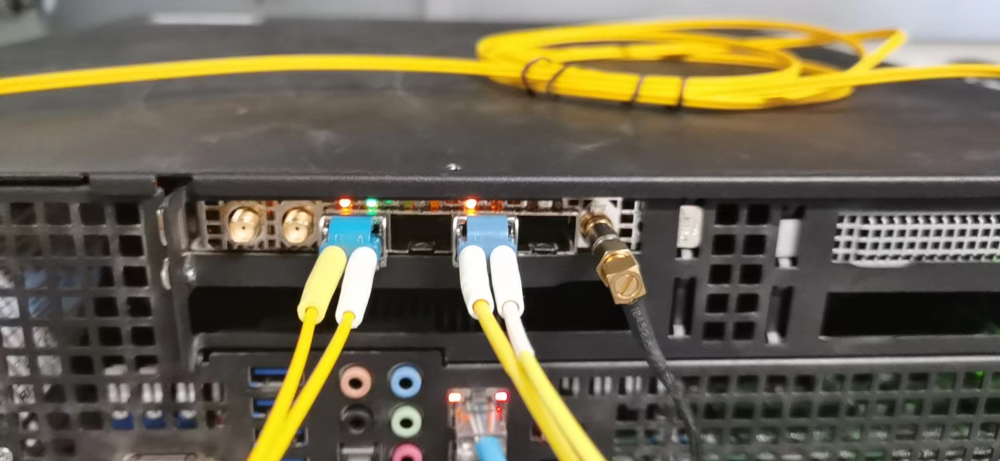

# FlexRAN 20.11 enable on ocp4, pf mode, option 7.2

本文描述，如何把 intel 的 oran 解决方案 flexran (版本 20.11) ，移植到 openshift 平台之上。

This article describes how to port Intel's oran solution flexran (version 20.11) to the openshift platform.

本运行环境，是在openshift 4.9.5 上，硬件包含了intel e810网卡， ACC100 加速卡。 由于软件的限制，网卡开启了VF模式，但是ACC100没有开启VF模式，使用的PF模式。 PTP 组件没有使用openshift自带的ptp operator，而是使用了升级的自定义版本。 容器运行的时候，和operator以及硬件的关系结构图：

This operating environment is based on openshift 4.9.5, and the hardware includes intel e810 network card and ACC100 accelerator card. Due to software limitations, the network card enables the VF mode, but the ACC100 does not enable the VF mode and uses the PF mode. The PTP component does not use the ptp operator that comes with openshift, but uses an upgraded custom version. When the container is running, the structure diagram of the relationship with the operator and hardware:


本次实验整体网络架构图：
The overall network architecture diagram of this experiment:


intel E810 Nic 的样子：



intel ACC100 是这个样子的


实验用的RU 长这个样子
The RU used for the experiment looks like this


视频讲解

[<kbd></kbd>](https://www.bilibili.com/video/BV1LY4y1n7sQ)

- [bilibili](https://www.bilibili.com/video/BV1LY4y1n7sQ)
- [youtube](https://youtu.be/Nz0-6fhPoOM)

如何编译相关的基础镜像，请参考[环境开发文档](./4.10.flexran.20.11.pf.md) 。

How to compile the relevant basic image, please refer to [Environmental Development Documentation](./4.10.flexran.20.11.pf.md) 。

# 应用镜像编译

我们已经制作好了一个基础镜像，quay.io/nepdemo/flexran_vdu:flexran-20.11-dpdk-19.11-ocp4.9.5-ubi-8.4-core-conf ，镜像很大（>5G)， 项目现场有一个镜像仓库，就很有必要了。在项目现场，我们需要调整bbu应用参数的，这个是通过一个config map，注入一个脚本实现的。

## 核配置

bbu应用是大型的dpdk应用，而dpdk应用，cpu绑定配置，非常重要，配置不善，直接导致dpdk应用core dump，甚至物理机死机，这里，我们就提供一个 16 核配置的模板。他使用 1-16 core，实际测试证明，稳定性还是可以接受的。

demo bbu 应用的特点，是物理层使用8个core，l2, l3使用剩下的8个core，这些core如果相互冲突，物理层就会coredump.

# 制作镜像

上游镜像是一个包含systemd的ubi-init镜像，里面是有一个set_ip.sh的脚本，并且配置了对应的system service。 但是在项目实际过程中，发现通过systemd 启动服务的方式，启动bbu等应用，有莫名其妙的退出问题，于是我们还是用这个 ubi-init 的镜像，但是启动的时候，就不去用默认的init了，而是指定脚本运行。

既然指定脚本运行了，那我们就在这个脚本里面，做环境初始化，并且把bbu的核绑定参数也放进去。最后，在k8s的配置里面，启动bbu应用。

具体的制作镜像步骤，非常繁琐，[参见这个文档](./4.10.flexran.20.11.pf.md#build-flexran-with-intel-iccicx)。

# deploy on ocp 4.9.5

镜像都准备好了，我们开始在openshift4 上进行部署测试。

## set security for temp image registry

我们临时创建了一个镜像仓库，那么我们就要把这个配置放到集群里面去，主要是让ocp集群，不要检查这个新镜像仓库的证书。

- [How to remove worker role from master in Red Hat OpenShift Container Platform 4.x?](https://access.redhat.com/solutions/4564851)

```bash
export BASE_DIR='/home/sno/'

mkdir ${BASE_DIR}/data/{sno/disconnected,install}

# oc patch schedulers.config.openshift.io/cluster --type merge -p '{"spec":{"mastersSchedulable":false}}'

################
# if you have not, you can install the binary as root
install /data/ocp4/clients/butane-amd64 /usr/local/bin/butane
################

cat << EOF > ${BASE_DIR}/data/sno/tmp.images.bu
variant: openshift
version: 4.9.0
metadata:
  labels:
    machineconfiguration.openshift.io/role: master
  name: 99-zzz-worker-temp-images
storage:
  files:
    - path: /etc/containers/registries.conf.d/temp.registries.conf
      overwrite: true
      contents:
        inline: |

            [[registry]]
            location = "tmp-registry.ocp4.redhat.ren:5443"
            insecure = true
            blocked = false
            mirror-by-digest-only = false
            prefix = ""

EOF

butane ${BASE_DIR}/data/sno/tmp.images.bu > ${BASE_DIR}/data/sno/99-zzz-worker-temp-images.yaml

oc create -f ${BASE_DIR}/data/sno/99-zzz-worker-temp-images.yaml

```

## single node, rt-kernel setting

bbu 应用是需要实时操作系统支持的，那么我们就用openshift的performance addon operator来搞这个事情，pao支持激活rt-kernel，同时还能设置一些内核参数，我们需要把hugepage，cpu隔离设置好，还有e810的驱动屏蔽。

The bbu application needs the support of the real-time operating system, so we use the performance addon operator of openshift to do this. Pao supports the activation of rt-kernel, and can also set some kernel parameters. We need to set hugepage and cpu isolation. There are driver shields for e810.

```bash


cat << EOF > ${BASE_DIR}/data/install/pao-namespace.yaml
---
apiVersion: v1
kind: Namespace
metadata:
  name: openshift-performance-addon-operator
  annotations:
    workload.openshift.io/allowed: management
---
apiVersion: operators.coreos.com/v1
kind: OperatorGroup
metadata:
  name: openshift-performance-addon-operator
  namespace: openshift-performance-addon-operator
---
apiVersion: operators.coreos.com/v1alpha1
kind: Subscription
metadata:
  name: openshift-performance-addon-operator-subscription
  namespace: openshift-performance-addon-operator
spec:
  channel: "4.9" 
  installPlanApproval: Manual
  name: performance-addon-operator
  source: redhat-operators 
  sourceNamespace: openshift-marketplace
EOF
oc create -f ${BASE_DIR}/data/install/pao-namespace.yaml

oc get installplan -A
# NAMESPACE                              NAME            CSV                                  APPROVAL   APPROVED
# openshift-performance-addon-operator   install-mx5kb   performance-addon-operator.v4.9.10   Manual     false

VAR_INSTALL_PLAN=`oc get installplan -A -o json | jq -r ' first( .items[].metadata | select( .namespace == "openshift-performance-addon-operator" ) | .name )  '`

oc patch installplan ${VAR_INSTALL_PLAN} \
    --namespace openshift-performance-addon-operator \
    --type merge \
    --patch '{"spec":{"approved":true}}'

oc get csv -n openshift-performance-addon-operator
# NAME                                 DISPLAY                      VERSION   REPLACES   PHASE
# performance-addon-operator.v4.9.10   Performance Addon Operator   4.9.10               Succeeded

cat << EOF > ${BASE_DIR}/data/install/performance-2.yaml
---
apiVersion: performance.openshift.io/v2
kind: PerformanceProfile
metadata:
   name: wzh-performanceprofile-2
spec:
  additionalKernelArgs:
    - nmi_watchdog=0
    - isolcpus=1-18
    - nohz_full=1-18
    - rcu_nocbs=1-18
    - kthread_cpus=0,19
    - irqaffinity=0,19
    - iommu=pt
    - intel_iommu=on
    - intel_pstate=disable
    # try to upgrade e810 driver
    - module_name.blacklist=1 
    - rd.driver.blacklist=ice
    # profile creator
    - audit=0
    - mce=off
    - nmi_watchdog=0
  globallyDisableIrqLoadBalancing: true
  cpu:
      isolated: "1-18"
      reserved: "0,19"
  hugepages:
    defaultHugepagesSize: "1G"
    pages:
    - size:  "1G"
      count:  24
  realTimeKernel:
      enabled: true
  numa:  
      topologyPolicy: "single-numa-node"
  nodeSelector:
      node-role.kubernetes.io/master: ""
  machineConfigPoolSelector:
    pools.operator.machineconfiguration.openshift.io/master: ""
EOF
oc create  --save-config  -f ${BASE_DIR}/data/install/performance-2.yaml

# oc apply -f ${BASE_DIR}/data/install/performance-2.yaml
# oc delete -f ${BASE_DIR}/data/install/performance-2.yaml

# the result is really funny
# ocp system service will not cost cpu core
# 由于我们之前使用了 workload-partition， 所以这里面的 pod 使用 cpu 的量，就全是 0 了。
oc describe node/acm-demo-hub-master
# Name:               acm-demo-hub-master
# Roles:              master,worker
# Labels:             beta.kubernetes.io/arch=amd64
#                     beta.kubernetes.io/os=linux
#                     kubernetes.io/arch=amd64
#                     kubernetes.io/hostname=acm-demo-hub-master
#                     kubernetes.io/os=linux
#                     node-role.kubernetes.io/master=
#                     node-role.kubernetes.io/worker=
#                     node.openshift.io/os_id=rhcos
# Annotations:        machineconfiguration.openshift.io/controlPlaneTopology: SingleReplica
#                     machineconfiguration.openshift.io/currentConfig: rendered-master-431f0a1ef18de254a83a28a507f5eca4
#                     machineconfiguration.openshift.io/desiredConfig: rendered-master-431f0a1ef18de254a83a28a507f5eca4
#                     machineconfiguration.openshift.io/reason:
#                     machineconfiguration.openshift.io/ssh: accessed
#                     machineconfiguration.openshift.io/state: Done
#                     sriovnetwork.openshift.io/state: Idle
#                     volumes.kubernetes.io/controller-managed-attach-detach: true
# CreationTimestamp:  Wed, 31 Aug 2022 12:21:47 +0800
# Taints:             <none>
# Unschedulable:      false
# Lease:
#   HolderIdentity:  acm-demo-hub-master
#   AcquireTime:     <unset>
#   RenewTime:       Wed, 31 Aug 2022 14:26:43 +0800
# Conditions:
#   Type             Status  LastHeartbeatTime                 LastTransitionTime                Reason                       Message
#   ----             ------  -----------------                 ------------------                ------                       -------
#   MemoryPressure   False   Wed, 31 Aug 2022 14:24:29 +0800   Wed, 31 Aug 2022 12:21:47 +0800   KubeletHasSufficientMemory   kubelet has sufficient memory available
#   DiskPressure     False   Wed, 31 Aug 2022 14:24:29 +0800   Wed, 31 Aug 2022 12:21:47 +0800   KubeletHasNoDiskPressure     kubelet has no disk pressure
#   PIDPressure      False   Wed, 31 Aug 2022 14:24:29 +0800   Wed, 31 Aug 2022 12:21:47 +0800   KubeletHasSufficientPID      kubelet has sufficient PID available
#   Ready            True    Wed, 31 Aug 2022 14:24:29 +0800   Wed, 31 Aug 2022 12:23:28 +0800   KubeletReady                 kubelet is posting ready status
# Addresses:
#   InternalIP:  192.168.7.18
#   Hostname:    acm-demo-hub-master
# Capacity:
#   cpu:                                     20
#   ephemeral-storage:                       468315972Ki
#   hugepages-1Gi:                           24Gi
#   hugepages-2Mi:                           0
#   management.workload.openshift.io/cores:  20k
#   memory:                                  130626888Ki
#   openshift.io/intel_810_nic01_rt2:        2
#   pods:                                    250
# Allocatable:
#   cpu:                                     18
#   ephemeral-storage:                       468315972Ki
#   hugepages-1Gi:                           24Gi
#   hugepages-2Mi:                           0
#   management.workload.openshift.io/cores:  20k
#   memory:                                  104334664Ki
#   openshift.io/intel_810_nic01_rt2:        2
#   pods:                                    250
# System Info:
#   Machine ID:                                       854e5051182f4d4794449a7d6da7b998
#   System UUID:                                      5de7a000-1fb3-11eb-8000-ac1f6bea5b32
#   Boot ID:                                          3638f4b8-c943-477b-9927-9b440672d5f1
#   Kernel Version:                                   4.18.0-305.19.1.rt7.91.el8_4.x86_64
#   OS Image:                                         Red Hat Enterprise Linux CoreOS 49.84.202110220538-0 (Ootpa)
#   Operating System:                                 linux
#   Architecture:                                     amd64
#   Container Runtime Version:                        cri-o://1.22.0-74.rhaos4.9.gitd745cab.el8
#   Kubelet Version:                                  v1.22.0-rc.0+a44d0f0
#   Kube-Proxy Version:                               v1.22.0-rc.0+a44d0f0
# Non-terminated Pods:                                (85 in total)
#   Namespace                                         Name                                                          CPU Requests  CPU Limits  Memory Requests  Memory Limits  Age
#   ---------                                         ----                                                          ------------  ----------  ---------------  -------------  ---
#   openshift-apiserver-operator                      openshift-apiserver-operator-55d746f449-lst4d                 0 (0%)        0 (0%)      50Mi (0%)        0 (0%)         124m
#   openshift-apiserver                               apiserver-5bdc7f69c5-wlmsk                                    0 (0%)        0 (0%)      250Mi (0%)       0 (0%)         123m
#   openshift-authentication-operator                 authentication-operator-774b6569d7-568s7                      0 (0%)        0 (0%)      200Mi (0%)       0 (0%)         124m
#   openshift-authentication                          oauth-openshift-6fc979c9bd-bvwcq                              0 (0%)        0 (0%)      50Mi (0%)        0 (0%)         112m
#   openshift-cloud-controller-manager-operator       cluster-cloud-controller-manager-operator-6448cc4cbf-vwt76    0 (0%)        0 (0%)      75Mi (0%)        0 (0%)         119m
#   openshift-cloud-credential-operator               cloud-credential-operator-7b7bf8dc4d-9c9tv                    0 (0%)        0 (0%)      170Mi (0%)       0 (0%)         124m
#   openshift-cluster-machine-approver                machine-approver-6bff6ffc5c-wtj6c                             0 (0%)        0 (0%)      70Mi (0%)        0 (0%)         124m
#   openshift-cluster-node-tuning-operator            cluster-node-tuning-operator-7b686645f7-7dfjc                 0 (0%)        0 (0%)      20Mi (0%)        0 (0%)         124m
#   openshift-cluster-node-tuning-operator            tuned-pz5b7                                                   0 (0%)        0 (0%)      50Mi (0%)        0 (0%)         123m
#   openshift-cluster-samples-operator                cluster-samples-operator-8487969f7f-dbw4w                     0 (0%)        0 (0%)      100Mi (0%)       0 (0%)         113m
#   openshift-cluster-storage-operator                cluster-storage-operator-657b6dbcf5-g5kpq                     0 (0%)        0 (0%)      20Mi (0%)        0 (0%)         119m
#   openshift-cluster-storage-operator                csi-snapshot-controller-c9fc7f64d-p9vhp                       0 (0%)        0 (0%)      50Mi (0%)        0 (0%)         123m
#   openshift-cluster-storage-operator                csi-snapshot-controller-operator-567447f7d-f62sd              0 (0%)        0 (0%)      65Mi (0%)        0 (0%)         124m
#   openshift-cluster-storage-operator                csi-snapshot-webhook-6b8fd4cd5-6n9nd                          0 (0%)        0 (0%)      20Mi (0%)        0 (0%)         123m
#   openshift-cluster-version                         cluster-version-operator-876dd79bc-wbrhd                      0 (0%)        0 (0%)      50Mi (0%)        0 (0%)         124m
#   openshift-config-operator                         openshift-config-operator-84c79bb7ff-sv9rt                    0 (0%)        0 (0%)      50Mi (0%)        0 (0%)         124m
#   openshift-console-operator                        console-operator-877d55c67-sgzgh                              0 (0%)        0 (0%)      100Mi (0%)       0 (0%)         113m
#   openshift-console                                 console-6dd9fbf5df-fx46n                                      0 (0%)        0 (0%)      100Mi (0%)       0 (0%)         113m
#   openshift-console                                 downloads-7bf7f79799-hhd7m                                    0 (0%)        0 (0%)      50Mi (0%)        0 (0%)         113m
#   openshift-controller-manager-operator             openshift-controller-manager-operator-8677b9646d-zplm2        0 (0%)        0 (0%)      50Mi (0%)        0 (0%)         124m
#   openshift-controller-manager                      controller-manager-l6247                                      0 (0%)        0 (0%)      100Mi (0%)       0 (0%)         118m
#   openshift-dns-operator                            dns-operator-78554c7bcf-s4qj2                                 0 (0%)        0 (0%)      69Mi (0%)        0 (0%)         124m
#   openshift-dns                                     dns-default-cpkb5                                             0 (0%)        0 (0%)      110Mi (0%)       0 (0%)         123m
#   openshift-dns                                     node-resolver-9l725                                           0 (0%)        0 (0%)      21Mi (0%)        0 (0%)         122m
#   openshift-etcd-operator                           etcd-operator-7db94dd56c-tfwbs                                0 (0%)        0 (0%)      50Mi (0%)        0 (0%)         124m
#   openshift-etcd                                    etcd-acm-demo-hub-master                                      0 (0%)        0 (0%)      930Mi (0%)       0 (0%)         120m
#   openshift-image-registry                          cluster-image-registry-operator-5df5b98d98-zfdpz              0 (0%)        0 (0%)      50Mi (0%)        0 (0%)         119m
#   openshift-image-registry                          node-ca-vfhtq                                                 0 (0%)        0 (0%)      10Mi (0%)        0 (0%)         105m
#   openshift-ingress-canary                          ingress-canary-tzc67                                          0 (0%)        0 (0%)      20Mi (0%)        0 (0%)         113m
#   openshift-ingress-operator                        ingress-operator-7d8949dc8f-qx87l                             0 (0%)        0 (0%)      96Mi (0%)        0 (0%)         119m
#   openshift-ingress                                 router-default-5bd7895795-5dz6f                               0 (0%)        0 (0%)      256Mi (0%)       0 (0%)         113m
#   openshift-insights                                insights-operator-54cfdf5955-xr2hn                            0 (0%)        0 (0%)      30Mi (0%)        0 (0%)         119m
#   openshift-kube-apiserver-operator                 kube-apiserver-operator-75667c776-8wv8x                       0 (0%)        0 (0%)      50Mi (0%)        0 (0%)         124m
#   openshift-kube-apiserver                          kube-apiserver-acm-demo-hub-master                            0 (0%)        0 (0%)      1224Mi (1%)      0 (0%)         103m
#   openshift-kube-controller-manager-operator        kube-controller-manager-operator-554c969679-rjm58             0 (0%)        0 (0%)      50Mi (0%)        0 (0%)         124m
#   openshift-kube-controller-manager                 kube-controller-manager-acm-demo-hub-master                   0 (0%)        0 (0%)      500Mi (0%)       0 (0%)         103m
#   openshift-kube-scheduler-operator                 openshift-kube-scheduler-operator-65cfbb579d-8z67f            0 (0%)        0 (0%)      50Mi (0%)        0 (0%)         124m
#   openshift-kube-scheduler                          openshift-kube-scheduler-acm-demo-hub-master                  0 (0%)        0 (0%)      150Mi (0%)       0 (0%)         112m
#   openshift-kube-storage-version-migrator-operator  kube-storage-version-migrator-operator-75ddfc8678-f8f9k       0 (0%)        0 (0%)      50Mi (0%)        0 (0%)         124m
#   openshift-kube-storage-version-migrator           migrator-677bb6d5c6-68m79                                     0 (0%)        0 (0%)      200Mi (0%)       0 (0%)         123m
#   openshift-machine-api                             cluster-autoscaler-operator-7cbdd7b957-5rf5j                  0 (0%)        0 (0%)      70Mi (0%)        0 (0%)         119m
#   openshift-machine-api                             cluster-baremetal-operator-685df5cff4-c8hjv                   0 (0%)        0 (0%)      70Mi (0%)        0 (0%)         119m
#   openshift-machine-api                             machine-api-operator-8557bd9ff7-gwjkw                         0 (0%)        0 (0%)      70Mi (0%)        0 (0%)         119m
#   openshift-machine-config-operator                 machine-config-controller-858cb85f5b-q5hbq                    0 (0%)        0 (0%)      50Mi (0%)        0 (0%)         123m
#   openshift-machine-config-operator                 machine-config-daemon-ch842                                   0 (0%)        0 (0%)      100Mi (0%)       0 (0%)         123m
#   openshift-machine-config-operator                 machine-config-operator-6959c74c7d-ztbhq                      0 (0%)        0 (0%)      50Mi (0%)        0 (0%)         124m
#   openshift-machine-config-operator                 machine-config-server-wtrlq                                   0 (0%)        0 (0%)      50Mi (0%)        0 (0%)         122m
#   openshift-marketplace                             certified-operators-wfc4n                                     0 (0%)        0 (0%)      50Mi (0%)        0 (0%)         116m
#   openshift-marketplace                             community-operators-rxbzd                                     0 (0%)        0 (0%)      50Mi (0%)        0 (0%)         116m
#   openshift-marketplace                             marketplace-operator-6687647b9f-thl2c                         0 (0%)        0 (0%)      50Mi (0%)        0 (0%)         124m
#   openshift-marketplace                             redhat-marketplace-44vqp                                      0 (0%)        0 (0%)      50Mi (0%)        0 (0%)         15m
#   openshift-marketplace                             redhat-operators-nqfkw                                        0 (0%)        0 (0%)      50Mi (0%)        0 (0%)         116m
#   openshift-monitoring                              alertmanager-main-0                                           0 (0%)        0 (0%)      105Mi (0%)       0 (0%)         104m
#   openshift-monitoring                              cluster-monitoring-operator-7f854d5d58-pkgpf                  0 (0%)        0 (0%)      95Mi (0%)        0 (0%)         124m
#   openshift-monitoring                              grafana-564f68c957-8jbdw                                      0 (0%)        0 (0%)      84Mi (0%)        0 (0%)         104m
#   openshift-monitoring                              kube-state-metrics-68c97744-d9wn6                             0 (0%)        0 (0%)      110Mi (0%)       0 (0%)         122m
#   openshift-monitoring                              node-exporter-snmlt                                           0 (0%)        0 (0%)      47Mi (0%)        0 (0%)         122m
#   openshift-monitoring                              openshift-state-metrics-fc7679d85-mdd4j                       0 (0%)        0 (0%)      72Mi (0%)        0 (0%)         122m
#   openshift-monitoring                              prometheus-adapter-6d9cff9c6f-rfxnb                           0 (0%)        0 (0%)      40Mi (0%)        0 (0%)         113m
#   openshift-monitoring                              prometheus-k8s-0                                              0 (0%)        0 (0%)      1119Mi (1%)      0 (0%)         104m
#   openshift-monitoring                              prometheus-operator-7f459b5bff-296xr                          0 (0%)        0 (0%)      165Mi (0%)       0 (0%)         123m
#   openshift-monitoring                              thanos-querier-7c78dc4b85-6lq97                               0 (0%)        0 (0%)      77Mi (0%)        0 (0%)         104m
#   openshift-multus                                  multus-additional-cni-plugins-p8msn                           0 (0%)        0 (0%)      10Mi (0%)        0 (0%)         124m
#   openshift-multus                                  multus-admission-controller-kv926                             0 (0%)        0 (0%)      70Mi (0%)        0 (0%)         124m
#   openshift-multus                                  multus-wjh9w                                                  0 (0%)        0 (0%)      65Mi (0%)        0 (0%)         124m
#   openshift-multus                                  network-metrics-daemon-lwjjg                                  0 (0%)        0 (0%)      120Mi (0%)       0 (0%)         124m
#   openshift-network-diagnostics                     network-check-source-99fbfd69b-psb4h                          0 (0%)        0 (0%)      40Mi (0%)        0 (0%)         124m
#   openshift-network-diagnostics                     network-check-target-8c77l                                    0 (0%)        0 (0%)      15Mi (0%)        0 (0%)         124m
#   openshift-network-operator                        network-operator-6f4564ffb-ssbxd                              0 (0%)        0 (0%)      50Mi (0%)        0 (0%)         124m
#   openshift-oauth-apiserver                         apiserver-84cf7b8647-9g64t                                    0 (0%)        0 (0%)      200Mi (0%)       0 (0%)         122m
#   openshift-operator-lifecycle-manager              catalog-operator-6b786b568c-sf5g8                             0 (0%)        0 (0%)      80Mi (0%)        0 (0%)         119m
#   openshift-operator-lifecycle-manager              olm-operator-5b5784699-6b2l8                                  0 (0%)        0 (0%)      160Mi (0%)       0 (0%)         119m
#   openshift-operator-lifecycle-manager              package-server-manager-54cf4dcd47-6pvdt                       0 (0%)        0 (0%)      50Mi (0%)        0 (0%)         119m
#   openshift-operator-lifecycle-manager              packageserver-6b6ccd7f96-rxrlh                                0 (0%)        0 (0%)      50Mi (0%)        0 (0%)         113m
#   openshift-performance-addon-operator              performance-operator-6fbcbff55b-v7fzd                         0 (0%)        0 (0%)      25Mi (0%)        0 (0%)         87m
#   openshift-sdn                                     sdn-controller-w2kv7                                          0 (0%)        0 (0%)      50Mi (0%)        0 (0%)         124m
#   openshift-sdn                                     sdn-rmqn2                                                     0 (0%)        0 (0%)      220Mi (0%)       0 (0%)         124m
#   openshift-service-ca-operator                     service-ca-operator-dccbbb5f4-fpq82                           0 (0%)        0 (0%)      80Mi (0%)        0 (0%)         124m
#   openshift-service-ca                              service-ca-677c5d456-mc7mx                                    0 (0%)        0 (0%)      120Mi (0%)       0 (0%)         123m
#   openshift-sriov-network-operator                  network-resources-injector-2xg7p                              0 (0%)        0 (0%)      50Mi (0%)        0 (0%)         10m
#   openshift-sriov-network-operator                  operator-webhook-8s4vp                                        0 (0%)        0 (0%)      50Mi (0%)        0 (0%)         10m
#   openshift-sriov-network-operator                  sriov-device-plugin-9w8kq                                     0 (0%)        0 (0%)      50Mi (0%)        0 (0%)         7m32s
#   openshift-sriov-network-operator                  sriov-network-config-daemon-rjbc6                             0 (0%)        0 (0%)      120Mi (0%)       0 (0%)         10m
#   openshift-sriov-network-operator                  sriov-network-operator-9fb894544-6k24x                        0 (0%)        0 (0%)      0 (0%)           0 (0%)         11m
#   vbbu-demo                                         nepdemo-linuxptp-daemon-b5898b74-xgrsp                        0 (0%)        0 (0%)      0 (0%)           0 (0%)         14m
# Allocated resources:
#   (Total limits may be over 100 percent, i.e., overcommitted.)
#   Resource                                Requests     Limits
#   --------                                --------     ------
#   cpu                                     0 (0%)       0 (0%)
#   memory                                  9905Mi (9%)  0 (0%)
#   ephemeral-storage                       0 (0%)       0 (0%)
#   hugepages-1Gi                           0 (0%)       0 (0%)
#   hugepages-2Mi                           0 (0%)       0 (0%)
#   management.workload.openshift.io/cores  2521         2521
#   openshift.io/intel_810_nic01_rt2        0            0
# Events:

# 让我们看看 sriov 的 cpu 使用情况
oc exec -n openshift-sriov-network-operator sriov-device-plugin-9w8kq -- cat /sys/fs/cgroup/cpuset/cpuset.cpus
# 0,19

# 让我们再看看 ptp 的 cpu 使用情况
oc exec -n vbbu-demo nepdemo-linuxptp-daemon-b5898b74-xgrsp -- cat /sys/fs/cgroup/cpuset/cpuset.cpus
# Defaulted container "ptp4l" out of: ptp4l, phc2sys, ts2phc
# 0-19

# 可以看到，系统服务，被限制在了 0，19
# 普通的用户服务，如果没有其他服务做核绑定，还是可以使用全部的 cpu core

```

## enable sctp

```bash
cat << EOF > ${BASE_DIR}/data/install/sctp-module.yaml
apiVersion: machineconfiguration.openshift.io/v1
kind: MachineConfig
metadata:
  name: 99-master-rt-load-sctp-module
  labels:
    machineconfiguration.openshift.io/role: master
spec:
  config:
    ignition:
      version: 3.2.0
    storage:
      files:
        - path: /etc/modprobe.d/sctp-blacklist.conf
          mode: 0644
          overwrite: true
          contents:
            source: data:,
        - path: /etc/modules-load.d/sctp-load.conf
          mode: 0644
          overwrite: true
          contents:
            source: data:,sctp
EOF
oc create --save-config -f ${BASE_DIR}/data/install/sctp-module.yaml

# oc label node worker-2.ocp4.redhat.ren node-role.kubernetes.io/worker-rt-2=""

```

## intel e810 driver

openshift 4.9.5 对应的coreos操作系统里面自带的e810驱动ice.ko，版本比较低，无法支持ptp，我们需要升级驱动。但是coreos升级驱动操作比较麻烦，我们需要制作一个systemd service，让他在kubelet之前启动，在这个service 里面，用podman启动一个特权容器，在容器里面，insmod ice.ko。当然一切的前提，是在kernel参数上，屏蔽了ice的自动加载。

The e810 driver ice.ko that comes with the coreos operating system corresponding to openshift 4.9.5 has a relatively low version and cannot support ptp. We need to upgrade the driver. But the coreos upgrade driver operation is more troublesome, we need to make a systemd service, let it start before kubelet, in this service, use podman to start a privileged container, in the container, insmod ice.ko. Of course, the premise of everything is that the automatic loading of ice is blocked on the kernel parameters.

```bash

cat << EOF > ${BASE_DIR}/data/sno/static-pod.bu
variant: openshift
version: 4.9.0
metadata:
  labels:
    machineconfiguration.openshift.io/role: master
  name: 99-zzz-e810-dpdk-driver-static-master
storage:
  files:
    - path: /etc/modprobe.d/blacklist-ice.conf
      mode: 0644
      overwrite: true
      contents:
        inline: |
          blacklist ice
systemd:
  units:
    - name: driver.ice.service
      enabled: true
      contents: |
        [Unit]
        Description=driver.ice service
        Wants=network-online.target
        After=network-online.target

        [Service]
        Type=oneshot
        RemainAfterExit=yes
        User=root
        WorkingDirectory=/root/
        ExecStart=podman run --privileged --rm -it quay.io/nepdemo/intel-driver:8.4-rt-1.9.7 /bin/sh -c " rmmod ice; rmmod auxiliary ; insmod /diy/auxiliary.ko; insmod /diy/ice.ko ; "

        [Install]
        WantedBy=multi-user.target
    - name: kubelet.service
      dropins:
      - name: 99-after-ice.conf
        contents: |
          [Unit]
          Requires=driver.ice.service
          After=driver.ice.service

EOF

butane -d ${BASE_DIR}/data/install ${BASE_DIR}/data/sno/static-pod.bu > ${BASE_DIR}/data/install/99-zzz-e810-dpdk-driver-static-master.yaml

oc create --save-config -f ${BASE_DIR}/data/install/99-zzz-e810-dpdk-driver-static-master.yaml

# oc apply -f /data/install/99-zzz-e810-dpdk-driver-static-worker-rt-2.yaml
# oc delete -f /data/install/99-zzz-e810-dpdk-driver-static-worker-rt-2.yaml

```

## linuxptp 3.11

vRAN应用，特别是option 7.2 的方案，需要ptp时钟方案支持，物理形态，要么是GPS master连到交换机上，通过交换机授时，要么GPS master直接连网卡上。在服务器端，需要支持网络授时的网卡，并且主机上要启动ptp相关的服务，同时关掉ntp。


从上图可以看到，ptp4l，是从网络上拿时间到网卡上，phc2sys，是从网卡上，写到系统时钟上。ts2phc应该是把本地时间同步给其他设备用的。

openshift自带的ptp operator版本比较低，我们需要升级，就自己做镜像，做服务吧。

### build linuxptp container image

我们在外网，用linuxptp 3.1.1版本做镜像，并且支持注入参数。方便项目现场调整。

```bash
# http://linuxptp.sourceforge.net/
# download linuxptp-3.1.1

mkdir -p /data/ptp
cd /data/ptp
wget https://nchc.dl.sourceforge.net/project/linuxptp/v3.1/linuxptp-3.1.1.tgz
tar zvxf linuxptp-3.1.1.tgz
cd linuxptp-3.1.1
make

cat << 'EOF' > ptp4l.sh
#!/bin/bash

if [ -z $DEMO_ENV_PRIO ]; then
  /usr/local/sbin/ptp4l -f /etc/ptp4l.conf -m $DEMO_ENV_PTP4L_ARG
else
  /usr/bin/chrt -f $DEMO_ENV_PRIO /usr/local/sbin/ptp4l -f /etc/ptp4l.conf -m $DEMO_ENV_PTP4L_ARG
fi

EOF

cat << 'EOF' > phc2sys.sh
#!/bin/bash

if [ -z $DEMO_ENV_PRIO ]; then
  /usr/local/sbin/phc2sys -m -z /var/run/ptp4l -t [phc2sys] $DEMO_ENV_PHC2SYS_ARG
else
  /usr/bin/chrt -f $DEMO_ENV_PRIO /usr/local/sbin/phc2sys -m -z /var/run/ptp4l -t [phc2sys] $DEMO_ENV_PHC2SYS_ARG
fi

EOF

cat << 'EOF' > ts2phc.sh
#!/bin/bash

if [ -z  $DEMO_ENV_PRIO ]; then
  /usr/local/sbin/ts2phc -f /etc/ts2phc.cfg -m $DEMO_ENV_TS2PHC_ARG
else
  /usr/bin/chrt -f $DEMO_ENV_PRIO /usr/local/sbin/ts2phc -f /etc/ts2phc.cfg -m $DEMO_ENV_TS2PHC_ARG
fi

EOF

cat << EOF > ./ptp.dockerfile
FROM registry.access.redhat.com/ubi8/ubi:8.4

COPY hwstamp_ctl nsm phc2sys phc_ctl pmc ptp4l timemaster ts2phc incdefs.sh version.sh ptp4l.sh phc2sys.sh ts2phc.sh /usr/local/sbin/
RUN cd /usr/local/sbin/ && chmod +x hwstamp_ctl nsm phc2sys phc_ctl pmc ptp4l timemaster ts2phc incdefs.sh version.sh ptp4l.sh phc2sys.sh ts2phc.sh

EOF

podman build --squash -t quay.io/nepdemo/linuxptp:3.1.1-ubi-8.4-v06 -f ptp.dockerfile ./

podman push quay.io/nepdemo/linuxptp:3.1.1-ubi-8.4-v06

```

### deploy linux ptp

有了镜像，我们就做一个deployment，来启动ptp，注意，里面有3个container, 同时还有一些configmap 做配置文件注入. 在项目现场, 注意需要调整配置文件参数. 

```bash

oc new-project vbbu-demo

oc project vbbu-demo

export REG_TMP='tmp-registry.ocp4.redhat.ren:5443'

# kernel driver deployment
oc create serviceaccount svcacct-driver -n vbbu-demo
oc adm policy add-scc-to-user privileged -z svcacct-driver -n vbbu-demo
# oc adm policy add-scc-to-user anyuid -z mysvcacct -n vbbu-demo

# !!! remember to disable chronyd on dest host !!!
# we do not use ptp opeerator, so we need to do it manually
# TODO
# https://docs.openshift.com/container-platform/4.10/scalability_and_performance/ztp-configuring-single-node-cluster-deployment-during-installation.html#sno-du-disabling-ntp_sno-du-deploying-distributed-units-manually-on-single-node-openshift

cat << 'EOF' > ${BASE_DIR}/data/install/ptp.chrony.conf
apiVersion: machineconfiguration.openshift.io/v1
kind: MachineConfig
metadata:
  labels:
    machineconfiguration.openshift.io/role: master
  name: disable-chronyd
spec:
  config:
    systemd:
      units:
        - contents: |
            [Unit]
            Description=NTP client/server
            Documentation=man:chronyd(8) man:chrony.conf(5)
            After=ntpdate.service sntp.service ntpd.service
            Conflicts=ntpd.service systemd-timesyncd.service
            ConditionCapability=CAP_SYS_TIME
            [Service]
            Type=forking
            PIDFile=/run/chrony/chronyd.pid
            EnvironmentFile=-/etc/sysconfig/chronyd
            ExecStart=/usr/sbin/chronyd $OPTIONS
            ExecStartPost=/usr/libexec/chrony-helper update-daemon
            PrivateTmp=yes
            ProtectHome=yes
            ProtectSystem=full
            [Install]
            WantedBy=multi-user.target
          enabled: false
          name: chronyd.service
    ignition:
      version: 2.2.0
EOF
oc create -f ${BASE_DIR}/data/install/ptp.chrony.conf

cat << EOF > ${BASE_DIR}/data/install/ptp4l.conf
[global]
#
# Default Data Set
#
twoStepFlag              1
slaveOnly                0
priority1                128
priority2                128
domainNumber             24
clockClass               248
clockAccuracy            0xFE
offsetScaledLogVariance  0xFFFF
free_running             0
freq_est_interval        0
#
# Port Data Set
# 16 TS a second use logSyncInterval        -4
#
#logAnnounceInterval      4
logAnnounceInterval      1
logSyncInterval          -4
logMinDelayReqInterval   0
logMinPdelayReqInterval  0
announceReceiptTimeout   3
syncReceiptTimeout       0
delayAsymmetry           0
fault_reset_interval     4
neighborPropDelayThresh  20000000
#
# Run time options
#
assume_two_step          0
logging_level            6
path_trace_enabled       0
follow_up_info           0
tx_timestamp_timeout     200
use_syslog               1
verbose                  0
summary_interval         0
kernel_leap              1
check_fup_sync           0
#
# Servo Options
#
pi_proportional_const    0.0
pi_integral_const        0.0
pi_proportional_scale    0.0
pi_proportional_exponent -0.3
pi_proportional_norm_max 0.7
pi_integral_scale        0.0
pi_integral_exponent     0.4
pi_integral_norm_max     0.3
step_threshold           0.00000002
first_step_threshold     0.00002
max_frequency            900000000
clock_servo              nullf
sanity_freq_limit        200000000
ntpshm_segment           0
#
# Transport options
#
transportSpecific        0x0
ptp_dst_mac              01:1B:19:00:00:00
p2p_dst_mac              01:80:C2:00:00:0E
udp6_scope               0x0E
uds_address              /var/run/ptp4l
#
# Default interface options
#
network_transport        UDPv4
#network_transport        L2
delay_mechanism          E2E
time_stamping            hardware
delay_filter             moving_median
delay_filter_length      10
egressLatency            0
ingressLatency           0
boundary_clock_jbod      0
#
# Clock description
#
productDescription       ;;
revisionData             ;;
manufacturerIdentity     00:00:00
userDescription          ;
timeSource               0xA0
EOF

cat << EOF > ${BASE_DIR}/data/install/ts2phc.cfg
[global]
use_syslog              0
verbose                 1
logging_level           7
ts2phc.pulsewidth       100000000
# For GNSS module
ts2phc.nmea_serialport /dev/ttyGNSS_6500_0
[ens2f0]
ts2phc.extts_polarity rising
EOF

oc delete configmap ptp-config -n vbbu-demo

oc create configmap ptp-config -n vbbu-demo --from-file=${BASE_DIR}/data/install/ptp4l.conf --from-file=${BASE_DIR}/data/install/ts2phc.cfg --save-config=true

# 06 for fifo
# 07 for nice
export VAR_IMAGE='quay.io/nepdemo/linuxptp:3.1.1-ubi-8.4-v06'

cat << EOF > ${BASE_DIR}/data/install/ptp.demo.yaml
---
apiVersion: apps/v1
kind: Deployment
metadata:
  name: nepdemo-linuxptp-daemon
  labels:
    app: nepdemo-linuxptp-daemon
spec:
  replicas: 1
  selector:
    matchLabels:
      app: nepdemo-linuxptp-daemon
  template:
    metadata:
      annotations:
      labels:
        app: nepdemo-linuxptp-daemon
      name: nepdemo-linuxptp-daemon
      # namespace: openshift-ptp
    spec:
      affinity:
        nodeAffinity:
          requiredDuringSchedulingIgnoredDuringExecution:
            nodeSelectorTerms:
            - matchFields:
              - key: metadata.name
                operator: In
                values:
                - acm-demo-hub-master
      tolerations:
      - key: "vbbu"
        operator: "Exists"
        effect: "NoSchedule"
      containers:
      - name: ptp4l
        image: $VAR_IMAGE
        command: ["/bin/sh", "-c", "--"]
        args: [" /usr/local/sbin/ptp4l.sh ;"]
        env:
        - name: DEMO_ENV_PTP4L_ARG
          value: " -i ens2f0 -2 "
        - name: DEMO_ENV_PRIO
          value: "65"
        securityContext:
          privileged: true
          runAsUser: 0 
        volumeMounts:
        - mountPath: /etc/ptp4l.conf
          subPath: ptp4l.conf
          name: config-volume
        - mountPath: /var/run
          name: socket-dir
      - name: phc2sys
        image: $VAR_IMAGE
        imagePullPolicy: IfNotPresent
        command: ["/bin/sh", "-c", "--"]
        args: [" /usr/local/sbin/phc2sys.sh ;"]
        env:
        - name: DEMO_ENV_PHC2SYS_ARG
          # value: " -s ens2f0 -O 0 -R 8 "  
          value: " -s ens2f0 -r -u 1 -O 0 -R 8 "
        - name: DEMO_ENV_PRIO
          value: "65"
        securityContext:
          privileged: true
          runAsUser: 0     
        volumeMounts:
        - mountPath: /etc/ptp4l.conf
          subPath: ptp4l.conf
          name: config-volume
        - mountPath: /var/run
          name: socket-dir
      - name: ts2phc
        image: $VAR_IMAGE
        imagePullPolicy: IfNotPresent
        command: ["/bin/sh", "-c", "--"]
        args: [" /usr/local/sbin/ts2phc.sh ;"]
        env:
        - name: DEMO_ENV_TS2PHC_ARG
          value: " -s generic -c ens2f0 "
        - name: DEMO_ENV_PRIO
          value: "65"
        securityContext:
          privileged: true
          runAsUser: 0      
        volumeMounts:
        - mountPath: /etc/ts2phc.cfg
          subPath: ts2phc.cfg
          name: config-volume
        - mountPath: /var/run
          name: socket-dir
        - name: dev
          mountPath: /dev
      hostNetwork: true
      # hostPID: true
      serviceAccountName: svcacct-driver
      volumes:
      - configMap:
          defaultMode: 420
          name: ptp-config
        name: config-volume
      - name: socket-dir
        emptyDir: {}
      - name: dev
        hostPath:
          path: "/dev"
EOF

oc create --save-config -n vbbu-demo -f ${BASE_DIR}/data/install/ptp.demo.yaml

# oc delete -n vbbu-demo -f ${BASE_DIR}/data/install/ptp.demo.yaml

```

## setup sriov operator

openshift有sriov的operator，官方支持intel e810网卡，我们直接用就好了。

- [Single Root I/O Virtualization (SR-IOV) hardware networks](https://docs.openshift.com/container-platform/4.9/networking/hardware_networks/about-sriov.html)

the env has nic Intel e810 : 8086 1593

```bash
# install sriov operator
cat << EOF > ${BASE_DIR}/data/install/sriov.yaml
---
apiVersion: v1
kind: Namespace
metadata:
  name: openshift-sriov-network-operator
  annotations:
    workload.openshift.io/allowed: management
---
apiVersion: operators.coreos.com/v1
kind: OperatorGroup
metadata:
  name: sriov-network-operators
  namespace: openshift-sriov-network-operator
spec:
  targetNamespaces:
  - openshift-sriov-network-operator
---
apiVersion: operators.coreos.com/v1alpha1
kind: Subscription
metadata:
  name: sriov-network-operator-subscription
  namespace: openshift-sriov-network-operator
spec:
  channel: "stable"
  installPlanApproval: Manual
  name: sriov-network-operator
  source: redhat-operators
  sourceNamespace: openshift-marketplace
EOF
oc create -f ${BASE_DIR}/data/install/sriov.yaml

oc get installplan -A
# NAMESPACE                              NAME            CSV                                         APPROVAL   APPROVED
# openshift-performance-addon-operator   install-mx5kb   performance-addon-operator.v4.9.10          Manual     true
# openshift-sriov-network-operator       install-blbmn   sriov-network-operator.4.9.0-202208020055   Manual     false
# openshift-sriov-network-operator       install-nlwkh   sriov-network-operator.4.9.0-202208020055   Manual     false

VAR_INSTALL_PLAN=`oc get installplan -A -o json | jq -r ' first( .items[].metadata | select( .namespace == "openshift-sriov-network-operator" ) | .name )  '`

oc patch installplan $VAR_INSTALL_PLAN \
    --namespace openshift-sriov-network-operator \
    --type merge \
    --patch '{"spec":{"approved":true}}'

oc get csv -n openshift-sriov-network-operator
# NAME                                        DISPLAY                      VERSION              REPLACES   PHASE
# performance-addon-operator.v4.9.10          Performance Addon Operator   4.9.10                          Succeeded
# sriov-network-operator.4.9.0-202208020055   SR-IOV Network Operator      4.9.0-202208020055              Succeeded
```
  
```bash
oc get SriovNetworkNodeState -n openshift-sriov-network-operator
# NAME                  AGE
# acm-demo-hub-master   3m28s

oc get SriovNetworkNodeState/acm-demo-hub-master -n openshift-sriov-network-operator -o yaml
# apiVersion: sriovnetwork.openshift.io/v1
# kind: SriovNetworkNodeState
# metadata:
#   creationTimestamp: "2022-08-30T08:42:58Z"
#   generation: 1
#   name: acm-demo-hub-master
#   namespace: openshift-sriov-network-operator
#   ownerReferences:
#   - apiVersion: sriovnetwork.openshift.io/v1
#     blockOwnerDeletion: true
#     controller: true
#     kind: SriovNetworkNodePolicy
#     name: default
#     uid: 7f0b185b-0f86-410c-94c6-b9ca4e6e1aff
#   resourceVersion: "230484"
#   uid: 593bc0e5-a1a0-4a5c-bff2-4cfec0137056
# spec:
#   dpConfigVersion: "226880"
# status:
#   interfaces:
#   - deviceID: "1593"
#     driver: ice
#     eSwitchMode: legacy
#     linkSpeed: -1 Mb/s
#     linkType: ETH
#     mac: 50:7c:6f:0a:c4:18
#     mtu: 1500
#     name: ens2f0
#     pciAddress: 0000:65:00.0
#     totalvfs: 64
#     vendor: "8086"
#   - deviceID: "1593"
#     driver: ice
#     eSwitchMode: legacy
#     linkSpeed: -1 Mb/s
#     linkType: ETH
#     mac: 50:7c:6f:0a:c4:19
#     mtu: 1500
#     name: ens2f1
#     pciAddress: 0000:65:00.1
#     totalvfs: 64
#     vendor: "8086"
#   - deviceID: "1593"
#     driver: ice
#     eSwitchMode: legacy
#     linkSpeed: -1 Mb/s
#     linkType: ETH
#     mac: 50:7c:6f:0a:c4:1a
#     mtu: 1500
#     name: ens2f2
#     pciAddress: 0000:65:00.2
#     totalvfs: 64
#     vendor: "8086"
#   - deviceID: "1593"
#     driver: ice
#     eSwitchMode: legacy
#     linkSpeed: -1 Mb/s
#     linkType: ETH
#     mac: 50:7c:6f:0a:c4:1b
#     mtu: 1500
#     name: ens2f3
#     pciAddress: 0000:65:00.3
#     totalvfs: 64
#     vendor: "8086"
#   - deviceID: 37d1
#     driver: i40e
#     linkSpeed: 1000 Mb/s
#     linkType: ETH
#     mac: ac:1f:6b:ea:5b:32
#     mtu: 1500
#     name: eno1
#     pciAddress: 0000:b5:00.0
#     totalvfs: 32
#     vendor: "8086"
#   - deviceID: 37d1
#     driver: i40e
#     linkSpeed: 1000 Mb/s
#     linkType: ETH
#     mac: ac:1f:6b:ea:5b:33
#     mtu: 1500
#     name: eno2
#     pciAddress: 0000:b5:00.1
#     totalvfs: 32
#     vendor: "8086"
#   syncStatus: Succeeded

# how to use the sriov to create VF and attach to pod, depends on use case from nep demo request
# remember to active SRIOV in bios
# remember to active VT-d in bios
cat << EOF > ${BASE_DIR}/data/install/sriov.policy.yaml
---
apiVersion: sriovnetwork.openshift.io/v1
kind: SriovNetworkNodePolicy
metadata:
  name: policy-810-nic01-rt2
  namespace: openshift-sriov-network-operator
spec:
  resourceName: intel_810_nic01_rt2
  nodeSelector:
    kubernetes.io/hostname: acm-demo-hub-master
  numVfs: 2
  nicSelector:
    vendor: "8086"
    deviceID: "1593"
    rootDevices:
      - "0000:65:00.0"
    # pfNames:
    #   - "ens2f0"
  # linkType: eth
  # isRdma: false
  deviceType: vfio-pci 
EOF
oc create -f ${BASE_DIR}/data/install/sriov.policy.yaml

# oc delete -f /data/install/sriov.policy.yaml

oc get sriovnetworknodestates/acm-demo-hub-master -n openshift-sriov-network-operator  -o jsonpath='{.status.syncStatus}' && echo
# Succeeded

cat << EOF > ${BASE_DIR}/data/install/sriov.attach.yaml
---
apiVersion: sriovnetwork.openshift.io/v1
kind: SriovNetwork
metadata:
  name: intel-810-nic01-vf0-rt2
  namespace: openshift-sriov-network-operator
spec:
  resourceName: intel_810_nic01_rt2
  networkNamespace: vbbu-demo
  vlan: 5
---
apiVersion: sriovnetwork.openshift.io/v1
kind: SriovNetwork
metadata:
  name: intel-810-nic01-vf1-rt2
  namespace: openshift-sriov-network-operator
spec:
  resourceName: intel_810_nic01_rt2
  networkNamespace: vbbu-demo
  vlan: 5
EOF
oc create -f ${BASE_DIR}/data/install/sriov.attach.yaml

# oc delete -f /data/install/sriov.attach.yaml

oc get net-attach-def -n vbbu-demo
# NAME                      AGE
# intel-810-nic01-vf0-rt2   2m19s
# intel-810-nic01-vf1-rt2   2m19s

oc get net-attach-def/intel-810-nic01-vf0-rt2 -n vbbu-demo -o yaml
# apiVersion: k8s.cni.cncf.io/v1
# kind: NetworkAttachmentDefinition
# metadata:
#   annotations:
#     k8s.v1.cni.cncf.io/resourceName: openshift.io/intel_810_nic01_rt2
#   creationTimestamp: "2022-08-31T06:26:17Z"
#   generation: 1
#   name: intel-810-nic01-vf0-rt2
#   namespace: vbbu-demo
#   resourceVersion: "47351"
#   uid: fa24b3d9-832d-4c5b-95db-9bcf1d80764a
# spec:
#   config: '{ "cniVersion":"0.3.1", "name":"intel-810-nic01-vf0-rt2","type":"sriov","vlan":5,"vlanQoS":0,"ipam":{}
#     }'

oc get net-attach-def/intel-810-nic01-vf0-rt2 -n vbbu-demo -o json | jq -r .spec.config | jq .
# {
#   "cniVersion": "0.3.1",
#   "name": "intel-810-nic01-vf0-rt2",
#   "type": "sriov",
#   "vlan": 5,
#   "vlanQoS": 0,
#   "ipam": {}
# }

```

## nepdemo license file

把license file放到config map里面，注入容器。

不过呢，当前，我们是在制作容器镜像的步骤里面，直接把license 复制到容器里面了。

```bash

# license file 加载到config map中
oc create configmap -n vbbu-demo license.for.nepdemo  \
    --from-file=license=./3496531EC238AD91DED6DBA5BD6B.lic

# to updated config map
oc create configmap -n vbbu-demo license.for.nepdemo --from-file=license=./3496531EC238AD91DED6DBA5BD6B.lic -o yaml --dry-run=client | oc apply -f -

```

## create deployment for release/production

终于, 我们要启动服务了, 这是一个dpdk程序, 我们设置resource request, limits, 达到绑核的目的.　

Finally, we have to start the service, this is a dpdk program, we set the resource request, limits, to achieve the purpose of binding the core.

```bash

oc new-project vbbu-demo

oc project vbbu-demo

# kernel driver deployment
oc create serviceaccount svcacct-driver -n vbbu-demo
oc adm policy add-scc-to-user privileged -z svcacct-driver -n vbbu-demo
# oc adm policy add-scc-to-user anyuid -z mysvcacct -n vbbu-demo

```

### 16 cpu core config, auto convert

cpu core 1-16

```bash

cat > ${BASE_DIR}/data/install/bbu.core.conf.sh << 'EOF' 
#!/bin/bash

sed -i 's/<systemThread>.*</<systemThread>2, 0, 0</'  /root/flexran/bin/nr5g/gnb/l1/phycfg_xran.xml
sed -i 's/<timerThread>.*</<timerThread>1, 96, 0</'   /root/flexran/bin/nr5g/gnb/l1/phycfg_xran.xml
sed -i 's/<FpgaDriverCpuInfo>.*</<FpgaDriverCpuInfo>3, 96, 0</'   /root/flexran/bin/nr5g/gnb/l1/phycfg_xran.xml
sed -i 's/<FrontHaulCpuInfo>.*</<FrontHaulCpuInfo>3, 96, 0</'     /root/flexran/bin/nr5g/gnb/l1/phycfg_xran.xml
sed -i 's/<radioDpdkMaster>.*</<radioDpdkMaster>2, 99, 0</'       /root/flexran/bin/nr5g/gnb/l1/phycfg_xran.xml
sed -i "s/<BbuPoolThreadDefault_0_63>.*</<BbuPoolThreadDefault_0_63>0x$(to_hex '10,11,12,13,14,15')</"   /root/flexran/bin/nr5g/gnb/l1/phycfg_xran.xml

sed -i 's/<xRANThread>.*</<xRANThread>9, 96, 0</'     /root/flexran/bin/nr5g/gnb/l1/xrancfg_sub6.xml
sed -i "s/<xRANWorker>.*</<xRANWorker>0x$(to_hex '16'), 96, 0</" /root/flexran/bin/nr5g/gnb/l1/xrancfg_sub6.xml

sed -i "s/OAM_SHARED_CORE_BITMAP=.*/OAM_SHARED_CORE_BITMAP=$(to_dec '3,4')/"  /etc/BBU_cfg/cu_cfg/gNodeB_CU_Configuration.cfg
sed -i "s/L3_SHARED_CORE_BITMAP=.*/L3_SHARED_CORE_BITMAP=$(to_dec '4,5')/"    /etc/BBU_cfg/cu_cfg/gNodeB_CU_Configuration.cfg
sed -i "s/PDCP_SHRED_CORE_BITMAP=.*/PDCP_SHRED_CORE_BITMAP=$(to_dec '7,8')/"  /etc/BBU_cfg/cu_cfg/gNodeB_CU_Configuration.cfg
sed -i "s/RRM_SHARED_CORE_BITMAP=.*/RRM_SHARED_CORE_BITMAP=$(to_dec '1,8')/"  /etc/BBU_cfg/cu_cfg/gNodeB_CU_Configuration.cfg
sed -i "s/SON_SHARED_CORE_BITMAP=.*/SON_SHARED_CORE_BITMAP=$(to_dec '1,2')/"  /etc/BBU_cfg/cu_cfg/gNodeB_CU_Configuration.cfg

# https://unix.stackexchange.com/questions/487451/sed-replace-a-pattern-between-a-pattern-and-the-end-of-file
sed -i "/<oam_shm_logger_cfg>/,\$s/<cpu_bitmap>.*</<cpu_bitmap>$(to_dec '7')</" /etc/BBU_cfg/cu_cfg/Proprietary_gNodeB_CU_Data_Model.xml
sed -i "/<shm_logger_cfg>/,\$s/<cpu_bitmap>.*</<cpu_bitmap>$(to_dec '7')</"     /etc/BBU_cfg/cu_cfg/Proprietary_gNodeB_CU_Data_Model.xml
sed -i '/<L3Params>/,$s/<core_no>.*</<core_no>2</'        /etc/BBU_cfg/cu_cfg/Proprietary_gNodeB_CU_Data_Model.xml
sed -i '/<process_name>gnb_cu_son</,$s/<process_args>.* /<process_args>2 /' /etc/BBU_cfg/cu_cfg/Proprietary_gNodeB_CU_Data_Model.xml
sed -i '/<process_name>gnb_cu_rrm</,$s/<process_args>.* /<process_args>2 /' /etc/BBU_cfg/cu_cfg/Proprietary_gNodeB_CU_Data_Model.xml
sed -i '/<pdcp_index>0</,$s/<core_num_for_worker_thread>.*</<core_num_for_worker_thread>3</' /etc/BBU_cfg/cu_cfg/Proprietary_gNodeB_CU_Data_Model.xml
sed -i '/<pdcp_index>1</,$s/<core_num_for_worker_thread>.*</<core_num_for_worker_thread>3</' /etc/BBU_cfg/cu_cfg/Proprietary_gNodeB_CU_Data_Model.xml
sed -i '/<egtpu_instance>0</,$s/<core_num_of_worker_thread>.*</<core_num_of_worker_thread>6</'  /etc/BBU_cfg/cu_cfg/Proprietary_gNodeB_CU_Data_Model.xml
sed -i '/<egtpu_instance>1</,$s/<core_num_of_worker_thread>.*</<core_num_of_worker_thread>6</'  /etc/BBU_cfg/cu_cfg/Proprietary_gNodeB_CU_Data_Model.xml
sed -i '/<f1u_instance>0</,$s/<core_num_of_worker_thread>.*</<core_num_of_worker_thread>6</'    /etc/BBU_cfg/cu_cfg/Proprietary_gNodeB_CU_Data_Model.xml
sed -i '/<f1u_instance>1</,$s/<core_num_of_worker_thread>.*</<core_num_of_worker_thread>6</'    /etc/BBU_cfg/cu_cfg/Proprietary_gNodeB_CU_Data_Model.xml
sed -i 's/<core_num_mapping>.*</<core_num_mapping>4,4</'    /etc/BBU_cfg/cu_cfg/Proprietary_gNodeB_CU_Data_Model.xml

sed -i 's/MAC_BINREAD_CORE_NUM=.*/MAC_BINREAD_CORE_NUM=1/'  /etc/BBU_cfg/du_cfg/gNB_DU_Configuration.cfg
sed -i 's/RLC_BINREAD_CORE_NUM=.*/RLC_BINREAD_CORE_NUM=1/'  /etc/BBU_cfg/du_cfg/gNB_DU_Configuration.cfg
sed -i 's/MAC_HP_CORE_NUM=.*/MAC_HP_CORE_NUM=5/'            /etc/BBU_cfg/du_cfg/gNB_DU_Configuration.cfg
sed -i 's/RLC_MASTER_CORE_NUM=.*/RLC_MASTER_CORE_NUM=2/'    /etc/BBU_cfg/du_cfg/gNB_DU_Configuration.cfg
sed -i "s/SHARED_CORE_BITMAP=.*/SHARED_CORE_BITMAP=$(to_dec '5,6')/"      /etc/BBU_cfg/du_cfg/gNB_DU_Configuration.cfg
sed -i 's/RELAY_ADAPTER_RECVR_THREAD_CORE_NUM=.*/RELAY_ADAPTER_RECVR_THREAD_CORE_NUM=4/'  /etc/BBU_cfg/du_cfg/gNB_DU_Configuration.cfg

sed -i '/<RlcProvsioningParams>/,$s/<CoreNumWorkerThread>.*</<CoreNumWorkerThread>7</'    /etc/BBU_cfg/du_cfg/Proprietary_gNodeB_DU_Data_Model.xml
sed -i '/<RlclSystemParams>/,$s/<CoreNumWorkerThread>.*</<CoreNumWorkerThread>7</'        /etc/BBU_cfg/du_cfg/Proprietary_gNodeB_DU_Data_Model.xml
sed -i '/<F1uProvisioningParams>/,$s/<numCoreWorkerThreads>.*</<numCoreWorkerThreads>7</' /etc/BBU_cfg/du_cfg/Proprietary_gNodeB_DU_Data_Model.xml

#  --a=8 --t=8  --b=8  
sed -i 's/\.\/gnb_cu_pdcp .* >/\.\/gnb_cu_pdcp --r=2 --a=8 --t=8 --m=2 --i=0 --b=8 --p=0 --s=50 --n=10 >/' /home/BaiBBU_XSS/BaiBBU_SXSS/gNB_app

EOF

oc delete configmap vbbu-core-config -n vbbu-demo

oc create configmap vbbu-core-config -n vbbu-demo --from-file=${BASE_DIR}/data/install/bbu.core.conf.sh --save-config=true


```


### 15 cpu core config, auto convert

cpu core 1-15

```bash

cat > ${BASE_DIR}/data/install/bbu.core.conf.sh << 'EOF' 
#!/bin/bash

sed -i 's/<systemThread>.*</<systemThread>2, 0, 0</'  /root/flexran/bin/nr5g/gnb/l1/phycfg_xran.xml
sed -i 's/<timerThread>.*</<timerThread>1, 96, 0</'   /root/flexran/bin/nr5g/gnb/l1/phycfg_xran.xml
sed -i 's/<FpgaDriverCpuInfo>.*</<FpgaDriverCpuInfo>3, 96, 0</'   /root/flexran/bin/nr5g/gnb/l1/phycfg_xran.xml
sed -i 's/<FrontHaulCpuInfo>.*</<FrontHaulCpuInfo>3, 96, 0</'     /root/flexran/bin/nr5g/gnb/l1/phycfg_xran.xml
sed -i 's/<radioDpdkMaster>.*</<radioDpdkMaster>2, 99, 0</'       /root/flexran/bin/nr5g/gnb/l1/phycfg_xran.xml
sed -i "s/<BbuPoolThreadDefault_0_63>.*</<BbuPoolThreadDefault_0_63>0x$(to_hex '10,11,12,13,14,15')</"   /root/flexran/bin/nr5g/gnb/l1/phycfg_xran.xml

sed -i 's/<xRANThread>.*</<xRANThread>8, 96, 0</'     /root/flexran/bin/nr5g/gnb/l1/xrancfg_sub6.xml
sed -i "s/<xRANWorker>.*</<xRANWorker>0x$(to_hex '9'), 96, 0</" /root/flexran/bin/nr5g/gnb/l1/xrancfg_sub6.xml

sed -i "s/OAM_SHARED_CORE_BITMAP=.*/OAM_SHARED_CORE_BITMAP=$(to_dec '3,4')/"  /etc/BBU_cfg/cu_cfg/gNodeB_CU_Configuration.cfg
sed -i "s/L3_SHARED_CORE_BITMAP=.*/L3_SHARED_CORE_BITMAP=$(to_dec '4,5')/"    /etc/BBU_cfg/cu_cfg/gNodeB_CU_Configuration.cfg
sed -i "s/PDCP_SHRED_CORE_BITMAP=.*/PDCP_SHRED_CORE_BITMAP=$(to_dec '7,6')/"  /etc/BBU_cfg/cu_cfg/gNodeB_CU_Configuration.cfg
sed -i "s/RRM_SHARED_CORE_BITMAP=.*/RRM_SHARED_CORE_BITMAP=$(to_dec '1,6')/"  /etc/BBU_cfg/cu_cfg/gNodeB_CU_Configuration.cfg
sed -i "s/SON_SHARED_CORE_BITMAP=.*/SON_SHARED_CORE_BITMAP=$(to_dec '1,2')/"  /etc/BBU_cfg/cu_cfg/gNodeB_CU_Configuration.cfg

# https://unix.stackexchange.com/questions/487451/sed-replace-a-pattern-between-a-pattern-and-the-end-of-file
sed -i "/<oam_shm_logger_cfg>/,\$s/<cpu_bitmap>.*</<cpu_bitmap>$(to_dec '7')</" /etc/BBU_cfg/cu_cfg/Proprietary_gNodeB_CU_Data_Model.xml
sed -i "/<shm_logger_cfg>/,\$s/<cpu_bitmap>.*</<cpu_bitmap>$(to_dec '7')</"     /etc/BBU_cfg/cu_cfg/Proprietary_gNodeB_CU_Data_Model.xml
sed -i '/<L3Params>/,$s/<core_no>.*</<core_no>2</'        /etc/BBU_cfg/cu_cfg/Proprietary_gNodeB_CU_Data_Model.xml
sed -i '/<process_name>gnb_cu_son</,$s/<process_args>.* /<process_args>2 /' /etc/BBU_cfg/cu_cfg/Proprietary_gNodeB_CU_Data_Model.xml
sed -i '/<process_name>gnb_cu_rrm</,$s/<process_args>.* /<process_args>2 /' /etc/BBU_cfg/cu_cfg/Proprietary_gNodeB_CU_Data_Model.xml
sed -i '/<pdcp_index>0</,$s/<core_num_for_worker_thread>.*</<core_num_for_worker_thread>3</' /etc/BBU_cfg/cu_cfg/Proprietary_gNodeB_CU_Data_Model.xml
sed -i '/<pdcp_index>1</,$s/<core_num_for_worker_thread>.*</<core_num_for_worker_thread>3</' /etc/BBU_cfg/cu_cfg/Proprietary_gNodeB_CU_Data_Model.xml
sed -i '/<egtpu_instance>0</,$s/<core_num_of_worker_thread>.*</<core_num_of_worker_thread>6</'  /etc/BBU_cfg/cu_cfg/Proprietary_gNodeB_CU_Data_Model.xml
sed -i '/<egtpu_instance>1</,$s/<core_num_of_worker_thread>.*</<core_num_of_worker_thread>6</'  /etc/BBU_cfg/cu_cfg/Proprietary_gNodeB_CU_Data_Model.xml
sed -i '/<f1u_instance>0</,$s/<core_num_of_worker_thread>.*</<core_num_of_worker_thread>6</'    /etc/BBU_cfg/cu_cfg/Proprietary_gNodeB_CU_Data_Model.xml
sed -i '/<f1u_instance>1</,$s/<core_num_of_worker_thread>.*</<core_num_of_worker_thread>6</'    /etc/BBU_cfg/cu_cfg/Proprietary_gNodeB_CU_Data_Model.xml
sed -i 's/<core_num_mapping>.*</<core_num_mapping>4,4</'    /etc/BBU_cfg/cu_cfg/Proprietary_gNodeB_CU_Data_Model.xml

sed -i 's/MAC_BINREAD_CORE_NUM=.*/MAC_BINREAD_CORE_NUM=1/'  /etc/BBU_cfg/du_cfg/gNB_DU_Configuration.cfg
sed -i 's/RLC_BINREAD_CORE_NUM=.*/RLC_BINREAD_CORE_NUM=1/'  /etc/BBU_cfg/du_cfg/gNB_DU_Configuration.cfg
sed -i 's/MAC_HP_CORE_NUM=.*/MAC_HP_CORE_NUM=5/'            /etc/BBU_cfg/du_cfg/gNB_DU_Configuration.cfg
sed -i 's/RLC_MASTER_CORE_NUM=.*/RLC_MASTER_CORE_NUM=2/'    /etc/BBU_cfg/du_cfg/gNB_DU_Configuration.cfg
sed -i "s/SHARED_CORE_BITMAP=.*/SHARED_CORE_BITMAP=$(to_dec '5,6')/"      /etc/BBU_cfg/du_cfg/gNB_DU_Configuration.cfg
sed -i 's/RELAY_ADAPTER_RECVR_THREAD_CORE_NUM=.*/RELAY_ADAPTER_RECVR_THREAD_CORE_NUM=4/'  /etc/BBU_cfg/du_cfg/gNB_DU_Configuration.cfg

sed -i '/<RlcProvsioningParams>/,$s/<CoreNumWorkerThread>.*</<CoreNumWorkerThread>7</'    /etc/BBU_cfg/du_cfg/Proprietary_gNodeB_DU_Data_Model.xml
sed -i '/<RlclSystemParams>/,$s/<CoreNumWorkerThread>.*</<CoreNumWorkerThread>7</'        /etc/BBU_cfg/du_cfg/Proprietary_gNodeB_DU_Data_Model.xml
sed -i '/<F1uProvisioningParams>/,$s/<numCoreWorkerThreads>.*</<numCoreWorkerThreads>7</' /etc/BBU_cfg/du_cfg/Proprietary_gNodeB_DU_Data_Model.xml

#  --a=8 --t=8  --b=8  
sed -i 's/\.\/gnb_cu_pdcp .* >/\.\/gnb_cu_pdcp --r=2 --a=5 --t=5 --m=2 --i=0 --b=5 --p=0 --s=50 --n=10 >/' /home/BaiBBU_XSS/BaiBBU_SXSS/gNB_app

EOF

oc delete configmap vbbu-core-config -n vbbu-demo

oc create configmap vbbu-core-config -n vbbu-demo --from-file=${BASE_DIR}/data/install/bbu.core.conf.sh --save-config=true


```

### create vbbu deployment

```bash
# oc adm taint nodes worker-2.ocp4.redhat.ren vbbu=realtime:NoSchedule 
# oc adm taint nodes worker-2.ocp4.redhat.ren vbbu=realtime:NoExecute-

oc get nodes -o json | jq '.items[] | .metadata.name, (.spec.taints | tostring )' | paste - -
# "master-0"      "null"
# "worker-1"      "null"
# "worker-2.ocp4.redhat.ren"      "[{\"effect\":\"NoSchedule\",\"key\":\"vbbu\",\"value\":\"realtime\"}]"

export REG_TMP='tmp-registry.ocp4.redhat.ren:5443'

# the pod with vbbu container and dev container
# later, it will change to deployment
cat << EOF > ${BASE_DIR}/data/install/vran.intel.flexran.yaml
---

apiVersion: "k8s.cni.cncf.io/v1"
kind: NetworkAttachmentDefinition
metadata:
  name: host-device-vbbu-demo
spec:
  config: '{
    "cniVersion": "0.3.1",
    "type": "host-device",
    "device": "ens2f2",
    "ipam": {
      "type": "static",
      "addresses": [
        {
          "address": "192.168.12.20/24"
        },
        {
          "address": "192.168.12.19/24"
        }
      ]
    }
  }'


---
apiVersion: apps/v1
kind: Deployment
metadata:
  name: flexran-binary-release-deployment
  labels:
    app: flexran-binary-release-deployment
spec:
  replicas: 1
  selector:
    matchLabels:
      app: flexran-binary-release
  template:
    metadata:
      labels:
        app: flexran-binary-release
      name: flexran-binary-release
      annotations:
        k8s.v1.cni.cncf.io/networks: |-
          [
            { 
              "name": "host-device-vbbu-demo"
            },
            {
              "name": "intel-810-nic01-vf0-rt2",
              "mac": "00:11:22:33:44:66"
            },
            {
              "name": "intel-810-nic01-vf1-rt2",
              "mac": "00:11:22:33:44:67"
            }
          ]
    spec:
      affinity:
        podAntiAffinity:
          requiredDuringSchedulingIgnoredDuringExecution:
            - labelSelector:
                matchExpressions:
                  - key: "app"
                    operator: In
                    values:
                    - flexran-binary-release
              topologyKey: "kubernetes.io/hostname"
        nodeAffinity:
          requiredDuringSchedulingIgnoredDuringExecution:
            nodeSelectorTerms:
            - matchExpressions:
              - key: kubernetes.io/hostname
                operator: In
                values:
                - acm-demo-hub-master
      # tolerations:
      # - key: "vbbu"
      #   operator: "Exists"
      #   effect: "NoSchedule"
      serviceAccountName: svcacct-driver
      containers:
      - name: flexran-release-running
        securityContext:
          privileged: true
          runAsUser: 0
        # command: [ "/sbin/init" ]
        command: [ "/bin/sh","-c","--" ]
        args: [" /root/systemd/set_ip.sh ; cd /home/BaiBBU_XSS/tools/ ; ./XRAN_BBU start ; trap  '{ cd /home/BaiBBU_XSS/tools/ ; ./XRAN_BBU stop ; exit 255; }'  SIGINT SIGTERM ERR EXIT ; sleep infinity ; "]
        tty: true
        stdin: true
        image: ${REG_TMP}/nepdemo/flexran_vdu:flexran-20.11-dpdk-19.11-ocp4.9.5-ubi-8.4-core-conf
        imagePullPolicy: Always
        resources:
          requests:
            cpu: 16
            memory: "48Gi" 
            hugepages-1Gi: 24Gi  
          limits:
            cpu: 16
            memory: "48Gi"
            hugepages-1Gi: 24Gi
        volumeMounts:
        - name: hugepage
          mountPath: /hugepages
          readOnly: False
        - name: varrun
          mountPath: /var/run/dpdk
          readOnly: false
        - name: lib-modules
          mountPath: /lib/modules
        - name: src
          mountPath: /usr/src
        - name: dev
          mountPath: /dev
        - name: cache-volume
          mountPath: /dev/shm
        - name: license-volume
          mountPath: /nepdemo/lic
        - mountPath: /root/bbu.core.conf.sh
          subPath: bbu.core.conf.sh
          name: vbbu-core-config-volume

      volumes:
      - name: hugepage
        emptyDir:
          medium: HugePages
      - name: varrun
        emptyDir: {}
      - name: lib-modules
        hostPath:
          path: /lib/modules
      - name: src
        hostPath:
          path: /usr/src
      - name: dev
        hostPath:
          path: "/dev"
      - name: cache-volume
        emptyDir:
          medium: Memory
          sizeLimit: 1Gi
      - name: license-volume
        configMap:
          name: license.for.nepdemo
          items:
          - key: license
            path: license.lic
      - name: vbbu-core-config-volume
        configMap:
          defaultMode: 420
          name: vbbu-core-config
---

apiVersion: v1
kind: Service
metadata:
  name: vbbu-http 
spec:
  ports:
  - name: http
    port: 80
    targetPort: 80 
    nodePort: 31071
  type: NodePort 
  selector:
    app: flexran-binary-release

---

apiVersion: route.openshift.io/v1
kind: Route
metadata:
  name: vbbu-http 
spec:
  port:
    targetPort: http
  to:
    kind: Service
    name: vbbu-http 

---
EOF
oc create -n vbbu-demo -f ${BASE_DIR}/data/install/vran.intel.flexran.yaml

# oc delete -n vbbu-demo -f ${BASE_DIR}/data/install/vran.intel.flexran.yaml

# below, used for debug 

POD_ID=$(oc get pod -n vbbu-demo -o json | jq -r '.items[].metadata.name | select(. | contains("flexran-binary-release"))' )
oc rsh -c flexran-release-running ${POD_ID}
# below runs the command in the pod
bash

tail -100 /root/flexran/bin/nr5g/gnb/l1/Phy.log
# ......
# ==== l1app Time: 315002 ms NumCarrier: 1 NumBbuCores: 6. Tti2Tti Time: [  0.00..  0.00..  0.00] usces
# ==== [o-du0][rx 17639351 pps 55999 kbps 1585561][tx 58086520 pps 184408 kbps 5133280] [on_time 17639351 early 0 late 0 corrupt 0 pkt_dupl 8 Total 17639351]
#      Pusch[   64000    63999    64000    64000        0        0        0        0] SRS[       0]
# -------------------------------------------------------------------------------------------------------------------------------------------------------
#       Cell        DL Tput           UL Tput         UL BLER         SRS SNR    MIMO    PCI
#       0 (Kbps)  1,329,880     34,314 /    36,537      0.00%         0 Db       4T4R    21
# -------------------------------------------------------------------------------------------------------------------------------------------------------
# Core Utilization [6 BBU core(s)]:
#      Core Id:  10  11  12  13  14  15   Avg
#      Util %:   14  20  18  17  16  21 17.67
#      Xran Id:   9  16     Master Core Util:  61 %
# -------------------------------------------------------------------------------------------------------------------------------------------------------

```

## 分析一下 cpu core 使用情况

```bash
oc describe node/acm-demo-hub-master
# Name:               acm-demo-hub-master
# Roles:              master,worker
# Labels:             beta.kubernetes.io/arch=amd64
#                     beta.kubernetes.io/os=linux
#                     kubernetes.io/arch=amd64
#                     kubernetes.io/hostname=acm-demo-hub-master
#                     kubernetes.io/os=linux
#                     node-role.kubernetes.io/master=
#                     node-role.kubernetes.io/worker=
#                     node.openshift.io/os_id=rhcos
# Annotations:        machineconfiguration.openshift.io/controlPlaneTopology: SingleReplica
#                     machineconfiguration.openshift.io/currentConfig: rendered-master-431f0a1ef18de254a83a28a507f5eca4
#                     machineconfiguration.openshift.io/desiredConfig: rendered-master-431f0a1ef18de254a83a28a507f5eca4
#                     machineconfiguration.openshift.io/reason:
#                     machineconfiguration.openshift.io/ssh: accessed
#                     machineconfiguration.openshift.io/state: Done
#                     sriovnetwork.openshift.io/state: Idle
#                     volumes.kubernetes.io/controller-managed-attach-detach: true
# CreationTimestamp:  Wed, 31 Aug 2022 12:21:47 +0800
# Taints:             <none>
# Unschedulable:      false
# Lease:
#   HolderIdentity:  acm-demo-hub-master
#   AcquireTime:     <unset>
#   RenewTime:       Wed, 31 Aug 2022 14:45:48 +0800
# Conditions:
#   Type             Status  LastHeartbeatTime                 LastTransitionTime                Reason                       Message
#   ----             ------  -----------------                 ------------------                ------                       -------
#   MemoryPressure   False   Wed, 31 Aug 2022 14:41:12 +0800   Wed, 31 Aug 2022 12:21:47 +0800   KubeletHasSufficientMemory   kubelet has sufficient memory available
#   DiskPressure     False   Wed, 31 Aug 2022 14:41:12 +0800   Wed, 31 Aug 2022 12:21:47 +0800   KubeletHasNoDiskPressure     kubelet has no disk pressure
#   PIDPressure      False   Wed, 31 Aug 2022 14:41:12 +0800   Wed, 31 Aug 2022 12:21:47 +0800   KubeletHasSufficientPID      kubelet has sufficient PID available
#   Ready            True    Wed, 31 Aug 2022 14:41:12 +0800   Wed, 31 Aug 2022 12:23:28 +0800   KubeletReady                 kubelet is posting ready status
# Addresses:
#   InternalIP:  192.168.7.18
#   Hostname:    acm-demo-hub-master
# Capacity:
#   cpu:                                     20
#   ephemeral-storage:                       468315972Ki
#   hugepages-1Gi:                           24Gi
#   hugepages-2Mi:                           0
#   management.workload.openshift.io/cores:  20k
#   memory:                                  130626888Ki
#   openshift.io/intel_810_nic01_rt2:        2
#   pods:                                    250
# Allocatable:
#   cpu:                                     18
#   ephemeral-storage:                       468315972Ki
#   hugepages-1Gi:                           24Gi
#   hugepages-2Mi:                           0
#   management.workload.openshift.io/cores:  20k
#   memory:                                  104334664Ki
#   openshift.io/intel_810_nic01_rt2:        2
#   pods:                                    250
# System Info:
#   Machine ID:                                       854e5051182f4d4794449a7d6da7b998
#   System UUID:                                      5de7a000-1fb3-11eb-8000-ac1f6bea5b32
#   Boot ID:                                          3638f4b8-c943-477b-9927-9b440672d5f1
#   Kernel Version:                                   4.18.0-305.19.1.rt7.91.el8_4.x86_64
#   OS Image:                                         Red Hat Enterprise Linux CoreOS 49.84.202110220538-0 (Ootpa)
#   Operating System:                                 linux
#   Architecture:                                     amd64
#   Container Runtime Version:                        cri-o://1.22.0-74.rhaos4.9.gitd745cab.el8
#   Kubelet Version:                                  v1.22.0-rc.0+a44d0f0
#   Kube-Proxy Version:                               v1.22.0-rc.0+a44d0f0
# Non-terminated Pods:                                (86 in total)
#   Namespace                                         Name                                                          CPU Requests  CPU Limits  Memory Requests  Memory Limits  Age
#   ---------                                         ----                                                          ------------  ----------  ---------------  -------------  ---
#   openshift-apiserver-operator                      openshift-apiserver-operator-55d746f449-lst4d                 0 (0%)        0 (0%)      50Mi (0%)        0 (0%)         143m
#   openshift-apiserver                               apiserver-5bdc7f69c5-wlmsk                                    0 (0%)        0 (0%)      250Mi (0%)       0 (0%)         142m
#   openshift-authentication-operator                 authentication-operator-774b6569d7-568s7                      0 (0%)        0 (0%)      200Mi (0%)       0 (0%)         143m
#   openshift-authentication                          oauth-openshift-6fc979c9bd-bvwcq                              0 (0%)        0 (0%)      50Mi (0%)        0 (0%)         131m
#   openshift-cloud-controller-manager-operator       cluster-cloud-controller-manager-operator-6448cc4cbf-vwt76    0 (0%)        0 (0%)      75Mi (0%)        0 (0%)         138m
#   openshift-cloud-credential-operator               cloud-credential-operator-7b7bf8dc4d-9c9tv                    0 (0%)        0 (0%)      170Mi (0%)       0 (0%)         143m
#   openshift-cluster-machine-approver                machine-approver-6bff6ffc5c-wtj6c                             0 (0%)        0 (0%)      70Mi (0%)        0 (0%)         143m
#   openshift-cluster-node-tuning-operator            cluster-node-tuning-operator-7b686645f7-7dfjc                 0 (0%)        0 (0%)      20Mi (0%)        0 (0%)         143m
#   openshift-cluster-node-tuning-operator            tuned-pz5b7                                                   0 (0%)        0 (0%)      50Mi (0%)        0 (0%)         142m
#   openshift-cluster-samples-operator                cluster-samples-operator-8487969f7f-dbw4w                     0 (0%)        0 (0%)      100Mi (0%)       0 (0%)         132m
#   openshift-cluster-storage-operator                cluster-storage-operator-657b6dbcf5-g5kpq                     0 (0%)        0 (0%)      20Mi (0%)        0 (0%)         138m
#   openshift-cluster-storage-operator                csi-snapshot-controller-c9fc7f64d-p9vhp                       0 (0%)        0 (0%)      50Mi (0%)        0 (0%)         142m
#   openshift-cluster-storage-operator                csi-snapshot-controller-operator-567447f7d-f62sd              0 (0%)        0 (0%)      65Mi (0%)        0 (0%)         143m
#   openshift-cluster-storage-operator                csi-snapshot-webhook-6b8fd4cd5-6n9nd                          0 (0%)        0 (0%)      20Mi (0%)        0 (0%)         142m
#   openshift-cluster-version                         cluster-version-operator-876dd79bc-wbrhd                      0 (0%)        0 (0%)      50Mi (0%)        0 (0%)         143m
#   openshift-config-operator                         openshift-config-operator-84c79bb7ff-sv9rt                    0 (0%)        0 (0%)      50Mi (0%)        0 (0%)         143m
#   openshift-console-operator                        console-operator-877d55c67-sgzgh                              0 (0%)        0 (0%)      100Mi (0%)       0 (0%)         132m
#   openshift-console                                 console-6dd9fbf5df-fx46n                                      0 (0%)        0 (0%)      100Mi (0%)       0 (0%)         132m
#   openshift-console                                 downloads-7bf7f79799-hhd7m                                    0 (0%)        0 (0%)      50Mi (0%)        0 (0%)         132m
#   openshift-controller-manager-operator             openshift-controller-manager-operator-8677b9646d-zplm2        0 (0%)        0 (0%)      50Mi (0%)        0 (0%)         143m
#   openshift-controller-manager                      controller-manager-l6247                                      0 (0%)        0 (0%)      100Mi (0%)       0 (0%)         137m
#   openshift-dns-operator                            dns-operator-78554c7bcf-s4qj2                                 0 (0%)        0 (0%)      69Mi (0%)        0 (0%)         143m
#   openshift-dns                                     dns-default-cpkb5                                             0 (0%)        0 (0%)      110Mi (0%)       0 (0%)         142m
#   openshift-dns                                     node-resolver-9l725                                           0 (0%)        0 (0%)      21Mi (0%)        0 (0%)         142m
#   openshift-etcd-operator                           etcd-operator-7db94dd56c-tfwbs                                0 (0%)        0 (0%)      50Mi (0%)        0 (0%)         144m
#   openshift-etcd                                    etcd-acm-demo-hub-master                                      0 (0%)        0 (0%)      930Mi (0%)       0 (0%)         139m
#   openshift-image-registry                          cluster-image-registry-operator-5df5b98d98-zfdpz              0 (0%)        0 (0%)      50Mi (0%)        0 (0%)         138m
#   openshift-image-registry                          node-ca-vfhtq                                                 0 (0%)        0 (0%)      10Mi (0%)        0 (0%)         125m
#   openshift-ingress-canary                          ingress-canary-tzc67                                          0 (0%)        0 (0%)      20Mi (0%)        0 (0%)         132m
#   openshift-ingress-operator                        ingress-operator-7d8949dc8f-qx87l                             0 (0%)        0 (0%)      96Mi (0%)        0 (0%)         138m
#   openshift-ingress                                 router-default-5bd7895795-5dz6f                               0 (0%)        0 (0%)      256Mi (0%)       0 (0%)         132m
#   openshift-insights                                insights-operator-54cfdf5955-xr2hn                            0 (0%)        0 (0%)      30Mi (0%)        0 (0%)         138m
#   openshift-kube-apiserver-operator                 kube-apiserver-operator-75667c776-8wv8x                       0 (0%)        0 (0%)      50Mi (0%)        0 (0%)         143m
#   openshift-kube-apiserver                          kube-apiserver-acm-demo-hub-master                            0 (0%)        0 (0%)      1224Mi (1%)      0 (0%)         122m
#   openshift-kube-controller-manager-operator        kube-controller-manager-operator-554c969679-rjm58             0 (0%)        0 (0%)      50Mi (0%)        0 (0%)         143m
#   openshift-kube-controller-manager                 kube-controller-manager-acm-demo-hub-master                   0 (0%)        0 (0%)      500Mi (0%)       0 (0%)         122m
#   openshift-kube-scheduler-operator                 openshift-kube-scheduler-operator-65cfbb579d-8z67f            0 (0%)        0 (0%)      50Mi (0%)        0 (0%)         143m
#   openshift-kube-scheduler                          openshift-kube-scheduler-acm-demo-hub-master                  0 (0%)        0 (0%)      150Mi (0%)       0 (0%)         131m
#   openshift-kube-storage-version-migrator-operator  kube-storage-version-migrator-operator-75ddfc8678-f8f9k       0 (0%)        0 (0%)      50Mi (0%)        0 (0%)         143m
#   openshift-kube-storage-version-migrator           migrator-677bb6d5c6-68m79                                     0 (0%)        0 (0%)      200Mi (0%)       0 (0%)         142m
#   openshift-machine-api                             cluster-autoscaler-operator-7cbdd7b957-5rf5j                  0 (0%)        0 (0%)      70Mi (0%)        0 (0%)         138m
#   openshift-machine-api                             cluster-baremetal-operator-685df5cff4-c8hjv                   0 (0%)        0 (0%)      70Mi (0%)        0 (0%)         138m
#   openshift-machine-api                             machine-api-operator-8557bd9ff7-gwjkw                         0 (0%)        0 (0%)      70Mi (0%)        0 (0%)         138m
#   openshift-machine-config-operator                 machine-config-controller-858cb85f5b-q5hbq                    0 (0%)        0 (0%)      50Mi (0%)        0 (0%)         142m
#   openshift-machine-config-operator                 machine-config-daemon-ch842                                   0 (0%)        0 (0%)      100Mi (0%)       0 (0%)         142m
#   openshift-machine-config-operator                 machine-config-operator-6959c74c7d-ztbhq                      0 (0%)        0 (0%)      50Mi (0%)        0 (0%)         143m
#   openshift-machine-config-operator                 machine-config-server-wtrlq                                   0 (0%)        0 (0%)      50Mi (0%)        0 (0%)         142m
#   openshift-marketplace                             certified-operators-wfc4n                                     0 (0%)        0 (0%)      50Mi (0%)        0 (0%)         136m
#   openshift-marketplace                             community-operators-rxbzd                                     0 (0%)        0 (0%)      50Mi (0%)        0 (0%)         136m
#   openshift-marketplace                             marketplace-operator-6687647b9f-thl2c                         0 (0%)        0 (0%)      50Mi (0%)        0 (0%)         143m
#   openshift-marketplace                             redhat-marketplace-44vqp                                      0 (0%)        0 (0%)      50Mi (0%)        0 (0%)         34m
#   openshift-marketplace                             redhat-operators-nqfkw                                        0 (0%)        0 (0%)      50Mi (0%)        0 (0%)         136m
#   openshift-monitoring                              alertmanager-main-0                                           0 (0%)        0 (0%)      105Mi (0%)       0 (0%)         123m
#   openshift-monitoring                              cluster-monitoring-operator-7f854d5d58-pkgpf                  0 (0%)        0 (0%)      95Mi (0%)        0 (0%)         143m
#   openshift-monitoring                              grafana-564f68c957-8jbdw                                      0 (0%)        0 (0%)      84Mi (0%)        0 (0%)         123m
#   openshift-monitoring                              kube-state-metrics-68c97744-d9wn6                             0 (0%)        0 (0%)      110Mi (0%)       0 (0%)         142m
#   openshift-monitoring                              node-exporter-snmlt                                           0 (0%)        0 (0%)      47Mi (0%)        0 (0%)         142m
#   openshift-monitoring                              openshift-state-metrics-fc7679d85-mdd4j                       0 (0%)        0 (0%)      72Mi (0%)        0 (0%)         142m
#   openshift-monitoring                              prometheus-adapter-6d9cff9c6f-rfxnb                           0 (0%)        0 (0%)      40Mi (0%)        0 (0%)         132m
#   openshift-monitoring                              prometheus-k8s-0                                              0 (0%)        0 (0%)      1119Mi (1%)      0 (0%)         123m
#   openshift-monitoring                              prometheus-operator-7f459b5bff-296xr                          0 (0%)        0 (0%)      165Mi (0%)       0 (0%)         142m
#   openshift-monitoring                              thanos-querier-7c78dc4b85-6lq97                               0 (0%)        0 (0%)      77Mi (0%)        0 (0%)         123m
#   openshift-multus                                  multus-additional-cni-plugins-p8msn                           0 (0%)        0 (0%)      10Mi (0%)        0 (0%)         143m
#   openshift-multus                                  multus-admission-controller-kv926                             0 (0%)        0 (0%)      70Mi (0%)        0 (0%)         143m
#   openshift-multus                                  multus-wjh9w                                                  0 (0%)        0 (0%)      65Mi (0%)        0 (0%)         143m
#   openshift-multus                                  network-metrics-daemon-lwjjg                                  0 (0%)        0 (0%)      120Mi (0%)       0 (0%)         143m
#   openshift-network-diagnostics                     network-check-source-99fbfd69b-psb4h                          0 (0%)        0 (0%)      40Mi (0%)        0 (0%)         143m
#   openshift-network-diagnostics                     network-check-target-8c77l                                    0 (0%)        0 (0%)      15Mi (0%)        0 (0%)         143m
#   openshift-network-operator                        network-operator-6f4564ffb-ssbxd                              0 (0%)        0 (0%)      50Mi (0%)        0 (0%)         143m
#   openshift-oauth-apiserver                         apiserver-84cf7b8647-9g64t                                    0 (0%)        0 (0%)      200Mi (0%)       0 (0%)         142m
#   openshift-operator-lifecycle-manager              catalog-operator-6b786b568c-sf5g8                             0 (0%)        0 (0%)      80Mi (0%)        0 (0%)         138m
#   openshift-operator-lifecycle-manager              olm-operator-5b5784699-6b2l8                                  0 (0%)        0 (0%)      160Mi (0%)       0 (0%)         138m
#   openshift-operator-lifecycle-manager              package-server-manager-54cf4dcd47-6pvdt                       0 (0%)        0 (0%)      50Mi (0%)        0 (0%)         138m
#   openshift-operator-lifecycle-manager              packageserver-6b6ccd7f96-rxrlh                                0 (0%)        0 (0%)      50Mi (0%)        0 (0%)         132m
#   openshift-performance-addon-operator              performance-operator-6fbcbff55b-v7fzd                         0 (0%)        0 (0%)      25Mi (0%)        0 (0%)         106m
#   openshift-sdn                                     sdn-controller-w2kv7                                          0 (0%)        0 (0%)      50Mi (0%)        0 (0%)         143m
#   openshift-sdn                                     sdn-rmqn2                                                     0 (0%)        0 (0%)      220Mi (0%)       0 (0%)         143m
#   openshift-service-ca-operator                     service-ca-operator-dccbbb5f4-fpq82                           0 (0%)        0 (0%)      80Mi (0%)        0 (0%)         144m
#   openshift-service-ca                              service-ca-677c5d456-mc7mx                                    0 (0%)        0 (0%)      120Mi (0%)       0 (0%)         142m
#   openshift-sriov-network-operator                  network-resources-injector-2xg7p                              0 (0%)        0 (0%)      50Mi (0%)        0 (0%)         29m
#   openshift-sriov-network-operator                  operator-webhook-8s4vp                                        0 (0%)        0 (0%)      50Mi (0%)        0 (0%)         29m
#   openshift-sriov-network-operator                  sriov-device-plugin-9w8kq                                     0 (0%)        0 (0%)      50Mi (0%)        0 (0%)         26m
#   openshift-sriov-network-operator                  sriov-network-config-daemon-rjbc6                             0 (0%)        0 (0%)      120Mi (0%)       0 (0%)         29m
#   openshift-sriov-network-operator                  sriov-network-operator-9fb894544-6k24x                        0 (0%)        0 (0%)      0 (0%)           0 (0%)         30m
#   vbbu-demo                                         flexran-binary-release-deployment-55f57f499f-z7qhr            16 (88%)      16 (88%)    48Gi (48%)       48Gi (48%)     8m32s
#   vbbu-demo                                         nepdemo-linuxptp-daemon-b5898b74-xgrsp                        0 (0%)        0 (0%)      0 (0%)           0 (0%)         33m
# Allocated resources:
#   (Total limits may be over 100 percent, i.e., overcommitted.)
#   Resource                                Requests       Limits
#   --------                                --------       ------
#   cpu                                     16 (88%)       16 (88%)
#   memory                                  59057Mi (57%)  48Gi (48%)
#   ephemeral-storage                       0 (0%)         0 (0%)
#   hugepages-1Gi                           24Gi (100%)    24Gi (100%)
#   hugepages-2Mi                           0 (0%)         0 (0%)
#   management.workload.openshift.io/cores  2521           2521
#   openshift.io/intel_810_nic01_rt2        2              2
# Events:
# ......

# 可以看到，只有做了核绑定的应用，才会计算cpu使用量


# 让我们看看 sriov 的 cpu 使用情况
oc exec -n openshift-sriov-network-operator sriov-device-plugin-9w8kq -- cat /sys/fs/cgroup/cpuset/cpuset.cpus
# 0,19

# 让我们再看看 ptp 的 cpu 使用情况
oc exec -n vbbu-demo nepdemo-linuxptp-daemon-b5898b74-xgrsp -- cat /sys/fs/cgroup/cpuset/cpuset.cpus
# Defaulted container "ptp4l" out of: ptp4l, phc2sys, ts2phc
# 0,17-19

oc exec -n vbbu-demo flexran-binary-release-deployment-55f57f499f-z7qhr -- cat /sys/fs/cgroup/cpuset/cpuset.cpus
# 1-16

# 可以看到，系统服务，被限制在了 0，19
# 普通的用户服务(ptp)，因为有其他服务做核绑定，所以只能使用剩下的 cpu core

```

## top to show thread and core

我们在调优的时候，特别是分配核绑定的时候，经常需要看看现在都有哪些线程，占用了哪些核，或者说，哪些核比较繁忙，我们就要重新平衡一下。那么就需要一个好用的工具，来帮助我们。很幸运top本身就具备这样的功能。我们只要 -H 运行 top，然后打开线程绑定的核的显示项就可以了。

When we are tuning, especially when assigning core bindings, we often need to see which threads are currently available, which cores are occupied, or which cores are busy, and we need to rebalance. Then we need a useful tool to help us. Fortunately, top itself has such a function. We just need to run top with -H, and then open the display item of the core bound to the thread.

```bash

sudo -i
# /root/.config/procps/toprc

mkdir /root/wzh

cat << 'EOF' > /root/wzh/.toprc
top's Config File (Linux processes with windows)
Id:i, Mode_altscr=0, Mode_irixps=1, Delay_time=3.0, Curwin=0
Def     fieldscur=ķ&')*+,-./01258<>?ABCFGHIJKLMNOPQRSTUVWXYZ[\]^_`abcdefghij
        winflags=193844, sortindx=18, maxtasks=0, graph_cpus=0, graph_mems=0
        summclr=1, msgsclr=1, headclr=3, taskclr=1
Job     fieldscur=(Ļ@<)*+,-./012568>?ABCFGHIJKLMNOPQRSTUVWXYZ[\]^_`abcdefghij
        winflags=193844, sortindx=0, maxtasks=0, graph_cpus=0, graph_mems=0
        summclr=6, msgsclr=6, headclr=7, taskclr=6
Mem     fieldscur=<MBND34&'()*+,-./0125689FGHIJKLOPQRSTUVWXYZ[\]^_`abcdefghij
        winflags=193844, sortindx=21, maxtasks=0, graph_cpus=0, graph_mems=0
        summclr=5, msgsclr=5, headclr=4, taskclr=5
Usr     fieldscur=)+,-./1234568;<=>?@ABCFGHIJKLMNOPQRSTUVWXYZ[\]^_`abcdefghij
        winflags=193844, sortindx=3, maxtasks=0, graph_cpus=0, graph_mems=0
        summclr=3, msgsclr=3, headclr=2, taskclr=3
Fixed_widest=0, Summ_mscale=1, Task_mscale=0, Zero_suppress=0

EOF

HOME="/root/wzh/" top -H

```

# end
