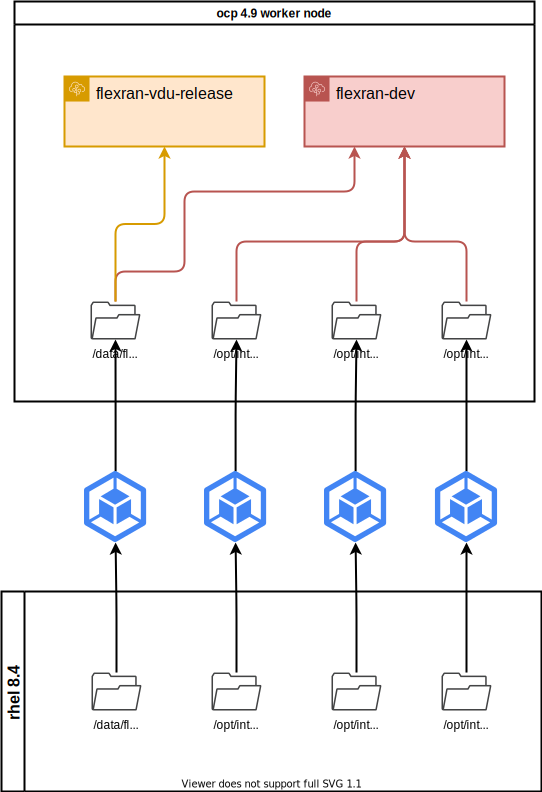
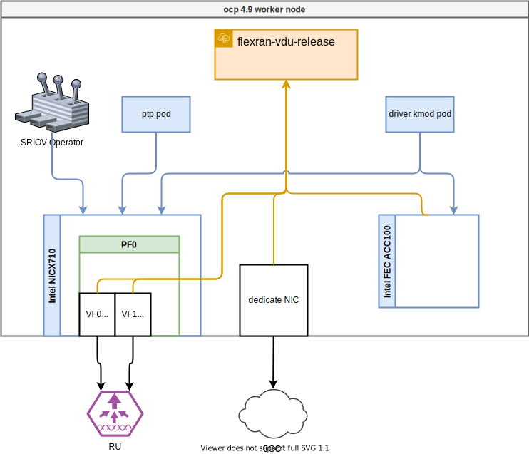
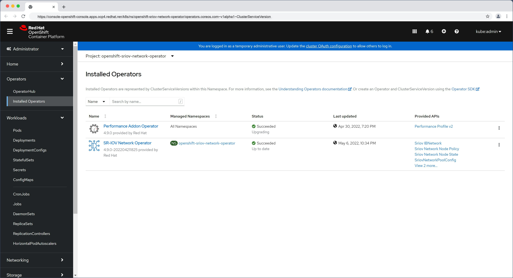
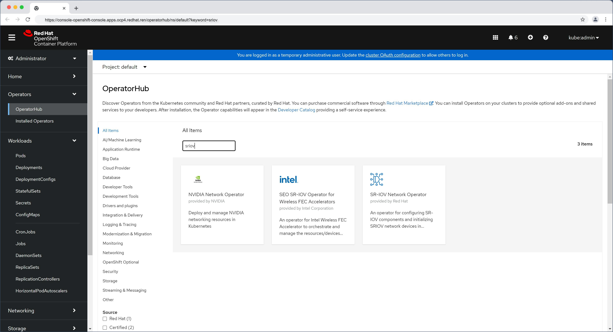

# FlexRAN 20.11 enable on ocp4, pf mode

本文描述，如何把 intel 的 oran 解决方案 flexran ，移植到 openshift 平台之上。

容器镜像构建和运行架构，文件目录结构：



容器运行的时候，和operator以及硬件的关系结构图：



实验整体网络


<!-- ## 问题

1. ptp服务配置了，vbbu 怎么用？ -->

# todo

1. [x] e810 driver reload conflict with sriov operator
   1. [x] try static pod
      1. still conflict with sriov operator
   2. [x] systemd service unit
2. [x] ptp schedule priority
   1. [ ] do NOT use, it will cause vbbu coredump, why?
3. [x] merge into 12 cpu core
   1. [ ] merge into 10 cpu core
4. [ ] 开发编译环境可复制。
   1. [ ] make a vm to build, and save the vm disk?
5. [ ] vbbu auto start correctly after node reboot

# prepare public cloud env

我们先在公网环境里面编译镜像，并且上传到quay.io

## basic init setup

```bash

# vultr, ssh enhance

# disable user/passwd login
# ChallengeResponseAuthentication no
# PasswordAuthentication no
# UsePAM no
sed -i 's/PasswordAuthentication yes/PasswordAuthentication no/g' /etc/ssh/sshd_config
sed -i 's/UsePAM yes/UsePAM no/g' /etc/ssh/sshd_config

systemctl restart sshd

ssh root@v.redhat.ren -o PubkeyAuthentication=no
# root@v.redhat.ren: Permission denied (publickey,gssapi-keyex,gssapi-with-mic).

subscription-manager register --auto-attach --username ******** --password ********

subscription-manager release --list
subscription-manager release --set=8.4

subscription-manager repos \
    --enable="codeready-builder-for-rhel-8-x86_64-rpms" 

dnf -y install https://dl.fedoraproject.org/pub/epel/epel-release-latest-8.noarch.rpm

dnf install -y byobu htop fail2ban

cat << EOF > /etc/fail2ban/jail.d/wzh.conf
[sshd]
enabled = true
# [recidive]
# enabled = true
EOF

systemctl enable --now fail2ban

cat << EOF > /etc/fail2ban/jail.d/wzh.conf
[sshd]
enabled = true
[recidive]
enabled = true
EOF

systemctl restart fail2ban

# byobu
dnf update -y

reboot
```

## install ocp rhcos rt kernel

```bash
mkdir -p /data/ostree

export BUILDNUMBER=4.9.5

wget -O openshift-client-linux-${BUILDNUMBER}.tar.gz https://mirror.openshift.com/pub/openshift-v4/clients/ocp/${BUILDNUMBER}/openshift-client-linux-${BUILDNUMBER}.tar.gz
wget -O openshift-install-linux-${BUILDNUMBER}.tar.gz https://mirror.openshift.com/pub/openshift-v4/clients/ocp/${BUILDNUMBER}/openshift-install-linux-${BUILDNUMBER}.tar.gz

tar -xzf openshift-client-linux-${BUILDNUMBER}.tar.gz -C /usr/local/sbin/
tar -xzf openshift-install-linux-${BUILDNUMBER}.tar.gz -C /usr/local/sbin/

oc image extract --path /:/data/ostree --registry-config /data/pull-secret.json   `  curl -s https://mirror.openshift.com/pub/openshift-v4/x86_64/clients/ocp/$BUILDNUMBER/release.txt | grep machine-os-content | awk '{print $2}'  `

mkdir -p /data/dnf
mv /data/ostree/extensions /data/dnf/
rm -rf /data/ostree

mkdir -p /etc/yum.repos.d
cat > /etc/yum.repos.d/rt.repo << 'EOF'
[rt]
name=rt
baseurl=file:///data/dnf/extensions
gpgcheck=0
EOF

dnf install -y kernel-rt-core kernel-rt-devel kernel-rt-modules kernel-rt-modules-extra kernel-headers libhugetlbfs-devel zlib-devel numactl-devel cmake gcc gcc-c++

reboot
```

# build flexran with intel icc/icx

```bash
dnf groupinstall -y 'Development Tools'
dnf install -y cmake

# flexran install on host
# yum install centos-release-scl devtoolset-8 -y

# install intel icc icx

cd /data/down
tar zvxf  system_studio_2019_update_3_ultimate_edition_offline.tar.gz

cd /data/down/system_studio_2019_update_3_ultimate_edition_offline

cat > s.cfg << 'EOF'
ACCEPT_EULA=accept
CONTINUE_WITH_OPTIONAL_ERROR=yes
PSET_INSTALL_DIR=/opt/intel
CONTINUE_WITH_INSTALLDIR_OVERWRITE=yes
COMPONENTS=ALL
PSET_MODE=install
ACTIVATION_SERIAL_NUMBER=******************
ACTIVATION_TYPE=serial_number
EOF

./install.sh -s s.cfg

echo "source  /opt/intel/system_studio_2019/bin/compilervars.sh intel64" >> /root/.bashrc  


cd /data/down/

# wget https://registrationcenter-download.intel.com/akdlm/irc_nas/18236/l_BaseKit_p_2021.4.0.3422_offline.sh

bash l_BaseKit_p_2021.4.0.3422_offline.sh

# source /opt/intel/oneapi/setvars.sh
echo "source /opt/intel/oneapi/setvars.sh" >> /root/.bashrc  

```

## download dpdk and patch, and comile flexran sdk

```bash
cd /data/down/

# wget https://fast.dpdk.org/rel/dpdk-19.11.tar.xz

tar xf dpdk-19.11.tar.xz
rm -rf /opt/dpdk-19.11
mv /data/down/dpdk-19.11 /opt

export RTE_SDK=/opt/dpdk-19.11
cd $RTE_SDK 
patch -p1 < /data/down/dpdk_19.11_20.11.7.patch

# patch flexran
pip3 install meson ninja
# dnf install -y ninja-build

# dnf install -y cmake

rm -rf /data/flexran/
mkdir -p /data/flexran/
cd /data/down
tar zvxf FlexRAN-20.11.tar.gz -C /data/flexran/

export RTE_SDK=/opt/dpdk-19.11
cd /data/flexran
./extract.sh

cd /data/flexran
source set_env_var.sh -d
# for intel: /opt/intel/system_studio_2019/
# for dpdk: /opt/dpdk-19.11

# sourcing /opt/intel/system_studio_2019//bin/iccvars.sh  intel64 -platform linux
# Set RTE_SDK=/opt/dpdk-19.11
# Set RTE_TARGET=x86_64-native-linuxapp-icc


# ====================================================================================
# Environment Variables:
# ====================================================================================
# RTE_SDK=/opt/dpdk-19.11
# RTE_TARGET=x86_64-native-linuxapp-icc
# WIRELESS_SDK_TARGET_ISA=avx512
# RPE_DIR=/data/flexran/libs/ferrybridge
# CPA_DIR=/data/flexran/libs/cpa
# ROE_DIR=/data/flexran/libs/roe
# XRAN_DIR=/data/flexran/xran
# DIR_WIRELESS_SDK_ROOT=/data/flexran/sdk
# SDK_BUILD=build-avx512-icc
# DIR_WIRELESS_SDK=/data/flexran/sdk/build-avx512-icc
# FLEXRAN_SDK=/data/flexran/sdk/build-avx512-icc/install
# DIR_WIRELESS_FW=/data/flexran/framework
# DIR_WIRELESS_TEST_4G=/data/flexran/tests/lte
# DIR_WIRELESS_TEST_5G=/data/flexran/tests/nr5g
# DIR_WIRELESS_TABLE_5G=/data/flexran/bin/nr5g/gnb/l1/table
# ====================================================================================

./flexran_build.sh -e -r 5gnr_sub6 -i avx512 -m sdk

# https://www.i4k.xyz/article/qq_40982287/119571504
sed -i "s/.ndo_tx_timeout = kni_net_tx_timeout,/\/\/.ndo_tx_timeout = kni_net_tx_timeout,/g" /opt/dpdk-19.11/kernel/linux/kni/kni_net.c

sed -i 's/DEFAULT_PATH=.*/DEFAULT_PATH=\/opt\/intel\/system_studio_2019\/bin\/iccvars.sh/' /opt/dpdk-19.11/usertools/dpdk-setup.sh

sed -i 's/CONFIG_RTE_BBDEV_SDK_AVX2=.*/CONFIG_RTE_BBDEV_SDK_AVX2=y/' /opt/dpdk-19.11/config/common_base
sed -i 's/CONFIG_RTE_BBDEV_SDK_AVX512=.*/CONFIG_RTE_BBDEV_SDK_AVX512=y/' /opt/dpdk-19.11/config/common_base
# DEFAULT_PATH=/opt/intel/system_studio_2019/bin/iccvars.sh
# sed -i 's/CONFIG_RTE_BUILD_SHARED_LIB=.*/CONFIG_RTE_BUILD_SHARED_LIB=y/' /opt/dpdk-19.11/config/common_base

sed -i 's/MODULE_CFLAGS += -Wall -Werror/#MODULE_CFLAGS += -Wall -Werror/' /opt/dpdk-19.11/kernel/linux/kni/Makefile

cd /opt/dpdk-19.11/usertools/
./dpdk-setup.sh
# 39
# 62

sed -i 's/#include <linux\/bootmem.h>/\/\/#include <linux\/bootmem.h>/' /data/flexran/libs/cpa/sub6/rec/drv/src/nr_dev.c

# export LD_LIBRARY_PATH=$LD_LIBRARY_PATH:/data/flexran/wls_mod/lib

# export CC=icc

# export DEV_OPT=" -Wl,--exclude-libs,/usr/lib64/libmvec_nonshared.a "

# export LDFLAGS=" -Wl,--exclude-libs,/usr/lib64/libmvec_nonshared.a "

# export RTE_LIBS=" -Wl,--exclude-libs,/usr/lib64/libmvec_nonshared.a "

# -Wl,--exclude-libs=libmvec_nonshared.a
# -Wl,--allow-multiple-definition

sed -i 's/@$(LD) -o $@ $(LD_FLAGS) -Wl,-L $(BUILDDIR) $(INC_LIBS) -lm -lrt -lpthread/@$(LD) -o $@ $(LD_FLAGS) -Wl,-L $(BUILDDIR) $(INC_LIBS) -lm -lrt -lpthread  -Wl,--allow-multiple-definition/' /data/flexran/build/nr5g/gnb/l1app/makefile_phy

sed -i 's/@$(LD) -o $@ $(LD_FLAGS) -Wl,-L $(BUILDDIR) $(INC_LIBS) -lm -lrt -lpthread/@$(LD) -o $@ $(LD_FLAGS) -Wl,-L $(BUILDDIR) $(INC_LIBS) -lm -lrt -lpthread -Wl,--allow-multiple-definition -Wl,-lrte_port -Wl,-lrte_cryptodev -Wl,-lrte_eventdev/' /data/flexran/build/nr5g/gnb/testapp/linux/makefile_phy

sed -i 's/@$(LD) -o $@ $(LD_FLAGS) -Wl,-L $(BUILDDIR) $(INC_LIBS) -lm -lrt -lpthread/@$(LD) -o $@ $(LD_FLAGS) -Wl,-L $(BUILDDIR) $(INC_LIBS) -lm -lrt -lpthread -Wl,--allow-multiple-definition/' /data/flexran/build/lte/l1app_nbiot/makefile

sed -i 's/@$(LD) -o $@ $(LD_FLAGS) -Wl,-L $(BUILDDIR) $(INC_LIBS) -lm -lrt -lpthread/@$(LD) -o $@ $(LD_FLAGS) -Wl,-L $(BUILDDIR) $(INC_LIBS) -lm -lrt -lpthread -Wl,--allow-multiple-definition/' /data/flexran/build/lte/bbdevapp/Makefile

sed -i 's/@$(LD) -o $@ $(LD_FLAGS) -Wl,-L $(BUILDDIR) $(INC_LIBS) -lm -lrt -lpthread/@$(LD) -o $@ $(LD_FLAGS) -Wl,-L $(BUILDDIR) $(INC_LIBS) -lm -lrt -lpthread -Wl,--allow-multiple-definition/' /data/flexran/build/lte/l1app/makefile

sed -i 's/@$(LD) -o $@ $(LD_FLAGS) -Wl,-L $(BUILDDIR) $(INC_LIBS) -lm -lrt -lpthread/@$(LD) -o $@ $(LD_FLAGS) -Wl,-L $(BUILDDIR) $(INC_LIBS) -lm -lrt -lpthread -Wl,--allow-multiple-definition/' /data/flexran/build/nr5g/gnb/bbdevapp/Makefile

sed -i 's/@$(CC) -o $(APP) $(OBJS) $(RTE_LIBS) $(LDFLAGS)/@$(CC) -o $(APP) $(OBJS) $(RTE_LIBS) $(LDFLAGS) -Wl,--allow-multiple-definition/' /data/flexran/build/nr5g/gnb/testmac/makefile

sed -i 's/@$(CC) -o $(APP) $(OBJS) $(RTE_LIBS) $(LDFLAGS)/@$(CC) -o $(APP) $(OBJS) $(RTE_LIBS) $(LDFLAGS) -Wl,--allow-multiple-definition/' /data/flexran/build/lte/l1app_nbiot/makefile

# -Wl,-lrte_port -Wl,-lrte_cryptodev -Wl,-lrte_eventdev
# build/nr5g/gnb/testapp/linux/makefile_phy:540

export LD_LIBRARY_PATH=$LD_LIBRARY_PATH:/data/flexran/wls_mod/lib

cd /data/flexran
./flexran_build.sh -e -r 5gnr_sub6 -i avx512 -b


# dnf install -y podman-docker

# export RTE_SDK=/opt/dpdk-19.11
# cd /data/flexran
# bash ./flexran_build_dockerfile.sh -v -e -i avx512 -r 5gnr_sub6 -b -m all

# podman image ls
# # REPOSITORY                           TAG         IMAGE ID      CREATED         SIZE
# # flexran.docker.registry/flexran_vdu  latest      8c5460a697e6  16 minutes ago  1.36 GB
# # quay.io/centos/centos                7.9.2009    8652b9f0cb4c  17 months ago   212 MB

# podman tag flexran.docker.registry/flexran_vdu:latest  quay.io/nepdemo/flexran_vdu:flexran-20.11-dpdk-20.11.3-ocp4.9.5-centos-7.9

# podman push quay.io/nepdemo/flexran_vdu:flexran-20.11-dpdk-20.11.3-ocp4.9.5-centos-7.9

```

## vsftpd

我们需要在本地准备一个ftp服务器，来承载rt-kernel的repo，后面编译容器镜像，需要访问这个临时的repo

```bash
dnf install -y vsftpd
sed -i 's/anonymous_enable=NO/anonymous_enable=YES/g' /etc/vsftpd/vsftpd.conf
systemctl disable --now firewalld
systemctl enable --now vsftpd

mkdir -p /var/ftp/dnf
mount --bind /data/dnf /var/ftp/dnf
chcon -R -t public_content_t  /var/ftp/dnf
find /data/dnf/extensions -type f -exec chmod 644 {} \;

chmod +x /etc/rc.d/rc.local
cat << EOF >>/etc/rc.d/rc.local

iptables -A INPUT -d 10.88.0.1 -j ACCEPT
iptables -A INPUT -p tcp --dport 21 -j REJECT

EOF
systemctl enable --now rc-local
```

## flexran_vdu for rhel8.4

```bash
dnf install -y podman-docker

export RTE_SDK=/opt/dpdk-19.11
cd /data/flexran

bash ./flexran_build_dockerfile.wzh.sh -v -e -i avx512 -r 5gnr_sub6 -b -m all

podman tag flexran.docker.registry/flexran_vdu:latest  quay.io/nepdemo/flexran_vdu:flexran-20.11-dpdk-19.11-ocp4.9.5-ubi-8.4

podman push quay.io/nepdemo/flexran_vdu:flexran-20.11-dpdk-19.11-ocp4.9.5-ubi-8.4

```

### nepdemo vbbu app

```bash

# copy from jumpbox
scp flexran_build_dockerfile.wzh.nepdemo.sh root@192.168.127.18:/data/flexran/

mkdir -p /data/nepdemo/{flexran_cfg,odu_cfg}

scp root@192.168.126.87:/root/odu_cfg/flexran_cfg/* /data/nepdemo/flexran_cfg
scp root@192.168.126.87:/root/BaiBBU_XSS_2.0.4_oran.IMG /data/nepdemo
scp root@192.168.126.87:/root/odu_cfg/cfg.tar /data/nepdemo/
scp root@192.168.126.87:/root/odu_cfg/XRAN_BBU /data/nepdemo/
scp root@192.168.126.87:/root/odu_cfg/*.xml /data/nepdemo/

mkdir -p /data/nepdemo/xm/{cu_cfg,du_cfg,lib64,root,cu_bin,du_bin}
scp root@192.168.126.87://root/odu_cfg/BBU/BBU_cfg/cu_cfg/gNodeB_CU_Configuration.cfg /data/nepdemo/xm/cu_cfg/
scp root@192.168.126.87://root/odu_cfg/BBU/BBU_cfg/cu_cfg/Proprietary_gNodeB_CU_Data_Model.xml  /data/nepdemo/xm/cu_cfg/
scp root@192.168.126.87://root/odu_cfg/BBU/BBU_cfg/du_cfg/Proprietary_gNodeB_DU_Data_Model.xml  /data/nepdemo/xm/du_cfg/
scp root@192.168.126.87://root/odu_cfg/BBU/BBU_cfg/du_cfg/gNB_DU_Configuration.cfg   /data/nepdemo/xm/du_cfg/
scp root@192.168.126.87:/root/odu_cfg/*.so* /data/nepdemo/xm/lib64/
scp root@192.168.126.87:/root/13*.lic /data/nepdemo/xm/root/
scp root@192.168.126.87:/root/odu_cfg/gnb_du* /data/nepdemo/xm/du_bin
scp root@192.168.126.87:/root/odu_cfg/gnb_cu* /data/nepdemo/xm/cu_bin

export RTE_SDK=/opt/dpdk-19.11
cd /data/flexran

bash ./flexran_build_dockerfile.wzh.nepdemo.sh -v -e -i avx512 -r 5gnr_sub6 -b -m all

bash ./flexran_build_dockerfile.wzh.nepdemo.rhel7.sh -v -e -i avx512 -r 5gnr_sub6 -b -m all

# the output docker is flexran.docker.registry/flexran_vdu

podman save flexran.docker.registry/flexran_vdu |  pigz -c > flexran_vdu.tgz

# on vultr
podman load -i flexran_vdu.tgz

podman tag flexran.docker.registry/flexran_vdu:latest  quay.io/nepdemo/flexran_vdu:flexran-20.11-dpdk-19.11-ocp4.9.5-ubi-8.4

podman push quay.io/nepdemo/flexran_vdu:flexran-20.11-dpdk-19.11-ocp4.9.5-ubi-8.4

# add rpm to container image
cat << EOF > /data/nepdemo/add_rpm.dockerfile
FROM flexran.docker.registry/flexran_vdu

RUN /bin/rm -f /etc/yum.repos.d/local.repo
RUN dnf install -y bc

EOF
cd /data/nepdemo
podman build --squash -f /data/nepdemo/add_rpm.dockerfile -t flexran.docker.registry/flexran_vdu:add_rpm .


# on nepdemo env
mkdir -p /data/nepdemo/{intel,phy,intel.so}
cp /opt/intel/system_studio_2019/compilers_and_libraries_2019.3.206/linux/ipp/lib/intel64/*.{so,a} /data/nepdemo/intel/
cp /data/flexran/sdk/build-avx512-icc/source/phy/lib_srs_cestimate_5gnr/*.{bin,a} /data/nepdemo/phy/

rm -rf /data/nepdemo/intel.so/*
cp /opt/intel/system_studio_2019/compilers_and_libraries_2019.3.206/linux/mkl/lib/intel64_lin/*.so /data/nepdemo/intel.so/
cp /opt/intel/system_studio_2019/compilers_and_libraries_2019.3.206/linux/ipp/lib/intel64_lin/*.so /data/nepdemo/intel.so/
cp /opt/intel/system_studio_2019/compilers_and_libraries_2019.3.206/linux/compiler/lib/intel64_lin/*.so /data/nepdemo/intel.so/
/bin/cp -f /opt/intel/oneapi/compiler/2021.4.0/linux/compiler/lib/intel64_lin/*.{so,so.*} /data/nepdemo/intel.so/

cp -r /home/pf-bb-config /data/nepdemo/

wget -O /data/nepdemo/htop-3.0.5-1.el8.x86_64.rpm https://download-ib01.fedoraproject.org/pub/epel/8/Everything/x86_64/Packages/h/htop-3.0.5-1.el8.x86_64.rpm


cat << 'EOF' > /data/nepdemo/convert_hex.sh
to_hex() {
  VAR_CORE_LIST=$1

  var_cores=($(echo "$VAR_CORE_LIST" | tr ',' ' '))

  var_bitmap=0
  for var_core in "${var_cores[@]}"; do
    # echo $var_core
    core_bitmap=$((1<<$var_core))
    # echo "obase=2;$core_bitmap" | bc
    ((var_bitmap|=$core_bitmap))
    # echo "obase=2;$var_bitmap" | bc
  done

  echo "obase=16;$var_bitmap" | bc
  # echo "obase=2;$var_bitmap" | bc
}

to_dec() {
  VAR_CORE_LIST=$1

  var_cores=($(echo "$VAR_CORE_LIST" | tr ',' ' '))

  var_bitmap=0
  for var_core in "${var_cores[@]}"; do
    # echo $var_core
    core_bitmap=$((1<<$var_core))
    # echo "obase=2;$core_bitmap" | bc
    ((var_bitmap|=$core_bitmap))
    # echo "obase=2;$var_bitmap" | bc
  done

  echo "obase=10;$var_bitmap" | bc
  # echo "obase=2;$var_bitmap" | bc
}
EOF


cat << 'EOF' > /data/nepdemo/set_ip.sh
#!/bin/bash

# Import our environment variables from systemd
for e in $(tr "\000" "\n" < /proc/1/environ); do
  # if [[ $e == DEMO_ENV* ]]; then
    eval "export $e"
  # fi
done

echo $DEMO_ENV_NIC > /demo.txt
echo $DEMO_ENV_IP >> /demo.txt
echo $DEMO_ENV_MASK >> /demo.txt

# ifconfig $DEMO_ENV_NIC $DEMO_ENV_IP/$DEMO_ENV_MASK up

insmod /root/dpdk-19.11/build/kernel/linux/igb_uio/igb_uio.ko

installLic /root/13FD549D912D82B3C50C58E6D233.lic
modprobe sctp

# sleep infinity


cat /sys/fs/cgroup/cpuset/cpuset.cpus
# 1-15

cd /root/pf-bb-config
./pf_bb_config ACC100 -p 0000:17:00.0 

cd /root/dpdk-19.11/usertools
python3 dpdk-devbind.py -b igb_uio 0000:17:00.0
echo "8086 0D8F" | tee /sys/bus/pci/drivers/igb_uio/new_id

python3 /root/dpdk-19.11/usertools/dpdk-devbind.py -s

source /root/convert_hex.sh


sed -i 's/<systemThread>.*<\/systemThread>/<systemThread>2, 0, 0<\/systemThread>/' /root/flexran/bin/nr5g/gnb/l1/phycfg_xran.xml
sed -i 's/<timerThread>.*<\/timerThread>/<timerThread>1, 96, 0<\/timerThread>/' /root/flexran/bin/nr5g/gnb/l1/phycfg_xran.xml
sed -i 's/<FpgaDriverCpuInfo>.*<\/FpgaDriverCpuInfo>/<FpgaDriverCpuInfo>3, 96, 0<\/FpgaDriverCpuInfo>/' /root/flexran/bin/nr5g/gnb/l1/phycfg_xran.xml
sed -i 's/<FrontHaulCpuInfo>.*<\/FrontHaulCpuInfo>/<FrontHaulCpuInfo>3, 96, 0<\/FrontHaulCpuInfo>/' /root/flexran/bin/nr5g/gnb/l1/phycfg_xran.xml
sed -i 's/<radioDpdkMaster>.*<\/radioDpdkMaster>/<radioDpdkMaster>2, 99, 0<\/radioDpdkMaster>/' /root/flexran/bin/nr5g/gnb/l1/phycfg_xran.xml
sed -i 's/<BbuPoolThreadDefault_0_63>.*<\/BbuPoolThreadDefault_0_63>/<BbuPoolThreadDefault_0_63>0xFC00<\/BbuPoolThreadDefault_0_63>/' /root/flexran/bin/nr5g/gnb/l1/phycfg_xran.xml

sed -i 's/<xRANThread>.*<\/xRANThread>/<xRANThread>9, 96, 0<\/xRANThread>/' /root/flexran/bin/nr5g/gnb/l1/xrancfg_sub6.xml
sed -i 's/<xRANWorker>.*<\/xRANWorker>/<xRANWorker>0x10000, 96, 0<\/xRANWorker>/' /root/flexran/bin/nr5g/gnb/l1/xrancfg_sub6.xml

sed -i 's/OAM_SHARED_CORE_BITMAP=.*/OAM_SHARED_CORE_BITMAP=24/' /etc/BBU_cfg/cu_cfg/gNodeB_CU_Configuration.cfg
sed -i 's/L3_SHARED_CORE_BITMAP=.*/L3_SHARED_CORE_BITMAP=48/' /etc/BBU_cfg/cu_cfg/gNodeB_CU_Configuration.cfg
sed -i 's/PDCP_SHRED_CORE_BITMAP=.*/PDCP_SHRED_CORE_BITMAP=384/' /etc/BBU_cfg/cu_cfg/gNodeB_CU_Configuration.cfg
sed -i 's/RRM_SHARED_CORE_BITMAP=.*/RRM_SHARED_CORE_BITMAP=258/' /etc/BBU_cfg/cu_cfg/gNodeB_CU_Configuration.cfg
sed -i 's/SON_SHARED_CORE_BITMAP=.*/SON_SHARED_CORE_BITMAP=6/' /etc/BBU_cfg/cu_cfg/gNodeB_CU_Configuration.cfg

# https://unix.stackexchange.com/questions/487451/sed-replace-a-pattern-between-a-pattern-and-the-end-of-file
sed -i '/<oam_shm_logger_cfg>/,$s/<cpu_bitmap>.*</<cpu_bitmap>128</' /etc/BBU_cfg/cu_cfg/Proprietary_gNodeB_CU_Data_Model.xml
sed -i '/<shm_logger_cfg>/,$s/<cpu_bitmap>.*</<cpu_bitmap>128</' /etc/BBU_cfg/cu_cfg/Proprietary_gNodeB_CU_Data_Model.xml
sed -i '/<L3Params>/,$s/<core_no>.*</<core_no>2</' /etc/BBU_cfg/cu_cfg/Proprietary_gNodeB_CU_Data_Model.xml
sed -i '/<process_name>gnb_cu_son</,$s/<process_args>.* /<process_args>2 /' /etc/BBU_cfg/cu_cfg/Proprietary_gNodeB_CU_Data_Model.xml
sed -i '/<process_name>gnb_cu_rrm</,$s/<process_args>.* /<process_args>2 /' /etc/BBU_cfg/cu_cfg/Proprietary_gNodeB_CU_Data_Model.xml
sed -i '/<pdcp_index>0</,$s/<core_num_for_worker_thread>.*</<core_num_for_worker_thread>3</' /etc/BBU_cfg/cu_cfg/Proprietary_gNodeB_CU_Data_Model.xml
sed -i '/<pdcp_index>1</,$s/<core_num_for_worker_thread>.*</<core_num_for_worker_thread>3</' /etc/BBU_cfg/cu_cfg/Proprietary_gNodeB_CU_Data_Model.xml
sed -i '/<egtpu_instance>0</,$s/<core_num_for_worker_thread>.*</<core_num_for_worker_thread>6</' /etc/BBU_cfg/cu_cfg/Proprietary_gNodeB_CU_Data_Model.xml
sed -i '/<egtpu_instance>1</,$s/<core_num_for_worker_thread>.*</<core_num_for_worker_thread>6</' /etc/BBU_cfg/cu_cfg/Proprietary_gNodeB_CU_Data_Model.xml
sed -i '/<f1u_instance>0</,$s/<core_num_for_worker_thread>.*</<core_num_for_worker_thread>6</' /etc/BBU_cfg/cu_cfg/Proprietary_gNodeB_CU_Data_Model.xml
sed -i '/<f1u_instance>1</,$s/<core_num_for_worker_thread>.*</<core_num_for_worker_thread>6</' /etc/BBU_cfg/cu_cfg/Proprietary_gNodeB_CU_Data_Model.xml
sed -i 's/<core_num_mapping>.*</<core_num_mapping>4,4</' /etc/BBU_cfg/cu_cfg/Proprietary_gNodeB_CU_Data_Model.xml

sed -i 's/MAC_BINREAD_CORE_NUM=.*/MAC_BINREAD_CORE_NUM=1/' /etc/BBU_cfg/du_cfg/gNB_DU_Configuration.cfg
sed -i 's/RLC_BINREAD_CORE_NUM=.*/RLC_BINREAD_CORE_NUM=1/' /etc/BBU_cfg/du_cfg/gNB_DU_Configuration.cfg
sed -i 's/MAC_HP_CORE_NUM=.*/MAC_HP_CORE_NUM=5/' /etc/BBU_cfg/du_cfg/gNB_DU_Configuration.cfg
sed -i 's/RLC_MASTER_CORE_NUM=.*/RLC_MASTER_CORE_NUM=2/' /etc/BBU_cfg/du_cfg/gNB_DU_Configuration.cfg
sed -i 's/SHARED_CORE_BITMAP=.*/SHARED_CORE_BITMAP=96/' /etc/BBU_cfg/du_cfg/gNB_DU_Configuration.cfg
sed -i 's/RELAY_ADAPTER_RECVR_THREAD_CORE_NUM=.*/RELAY_ADAPTER_RECVR_THREAD_CORE_NUM=4/' /etc/BBU_cfg/du_cfg/gNB_DU_Configuration.cfg

sed -i '/<RlcProvsioningParams>/,$s/<CoreNumWorkerThread>.*</<CoreNumWorkerThread>7</' /etc/BBU_cfg/du_cfg/Proprietary_gNodeB_DU_Data_Model.xml
sed -i '/<RlclSystemParams>/,$s/<CoreNumWorkerThread>.*</<CoreNumWorkerThread>7</' /etc/BBU_cfg/du_cfg/Proprietary_gNodeB_DU_Data_Model.xml
sed -i '/<F1uProvisioningParams>/,$s/<numCoreWorkerThreads>.*</<numCoreWorkerThreads>7</' /etc/BBU_cfg/du_cfg/Proprietary_gNodeB_DU_Data_Model.xml

sed -i 's/\.\/gnb_cu_pdcp .* >/\.\/gnb_cu_pdcp --r=2 --a=8 --t=8 --m=2 --i=0 --b=8 --p=0 --s=50 --n=10 >/' /home/BaiBBU_XSS/BaiBBU_SXSS/gNB_app

EOF

cat << EOF > /data/nepdemo/setip.service
[Unit]
Description=set ip service
After=network.target

[Service]
Type=simple
User=root
WorkingDirectory=/root/
ExecStart=/root/systemd/set_ip.sh

[Install]
WantedBy=multi-user.target
EOF

cat << EOF > /data/nepdemo/flexran_vdu.dockerfile
FROM flexran.docker.registry/flexran_vdu

COPY set_ip.sh      /root/systemd/
RUN chmod +x /root/systemd/set_ip.sh   
COPY setip.service  /etc/systemd/system/setip.service
RUN systemctl enable setip.service

COPY convert_hex.sh /root/convert_hex.sh

# COPY htop-3.0.5-1.el8.x86_64.rpm /root/tmp/
# RUN dnf install -y /root/tmp/htop-3.0.5-1.el8.x86_64.rpm

EOF

cd /data/nepdemo
podman build --squash -f /data/nepdemo/flexran_vdu.dockerfile -t flexran.docker.registry/flexran_vdu:wzh .

export REG_TMP="reg-tmp.redhat.ren:5443"

podman tag flexran.docker.registry/flexran_vdu:wzh  ${REG_TMP}/nepdemo/flexran_vdu:flexran-20.11-dpdk-19.11-ocp4.9.5-ubi-8.4

podman push --tls-verify=false ${REG_TMP}/nepdemo/flexran_vdu:flexran-20.11-dpdk-19.11-ocp4.9.5-ubi-8.4

```

## kernel module igb_uio

```bash
# build igb_uio.ko
mkdir -p /data/git/
cd /data/git

git clone http://dpdk.org/git/dpdk-kmods
cd dpdk-kmods/linux/igb_uio
make

cd /data/git
git clone https://github.com/benhoyt/inih
cd inih
git checkout r44
cd extra
make -f Makefile.static
/bin/cp -f libinih.a ..

export INIH_PATH=/data/git/inih

cd /data/git
git clone https://github.com/intel/pf-bb-config
cd pf-bb-config/
make


cd /data/git
cp /home/pf-bb-config/acc100/acc100_config_5g.cfg pf-bb-config/acc100/acc100_config_5g.cfg

cat << 'EOF' > ./flexran.sdk.dockerfile
FROM registry.access.redhat.com/ubi8/ubi-minimal

COPY dpdk-kmods /data/dpdk-kmods
COPY inih /data/inih
COPY pf-bb-config /data/pf-bb-config
EOF

cd /data/git
podman build --squash -t quay.io/nepdemo/flexran_vdu:driver-kmods-ocp-4.9.5-ubi8 -f flexran.sdk.dockerfile ./

podman push quay.io/nepdemo/flexran_vdu:driver-kmods-ocp-4.9.5-ubi8

```

## copy flexran sdk to image

```bash
cat << 'EOF' > /data/flexran.sdk.dockerfile
FROM registry.access.redhat.com/ubi8/ubi:8.4

RUN dnf repolist
RUN sed -i 's|enabled=1|enabled=0|g' /etc/yum/pluginconf.d/subscription-manager.conf
RUN sed -i 's|$releasever|8.4|g' /etc/yum.repos.d/redhat.repo
RUN sed -i '/codeready-builder-for-rhel-8-x86_64-rpms/,/\[/ s/enabled = 0/enabled = 1/' /etc/yum.repos.d/redhat.repo
RUN mv -f /etc/yum.repos.d/ubi.repo /etc/yum.repos.d/ubi.repo.bak

RUN dnf -y update
RUN dnf -y install rsync

COPY flexran /data/flexran
EOF

cd /data
podman build --squash -t quay.io/nepdemo/flexran_basekit:flexran-sdk-20.11-ocp-4.9.5-ubi-8.4 -f flexran.sdk.dockerfile ./

podman push quay.io/nepdemo/flexran_basekit:flexran-sdk-20.11-ocp-4.9.5-ubi-8.4

```

## copy intel icc to image

```bash
cat << 'EOF' > /opt/intel/flexran.intel.icc.dockerfile
FROM registry.access.redhat.com/ubi8/ubi:8.4

RUN dnf repolist
RUN sed -i 's|enabled=1|enabled=0|g' /etc/yum/pluginconf.d/subscription-manager.conf
RUN sed -i 's|$releasever|8.4|g' /etc/yum.repos.d/redhat.repo
RUN sed -i '/codeready-builder-for-rhel-8-x86_64-rpms/,/\[/ s/enabled = 0/enabled = 1/' /etc/yum.repos.d/redhat.repo
RUN mv -f /etc/yum.repos.d/ubi.repo /etc/yum.repos.d/ubi.repo.bak

RUN dnf -y update
RUN dnf -y install rsync

COPY system_studio_2019 /opt/intel/system_studio_2019
COPY licenses /opt/intel/licenses
COPY packagemanager /opt/intel/packagemanager
EOF

cd /opt/intel
podman build --squash -t quay.io/nepdemo/flexran_basekit:intel.icc-21.11-ocp-4.9.5-ubi-8.4 -f flexran.intel.icc.dockerfile ./

podman push quay.io/nepdemo/flexran_basekit:intel.icc-21.11-ocp-4.9.5-ubi-8.4
```

## copy intel icx to image

```bash
cat << 'EOF' > /opt/intel/flexran.intel.icx.dockerfile
FROM registry.access.redhat.com/ubi8/ubi:8.4

RUN dnf repolist
RUN sed -i 's|enabled=1|enabled=0|g' /etc/yum/pluginconf.d/subscription-manager.conf
RUN sed -i 's|$releasever|8.4|g' /etc/yum.repos.d/redhat.repo
RUN sed -i '/codeready-builder-for-rhel-8-x86_64-rpms/,/\[/ s/enabled = 0/enabled = 1/' /etc/yum.repos.d/redhat.repo
RUN mv -f /etc/yum.repos.d/ubi.repo /etc/yum.repos.d/ubi.repo.bak

RUN dnf -y update
RUN dnf -y install rsync

COPY oneapi /opt/intel/oneapi
COPY licenses /opt/intel/licenses
COPY packagemanager /opt/intel/packagemanager
EOF

cd /opt/intel
podman build --squash -t quay.io/nepdemo/flexran_basekit:intel.icx-21.11-ocp-4.9.5-ubi-8.4 -f flexran.intel.icx.dockerfile ./

podman push quay.io/nepdemo/flexran_basekit:intel.icx-21.11-ocp-4.9.5-ubi-8.4
```

## build dev docker image with dpdk 19.11

```bash
cat << 'EOF' > /opt/flexran.dpdk.dockerfile
FROM registry.access.redhat.com/ubi8/ubi:8.4

RUN dnf repolist
RUN sed -i 's|enabled=1|enabled=0|g' /etc/yum/pluginconf.d/subscription-manager.conf
RUN sed -i 's|$releasever|8.4|g' /etc/yum.repos.d/redhat.repo
RUN sed -i '/codeready-builder-for-rhel-8-x86_64-rpms/,/\[/ s/enabled = 0/enabled = 1/' /etc/yum.repos.d/redhat.repo
RUN mv -f /etc/yum.repos.d/ubi.repo /etc/yum.repos.d/ubi.repo.bak

RUN echo -e "\
[localrepo]\n\
name=LocalRepo\n\
baseurl=ftp://10.88.0.1/dnf/extensions/\n\
enabled=1\n\
gpgcheck=0" \
> /etc/yum.repos.d/local.repo

RUN dnf -y update
RUN dnf -y install rsync

RUN dnf -y install kernel-rt-core kernel-rt-devel kernel-rt-modules kernel-rt-modules-extra kernel-headers libhugetlbfs-devel zlib-devel numactl-devel cmake gcc gcc-c++ libhugetlbfs-utils libhugetlbfs-devel libhugetlbfs numactl-devel pciutils libaio libaio-devel net-tools libpcap python3-pip
RUN dnf install -y --allowerasing coreutils
# RUN dnf groupinstall -y development server
RUN dnf groupinstall -y development 
RUN pip-3 install meson ninja

COPY dpdk-19.11 /opt/dpdk-19.11
# RUN ln -s /opt/dpdk-stable-20.11.3 /opt/dpdk-20.11

EOF

cd /opt/
podman build --squash -t quay.io/nepdemo/flexran_basekit:dpdk-19.11-ocp-4.9.5-ubi-8.4 -f flexran.dpdk.dockerfile ./

podman push quay.io/nepdemo/flexran_basekit:dpdk-19.11-ocp-4.9.5-ubi-8.4 

```

# build in nepdemo env

在nepdemo的内网环境中，编译镜像，并将镜像推送到nepdemo的镜像仓库

## create a image registry to hold the large container image

```bash
# found a centos7 host

mkdir /etc/crts/ && cd /etc/crts
openssl req \
   -newkey rsa:2048 -nodes -keyout redhat.ren.key \
   -x509 -days 3650 -out redhat.ren.crt -subj \
   "/C=CN/ST=GD/L=SZ/O=Global Security/OU=IT Department/CN=*.redhat.ren"

cp /etc/crts/redhat.ren.crt /etc/pki/ca-trust/source/anchors/
update-ca-trust extract

mkdir -p /home/data/registry
cd /data
# tar zxf registry.tgz
yum -y install docker-distribution

cat << EOF > /etc/docker-distribution/registry/config.yml
version: 0.1
log:
  fields:
    service: registry
storage:
    cache:
        layerinfo: inmemory
    filesystem:
        rootdirectory: /home/data/registry
    delete:
        enabled: true
http:
    addr: :5443
    tls:
       certificate: /etc/crts/redhat.ren.crt
       key: /etc/crts/redhat.ren.key
EOF
# systemctl restart docker
# systemctl stop docker-distribution
systemctl enable --now docker-distribution

```

## build container image for intel sdk

```bash
cat << EOF >>  /etc/hosts
192.168.123.252 reg-tmp.redhat.ren
EOF

export REG_TMP="reg-tmp.redhat.ren:5443"

podman tag flexran.docker.registry/flexran_vdu:latest  ${REG_TMP}/nepdemo/flexran_vdu:flexran-20.11-dpdk-19.11-ocp4.9.5-ubi-8.4

podman push --tls-verify=false ${REG_TMP}/nepdemo/flexran_vdu:flexran-20.11-dpdk-19.11-ocp4.9.5-ubi-8.4

# copy flexran sdk to image
cd /data
podman build --squash -t ${REG_TMP}/nepdemo/flexran_basekit:flexran-sdk-20.11-ocp-4.9.5-ubi-8.4 -f flexran.sdk.dockerfile ./

podman push --tls-verify=false ${REG_TMP}/nepdemo/flexran_basekit:flexran-sdk-20.11-ocp-4.9.5-ubi-8.4

# dpdk-kmods
cd /data/git
podman build --squash -t ${REG_TMP}/nepdemo/flexran_vdu:dpdk-kmods-ocp-4.9.5-ubi -f flexran.sdk.dockerfile ./

podman push --tls-verify=false ${REG_TMP}/nepdemo/flexran_vdu:dpdk-kmods-ocp-4.9.5-ubi

# copy intel icc to image
cd /opt/intel
podman build --squash -t ${REG_TMP}/nepdemo/flexran_basekit:intel.icc-21.11-ocp-4.9.5-ubi-8.4 -f flexran.intel.icc.dockerfile ./

podman push --tls-verify=false ${REG_TMP}/nepdemo/flexran_basekit:intel.icc-21.11-ocp-4.9.5-ubi-8.4

# copy intel icx to image
cd /opt/intel
podman build --squash -t ${REG_TMP}/nepdemo/flexran_basekit:intel.icx-21.11-ocp-4.9.5-ubi-8.4 -f flexran.intel.icx.dockerfile ./

podman push --tls-verify=false ${REG_TMP}/nepdemo/flexran_basekit:intel.icx-21.11-ocp-4.9.5-ubi-8.4


# build dev docker image with dpdk 19.11
cat << 'EOF' > /opt/flexran.dpdk.dockerfile
FROM registry.access.redhat.com/ubi8/ubi:8.4

RUN dnf repolist
RUN sed -i 's|enabled=1|enabled=0|g' /etc/yum/pluginconf.d/subscription-manager.conf
RUN sed -i 's|$releasever|8.4|g' /etc/yum.repos.d/redhat.repo
RUN sed -i 's|cdn.redhat.com|china.cdn.redhat.com|g' /etc/yum.repos.d/redhat.repo
RUN sed -i '/codeready-builder-for-rhel-8-x86_64-rpms/,/\[/ s/enabled = 0/enabled = 1/' /etc/yum.repos.d/redhat.repo
RUN mv -f /etc/yum.repos.d/ubi.repo /etc/yum.repos.d/ubi.repo.bak

RUN echo -e "\
[localrepo]\n\
name=LocalRepo\n\
baseurl=ftp://192.168.122.1/dnf/extensions/\n\
enabled=1\n\
gpgcheck=0" \
> /etc/yum.repos.d/local.repo

RUN dnf -y update
RUN dnf -y install rsync

RUN dnf -y install kernel-rt-core kernel-rt-devel kernel-rt-modules kernel-rt-modules-extra kernel-headers libhugetlbfs-devel zlib-devel numactl-devel cmake gcc gcc-c++ libhugetlbfs-utils libhugetlbfs-devel libhugetlbfs numactl-devel pciutils libaio libaio-devel net-tools libpcap python3-pip
RUN dnf install -y --allowerasing coreutils
RUN dnf groupinstall -y development server
RUN pip-3 install meson ninja

COPY dpdk-19.11 /opt/dpdk-19.11
# RUN ln -s /opt/dpdk-19.11 /opt/dpdk-20.11

EOF

cd /opt/
podman build --squash -t ${REG_TMP}/nepdemo/flexran_basekit:dpdk-19.11-ocp-4.9.5-ubi-8.4 -f flexran.dpdk.dockerfile ./

podman push --tls-verify=false ${REG_TMP}/nepdemo/flexran_basekit:dpdk-19.11-ocp-4.9.5-ubi-8.4 

```

# deploy on ocp 4.9.5

镜像都准备好了，我们开始在openshift4 上进行部署测试。

## set security for temp image registry

我们临时创建了一个镜像仓库，那么我们就要把这个配置放到集群里面去，主要是让ocp集群，不要检查这个新镜像仓库的证书。

- [How to remove worker role from master in Red Hat OpenShift Container Platform 4.x?](https://access.redhat.com/solutions/4564851)


```bash
oc patch schedulers.config.openshift.io/cluster --type merge -p '{"spec":{"mastersSchedulable":false}}'

install /data/ocp4/clients/butane-amd64 /usr/local/bin/butane

cat << EOF > /data/sno/tmp.images.bu
variant: openshift
version: 4.9.0
metadata:
  labels:
    machineconfiguration.openshift.io/role: worker
  name: 99-zzz-worker-temp-images
storage:
  files:
    - path: /etc/containers/registries.conf.d/temp.registries.conf
      overwrite: true
      contents:
        inline: |

            [[registry]]
            location = "tmp-registry.ocp4.redhat.ren:5443"
            insecure = true
            blocked = false
            mirror-by-digest-only = false
            prefix = ""

EOF

butane /data/sno/tmp.images.bu > /data/sno/99-zzz-worker-temp-images.yaml

oc create -f /data/sno/99-zzz-worker-temp-images.yaml

```

## set a host-path dir for flexran sdk

我们需要在 worker-2 上创建本地目录，好承载 flexran sdk, intel icc, intel icx 等超级大的目录和文件，主要是开发组有在容器平台做开发和测试的需求。如果是生成运行环境，这个本地目录是不应该存在的。

```bash
# do not need, as it is already deployed
cat << EOF > /data/install/host-path.yaml
---
apiVersion: machineconfiguration.openshift.io/v1
kind: MachineConfig
metadata:
  name: 50-set-selinux-for-hostpath-nepdemo-worker-rt-2
  labels:
    machineconfiguration.openshift.io/role: worker-rt-2
spec:
  config:
    ignition:
      version: 3.2.0
    systemd:
      units:
        - contents: |
            [Unit]
            Description=Set SELinux chcon for hostpath nepdemo
            Before=kubelet.service

            [Service]
            Type=oneshot
            RemainAfterExit=yes
            ExecStartPre=-mkdir -p /var/nepdemo
            ExecStart=chcon -Rt container_file_t /var/nepdemo/

            [Install]
            WantedBy=multi-user.target
          enabled: true
          name: hostpath-nepdemo.service
EOF
oc create -f /data/install/host-path.yaml

```

## using job to copy files to local path

我们使用job的方式，把flexran sdk, intel icc/icx sdk复制到worker-2的本地目录，以便后续使用。用job的方式，主要考虑，这个是一次性的工作，并且我们在container image 里面还装了rsync，这样以后如果破坏了本地目录，重新运行以下job，就可以很快的同步目录。

```bash

export REG_TMP='tmp-registry.ocp4.redhat.ren:5443'

# copy dpdk to local
cat << EOF > /data/install/job.flexran.dpdk.yaml
---
apiVersion: batch/v1
kind: Job
metadata:
  name: flexran.basekit.dpdk.copy
  namespace: default
spec:
  template:
    spec:
      containers:
      - name: files
        image: ${REG_TMP}/nepdemo/flexran_basekit:dpdk-19.11-ocp-4.9.5-ubi-8.4 
        command: [ "/bin/sh","-c","--" ]
        # command: ["rsync", "--delete", "-arz", "/opt/dpdk-19.11", "/nepdemo/"]
        args: [" rsync -P --delete -arz /opt/dpdk-19.11 /nepdemo/ "]
        volumeMounts:
          - name: nepdemo
            mountPath: /nepdemo
      restartPolicy: Never
      nodeName: worker-2.ocp4.redhat.ren
      volumes:
        - name: nepdemo
          hostPath:
            path: /var/nepdemo      
EOF

oc create -f /data/install/job.flexran.dpdk.yaml

# copy flexran sdk to local
cat << EOF > /data/install/job.flexran.sdk.yaml
---
apiVersion: batch/v1
kind: Job
metadata:
  name: flexran.basekit.sdk.copy
  namespace: default
spec:
  template:
    spec:
      containers:
      - name: files
        image: ${REG_TMP}/nepdemo/flexran_basekit:flexran-sdk-20.11-ocp-4.9.5-ubi-8.4
        command: [ "/bin/sh","-c","--" ]
        # command: ["rsync", "--delete", "-arz", "/data/flexran", "/nepdemo/"]
        args: [" rsync -P --delete -arz /data/flexran /nepdemo/ "]
        volumeMounts:
          - name: nepdemo
            mountPath: /nepdemo
      restartPolicy: Never
      nodeName: worker-2.ocp4.redhat.ren
      volumes:
        - name: nepdemo
          hostPath:
            path: /var/nepdemo      
EOF

oc create -f /data/install/job.flexran.sdk.yaml

# copy intel icc sdk to local
cat << EOF > /data/install/job.intel.icc.yaml
---
apiVersion: batch/v1
kind: Job
metadata:
  name: flexran.basekit.intel.icc.copy
  namespace: default
spec:
  template:
    spec:
      containers:
      - name: files
        image: ${REG_TMP}/nepdemo/flexran_basekit:intel.icc-21.11-ocp-4.9.5-ubi-8.4
        command: [ "/bin/sh","-c","--" ]
        # command: ["rsync", "--delete", "-arz", "/opt/intel/system_studio_2019", "/nepdemo/"]
        args: [" rsync -P --delete -arz /opt/intel/system_studio_2019 /nepdemo/ "]
        volumeMounts:
          - name: nepdemo
            mountPath: /nepdemo
      restartPolicy: Never
      nodeName: worker-2.ocp4.redhat.ren
      volumes:
        - name: nepdemo
          hostPath:
            path: /var/nepdemo      
EOF

oc create -f /data/install/job.intel.icc.yaml

# copy intel icx sdk to local
cat << EOF > /data/install/job.intel.icx.yaml
---
apiVersion: batch/v1
kind: Job
metadata:
  name: flexran.basekit.intel.icx.copy
  namespace: default
spec:
  template:
    spec:
      containers:
      - name: files
        image: ${REG_TMP}/nepdemo/flexran_basekit:intel.icx-21.11-ocp-4.9.5-ubi-8.4
        command: [ "/bin/sh","-c","--" ]
        # command: ["rsync", "--delete", "-arz", "/opt/intel/oneapi", "/nepdemo/"]
        args: [" rsync -P --delete -arz /opt/intel/oneapi /nepdemo/ "]
        volumeMounts:
          - name: nepdemo
            mountPath: /nepdemo
      restartPolicy: Never
      nodeName: worker-2.ocp4.redhat.ren
      volumes:
        - name: nepdemo
          hostPath:
            path: /var/nepdemo      
EOF

oc create -f /data/install/job.intel.icx.yaml

# copy intel license to local
cat << EOF > /data/install/job.intel.license.yaml
---
apiVersion: batch/v1
kind: Job
metadata:
  name: flexran.basekit.intel.icx.copy
  namespace: default
spec:
  template:
    spec:
      containers:
      - name: files
        image: ${REG_TMP}/nepdemo/flexran_basekit:intel.icx-21.11-ocp-4.9.5-ubi-8.4
        command: [ "/bin/sh","-c","--" ]
        args: ["rsync -P --delete -arz /opt/intel/licenses /nepdemo/ ; rsync -P --delete -arz /opt/intel/packagemanager /nepdemo/ "]
        volumeMounts:
          - name: nepdemo
            mountPath: /nepdemo
      restartPolicy: Never
      nodeName: worker-2.ocp4.redhat.ren
      volumes:
        - name: nepdemo
          hostPath:
            path: /var/nepdemo      
EOF

oc create -f /data/install/job.intel.license.yaml

```

## worker-2 node, rt-kernel setting

```bash

cat << EOF > /data/install/performance-2.yaml
---
apiVersion: performance.openshift.io/v2
kind: PerformanceProfile
metadata:
   name: wzh-performanceprofile-2
spec:
  additionalKernelArgs:
    # - no_timer_check
    # - clocksource=tsc
    # - tsc=perfect
    # set selinux
    # - selinux=0
    # - enforcing=0
    # end set selinux
    - nmi_watchdog=0
    # - softlockup_panic=0
    - isolcpus=1-18
    - nohz_full=1-18
    # - idle=poll
    - default_hugepagesz=1G
    - hugepagesz=1G
    - hugepages=24
    # - skew_tick=1
    - rcu_nocbs=1-18
    - kthread_cpus=0
    - irqaffinity=0
    # - rcu_nocb_poll
    - iommu=pt
    - intel_iommu=on
    - intel_pstate=disable
    # try to upgrade e810 driver
    - module_name.blacklist=1 
    - rd.driver.blacklist=ice
    # profile creator
    - audit=0
    # - idle=poll
    # - intel_idle.max_cstate=0
    - mce=off
    - nmi_watchdog=0
    # - nosmt
    # - processor.max_cstate=1
  globallyDisableIrqLoadBalancing: true
  cpu:
      isolated: "1-18"
      reserved: "0,19"
  realTimeKernel:
      enabled: true
  numa:  
      topologyPolicy: "single-numa-node"
  nodeSelector:
      node-role.kubernetes.io/worker-rt-2: ""
  machineConfigPoolSelector:
    machineconfiguration.openshift.io/role: worker-rt-2
EOF
oc create  --save-config  -f /data/install/performance-2.yaml

# oc apply -f /data/install/performance-2.yaml
# oc delete -f /data/install/performance-2.yaml

oc label node worker-2.ocp4.redhat.ren node-role.kubernetes.io/worker-rt-2=""

```

## intel e810 driver & dpdk driver

```bash

oc new-project vbbu-demo

oc project vbbu-demo

export REG_TMP='tmp-registry.ocp4.redhat.ren:5443'

# kernel driver deployment
oc create serviceaccount svcacct-driver -n vbbu-demo
oc adm policy add-scc-to-user privileged -z svcacct-driver -n vbbu-demo
# oc adm policy add-scc-to-user anyuid -z mysvcacct -n vbbu-demo

cat << EOF > /data/install/dpdk.kmod.driver.yaml
apiVersion: apps/v1
kind: Deployment
metadata:
  name: dpdk-kmod-driver
  # namespace: default
  labels:
    app: dpdk-kmod-driver
spec:
  replicas: 1
  selector:
    matchLabels:
      app: dpdk-kmod-driver
  template:
    metadata:
      labels:
        app: dpdk-kmod-driver
    spec:
      affinity:
        podAntiAffinity:
          requiredDuringSchedulingIgnoredDuringExecution:
            - labelSelector:
                matchExpressions:
                  - key: "app"
                    operator: In
                    values:
                    - dpdk-kmod-driver
              topologyKey: "kubernetes.io/hostname"
        nodeAffinity:
          requiredDuringSchedulingIgnoredDuringExecution:
            nodeSelectorTerms:
            - matchExpressions:
              - key: kubernetes.io/hostname
                operator: In
                values:
                - worker-2.ocp4.redhat.ren
      # restartPolicy: Never
      serviceAccountName: svcacct-driver
      # hostPID: true
      # hostNetwork: true
      # enableServiceLinks: true
      initContainers:
      - name: copy
        image: quay.io/nepdemo/flexran_vdu:driver-kmods-ocp-4.9.5-ubi8
        command: ["/bin/sh", "-c", "--"]
        args: ["/bin/cp -rf /data/* /nepdemo/"]
        # imagePullPolicy: Always
        volumeMounts:
        - name: driver-files
          mountPath: /nepdemo
      containers:
      - name: "igb-uio-driver"
        image: quay.io/nepdemo/intel-driver:2022-06-13-1318
        imagePullPolicy: Always
        command: ["/bin/sh", "-c", "--"]
        args: ["insmod /nepdemo/dpdk-kmods/linux/igb_uio/igb_uio.ko ;  sleep infinity ;"]
        resources:
          requests:
            cpu: 10m
            memory: 20Mi
        securityContext:
          privileged: true
          runAsUser: 0
        volumeMounts:
        - name: driver-files
          mountPath: /nepdemo
        # - name: host
        #   mountPath: /host
      - name: "e810-driver"
        image: quay.io/nepdemo/intel-driver:2022-06-13-1318
        imagePullPolicy: Always
        command: ["/bin/sh", "-c", "--"]
        args: ["rmmod ice; rmmod auxiliary ; insmod /diy/auxiliary.ko; insmod /diy/ice.ko ; sleep infinity ;"]
        resources:
          requests:
            cpu: 10m
            memory: 20Mi
        securityContext:
          privileged: true
          runAsUser: 0
        volumeMounts:
        - name: driver-files
          mountPath: /nepdemo
        # - name: host
        #   mountPath: /host
      volumes: 
      - name: driver-files
        emptyDir: {}
      # - name: host
      #   hostPath:
      #     path: /
      #     type: Directory
      # - name: sys
      #   hostPath:
      #     path: /sys/
      #     type: Directory 
EOF
oc create -n vbbu-demo -f /data/install/dpdk.kmod.driver.yaml

# oc delete -n vbbu-demo -f /data/install/dpdk.kmod.driver.yaml

# !!! TODO
# python3 dpdk-devbind.py -b igb_uio 0000:17:00.0

# there is bug with .ko replacement
# we should restart sriov pods
POD_ID=`oc get pod -n openshift-sriov-network-operator -o wide | grep  sriov-network-config-daemon | grep worker-2 | awk {'print $1'}`
oc delete pod $POD_ID -n openshift-sriov-network-operator 

```

### using systemd to load e810 driver


```bash

# cat << EOF > /data/install/static.pod.yaml
# apiVersion: v1
# kind: Pod
# metadata:
#   name: dpdk-kmod-driver-static
#   # namespace: default
#   labels:
#     app: dpdk-kmod-driver-static
# spec:
#   restartPolicy: Never
#   # serviceAccountName: svcacct-driver
#   # hostPID: true
#   # hostNetwork: true
#   # enableServiceLinks: true
#   initContainers:
#   - name: copy
#     image: quay.io/nepdemo/flexran_vdu:driver-kmods-ocp-4.9.5-ubi8
#     command: ["/bin/sh", "-c", "--"]
#     args: ["/bin/cp -rf /data/* /nepdemo/"]
#     # imagePullPolicy: Always
#     volumeMounts:
#     - name: driver-files
#       mountPath: /nepdemo
#   containers:
#   - name: "igb-uio-driver"
#     image: quay.io/nepdemo/intel-driver:2022-06-13-1318
#     imagePullPolicy: Always
#     command: ["/bin/sh", "-c", "--"]
#     args: ["insmod /nepdemo/dpdk-kmods/linux/igb_uio/igb_uio.ko ;  "]
#     resources:
#       requests:
#         cpu: 10m
#         memory: 20Mi
#     securityContext:
#       privileged: true
#       runAsUser: 0
#     volumeMounts:
#     - name: driver-files
#       mountPath: /nepdemo
#     # - name: host
#     #   mountPath: /host
#   # - name: "e810-driver"
#   #   image: quay.io/nepdemo/intel-driver:2022-06-13-1318
#   #   imagePullPolicy: Always
#   #   command: ["/bin/sh", "-c", "--"]
#   #   args: ["rmmod ice; rmmod auxiliary ; insmod /diy/auxiliary.ko; insmod /diy/ice.ko ; "]
#   #   resources:
#   #     requests:
#   #       cpu: 10m
#   #       memory: 20Mi
#   #   securityContext:
#   #     privileged: true
#   #     runAsUser: 0
#   #   volumeMounts:
#   #   - name: driver-files
#   #     mountPath: /nepdemo
#   #   # - name: host
#   #   #   mountPath: /host
#   volumes: 
#   - name: driver-files
#     emptyDir: {}
#   # - name: host
#   #   hostPath:
#   #     path: /
#   #     type: Directory
#   # - name: sys
#   #   hostPath:
#   #     path: /sys/
#   #     type: Directory 

# EOF

cat << EOF > /data/sno/static-pod.bu
variant: openshift
version: 4.9.0
metadata:
  labels:
    machineconfiguration.openshift.io/role: worker-rt-2
  name: 99-zzz-e810-dpdk-driver-static-worker-rt-2
storage:
  files:
    # - path: /etc/kubernetes/manifests/99-zzz-e810-dpdk-driver-static-worker-rt-2.yaml
    #   mode: 0644
    #   overwrite: true
    #   contents:
    #     local: static.pod.yaml
    - path: /etc/modprobe.d/blacklist-ice.conf
      mode: 0644
      overwrite: true
      contents:
        inline: |
          blacklist ice
systemd:
  units:
    - name: driver.ice.service
      enabled: true
      contents: |
        [Unit]
        Description=set ip service
        After=network.target
        Before=kubelet.target

        [Service]
        Type=oneshot
        User=root
        WorkingDirectory=/root/
        ExecStart=podman run --privileged --rm -it quay.io/nepdemo/intel-driver:2022-06-13-1318 /bin/sh -c " rmmod ice; rmmod auxiliary ; insmod /diy/auxiliary.ko; insmod /diy/ice.ko ; "

        [Install]
        WantedBy=multi-user.target

EOF

butane -d /data/install /data/sno/static-pod.bu > /data/install/99-zzz-e810-dpdk-driver-static-worker-rt-2.yaml

oc create --save-config -f /data/install/99-zzz-e810-dpdk-driver-static-worker-rt-2.yaml

# oc apply -f /data/install/99-zzz-e810-dpdk-driver-static-worker-rt-2.yaml
# oc delete -f /data/install/99-zzz-e810-dpdk-driver-static-worker-rt-2.yaml

```

## linuxptp 3.11

```bash
# http://linuxptp.sourceforge.net/
# download linuxptp-3.1.1

# on a rhel8.4
dnf install -y linuxptp

# /etc/ptp4l.conf
# /etc/sysconfig/phc2sys
# /etc/sysconfig/ptp4l
# /etc/timemaster.conf
# /usr/lib/systemd/system/phc2sys.service
# /usr/lib/systemd/system/ptp4l.service
# /usr/lib/systemd/system/timemaster.service

cat /etc/sysconfig/phc2sys
# OPTIONS="-a -r"

cat /etc/sysconfig/ptp4l
# OPTIONS="-f /etc/ptp4l.conf -i eth0"

systemctl cat phc2sys
# # /usr/lib/systemd/system/phc2sys.service
# [Unit]
# Description=Synchronize system clock or PTP hardware clock (PHC)
# After=ntpdate.service ptp4l.service

# [Service]
# Type=simple
# EnvironmentFile=-/etc/sysconfig/phc2sys
# ExecStart=/usr/sbin/phc2sys $OPTIONS

# [Install]
# WantedBy=multi-user.target

systemctl cat ptp4l.service
# # /usr/lib/systemd/system/ptp4l.service
# [Unit]
# Description=Precision Time Protocol (PTP) service
# After=network-online.target
# Wants=network-online.target

# [Service]
# Type=simple
# EnvironmentFile=-/etc/sysconfig/ptp4l
# ExecStart=/usr/sbin/ptp4l $OPTIONS

# [Install]
# WantedBy=multi-user.target

mkdir -p /data/ptp
cd /data/ptp
wget https://nchc.dl.sourceforge.net/project/linuxptp/v3.1/linuxptp-3.1.1.tgz
tar zvxf linuxptp-3.1.1.tgz
cd linuxptp-3.1.1
make

cat << 'EOF' > ptp4l.sh
#!/bin/bash

# echo $DEMO_ENV_NIC > /demo.txt
# echo $DEMO_ENV_PTP4L_ARG >> /demo.txt

# ./ptp4l -f ./configs/default_zill.cfg -2 -i enp101s0f0   -m  > /home/ptp4l.log  2>&1 &
# /usr/local/sbin/ptp4l -f /etc/ptp4l.conf -2 -m -i $DEMO_ENV_NIC

if [ -z $DEMO_ENV_PRIO ]; then
  /usr/local/sbin/ptp4l -f /etc/ptp4l.conf -m $DEMO_ENV_PTP4L_ARG
else
  # /usr/bin/chrt -f $DEMO_ENV_PRIO /usr/local/sbin/ptp4l -f /etc/ptp4l.conf -m $DEMO_ENV_PTP4L_ARG
  /bin/nice -n $DEMO_ENV_PRIO /usr/local/sbin/ptp4l -f /etc/ptp4l.conf -m $DEMO_ENV_PTP4L_ARG
fi

EOF

cat << 'EOF' > phc2sys.sh
#!/bin/bash

# echo $DEMO_ENV_NIC > /demo.1.txt
# echo $DEMO_ENV_PHC2SYS_ARG >> /demo1.txt

# ./phc2sys -s  enp101s0f0  -O 0 -m -R 8 >/home/phc2sys.log   2>&1 &
# /usr/local/sbin/phc2sys -s $DEMO_ENV_NIC -a -r -m -u 1 -O 0 -R 8 -z /var/run/ptp4l -t [phc2sys]

if [ -z $DEMO_ENV_PRIO ]; then
  /usr/local/sbin/phc2sys -m -z /var/run/ptp4l -t [phc2sys] $DEMO_ENV_PHC2SYS_ARG
else
  # /usr/bin/chrt -f $DEMO_ENV_PRIO /usr/local/sbin/phc2sys -m -z /var/run/ptp4l -t [phc2sys] $DEMO_ENV_PHC2SYS_ARG
  /bin/nice -n $DEMO_ENV_PRIO /usr/local/sbin/phc2sys -m -z /var/run/ptp4l -t [phc2sys] $DEMO_ENV_PHC2SYS_ARG
fi

EOF

cat << 'EOF' > ts2phc.sh
#!/bin/bash

# echo $DEMO_ENV_NIC > /demo.2.txt
# echo $DEMO_ENV_TS2PHC_ARG >> /demo2.txt

# ./ts2phc -f ./configs/ts2phc-generic_GNSS0.cfg -s generic -m -c enp23s0f0 > /home/ts2phc.log 2>&1 &
# /usr/local/sbin/ts2phc -f /etc/ts2phc.cfg -s generic -m -c $DEMO_ENV_NIC

if [ -z  $DEMO_ENV_PRIO ]; then
  /usr/local/sbin/ts2phc -f /etc/ts2phc.cfg -m $DEMO_ENV_TS2PHC_ARG
else
  # /usr/bin/chrt -f $DEMO_ENV_PRIO /usr/local/sbin/ts2phc -f /etc/ts2phc.cfg -m $DEMO_ENV_TS2PHC_ARG
  /bin/nice -n $DEMO_ENV_PRIO /usr/local/sbin/ts2phc -f /etc/ts2phc.cfg -m $DEMO_ENV_TS2PHC_ARG
fi

EOF

cat << EOF > ./ptp.dockerfile
FROM registry.access.redhat.com/ubi8/ubi:8.4

COPY hwstamp_ctl nsm phc2sys phc_ctl pmc ptp4l timemaster ts2phc incdefs.sh version.sh ptp4l.sh phc2sys.sh ts2phc.sh /usr/local/sbin/
RUN cd /usr/local/sbin/ && chmod +x hwstamp_ctl nsm phc2sys phc_ctl pmc ptp4l timemaster ts2phc incdefs.sh version.sh ptp4l.sh phc2sys.sh ts2phc.sh

EOF

podman build --squash -t quay.io/nepdemo/linuxptp:3.1.1-ubi-8.4-v07 -f ptp.dockerfile ./

podman push quay.io/nepdemo/linuxptp:3.1.1-ubi-8.4-v07


# !!! remember to disable chronyd on dest host !!!
# we do not use ptp opeerator, so we need to do it manually
# TODO
# https://docs.openshift.com/container-platform/4.10/scalability_and_performance/ztp-configuring-single-node-cluster-deployment-during-installation.html#sno-du-disabling-ntp_sno-du-deploying-distributed-units-manually-on-single-node-openshift

cat << 'EOF' > /data/install/ptp.chrony.conf
apiVersion: machineconfiguration.openshift.io/v1
kind: MachineConfig
metadata:
  labels:
    machineconfiguration.openshift.io/role: worker-rt-2
  name: 99-worker-2-disable-chronyd
spec:
  config:
    systemd:
      units:
        - contents: |
            [Unit]
            Description=NTP client/server
            Documentation=man:chronyd(8) man:chrony.conf(5)
            After=ntpdate.service sntp.service ntpd.service
            Conflicts=ntpd.service systemd-timesyncd.service
            ConditionCapability=CAP_SYS_TIME
            [Service]
            Type=forking
            PIDFile=/run/chrony/chronyd.pid
            EnvironmentFile=-/etc/sysconfig/chronyd
            ExecStart=/usr/sbin/chronyd $OPTIONS
            ExecStartPost=/usr/libexec/chrony-helper update-daemon
            PrivateTmp=yes
            ProtectHome=yes
            ProtectSystem=full
            [Install]
            WantedBy=multi-user.target
          enabled: false
          name: chronyd.service
    ignition:
      version: 2.2.0
EOF
oc create -f /data/install/ptp.chrony.conf

cat << EOF > /data/install/ptp4l.conf
[global]
#
# Default Data Set
#
twoStepFlag              1
slaveOnly                0
priority1                128
priority2                128
domainNumber             24
clockClass               248
clockAccuracy            0xFE
offsetScaledLogVariance  0xFFFF
free_running             0
freq_est_interval        0
#
# Port Data Set
# 16 TS a second use logSyncInterval        -4
#
#logAnnounceInterval      4
logAnnounceInterval      1
logSyncInterval          -4
logMinDelayReqInterval   0
logMinPdelayReqInterval  0
announceReceiptTimeout   3
syncReceiptTimeout       0
delayAsymmetry           0
fault_reset_interval     4
neighborPropDelayThresh  20000000
#
# Run time options
#
assume_two_step          0
logging_level            6
path_trace_enabled       0
follow_up_info           0
tx_timestamp_timeout     200
use_syslog               1
verbose                  0
summary_interval         0
kernel_leap              1
check_fup_sync           0
#
# Servo Options
#
pi_proportional_const    0.0
pi_integral_const        0.0
pi_proportional_scale    0.0
pi_proportional_exponent -0.3
pi_proportional_norm_max 0.7
pi_integral_scale        0.0
pi_integral_exponent     0.4
pi_integral_norm_max     0.3
step_threshold           0.00000002
first_step_threshold     0.00002
max_frequency            900000000
clock_servo              nullf
sanity_freq_limit        200000000
ntpshm_segment           0
#
# Transport options
#
transportSpecific        0x0
ptp_dst_mac              01:1B:19:00:00:00
p2p_dst_mac              01:80:C2:00:00:0E
udp6_scope               0x0E
uds_address              /var/run/ptp4l
#
# Default interface options
#
network_transport        UDPv4
#network_transport        L2
delay_mechanism          E2E
time_stamping            hardware
delay_filter             moving_median
delay_filter_length      10
egressLatency            0
ingressLatency           0
boundary_clock_jbod      0
#
# Clock description
#
productDescription       ;;
revisionData             ;;
manufacturerIdentity     00:00:00
userDescription          ;
timeSource               0xA0
EOF

cat << EOF > /data/install/ts2phc.cfg
[global]
use_syslog              0
verbose                 1
logging_level           7
ts2phc.pulsewidth       100000000
# For GNSS module
ts2phc.nmea_serialport /dev/ttyGNSS_6500_0
[ens2f0]
ts2phc.extts_polarity rising
EOF

oc delete configmap ptp-config -n vbbu-demo

oc create configmap ptp-config -n vbbu-demo --from-file=/data/install/ptp4l.conf --from-file=/data/install/ts2phc.cfg --save-config=true

# oc apply configmap ptp-config -n vbbu-demo --from-file=/data/install/ptp4l.conf --from-file=/data/install/ts2phc.cfg 

cat << 'EOF' > /data/install/ptp.demo.yaml
---
apiVersion: apps/v1
kind: Deployment
metadata:
  name: nepdemo-linuxptp-daemon
  labels:
    app: nepdemo-linuxptp-daemon
spec:
  replicas: 1
  selector:
    matchLabels:
      app: nepdemo-linuxptp-daemon
  template:
    metadata:
      annotations:
        cpu-load-balancing.crio.io: "true"
      labels:
        app: nepdemo-linuxptp-daemon
      name: nepdemo-linuxptp-daemon
      # namespace: openshift-ptp
    spec:
      affinity:
        nodeAffinity:
          requiredDuringSchedulingIgnoredDuringExecution:
            nodeSelectorTerms:
            - matchFields:
              - key: metadata.name
                operator: In
                values:
                - worker-2.ocp4.redhat.ren
      runtimeClassName: performance-wzh-performanceprofile-2
      containers:
      - name: ptp4l
        image: quay.io/nepdemo/linuxptp:3.1.1-ubi-8.4-v07
        imagePullPolicy: IfNotPresent
        command: ["/bin/sh", "-c", "--"]
        args: [" /usr/local/sbin/ptp4l.sh ;"]
        env:
        - name: DEMO_ENV_PTP4L_ARG
          value: " -i ens2f0 -2 "
        - name: DEMO_ENV_PRIO
          value: "-15"
        securityContext:
          privileged: true
          runAsUser: 0    
        volumeMounts:
        - mountPath: /etc/ptp4l.conf
          subPath: ptp4l.conf
          name: config-volume
        - mountPath: /var/run
          name: socket-dir
      - name: phc2sys
        image: quay.io/nepdemo/linuxptp:3.1.1-ubi-8.4-v07
        imagePullPolicy: IfNotPresent
        command: ["/bin/sh", "-c", "--"]
        args: [" /usr/local/sbin/phc2sys.sh ;"]
        env:
        - name: DEMO_ENV_PHC2SYS_ARG
          # value: " -s ens2f0 -O 0 -R 8 "  
          value: " -s ens2f0 -r -u 1 -O 0 -R 8 "
        - name: DEMO_ENV_PRIO
          value: "-15"
        securityContext:
          privileged: true
          runAsUser: 0    
        volumeMounts:
        - mountPath: /etc/ptp4l.conf
          subPath: ptp4l.conf
          name: config-volume
        - mountPath: /var/run
          name: socket-dir
      - name: ts2phc
        image: quay.io/nepdemo/linuxptp:3.1.1-ubi-8.4-v07
        imagePullPolicy: IfNotPresent
        command: ["/bin/sh", "-c", "--"]
        args: [" /usr/local/sbin/ts2phc.sh ;"]
        env:
        - name: DEMO_ENV_TS2PHC_ARG
          value: " -s generic -c ens2f0 "
        - name: DEMO_ENV_PRIO
          value: "-15"
        securityContext:
          privileged: true
          runAsUser: 0    
        volumeMounts:
        - mountPath: /etc/ts2phc.cfg
          subPath: ts2phc.cfg
          name: config-volume
        - mountPath: /var/run
          name: socket-dir
        - name: dev
          mountPath: /dev
      hostNetwork: true
      # hostPID: true
      serviceAccountName: svcacct-driver
      volumes:
      - configMap:
          defaultMode: 420
          name: ptp-config
        name: config-volume
      - name: socket-dir
        emptyDir: {}
      - name: dev
        hostPath:
          path: "/dev"
EOF

oc create --save-config -n vbbu-demo -f /data/install/ptp.demo.yaml

# oc delete -n vbbu-demo -f /data/install/ptp.demo.yaml

```

## setup sriov operator

<!-- !!! TODO: maybe problem with e810 driver replacement !!! -->

openshift有sriov的operator，官方支持intel e810网卡，我们直接用就好了。

- [Single Root I/O Virtualization (SR-IOV) hardware networks](https://docs.openshift.com/container-platform/4.9/networking/hardware_networks/about-sriov.html)

the env has nic Intel e810 : 8086 1593

```bash
# install sriov operator
cat << EOF > /data/install/sriov.yaml
---
apiVersion: v1
kind: Namespace
metadata:
  name: openshift-sriov-network-operator
  annotations:
    workload.openshift.io/allowed: management
---
apiVersion: operators.coreos.com/v1
kind: OperatorGroup
metadata:
  name: sriov-network-operators
  namespace: openshift-sriov-network-operator
spec:
  targetNamespaces:
  - openshift-sriov-network-operator
---
apiVersion: operators.coreos.com/v1alpha1
kind: Subscription
metadata:
  name: sriov-network-operator-subscription
  namespace: openshift-sriov-network-operator
spec:
  channel: "stable"
  installPlanApproval: Manual
  name: sriov-network-operator
  source: redhat-operators
  sourceNamespace: openshift-marketplace
EOF
oc create -f /data/install/sriov.yaml

```
  
```bash
oc get SriovNetworkNodeState -n openshift-sriov-network-operator
# NAME                       AGE
# master-0                   42m
# worker-0.ocp4.redhat.ren   42m
# worker-1                   42m
# worker-2.ocp4.redhat.ren   42m

oc get SriovNetworkNodeState/worker-2.ocp4.redhat.ren -n openshift-sriov-network-operator -o yaml
# apiVersion: sriovnetwork.openshift.io/v1
# kind: SriovNetworkNodeState
# metadata:
#   creationTimestamp: "2022-05-06T14:34:54Z"
#   generation: 61
#   name: worker-2.ocp4.redhat.ren
#   namespace: openshift-sriov-network-operator
#   ownerReferences:
#   - apiVersion: sriovnetwork.openshift.io/v1
#     blockOwnerDeletion: true
#     controller: true
#     kind: SriovNetworkNodePolicy
#     name: default
#     uid: 4eca5eea-e1e5-410f-8833-dd2de1434e53
#   resourceVersion: "93262422"
#   uid: 1d122c8e-b788-4f1e-a3d5-865c6230a476
# spec:
#   dpConfigVersion: "93222170"
# status:
#   interfaces:
#   - deviceID: "1593"
#     driver: ice
#     linkSpeed: -1 Mb/s
#     linkType: ETH
#     mac: 40:a6:b7:82:0e:4c
#     mtu: 1500
#     name: ens2f0
#     pciAddress: 0000:65:00.0
#     totalvfs: 64
#     vendor: "8086"
#   - deviceID: "1593"
#     driver: ice
#     linkSpeed: -1 Mb/s
#     linkType: ETH
#     mac: 40:a6:b7:82:0e:4d
#     mtu: 1500
#     name: ens2f1
#     pciAddress: 0000:65:00.1
#     totalvfs: 64
#     vendor: "8086"
#   - deviceID: "1593"
#     driver: ice
#     linkSpeed: -1 Mb/s
#     linkType: ETH
#     mac: 40:a6:b7:82:0e:4e
#     mtu: 1500
#     name: ens2f2
#     pciAddress: 0000:65:00.2
#     totalvfs: 64
#     vendor: "8086"
#   - deviceID: "1593"
#     driver: ice
#     linkSpeed: -1 Mb/s
#     linkType: ETH
#     mac: 40:a6:b7:82:0e:4f
#     mtu: 1500
#     name: ens2f3
#     pciAddress: 0000:65:00.3
#     totalvfs: 64
#     vendor: "8086"
#   - deviceID: 37d1
#     driver: i40e
#     linkSpeed: 1000 Mb/s
#     linkType: ETH
#     mac: ac:1f:6b:ea:5b:32
#     mtu: 1500
#     name: eno1
#     pciAddress: 0000:b5:00.0
#     totalvfs: 32
#     vendor: "8086"
#   - deviceID: 37d1
#     driver: i40e
#     linkSpeed: 1000 Mb/s
#     linkType: ETH
#     mac: ac:1f:6b:ea:5b:33
#     mtu: 1500
#     name: eno2
#     pciAddress: 0000:b5:00.1
#     totalvfs: 32
#     vendor: "8086"
#   syncStatus: Succeeded


# how to use the sriov to create VF and attach to pod, depends on use case from nep demo request
# remember to active SRIOV in bios
# remember to active VT-d in bios
cat << EOF > /data/install/sriov.policy.yaml
---
apiVersion: sriovnetwork.openshift.io/v1
kind: SriovNetworkNodePolicy
metadata:
  name: policy-810-nic01-rt2
  namespace: openshift-sriov-network-operator
spec:
  resourceName: intel_810_nic01_rt2
  nodeSelector:
    kubernetes.io/hostname: worker-2.ocp4.redhat.ren
  numVfs: 4
  nicSelector:
    vendor: "8086"
    deviceID: "1593"
    rootDevices:
      - "0000:65:00.0"
    # pfNames:
    #   - "ens2f0"
  # linkType: eth
  # isRdma: false
  deviceType: vfio-pci 
EOF
oc create -f /data/install/sriov.policy.yaml

# oc delete -f /data/install/sriov.policy.yaml

oc get sriovnetworknodestates/worker-2.ocp4.redhat.ren -n openshift-sriov-network-operator  -o jsonpath='{.status.syncStatus}' && echo
# Succeeded


cat << EOF > /data/install/sriov.attach.yaml
---
apiVersion: sriovnetwork.openshift.io/v1
kind: SriovNetwork
metadata:
  name: intel-810-nic01-vf0-rt2
  namespace: openshift-sriov-network-operator
spec:
  resourceName: intel_810_nic01_rt2
  networkNamespace: vbbu-demo
  vlan: 5
---
apiVersion: sriovnetwork.openshift.io/v1
kind: SriovNetwork
metadata:
  name: intel-810-nic01-vf1-rt2
  namespace: openshift-sriov-network-operator
spec:
  resourceName: intel_810_nic01_rt2
  networkNamespace: vbbu-demo
  vlan: 5
EOF
oc create -f /data/install/sriov.attach.yaml

# oc delete -f /data/install/sriov.attach.yaml

oc get net-attach-def -n vbbu-demo
# NAME                      AGE
# intel-810-nic01-vf0-rt2   2m19s
# intel-810-nic01-vf1-rt2   2m19s


```

## nepdemo license file

把license file放到config map里面，注入容器

```bash

# license file 加载到config map中
oc create configmap -n vbbu-demo license.for.nepdemo  \
    --from-file=license=./3496531EC238AD91DED6DBA5BD6B.lic

# to updated config map
oc create configmap -n vbbu-demo license.for.nepdemo --from-file=license=./3496531EC238AD91DED6DBA5BD6B.lic -o yaml --dry-run=client | oc apply -f -

```

## create deployment for dev ( put all together )

最终，我们可以拼装出一个完整的部署，我们的部署是一个 pod 里面有 2 个 container。一个 container 是 vbbu 应用的 container ， 按照 intel sdk 中的方法来搞，也就是尽量只把编译后的应用程序本身放进来，而不是把其他的依赖包放进来。这样镜像就会比较小，大概2G左右。 另外一个container是开发用的，因为开发组需要一个开发环境，把东西编译好，然后复制到 vbbu 应用的那个container里面去。

在这里，flexran-release-running 这个container就是最终运行用的。而flexran-dev-env就是开发环境。

目前这个版本是开发版，未来开发测试结束，将把flexran-dev-env取消，另外本地host-path的目录，也会删除，也就是本地的intel sdk都删掉。

```bash

oc new-project vbbu-demo

oc project vbbu-demo

export REG_TMP='tmp-registry.ocp4.redhat.ren:5443'

# kernel driver deployment
oc create serviceaccount svcacct-driver -n vbbu-demo
oc adm policy add-scc-to-user privileged -z svcacct-driver -n vbbu-demo
# oc adm policy add-scc-to-user anyuid -z mysvcacct -n vbbu-demo

# the pod with vbbu container and dev container
# later, it will change to deployment
cat << EOF > /data/install/vran.intel.flexran.yaml
---

apiVersion: "k8s.cni.cncf.io/v1"
kind: NetworkAttachmentDefinition
metadata:
  name: host-device-vbbu-demo
spec:
  config: '{
    "cniVersion": "0.3.1",
    "type": "host-device",
    "device": "eno1",
    "ipam": {
      "type": "static",
      "addresses": [
        {
          "address": "192.168.12.19/24"
        }
      ]
    }
  }'


---
apiVersion: apps/v1
kind: Deployment
metadata:
  name: flexran-binary-release-deployment
  labels:
    app: flexran-binary-release-deployment
spec:
  replicas: 1
  selector:
    matchLabels:
      app: flexran-binary-release
  template:
    metadata:
      labels:
        app: flexran-binary-release
      name: flexran-binary-release
      annotations:
        k8s.v1.cni.cncf.io/networks: |-
          [
            { 
              "name": "host-device-vbbu-demo"
            },
            {
              "name": "intel-810-nic01-vf0-rt2",
              "mac": "00:11:22:33:44:66"
            },
            {
              "name": "intel-810-nic01-vf1-rt2",
              "mac": "00:11:22:33:44:67"
            }
          ]
      cpu-load-balancing.crio.io: "true"
    spec:
      affinity:
        podAntiAffinity:
          requiredDuringSchedulingIgnoredDuringExecution:
            - labelSelector:
                matchExpressions:
                  - key: "app"
                    operator: In
                    values:
                    - flexran-binary-release
              topologyKey: "kubernetes.io/hostname"
        nodeAffinity:
          requiredDuringSchedulingIgnoredDuringExecution:
            nodeSelectorTerms:
            - matchExpressions:
              - key: kubernetes.io/hostname
                operator: In
                values:
                - worker-2.ocp4.redhat.ren
      # nodeSelector:
      #   kubernetes.io/hostname: worker-2.ocp4.redhat.ren
      runtimeClassName: performance-wzh-performanceprofile-2
      serviceAccountName: svcacct-driver
      containers:
      - name: flexran-release-running
        securityContext:
          privileged: true
          capabilities:
            add:
              - SYS_ADMIN
              - IPC_LOCK
              - SYS_NICE
              - SYS_RESOURCE
              - NET_RAW
              - CAP_SYS_ADMIN
          runAsUser: 0
        command: [ "/sbin/init" ]
        # command: [ "/bin/sh","-c","--" ]
        # args: ["  sleep infinity ; "]
        # tty: true
        # stdin: true
        image: ${REG_TMP}/nepdemo/flexran_vdu:flexran-20.11-dpdk-19.11-ocp4.9.5-ubi-8.4
        # image: ${REG_TMP}/nepdemo/flexran_basekit:dpdk-19.11-ocp-4.9.5-ubi-8.4 
        # imagePullPolicy: Always
        resources:
          requests:
            memory: "24Gi" 
            hugepages-1Gi: 16Gi  
          limits:
            memory: "24Gi"
            hugepages-1Gi: 16Gi
        volumeMounts:
        - name: hugepage
          mountPath: /hugepages
        - name: varrun
          mountPath: /var/run/dpdk
          readOnly: false
        - name: swap
          mountPath: /swap
          readOnly: false
        # - name: oneapi
        #   mountPath: /opt/intel/oneapi
        #   readOnly: false
        # - name: system-studio-2019
        #   mountPath: /opt/intel/system_studio_2019
        #   readOnly: false   
        # - name: licenses
        #   mountPath: /opt/intel/licenses
        #   readOnly: false
        # - name: packagemanager
        #   mountPath: /opt/intel/packagemanager
        #   readOnly: false 
        # - name: dpdk-19-11
        #   mountPath: /opt/dpdk-19.11
        #   readOnly: false
        # - name: flexran
        #   mountPath: /data/flexran
        #   readOnly: false   
        - name: sys
          mountPath: /sys/
          readOnly: false
        - name: lib-modules
          mountPath: /lib/modules
        - name: src
          mountPath: /usr/src
        - name: dev
          mountPath: /dev
        - name: cache-volume
          mountPath: /dev/shm
        - name: license-volume
          mountPath: /nepdemo/lic

      - name: flexran-dev-env
        securityContext:
          privileged: false
        command: [ "/bin/sh","-c","--" ]
        args: [" echo 'source  /opt/intel/system_studio_2019/bin/compilervars.sh intel64' >> /root/.bashrc ; echo 'source /opt/intel/oneapi/setvars.sh' >> /root/.bashrc ; sleep infinity"]
        # tty: true
        # stdin: true
        # env:
        image: ${REG_TMP}/nepdemo/flexran_basekit:dpdk-19.11-ocp-4.9.5-ubi-8.4 
        volumeMounts:
        - name: oneapi
          mountPath: /opt/intel/oneapi
          readOnly: false
        - name: system-studio-2019
          mountPath: /opt/intel/system_studio_2019
          readOnly: false   
        - name: licenses
          mountPath: /opt/intel/licenses
          readOnly: false
        - name: packagemanager
          mountPath: /opt/intel/packagemanager
          readOnly: false   
        - name: dpdk-19-11
          mountPath: /opt/dpdk-19-11
          readOnly: false
        - name: flexran
          mountPath: /data/flexran
          readOnly: false   
        - name: swap
          mountPath: /swap
          readOnly: false         
      volumes:
      - name: hugepage
        emptyDir:
          medium: HugePages
      - name: varrun
        emptyDir: {}
      - name: swap
        emptyDir: {}
      - name: dpdk-19-11
        hostPath:
          path: "/var/nepdemo/dpdk-19.11"
      - name: flexran
        hostPath:
          path: "/var/nepdemo/flexran"
      - name: oneapi
        hostPath:
          path: "/var/nepdemo/oneapi"
      - name: system-studio-2019
        hostPath:
          path: "/var/nepdemo/system_studio_2019"
      - name: licenses
        hostPath:
          path: "/var/nepdemo/licenses"
      - name: packagemanager
        hostPath:
          path: "/var/nepdemo/packagemanager"
      - name: sys
        hostPath:
          path: "/sys/"
      - name: lib-modules
        hostPath:
          path: /lib/modules
      - name: src
        hostPath:
          path: /usr/src
      - name: dev
        hostPath:
          path: "/dev"
      - name: cache-volume
        emptyDir:
          medium: Memory
          sizeLimit: 16Gi
      - name: license-volume
        configMap:
          name: license.for.nepdemo
          items:
          - key: license
            path: license.lic
---

apiVersion: v1
kind: Service
metadata:
  name: vbbu-http 
spec:
  ports:
  - name: http
    port: 80
    targetPort: 80 
    nodePort: 31071
  type: NodePort 
  selector:
    app: flexran-binary-release

---

apiVersion: route.openshift.io/v1
kind: Route
metadata:
  name: vbbu-http 
spec:
  port:
    targetPort: http
  to:
    kind: Service
    name: vbbu-http 

---
EOF
oc create -n vbbu-demo -f /data/install/vran.intel.flexran.yaml

# oc delete -n vbbu-demo -f /data/install/vran.intel.flexran.yaml

POD_ID=$(oc get pod -n vbbu-demo -o json | jq -r '.items[].metadata.name | select(. | contains("flexran-binary-release"))' )
oc rsh -c flexran-dev-env ${POD_ID}
# switch to bash, will run .bashrc, which wil bring you intel icc/icx sdk env.
# bash

POD_ID=$(oc get pod -n vbbu-demo -o json | jq -r '.items[].metadata.name | select(. | contains("flexran-binary-release"))' )
oc rsh -c flexran-release-running ${POD_ID}

POD_ID=$(oc get pod -n openshift-sriov-network-operator -o json | jq -r ' .items[].metadata.name | select( contains( "device-plugin" ) ) ')
oc logs -n openshift-sriov-network-operator $POD_ID
# ......
# I0613 07:35:00.614597       1 netResourcePool.go:50] GetDeviceSpecs(): for devices: [0000:65:01.3]
# I0613 07:35:00.614723       1 pool_stub.go:97] GetEnvs(): for devices: [0000:65:01.3]
# I0613 07:35:00.614732       1 pool_stub.go:113] GetMounts(): for devices: [0000:65:01.3]
# I0613 07:35:00.614737       1 server.go:124] AllocateResponse send: &AllocateResponse{ContainerResponses:[]*ContainerAllocateResponse{&ContainerAllocateResponse{Envs:map[string]string{PCIDEVICE_OPENSHIFT_IO_INTEL_810_NIC01_RT2: 0000:65:01.3,},Mounts:[]*Mount{},Devices:[]*DeviceSpec{&DeviceSpec{ContainerPath:/dev/vfio/vfio,HostPath:/dev/vfio/vfio,Permissions:mrw,},&DeviceSpec{ContainerPath:/dev/vfio/97,HostPath:/dev/vfio/97,Permissions:mrw,},},Annotations:map[string]string{},},},}
# I0613 07:54:45.960889       1 server.go:115] Allocate() called with &AllocateRequest{ContainerRequests:[]*ContainerAllocateRequest{&ContainerAllocateRequest{DevicesIDs:[0000:65:01.1 0000:65:01.2],},},}
# I0613 07:54:45.961024       1 netResourcePool.go:50] GetDeviceSpecs(): for devices: [0000:65:01.1 0000:65:01.2]
# I0613 07:54:45.961307       1 pool_stub.go:97] GetEnvs(): for devices: [0000:65:01.1 0000:65:01.2]
# I0613 07:54:45.961349       1 pool_stub.go:113] GetMounts(): for devices: [0000:65:01.1 0000:65:01.2]
# I0613 07:54:45.961374       1 server.go:124] AllocateResponse send: &AllocateResponse{ContainerResponses:[]*ContainerAllocateResponse{&ContainerAllocateResponse{Envs:map[string]string{PCIDEVICE_OPENSHIFT_IO_INTEL_810_NIC01_RT2: 0000:65:01.1,0000:65:01.2,},Mounts:[]*Mount{},Devices:[]*DeviceSpec{&DeviceSpec{ContainerPath:/dev/vfio/vfio,HostPath:/dev/vfio/vfio,Permissions:mrw,},&DeviceSpec{ContainerPath:/dev/vfio/95,HostPath:/dev/vfio/95,Permissions:mrw,},&DeviceSpec{ContainerPath:/dev/vfio/96,HostPath:/dev/vfio/96,Permissions:mrw,},},Annotations:map[string]string{},},},}

# 到vbbu pod里面验证一下，也能看到设备出现了。
POD_ID=$(oc get pod -n vbbu-demo -o json | jq -r '.items[].metadata.name | select(. | contains("flexran-binary-release"))' )
oc exec -c flexran-release-running  ${POD_ID} -- ls /dev/vfio
# Defaulted container "flexran-release-running" out of: flexran-release-running, flexran-dev-env
# 95
# 96
# vfio

POD_ID=$(oc get pod -n vbbu-demo -o json | jq -r '.items[].metadata.name | select(. | contains("flexran-binary-release"))' )
oc rsh -c flexran-release-running ${POD_ID}

POD_ID=$(oc get pod -n vbbu-demo -o json | jq -r '.items[].metadata.name | select(. | contains("flexran-binary-release"))' )
oc exec -c flexran-release-running  ${POD_ID} -- ip link
# 1: lo: <LOOPBACK,UP,LOWER_UP> mtu 65536 qdisc noqueue state UNKNOWN mode DEFAULT group default qlen 1000
#     link/loopback 00:00:00:00:00:00 brd 00:00:00:00:00:00
# 3: eth0@if42: <BROADCAST,MULTICAST,UP,LOWER_UP> mtu 1450 qdisc noqueue state UP mode DEFAULT group default
#     link/ether 0a:58:0a:fe:0a:10 brd ff:ff:ff:ff:ff:ff link-netnsid 0

POD_ID=$(oc get pod -n vbbu-demo -o json | jq -r '.items[].metadata.name | select(. | contains("flexran-binary-release"))' )
oc exec -c flexran-release-running  ${POD_ID} -- python3 /root/dpdk-19.11/usertools/dpdk-devbind.py -s
# Network devices using DPDK-compatible driver
# ============================================
# 0000:65:01.0 'Ethernet Adaptive Virtual Function 1889' drv=vfio-pci unused=iavf,igb_uio
# 0000:65:01.1 'Ethernet Adaptive Virtual Function 1889' drv=vfio-pci unused=iavf,igb_uio
# 0000:65:01.2 'Ethernet Adaptive Virtual Function 1889' drv=vfio-pci unused=iavf,igb_uio
# 0000:65:01.3 'Ethernet Adaptive Virtual Function 1889' drv=vfio-pci unused=iavf,igb_uio

# Network devices using kernel driver
# ===================================
# 0000:65:00.0 'Ethernet Controller E810-C for SFP 1593' if=ens2f0 drv=ice unused=igb_uio,vfio-pci
# 0000:65:00.1 'Ethernet Controller E810-C for SFP 1593' if=ens2f1 drv=ice unused=igb_uio,vfio-pci
# 0000:65:00.2 'Ethernet Controller E810-C for SFP 1593' if=ens2f2 drv=ice unused=igb_uio,vfio-pci
# 0000:65:00.3 'Ethernet Controller E810-C for SFP 1593' if=ens2f3 drv=ice unused=igb_uio,vfio-pci
# 0000:b5:00.0 'Ethernet Connection X722 for 1GbE 37d1' if=eno1 drv=i40e unused=igb_uio,vfio-pci
# 0000:b5:00.1 'Ethernet Connection X722 for 1GbE 37d1' if=eno2 drv=i40e unused=igb_uio,vfio-pci

# Other Baseband devices
# ======================
# 0000:17:00.0 'Device 0d5c' unused=igb_uio,vfio-pci

# No 'Crypto' devices detected
# ============================

# No 'Eventdev' devices detected
# ==============================

# No 'Mempool' devices detected
# =============================

# No 'Compress' devices detected
# ==============================

# Misc (rawdev) devices using kernel driver
# =========================================
# 0000:00:04.0 'Sky Lake-E CBDMA Registers 2021' if= drv=ioatdma unused=igb_uio,vfio-pci
# 0000:00:04.1 'Sky Lake-E CBDMA Registers 2021' if= drv=ioatdma unused=igb_uio,vfio-pci
# 0000:00:04.2 'Sky Lake-E CBDMA Registers 2021' if= drv=ioatdma unused=igb_uio,vfio-pci
# 0000:00:04.3 'Sky Lake-E CBDMA Registers 2021' if= drv=ioatdma unused=igb_uio,vfio-pci
# 0000:00:04.4 'Sky Lake-E CBDMA Registers 2021' if= drv=ioatdma unused=igb_uio,vfio-pci
# 0000:00:04.5 'Sky Lake-E CBDMA Registers 2021' if= drv=ioatdma unused=igb_uio,vfio-pci
# 0000:00:04.6 'Sky Lake-E CBDMA Registers 2021' if= drv=ioatdma unused=igb_uio,vfio-pci
# 0000:00:04.7 'Sky Lake-E CBDMA Registers 2021' if= drv=ioatdma unused=igb_uio,vfio-pci

oc debug node/worker-2.ocp4.redhat.ren -- ip link
# Starting pod/worker-2ocp4redhatren-debug ...
# 1: lo: <LOOPBACK,UP,LOWER_UP> mtu 65536 qdisc noqueue state UNKNOWN mode DEFAULT group default qlen 1000
#     link/loopback 00:00:00:00:00:00 brd 00:00:00:00:00:00
# 2: eno1: <BROADCAST,MULTICAST,UP,LOWER_UP> mtu 1500 qdisc mq state UP mode DEFAULT group default qlen 1000
#     link/ether ac:1f:6b:ea:5b:32 brd ff:ff:ff:ff:ff:ff
# 3: eno2: <BROADCAST,MULTICAST,UP,LOWER_UP> mtu 1500 qdisc mq state UP mode DEFAULT group default qlen 1000
#     link/ether ac:1f:6b:ea:5b:33 brd ff:ff:ff:ff:ff:ff
# 12: ovs-system: <BROADCAST,MULTICAST> mtu 1500 qdisc noop state DOWN mode DEFAULT group default qlen 1000
#     link/ether 0a:fe:72:72:83:61 brd ff:ff:ff:ff:ff:ff
# 13: br0: <BROADCAST,MULTICAST> mtu 1450 qdisc noop state DOWN mode DEFAULT group default qlen 1000
#     link/ether a6:f7:0e:4c:01:4b brd ff:ff:ff:ff:ff:ff
# 14: vxlan_sys_4789: <BROADCAST,MULTICAST,UP,LOWER_UP> mtu 65000 qdisc noqueue master ovs-system state UNKNOWN mode DEFAULT group default qlen 1000
#     link/ether 22:55:e0:05:f0:f0 brd ff:ff:ff:ff:ff:ff
# 15: tun0: <BROADCAST,MULTICAST,UP,LOWER_UP> mtu 1450 qdisc noqueue state UNKNOWN mode DEFAULT group default qlen 1000
#     link/ether ce:44:59:63:de:cf brd ff:ff:ff:ff:ff:ff
# 16: vethcb4efb10@if3: <BROADCAST,MULTICAST,UP,LOWER_UP> mtu 1450 qdisc noqueue master ovs-system state UP mode DEFAULT group default
#     link/ether ae:b0:5b:c8:d6:75 brd ff:ff:ff:ff:ff:ff link-netnsid 0
# 17: veth23d6adbf@if3: <BROADCAST,MULTICAST,UP,LOWER_UP> mtu 1450 qdisc noqueue master ovs-system state UP mode DEFAULT group default
#     link/ether c2:73:2c:bf:2f:80 brd ff:ff:ff:ff:ff:ff link-netnsid 1
# 18: veth4a21b98f@if3: <BROADCAST,MULTICAST,UP,LOWER_UP> mtu 1450 qdisc noqueue master ovs-system state UP mode DEFAULT group default
#     link/ether 7e:ce:79:32:5c:7a brd ff:ff:ff:ff:ff:ff link-netnsid 2
# 19: vethb42cb256@if3: <BROADCAST,MULTICAST,UP,LOWER_UP> mtu 1450 qdisc noqueue master ovs-system state UP mode DEFAULT group default
#     link/ether ee:ba:20:a3:41:36 brd ff:ff:ff:ff:ff:ff link-netnsid 3
# 27: vethd79095f4@if3: <BROADCAST,MULTICAST,UP,LOWER_UP> mtu 1450 qdisc noqueue master ovs-system state UP mode DEFAULT group default
#     link/ether 92:46:a0:76:11:2d brd ff:ff:ff:ff:ff:ff link-netnsid 4
# 28: ens2f0: <BROADCAST,MULTICAST,UP,LOWER_UP> mtu 1500 qdisc mq state UP mode DEFAULT group default qlen 1000
#     link/ether 40:a6:b7:82:0e:4c brd ff:ff:ff:ff:ff:ff
#     vf 0     link/ether 4e:a8:9e:bf:ab:9c brd ff:ff:ff:ff:ff:ff, spoof checking on, link-state auto, trust off
#     vf 1     link/ether 00:11:22:33:44:66 brd ff:ff:ff:ff:ff:ff, vlan 5, spoof checking on, link-state auto, trust off
#     vf 2     link/ether 00:11:22:33:44:67 brd ff:ff:ff:ff:ff:ff, vlan 5, spoof checking on, link-state auto, trust off
#     vf 3     link/ether fa:67:39:d5:f3:d5 brd ff:ff:ff:ff:ff:ff, spoof checking on, link-state auto, trust off
# 29: ens2f1: <NO-CARRIER,BROADCAST,MULTICAST,UP> mtu 1500 qdisc mq state DOWN mode DEFAULT group default qlen 1000
#     link/ether 40:a6:b7:82:0e:4d brd ff:ff:ff:ff:ff:ff
# 30: ens2f2: <NO-CARRIER,BROADCAST,MULTICAST,UP> mtu 1500 qdisc mq state DOWN mode DEFAULT group default qlen 1000
#     link/ether 40:a6:b7:82:0e:4e brd ff:ff:ff:ff:ff:ff
# 31: ens2f3: <NO-CARRIER,BROADCAST,MULTICAST,UP> mtu 1500 qdisc mq state DOWN mode DEFAULT group default qlen 1000
#     link/ether 40:a6:b7:82:0e:4f brd ff:ff:ff:ff:ff:ff
# 40: veth2814a229@if3: <BROADCAST,MULTICAST,UP,LOWER_UP> mtu 1450 qdisc noqueue state UP mode DEFAULT group default
#     link/ether 7e:e6:18:cb:ac:df brd ff:ff:ff:ff:ff:ff link-netnsid 5
# 42: veth5f9c2075@if3: <BROADCAST,MULTICAST,UP,LOWER_UP> mtu 1450 qdisc noqueue master ovs-system state UP mode DEFAULT group default
#     link/ether 62:b1:1c:d5:1d:1b brd ff:ff:ff:ff:ff:ff link-netnsid 6

# Removing debug pod ...


```

以上是一个开发环境的部署，要注意，在 /data/flexran 的开发成功，要复制到 /root/flexran 里面，然后用 release 容器来运行测试。

后期，当开发完成以后，会单独的重新制作 release 容器，dev 相关的容器在生成环境上，就都不用了，同理，那些复制文件的 job 也都不会在生产系统上运行。

## create deployment for release/production

```bash


oc new-project vbbu-demo

oc project vbbu-demo

# kernel driver deployment
oc create serviceaccount svcacct-driver -n vbbu-demo
oc adm policy add-scc-to-user privileged -z svcacct-driver -n vbbu-demo
# oc adm policy add-scc-to-user anyuid -z mysvcacct -n vbbu-demo

export REG_TMP='tmp-registry.ocp4.redhat.ren:5443'

# the pod with vbbu container and dev container
# later, it will change to deployment
cat << EOF > /data/install/vran.intel.flexran.yaml
---

apiVersion: "k8s.cni.cncf.io/v1"
kind: NetworkAttachmentDefinition
metadata:
  name: host-device-vbbu-demo
spec:
  config: '{
    "cniVersion": "0.3.1",
    "type": "host-device",
    "device": "eno1",
    "ipam": {
      "type": "static",
      "addresses": [
        {
          "address": "192.168.12.20/24"
        },
        {
          "address": "192.168.12.19/24"
        }
      ]
    }
  }'


---
apiVersion: apps/v1
kind: Deployment
metadata:
  name: flexran-binary-release-deployment
  labels:
    app: flexran-binary-release-deployment
spec:
  replicas: 1
  selector:
    matchLabels:
      app: flexran-binary-release
  template:
    metadata:
      labels:
        app: flexran-binary-release
      name: flexran-binary-release
      annotations:
        k8s.v1.cni.cncf.io/networks: |-
          [
            { 
              "name": "host-device-vbbu-demo"
            },
            {
              "name": "intel-810-nic01-vf0-rt2",
              "mac": "00:11:22:33:44:66"
            },
            {
              "name": "intel-810-nic01-vf1-rt2",
              "mac": "00:11:22:33:44:67"
            }
          ]
        # cpu-load-balancing.crio.io: "true"
    spec:
      affinity:
        podAntiAffinity:
          requiredDuringSchedulingIgnoredDuringExecution:
            - labelSelector:
                matchExpressions:
                  - key: "app"
                    operator: In
                    values:
                    - flexran-binary-release
              topologyKey: "kubernetes.io/hostname"
        nodeAffinity:
          requiredDuringSchedulingIgnoredDuringExecution:
            nodeSelectorTerms:
            - matchExpressions:
              - key: kubernetes.io/hostname
                operator: In
                values:
                - worker-2.ocp4.redhat.ren
      # nodeSelector:
      #   kubernetes.io/hostname: worker-2.ocp4.redhat.ren
      runtimeClassName: performance-wzh-performanceprofile-2
      serviceAccountName: svcacct-driver
      containers:
      - name: flexran-release-running
        securityContext:
          privileged: true
          capabilities:
            add:
              - SYS_ADMIN
              - IPC_LOCK
              - SYS_NICE
              - SYS_RESOURCE
              - NET_RAW
              - CAP_SYS_ADMIN
          # runAsUser: 0
          # seLinuxOptions:
          #   level: "s0"
          #   type: "spc_t"
        # command: [ "/sbin/init" ]
        command: [ "/bin/sh","-c","--" ]
        args: [" /root/systemd/set_ip.sh ; cd /home/BaiBBU_XSS/tools/ ; ./XRAN_BBU start ;  sleep infinity ; "]
        tty: true
        stdin: true
        image: ${REG_TMP}/nepdemo/flexran_vdu:flexran-20.11-dpdk-19.11-ocp4.9.5-ubi-8.4
        # image: ${REG_TMP}/nepdemo/flexran_basekit:dpdk-19.11-ocp-4.9.5-ubi-8.4 
        imagePullPolicy: Always
        env:
          - name: DEMO_ENV_NIC
            value: "net1:0"
          - name: DEMO_ENV_IP
            value: "192.168.12.20"
          - name: DEMO_ENV_MASK
            value: "24"
        resources:
          requests:
            cpu: 16
            memory: "64Gi" 
            hugepages-1Gi: 24Gi  
          limits:
            cpu: 16
            memory: "64Gi"
            hugepages-1Gi: 24Gi
        volumeMounts:
        - name: hugepage
          mountPath: /hugepages
          readOnly: False
        - name: varrun
          mountPath: /var/run/dpdk
          readOnly: false
        - name: swap
          mountPath: /swap
          readOnly: false
        # - name: oneapi
        #   mountPath: /opt/intel/oneapi
        #   readOnly: false
        # - name: system-studio-2019
        #   mountPath: /opt/intel/system_studio_2019
        #   readOnly: false   
        # - name: licenses
        #   mountPath: /opt/intel/licenses
        #   readOnly: false
        # - name: packagemanager
        #   mountPath: /opt/intel/packagemanager
        #   readOnly: false 
        # - name: dpdk-19-11
        #   mountPath: /opt/dpdk-19.11
        #   readOnly: false
        # - name: flexran
        #   mountPath: /data/flexran
        #   readOnly: false   
        # - name: sys
        #   mountPath: /sys/
        #   readOnly: false
        - name: lib-modules
          mountPath: /lib/modules
        - name: src
          mountPath: /usr/src
        - name: dev
          mountPath: /dev
        - name: cache-volume
          mountPath: /dev/shm
        - name: license-volume
          mountPath: /nepdemo/lic
     
      volumes:
      - name: hugepage
        emptyDir:
          medium: HugePages
      - name: varrun
        emptyDir: {}
      - name: swap
        emptyDir: {}
      # - name: dpdk-19-11
      #   hostPath:
      #     path: "/var/nepdemo/dpdk-19.11"
      # - name: flexran
      #   hostPath:
      #     path: "/var/nepdemo/flexran"
      # - name: oneapi
      #   hostPath:
      #     path: "/var/nepdemo/oneapi"
      # - name: system-studio-2019
      #   hostPath:
      #     path: "/var/nepdemo/system_studio_2019"
      # - name: licenses
      #   hostPath:
      #     path: "/var/nepdemo/licenses"
      # - name: packagemanager
      #   hostPath:
      #     path: "/var/nepdemo/packagemanager"
      # - name: sys
      #   hostPath:
      #     path: "/sys/"
      - name: lib-modules
        hostPath:
          path: /lib/modules
      - name: src
        hostPath:
          path: /usr/src
      - name: dev
        hostPath:
          path: "/dev"
      - name: cache-volume
        emptyDir:
          medium: Memory
          sizeLimit: 16Gi
      - name: license-volume
        configMap:
          name: license.for.nepdemo
          items:
          - key: license
            path: license.lic
---

apiVersion: v1
kind: Service
metadata:
  name: vbbu-http 
spec:
  ports:
  - name: http
    port: 80
    targetPort: 80 
    nodePort: 31071
  type: NodePort 
  selector:
    app: flexran-binary-release

---

apiVersion: route.openshift.io/v1
kind: Route
metadata:
  name: vbbu-http 
spec:
  port:
    targetPort: http
  to:
    kind: Service
    name: vbbu-http 

---
EOF
oc create -n vbbu-demo -f /data/install/vran.intel.flexran.yaml

# oc delete -n vbbu-demo -f /data/install/vran.intel.flexran.yaml

POD_ID=$(oc get pod -n vbbu-demo -o json | jq -r '.items[].metadata.name | select(. | contains("flexran-binary-release"))' )
oc rsh -c flexran-release-running ${POD_ID}
# below runs the command in the pod
bash

cat /sys/fs/cgroup/cpuset/cpuset.cpus
# 2-17

cd /root/pf-bb-config
./pf_bb_config ACC100 -p 0000:17:00.0 

cd /root/dpdk-19.11/usertools
python3 dpdk-devbind.py -b igb_uio 0000:17:00.0
echo "8086 0D8F" | tee /sys/bus/pci/drivers/igb_uio/new_id

python3 /root/dpdk-19.11/usertools/dpdk-devbind.py -s

# vi /etc/BBU_cfg/phy_cfg/xrancfg_sub6.xml
# /bin/cp -f /etc/BBU_cfg/phy_cfg/xrancfg_sub6.xml /root/flexran/bin/nr5g/gnb/l1/
# /bin/cp -f /etc/BBU_cfg/phy_cfg/phycfg_xran.xml /root/flexran/bin/nr5g/gnb/l1/

cd /home/BaiBBU_XSS/tools/
./XRAN_BBU start

cd /home/BaiBBU_XSS/tools/
./XRAN_BBU stop

# cd /root/flexran/bin/nr5g/gnb/l1/
# ./l1app table 0 1 --cfgfile=phycfg_xran.xml --xranfile=xrancfg_sub6.xml

tail -100 /root/flexran/bin/nr5g/gnb/l1/Phy.log

tail -100 /home/BaiBBU_XSS/BaiBBU_SXSS/DU/bin/logs_gNB_DU

tail -100 /home/BaiBBU_XSS/BaiBBU_SXSS/CU/bin/L3.log

tail /home/BaiBBU_XSS/BaiBBU_SXSS/CU/bin/*.log.*

cat /root/flexran/bin/nr5g/gnb/l1/Phy.log

cat /home/BaiBBU_XSS/BaiBBU_SXSS/DU/bin/logs_gNB_DU

cat /home/BaiBBU_XSS/BaiBBU_SXSS/CU/bin/L3.log

ls /home/BaiBBU_XSS/BaiBBU_SXSS/CU/bin/
cat /home/BaiBBU_XSS/BaiBBU_SXSS/CU/bin/*.log.*

find /home -type f -exec grep -Hn systemctl {} \;
find /root -type f -exec grep -Hn systemctl {} \;

# copy log files
oc exec -n vbbu-demo ${POD_ID} -- bash -c "cd /root/flexran/bin/nr5g/gnb/l1/; tar cf - Phy.log" | tar xf - -C /root/tmp/

# on jumpbox
scp root@192.168.7.11:/root/tmp/Phy.log /data/wzh/


```

### 16 cpu core config

cpu core 1-16

```bash

sed -i 's/<systemThread>.*<\/systemThread>/<systemThread>2, 0, 0<\/systemThread>/' /root/flexran/bin/nr5g/gnb/l1/phycfg_xran.xml
sed -i 's/<timerThread>.*<\/timerThread>/<timerThread>1, 96, 0<\/timerThread>/' /root/flexran/bin/nr5g/gnb/l1/phycfg_xran.xml
sed -i 's/<FpgaDriverCpuInfo>.*<\/FpgaDriverCpuInfo>/<FpgaDriverCpuInfo>3, 96, 0<\/FpgaDriverCpuInfo>/' /root/flexran/bin/nr5g/gnb/l1/phycfg_xran.xml
sed -i 's/<FrontHaulCpuInfo>.*<\/FrontHaulCpuInfo>/<FrontHaulCpuInfo>3, 96, 0<\/FrontHaulCpuInfo>/' /root/flexran/bin/nr5g/gnb/l1/phycfg_xran.xml
sed -i 's/<radioDpdkMaster>.*<\/radioDpdkMaster>/<radioDpdkMaster>2, 99, 0<\/radioDpdkMaster>/' /root/flexran/bin/nr5g/gnb/l1/phycfg_xran.xml
sed -i 's/<BbuPoolThreadDefault_0_63>.*<\/BbuPoolThreadDefault_0_63>/<BbuPoolThreadDefault_0_63>0xFC00<\/BbuPoolThreadDefault_0_63>/' /root/flexran/bin/nr5g/gnb/l1/phycfg_xran.xml

sed -i 's/<xRANThread>.*<\/xRANThread>/<xRANThread>9, 96, 0<\/xRANThread>/' /root/flexran/bin/nr5g/gnb/l1/xrancfg_sub6.xml
sed -i 's/<xRANWorker>.*<\/xRANWorker>/<xRANWorker>0x10000, 96, 0<\/xRANWorker>/' /root/flexran/bin/nr5g/gnb/l1/xrancfg_sub6.xml

sed -i 's/OAM_SHARED_CORE_BITMAP=.*/OAM_SHARED_CORE_BITMAP=24/' /etc/BBU_cfg/cu_cfg/gNodeB_CU_Configuration.cfg
sed -i 's/L3_SHARED_CORE_BITMAP=.*/L3_SHARED_CORE_BITMAP=48/' /etc/BBU_cfg/cu_cfg/gNodeB_CU_Configuration.cfg
sed -i 's/PDCP_SHRED_CORE_BITMAP=.*/PDCP_SHRED_CORE_BITMAP=384/' /etc/BBU_cfg/cu_cfg/gNodeB_CU_Configuration.cfg
sed -i 's/RRM_SHARED_CORE_BITMAP=.*/RRM_SHARED_CORE_BITMAP=258/' /etc/BBU_cfg/cu_cfg/gNodeB_CU_Configuration.cfg
sed -i 's/SON_SHARED_CORE_BITMAP=.*/SON_SHARED_CORE_BITMAP=6/' /etc/BBU_cfg/cu_cfg/gNodeB_CU_Configuration.cfg

# https://unix.stackexchange.com/questions/487451/sed-replace-a-pattern-between-a-pattern-and-the-end-of-file
sed -i '/<oam_shm_logger_cfg>/,$s/<cpu_bitmap>.*</<cpu_bitmap>128</' /etc/BBU_cfg/cu_cfg/Proprietary_gNodeB_CU_Data_Model.xml
sed -i '/<shm_logger_cfg>/,$s/<cpu_bitmap>.*</<cpu_bitmap>128</' /etc/BBU_cfg/cu_cfg/Proprietary_gNodeB_CU_Data_Model.xml
sed -i '/<L3Params>/,$s/<core_no>.*</<core_no>2</' /etc/BBU_cfg/cu_cfg/Proprietary_gNodeB_CU_Data_Model.xml
sed -i '/<process_name>gnb_cu_son</,$s/<process_args>.* /<process_args>2 /' /etc/BBU_cfg/cu_cfg/Proprietary_gNodeB_CU_Data_Model.xml
sed -i '/<process_name>gnb_cu_rrm</,$s/<process_args>.* /<process_args>2 /' /etc/BBU_cfg/cu_cfg/Proprietary_gNodeB_CU_Data_Model.xml
sed -i '/<pdcp_index>0</,$s/<core_num_for_worker_thread>.*</<core_num_for_worker_thread>3</' /etc/BBU_cfg/cu_cfg/Proprietary_gNodeB_CU_Data_Model.xml
sed -i '/<pdcp_index>1</,$s/<core_num_for_worker_thread>.*</<core_num_for_worker_thread>3</' /etc/BBU_cfg/cu_cfg/Proprietary_gNodeB_CU_Data_Model.xml
sed -i '/<egtpu_instance>0</,$s/<core_num_for_worker_thread>.*</<core_num_for_worker_thread>6</' /etc/BBU_cfg/cu_cfg/Proprietary_gNodeB_CU_Data_Model.xml
sed -i '/<egtpu_instance>1</,$s/<core_num_for_worker_thread>.*</<core_num_for_worker_thread>6</' /etc/BBU_cfg/cu_cfg/Proprietary_gNodeB_CU_Data_Model.xml
sed -i '/<f1u_instance>0</,$s/<core_num_for_worker_thread>.*</<core_num_for_worker_thread>6</' /etc/BBU_cfg/cu_cfg/Proprietary_gNodeB_CU_Data_Model.xml
sed -i '/<f1u_instance>1</,$s/<core_num_for_worker_thread>.*</<core_num_for_worker_thread>6</' /etc/BBU_cfg/cu_cfg/Proprietary_gNodeB_CU_Data_Model.xml
sed -i 's/<core_num_mapping>.*</<core_num_mapping>4,4</' /etc/BBU_cfg/cu_cfg/Proprietary_gNodeB_CU_Data_Model.xml

sed -i 's/MAC_BINREAD_CORE_NUM=.*/MAC_BINREAD_CORE_NUM=1/' /etc/BBU_cfg/du_cfg/gNB_DU_Configuration.cfg
sed -i 's/RLC_BINREAD_CORE_NUM=.*/RLC_BINREAD_CORE_NUM=1/' /etc/BBU_cfg/du_cfg/gNB_DU_Configuration.cfg
sed -i 's/MAC_HP_CORE_NUM=.*/MAC_HP_CORE_NUM=5/' /etc/BBU_cfg/du_cfg/gNB_DU_Configuration.cfg
sed -i 's/RLC_MASTER_CORE_NUM=.*/RLC_MASTER_CORE_NUM=2/' /etc/BBU_cfg/du_cfg/gNB_DU_Configuration.cfg
sed -i 's/SHARED_CORE_BITMAP=.*/SHARED_CORE_BITMAP=96/' /etc/BBU_cfg/du_cfg/gNB_DU_Configuration.cfg
sed -i 's/RELAY_ADAPTER_RECVR_THREAD_CORE_NUM=.*/RELAY_ADAPTER_RECVR_THREAD_CORE_NUM=4/' /etc/BBU_cfg/du_cfg/gNB_DU_Configuration.cfg

sed -i '/<RlcProvsioningParams>/,$s/<CoreNumWorkerThread>.*</<CoreNumWorkerThread>7</' /etc/BBU_cfg/du_cfg/Proprietary_gNodeB_DU_Data_Model.xml
sed -i '/<RlclSystemParams>/,$s/<CoreNumWorkerThread>.*</<CoreNumWorkerThread>7</' /etc/BBU_cfg/du_cfg/Proprietary_gNodeB_DU_Data_Model.xml
sed -i '/<F1uProvisioningParams>/,$s/<numCoreWorkerThreads>.*</<numCoreWorkerThreads>7</' /etc/BBU_cfg/du_cfg/Proprietary_gNodeB_DU_Data_Model.xml

sed -i 's/\.\/gnb_cu_pdcp .* >/\.\/gnb_cu_pdcp --r=2 --a=8 --t=8 --m=2 --i=0 --b=8 --p=0 --s=50 --n=10 >/' /home/BaiBBU_XSS/BaiBBU_SXSS/gNB_app


```

### 12 cpu core config

cpu core 1-12

```bash

sed -i 's/<systemThread>.*<\/systemThread>/<systemThread>2, 0, 0<\/systemThread>/' /root/flexran/bin/nr5g/gnb/l1/phycfg_xran.xml
sed -i 's/<timerThread>.*<\/timerThread>/<timerThread>1, 96, 0<\/timerThread>/' /root/flexran/bin/nr5g/gnb/l1/phycfg_xran.xml
sed -i 's/<FpgaDriverCpuInfo>.*<\/FpgaDriverCpuInfo>/<FpgaDriverCpuInfo>3, 96, 0<\/FpgaDriverCpuInfo>/' /root/flexran/bin/nr5g/gnb/l1/phycfg_xran.xml
sed -i 's/<FrontHaulCpuInfo>.*<\/FrontHaulCpuInfo>/<FrontHaulCpuInfo>3, 96, 0<\/FrontHaulCpuInfo>/' /root/flexran/bin/nr5g/gnb/l1/phycfg_xran.xml
sed -i 's/<radioDpdkMaster>.*<\/radioDpdkMaster>/<radioDpdkMaster>2, 99, 0<\/radioDpdkMaster>/' /root/flexran/bin/nr5g/gnb/l1/phycfg_xran.xml
sed -i 's/<BbuPoolThreadDefault_0_63>.*<\/BbuPoolThreadDefault_0_63>/<BbuPoolThreadDefault_0_63>0x1F80<\/BbuPoolThreadDefault_0_63>/' /root/flexran/bin/nr5g/gnb/l1/phycfg_xran.xml

sed -i 's/<xRANThread>.*<\/xRANThread>/<xRANThread>5, 96, 0<\/xRANThread>/' /root/flexran/bin/nr5g/gnb/l1/xrancfg_sub6.xml
sed -i 's/<xRANWorker>.*<\/xRANWorker>/<xRANWorker>0x40, 96, 0<\/xRANWorker>/' /root/flexran/bin/nr5g/gnb/l1/xrancfg_sub6.xml

sed -i 's/OAM_SHARED_CORE_BITMAP=.*/OAM_SHARED_CORE_BITMAP=24/' /etc/BBU_cfg/cu_cfg/gNodeB_CU_Configuration.cfg
sed -i 's/L3_SHARED_CORE_BITMAP=.*/L3_SHARED_CORE_BITMAP=20/' /etc/BBU_cfg/cu_cfg/gNodeB_CU_Configuration.cfg
sed -i 's/PDCP_SHRED_CORE_BITMAP=.*/PDCP_SHRED_CORE_BITMAP=6/' /etc/BBU_cfg/cu_cfg/gNodeB_CU_Configuration.cfg
sed -i 's/RRM_SHARED_CORE_BITMAP=.*/RRM_SHARED_CORE_BITMAP=6/' /etc/BBU_cfg/cu_cfg/gNodeB_CU_Configuration.cfg
sed -i 's/SON_SHARED_CORE_BITMAP=.*/SON_SHARED_CORE_BITMAP=6/' /etc/BBU_cfg/cu_cfg/gNodeB_CU_Configuration.cfg

# https://unix.stackexchange.com/questions/487451/sed-replace-a-pattern-between-a-pattern-and-the-end-of-file
sed -i '/<oam_shm_logger_cfg>/,$s/<cpu_bitmap>.*</<cpu_bitmap>2</' /etc/BBU_cfg/cu_cfg/Proprietary_gNodeB_CU_Data_Model.xml
sed -i '/<shm_logger_cfg>/,$s/<cpu_bitmap>.*</<cpu_bitmap>2</' /etc/BBU_cfg/cu_cfg/Proprietary_gNodeB_CU_Data_Model.xml
sed -i '/<L3Params>/,$s/<core_no>.*</<core_no>2</' /etc/BBU_cfg/cu_cfg/Proprietary_gNodeB_CU_Data_Model.xml
sed -i '/<process_name>gnb_cu_son</,$s/<process_args>.* /<process_args>2 /' /etc/BBU_cfg/cu_cfg/Proprietary_gNodeB_CU_Data_Model.xml
sed -i '/<process_name>gnb_cu_rrm</,$s/<process_args>.* /<process_args>2 /' /etc/BBU_cfg/cu_cfg/Proprietary_gNodeB_CU_Data_Model.xml
sed -i '/<pdcp_index>0</,$s/<core_num_for_worker_thread>.*</<core_num_for_worker_thread>3</' /etc/BBU_cfg/cu_cfg/Proprietary_gNodeB_CU_Data_Model.xml
sed -i '/<pdcp_index>1</,$s/<core_num_for_worker_thread>.*</<core_num_for_worker_thread>3</' /etc/BBU_cfg/cu_cfg/Proprietary_gNodeB_CU_Data_Model.xml
sed -i '/<egtpu_instance>0</,$s/<core_num_for_worker_thread>.*</<core_num_for_worker_thread>2</' /etc/BBU_cfg/cu_cfg/Proprietary_gNodeB_CU_Data_Model.xml
sed -i '/<egtpu_instance>1</,$s/<core_num_for_worker_thread>.*</<core_num_for_worker_thread>2</' /etc/BBU_cfg/cu_cfg/Proprietary_gNodeB_CU_Data_Model.xml
sed -i '/<f1u_instance>0</,$s/<core_num_for_worker_thread>.*</<core_num_for_worker_thread>2</' /etc/BBU_cfg/cu_cfg/Proprietary_gNodeB_CU_Data_Model.xml
sed -i '/<f1u_instance>1</,$s/<core_num_for_worker_thread>.*</<core_num_for_worker_thread>2</' /etc/BBU_cfg/cu_cfg/Proprietary_gNodeB_CU_Data_Model.xml
sed -i 's/<core_num_mapping>.*</<core_num_mapping>4,4</' /etc/BBU_cfg/cu_cfg/Proprietary_gNodeB_CU_Data_Model.xml

sed -i 's/MAC_BINREAD_CORE_NUM=.*/MAC_BINREAD_CORE_NUM=1/' /etc/BBU_cfg/du_cfg/gNB_DU_Configuration.cfg
sed -i 's/RLC_BINREAD_CORE_NUM=.*/RLC_BINREAD_CORE_NUM=1/' /etc/BBU_cfg/du_cfg/gNB_DU_Configuration.cfg
sed -i 's/MAC_HP_CORE_NUM=.*/MAC_HP_CORE_NUM=3/' /etc/BBU_cfg/du_cfg/gNB_DU_Configuration.cfg
sed -i 's/RLC_MASTER_CORE_NUM=.*/RLC_MASTER_CORE_NUM=2/' /etc/BBU_cfg/du_cfg/gNB_DU_Configuration.cfg
sed -i 's/SHARED_CORE_BITMAP=.*/SHARED_CORE_BITMAP=6/' /etc/BBU_cfg/du_cfg/gNB_DU_Configuration.cfg
sed -i 's/RELAY_ADAPTER_RECVR_THREAD_CORE_NUM=.*/RELAY_ADAPTER_RECVR_THREAD_CORE_NUM=4/' /etc/BBU_cfg/du_cfg/gNB_DU_Configuration.cfg

sed -i '/<RlcProvsioningParams>/,$s/<CoreNumWorkerThread>.*</<CoreNumWorkerThread>1</' /etc/BBU_cfg/du_cfg/Proprietary_gNodeB_DU_Data_Model.xml
sed -i '/<RlclSystemParams>/,$s/<CoreNumWorkerThread>.*</<CoreNumWorkerThread>4</' /etc/BBU_cfg/du_cfg/Proprietary_gNodeB_DU_Data_Model.xml
sed -i '/<F1uProvisioningParams>/,$s/<numCoreWorkerThreads>.*</<numCoreWorkerThreads>3</' /etc/BBU_cfg/du_cfg/Proprietary_gNodeB_DU_Data_Model.xml

sed -i 's/\.\/gnb_cu_pdcp .* >/\.\/gnb_cu_pdcp --r=2 --a=2 --t=2 --m=2 --i=0 --b=2 --p=0 --s=50 --n=10 >/' /home/BaiBBU_XSS/BaiBBU_SXSS/gNB_app

```


### 10 cpu core config

cpu core 1-10

```bash

sed -i 's/<systemThread>.*<\/systemThread>/<systemThread>2, 0, 0<\/systemThread>/' /root/flexran/bin/nr5g/gnb/l1/phycfg_xran.xml
sed -i 's/<timerThread>.*<\/timerThread>/<timerThread>1, 96, 0<\/timerThread>/' /root/flexran/bin/nr5g/gnb/l1/phycfg_xran.xml
sed -i 's/<FpgaDriverCpuInfo>.*<\/FpgaDriverCpuInfo>/<FpgaDriverCpuInfo>1, 96, 0<\/FpgaDriverCpuInfo>/' /root/flexran/bin/nr5g/gnb/l1/phycfg_xran.xml
sed -i 's/<FrontHaulCpuInfo>.*<\/FrontHaulCpuInfo>/<FrontHaulCpuInfo>1, 96, 0<\/FrontHaulCpuInfo>/' /root/flexran/bin/nr5g/gnb/l1/phycfg_xran.xml
sed -i 's/<radioDpdkMaster>.*<\/radioDpdkMaster>/<radioDpdkMaster>2, 99, 0<\/radioDpdkMaster>/' /root/flexran/bin/nr5g/gnb/l1/phycfg_xran.xml
sed -i 's/<BbuPoolThreadDefault_0_63>.*<\/BbuPoolThreadDefault_0_63>/<BbuPoolThreadDefault_0_63>0x7E0<\/BbuPoolThreadDefault_0_63>/' /root/flexran/bin/nr5g/gnb/l1/phycfg_xran.xml

sed -i 's/<xRANThread>.*<\/xRANThread>/<xRANThread>3, 96, 0<\/xRANThread>/' /root/flexran/bin/nr5g/gnb/l1/xrancfg_sub6.xml
sed -i 's/<xRANWorker>.*<\/xRANWorker>/<xRANWorker>0x10, 96, 0<\/xRANWorker>/' /root/flexran/bin/nr5g/gnb/l1/xrancfg_sub6.xml

sed -i 's/OAM_SHARED_CORE_BITMAP=.*/OAM_SHARED_CORE_BITMAP=6/' /etc/BBU_cfg/cu_cfg/gNodeB_CU_Configuration.cfg
sed -i 's/L3_SHARED_CORE_BITMAP=.*/L3_SHARED_CORE_BITMAP=6/' /etc/BBU_cfg/cu_cfg/gNodeB_CU_Configuration.cfg
sed -i 's/PDCP_SHRED_CORE_BITMAP=.*/PDCP_SHRED_CORE_BITMAP=6/' /etc/BBU_cfg/cu_cfg/gNodeB_CU_Configuration.cfg
sed -i 's/RRM_SHARED_CORE_BITMAP=.*/RRM_SHARED_CORE_BITMAP=6/' /etc/BBU_cfg/cu_cfg/gNodeB_CU_Configuration.cfg
sed -i 's/SON_SHARED_CORE_BITMAP=.*/SON_SHARED_CORE_BITMAP=6/' /etc/BBU_cfg/cu_cfg/gNodeB_CU_Configuration.cfg

# https://unix.stackexchange.com/questions/487451/sed-replace-a-pattern-between-a-pattern-and-the-end-of-file
sed -i '/<oam_shm_logger_cfg>/,$s/<cpu_bitmap>.*</<cpu_bitmap>2</' /etc/BBU_cfg/cu_cfg/Proprietary_gNodeB_CU_Data_Model.xml
sed -i '/<shm_logger_cfg>/,$s/<cpu_bitmap>.*</<cpu_bitmap>2</' /etc/BBU_cfg/cu_cfg/Proprietary_gNodeB_CU_Data_Model.xml
sed -i '/<L3Params>/,$s/<core_no>.*</<core_no>2</' /etc/BBU_cfg/cu_cfg/Proprietary_gNodeB_CU_Data_Model.xml
sed -i '/<process_name>gnb_cu_son</,$s/<process_args>.* /<process_args>2 /' /etc/BBU_cfg/cu_cfg/Proprietary_gNodeB_CU_Data_Model.xml
sed -i '/<process_name>gnb_cu_rrm</,$s/<process_args>.* /<process_args>2 /' /etc/BBU_cfg/cu_cfg/Proprietary_gNodeB_CU_Data_Model.xml
sed -i '/<pdcp_index>0</,$s/<core_num_for_worker_thread>.*</<core_num_for_worker_thread>2</' /etc/BBU_cfg/cu_cfg/Proprietary_gNodeB_CU_Data_Model.xml
sed -i '/<pdcp_index>1</,$s/<core_num_for_worker_thread>.*</<core_num_for_worker_thread>2</' /etc/BBU_cfg/cu_cfg/Proprietary_gNodeB_CU_Data_Model.xml
sed -i '/<egtpu_instance>0</,$s/<core_num_for_worker_thread>.*</<core_num_for_worker_thread>2</' /etc/BBU_cfg/cu_cfg/Proprietary_gNodeB_CU_Data_Model.xml
sed -i '/<egtpu_instance>1</,$s/<core_num_for_worker_thread>.*</<core_num_for_worker_thread>2</' /etc/BBU_cfg/cu_cfg/Proprietary_gNodeB_CU_Data_Model.xml
sed -i '/<f1u_instance>0</,$s/<core_num_for_worker_thread>.*</<core_num_for_worker_thread>2</' /etc/BBU_cfg/cu_cfg/Proprietary_gNodeB_CU_Data_Model.xml
sed -i '/<f1u_instance>1</,$s/<core_num_for_worker_thread>.*</<core_num_for_worker_thread>2</' /etc/BBU_cfg/cu_cfg/Proprietary_gNodeB_CU_Data_Model.xml
sed -i 's/<core_num_mapping>.*</<core_num_mapping>2,2</' /etc/BBU_cfg/cu_cfg/Proprietary_gNodeB_CU_Data_Model.xml

sed -i 's/MAC_BINREAD_CORE_NUM=.*/MAC_BINREAD_CORE_NUM=2/' /etc/BBU_cfg/du_cfg/gNB_DU_Configuration.cfg
sed -i 's/RLC_BINREAD_CORE_NUM=.*/RLC_BINREAD_CORE_NUM=2/' /etc/BBU_cfg/du_cfg/gNB_DU_Configuration.cfg
sed -i 's/MAC_HP_CORE_NUM=.*/MAC_HP_CORE_NUM=2/' /etc/BBU_cfg/du_cfg/gNB_DU_Configuration.cfg
sed -i 's/RLC_MASTER_CORE_NUM=.*/RLC_MASTER_CORE_NUM=2/' /etc/BBU_cfg/du_cfg/gNB_DU_Configuration.cfg
sed -i 's/SHARED_CORE_BITMAP=.*/SHARED_CORE_BITMAP=6/' /etc/BBU_cfg/du_cfg/gNB_DU_Configuration.cfg
sed -i 's/RELAY_ADAPTER_RECVR_THREAD_CORE_NUM=.*/RELAY_ADAPTER_RECVR_THREAD_CORE_NUM=2/' /etc/BBU_cfg/du_cfg/gNB_DU_Configuration.cfg

sed -i '/<RlcProvsioningParams>/,$s/<CoreNumWorkerThread>.*</<CoreNumWorkerThread>1</' /etc/BBU_cfg/du_cfg/Proprietary_gNodeB_DU_Data_Model.xml
sed -i '/<RlclSystemParams>/,$s/<CoreNumWorkerThread>.*</<CoreNumWorkerThread>2</' /etc/BBU_cfg/du_cfg/Proprietary_gNodeB_DU_Data_Model.xml
sed -i '/<F1uProvisioningParams>/,$s/<numCoreWorkerThreads>.*</<numCoreWorkerThreads>1</' /etc/BBU_cfg/du_cfg/Proprietary_gNodeB_DU_Data_Model.xml

sed -i 's/\.\/gnb_cu_pdcp .* >/\.\/gnb_cu_pdcp --r=2 --a=2 --t=2 --m=2 --i=0 --b=2 --p=0 --s=50 --n=10 >/' /home/BaiBBU_XSS/BaiBBU_SXSS/gNB_app

```

### 12 cpu core config, auto convert

cpu core 1-12

```bash

sed -i 's/<systemThread>.*</<systemThread>2, 0, 0</'  /root/flexran/bin/nr5g/gnb/l1/phycfg_xran.xml
sed -i 's/<timerThread>.*</<timerThread>1, 96, 0</'   /root/flexran/bin/nr5g/gnb/l1/phycfg_xran.xml
sed -i 's/<FpgaDriverCpuInfo>.*</<FpgaDriverCpuInfo>3, 96, 0</'   /root/flexran/bin/nr5g/gnb/l1/phycfg_xran.xml
sed -i 's/<FrontHaulCpuInfo>.*</<FrontHaulCpuInfo>3, 96, 0</'     /root/flexran/bin/nr5g/gnb/l1/phycfg_xran.xml
sed -i 's/<radioDpdkMaster>.*</<radioDpdkMaster>2, 99, 0</'       /root/flexran/bin/nr5g/gnb/l1/phycfg_xran.xml
sed -i "s/<BbuPoolThreadDefault_0_63>.*</<BbuPoolThreadDefault_0_63>0x$(to_hex '7,8,9,10,11,12')</"   /root/flexran/bin/nr5g/gnb/l1/phycfg_xran.xml

sed -i 's/<xRANThread>.*</<xRANThread>5, 96, 0</'     /root/flexran/bin/nr5g/gnb/l1/xrancfg_sub6.xml
sed -i "s/<xRANWorker>.*</<xRANWorker>0x$(to_hex '6'), 96, 0<" /root/flexran/bin/nr5g/gnb/l1/xrancfg_sub6.xml

sed -i "s/OAM_SHARED_CORE_BITMAP=.*/OAM_SHARED_CORE_BITMAP=$(to_dec '3,4')/"  /etc/BBU_cfg/cu_cfg/gNodeB_CU_Configuration.cfg
sed -i "s/L3_SHARED_CORE_BITMAP=.*/L3_SHARED_CORE_BITMAP=$(to_dec '2,4')/"    /etc/BBU_cfg/cu_cfg/gNodeB_CU_Configuration.cfg
sed -i "s/PDCP_SHRED_CORE_BITMAP=.*/PDCP_SHRED_CORE_BITMAP=$(to_dec '1,2')/"  /etc/BBU_cfg/cu_cfg/gNodeB_CU_Configuration.cfg
sed -i "s/RRM_SHARED_CORE_BITMAP=.*/RRM_SHARED_CORE_BITMAP=$(to_dec '1,2')/"  /etc/BBU_cfg/cu_cfg/gNodeB_CU_Configuration.cfg
sed -i "s/SON_SHARED_CORE_BITMAP=.*/SON_SHARED_CORE_BITMAP=$(to_dec '1,2')/"  /etc/BBU_cfg/cu_cfg/gNodeB_CU_Configuration.cfg

# https://unix.stackexchange.com/questions/487451/sed-replace-a-pattern-between-a-pattern-and-the-end-of-file
sed -i "/<oam_shm_logger_cfg>/,\$s/<cpu_bitmap>.*</<cpu_bitmap>$(to_dec '1')</" /etc/BBU_cfg/cu_cfg/Proprietary_gNodeB_CU_Data_Model.xml
sed -i "/<shm_logger_cfg>/,\$s/<cpu_bitmap>.*</<cpu_bitmap>$(to_dec '1')</"     /etc/BBU_cfg/cu_cfg/Proprietary_gNodeB_CU_Data_Model.xml
sed -i '/<L3Params>/,$s/<core_no>.*</<core_no>2</'        /etc/BBU_cfg/cu_cfg/Proprietary_gNodeB_CU_Data_Model.xml
sed -i '/<process_name>gnb_cu_son</,$s/<process_args>.* /<process_args>2 /' /etc/BBU_cfg/cu_cfg/Proprietary_gNodeB_CU_Data_Model.xml
sed -i '/<process_name>gnb_cu_rrm</,$s/<process_args>.* /<process_args>2 /' /etc/BBU_cfg/cu_cfg/Proprietary_gNodeB_CU_Data_Model.xml
sed -i '/<pdcp_index>0</,$s/<core_num_for_worker_thread>.*</<core_num_for_worker_thread>3</' /etc/BBU_cfg/cu_cfg/Proprietary_gNodeB_CU_Data_Model.xml
sed -i '/<pdcp_index>1</,$s/<core_num_for_worker_thread>.*</<core_num_for_worker_thread>3</' /etc/BBU_cfg/cu_cfg/Proprietary_gNodeB_CU_Data_Model.xml
sed -i '/<egtpu_instance>0</,$s/<core_num_for_worker_thread>.*</<core_num_for_worker_thread>2</'  /etc/BBU_cfg/cu_cfg/Proprietary_gNodeB_CU_Data_Model.xml
sed -i '/<egtpu_instance>1</,$s/<core_num_for_worker_thread>.*</<core_num_for_worker_thread>2</'  /etc/BBU_cfg/cu_cfg/Proprietary_gNodeB_CU_Data_Model.xml
sed -i '/<f1u_instance>0</,$s/<core_num_for_worker_thread>.*</<core_num_for_worker_thread>2</'    /etc/BBU_cfg/cu_cfg/Proprietary_gNodeB_CU_Data_Model.xml
sed -i '/<f1u_instance>1</,$s/<core_num_for_worker_thread>.*</<core_num_for_worker_thread>2</'    /etc/BBU_cfg/cu_cfg/Proprietary_gNodeB_CU_Data_Model.xml
sed -i 's/<core_num_mapping>.*</<core_num_mapping>4,4</'    /etc/BBU_cfg/cu_cfg/Proprietary_gNodeB_CU_Data_Model.xml

sed -i 's/MAC_BINREAD_CORE_NUM=.*/MAC_BINREAD_CORE_NUM=1/'  /etc/BBU_cfg/du_cfg/gNB_DU_Configuration.cfg
sed -i 's/RLC_BINREAD_CORE_NUM=.*/RLC_BINREAD_CORE_NUM=1/'  /etc/BBU_cfg/du_cfg/gNB_DU_Configuration.cfg
sed -i 's/MAC_HP_CORE_NUM=.*/MAC_HP_CORE_NUM=3/'            /etc/BBU_cfg/du_cfg/gNB_DU_Configuration.cfg
sed -i 's/RLC_MASTER_CORE_NUM=.*/RLC_MASTER_CORE_NUM=2/'    /etc/BBU_cfg/du_cfg/gNB_DU_Configuration.cfg
sed -i "s/SHARED_CORE_BITMAP=.*/SHARED_CORE_BITMAP=$(to_dec '1,2')/"      /etc/BBU_cfg/du_cfg/gNB_DU_Configuration.cfg
sed -i 's/RELAY_ADAPTER_RECVR_THREAD_CORE_NUM=.*/RELAY_ADAPTER_RECVR_THREAD_CORE_NUM=4/'  /etc/BBU_cfg/du_cfg/gNB_DU_Configuration.cfg

sed -i '/<RlcProvsioningParams>/,$s/<CoreNumWorkerThread>.*</<CoreNumWorkerThread>1</'    /etc/BBU_cfg/du_cfg/Proprietary_gNodeB_DU_Data_Model.xml
sed -i '/<RlclSystemParams>/,$s/<CoreNumWorkerThread>.*</<CoreNumWorkerThread>4</'        /etc/BBU_cfg/du_cfg/Proprietary_gNodeB_DU_Data_Model.xml
sed -i '/<F1uProvisioningParams>/,$s/<numCoreWorkerThreads>.*</<numCoreWorkerThreads>3</' /etc/BBU_cfg/du_cfg/Proprietary_gNodeB_DU_Data_Model.xml

#  --a=8 --t=8  --b=8  
sed -i 's/\.\/gnb_cu_pdcp .* >/\.\/gnb_cu_pdcp --r=2 --a=2 --t=2 --m=2 --i=0 --b=2 --p=0 --s=50 --n=10 >/' /home/BaiBBU_XSS/BaiBBU_SXSS/gNB_app

```


## top to show thread and core

```bash

sudo -i
# /root/.config/procps/toprc

mkdir /root/wzh

cat << 'EOF' > /root/wzh/.toprc
top's Config File (Linux processes with windows)
Id:i, Mode_altscr=0, Mode_irixps=1, Delay_time=3.0, Curwin=0
Def     fieldscur=ķ&')*+,-./01258<>?ABCFGHIJKLMNOPQRSTUVWXYZ[\]^_`abcdefghij
        winflags=193844, sortindx=18, maxtasks=0, graph_cpus=0, graph_mems=0
        summclr=1, msgsclr=1, headclr=3, taskclr=1
Job     fieldscur=(Ļ@<)*+,-./012568>?ABCFGHIJKLMNOPQRSTUVWXYZ[\]^_`abcdefghij
        winflags=193844, sortindx=0, maxtasks=0, graph_cpus=0, graph_mems=0
        summclr=6, msgsclr=6, headclr=7, taskclr=6
Mem     fieldscur=<MBND34&'()*+,-./0125689FGHIJKLOPQRSTUVWXYZ[\]^_`abcdefghij
        winflags=193844, sortindx=21, maxtasks=0, graph_cpus=0, graph_mems=0
        summclr=5, msgsclr=5, headclr=4, taskclr=5
Usr     fieldscur=)+,-./1234568;<=>?@ABCFGHIJKLMNOPQRSTUVWXYZ[\]^_`abcdefghij
        winflags=193844, sortindx=3, maxtasks=0, graph_cpus=0, graph_mems=0
        summclr=3, msgsclr=3, headclr=2, taskclr=3
Fixed_widest=0, Summ_mscale=1, Task_mscale=0, Zero_suppress=0

EOF

HOME="/root/wzh/" top

```

# bash to cal bitmaps

```bash

cat << 'EOF' > ~/convert_hex.sh
to_hex() {
  VAR_CORE_LIST=$1

  var_cores=($(echo "$VAR_CORE_LIST" | tr ',' ' '))

  var_bitmap=0
  for var_core in "${var_cores[@]}"; do
    # echo $var_core
    core_bitmap=$((1<<$var_core))
    # echo "obase=2;$core_bitmap" | bc
    ((var_bitmap|=$core_bitmap))
    # echo "obase=2;$var_bitmap" | bc
  done

  echo "obase=16;$var_bitmap" | bc
  # echo "obase=2;$var_bitmap" | bc
}

to_dec() {
  VAR_CORE_LIST=$1

  var_cores=($(echo "$VAR_CORE_LIST" | tr ',' ' '))

  var_bitmap=0
  for var_core in "${var_cores[@]}"; do
    # echo $var_core
    core_bitmap=$((1<<$var_core))
    # echo "obase=2;$core_bitmap" | bc
    ((var_bitmap|=$core_bitmap))
    # echo "obase=2;$var_bitmap" | bc
  done

  echo "obase=10;$var_bitmap" | bc
  # echo "obase=2;$var_bitmap" | bc
}
EOF

source ~/convert_hex.sh

to_hex "1,2,3"
to_dec "1,2,3"

```

# end

## centos7 test

```bash

cat << EOF > /data/install/demo.yaml
---

apiVersion: "k8s.cni.cncf.io/v1"
kind: NetworkAttachmentDefinition
metadata:
  name: host-device-vbbu-demo
spec:
  config: '{
    "cniVersion": "0.3.1",
    "type": "host-device",
    "device": "eno1",
    "ipam": {
      "type": "host-local",
      "subnet": "192.168.12.0/24",
      "rangeStart": "192.168.12.19",
      "rangeEnd": "192.168.12.19",
      "routes": [{
        "dst": "0.0.0.0/0"
      }],
      "gateway": "192.168.12.1"
    }
  }'


---
kind: Pod
apiVersion: v1
metadata:
  name: demo-pod1
  annotations:
    k8s.v1.cni.cncf.io/networks: |-
      [
        { 
          "name": "host-device-vbbu-demo"
        }
      ]
spec:
  nodeSelector:
    kubernetes.io/hostname: 'worker-2.ocp4.redhat.ren'
  restartPolicy: Always
  containers:
    - name: demo1
      image: >- 
        quay.io/wangzheng422/qimgs:centos7-test.02
      env:
        - name: key
          value: value
      command: ["/bin/sh", "-c", "--"]
      args: [" sleep infinity ;"]
      imagePullPolicy: Always
      securityContext:
          privileged: true
          capabilities:
            add:
              # - SYS_ADMIN
              # - IPC_LOCK
              # - SYS_NICE
              # - SYS_RESOURCE
              # - NET_RAW
              - CAP_SYS_ADMIN
EOF
oc apply -n vbbu-demo -f /data/install/demo.yaml

# oc delete -n vbbu-demo -f /data/install/demo.yaml

```

## baicell bbu

```bash
cd /home/BaiBBU_XSS/tools
./XRAN_BBU stop

./XRAN_BBU start

cat /home/BaiBBU_XSS/BaiBBU_SXSS/DU/bin/logs_gNB_DU

tail -f /home/BaiBBU_XSS/BaiBBU_SXSS/DU/bin/logs_gNB_DU

export tmp_path='/home/BaiBBU_XSS-A/BaiBBU_PXSS/PHY'

cd /data/flexran
cp -r libs $tmp_path/
cp -r sdk $tmp_path/
#cp -r tests flexran_build/flexran/
cp -r wls_mod $tmp_path/
cp -r xran $tmp_path/
#cd flexran_build/flexran/
#add remove flexran source code
rm -rf $tmp_path/sdk/test
rm -rf $tmp_path/sdk/source
rm -rf $tmp_path/libs/ferrybridge

cd /home/BaiBBU_XSS-A/BaiBBU_PXSS/PHY

cat /home/BaiBBU_XSS-A/BaiBBU_PXSS/PHY/bin/l1.sh

cat /home/BaiBBU_XSS-A/BaiBBU_PXSS/PHY/bin/Phy.log

# patch /home/BaiBBU_XSS-A/BaiBBU_PXSS/PHY/bin/l1.sh
# add env variable
# export DIR_WIRELESS_SDK=/data/flexran/sdk/build-avx512-icc
# export -n DIR_WIRELESS_SDK
# export DIR_WIRELESS_SDK=/home/BaiBBU_XSS-A/BaiBBU_PXSS/PHY/sdk/build-avx512-icc

cat /data/flexran/bin/nr5g/gnb/l1/l1.sh

cat /data/flexran/bin/nr5g/gnb/l1/Phy.log


```

finnaly, we find out, l1app co-works with gnb_du_mac, but both working as 'EAL: Auto-detected process type: PRIMARY'
[DPDK docs say, multiple processes can work together.](https://doc.dpdk.org/guides/prog_guide/multi_proc_support.html)


## dhcp for ru

```bash

nmcli dev con ens1f0

nmcli connection mod ens1f0 ipv4.add 192.168.160.1/24 ipv4.method manual
nmcli con up ens1f0

cat /etc/sysconfig/dhcpd
# .......
# DHCPDARGS=ens1f0

cat /etc/dhcp/dhcpd.conf
# option callhomeip code 43 = string;
# subnet 192.168.160.0 netmask 255.255.255.0 {
#         range 192.168.160.10 192.168.160.100;
#         option domain-name-servers 192.168.160.1;
#         option routers 192.168.160.1;
#         option callhomeip 81:04:C0:A8:A0:A2;
#         default-lease-time 600;
#         max-lease-time 7200;
# }

```

## some test, no use here

```bash
# intel icc repo
# https://www.intel.com/content/www/us/en/developer/articles/guide/installing-intel-parallel-studio-xe-runtime-2020-using-yum-repository.html


# offical oneapi docker image build
# https://hub.docker.com/r/intel/oneapi-basekit
# https://github.com/intel/oneapi-containers/blob/12932f721dd0201dfae85cacb62495924ecf42cf/images/docker/basekit/Dockerfile.centos-8

# using files/flexran.dockerfile
# buildah bud --squash -t quay.io/nepdemo/flexran_basekit:oneapi-basekit-official-ocp-4.9.5-ubi-8.4 -f flexran.dockerfile ./

# buildah push quay.io/nepdemo/flexran_basekit:oneapi-basekit-official-ocp-4.9.5-ubi-8.4

podman build --squash -t quay.io/nepdemo/flexran_basekit:oneapi-basekit-official-ocp-4.9.5-ubi-8.4 -f flexran.dockerfile ./

podman push quay.io/nepdemo/flexran_basekit:oneapi-basekit-official-ocp-4.9.5-ubi-8.4

# in container
echo 'distroverpkg=redhat-release' >> /etc/yum.conf

rpm -q --qf %{version} redhat-release;echo
# 8.4

rpm -q --provides $(rpm -q --whatprovides "system-release(releasever)")
# base-module(platform:el8)
# config(redhat-release) = 8.4-0.6.el8
# redhat-release = 8.4-0.6.el8
# redhat-release(x86-64) = 8.4-0.6.el8
# redhat-release-client
# redhat-release-computenode
# redhat-release-server
# redhat-release-workstation
# system-release = 8.4-0.6.el8
# system-release(releasever) = 8

dnf repolist
sed -i 's|enabled=1|enabled=0|g' /etc/yum/pluginconf.d/subscription-manager.conf
sed -i 's|$releasever|8.4|g' /etc/yum.repos.d/redhat.repo
sed -i '/codeready-builder-for-rhel-8-x86_64-rpms/,/\[/ s/enabled = 0/enabled = 1/' /etc/yum.repos.d/redhat.repo
mv -f /etc/yum.repos.d/ubi.repo /etc/yum.repos.d/ubi.repo.bak
```

## cache dnf repo 

```bash
mkdir -p /data/dnf
cd /data/dnf

dnf reposync -m --download-metadata --delete -n

dnf copr enable frostyx/modulemd-tools
dnf install -y modulemd-tools 

createrepo ./
repo2module . \
    --module-name foo \
    --module-stream devel \
    --module-version 123 \
    --module-context f32
createrepo_mod .
```

## sriov setting for non-dpdk

```bash

# oc label node worker-2.ocp4.redhat.ren feature.node.kubernetes.io/network-sriov.capable="true"

# https://docs.openshift.com/container-platform/4.9/networking/hardware_networks/configuring-sriov-ib-attach.html
# Dynamic IP address (DHCP) assignment configuration
# require a dhcp server in cluster
apiVersion: operator.openshift.io/v1
kind: Network
metadata:
  name: cluster
spec:
  additionalNetworks:
  - name: dhcp-shim
    namespace: default
    type: Raw
    rawCNIConfig: |-
      {
        "name": "dhcp-shim",
        "cniVersion": "0.3.1",
        "type": "bridge",
        "ipam": {
          "type": "dhcp"
        }
      }
  # ...

oc get Network.operator.openshift.io/cluster -o yaml
# ......
# spec:
#   clusterNetwork:
#   - cidr: 10.254.0.0/16
#     hostPrefix: 24
#   defaultNetwork:
#     type: OpenShiftSDN
#   disableNetworkDiagnostics: false
#   logLevel: Normal
#   managementState: Managed
#   observedConfig: null
#   operatorLogLevel: Normal
#   serviceNetwork:
#   - 172.30.0.0/16
#   unsupportedConfigOverrides: null
# ......

# if you use ipam dhcp, then you do this, otherwise skip
oc edit Network.operator.openshift.io/cluster

oc get pod -n openshift-multus  | grep dhcp
# dhcp-daemon-4s2c4                     1/1     Running   0          3h11m
# dhcp-daemon-9lvch                     1/1     Running   0          3h11m
# dhcp-daemon-lhss5                     1/1     Running   0          3h11m
# dhcp-daemon-q8qmh                     1/1     Running   0          3h11m

```


## setup fec sriov operator ( do not use, because it is PF mode )

intel已经给自己的FEC加速卡做好了operator，还有非常详细的文档，我们很幸福的直接用就好了。

  

- [SEO Operator for Wireless FEC Accelerators documentation](https://github.com/smart-edge-open/sriov-fec-operator/blob/main/spec/openshift-sriov-fec-operator.md)
- [Intel's vRAN accelerators supported by SEO Operators on OpenShift](https://github.com/smart-edge-open/sriov-fec-operator/blob/main/spec/vran-accelerators-supported-by-operator.md)

```bash
# install sriov operator
cat << EOF > /data/install/sriov.fec.yaml
---
apiVersion: v1
kind: Namespace
metadata:
  name: vran-acceleration-operators
  annotations:
    workload.openshift.io/allowed: management
  labels:
     openshift.io/cluster-monitoring: "true"
---
apiVersion: operators.coreos.com/v1
kind: OperatorGroup
metadata:
  name: vran-operators
  namespace: vran-acceleration-operators
spec:
  targetNamespaces:
    - vran-acceleration-operators
---
apiVersion: operators.coreos.com/v1alpha1
kind: Subscription
metadata:
  name: sriov-fec-subscription
  namespace: vran-acceleration-operators
spec:
  channel: stable
  installPlanApproval: Manual
  name: sriov-fec
  source: certified-operators
  sourceNamespace: openshift-marketplace
EOF
oc create -f /data/install/sriov.fec.yaml

oc get csv -n vran-acceleration-operators
# NAME                                DISPLAY                                             VERSION   REPLACES   PHASE
# performance-addon-operator.v4.9.0   Performance Addon Operator                          4.9.0                Succeeded
# sriov-fec.v2.2.1                    SEO SR-IOV Operator for Wireless FEC Accelerators   2.2.1                Succeeded

oc get sriovfecnodeconfig -n vran-acceleration-operators 
# No resources found in vran-acceleration-operators namespace.

cat << EOF > /data/install/sriov.fec.config.yaml
apiVersion: sriovfec.intel.com/v2
kind: SriovFecClusterConfig
metadata:
  name: config
  namespace: vran-acceleration-operators 
spec:
  priority: 1
  nodeSelector:
    kubernetes.io/hostname: worker-2.ocp4.redhat.ren
  acceleratorSelector:
    pciAddress: 0000:17:00.0
  physicalFunction:  
    pfDriver: "pci-pf-stub"
    vfDriver: "vfio-pci"
    vfAmount: 16
    bbDevConfig:
      acc100:
        # Programming mode: 0 = VF Programming, 1 = PF Programming
        # true = PF Programming, false = VF Programming
        pfMode: true
        numVfBundles: 16
        maxQueueSize: 1024
        uplink4G:
          numQueueGroups: 0
          numAqsPerGroups: 16
          aqDepthLog2: 4
        downlink4G:
          numQueueGroups: 0
          numAqsPerGroups: 16
          aqDepthLog2: 4
        uplink5G:
          numQueueGroups: 4
          numAqsPerGroups: 16
          aqDepthLog2: 4
        downlink5G:
          numQueueGroups: 4
          numAqsPerGroups: 16
          aqDepthLog2: 4
EOF
oc create -f /data/install/sriov.fec.config.yaml

# oc delete -f /data/install/sriov.fec.config.yaml

oc get sriovfecnodeconfig -n vran-acceleration-operators
# NAME                       CONFIGURED
# worker-2.ocp4.redhat.ren   Succeeded

oc get sriovfecnodeconfig -n vran-acceleration-operators worker-2.ocp4.redhat.ren -o yaml
# apiVersion: sriovfec.intel.com/v2
# kind: SriovFecNodeConfig
# metadata:
#   creationTimestamp: "2022-05-09T06:51:45Z"
#   generation: 2
#   name: worker-2.ocp4.redhat.ren
#   namespace: vran-acceleration-operators
#   resourceVersion: "72789505"
#   uid: 265c42ae-f898-407c-a4bc-7f17aa8b94bb
# spec:
#   physicalFunctions:
#   - bbDevConfig:
#       acc100:
#         downlink4G:
#           aqDepthLog2: 4
#           numAqsPerGroups: 16
#           numQueueGroups: 0
#         downlink5G:
#           aqDepthLog2: 4
#           numAqsPerGroups: 16
#           numQueueGroups: 4
#         maxQueueSize: 1024
#         numVfBundles: 16
#         pfMode: true
#         uplink4G:
#           aqDepthLog2: 4
#           numAqsPerGroups: 16
#           numQueueGroups: 0
#         uplink5G:
#           aqDepthLog2: 4
#           numAqsPerGroups: 16
#           numQueueGroups: 4
#     pciAddress: "0000:17:00.0"
#     pfDriver: pci-pf-stub
#     vfAmount: 16
#     vfDriver: vfio-pci
# status:
#   conditions:
#   - lastTransitionTime: "2022-05-09T12:48:10Z"
#     message: Configured successfully
#     observedGeneration: 2
#     reason: Succeeded
#     status: "True"
#     type: Configured
#   inventory:
#     sriovAccelerators:
#     - deviceID: 0d5c
#       driver: pci-pf-stub
#       maxVirtualFunctions: 16
#       pciAddress: "0000:17:00.0"
#       vendorID: "8086"
#       virtualFunctions:
#       - deviceID: 0d5d
#         driver: vfio-pci
#         pciAddress: "0000:18:00.0"
#       - deviceID: 0d5d
#         driver: vfio-pci
#         pciAddress: "0000:18:00.1"
#       - deviceID: 0d5d
#         driver: vfio-pci
#         pciAddress: "0000:18:01.2"
#       - deviceID: 0d5d
#         driver: vfio-pci
#         pciAddress: "0000:18:01.3"
#       - deviceID: 0d5d
#         driver: vfio-pci
#         pciAddress: "0000:18:01.4"
#       - deviceID: 0d5d
#         driver: vfio-pci
#         pciAddress: "0000:18:01.5"
#       - deviceID: 0d5d
#         driver: vfio-pci
#         pciAddress: "0000:18:01.6"
#       - deviceID: 0d5d
#         driver: vfio-pci
#         pciAddress: "0000:18:01.7"
#       - deviceID: 0d5d
#         driver: vfio-pci
#         pciAddress: "0000:18:00.2"
#       - deviceID: 0d5d
#         driver: vfio-pci
#         pciAddress: "0000:18:00.3"
#       - deviceID: 0d5d
#         driver: vfio-pci
#         pciAddress: "0000:18:00.4"
#       - deviceID: 0d5d
#         driver: vfio-pci
#         pciAddress: "0000:18:00.5"
#       - deviceID: 0d5d
#         driver: vfio-pci
#         pciAddress: "0000:18:00.6"
#       - deviceID: 0d5d
#         driver: vfio-pci
#         pciAddress: "0000:18:00.7"
#       - deviceID: 0d5d
#         driver: vfio-pci
#         pciAddress: "0000:18:01.0"
#       - deviceID: 0d5d
#         driver: vfio-pci
#         pciAddress: "0000:18:01.1"


```

## setup ptp ( do not use, because ptp version is outdated)

intel flexran文档里面说，必须要用ptp，这个正常，在o-ran架构中，ptp是必须的。

- [Using PTP hardware](https://docs.openshift.com/container-platform/4.9/networking/using-ptp.html)

```bash
# install ptp operator
cat << EOF > /data/install/ptp.yaml
---
apiVersion: v1
kind: Namespace
metadata:
  name: openshift-ptp
  annotations:
    workload.openshift.io/allowed: management
  labels:
    name: openshift-ptp
    openshift.io/cluster-monitoring: "true"
---
apiVersion: operators.coreos.com/v1
kind: OperatorGroup
metadata:
  name: ptp-operators
  namespace: openshift-ptp
spec:
  targetNamespaces:
  - openshift-ptp
---
apiVersion: operators.coreos.com/v1alpha1
kind: Subscription
metadata:
  name: ptp-operator-subscription
  namespace: openshift-ptp
spec:
  channel: "stable"
  installPlanApproval: Manual
  name: ptp-operator
  source: redhat-operators
  sourceNamespace: openshift-marketplace
EOF
oc create -f /data/install/ptp.yaml

oc get csv -n openshift-ptp
# NAME                                DISPLAY                      VERSION              REPLACES   PHASE
# performance-addon-operator.v4.9.0   Performance Addon Operator   4.9.0                           Succeeded
# ptp-operator.4.9.0-202204211825     PTP Operator                 4.9.0-202204211825              Succeeded

oc get csv -n openshift-ptp \
  -o custom-columns=Name:.metadata.name,Phase:.status.phase
# Name                                Phase
# performance-addon-operator.v4.9.0   Succeeded
# ptp-operator.4.9.0-202204211825     Succeeded

# as nepdemo request, disable phc2sys service, but we enabled it.
# 坑爹的 ptp4lConf 配置，我查了源代码才知道，他不能有空行
cat << EOF > /data/install/ptp.config.yaml
apiVersion: ptp.openshift.io/v1
kind: PtpConfig
metadata:
  name: ordinary-clock-ptp-config-worker-2 
  namespace: openshift-ptp
spec:
  profile: 
  - name: "profile1" 
    interface: "ens2f0" 
    ptp4lOpts: "-2 -m" 
    phc2sysOpts: "-a -r" 
    ptp4lConf: |-
      [global]
      #
      # Default Data Set
      #
      twoStepFlag              1
      slaveOnly                0
      priority1                128
      priority2                128
      domainNumber             24
      clockClass               248
      clockAccuracy            0xFE
      offsetScaledLogVariance  0xFFFF
      free_running             0
      freq_est_interval        0
      #
      # Port Data Set
      # 16 TS a second use logSyncInterval        -4
      #
      #logAnnounceInterval      4
      logAnnounceInterval      1
      logSyncInterval          -4
      logMinDelayReqInterval   0
      logMinPdelayReqInterval  0
      announceReceiptTimeout   3
      syncReceiptTimeout       0
      delayAsymmetry           0
      fault_reset_interval     4
      neighborPropDelayThresh  20000000
      #
      # Run time options
      #
      assume_two_step          0
      logging_level            6
      path_trace_enabled       0
      follow_up_info           0
      tx_timestamp_timeout     200
      use_syslog               1
      verbose                  0
      summary_interval         0
      kernel_leap              1
      check_fup_sync           0
      #
      # Servo Options
      #
      pi_proportional_const    0.0
      pi_integral_const        0.0
      pi_proportional_scale    0.0
      pi_proportional_exponent -0.3
      pi_proportional_norm_max 0.7
      pi_integral_scale        0.0
      pi_integral_exponent     0.4
      pi_integral_norm_max     0.3
      step_threshold           0.00000002
      first_step_threshold     0.00002
      max_frequency            900000000
      clock_servo              nullf
      sanity_freq_limit        200000000
      ntpshm_segment           0
      #
      # Transport options
      #
      transportSpecific        0x0
      ptp_dst_mac              01:1B:19:00:00:00
      p2p_dst_mac              01:80:C2:00:00:0E
      udp6_scope               0x0E
      uds_address              /var/run/ptp4l
      #
      # Default interface options
      #
      network_transport        UDPv4
      #network_transport        L2
      delay_mechanism          E2E
      time_stamping            hardware
      delay_filter             moving_median
      delay_filter_length      10
      egressLatency            0
      ingressLatency           0
      boundary_clock_jbod      0
      #
      # Clock description
      #
      productDescription       ;;
      revisionData             ;;
      manufacturerIdentity     00:00:00
      userDescription          ;
      timeSource               0xA0
    ptpSchedulingPolicy: SCHED_FIFO  
    ptpSchedulingPriority: 65 
  recommend: 
  - profile: "profile1" 
    priority: 10 
    match: 
    - nodeLabel: "node-role.kubernetes.io/worker" 
      nodeName: "worker-2.ocp4.redhat.ren" 
EOF
oc create -f /data/install/ptp.config.yaml

# oc delete -f /data/install/ptp.config.yaml

```

# final
