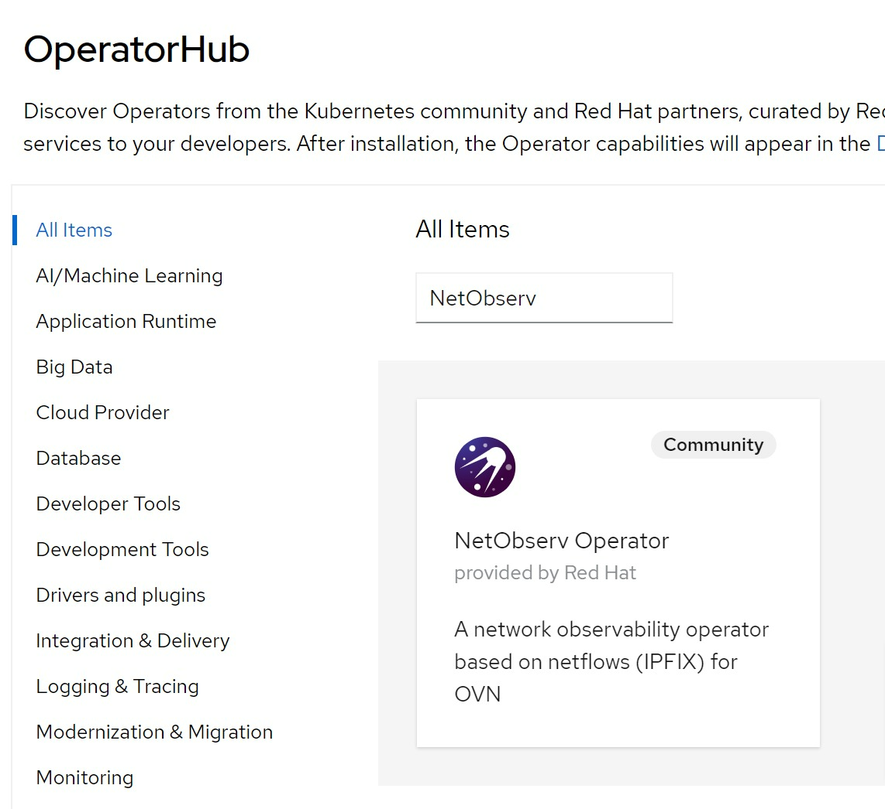
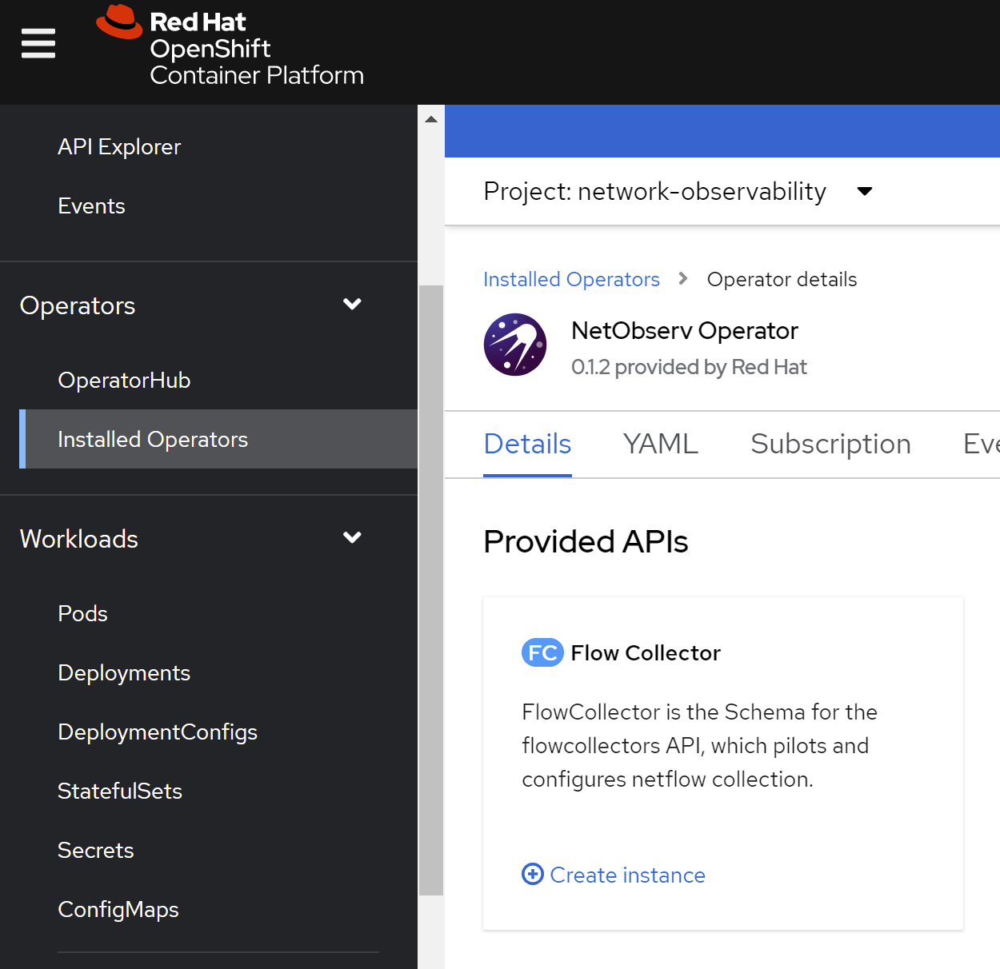
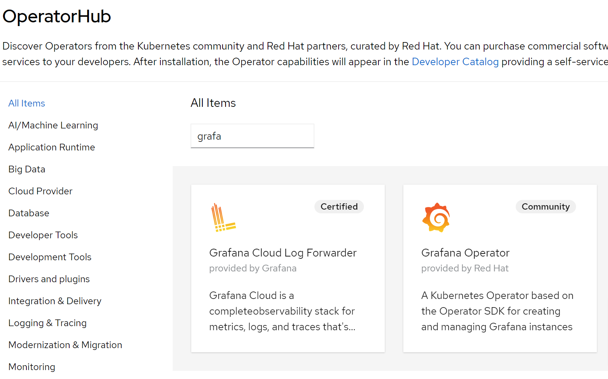
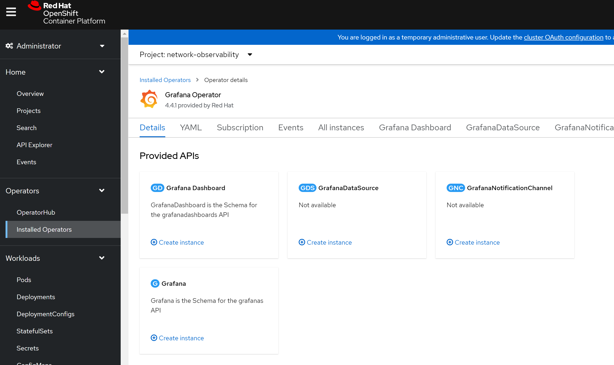
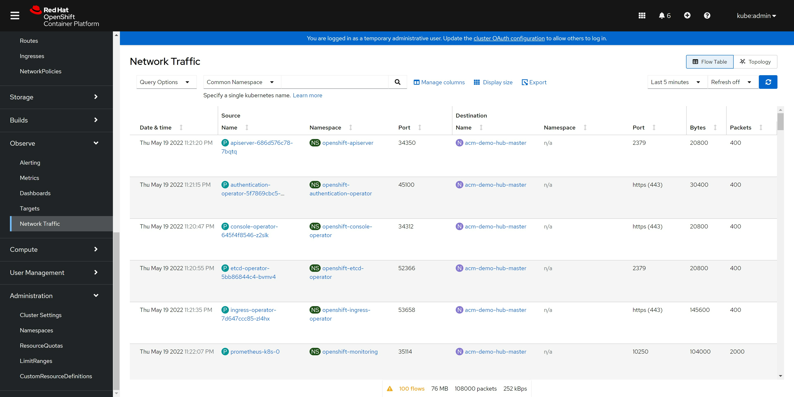
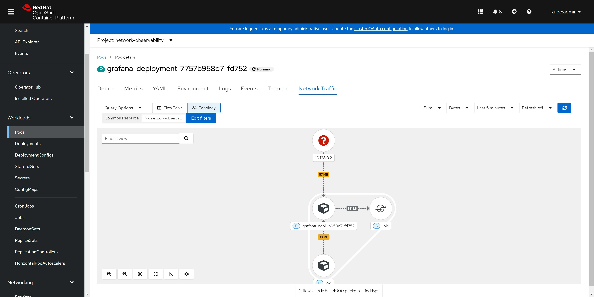
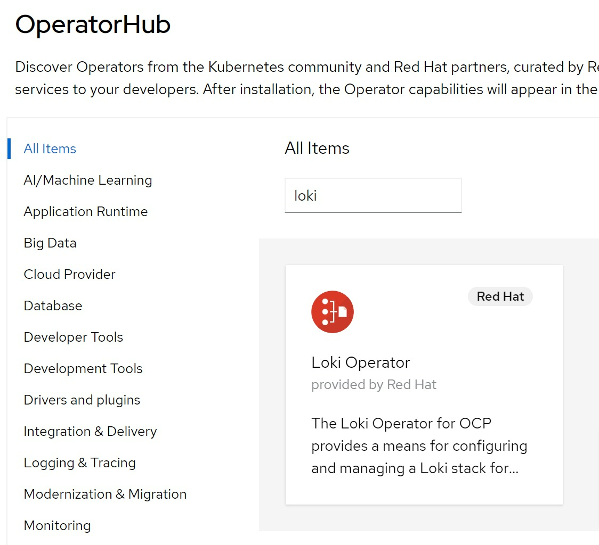

# show netflow table in openshift 4.10

<!-- openshift 4 network observability is a new feature, it use ebpf to get netflow, and show in the UI.

- [Network Observability Operator in OpenShift Container Platform](https://docs.openshift.com/container-platform/4.10/networking/network_observability/understanding-network-observability-operator.html) -->

begin in openshift 4.10, admin can set ovs to export netflow to a remote server

- [offical document: Tracking network flows](https://docs.openshift.com/container-platform/4.10/networking/ovn_kubernetes_network_provider/tracking-network-flows.html)

# install [lvm operator](https://github.com/red-hat-storage/lvm-operator)

we need local storage, and we are single node openshift, so we use lvm operator, find the operator from operator hub and install :

  

lvm operator is in TP, so it is buggy, we need some fix.

```bash

oc create ns lvm-operator-system

ssh -tt core@192.168.7.13 -- lsblk
# NAME   MAJ:MIN RM   SIZE RO TYPE MOUNTPOINT
# sr0     11:0    1  1024M  0 rom
# vda    252:0    0   120G  0 disk
# ├─vda1 252:1    0     1M  0 part
# ├─vda2 252:2    0   127M  0 part
# ├─vda3 252:3    0   384M  0 part /boot
# └─vda4 252:4    0 119.5G  0 part /sysroot
# vdb    252:16   0   100G  0 disk

oc adm policy add-cluster-role-to-user cluster-admin system:serviceaccount:lvm-operator-system:topolvm-controller -n lvm-operator-system

oc adm policy add-cluster-role-to-user cluster-admin system:serviceaccount:lvm-operator-system:vg-manager -n lvm-operator-system

oc adm policy add-cluster-role-to-user cluster-admin system:serviceaccount:lvm-operator-system:topolvm-node -n lvm-operator-system

cat << EOF > /data/install/lvm.op.yaml
apiVersion: lvm.topolvm.io/v1alpha1
kind: LVMCluster
metadata:
  name: lvmcluster-sample
spec:
  storage:
    deviceClasses:
    - name: vg1
    #   thinPoolConfig:
    #     name: thin-pool-1
    #     sizePercent: 50
    #     overprovisionRatio: 50
EOF
oc create -n lvm-operator-system -f /data/install/lvm.op.yaml

kubectl patch storageclass odf-lvm-vg1 -p '{"metadata": {"annotations":{"storageclass.kubernetes.io/is-default-class":"true"}}}'

ssh -tt core@192.168.7.13 -- sudo pvs
#   PV         VG  Fmt  Attr PSize    PFree
#   /dev/vdb   vg1 lvm2 a--  <100.00g <100.00g

ssh -tt core@192.168.7.13 -- sudo vgs
#   VG  #PV #LV #SN Attr   VSize    VFree
#   vg1   1   0   0 wz--n- <100.00g <100.00g

oc get lvmvolumegroup vg1 -oyaml -n lvm-operator-system
# apiVersion: lvm.topolvm.io/v1alpha1
# kind: LVMVolumeGroup
# metadata:
#   creationTimestamp: "2022-05-19T08:59:24Z"
#   generation: 1
#   name: vg1
#   namespace: lvm-operator-system
#   resourceVersion: "37141"
#   uid: c67e2c71-06bc-42f8-be3e-18b7df220725
# spec: {}

oc get lvmvolumegroupnodestatuses.lvm.topolvm.io acm-demo-hub-master -oyaml -n lvm-operator-system
# apiVersion: lvm.topolvm.io/v1alpha1
# kind: LVMVolumeGroupNodeStatus
# metadata:
#   creationTimestamp: "2022-05-19T09:02:34Z"
#   generation: 1
#   name: acm-demo-hub-master
#   namespace: lvm-operator-system
#   resourceVersion: "38271"
#   uid: bc37f640-444c-4cca-bb2e-9235408b52e1
# spec:
#   nodeStatus:
#   - devices:
#     - /dev/vdb
#     name: vg1
#     status: Ready

oc get storageclass
# NAME          PROVISIONER          RECLAIMPOLICY   VOLUMEBINDINGMODE      ALLOWVOLUMEEXPANSION   AGE
# odf-lvm-vg1   topolvm.cybozu.com   Delete          WaitForFirstConsumer   true                   17m

kubectl patch storageclass odf-lvm-vg1 -p '{"metadata": {"annotations":{"storageclass.kubernetes.io/is-default-class":"true"}}}'

cat << EOF > /data/install/lvm.op.pvc.sample.yaml
apiVersion: v1
kind: PersistentVolumeClaim
metadata:
  name: lvm-file-pvc
spec:
  volumeMode: Filesystem
  accessModes:
    - ReadWriteOnce
  resources:
    requests:
      storage: 5Gi
  storageClassName: odf-lvm-vg1
EOF
oc create -f /data/install/lvm.op.pvc.sample.yaml -n default

cat <<EOF > /data/install/lvm.op.app.sample.yaml
apiVersion: v1
kind: Pod
metadata:
  name: app-file
spec:
  containers:
  - name: app-file
    image: registry.access.redhat.com/ubi8/ubi:8.4
    imagePullPolicy: IfNotPresent
    command: ["/usr/bin/bash", "-c", "/usr/bin/tail -f /dev/null"]
    volumeMounts:
    - mountPath: "/mnt/file"
      name: lvm-file-pvc
  volumes:
    - name: lvm-file-pvc
      persistentVolumeClaim:
        claimName: lvm-file-pvc
EOF
oc create -f /data/install/lvm.op.app.sample.yaml -n default

ssh -tt core@192.168.7.13 -- sudo lvs
#   LV                                   VG  Attr       LSize Pool Origin Data%  Meta%  Move Log Cpy%Sync Convert
#   34f10bb3-ebd0-4eab-acc9-41b68de832d0 vg1 -wi-ao---- 5.00g

```

# install NetObserv Operator

## install loki

following netobserv operator's installation guide, you can install a simplified version of loki.


```bash
# install Loki
kubectl create namespace network-observability

# oc delete ns network-observability

wget https://raw.githubusercontent.com/netobserv/documents/main/examples/zero-click-loki/1-storage.yaml
wget https://raw.githubusercontent.com/netobserv/documents/main/examples/zero-click-loki/2-loki.yaml

kubectl apply -f /data/install/1-storage.yaml -n network-observability
kubectl apply -f /data/install/2-loki.yaml -n network-observability

# oc delete -f /data/install/2-loki.yaml -n network-observability
# oc delete -f /data/install/1-storage.yaml -n network-observability

```

## install NetObserv Operator

find the netobserv operator from operator hub, and install:

  

create flow collector with default config:

  


```bash

# check the result 
for pod in $(oc get pods -n openshift-ovn-kubernetes -l app=ovnkube-node -o jsonpath='{range@.items[*]}{.metadata.name}{"\n"}{end}'); do  echo; echo $pod; oc -n openshift-ovn-kubernetes exec -c ovnkube-node $pod \
  -- bash -c 'for type in ipfix sflow netflow ; do ovs-vsctl find $type ; done'; done
# ovnkube-node-988rk
# _uuid               : 6a6c11b7-157c-4cce-be66-9bafec4627de
# cache_active_timeout: 60
# cache_max_flows     : 100
# external_ids        : {}
# obs_domain_id       : []
# obs_point_id        : []
# other_config        : {}
# sampling            : 400
# targets             : ["192.168.7.13:2055"]
```

## install grafana

select grafana community operator

  

create grafana instance with default setting

  

```bash

# create a route by yourself
oc expose service/grafana-service -n network-observability

oc get route  -n network-observability
# NAME              HOST/PORT                                                            PATH   SERVICES          PORT      TERMINATION   WILDCARD
# grafana-service   grafana-service-network-observability.apps.acm-demo-hub.redhat.ren          grafana-service   grafana                 None

# get username and password of the grafana
oc get secret/grafana-admin-credentials  -n network-observability -o json | jq -r .data.GF_SECURITY_ADMIN_USER | base64 -d && echo
# admin
oc get secret/grafana-admin-credentials  -n network-observability -o json | jq -r .data.GF_SECURITY_ADMIN_PASSWORD | base64 -d && echo
# ggQhu8PwVS0poQ==

# create a grafana and import dashboards
# https://github.com/netobserv/network-observability-operator/blob/release-4.10/config/samples/dashboards/Network%20Observability.json

```

import dashboards from :
- https://github.com/netobserv/network-observability-operator/blob/release-4.10/config/samples/dashboards/Network%20Observability.json

create loki datasource:

  

then the result:

  

## from openshift console

  

  

<!--    -->

  

# end


## install loki operator

  


